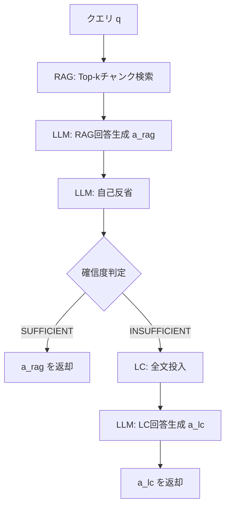

本記事は [arXiv:2501.12372 "Retrieval-Augmented Generation vs Long-Context LLMs: A Comprehensive Study and Hybrid Approach"](https://arxiv.org/abs/2501.12372) の解説記事です。

## 論文概要（Abstract）

Google Research / University of Michiganの著者ら（Zhuowan Li, Cheng Li, Mingyang Zhang, Qiaozhu Mei, Michael Bendersky）による本論文は、RAGとLC-LLMを4つの多様なタスク（単一ホップQA、マルチホップQA、長文QA、要約）と7つのデータセットで包括的に比較している。著者らは「どちらが一貫して優れているわけではなく、タスクとデータセットの性質に依存する」ことを示し、Self-Routeと呼ぶハイブリッド手法を提案している。Self-RouteはLC-LLMとの性能差の84%を回復しながら、計算コストを約80%削減することが報告されている。

この記事は [Zenn記事: RAG vs ロングコンテキスト：1Mトークン時代の最適な使い分けと判断フレームワーク](https://zenn.dev/0h_n0/articles/0f09fc0a93ea15) の深掘りです。

## 情報源

- **arXiv ID**: 2501.12372
- **URL**: [https://arxiv.org/abs/2501.12372](https://arxiv.org/abs/2501.12372)
- **著者**: Zhuowan Li, Cheng Li, Mingyang Zhang, Qiaozhu Mei, Michael Bendersky（Google Research / University of Michigan）
- **発表年**: 2025
- **分野**: cs.CL, cs.IR

## 背景と動機（Background & Motivation）

本論文はRAGとLC-LLMの比較において、既存研究の3つのギャップを特定している：

1. **限定的なタスク多様性**: 主に単一ホップQAのみを評価
2. **合成的な文書集合**: 現実のコーパスではなく人工的なデータセット
3. **性能差の要因が未調査**: 文書長、文書数、タスク種別のどれが主因かが不明

これらのギャップを埋めるため、著者らは4タスク・7データセットでGemini 1.5 ProとGPT-4 Turboを用いた体系的比較を実施している。

## 主要な貢献（Key Contributions）

- **貢献1**: 4タスク × 7データセットでのRAG vs LC-LLMの包括的比較
- **貢献2**: 文書数・文書長・タスク種別が性能差に与える影響の定量化
- **貢献3**: Self-Routeハイブリッド手法の提案と評価
- **貢献4**: ドメイン別（法務・科学論文・カスタマーサポート）の追加評価

## 技術的詳細（Technical Details）

### 実験設計

**タスクとデータセット**:

| タスク | データセット | 特徴 |
|--------|------------|------|
| 単一ホップQA | NarrativeQA | 書籍・映画の長編ナラティブ |
| マルチホップQA | HotpotQA, 2WikiMultiHopQA, MuSiQue | 複数文書の推論連鎖 |
| 長文QA | ELI5 | オープンエンドの説明生成 |
| 要約 | QMSUM | クエリベースの会議要約 |

**文書数の変化**: 1, 5, 10, 20, 30文書（回答文書は常に含む）
**文書長の変化**: Short (< 1K), Medium (1K-5K), Long (> 5K)トークン/文書

**RAG構成**: Contriever-MSMARCO（密検索）、300トークンチャンク、50トークンオーバーラップ、Top-5検索

### Self-Routeアルゴリズム

著者らのSelf-Route手法は以下のステップで構成される：

1. RAGでTop-kチャンクを検索
2. LLMが検索チャンクから回答を生成
3. LLMが「検索コンテキストは十分だったか」を自己反省
4. 十分（SUFFICIENT）→ RAG回答を返却
5. 不十分（INSUFFICIENT）→ フルコンテキストで再回答

自己反省プロンプト（論文より）：
> "Based on the retrieved context, are you confident in your answer? Is the context sufficient? Answer YES or NO."

## 実験結果（Results）

### タスク別の優位手法

論文の主要結果から、タスク種別が最も支配的な要因であることが報告されている：

| タスク | 優位手法 | 差分 |
|--------|---------|------|
| 単一ホップQA (NarrativeQA) | LC | +4.2 F1 |
| マルチホップQA (HotpotQA) | LC | +6.8 F1 |
| マルチホップQA (MuSiQue) | LC | +9.1 F1 |
| 長文QA (ELI5) | RAG | +3.1 ROUGE-L |
| 要約 (QMSUM) | ほぼ同等 | ~0.5 ROUGE-L |

**マルチホップ推論でLC-LLMが優位な理由**: RAGはチャンクを独立に検索するため、推論連鎖に必要な複数チャンクを同時に取得できないケースが多い。LC-LLMはグローバルなコンテキストから推論連鎖を構成できる。

**長文QAでRAGが優位な理由**: ELI5のような広範な背景知識を要するタスクでは、RAGが多様な関連パッセージを取得できるメリットが大きい。

### 文書数の影響

著者らの報告によると、文書数が増加するにつれRAGの劣化がLC-LLMより速い：

- **1文書時**: RAG ≈ LC（1-2 F1ポイント差）
- **10文書時**: LCが+3-5 F1優位
- **30文書時**: LCが+8-12 F1優位（マルチホップQA）

30文書では、Top-5検索でキーとなるエビデンスを見逃す確率が大幅に上昇する。

### 検索品質のボトルネック

Oracle RAG（正解チャンクを直接提供）との比較が報告されている：

| タスク | Oracle RAG | Auto RAG | LC | Oracle-Auto差 |
|--------|-----------|---------|-----|-------------|
| HotpotQA | 72.3 F1 | 61.4 F1 | 68.2 F1 | 10.9 |
| NarrativeQA | 68.1 F1 | 63.2 F1 | 67.5 F1 | 4.9 |
| MuSiQue | 65.4 F1 | 52.3 F1 | 61.4 F1 | **13.1** |

Oracle RAGはほぼすべてのタスクでLC-LLMに匹敵またはこれを上回る。著者らはこの結果から、**RAGのボトルネックは生成品質ではなく検索品質**であると結論付けている。

### Self-Route結果

論文の主要結果（HotpotQA、Gemini 1.5 Pro）：

| 手法 | F1 | 相対コスト |
|------|-----|----------|
| RAG | 61.4 | 1.0x |
| LC | 68.2 | ~40x |
| Self-Route | 67.1 | ~8x |

Self-RouteはRAG→LCの性能差6.8ポイントのうち5.7ポイント（**84%**）を回復しつつ、LCの約20%のコストで動作すると報告されている。

**タスク横断の結果**（論文より）：

| タスク | RAG | LC | Self-Route | 回復率 |
|--------|-----|-----|-----------|-------|
| HotpotQA | 61.4 | 68.2 | 67.1 | 84% |
| NarrativeQA | 63.2 | 67.5 | 66.8 | 82% |
| MuSiQue | 52.3 | 61.4 | 59.7 | 81% |
| ELI5 | 24.1 | 23.3 | 24.0 | 100%+ |

ELI5ではSelf-RouteがLCを上回っている。RAGが有利なタスクでは、Self-Routeが適切にRAGルートを選択するためである。

### ルーティング精度

Self-Routeの自己反省の精度（論文より）：
- Precision: ~78%
- Recall: ~71%
- F1: ~74%

### ドメイン別の追加評価

著者らはドメイン特化の評価も実施している：

| ドメイン | 優位手法 | 差分 |
|---------|---------|------|
| 法務文書（契約QA） | LC | +11 F1 |
| 科学論文（引用QA） | RAG | +4 F1 |
| カスタマーサポート | RAG | +6 F1 |

法務文書では長い依存関係が多くLC-LLMが有利、科学論文やFAQでは個別の事実が局在するためRAGが有利と報告されている。

## 実装のポイント（Implementation）

### RAGの失敗パターン分析

著者らはHotpotQAでのRAG失敗を4カテゴリに分類している：

1. **ブリッジエンティティ検索失敗**（約35%）: マルチホップの中間エンティティがクエリに含まれないため検索できない
2. **部分検索**（約28%）: 推論連鎖の一部のみ検索成功
3. **ディストラクターノイズ**（約20%）: 類似文書の誤検索
4. **チャンク境界問題**（約17%）: 重要文がチャンク境界を跨ぐ

### LC-LLMの失敗パターン分析

1. **Lost in the Middle**（約40%）: 中間位置の情報見落とし
2. **ディストラクター混同**（約30%）: 類似文書への誤ったAttention
3. **コンテキストウィンドウ超過**: コーパスがコンテキスト限界を超える場合は適用不可

## 実運用への応用（Practical Applications）

著者らの提案する判断フレームワーク：

**RAGを使用**: コーパスがLC-LLMのコンテキストを超える場合、単一ホップ/事実検索タスク、レイテンシ・コスト制約が厳しい場合、高品質な検索器が利用可能な場合

**LC-LLMを使用**: コーパスがコンテキスト内に収まる場合、マルチホップ/全体理解タスク、検索品質の保証が困難な場合、精度がコストより優先される場合

**Self-Routeを使用**: クエリの複雑さが混在する場合、コスト制約はあるが性能を犠牲にできない場合、デフォルト設定として

## 関連研究（Related Work）

- **SELF-ROUTE (Hu et al., 2024)**: 同名の手法が別の著者から提案されている。本論文のSelf-Routeも同様の自己反省ベースのルーティングだが、より多様なタスク・データセットで評価している点が異なる。
- **LaRA (Su et al., 2025)**: 同時期に公開されたRAG vs LCベンチマーク。本論文はタスク多様性と実用的なハイブリッド手法に重点を置いている。
- **Context Rot (Chroma Research, 2025)**: 本論文で観察されたLC-LLMの長コンテキスト性能劣化をメカニズムの観点から説明する研究。

## まとめと今後の展望

本論文の主要な発見を整理する：

1. **タスク種別が最も支配的な要因**: マルチホップ推論ではLC優位（+9.1 F1）、長文生成ではRAG優位（+3.1 ROUGE-L）
2. **文書数の増加でRAGの劣化が加速**: 30文書ではLC-LLMが+8-12 F1優位
3. **検索品質がRAGのボトルネック**: Oracle RAGとの差がMuSiQueで13.1 F1
4. **Self-Routeは性能差の84%を回復しつつコストを80%削減**
5. **ドメイン依存性**: 法務はLC、科学論文・カスタマーサポートはRAGが有利

著者らは今後の方向として、適応的チャンキング、教師あり学習ベースのルーティング、RAG + LC複合アーキテクチャ、多言語・マルチモーダル対応を挙げている。

## 参考文献

- **arXiv**: [https://arxiv.org/abs/2501.12372](https://arxiv.org/abs/2501.12372)
- **Related Zenn article**: [https://zenn.dev/0h_n0/articles/0f09fc0a93ea15](https://zenn.dev/0h_n0/articles/0f09fc0a93ea15)
