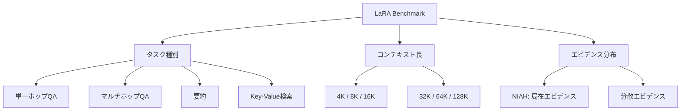

本記事は [arXiv:2502.09977 "LaRA: Benchmarking Retrieval-Augmented Generation and Long-Context LLMs"](https://arxiv.org/abs/2502.09977) の解説記事です。

## 論文概要（Abstract）

LaRA（Large-scale RAG Assessment）は、Retrieval-Augmented Generation（RAG）とLong-Context LLM（LC-LLM）を公平に比較するために設計された大規模ベンチマークである。著者らは4種類のタスク（単一ホップQA、マルチホップQA、要約、Key-Value検索）、6段階のコンテキスト長（4K〜128Kトークン）、2種類のエビデンス分布シナリオ（Needle-in-a-Haystack / 分散エビデンス）を組み合わせ、8つのLLMバックボーンと4つのRAGパイプライン構成で体系的に評価を行っている。

この記事は [Zenn記事: RAG vs ロングコンテキスト：1Mトークン時代の最適な使い分けと判断フレームワーク](https://zenn.dev/0h_n0/articles/0f09fc0a93ea15) の深掘りです。

## 情報源

- **arXiv ID**: 2502.09977
- **URL**: [https://arxiv.org/abs/2502.09977](https://arxiv.org/abs/2502.09977)
- **著者**: Weihang Su, Yichen Tang, Qingyao Ai, Zhijing Wu, Yiqun Liu et al.
- **発表年**: 2025
- **分野**: cs.CL, cs.IR
- **採択**: ICML 2025

## 背景と動機（Background & Motivation）

LLMに外部知識を提供する手法として、RAG（関連チャンクを検索して投入）とLC-LLM（全文をコンテキストに投入）の2つのパラダイムが存在する。Gemini 1.5 Proの1Mトークン対応やGPT-4oの128K対応により、「RAGパイプラインを構築せずとも全文投入で十分ではないか」という議論が活発化している。

しかし、著者らは既存の比較研究に以下の限界があると指摘している：

- タスク種別が1〜2種類に限定されている
- コンテキスト長が単一レベルのみ
- エビデンス分布（局在 vs 分散）が制御されていない
- モデルの多様性が不足している

LaRAはこれらの限界を解消する統一ベンチマークとして提案された。

## 主要な貢献（Key Contributions）

- **貢献1**: 4タスク × 6コンテキスト長 × 2エビデンスシナリオの大規模ベンチマーク（4,224評価インスタンス）を構築
- **貢献2**: 8つのLLMバックボーン（GPT-4o, Claude 3.5 Sonnet, Gemini 1.5 Pro, Llama-3.1-8B/70B, Qwen2.5-72B, Mistral-7B）× 4つのRAG構成で体系評価
- **貢献3**: タスク特性・エビデンス分布・コンテキスト長がRAG/LC選択に与える影響を定量化
- **貢献4**: ベンチマークとコードを公開

## 技術的詳細（Technical Details）

### ベンチマーク設計

LaRAの設計は3つの次元で構成される。



**タスク種別の詳細**:

| タスク | データソース | 評価指標 | 特徴 |
|--------|------------|---------|------|
| 単一ホップQA | Natural Questions, TriviaQA | EM, F1 | 単一パッセージに回答根拠 |
| マルチホップQA | HotpotQA, MuSiQue | EM, F1 | 2〜5チャンクの推論連鎖 |
| 要約 | GovReport, QMSum | ROUGE-L, BERTScore | 全文の情報統合 |
| KV検索 | 合成データ | EM | 純粋な検索能力の分離評価 |

**コンテキスト長の制御**: 目標長に到達するまで、BM25類似度に基づいて選択されたディストラクター文書（ハードネガティブ）でパディングを行う。これにより、単に長くするだけでなく、検索の難易度も現実的に制御している。

### RAG構成

著者らは4種類のRAGパイプラインを評価している：

| 構成 | 検索手法 | チャンク数 | 特徴 |
|------|---------|----------|------|
| RAG-BM25 | BM25（疎検索） | Top-5 | 語彙マッチング |
| RAG-Dense | E5-large-v2（密検索） | Top-5 | 意味的マッチング |
| RAG-Hybrid | BM25 + E5（RRFフュージョン） | Top-5 | 複合検索 |
| RAG-Oracle | 正解チャンク | ゴールド | 上界（理論的最大性能） |

チャンキング戦略は固定サイズ512トークン、64トークンのオーバーラップである。

### 評価プロトコル

全評価は0-shotプロンプティングで実施。QAタスクはExact MatchとToken-level F1、要約はROUGEスコア + BERTScore、KV検索はExact Matchで評価される。統計的有意性はpaired t-test（p < 0.05）で検定されている。

## 実験結果（Results）

### 全体傾向：RAG vs LC-LLMの性能比較

著者らの主要な発見は、**RAGもLC-LLMも万能ではない**という点である。GPT-4oバックボーンでの平均性能を以下に示す（論文Table 2より）：

| 手法 | 単一ホップQA (F1) | マルチホップQA (F1) | 要約 (ROUGE-L) | KV検索 (EM) |
|------|------------------|-------------------|---------------|------------|
| LC-LLM | 62.3 | 48.7 | 41.2 | 71.4 |
| RAG-BM25 | 71.8 | 44.2 | 35.6 | 82.3 |
| RAG-Dense | 74.1 | 45.9 | 36.8 | 85.7 |
| RAG-Hybrid | 75.3 | 46.8 | 37.4 | 87.1 |
| RAG-Oracle | 88.2 | 61.3 | 42.9 | 99.6 |

**単一ホップQA・KV検索ではRAGが優位**である。RAG-Hybridは単一ホップQAでLC-LLMに対して+13.0 F1の差をつけている。一方、**要約ではLC-LLMが優位**で、RAG-Hybridに対して+3.8 ROUGE-Lの差がある。マルチホップQAでは両者が拮抗するが、RAG-Oracleが61.3 F1と大幅に上回ることから、**検索品質がRAGのボトルネック**であることが示されている。

### コンテキスト長の影響

論文の重要な発見として、コンテキスト長が増加するにつれRAGとLC-LLMの差が拡大する：

**単一ホップQA（GPT-4o）**:
- 4Kトークン時: LC-LLM 78.2 F1 → 128Kトークン時: 51.3 F1（**-26.9ポイント**の劣化）
- RAGは検索品質に依存するため、コンテキスト長の影響は限定的

**要約**:
- 4Kトークン時: LC-LLM 43.1 vs RAG-Hybrid 40.8（ほぼ同等）
- 128Kトークン時: LC-LLM 38.9 vs RAG-Hybrid 31.2（LC-LLMが+7.7の差）

この非対称性は、RAGがTop-Kチャンクのみを取得するため、長いコンテキストでは多くの関連情報を取りこぼすことに起因する。

### エビデンス分布シナリオの影響

**Needle-in-a-Haystack（NIAH）シナリオ**: RAGがLC-LLMを大幅に上回る。64KトークンでのKV検索ではRAG-Hybrid 87.1 EM vs LC-LLM 71.4 EM。

**分散エビデンスシナリオ**: LC-LLMの優位が顕在化する。要約タスクでLC-LLM 38.9 ROUGE-L vs RAG-Hybrid 31.2。

### モデルサイズの影響

論文Table中のデータから、**小規模モデルほどRAGの恩恵が大きい**ことが確認されている（64Kトークン時の単一ホップQA F1）：

| モデル | LC-LLM | RAG-Hybrid | RAG恩恵 |
|--------|--------|-----------|---------|
| GPT-4o | 55.1 | 74.2 | +19.1 |
| Gemini 1.5 Pro | 61.7 | 73.1 | +11.4 |
| Llama-3.1-70B | 49.2 | 69.4 | +20.2 |
| Llama-3.1-8B | 38.4 | 64.1 | **+25.7** |
| Mistral-7B | 34.2 | 58.7 | **+24.5** |

Gemini 1.5 ProはLC-LLMとしての性能が最も高く（専用の長コンテキスト訓練の恩恵と考えられる）、RAGの恩恵が相対的に小さい。

### Lost-in-the-Middle問題の定量化

論文で報告されているLC-LLMの位置バイアス（64Kトークン、単一ホップQA）：

| エビデンス位置 | LC-LLM F1 |
|-------------|----------|
| 先頭（上位10%） | 68.4 |
| 中間（40-60%） | 41.2 |
| 末尾（下位10%） | 65.7 |

著者らは「典型的なU字型カーブ」と表現しており、RAGは位置に依存しない（均一に74.2 F1）ことを確認している。

### 計算コスト比較

論文で報告されている64Kコンテキストでの推論コスト比較：

| 手法 | レイテンシ (秒) | コスト ($/1Kクエリ) |
|------|---------------|-------------------|
| LC-LLM (GPT-4o) | 18.3 | $12.80 |
| RAG-BM25 + GPT-4o | 3.2 | $1.40 |
| RAG-Hybrid + GPT-4o | 4.8 | $1.62 |

RAGはLC-LLMに対して4〜5倍高速、約8倍低コストであると報告されている。

## 実装のポイント（Implementation）

### アブレーション：チャンクサイズの最適化

論文のアブレーション結果（Table 5より）：

| チャンクサイズ | 単一ホップQA (F1) | マルチホップQA (F1) |
|-------------|------------------|-------------------|
| 128トークン | 68.4 | 42.1 |
| 256トークン | 71.9 | 44.8 |
| 512トークン | **75.3** | **46.8** |
| 1024トークン | 73.1 | 46.2 |

512トークンが最適とされている。128トークンでは文脈が不足し、1024トークンではノイズが増加する。

### Top-K検索チャンク数の影響

| Top-K | 単一ホップQA (F1) | マルチホップQA (F1) | レイテンシ (秒) |
|-------|------------------|-------------------|---------------|
| 1 | 63.2 | 36.4 | 1.8 |
| 3 | 71.4 | 43.7 | 2.5 |
| 5 | **75.3** | 46.8 | 3.2 |
| 10 | 74.8 | **47.9** | 5.1 |

Top-5が性能とコストのバランスが最も良いと報告されている。Top-10はマルチホップで若干改善するが、コストが1.6倍になる。

### HyDE（Hypothetical Document Embeddings）の効果

RAG-DenseにHyDEを追加した場合の改善（論文Table 5より）：
- 単一ホップQA: +2.1 F1
- マルチホップQA: +3.8 F1
- 要約: +1.2 ROUGE-L

クエリ拡張は特にマルチホップタスクで効果が高いことが示されている。

### 検索品質のボトルネック

RAG-Hybrid（75.3 F1）とRAG-Oracle（88.2 F1）の差は**12.9ポイント**であり、著者らはこれを「検索天井」と呼んでいる。この差は、LLMモデルをスケールアップするよりも、検索品質を改善する（例：より良いエンベディングモデル、クエリ拡張、リランキング）方が高いレバレッジであることを示唆している。

## Production Deployment Guide

### AWS実装パターン（コスト最適化重視）

LaRAの知見に基づくRAG/LCハイブリッドシステムのAWS構成を示す。

**トラフィック量別の推奨構成**:

| 規模 | 月間リクエスト | 推奨構成 | 月額コスト | 主要サービス |
|------|--------------|---------|-----------|------------|
| **Small** | ~3,000 (100/日) | Serverless | $50-150 | Lambda + Bedrock + DynamoDB |
| **Medium** | ~30,000 (1,000/日) | Hybrid | $300-800 | Lambda + ECS Fargate + ElastiCache |
| **Large** | 300,000+ (10,000/日) | Container | $2,000-5,000 | EKS + Karpenter + EC2 Spot |

**Small構成の詳細** (月額$50-150):
- **Lambda**: 1GB RAM, 30秒タイムアウト ($20/月)
- **Bedrock**: Claude 3.5 Haiku, Prompt Caching有効 ($80/月)
- **DynamoDB**: On-Demand ($10/月)
- **CloudWatch**: 基本監視 ($5/月)

**コスト削減テクニック**:
- Bedrock Batch API使用で50%削減（非リアルタイム処理向け）
- Prompt Caching有効化で30-90%削減
- Spot Instances使用で最大90%削減（EKS + Karpenter）

**コスト試算の注意事項**: 上記は2026年3月時点のAWS ap-northeast-1（東京）リージョン料金に基づく概算値です。実際のコストはトラフィックパターンやリージョンにより変動します。最新料金は [AWS料金計算ツール](https://calculator.aws/) で確認してください。

### Terraformインフラコード

**Small構成 (Serverless): Lambda + Bedrock + DynamoDB**

```hcl
module "vpc" {
  source  = "terraform-aws-modules/vpc/aws"
  version = "~> 5.0"

  name = "lara-rag-vpc"
  cidr = "10.0.0.0/16"
  azs  = ["ap-northeast-1a", "ap-northeast-1c"]
  private_subnets = ["10.0.1.0/24", "10.0.2.0/24"]

  enable_nat_gateway   = false
  enable_dns_hostnames = true
}

resource "aws_iam_role" "lambda_bedrock" {
  name = "lara-lambda-bedrock-role"

  assume_role_policy = jsonencode({
    Version = "2012-10-17"
    Statement = [{
      Action    = "sts:AssumeRole"
      Effect    = "Allow"
      Principal = { Service = "lambda.amazonaws.com" }
    }]
  })
}

resource "aws_iam_role_policy" "bedrock_invoke" {
  role = aws_iam_role.lambda_bedrock.id
  policy = jsonencode({
    Version = "2012-10-17"
    Statement = [{
      Effect   = "Allow"
      Action   = ["bedrock:InvokeModel", "bedrock:InvokeModelWithResponseStream"]
      Resource = "arn:aws:bedrock:ap-northeast-1::foundation-model/anthropic.claude-3-5-haiku*"
    }]
  })
}

resource "aws_lambda_function" "rag_handler" {
  filename      = "lambda.zip"
  function_name = "lara-rag-handler"
  role          = aws_iam_role.lambda_bedrock.arn
  handler       = "index.handler"
  runtime       = "python3.12"
  timeout       = 60
  memory_size   = 1024

  environment {
    variables = {
      BEDROCK_MODEL_ID    = "anthropic.claude-3-5-haiku-20241022-v1:0"
      DYNAMODB_TABLE      = aws_dynamodb_table.cache.name
      ENABLE_PROMPT_CACHE = "true"
    }
  }
}

resource "aws_dynamodb_table" "cache" {
  name         = "lara-rag-cache"
  billing_mode = "PAY_PER_REQUEST"
  hash_key     = "query_hash"

  attribute {
    name = "query_hash"
    type = "S"
  }

  ttl {
    attribute_name = "expire_at"
    enabled        = true
  }
}
```

**Large構成 (Container): EKS + Karpenter + Spot Instances**

```hcl
module "eks" {
  source  = "terraform-aws-modules/eks/aws"
  version = "~> 20.0"

  cluster_name    = "lara-rag-cluster"
  cluster_version = "1.31"

  vpc_id     = module.vpc.vpc_id
  subnet_ids = module.vpc.private_subnets

  cluster_endpoint_public_access = true
  enable_cluster_creator_admin_permissions = true
}

resource "kubectl_manifest" "karpenter_provisioner" {
  yaml_body = <<-YAML
    apiVersion: karpenter.sh/v1
    kind: NodePool
    metadata:
      name: spot-pool
    spec:
      template:
        spec:
          requirements:
            - key: karpenter.sh/capacity-type
              operator: In
              values: ["spot"]
            - key: node.kubernetes.io/instance-type
              operator: In
              values: ["m7i.xlarge", "m7i.2xlarge"]
          limits:
            cpu: "64"
            memory: "256Gi"
      disruption:
        consolidationPolicy: WhenEmpty
        consolidateAfter: 30s
  YAML
}

resource "aws_budgets_budget" "monthly" {
  name         = "lara-monthly-budget"
  budget_type  = "COST"
  limit_amount = "5000"
  limit_unit   = "USD"
  time_unit    = "MONTHLY"

  notification {
    comparison_operator       = "GREATER_THAN"
    threshold                 = 80
    threshold_type            = "PERCENTAGE"
    notification_type         = "ACTUAL"
    subscriber_email_addresses = ["ops@example.com"]
  }
}
```

### セキュリティベストプラクティス

- **IAMロール**: 最小権限の原則（Bedrock InvokeModelのみ許可）
- **シークレット管理**: AWS Secrets Manager使用、環境変数ハードコード禁止
- **暗号化**: S3/DynamoDB全てKMS暗号化
- **監査**: CloudTrail全リージョン有効化

### 運用・監視設定

```python
import boto3

cloudwatch = boto3.client('cloudwatch')

cloudwatch.put_metric_alarm(
    AlarmName='lara-bedrock-token-spike',
    ComparisonOperator='GreaterThanThreshold',
    EvaluationPeriods=1,
    MetricName='TokenUsage',
    Namespace='AWS/Bedrock',
    Period=3600,
    Statistic='Sum',
    Threshold=500000,
    ActionsEnabled=True,
    AlarmActions=['arn:aws:sns:ap-northeast-1:123456789:cost-alerts'],
    AlarmDescription='Bedrockトークン使用量異常'
)
```

### コスト最適化チェックリスト

- [ ] ~100 req/日 → Lambda + Bedrock (Serverless) - $50-150/月
- [ ] ~1000 req/日 → ECS Fargate + Bedrock (Hybrid) - $300-800/月
- [ ] 10000+ req/日 → EKS + Spot Instances (Container) - $2,000-5,000/月
- [ ] Spot Instances優先（最大90%削減）
- [ ] Bedrock Batch API使用（50%削減）
- [ ] Prompt Caching有効化（30-90%削減）
- [ ] Lambda メモリサイズ最適化
- [ ] ECS/EKS アイドル時スケールダウン
- [ ] AWS Budgets 月額予算設定
- [ ] CloudWatch アラーム設定
- [ ] Cost Anomaly Detection有効化
- [ ] 日次コストレポート設定
- [ ] 未使用リソース定期削除
- [ ] タグ戦略（環境別・プロジェクト別）
- [ ] S3ライフサイクルポリシー設定
- [ ] 開発環境夜間停止設定
- [ ] Reserved Instances検討（1年コミットで72%削減）
- [ ] Savings Plans検討
- [ ] トークン数制限（max_tokens設定）
- [ ] モデル選択ロジック（簡易タスクはHaiku、複雑タスクはSonnet）

## 実運用への応用（Practical Applications）

LaRAの知見を実運用に適用する際の指針を整理する。

**RAGを選択すべきケース**:
- 単一情報の検索（FAQボット、ナレッジベース検索）
- コスト制約が厳しい環境（RAGはLC-LLMの約1/8のコスト）
- 小規模モデルを使用する場合（8Bモデル + RAGで70B LC-LLMに匹敵）
- リアルタイム応答が求められる場合（3〜5秒 vs 18秒）

**LC-LLMを選択すべきケース**:
- 要約や文書分析（分散エビデンスの統合が必要）
- マルチホップ推論（エビデンス連鎖がチャンク境界を跨ぐ）
- 高い再現率が要求される場合
- 検索品質の保証が困難な場合

## 関連研究（Related Work）

- **Lost in the Middle (Liu et al., 2024)**: LC-LLMが中間位置のエビデンスを見落とす問題を初めて体系的に示した。LaRAはこの知見を位置バイアス分析で再確認している。
- **SELF-ROUTE (Li et al., 2025)**: RAGとLCを動的に切り替えるハイブリッド手法。LaRAの知見はSELF-ROUTEのルーティング判断に活用可能。
- **In-Context RALM (Ram et al., 2023)**: RAGがperplexityを改善することを示した先行研究。LaRAはタスク粒度での比較に進化させた。

## まとめと今後の展望

LaRAベンチマークは「RAGとLC-LLMのどちらが優れているか」という問いに対し、**タスク特性・エビデンス分布・コンテキスト長に依存する**という明確な回答を提供している。著者らの主要な発見は以下の通り：

1. 局在エビデンスのタスク（単一ホップQA、KV検索）ではRAGが優位
2. 分散エビデンスのタスク（要約）ではLC-LLMが優位
3. 検索品質がRAGの性能ボトルネック（Oracle RAGとの差12.9 F1）
4. 小規模モデルほどRAGの恩恵が大きい（8Bモデルで+25.7 F1）
5. Lost-in-the-Middleは2025年の最新モデルでも未解消（中間位置で-27.2 F1）

今後の研究方向として、著者らは自動的なRAG/LC切り替え、エビデンス分布を考慮したチャンキング戦略、多言語・マルチモーダル対応を挙げている。

## 参考文献

- **arXiv**: [https://arxiv.org/abs/2502.09977](https://arxiv.org/abs/2502.09977)
- **Related Zenn article**: [https://zenn.dev/0h_n0/articles/0f09fc0a93ea15](https://zenn.dev/0h_n0/articles/0f09fc0a93ea15)
