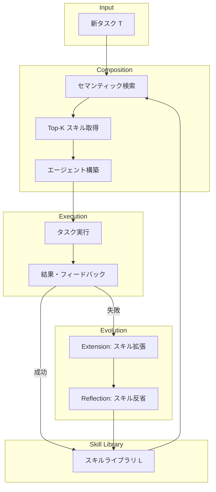

本記事は [arXiv:2503.00237](https://arxiv.org/abs/2503.00237) の解説記事です。

## 論文概要（Abstract）

EvoAgentは、LLMエージェントが継続的な探索（Continual Exploration）を通じて自律的にスキルを獲得・蓄積・改善する自己進化フレームワークです。著者ら（Qi He, Yansong Feng et al., Peking University）は、エージェントがタスクを解くたびにスキルライブラリを動的に拡張し、Composition（合成）・Extension（拡張）・Reflection（反省）の3つのメカニズムで既存スキルを再利用・改善する手法を提案しています。

この記事は [Zenn記事: Self-Evolving Applicationの設計パターンと自己修復インフラの実装戦略](https://zenn.dev/0h_n0/articles/949913945f34be) の深掘りです。

## 情報源

- **arXiv ID**: 2503.00237
- **URL**: [https://arxiv.org/abs/2503.00237](https://arxiv.org/abs/2503.00237)
- **著者**: Qi He, Yansong Feng et al.（Peking University, Wangxuan Institute of Computer Technology）
- **発表年**: 2025
- **分野**: cs.AI, cs.CL

## 背景と動機（Background & Motivation）

LLMベースのエージェントは特定タスクでは高い能力を発揮しますが、新しいタスクに直面するたびにゼロからプロンプトやツール構成を設計する必要があります。人間のエンジニアが経験を積むにつれてスキルセットを拡張していくように、エージェントも過去の経験を蓄積・再利用できるべきです。

従来のアプローチには以下の課題がありました。

- **ReAct**（Yao et al., 2023）: 思考-行動ループは1タスク内で完結し、タスク間でのスキル転移がない
- **Reflexion**（Shinn et al., 2023）: 自己反省で改善するが、改善結果がスキルとして永続化されない
- **Voyager**（Wang et al., 2023）: Minecraftに限定されたスキル学習で、一般的なエージェントタスクへの適用が困難

EvoAgentはこれらの限界を克服し、**タスク横断的なスキル進化**を実現することを目指しています。

## 主要な貢献（Key Contributions）

著者らは以下の貢献を主張しています。

- **貢献1**: 継続的探索によるエージェント自己進化のエンドツーエンドフレームワーク（EvoAgent）の提案
- **貢献2**: スキルライブラリを中核とした3つの進化メカニズム（Composition・Extension・Reflection）の設計
- **貢献3**: In-distribution（同一分布）とOut-of-distribution（未知分布）の両方のタスクで、既存手法を上回る性能を実証
- **貢献4**: 弱いLLMバックボーン＋EvoAgentが、自己進化なしの強力LLMと同等の性能を達成し、モデル間の能力ギャップを橋渡しできることを示した

## 技術的詳細（Technical Details）

### スキルライブラリのアーキテクチャ

EvoAgentの中核はスキルライブラリ（Skill Library）です。各スキルはPython関数として格納され、以下の構造を持ちます。

```python
@dataclass
class SkillEntry:
    """スキルライブラリの1エントリ"""
    skill_name: str           # スキル名（一意識別子）
    description: str          # 自然言語による説明
    code: str                 # Python関数コード
    metadata: dict            # 使用回数、成功率、作成タスク等
    embedding: list[float]    # セマンティック検索用の埋め込みベクトル
```

スキルは階層構造を持ち、あるスキルが別のスキルを呼び出すことが可能です。ライブラリはタスク経験の蓄積とともに動的に成長します。

### 全体アーキテクチャ



### メカニズム1: Skill Composition（スキル合成）

新タスクが与えられた際、まずスキルライブラリから関連スキルを検索・組み合わせてエージェントを構築します。

検索にはセマンティック類似度を使用します。タスク$T$のクエリ埋め込みを$\mathbf{q}_T$、スキル$s_i$の埋め込みを$\mathbf{e}_i$とすると、関連度スコアは以下で計算されます。

$$
\text{score}(T, s_i) = \frac{\mathbf{q}_T \cdot \mathbf{e}_i}{\|\mathbf{q}_T\| \|\mathbf{e}_i\|}
$$

ここで、
- $\mathbf{q}_T$: タスク記述文のテキスト埋め込み
- $\mathbf{e}_i$: スキル$s_i$の説明文の埋め込み
- Top-K（論文ではK=5が推奨）のスキルを取得

取得したスキルをLLMがプランニングし、実行順序と組み合わせ戦略を決定します。

### メカニズム2: Skill Extension（スキル拡張）

Compositionでタスクが解決できなかった場合、既存スキルを新しいコンテキストに適応させます。

```python
async def extend_skill(
    existing_skill: SkillEntry,
    new_context: str,
    llm: LLMClient,
) -> SkillEntry:
    """既存スキルを新コンテキストに拡張して派生スキルを生成"""
    prompt = f"""
    以下の既存スキルを新しいコンテキストに適応させてください。

    既存スキル:
    - 名前: {existing_skill.skill_name}
    - 説明: {existing_skill.description}
    - コード: {existing_skill.code}

    新コンテキスト: {new_context}

    要件:
    1. 既存スキルのコア機能を維持しつつ、新コンテキストに適応
    2. 新しい関数名と説明を生成
    3. 必要に応じてパラメータやロジックを変更
    """
    response = await llm.generate(prompt)
    return parse_skill_entry(response)
```

Extensionにより、スキルライブラリは単純な蓄積ではなく、既存知識の一般化と転移を実現します。

### メカニズム3: Skill Reflection（スキル反省）

タスク実行後のフィードバックを分析し、スキルの品質を改善します。

1. **実行結果の収集**: 成功/失敗、エラーメッセージ、出力品質
2. **失敗原因の分析**: LLMがフィードバックを解釈し、スキルの問題点を特定
3. **スキルの修正**: 問題点に基づいてコードや説明を更新
4. **ライブラリの更新**: 改善されたスキルで既存エントリを置換

この3段階のプロセスにより、失敗体験が将来のタスクへの知識として蓄積されます。

### アルゴリズム全体（疑似コード）

```python
def evoagent(task: str, library: SkillLibrary, llm: LLMClient) -> tuple:
    """EvoAgentの全体アルゴリズム

    Args:
        task: 解決すべきタスクの自然言語記述
        library: スキルライブラリ
        llm: LLMクライアント

    Returns:
        (result, updated_library): 実行結果と更新されたライブラリ
    """
    # Phase 1: Composition — 既存スキルでタスク解決を試みる
    top_k_skills = library.retrieve(task, k=5)  # セマンティック検索
    agent = compose_agent(top_k_skills, llm)     # LLMがスキル組み合わせ戦略を決定
    result, feedback = agent.execute(task)

    if result.success:
        # 成功: 使用スキルの統計情報を更新
        library.update_stats(top_k_skills, success=True)
        return result, library

    # Phase 2: Extension — 既存スキルを新コンテキストに拡張
    new_skills = []
    for skill in top_k_skills:
        extended = extend_skill(skill, task, llm)
        new_skills.append(extended)

    # Phase 3: Reflection — フィードバックからスキルを改善
    for skill in new_skills:
        improved = reflect_and_improve(skill, feedback, llm)
        library.add_or_update(improved)

    # 改善されたスキルで再実行
    agent = compose_agent(library.retrieve(task, k=5), llm)
    result, _ = agent.execute(task)

    return result, library
```

## 実験結果（Results）

### 評価ベンチマーク

著者らは以下のエージェントタスクベンチマークで評価を実施しています（論文Section 5）。

| ベンチマーク | タスク種別 | 評価指標 |
|-------------|-----------|---------|
| ALFWorld | 家庭内エージェントタスク | 成功率 |
| WebArena | Web操作タスク | 成功率 |
| SciWorld | 科学実験シミュレーション | 成功率 |
| InterCode | コード生成・実行 | Pass@1 |

### 主要な実験結果

著者らが報告している主要結果は以下の通りです。

- **In-distributionタスク**: EvoAgentは全ベースライン（ReAct、Reflexion、Voyager、JARVIS）を上回る性能を達成
- **Out-of-distributionタスク**: 既存手法が大幅に性能低下する中、EvoAgentはスキルライブラリの汎化能力により堅牢性を維持
- **弱LLM + EvoAgent vs 強LLM**: GPT-3.5-turbo＋EvoAgentが、GPT-4（自己進化なし）と同等の性能を達成

論文Table 1-3の数値を直接参照するには、[論文PDF](https://arxiv.org/abs/2503.00237)のExperiment セクションを確認してください。

### Reflexionとの比較

EvoAgentとReflexionの本質的な違いは「スキルの永続化」にあります。Reflexionは1タスク内での自己反省ループですが、反省結果がタスク横断的に保存されません。EvoAgentはReflectionの結果をスキルライブラリに永続化することで、**破滅的忘却（Catastrophic Forgetting）なしにタスク横断的な知識蓄積**を実現しています。

## 実装のポイント（Implementation）

### スキルライブラリの検索効率

スキルライブラリが大規模化した際の検索効率が課題になります。実装上の注意点は以下の通りです。

- **埋め込みモデル選択**: text-embedding-3-small等の軽量モデルでスキル説明文をベクトル化
- **インデックス**: FAISSやAnnoyを使った近似最近傍検索で、ライブラリサイズに対してsub-linearな検索時間を確保
- **プルーニング**: 長期間使用されていない or 成功率が低いスキルを定期的に削除し、ライブラリサイズを管理

### スキル品質管理

LLMが生成するスキルの品質が低い場合、ライブラリ汚染が起きます。以下の対策が有効です。

- **バリデーション**: 生成されたPythonコードの構文チェック・型チェックを実行
- **サンドボックス実行**: 新スキルは隔離環境でテスト実行してから登録
- **信頼度スコア**: スキルの使用回数と成功率を追跡し、低信頼度スキルをフラグ

## Production Deployment Guide

### AWS実装パターン（コスト最適化重視）

EvoAgentのスキルライブラリ＋LLMエージェント構成をAWSにデプロイする場合の推奨構成です。

**トラフィック量別の推奨構成**:

| 規模 | 月間リクエスト | 推奨構成 | 月額コスト | 主要サービス |
|------|--------------|---------|-----------|------------|
| **Small** | ~3,000 (100/日) | Serverless | $80-200 | Lambda + Bedrock + DynamoDB |
| **Medium** | ~30,000 (1,000/日) | Hybrid | $400-1,000 | Lambda + ECS Fargate + ElastiCache |
| **Large** | 300,000+ (10,000/日) | Container | $2,500-6,000 | EKS + Karpenter + EC2 Spot |

**Small構成の詳細**（月額$80-200）:
- **Lambda**: 1GB RAM, 60秒タイムアウト（$25/月）— スキル検索・合成処理
- **Bedrock**: Claude 3.5 Haiku, Prompt Caching有効（$100/月）— LLM推論
- **DynamoDB**: On-Demand（$15/月）— スキルライブラリの永続化
- **OpenSearch Serverless**: ベクトル検索（$30/月）— スキル埋め込み検索
- **CloudWatch**: 基本監視（$5/月）

**コスト削減テクニック**:
- Bedrock Batch API使用で50%削減（非リアルタイム処理のスキル生成・反省フェーズ）
- Prompt Caching有効化で30-90%削減（スキル合成プロンプトのシステム部分）
- DynamoDB TTLでアクセスのないスキルキャッシュを30日で自動削除

**コスト試算の注意事項**: 上記は2026年3月時点のAWS ap-northeast-1（東京）リージョン料金に基づく概算値です。実際のコストはトラフィックパターン、リージョン、バースト使用量により変動します。最新料金は[AWS料金計算ツール](https://calculator.aws/)で確認してください。

### Terraformインフラコード

**Small構成（Serverless）: Lambda + Bedrock + DynamoDB**

```hcl
module "vpc" {
  source  = "terraform-aws-modules/vpc/aws"
  version = "~> 5.0"

  name = "evoagent-vpc"
  cidr = "10.0.0.0/16"
  azs  = ["ap-northeast-1a", "ap-northeast-1c"]
  private_subnets = ["10.0.1.0/24", "10.0.2.0/24"]

  enable_nat_gateway   = false
  enable_dns_hostnames = true
}

resource "aws_iam_role" "lambda_evoagent" {
  name = "lambda-evoagent-role"

  assume_role_policy = jsonencode({
    Version = "2012-10-17"
    Statement = [{
      Action    = "sts:AssumeRole"
      Effect    = "Allow"
      Principal = { Service = "lambda.amazonaws.com" }
    }]
  })
}

resource "aws_iam_role_policy" "bedrock_invoke" {
  role = aws_iam_role.lambda_evoagent.id
  policy = jsonencode({
    Version = "2012-10-17"
    Statement = [{
      Effect   = "Allow"
      Action   = ["bedrock:InvokeModel", "bedrock:InvokeModelWithResponseStream"]
      Resource = "arn:aws:bedrock:ap-northeast-1::foundation-model/anthropic.claude-3-5-haiku*"
    }]
  })
}

resource "aws_lambda_function" "skill_composer" {
  filename      = "lambda.zip"
  function_name = "evoagent-skill-composer"
  role          = aws_iam_role.lambda_evoagent.arn
  handler       = "index.handler"
  runtime       = "python3.12"
  timeout       = 120
  memory_size   = 1024

  environment {
    variables = {
      BEDROCK_MODEL_ID    = "anthropic.claude-3-5-haiku-20241022-v1:0"
      DYNAMODB_TABLE      = aws_dynamodb_table.skill_library.name
      ENABLE_PROMPT_CACHE = "true"
    }
  }
}

resource "aws_dynamodb_table" "skill_library" {
  name         = "evoagent-skill-library"
  billing_mode = "PAY_PER_REQUEST"
  hash_key     = "skill_name"

  attribute {
    name = "skill_name"
    type = "S"
  }

  ttl {
    attribute_name = "expire_at"
    enabled        = true
  }
}

resource "aws_cloudwatch_metric_alarm" "lambda_cost" {
  alarm_name          = "evoagent-cost-spike"
  comparison_operator = "GreaterThanThreshold"
  evaluation_periods  = 1
  metric_name         = "Duration"
  namespace           = "AWS/Lambda"
  period              = 3600
  statistic           = "Sum"
  threshold           = 200000
  alarm_description   = "EvoAgent Lambda実行時間異常"
  dimensions = {
    FunctionName = aws_lambda_function.skill_composer.function_name
  }
}
```

### セキュリティベストプラクティス

- **IAMロール**: 最小権限（Bedrock InvokeModelのみ、特定モデルARNに限定）
- **ネットワーク**: Lambda VPC内配置、パブリックサブネット不使用
- **シークレット管理**: AWS Secrets Manager使用、環境変数ハードコード禁止
- **暗号化**: DynamoDB KMS暗号化、S3 KMS暗号化
- **監査**: CloudTrail全リージョン有効化

### 運用・監視設定

```python
import boto3

cloudwatch = boto3.client('cloudwatch')

cloudwatch.put_metric_alarm(
    AlarmName='evoagent-skill-generation-latency',
    ComparisonOperator='GreaterThanThreshold',
    EvaluationPeriods=2,
    MetricName='Duration',
    Namespace='AWS/Lambda',
    Period=300,
    Statistic='Average',
    Threshold=60000,
    AlarmDescription='スキル生成レイテンシ異常（60秒超過）'
)
```

### コスト最適化チェックリスト

- [ ] ~100 req/日 → Lambda + Bedrock (Serverless) - $80-200/月
- [ ] ~1000 req/日 → ECS Fargate + Bedrock (Hybrid) - $400-1,000/月
- [ ] 10000+ req/日 → EKS + Spot Instances (Container) - $2,500-6,000/月
- [ ] Bedrock Batch API: スキル生成・反省フェーズで50%削減
- [ ] Prompt Caching: システムプロンプト固定部分で30-90%削減
- [ ] DynamoDB TTL: 未使用スキルキャッシュ30日自動削除
- [ ] Lambda メモリサイズ最適化（CloudWatch Insights分析）
- [ ] AWS Budgets: 月額予算設定（80%で警告）

## 実運用への応用（Practical Applications）

Zenn記事で紹介されているSelf-Evolving Applicationの文脈では、EvoAgentのスキルライブラリは**Evolution Layer**に直接適用できます。具体的には以下のユースケースが考えられます。

- **DevOpsエージェント**: インシデント対応スキルをライブラリに蓄積し、類似インシデントへの自動対応を改善
- **コード生成エージェント**: 過去のコード生成経験をスキル化し、類似パターンへの対応速度を向上
- **テスト自動化**: テストケース生成パターンをスキルとして蓄積し、新機能への適用を効率化

EvoAgentの3メカニズム（Composition・Extension・Reflection）は、Zenn記事のEvolution Pipelineの`RequirementAgent → CodeGenAgent → TestAgent`パイプラインの各ステージに組み込むことで、パイプライン全体の自律改善が期待できます。

## 関連研究（Related Work）

- **Voyager**（Wang et al., 2023）: Minecraftに特化したスキル学習。EvoAgentはこのアプローチを一般エージェントタスクに拡張
- **Reflexion**（Shinn et al., 2023）: 1タスク内の自己反省。EvoAgentはタスク横断的にスキルを永続化する点が異なる
- **EvoAgentX**（arXiv:2507.03616, EMNLP'25）: ワークフロー構造の自動最適化。EvoAgentはスキル単位の進化に焦点を当てており、両者は相補的

## まとめと今後の展望

EvoAgentは、LLMエージェントにおけるスキルの継続的獲得と自己改善の有望なフレームワークです。著者らは、弱いLLMでも自己進化によって強力LLMと同等の性能を達成できることを示しており、モデルコスト削減の観点からも実用的意義があります。

今後の課題として、スキルライブラリの大規模化時の管理効率、LLM幻覚によるライブラリ汚染の防止、実世界タスクへの汎化検証が挙げられています。

## 参考文献

- **arXiv**: [https://arxiv.org/abs/2503.00237](https://arxiv.org/abs/2503.00237)
- **Related Zenn article**: [https://zenn.dev/0h_n0/articles/949913945f34be](https://zenn.dev/0h_n0/articles/949913945f34be)
- **Voyager**: Wang et al., "Voyager: An Open-Ended Embodied Agent with Large Language Models," arXiv:2305.16291
- **Reflexion**: Shinn et al., "Reflexion: Language Agents with Verbal Reinforcement Learning," NeurIPS 2023
- **EvoAgentX**: arXiv:2507.03616, EMNLP'25 System Demo
