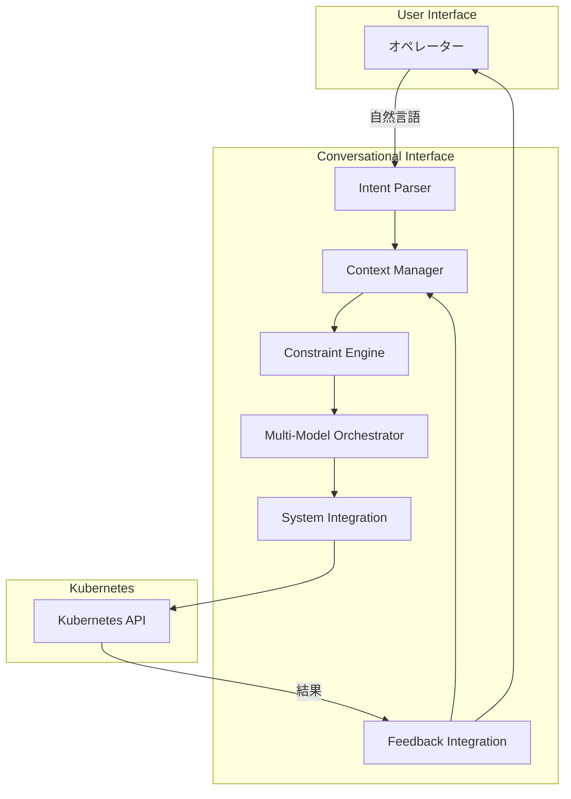

本記事は [arXiv:2503.09194](https://arxiv.org/abs/2503.09194) の解説記事です。

## 論文概要（Abstract）

本論文は、LLMを活用したKubernetes環境の自律操作・自己修復システムの設計と6ヶ月間の本番運用結果を報告しています。著者は、Intent Parser・Context Manager・Constraint Engine・Multi-Model Orchestrator・Feedback Integration・System Integrationの6コンポーネントからなる会話型インターフェースを構築し、2,847のオペレーションを12名のオペレーターで実行した結果、全体精度96.2%、運用オーバーヘッド83%削減を達成したと報告しています。

この記事は [Zenn記事: Self-Evolving Applicationの設計パターンと自己修復インフラの実装戦略](https://zenn.dev/0h_n0/articles/949913945f34be) の深掘りです。

## 情報源

- **arXiv ID**: 2503.09194
- **URL**: [https://arxiv.org/abs/2503.09194](https://arxiv.org/abs/2503.09194)
- **著者**: 単一著者（事例研究）
- **発表年**: 2025
- **分野**: cs.AI, cs.SE
- **注意事項**: 単一著者・単一組織の事例研究であり、外部査読・独立した再現実験の記録はない。数値は事例研究レベルとして参照すること

## 背景と動機（Background & Motivation）

Kubernetes環境の運用は、Pod・Deployment・Service・Ingress等の多数のリソースが複雑に絡み合うため、障害対応やスケーリング判断に高い専門知識が必要です。従来の運用では、オペレーターがkubectlコマンドを手動実行するか、事前定義されたランブックに従って対応しており、以下の課題がありました。

- **操作の複雑性**: 1つの障害対応に5-10のkubectlコマンドが必要
- **コンテキスト欠如**: ランブックは静的で、現在のクラスタ状態を考慮しない
- **人的エラー**: 夜間オンコール時の判断ミスによる二次障害
- **スケーラビリティ**: クラスタ数の増加に対してオペレーターの人数が追いつかない

この論文は、自然言語による会話型インターフェースを通じてKubernetes操作を自動化し、特にCrashLoopBackOffやOOMKilled等の頻出障害の自動修復を目指しています。

## 主要な貢献（Key Contributions）

著者は以下の貢献を主張しています。

- **貢献1**: 6コンポーネントアーキテクチャの設計と実装（Intent Parser、Context Manager、Constraint Engine、Multi-Model Orchestrator、Feedback Integration、System Integration）
- **貢献2**: リスクレベル4段階分類（Informational → Operational → Critical → Destructive）による段階的自動化
- **貢献3**: 6ヶ月間の本番運用データ（2,847オペレーション、12名オペレーター）に基づく定量評価
- **貢献4**: 自己修復統合（CrashLoopBackOff 76.4%、OOMKilled 82.1%の自動解決率）

## 技術的詳細（Technical Details）

### 6コンポーネントアーキテクチャ



各コンポーネントの役割を見ていきます。

**1. Intent Parser（意図解析器）**

オペレーターの自然言語入力をKubernetes操作に変換します。例えば「production環境のnginx Podが落ちている」→ `kubectl get pods -n production -l app=nginx` + 状態分析。論文によると、失敗の42%が自然言語の曖昧性に起因しており、Intent Parserの精度が全体性能のボトルネックになっています。

**2. Context Manager（コンテキスト管理器）**

直近20ターンの会話履歴とクラスタ状態を保持します。セッションタイムアウトは30分に設定されています。過去のインシデント対応履歴も参照し、類似ケースの対応パターンを推奨します。

**3. Constraint Engine（制約エンジン）**

操作の安全性を保証するガードレールです。リスクレベルに基づいて自動実行可否を判定します。

| リスクレベル | 操作例 | 制御 |
|-------------|--------|------|
| Informational | `kubectl get pods`、ログ参照 | 自動実行 |
| Operational | `kubectl scale`、設定変更 | 自動実行＋事後通知 |
| Critical | `kubectl rollout undo`、ノードcordon | 人間確認必須 |
| Destructive | `kubectl delete namespace`、本番削除 | 複数人承認必須 |

**4. Multi-Model Orchestrator（マルチモデルオーケストレーター）**

コスト効率のため、操作の複雑度に応じて異なるLLMモデルにルーティングします。

- **GPT-3.5相当**（シンプル操作、全体の約60%）: ログ参照、Pod一覧取得、リソース使用量確認
- **GPT-4相当**（複雑操作、全体の約40%）: 障害の根本原因分析、修復プラン生成、マルチステップ操作

信頼度スコアが0.7未満の場合、自動的に上位モデルにエスカレーションします。

**5. Feedback Integration（フィードバック統合）**

操作結果をリアルタイムでオペレーターに返し、次のアクションに反映します。自動修復の成否を追跡し、3回連続失敗でオンコールエンジニアにエスカレーションします。

**6. System Integration（システム統合）**

Kubernetes APIとの直接連携層です。kubectl相当の操作をプログラマティックに実行し、結果をパースしてFeedback Integrationに渡します。

### 自己修復メカニズム

著者の報告によると、以下の障害タイプで自動修復が実装されています。

```python
# 自己修復の概念的な実装パターン
class SelfHealingHandler:
    """Kubernetes障害の自動修復ハンドラ"""

    REMEDIATION_STRATEGIES: dict[str, list[str]] = {
        "CrashLoopBackOff": [
            "check_recent_config_changes",   # 直近の設定変更を確認
            "analyze_container_logs",         # コンテナログを分析
            "rollback_to_last_known_good",    # 最終正常版にロールバック
            "increase_resource_limits",       # リソース制限を増加
        ],
        "OOMKilled": [
            "analyze_memory_usage_pattern",   # メモリ使用パターンを分析
            "increase_memory_limit",          # メモリ制限を増加
            "check_memory_leak_indicators",   # メモリリーク指標を確認
            "add_horizontal_pod_autoscaler",  # HPAを追加
        ],
    }

    async def handle(
        self, incident_type: str, pod_name: str, namespace: str
    ) -> dict:
        strategies = self.REMEDIATION_STRATEGIES.get(incident_type, [])
        for strategy_name in strategies:
            result = await self._execute_strategy(
                strategy_name, pod_name, namespace
            )
            if result["resolved"]:
                return {
                    "status": "resolved",
                    "strategy": strategy_name,
                    "pod": pod_name,
                }
        # 全戦略失敗 → エスカレーション
        return {"status": "escalated", "pod": pod_name}
```

### 自動修復の結果

著者が報告している6ヶ月間の自動修復実績は以下の通りです。

| 障害タイプ | 自動解決率 | 平均修復時間 |
|-----------|-----------|-------------|
| CrashLoopBackOff | 76.4% | 約3分 |
| OOMKilled | 82.1% | 約2分 |
| デプロイロールバック | — | 平均2.3分 |

## 実験結果（Results）

### 6ヶ月間の本番運用データ

著者が報告している主要メトリクスは以下の通りです（事例研究レベル）。

| メトリクス | 数値 |
|-----------|------|
| 総オペレーション数 | 2,847 |
| オペレーター数 | 12名 |
| 全体精度 | 96.2% |
| 運用オーバーヘッド削減 | 83% |
| CrashLoopBackOff自動解決 | 76.4% |
| OOMKilled自動解決 | 82.1% |

### モデルルーティングの効果

GPT-3.5とGPT-4のルーティングにより、LLM APIコストの削減と応答速度の向上が同時に達成されています。

- シンプル操作（60%）: GPT-3.5で応答時間を短縮
- 複雑操作（40%）: GPT-4で精度を確保
- 信頼度スコア < 0.7: 自動エスカレーションで品質担保

### 失敗分析

著者は失敗原因の内訳も報告しています。

- **42%**: 自然言語の曖昧性（Intent Parserの限界）
- **残り58%**: モデルの推論エラー、コンテキスト不足、API制限等

## 実装のポイント（Implementation）

### 本番導入時の注意点

1. **読み取り専用モードから開始**: 分析と推奨のみを出力し、実際の操作は人間が実行する「Shadow Mode」で精度を検証
2. **段階的な権限拡大**: Informational → Operational → Criticalの順で自動化範囲を広げる
3. **監査ログ**: すべてのLLM推論結果と実行コマンドを記録し、事後検証可能にする
4. **フォールバック**: LLM API障害時は従来のランブック実行にフォールバック

### プロンプトインジェクション対策

著者は、オペレーターの入力を通じたプロンプトインジェクション攻撃のリスクを認識しています。緩和策として以下が推奨されています。

- 入力のサニタイズ（Kubernetes固有のコマンドパターンとの照合）
- Constraint Engineによる出力検証（生成されたkubectl コマンドの安全性チェック）
- Destructive操作の複数人承認

ただし、著者自身が詳細な緩和策は未実装と認めています。

## Production Deployment Guide

### AWS実装パターン（コスト最適化重視）

K8s自動操作エージェントをAWSにデプロイする場合の推奨構成です。

| 規模 | 月間リクエスト | 推奨構成 | 月額コスト | 主要サービス |
|------|--------------|---------|-----------|------------|
| **Small** | ~3,000 (100/日) | Serverless | $100-250 | Lambda + Bedrock + DynamoDB |
| **Medium** | ~30,000 (1,000/日) | Hybrid | $500-1,200 | ECS Fargate + Bedrock + ElastiCache |
| **Large** | 300,000+ (10,000/日) | Container | $3,000-7,000 | EKS + Karpenter + EC2 Spot |

**Small構成の詳細**（月額$100-250）:
- **Lambda**: 1GB RAM, 120秒タイムアウト（$30/月）— Intent Parser + Constraint Engine
- **Bedrock**: Claude 3.5 Haiku（60%）+ Claude 3.5 Sonnet（40%）（$150/月）
- **DynamoDB**: On-Demand（$15/月）— 会話履歴・監査ログ
- **CloudWatch**: 監視・アラーム（$10/月）
- **Secrets Manager**: K8sクレデンシャル管理（$5/月）

**コスト試算の注意事項**: 上記は2026年3月時点のAWS ap-northeast-1（東京）リージョン料金に基づく概算値です。

### Terraformインフラコード

```hcl
module "vpc" {
  source  = "terraform-aws-modules/vpc/aws"
  version = "~> 5.0"

  name = "k8s-agent-vpc"
  cidr = "10.0.0.0/16"
  azs  = ["ap-northeast-1a", "ap-northeast-1c"]
  private_subnets = ["10.0.1.0/24", "10.0.2.0/24"]

  enable_nat_gateway   = false
  enable_dns_hostnames = true
}

resource "aws_iam_role" "k8s_agent" {
  name = "k8s-agent-role"
  assume_role_policy = jsonencode({
    Version = "2012-10-17"
    Statement = [{
      Action    = "sts:AssumeRole"
      Effect    = "Allow"
      Principal = { Service = "lambda.amazonaws.com" }
    }]
  })
}

resource "aws_iam_role_policy" "bedrock_multi_model" {
  role = aws_iam_role.k8s_agent.id
  policy = jsonencode({
    Version = "2012-10-17"
    Statement = [{
      Effect = "Allow"
      Action = ["bedrock:InvokeModel"]
      Resource = [
        "arn:aws:bedrock:ap-northeast-1::foundation-model/anthropic.claude-3-5-haiku*",
        "arn:aws:bedrock:ap-northeast-1::foundation-model/anthropic.claude-3-5-sonnet*"
      ]
    }]
  })
}

resource "aws_lambda_function" "intent_parser" {
  filename      = "lambda.zip"
  function_name = "k8s-agent-intent-parser"
  role          = aws_iam_role.k8s_agent.arn
  handler       = "index.handler"
  runtime       = "python3.12"
  timeout       = 120
  memory_size   = 1024
  environment {
    variables = {
      HAIKU_MODEL_ID  = "anthropic.claude-3-5-haiku-20241022-v1:0"
      SONNET_MODEL_ID = "anthropic.claude-3-5-sonnet-20241022-v2:0"
      CONFIDENCE_THRESHOLD = "0.7"
    }
  }
}

resource "aws_dynamodb_table" "audit_log" {
  name         = "k8s-agent-audit-log"
  billing_mode = "PAY_PER_REQUEST"
  hash_key     = "request_id"
  range_key    = "timestamp"

  attribute {
    name = "request_id"
    type = "S"
  }
  attribute {
    name = "timestamp"
    type = "S"
  }

  ttl {
    attribute_name = "expire_at"
    enabled        = true
  }
}
```

### 運用・監視設定

```sql
-- CloudWatch Logs Insights: 自動修復の成功率監視
fields @timestamp, incident_type, resolution_status
| stats count(*) as total,
        sum(case when resolution_status = 'resolved' then 1 else 0 end) as resolved
  by incident_type, bin(1h)
| filter total > 0
```

### コスト最適化チェックリスト

- [ ] マルチモデルルーティング: シンプル操作はHaiku、複雑操作はSonnet
- [ ] 信頼度スコア閾値: 0.7で自動エスカレーション
- [ ] Prompt Caching: Constraint Engineのルール定義部分
- [ ] DynamoDB TTL: 監査ログ90日、会話履歴7日で自動削除
- [ ] Lambda メモリ最適化: CloudWatch Insights分析
- [ ] AWS Budgets: 月額予算設定（80%で警告）

## 実運用への応用（Practical Applications）

Zenn記事で紹介されているSelf-Healing Infrastructureの「テレメトリ→推論→アクション」パイプラインにおいて、この論文の会話型インターフェースは**推論層**に直接対応します。特に以下の知見が実用的です。

- **リスクレベル4段階分類**: Zenn記事のOPAポリシーと組み合わせることで、Policy-as-Codeによる段階的自動化が実現可能
- **マルチモデルルーティング**: コスト効率とレイテンシのバランスを取る実践的パターン
- **3回失敗でエスカレーション**: 自動修復の無限ループ防止の具体的な実装指針

## 関連研究（Related Work）

- **k8sgpt**（CNCF Sandbox）: AI駆動のKubernetes診断ツール。本論文はk8sgptの診断機能に加えて自動修復まで統合
- **Sedai**: 商用のKubernetes自律最適化プラットフォーム。53%コスト削減を謳うが、本論文のようなオープンな運用データは公開していない
- **NVSentinel**（NVIDIA）: GPU特化の自己修復システム。本論文は汎用Kubernetes操作をカバー

## まとめと今後の展望

この論文は、LLMを活用したKubernetes自動操作の実践的な事例研究として、6ヶ月間の本番運用データを提供しています。全体精度96.2%と運用オーバーヘッド83%削減は有望な数値ですが、単一著者・単一組織の事例研究であることに留意が必要です。

今後の課題として、自然言語の曖昧性解消（失敗の42%を占める）、プロンプトインジェクション対策の強化、マルチクラスタ環境への拡張が挙げられています。

## 参考文献

- **arXiv**: [https://arxiv.org/abs/2503.09194](https://arxiv.org/abs/2503.09194)
- **k8sgpt**: [https://github.com/k8sgpt-ai/k8sgpt](https://github.com/k8sgpt-ai/k8sgpt)
- **Related Zenn article**: [https://zenn.dev/0h_n0/articles/949913945f34be](https://zenn.dev/0h_n0/articles/949913945f34be)
