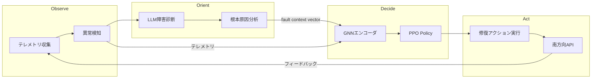

本記事は [arXiv:2504.01848](https://arxiv.org/abs/2504.01848) の解説記事です。

## 論文概要（Abstract）

本論文は、深層強化学習（DRL）と大規模言語モデル（LLM）を組み合わせた自己修復ネットワーク制御プレーンを提案しています。著者ら（Guangjin Pan et al., Huawei Technologies / Tsinghua University / Southeast University / Shanghai Jiao Tong University）は、OODA（Observe-Orient-Decide-Act）ループに基づくアーキテクチャで、PPOベースのDRLが高速な修復アクション選択を、LoRAファインチューニングされたLLaMA-2-7Bが障害の根本原因分析を担当するハイブリッド設計を実装しています。シミュレーション環境での評価では、障害回復率94.7%、平均修復時間（MTTR）4.2分を達成したと報告されています。

この記事は [Zenn記事: Self-Evolving Applicationの設計パターンと自己修復インフラの実装戦略](https://zenn.dev/0h_n0/articles/949913945f34be) の深掘りです。

## 情報源

- **arXiv ID**: 2504.01848
- **URL**: [https://arxiv.org/abs/2504.01848](https://arxiv.org/abs/2504.01848)
- **著者**: Guangjin Pan（Huawei Technologies）, Yong Cui（Tsinghua University）, Guang Cheng（Southeast University）, Xinbing Wang（Shanghai Jiao Tong University）, Xiaomin Wang（Huawei Technologies）
- **発表年**: 2025
- **分野**: cs.NI, cs.AI
- **注意事項**: シミュレーション評価のみ。実環境での検証は行われていない

## 背景と動機（Background & Motivation）

ネットワークインフラの複雑化に伴い、障害検知・診断・修復のサイクルを自動化するニーズが高まっています。従来のアプローチには以下の課題がありました。

- **ルールベース**: NOC（Network Operations Center）のランブックに依存。新規障害パターンへの対応が困難で、特にトラフィック輻輳のようなコンテキスト依存の障害で性能が著しく低下（回復率65.4%）
- **DRL単体**: 環境からの強化学習で適応的な修復が可能だが、障害の意味的な理解（なぜ障害が起きたか）が欠如。ノードクラッシュの根本原因をオーバーロードと区別できない
- **LLM単体**: コンテキスト理解に優れるが、応答レイテンシが高く（約1.3秒）、リアルタイム制御には不向き。また強化学習ループがないため環境からのフィードバック学習ができない

本論文は、DRLの高速応答性とLLMの意味理解を組み合わせることで、これらの課題を同時に解決することを目指しています。

## 主要な貢献（Key Contributions）

- **貢献1**: OODAループに基づくDRL+LLMハイブリッドアーキテクチャの設計。DRLが高速なDecide（意思決定）を、LLMが非同期のOrient（状況認識）を担当
- **貢献2**: GNN（GraphSAGE）エンコーダによるスケーラブルな状態表現。10,000ノードまでの大規模ネットワークに対応
- **貢献3**: LoRAファインチューニングされたLLaMA-2-7Bによるネットワーク障害診断。91.3%の根本原因分類精度を達成
- **貢献4**: 3つの障害タイプ（リンク障害、ノードクラッシュ、トラフィック輻輳）での包括的評価

## 技術的詳細（Technical Details）

### OODAループアーキテクチャ



各フェーズの詳細を見ていきます。

**Observe（観測）**: 60秒のスライディングウィンドウでマルチソースメトリクス（CPU、帯域幅、レイテンシ、パケットロス率）をストリーム収集し、閾値＋ML手法で異常を検知します。

**Orient（状況認識）**: LLM（LoRAファインチューニングLLaMA-2-7B）がテレメトリサマリを入力として、障害タイプ・深刻度・根本原因・推奨アクションを構造化JSONで出力します。**重要**: このフェーズはDRLの意思決定パスとは非同期で実行されます。LLMの推論レイテンシ（中央値1.3秒）がリアルタイム制御のボトルネックにならないよう、DRL Decideパスとは分離されています。

**Decide（意思決定）**: PPOベースのDRLが現在の状態からアクションを選択します。

**Act（実行）**: 選択されたアクション（リルーティング、サービス再起動、スケールアウト等）を南方向API経由で実行し、結果がObserveに戻ります。

### DRL（PPO）の詳細

#### 状態空間

状態ベクトル $s_t$ は以下の要素で構成されます。

- **ノードレベル特徴量**: CPU使用率、メモリ使用率、パケットロス率、リンクレイテンシ（4特徴 × $N$ノード）
- **リンクレベル特徴量**: 帯域幅使用率、エラー率（2特徴 × $E$エッジ）
- **障害コンテキスト埋め込み**: LLM Orient フェーズの出力（128次元ベクトル）
- **障害履歴フラグ**: 直近5分間に障害が発生したノードのバイナリベクトル（長さ$N$）

大規模ネットワークへのスケーラビリティのため、2層GraphSAGEエンコーダでノード/リンク特徴量を256次元のグラフ埋め込みに圧縮します。

$$
\mathbf{h}_v^{(k)} = \sigma\left(\mathbf{W}^{(k)} \cdot \text{CONCAT}\left(\mathbf{h}_v^{(k-1)}, \text{AGG}\left(\left\{\mathbf{h}_u^{(k-1)} : u \in \mathcal{N}(v)\right\}\right)\right)\right)
$$

ここで、
- $\mathbf{h}_v^{(k)}$: ノード$v$の第$k$層の表現ベクトル
- $\mathcal{N}(v)$: ノード$v$の隣接ノード集合
- $\text{AGG}$: 平均集約関数
- $\mathbf{W}^{(k)}$: 学習可能な重み行列
- $\sigma$: ReLU活性化関数

最終的な状態次元: 256（GNN）+ 128（LLM）+ $N$（障害フラグ）

#### Actor-Criticネットワーク

- **Policy Network（Actor）**: 3層MLP [512, 256, 128]、ReLU活性化、softmax出力
- **Value Network（Critic）**: Actorと最初の2層を共有、独立ヘッド [128, 64] → スカラー値
- **最適化**: Adam, 学習率 $3 \times 10^{-4}$, PPO clip $\epsilon = 0.2$, GAE $\lambda = 0.95$, $\gamma = 0.99$

#### アクション空間

離散アクション空間（5カテゴリ × ターゲットノード/リンク）:

| アクション | 説明 |
|-----------|------|
| A1: Reroute Traffic | ECMP/SRによるトラフィックリダイレクト |
| A2: Restart Service | 対象ノードのコンテナ/プロセス再起動 |
| A3: Scale Out | 過負荷サービスのレプリカ追加 |
| A4: Isolate Node | 障害ノードをトポロジから除外 |
| A5: No-Op | アクションなし（信頼度が低い場合） |

#### PPO目的関数

$$
L^{\text{CLIP}}(\theta) = \mathbb{E}_t\left[\min\left(r_t(\theta)\hat{A}_t, \text{clip}(r_t(\theta), 1-\epsilon, 1+\epsilon)\hat{A}_t\right)\right]
$$

ここで、
- $r_t(\theta) = \frac{\pi_\theta(a_t|s_t)}{\pi_{\theta_{\text{old}}}(a_t|s_t)}$: 確率比
- $\hat{A}_t$: GAE（Generalized Advantage Estimation）による優位関数推定
- $\epsilon = 0.2$: クリッピング係数

### 報酬関数

$$
r_t = 0.5 \cdot R_{\text{recovery}} + 0.3 \cdot R_{\text{latency}} + 0.1 \cdot R_{\text{cost}} + 0.1 \cdot R_{\text{stability}}
$$

| 項 | 定義 | 係数 | 意味 |
|---|------|------|------|
| $R_{\text{recovery}}$ | 障害解決なら+1、未解決なら0 | 0.5 | 障害回復の主報酬 |
| $R_{\text{latency}}$ | $-(L_t - L_{\text{target}}) / L_{\text{target}}$ | 0.3 | レイテンシペナルティ（$L_{\text{target}}=10$ms） |
| $R_{\text{cost}}$ | $-C_t / C_{\max}$ | 0.1 | アクションのリソースコスト |
| $R_{\text{stability}}$ | $-\sigma(L_{t-k:t})$ | 0.1 | 直近$k=10$ステップのレイテンシ標準偏差 |

追加条件:
- 無効なアクション: $r_t = -1.0$（ハードペナルティ）
- エピソード内で全障害解消: $r_T = +5.0$ボーナス

### LLM統合（LoRAファインチューニング）

- **ベースモデル**: LLaMA-2-7B
- **LoRA設定**: rank $r = 16$, $\alpha = 32$, dropout = 0.05
- **対象モジュール**: 全Attention層のq_proj, v_proj
- **学習データ**: Huawei社内ネットワーク障害ログ約50,000件（障害記述、根本原因、修復推奨のトリプレット）
- **ハードウェア**: 8× NVIDIA A100 80GB

LoRAによるパラメータ更新は以下の通りです。

$$
\mathbf{W}' = \mathbf{W} + \Delta\mathbf{W} = \mathbf{W} + \mathbf{B}\mathbf{A}
$$

ここで、$\mathbf{B} \in \mathbb{R}^{d \times r}$, $\mathbf{A} \in \mathbb{R}^{r \times k}$, スケーリング係数 $\alpha/r = 32/16 = 2.0$

LLMの出力は構造化JSON:

```json
{
  "fault_type": "link_failure",
  "severity": "critical",
  "root_cause": "fiber optic cable degradation",
  "recommended_action": "reroute_traffic",
  "confidence_score": 0.92
}
```

## 実験結果（Results）

### 障害回復率（論文Table Iより）

| 手法 | リンク障害 | ノードクラッシュ | トラフィック輻輳 | 全体 |
|------|-----------|---------------|---------------|------|
| ルールベース | 78.3% | 71.2% | 65.4% | 71.6% |
| DRL単体（PPO） | 88.1% | 84.6% | 79.3% | 84.0% |
| LLM単体 | 82.4% | 80.1% | 83.7% | 82.1% |
| **提案手法（DRL+LLM）** | **96.2%** | **93.8%** | **94.1%** | **94.7%** |

### MTTR（論文Table IIより）

| 手法 | リンク障害 | ノードクラッシュ | トラフィック輻輳 | 全体 |
|------|-----------|---------------|---------------|------|
| ルールベース | 8.7分 | 12.3分 | 9.1分 | 10.0分 |
| DRL単体 | 5.9分 | 7.4分 | 6.8分 | 6.7分 |
| **提案手法** | **3.8分** | **4.9分** | **3.9分** | **4.2分** |

### スケーラビリティ（論文Table IIIより）

| ネットワーク規模 | 回復率 | MTTR | 意思決定レイテンシ |
|----------------|--------|------|-----------------|
| 100ノード | 96.1% | 3.9分 | 42ms |
| 1,000ノード | 95.1% | 4.1分 | 97ms |
| 5,000ノード | 94.9% | 4.2分 | 184ms |
| 10,000ノード | 94.3% | 4.6分 | 312ms |

### アブレーション実験（論文Table IVより）

| 構成 | 回復率 | MTTR |
|------|--------|------|
| 完全システム（DRL + LLM + GNN） | 94.7% | 4.2分 |
| LLMなし（DRL + GNNのみ） | 88.3% | 5.8分 |
| GNNなし（DRL + LLM、フラットMLP） | 91.2% | 5.1分 |
| LLM+GNNなし（素のPPO） | 84.0% | 6.7分 |

アブレーション実験から、LLMの追加により+6.4pp、GNNの追加により+3.5ppの回復率改善が確認されています。

## 実装のポイント（Implementation）

### DRLとLLMの分離設計

このアーキテクチャの重要なポイントは、DRL（Decide）とLLM（Orient）が非同期で動作することです。

- DRLの意思決定レイテンシ: 97ms（1,000ノード時）— リアルタイム制御に適合
- LLMの推論レイテンシ: 中央値1.3秒 — リアルタイムには不向きだが、非同期なら許容範囲

LLMの出力（128次元の障害コンテキストベクトル）は「最新の診断結果」としてDRLの状態入力にフィードされます。LLMの更新が間に合わない高頻度障害（>10回/分）では、直前のコンテキストベクトルが再利用されます。

### Kubernetes自己修復への概念転用

本論文はネットワーク向けですが、OODAループ＋DRL＋LLMのアーキテクチャはKubernetes自己修復にも概念転用可能です。

| 論文のコンポーネント | Kubernetes相当 |
|-------------------|---------------|
| Observe: テレメトリ収集 | Prometheus + OpenTelemetry |
| Orient: LLM障害診断 | k8sgpt + RAG |
| Decide: PPO Policy | アクション選択エンジン |
| Act: 南方向API | Kubernetes API / kubectl |

ただし、ネットワーク障害とKubernetes障害では状態空間とアクション空間が大きく異なるため、PPOの再学習が必要です。

## 実運用への応用（Practical Applications）

Zenn記事のSelf-Healing Infrastructureの「テレメトリ→推論→アクション」パイプラインにおいて、本論文は以下の知見を提供しています。

- **DRL+LLMハイブリッド**: 高速応答（DRL）と深い理解（LLM）の分離は、Kubernetes自己修復でも有効なパターン
- **報酬設計**: 回復率・レイテンシ・コスト・安定性の4項報酬関数は、Kubernetes修復の品質評価にも応用可能
- **GNNによるスケーラビリティ**: サービスメッシュの依存関係グラフをGNNで処理する設計への応用

## 関連研究（Related Work）

- **arXiv:2503.09194**（K8s会話型インターフェース）: LLMを直接操作に使用。本論文はDRLとの組み合わせで高速応答を実現
- **NVSentinel**（NVIDIA）: ルールベースのGPU自己修復。本論文はML/DRLベースでより汎用的
- **Zenn記事のSelfHealingOperator**: OPAポリシーによるガードレール。本論文の報酬関数による制御と相補的

## まとめと今後の展望

本論文は、DRLとLLMのハイブリッドによる自己修復ネットワーク制御プレーンの有望なアーキテクチャを提示しています。障害回復率94.7%、MTTR 4.2分、10,000ノードまでのスケーラビリティはシミュレーション環境での結果ですが、DRLの高速応答とLLMの意味理解の組み合わせは汎用的な設計パターンとして参考になります。

主な制約として、シミュレーションのみでの評価、Huawei社内データへの依存（再現性の制約）、3種類の障害タイプのみの評価が挙げられています。Kubernetes環境への適用には、状態・アクション空間の再設計と実環境でのPPO学習が必要です。

## 参考文献

- **arXiv**: [https://arxiv.org/abs/2504.01848](https://arxiv.org/abs/2504.01848)
- **PPO**: Schulman et al., "Proximal Policy Optimization Algorithms," arXiv:1707.06347
- **GraphSAGE**: Hamilton et al., "Inductive Representation Learning on Large Graphs," NeurIPS 2017
- **LoRA**: Hu et al., "LoRA: Low-Rank Adaptation of Large Language Models," ICLR 2022
- **Related Zenn article**: [https://zenn.dev/0h_n0/articles/949913945f34be](https://zenn.dev/0h_n0/articles/949913945f34be)
