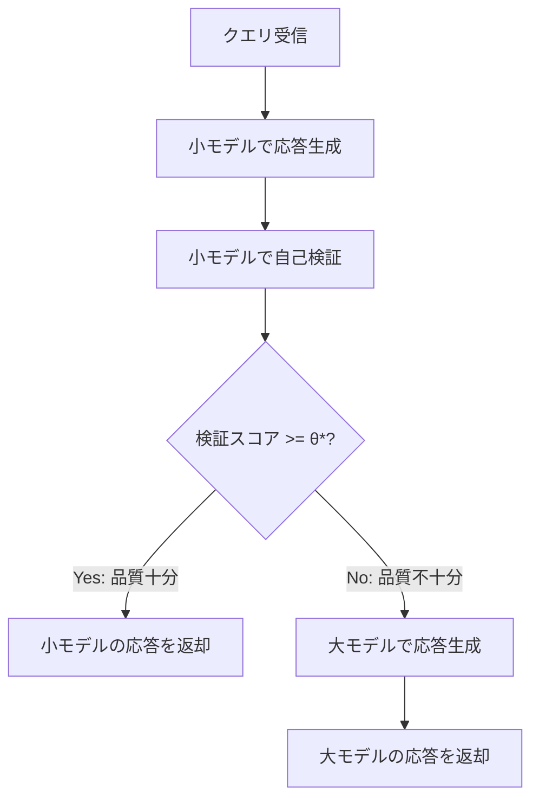

本記事は [AutoMix: Automatically Mixing Language Models (arXiv:2402.14099)](https://arxiv.org/abs/2402.14099) の解説記事です。

## 論文概要（Abstract）

AutoMixは、異なるサイズ・価格のLLMを自動的に組み合わせるカスケードルーティング手法である。小さなLLMが応答を生成した後、自身でその応答の品質を検証（self-verification）し、品質が不十分と判断された場合にのみ大きなLLMにエスカレーションする。この自己検証はfew-shotプロンプティングで実現されるため、追加の学習データや訓練が不要である。検証の不完全さを考慮するため、Approximate Optimal Stopping（AOS）理論を用いてルーティング判断を最適化し、コスト-品質トレードオフについて証明可能なnear-optimal性能を提供する。著者らは5つのベンチマーク×3つのLLMペアの実験で、計算コストを50%以上削減しつつ大モデル単体と同等以上の性能を達成したと報告している。

この記事は [Zenn記事: Portkey AIゲートウェイ実装Deep Dive：条件付きルーティングとコスト最適化戦略](https://zenn.dev/0h_n0/articles/6c55b2409143b2) の深掘りです。

## 情報源

- **arXiv ID**: 2402.14099
- **URL**: [https://arxiv.org/abs/2402.14099](https://arxiv.org/abs/2402.14099)
- **著者**: Aman Madaan, Pranjal Aggarwal, Ankit Anand, et al.（14名）
- **発表年**: 2024
- **分野**: cs.CL, cs.AI, cs.LG

## 背景と動機（Background & Motivation）

LLMの価格帯が広がるにつれ、「すべてのクエリに最大モデルを使う」アプローチのコスト非効率性が顕著になっている。RouteLLMやHybrid LLMのような先行研究は、ルーティング判断を分類器で行うアプローチを取るが、これらは訓練データの準備や分類器のファインチューニングが必要であり、新しいモデルペアやドメインへの適用にコストがかかる。

AutoMixは、この問題を「追加学習不要」のアプローチで解決する。小モデル自身がfew-shotプロンプティングで自己の応答品質を検証し、不十分な場合にのみ大モデルにエスカレーションする。このアプローチは、Portkeyのフォールバックチェーン（`on_status_codes`でHTTPエラー時に次のターゲットへ遷移）と概念的に類似しているが、AutoMixは「品質不足」を検出する自己検証メカニズムを持つ点が異なる。

## 主要な貢献（Key Contributions）

- **貢献1**: Few-shotプロンプティングによる自己検証メカニズム。追加学習不要でモデル非依存に動作する
- **貢献2**: Approximate Optimal Stopping（AOS）フレームワーク。検証の信頼性変動を考慮し、証明可能なnear-optimal性能を提供
- **貢献3**: 5つのベンチマーク（MMLU, HellaSwag, ARC-Challenge, WinoGrande, OpenbookQA）×3つのLLMペアでの包括的な実証評価

## 技術的詳細（Technical Details）

### カスケードルーティングの動作フロー

AutoMixのカスケードは以下の3ステップで動作する：



Portkeyのフォールバックチェーンとの違いは、「HTTPステータスコード」ではなく「応答品質」に基づいてエスカレーション判断を行う点である。

### Approximate Optimal Stopping（AOS）

著者らは、ルーティング判断を最適停止問題として定式化する。

変数定義：
- $s$: 小LLM、$l$: 大LLM
- $x$: 入力クエリ
- $v \in \{0, 1\}$: 自己検証スコア（accept/reject）
- $c_s$, $c_l$: 各LLMのコスト
- $\lambda$: コスト予算パラメータ

目的関数：

$$
\max_\pi \mathbb{E}[Q(\pi(x))] - \lambda \cdot \mathbb{E}[C(\pi(x))]
$$

ここで$\pi$はルーティングポリシー、$Q$は品質、$C$はコスト。$\lambda$はコストと品質のトレードオフを制御するハイパーパラメータであり、大きいほどコスト重視になる。

ルーティング決定ルール：

$$
\pi(x) = \begin{cases} \text{stop (小モデルの応答を採用)} & \text{if } v \geq \theta^* \\ \text{continue (大モデルへエスカレーション)} & \text{if } v < \theta^* \end{cases}
$$

ここで$\theta^*$は最適閾値。

### AOSアルゴリズムの3ステップ

最適閾値$\theta^*$を正確に求めるには、自己検証の真の精度（未知）が必要である。AutoMixのAOSは以下の近似解法を用いる：

1. **信頼性推定**: 小バリデーションセット（100-200件）で自己検証シグナルの精度（precision/recall）を推定
2. **閾値計算**: 推定された精度と$\lambda$から、期待効用を最大化する閾値$\theta$を算出
3. **理論保証**: AOSポリシーは、最適ポリシーの$\epsilon$以内の性能を達成する

著者らは、$\epsilon$が検証シグナルの品質に依存することを理論的に証明している。自己検証の精度が高いほど$\epsilon$は小さくなり、最適解に近づく。

### 自己検証（Self-Verification）メカニズム

AutoMixの自己検証は、小モデル自身が4-8件のfew-shot例を用いて自身の応答品質を判定する：

```python
def self_verify(
    small_llm: str,
    query: str,
    context: str,
    response: str,
    few_shot_examples: list[dict],
) -> int:
    """小モデルによる自己検証

    Args:
        small_llm: 小型LLMの識別子
        query: 元のクエリ
        context: コンテキスト情報
        response: 小モデルが生成した応答
        few_shot_examples: 検証用のfew-shot例（4-8件）

    Returns:
        検証スコア（0: reject, 1: accept）
    """
    verification_prompt = construct_verification_prompt(
        query=query,
        context=context,
        response=response,
        examples=few_shot_examples,
    )
    # プロンプト末尾: "Is the above answer correct? (yes/no)"
    result = call_llm(small_llm, verification_prompt)
    return 1 if "yes" in result.lower() else 0
```

Few-shot例は、正解例と不正解例を混在させることで、小モデルが「自身の誤りを検出できる」能力を引き出す。著者らは連鎖思考（Chain-of-Thought）スタイルのプロンプトを使用し、「なぜ正しいか/正しくないか」の推論過程を含めることを推奨している。

### カスケード全体の実装

```python
def automix_route(
    query: str,
    context: str,
    small_llm: str,
    large_llm: str,
    threshold: float,
    few_shot_examples: list[dict],
) -> tuple[str, float]:
    """AutoMixカスケードルーティング

    Args:
        query: 入力クエリ
        context: コンテキスト情報
        small_llm: 小型LLMの識別子
        large_llm: 大型LLMの識別子
        threshold: AOS最適閾値
        few_shot_examples: 検証用few-shot例

    Returns:
        (応答テキスト, コスト) のタプル
    """
    # Step 1: 小モデルで応答生成
    response_small = call_llm(small_llm, query)
    cost = COST_SMALL

    # Step 2: 自己検証
    verification_score = self_verify(
        small_llm, query, context, response_small, few_shot_examples
    )

    # Step 3: AOSルーティング決定
    if verification_score >= threshold:
        return response_small, cost
    else:
        response_large = call_llm(large_llm, query)
        cost += COST_LARGE
        return response_large, cost
```

## 実装のポイント（Implementation）

### Few-shot例の構築

自己検証の精度はfew-shot例の品質に大きく依存する。著者らが推奨する構築方法：

1. **例数**: 4-8件（コンテキストウィンドウの制約内）
2. **正解/不正解のバランス**: 概ね半々
3. **推論過程の記述**: 「なぜこの回答が正しいか/正しくないか」を含める
4. **ドメイン適合**: 対象タスクに類似した例を選択

### AOSキャリブレーション

```python
def calibrate_aos_threshold(
    validation_set: list[dict],
    small_llm: str,
    large_llm: str,
    lambda_cost: float,
    few_shot_examples: list[dict],
) -> float:
    """AOS閾値のキャリブレーション

    Args:
        validation_set: (query, context, ground_truth) のリスト
        small_llm: 小型LLM識別子
        large_llm: 大型LLM識別子
        lambda_cost: コスト重みパラメータ
        few_shot_examples: 検証用few-shot例

    Returns:
        キャリブレーション済み閾値
    """
    # 各閾値での検証F1を計算
    best_threshold = 0.5
    best_utility = float("-inf")

    for threshold in [0.1, 0.2, 0.3, 0.4, 0.5, 0.6, 0.7, 0.8, 0.9]:
        total_quality = 0.0
        total_cost = 0.0

        for item in validation_set:
            response, cost = automix_route(
                item["query"], item["context"],
                small_llm, large_llm,
                threshold, few_shot_examples
            )
            quality = evaluate_quality(response, item["ground_truth"])
            total_quality += quality
            total_cost += cost

        avg_quality = total_quality / len(validation_set)
        avg_cost = total_cost / len(validation_set)
        utility = avg_quality - lambda_cost * avg_cost

        if utility > best_utility:
            best_utility = utility
            best_threshold = threshold

    return best_threshold
```

### Portkeyとの統合パターン

AutoMixのカスケードロジックは、Portkeyのフォールバックチェーンと組み合わせることで、「品質ベースのエスカレーション」と「障害ベースのフォールバック」を同時に実現できる：

```python
from portkey_ai import Portkey

# Portkeyフォールバック設定（障害時の切り替え）
fallback_config = {
    "strategy": {
        "mode": "fallback",
        "on_status_codes": [429, 500, 503]
    },
    "targets": [
        {"virtual_key": "openai-key", "override_params": {"model": "gpt-4o-mini"}},
        {"virtual_key": "anthropic-key", "override_params": {"model": "claude-haiku"}},
    ]
}

# AutoMixカスケード + Portkeyフォールバック
def automix_with_portkey_fallback(
    query: str, context: str, threshold: float
) -> str:
    """AutoMixカスケード + Portkeyフォールバック

    1. 小モデル（Portkeyフォールバック付き）で応答
    2. 自己検証で品質チェック
    3. 品質不足なら大モデルにエスカレーション
    """
    # 小モデル呼び出し（Portkeyフォールバック付き）
    small_client = Portkey(
        api_key="your_portkey_api_key",
        config=fallback_config
    )
    response_small = small_client.chat.completions.create(
        messages=[{"role": "user", "content": query}]
    )

    # 自己検証（小モデルで実行）
    verification = self_verify(
        "gpt-4o-mini", query, context,
        response_small.choices[0].message.content,
        few_shot_examples
    )

    if verification >= threshold:
        return response_small.choices[0].message.content

    # 大モデルにエスカレーション
    large_client = Portkey(
        api_key="your_portkey_api_key",
        virtual_key="anthropic-key"
    )
    response_large = large_client.chat.completions.create(
        messages=[{"role": "user", "content": query}],
        model="claude-sonnet-4-20250514"
    )
    return response_large.choices[0].message.content
```

## Production Deployment Guide

### AWS実装パターン（コスト最適化重視）

AutoMixは追加の分類器モデルを必要としないため（自己検証はLLM自身が行う）、インフラ構成がシンプルになる。

**トラフィック量別の推奨構成**:

| 規模 | 月間リクエスト | 推奨構成 | 月額コスト | 主要サービス |
|------|--------------|---------|-----------|------------|
| **Small** | ~3,000 (100/日) | Serverless | $50-120 | Lambda + Bedrock |
| **Medium** | ~30,000 (1,000/日) | Hybrid | $250-700 | Lambda + ECS Fargate + ElastiCache |
| **Large** | 300,000+ (10,000/日) | Container | $1,500-4,000 | EKS + Karpenter + EC2 Spot |

AutoMixは分類器モデルのGPU/ホスティングが不要なため、RouteLLMやNVIDIA Blueprintと比較して最もシンプルかつ低コストなインフラ構成となる。

**Small構成の詳細** (月額$50-120):
- **Lambda**: カスケードロジック実行 ($15/月)
- **Bedrock**: Claude Haiku（小モデル+自己検証）+ Claude Sonnet 4（大モデル）($70/月)
- **CloudWatch**: 基本監視 ($5/月)

AutoMixでは自己検証のために小モデルへの追加呼び出しが発生するため、小モデルのトークンコストが約1.5倍になる。ただし、大モデル呼び出しの50-65%削減と比較すれば十分にペイする。

**コスト試算の注意事項**:
- 上記は2026年3月時点のAWS ap-northeast-1（東京）リージョン料金に基づく概算値です
- 自己検証による追加トークンコストは小モデルのトークン単価に依存します
- 最新料金は [AWS料金計算ツール](https://calculator.aws/) で確認してください

### Terraformインフラコード

**Small構成 (Serverless): Lambda + Bedrock**

```hcl
module "vpc" {
  source  = "terraform-aws-modules/vpc/aws"
  version = "~> 5.0"

  name = "automix-vpc"
  cidr = "10.0.0.0/16"
  azs  = ["ap-northeast-1a", "ap-northeast-1c"]
  private_subnets = ["10.0.1.0/24", "10.0.2.0/24"]

  enable_nat_gateway   = false
  enable_dns_hostnames = true
}

resource "aws_iam_role" "lambda_automix" {
  name = "lambda-automix-role"

  assume_role_policy = jsonencode({
    Version = "2012-10-17"
    Statement = [{
      Action = "sts:AssumeRole"
      Effect = "Allow"
      Principal = { Service = "lambda.amazonaws.com" }
    }]
  })
}

resource "aws_iam_role_policy" "bedrock_invoke" {
  role = aws_iam_role.lambda_automix.id

  policy = jsonencode({
    Version = "2012-10-17"
    Statement = [{
      Effect   = "Allow"
      Action   = ["bedrock:InvokeModel"]
      Resource = "arn:aws:bedrock:ap-northeast-1::foundation-model/anthropic.*"
    }]
  })
}

resource "aws_lambda_function" "automix_handler" {
  filename      = "automix_handler.zip"
  function_name = "automix-cascade"
  role          = aws_iam_role.lambda_automix.arn
  handler       = "index.handler"
  runtime       = "python3.12"
  timeout       = 120  # カスケード（小+検証+大）のため長めに設定
  memory_size   = 256  # 分類器不要のため256MBで十分

  environment {
    variables = {
      SMALL_MODEL      = "anthropic.claude-3-5-haiku-20241022-v1:0"
      LARGE_MODEL      = "anthropic.claude-sonnet-4-20250514-v1:0"
      AOS_THRESHOLD    = "0.5"
      LAMBDA_COST      = "0.5"
      FEW_SHOT_COUNT   = "6"
    }
  }
}

resource "aws_cloudwatch_metric_alarm" "escalation_rate" {
  alarm_name          = "automix-escalation-rate-high"
  comparison_operator = "GreaterThanThreshold"
  evaluation_periods  = 3
  metric_name         = "EscalationRate"
  namespace           = "AutoMix"
  period              = 3600
  statistic           = "Average"
  threshold           = 0.7  # 70%以上エスカレーションでアラート
  alarm_description   = "エスカレーション率が高すぎる（自己検証の品質低下の可能性）"
}
```

### セキュリティベストプラクティス

- **IAMロール**: Bedrock InvokeModelのみ許可
- **Few-shot例**: S3 + KMS暗号化で保管、PII除去済み
- **ネットワーク**: VPC内配置
- **ログ**: CloudWatch Logsにルーティング判断をJSON構造化ログで記録

### コスト最適化チェックリスト

- [ ] 分類器不要（GPU/SageMaker Endpointコストゼロ）
- [ ] AutoMixカスケードで50-65%のLLMコスト削減
- [ ] 自己検証の追加トークンコスト = 小モデルトークンの約50%増
- [ ] Lambda timeout 120秒（カスケードの最大時間を考慮）
- [ ] エスカレーション率の監視（70%超でアラート）
- [ ] Few-shot例の品質が性能に直結するため定期レビュー
- [ ] AWS Budgets月額予算設定（80%で警告）

## 実験結果（Results）

### コスト削減率（全ペア）

論文の実験結果より、各LLMペアでのコスト削減率：

| LLMペア | コスト削減率 |
|---------|-------------|
| GPT-3.5-turbo → GPT-4 | 50-65% |
| Llama-2-13B → Llama-2-70B | 40-60% |
| Llama-2-7B → Llama-2-70B | 45-65% |

### ベースライン比較

論文の実験結果より、AutoMixと他手法の比較：

| 手法 | コスト効率 | 品質 | 追加学習 |
|------|-----------|------|---------|
| 常に小LLM | 最低コスト | 最低品質 | 不要 |
| 常に大LLM | 最高コスト | 最高品質 | 不要 |
| ランダム (50%) | 中程度 | 中程度 | 不要 |
| FrugalGPT | 中程度 | 中程度 | 必要 |
| **AutoMix** | **低コスト** | **高品質** | **不要** |

著者らは、AutoMixが全5ベンチマークでコスト-品質の効率的フロンティア上またはその近傍に位置すると報告している。

### アブレーション結果

論文のアブレーション実験より：
1. AOS除去（固定閾値化）→ パフォーマンス劣化
2. 自己検証除去（ランダムルーティング化）→ パフォーマンス劣化
3. Few-shot例の品質が結果に大きく影響

## 実運用への応用（Practical Applications）

AutoMixの最大の利点は「追加学習不要」であることだ。RouteLLMやHybrid LLMは分類器の訓練に数千-数万件のラベル付きデータとGPU計算が必要だが、AutoMixはfew-shot例（4-8件）の用意だけで動作する。

これは、以下のような場面で特に有用である：

1. **新規プロジェクト立ち上げ時**: 訓練データが不足している段階でもルーティングを導入できる
2. **モデル頻繁更新時**: 新モデルのリリースごとに分類器を再学習する必要がない
3. **PoC段階**: 分類器の開発コストなしにルーティングの効果を検証できる

Portkeyの条件付きルーティングと組み合わせることで、「ルールベース（Portkey）→ 品質ベース（AutoMix）→ 障害ベース（Portkey フォールバック）」の3層ルーティングが実現可能。

## 関連研究（Related Work）

- **RouteLLM** (Ong et al., 2024, arXiv:2406.18665): 選好データで分類器を訓練するアプローチ。AutoMixは訓練不要だが、RouteLLMはより高精度なルーティングを達成
- **Hybrid LLM** (Ding et al., 2024, arXiv:2407.00066): 品質保証付きの分類器ルーティング。AutoMixは形式的品質保証を持たないが、カスケードの自己検証による暗黙的な品質制御を提供
- **FrugalGPT** (Chen et al., 2023): AutoMixと同様のカスケードアプローチ。AutoMixは自己検証メカニズムとAOS理論により、FrugalGPTよりも原理的なルーティング判断を実現

## まとめと今後の展望

AutoMixは「追加学習不要」という実用上の大きな利点を持ちながら、50%以上のコスト削減を達成するカスケードルーティング手法である。自己検証のfew-shotプロンプティングとApproximate Optimal Stopping理論の組み合わせにより、理論的なnear-optimal保証も提供される。

著者らが認める主要な制約として、(1) 自己検証の精度がfew-shot例の品質に大きく依存する点、(2) 2モデルカスケードのみで多段カスケードは未対応である点、(3) 分類・推論ベンチマーク中心の評価でオープンエンドな生成タスクへの適用は未検証である点がある。Portkeyのような多モデル対応ゲートウェイと組み合わせることで、これらの制約を補完できる可能性がある。

## 参考文献

- **arXiv**: [https://arxiv.org/abs/2402.14099](https://arxiv.org/abs/2402.14099)
- **Related Zenn article**: [https://zenn.dev/0h_n0/articles/6c55b2409143b2](https://zenn.dev/0h_n0/articles/6c55b2409143b2)
- **FrugalGPT**: [https://arxiv.org/abs/2305.05176](https://arxiv.org/abs/2305.05176)
