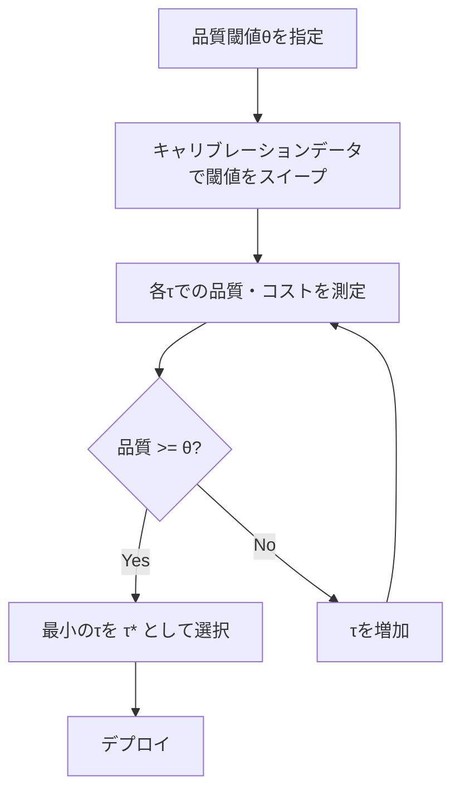
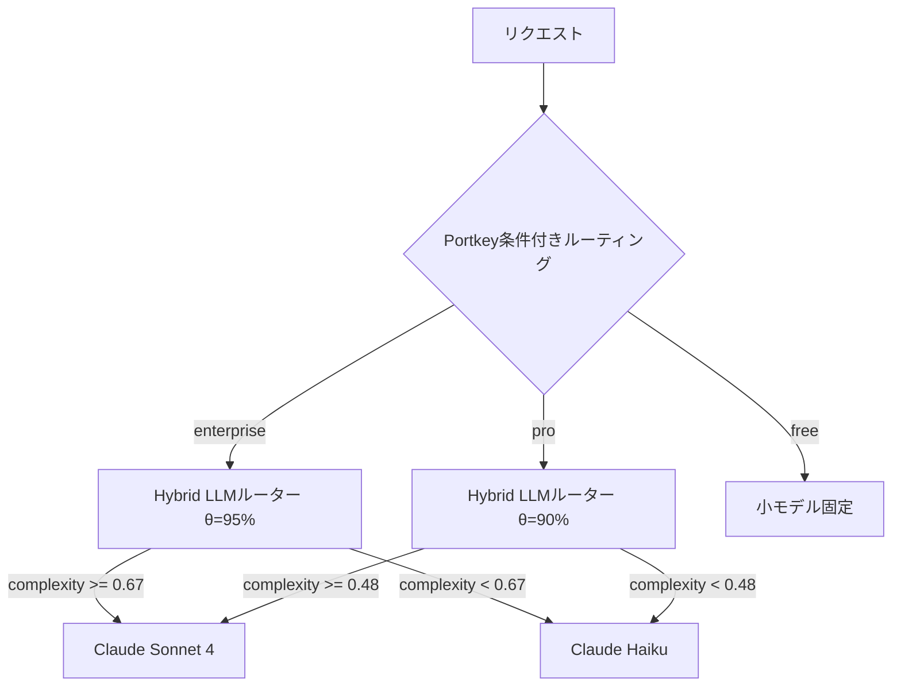

本記事は [Hybrid LLM: Cost-Efficient and Quality-Aware Query Routing (arXiv:2407.00066)](https://arxiv.org/abs/2407.00066) の解説記事です。

## 論文概要（Abstract）

Hybrid LLMは、Microsoft Researchが提案した、小型で高効率なLLMと大型で高性能なLLMを適応的クエリルーティング機構で組み合わせるハイブリッド推論システムである。著者らの主要な貢献は3つある：(1) クエリの複雑度（difficulty）と応答品質（quality）を分離して学習することで、モデルペア非依存の汎化を実現、(2) ユーザー指定の品質閾値に対する形式的保証を提供するオフライン校正プロセス、(3) 再学習不要で新しいモデルペアに適応可能な設計。論文の実験結果によると、OpenAssistantベンチマークにおいてGPT-4の93%の品質を維持しつつ、GPT-4呼び出しを65%削減することに成功したと報告されている。

この記事は [Zenn記事: Portkey AIゲートウェイ実装Deep Dive：条件付きルーティングとコスト最適化戦略](https://zenn.dev/0h_n0/articles/6c55b2409143b2) の深掘りです。

## 情報源

- **arXiv ID**: 2407.00066
- **URL**: [https://arxiv.org/abs/2407.00066](https://arxiv.org/abs/2407.00066)
- **著者**: Dujian Ding, Ankur Mallick, Chi Wang, Robert Sim, Subhabrata Mukherjee, Victor Ruhle, Larry Heck, Bill Dolan
- **発表年**: 2024
- **分野**: cs.LG, cs.AI, cs.CL
- **所属**: Microsoft Research

## 背景と動機（Background & Motivation）

GPT-4はGPT-3.5と比較して約8倍のコストがかかるとされ、この価格差はモデルが高性能化するにつれて拡大すると予想される。しかし、すべてのクエリが最高性能のモデルを必要とするわけではない。「簡単なクエリは安いモデルで処理し、難しいクエリだけ高いモデルにルーティングできるか？」という問いに対し、Hybrid LLMは肯定的に回答する。

従来のルーティング手法（RouteLLMのような選好データベースのアプローチを含む）には以下の課題があった：

1. **モデルペア依存**: 特定のモデルペア（例: GPT-4 vs. GPT-3.5）で訓練されたルーターは、別のモデルペアに転用しにくい
2. **品質保証の欠如**: ルーティングによる品質低下がどの程度許容されるかの形式的保証がない
3. **校正コスト**: モデルペアの変更や品質閾値の変更のたびに再学習が必要

Portkeyの条件付きルーティングはルールベースで品質閾値を制御できない。Hybrid LLMは学習ベースのルーティングに品質保証を組み込むことで、本番環境での信頼性を高めるアプローチを提案している。

## 主要な貢献（Key Contributions）

- **貢献1**: 複雑度と品質の分離学習（Decoupled Complexity-Quality Training）。クエリの「複雑度」はモデルペアに依存しないクエリ固有の属性であるため、複雑度を予測するように訓練することでモデルペア非依存の汎化を実現
- **貢献2**: オフライン校正（Offline Calibration）による形式的品質保証。再学習不要で品質閾値を変更でき、$P[Q(r, \tau^*) \geq \theta] \geq 1 - \delta$の保証を提供
- **貢献3**: 5つのベンチマーク（OpenAssistant, MMLU, BBH, TruthfulQA, HumanEval）での実証評価。品質閾値85%で72%のコスト削減、95%で35%のコスト削減を達成

## 技術的詳細（Technical Details）

### 問題の定式化

小型LLM $M_s$と大型LLM $M_l$が与えられたとき、ルーティングポリシー$r$を最適化する問題を以下のように定式化する：

$$
\min_{r} \mathbb{E}[\text{cost}(r(q))] \quad \text{s.t.} \quad \mathbb{E}[\text{quality}(r(q))] \geq \theta
$$

ここで、
- $r(q) \in \{M_s, M_l\}$: クエリ$q$に対するルーティング決定
- $\theta$: ユーザー指定の品質閾値（例: GPT-4品質の90%）
- $\text{cost}(r(q))$: ルーティング決定に基づくコスト（$M_l$にルーティングされた割合）
- $\text{quality}(r(q))$: ルーティング決定に基づく応答品質

この定式化は、「品質制約を満たしつつコストを最小化する」という制約付き最適化問題である。Portkeyの予算制限機能と概念的に類似しているが、Hybrid LLMは品質制約を明示的に定式化している点が異なる。

### 複雑度と品質の分離学習

著者らの最大の技術的貢献は、「クエリの複雑度」と「応答の品質」を分離して学習する訓練手法である。

**ナイーブなアプローチ**: ルーターを「$M_s$が高品質な応答を生成できるか」を直接予測するように訓練する。この場合、訓練ラベルがモデルペアに依存するため、新しいモデルペアへの汎化が困難。

**Hybrid LLMのアプローチ**: ルーターを「クエリの複雑度」を予測するように訓練する。複雑度はクエリ固有の属性であり、モデルペアに依存しない。

複雑度ラベル$c_i$の生成方法：

$$
c_i = \begin{cases} 1 \text{ (複雑)} & \text{if } \text{quality}(M_l, q_i) - \text{quality}(M_s, q_i) > \delta \\ 0 \text{ (単純)} & \text{otherwise} \end{cases}
$$

ここで$\delta$は閾値パラメータ（論文では$\delta = 1.0$を使用、品質は1-10スケール）。「大モデルと小モデルの品質差が大きいクエリ」を「複雑」とラベル付けする。絶対的な品質ではなくモデル間の品質差を使うことで、「小モデルでは不十分なクエリ」を正確に捉えられる。

### ルーターアーキテクチャ

ルーターはDeBERTa-v3-small（約22Mパラメータ）をバックボーンとし、[CLS]トークン上に二値分類ヘッドを配置する：

$$
p(c = 1 | q) = \sigma(\text{MLP}(\text{DeBERTa}(q)[\text{CLS}]))
$$

損失関数は二値交差エントロピー：

$$
\mathcal{L}_{\text{router}} = -\sum_{i} \left[ c_i \log p(c_i = 1 | q_i) + (1 - c_i) \log p(c_i = 0 | q_i) \right]
$$

DeBERTa-v3-smallの選択理由は、22Mパラメータという軽量さ（推論レイテンシ15-25ms）と、テキスト理解タスクでの高い性能のバランスにある。著者らは、より大きなルーターモデルでは有意な性能向上が見られなかったと報告している（論文Section 6.4のアブレーション結果）。

### オフライン校正プロセス

Hybrid LLMの最も実用的な特徴は、再学習不要で品質閾値を調整できるオフライン校正プロセスである。

ユーザーが品質閾値$\theta$（例: GPT-4品質の90%）を指定すると、以下のプロセスで最適な閾値$\tau^*$を求める：

$$
\tau^* = \min_{\tau} \tau \quad \text{s.t.} \quad \mathbb{E}_{q \in \text{cal}}[\text{quality}(r_\tau(q))] \geq \theta
$$

ここで$r_\tau(q)$は閾値$\tau$でのルーティング決定：

$$
r_\tau(q) = \begin{cases} M_l & \text{if } p(c = 1 | q) \geq \tau \\ M_s & \text{otherwise} \end{cases}
$$

校正手順：
1. 1000-2000件のキャリブレーションデータを用意
2. 各$\tau \in [0, 1]$について、品質とコストを測定
3. 品質$\geq \theta$を満たす最小の$\tau$を$\tau^*$として選択

このプロセスにより、以下の形式的保証が得られる：

$$
P[Q(r, \tau^*) \geq \theta] \geq 1 - \delta
$$

キャリブレーションセット1000件以上で$\delta < 0.05$を達成する。



Portkeyの重み付きロードバランシングでは、重みの変更はJSONコンフィグの更新のみで済むが、品質保証はユーザーの責任である。Hybrid LLMは校正プロセスにより品質保証を自動化している。

## 実装のポイント（Implementation）

### 訓練設定

論文Section 7に記載された設定：

```python
# Hybrid LLMルーターの訓練設定（論文Section 7.1より）
training_config = {
    "model": "DeBERTa-v3-small",       # 22Mパラメータ
    "max_seq_length": 512,
    "batch_size": 32,
    "learning_rate": 2e-5,              # 線形ウォームアップ付き
    "epochs": 10,
    "optimizer": "AdamW",
    "weight_decay": 0.01,
    "hardware": "Single A100 GPU",
    "training_time": "~2 hours",
    "training_data_size": "5K-10K examples",  # 性能飽和の閾値
    "complexity_threshold_delta": 1.0,   # 1-10スケール
    "calibration_set_size": "1000-2000 examples",
}
```

### 品質ラベル生成パイプライン

```python
from typing import Literal

def generate_complexity_labels(
    queries: list[str],
    small_llm: str,
    large_llm: str,
    judge_model: str = "gpt-4-turbo",
    delta: float = 1.0,
) -> list[Literal[0, 1]]:
    """クエリの複雑度ラベルを生成する

    Args:
        queries: クエリのリスト
        small_llm: 小型LLMの識別子
        large_llm: 大型LLMの識別子
        judge_model: 品質判定に使用するモデル
        delta: 品質差の閾値（1-10スケール）

    Returns:
        複雑度ラベルのリスト（0: 単純、1: 複雑）
    """
    labels = []
    for query in queries:
        # 両モデルで応答を生成
        response_small = call_llm(small_llm, query)
        response_large = call_llm(large_llm, query)

        # GPT-4ジャッジで品質を1-10で評価
        quality_small = judge_quality(judge_model, query, response_small)
        quality_large = judge_quality(judge_model, query, response_large)

        # 品質差が閾値δを超えたら「複雑」
        complexity = 1 if (quality_large - quality_small) > delta else 0
        labels.append(complexity)

    return labels
```

### 推論時のレイテンシプロファイル

論文Section 7.3に記載されたレイテンシ：

| コンポーネント | レイテンシ |
|--------------|-----------|
| ルーター（DeBERTa-v3-small on GPU） | 15-25ms |
| 小型LLM（Vicuna-7B） | 200-500ms |
| 大型LLM（GPT-4） | 500-2000ms |

ルーターのオーバーヘッドは全体のリクエストレイテンシの5%未満であり、Portkeyのエッジ処理（sub-10ms）と組み合わせても実用上問題のないレベルである。

## Production Deployment Guide

### AWS実装パターン（コスト最適化重視）

Hybrid LLMのDeBERTa-v3-smallルーターは22Mパラメータと軽量であり、CPU推論でも25-50ms程度で動作する。GPUは不要。

**トラフィック量別の推奨構成**:

| 規模 | 月間リクエスト | 推奨構成 | 月額コスト | 主要サービス |
|------|--------------|---------|-----------|------------|
| **Small** | ~3,000 (100/日) | Serverless | $50-150 | Lambda + Bedrock + DynamoDB |
| **Medium** | ~30,000 (1,000/日) | Hybrid | $300-800 | Lambda + ECS Fargate + ElastiCache |
| **Large** | 300,000+ (10,000/日) | Container | $2,000-5,000 | EKS + Karpenter + EC2 Spot |

**Small構成の詳細** (月額$50-150):
- **Lambda**: DeBERTaルーター（CPU推論、512MB RAM十分）($15/月)
- **Bedrock**: Claude Haiku（小モデル）+ Claude Sonnet 4（大モデル）($80/月)
- **DynamoDB**: 校正結果・ルーティングログ、On-Demand ($10/月)
- **S3**: DeBERTaモデルウェイト保存 ($1/月)

**コスト削減テクニック**:
- DeBERTaルーターはCPU推論で動作（GPU不要、コスト大幅削減）
- Hybrid LLMによるルーティングで35-72%のLLMコスト削減
- オフライン校正による品質保証で過剰なモデル使用を防止
- Bedrock Prompt Cachingで30-90%削減

**コスト試算の注意事項**:
- 上記は2026年3月時点のAWS ap-northeast-1（東京）リージョン料金に基づく概算値です
- 実際のコストはトラフィックパターン、リージョン、バースト使用量により変動します
- 最新料金は [AWS料金計算ツール](https://calculator.aws/) で確認してください

### Terraformインフラコード

**Small構成 (Serverless): Lambda + Bedrock + DynamoDB**

```hcl
module "vpc" {
  source  = "terraform-aws-modules/vpc/aws"
  version = "~> 5.0"

  name = "hybrid-llm-vpc"
  cidr = "10.0.0.0/16"
  azs  = ["ap-northeast-1a", "ap-northeast-1c"]
  private_subnets = ["10.0.1.0/24", "10.0.2.0/24"]

  enable_nat_gateway   = false
  enable_dns_hostnames = true
}

resource "aws_iam_role" "lambda_hybrid_llm" {
  name = "lambda-hybrid-llm-role"

  assume_role_policy = jsonencode({
    Version = "2012-10-17"
    Statement = [{
      Action = "sts:AssumeRole"
      Effect = "Allow"
      Principal = { Service = "lambda.amazonaws.com" }
    }]
  })
}

resource "aws_iam_role_policy" "bedrock_invoke" {
  role = aws_iam_role.lambda_hybrid_llm.id

  policy = jsonencode({
    Version = "2012-10-17"
    Statement = [{
      Effect   = "Allow"
      Action   = ["bedrock:InvokeModel"]
      Resource = "arn:aws:bedrock:ap-northeast-1::foundation-model/anthropic.*"
    }]
  })
}

resource "aws_lambda_function" "hybrid_llm_router" {
  filename      = "hybrid_llm_router.zip"
  function_name = "hybrid-llm-router"
  role          = aws_iam_role.lambda_hybrid_llm.arn
  handler       = "index.handler"
  runtime       = "python3.12"
  timeout       = 60
  memory_size   = 512  # DeBERTa-v3-small はCPU推論で512MB十分

  environment {
    variables = {
      MODEL_PATH        = "s3://hybrid-llm-models/deberta-v3-small-router/"
      QUALITY_THRESHOLD = "0.90"
      CALIBRATED_TAU    = "0.48"
      SMALL_MODEL       = "anthropic.claude-3-5-haiku-20241022-v1:0"
      LARGE_MODEL       = "anthropic.claude-sonnet-4-20250514-v1:0"
    }
  }
}

resource "aws_dynamodb_table" "calibration_log" {
  name         = "hybrid-llm-calibration-log"
  billing_mode = "PAY_PER_REQUEST"
  hash_key     = "query_hash"

  attribute {
    name = "query_hash"
    type = "S"
  }

  ttl {
    attribute_name = "expire_at"
    enabled        = true
  }
}
```

### セキュリティベストプラクティス

- **IAMロール**: Bedrock InvokeModelのみ許可（最小権限）
- **モデルウェイト**: S3 + KMS暗号化で保管
- **ネットワーク**: VPC内配置、パブリックアクセス不可
- **校正データ**: PII除去済みのデータのみ使用

### コスト最適化チェックリスト

- [ ] DeBERTaルーターのCPU推論でGPUコストゼロ
- [ ] オフライン校正で品質閾値を85%/90%/95%の3段階で設定
- [ ] 品質閾値85%設定で72%コスト削減
- [ ] 品質閾値90%設定で55%コスト削減
- [ ] Bedrock Batch APIで非リアルタイム処理50%削減
- [ ] AWS Budgets月額予算設定（80%で警告）
- [ ] 日次コストレポートでLLM使用比率を監視

## 実験結果（Results）

### OpenAssistant（GPT-4品質の90%維持時）

論文Section 6.1の結果：

| 手法 | 品質スコア | GPT-4呼び出し率 | コスト削減率 |
|------|-----------|----------------|-------------|
| GPT-4のみ | 9.4 | 100% | 0% |
| Vicuna-7Bのみ | 7.1 | 0% | 100% |
| Hybrid LLM | 8.7 (93%) | **35%** | **65%** |

### MMLU精度比較

論文Section 6.1の表より：

| 手法 | 大モデル使用率 | 精度 |
|------|-------------|------|
| 大モデルのみ | 100% | 86.4% |
| 小モデルのみ | 0% | 67.2% |
| ランダム (50%) | 50% | 76.8% |
| Hybrid LLM | 30% | 82.1% |
| Hybrid LLM | 50% | 84.9% |

著者らは、30%の大モデル使用率で82.1%の精度を達成しており、大モデル単体（86.4%）との差分19.2ポイント中の約60%を埋めていると報告している。

### ベースライン比較（AUC）

論文Section 6.1のAUC比較：

| 手法 | AUC |
|------|-----|
| ランダムルーティング | 0.68 |
| 文字列長ベースルーティング | 0.72 |
| パープレキシティベースルーティング | 0.74 |
| **Hybrid LLM** | **0.83** |
| Oracle（上界） | 0.91 |

Hybrid LLMはOracleの91%の性能を達成しており、ヒューリスティックベースラインを大幅に上回っている。

### 校正の有効性

論文Section 6.2の校正結果：

| 品質閾値 (θ) | 校正後の閾値 (τ) | 実現品質 | コスト削減率 |
|-------------|----------------|---------|-------------|
| 85% of GPT-4 | 0.31 | 85.3% | 72% |
| 90% of GPT-4 | 0.48 | 90.1% | 55% |
| 95% of GPT-4 | 0.67 | 95.2% | 35% |

品質誤差は0.1-0.3%以内に収まっており、オフライン校正の有効性が実証されている。

## 実運用への応用（Practical Applications）

Hybrid LLMのオフライン校正プロセスは、Portkeyの条件付きルーティングを補完する形で活用できる。



ユーザーティアごとに異なる品質閾値$\theta$を設定することで、Portkeyの条件付きルーティング（第1層: ティア判定）とHybrid LLMのルーティング（第2層: 複雑度判定）を組み合わせた多層ルーティングが実現できる。enterpriseユーザーには95%品質保証（35%コスト削減）、proユーザーには90%品質保証（55%コスト削減）を提供する。

## 関連研究（Related Work）

- **RouteLLM** (Ong et al., 2024, arXiv:2406.18665): 人間の選好データからルーティングを学習。Hybrid LLMは複雑度と品質を分離する点が異なり、形式的品質保証を提供する
- **FrugalGPT** (Chen et al., 2023): カスケード型のルーティング。小モデルから順に試行し品質が十分なら停止。Hybrid LLMはクエリ単位で直接ルーティング判断を行い、カスケードのレイテンシ増加を回避
- **AutoMix** (Madaan et al., 2024, arXiv:2402.14099): 小モデルの自己検証によるカスケード。Hybrid LLMは外部ジャッジ（GPT-4）を訓練時に使用し、推論時は軽量分類器のみで動作する点が異なる

## まとめと今後の展望

Hybrid LLMは、LLMルーティングにおいて「複雑度と品質の分離学習」と「オフライン校正による形式的品質保証」という2つの技術的貢献を提供する。特に、再学習不要で品質閾値を変更でき、新しいモデルペアにも校正のみで適応できる設計は、モデルの頻繁な更新が行われる本番環境において実用的である。

著者らは今後の方向性として、3つ以上のモデルへの多モデルルーティング、デプロイ後のフィードバックに基づくオンライン適応、タスク別の校正プロセスを挙げている。現状の二値ルーティングという制約は、Portkeyの多モデル対応（1,600+モデル）と比較すると限定的であるが、品質保証付きのルーティングという独自の価値提供は、SLAが求められるエンタープライズ環境で特に有用である。

## 参考文献

- **arXiv**: [https://arxiv.org/abs/2407.00066](https://arxiv.org/abs/2407.00066)
- **Microsoft Research**: [https://www.microsoft.com/en-us/research/publication/hybrid-llm-cost-efficient-and-quality-aware-query-routing/](https://www.microsoft.com/en-us/research/publication/hybrid-llm-cost-efficient-and-quality-aware-query-routing/)
- **Related Zenn article**: [https://zenn.dev/0h_n0/articles/6c55b2409143b2](https://zenn.dev/0h_n0/articles/6c55b2409143b2)
