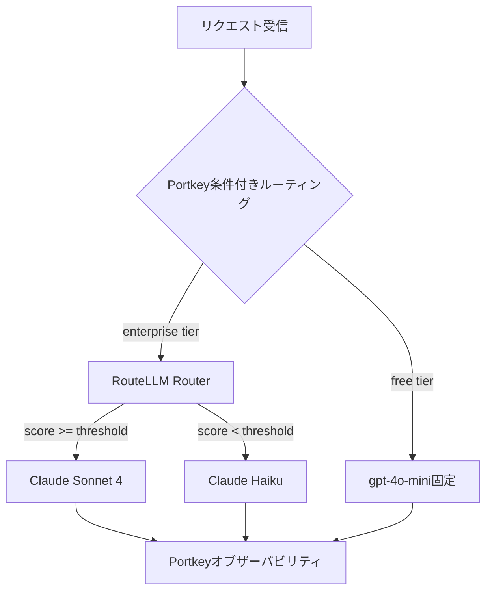

本記事は [RouteLLM: Learning to Route LLMs with Preference Data (arXiv:2406.18665)](https://arxiv.org/abs/2406.18665) の解説記事です。

## 論文概要（Abstract）

RouteLLMは、UC BerkeleyのLMSYS（Chatbot Arena）グループが提案したLLMルーティングフレームワークである。強いモデル（例: GPT-4）と弱いモデル（例: GPT-3.5-Turbo）の間でクエリを動的にルーティングし、推論コストを削減しながら応答品質を維持する。著者らは、Chatbot Arenaから収集した人間の選好データをBradley-Terryモデルで変換し、4種類のルーターアーキテクチャを訓練・評価している。論文Table 1の結果によると、データ拡張を適用したMatrix Factorizationルーターは、MMLUベンチマークにおいてGPT-4の95%の性能を維持しつつ、GPT-4呼び出しを58%削減した。

この記事は [Zenn記事: Portkey AIゲートウェイ実装Deep Dive：条件付きルーティングとコスト最適化戦略](https://zenn.dev/0h_n0/articles/6c55b2409143b2) の深掘りです。

## 情報源

- **arXiv ID**: 2406.18665
- **URL**: [https://arxiv.org/abs/2406.18665](https://arxiv.org/abs/2406.18665)
- **著者**: Isaac Ong, Amjad Almahairi, Vincent Wu, Wei-Lin Chiang, Tianhao Wu, Joseph E. Gonzalez, M. Waleed Shinwari, Ion Stoica
- **発表年**: 2024（更新: 2024-09-06）
- **分野**: cs.LG, cs.CL
- **コード**: [github.com/lm-sys/RouteLLM](https://github.com/lm-sys/RouteLLM)（Apache 2.0ライセンス）

## 背景と動機（Background & Motivation）

LLMの性能スペクトラムが広がるにつれ、GPT-4のような高性能モデルとGPT-3.5-Turboのような低コストモデルの間には、品質とコストの大きなギャップが存在する。実際のワークロードでは、すべてのクエリが最高性能のモデルを必要とするわけではない。FAQへの回答や単純な要約タスクであれば、低コストモデルでも十分な品質が得られるケースが多い。

しかし、従来のルーティング手法には以下の課題があった：

1. **ラベリングの困難さ**: LLMクエリはオープンエンドであり、「どのモデルが最適か」を判定する正解ラベルの作成が困難
2. **汎化性の欠如**: 特定のモデルペアで訓練されたルーターが、別のモデルペアに転用できない
3. **品質とコストのトレードオフ制御**: ルーティング判断の品質は応答品質で間接的にしか評価できないため、訓練が難しい

Portkey AIゲートウェイの条件付きルーティング（Zenn記事で解説されている`metadata.task_type`ベースのルーティング）は、手動でルールを定義するアプローチである。RouteLLMは、これを人間の選好データから自動的に学習するアプローチとして位置づけられる。

## 主要な貢献（Key Contributions）

- **貢献1**: LLMルーティング問題の定式化と評価フレームワークの提案。コスト-品質トレードオフ曲線による体系的な評価方法を確立
- **貢献2**: 4種類のルーターアーキテクチャ（SW Ranker、Matrix Factorization、BERT Classifier、LLM Classifier）の設計・実装・比較評価
- **貢献3**: GPT-4ジャッジによるデータ拡張がルーター性能を5-10ポイント改善することを実証
- **貢献4**: GPT-4/GPT-3.5で訓練したルーターがClaude-Opus/Haiku、Llama-70B/8Bペアにも汎化することを確認
- **貢献5**: OpenAI API・LiteLLM互換のOSSフレームワークとして公開（`pip install routellm`で利用可能）

## 技術的詳細（Technical Details）

### ルーティング問題の定式化

強いモデル$M^+$（例: GPT-4）と弱いモデル$M^-$（例: GPT-3.5）が与えられたとき、ルーターはクエリ$x$に対してルーティング決定$r(x) \in \{M^+, M^-\}$を出力する。

推論時、ルーターはスコア$s(x) \in [0, 1]$を算出し、閾値$\gamma \in [0, 1]$と比較してルーティングを決定する：

$$
r(x) = \begin{cases} M^+ & \text{if } s(x) \geq \gamma \\ M^- & \text{otherwise} \end{cases}
$$

ここで、
- $s(x)$: ルーターが算出する「強いモデルが必要である確率」
- $\gamma$: コスト-品質トレードオフを制御する閾値パラメータ

$\gamma$を大きくすると、より少ないクエリが$M^+$にルーティングされ、コストが下がる。$\gamma$の調整は再学習不要であり、これはPortkeyの`weight`パラメータによるロードバランシング調整と類似した設計思想である。

### Bradley-Terryモデルによるラベル抽出

Chatbot Arenaの人間選好データから、ルーティングラベルを抽出するためにBradley-Terryモデルを使用する。2つのモデル$i$, $j$の強さ（スコア）をそれぞれ$\beta_i$, $\beta_j$とすると、$i$が$j$より選好される確率は：

$$
P(i \succ j) = \frac{e^{\beta_i}}{e^{\beta_i} + e^{\beta_j}} = \sigma(\beta_i - \beta_j)
$$

ここで$\sigma$はシグモイド関数。このモデルをChatbot Arenaの80K以上のペアワイズ比較データに適用し、各クエリに対して「$M^+$が選好される確率」をルーティングラベルとして抽出する。

### 4種類のルーターアーキテクチャ

著者らは、異なるトレードオフを持つ4種類のルーターを設計・評価している：

| ルーター | 手法 | 推論レイテンシ | パラメータ数 |
|----------|------|---------------|-------------|
| SW Ranker | 訓練データとのコサイン類似度で非パラメトリックに判定 | ~50ms | なし（検索ベース） |
| Matrix Factorization (MF) | クエリ・モデルの潜在ベクトルの内積 | ~10ms | 数百万 |
| BERT Classifier | bert-base-uncasedのファインチューニング | ~30ms | 110M |
| LLM Classifier | Llama-2-13Bのファインチューニング | ~200ms | 13B |

#### Matrix Factorizationルーターの詳細

著者らが最も推奨するMFルーターは、クエリ$x$のルーティングスコアを以下のように計算する：

$$
s(x, M^+) = \langle \mathbf{v}_x, \mathbf{v}_{M^+} \rangle + b_x + b_{M^+}
$$

ここで、
- $\mathbf{v}_x$: クエリの潜在ベクトル（BERTエンコーダ + 線形層で取得）
- $\mathbf{v}_{M^+}$: 強いモデルの潜在ベクトル（end-to-end学習）
- $b_x$, $b_{M^+}$: バイアス項

損失関数は二値交差エントロピー：

$$
\mathcal{L}_{MF} = -\sum_{i} \left[ l_i \log \sigma(s(x_i, M^+)) + (1 - l_i) \log (1 - \sigma(s(x_i, M^+))) \right]
$$

$l_i$はBradley-Terryモデルから抽出されたルーティングラベル。MFルーターは10msのレイテンシで動作するため、本番環境での採用に適している。

### データ拡張戦略

著者らは、GPT-4をジャッジとして用いるデータ拡張が、すべてのルータータイプで5-10ポイントの性能向上をもたらすことを報告している。手順は以下の通り：

1. 新規クエリ$x$に対して$M^+$と$M^-$の両方で応答を生成
2. GPT-4に両応答を比較させ、選好ラベルを生成
3. 生成されたラベルを訓練データに追加

この拡張により、Chatbot Arenaデータだけでは不足するドメイン固有のクエリに対する判別能力が向上する。

## 実装のポイント（Implementation）

### 訓練設定

論文のSection 7.1に記載された訓練パラメータ：

```python
# RouteLLM MFルーターの訓練設定（論文Section 7.1より）
training_config = {
    "encoder": "text-embedding-ada-002",  # テキスト埋め込み
    "latent_dim": 64,                     # 潜在ベクトル次元
    "batch_size": 32,
    "learning_rate": 1e-4,                # MFルーター用
    "epochs": 10,
    "optimizer": "Adam",
    "weight_decay": 0.01,
    "hardware": "Single A100 GPU",
    "training_data_size": 50000,          # 性能飽和する閾値
}
```

### OpenAI API互換の推論コード

RouteLLMはOpenAI APIのドロップイン代替として使用できる。閾値はモデル名に埋め込む設計になっている：

```python
from routellm.controller import Controller

# RouteLLMコントローラーの初期化
client = Controller(
    routers=["mf"],                    # Matrix Factorizationルーター
    strong_model="gpt-4",             # 強いモデル
    weak_model="gpt-3.5-turbo",       # 弱いモデル
)

# ルーティング付き推論（閾値0.116をモデル名に埋め込み）
response = client.chat.completions.create(
    model="router-mf-0.11593",
    messages=[{"role": "user", "content": "四半期レポートを要約してください"}]
)
# → 内部でルーティングスコアを算出し、閾値0.116と比較
# → スコア >= 0.116 → GPT-4にルーティング
# → スコア < 0.116 → GPT-3.5-Turboにルーティング
```

### 閾値キャリブレーション

閾値$\gamma$はheld-outデータで事後キャリブレーションする。論文では以下の手順が推奨されている：

1. 目標品質レベルを設定（例: GPT-4性能の95%）
2. キャリブレーションデータセットで$\gamma$をスイープ
3. 目標を達成する最大の$\gamma$（= 最もコスト効率の良い閾値）を選択

### Portkeyとの比較

RouteLLMとPortkey AIゲートウェイは補完的な関係にある：

| 機能 | RouteLLM | Portkey |
|------|----------|---------|
| ルーティング判断 | 学習ベース（自動） | ルールベース（手動定義） |
| 対応モデル数 | 2モデル（強/弱） | 1,600+モデル |
| フォールバック | なし | あり（`on_status_codes`指定） |
| ロードバランシング | なし | あり（重み付き分散） |
| オブザーバビリティ | なし | ダッシュボード付き |
| コスト最適化 | 学習による自動最適化 | キャッシュ・予算制限 |

実運用では、PortkeyのAIゲートウェイ内にRouteLLMのルーティングロジックを組み込むことで、学習ベースのルーティングとプロバイダー間のフォールバック・ロードバランシングを同時に実現できる可能性がある。

## Production Deployment Guide

### AWS実装パターン（コスト最適化重視）

RouteLLMのルーターは軽量（MFルーターで10ms）であるため、Lambda関数として実装しLLM呼び出しの前段に配置するアーキテクチャが適している。

**トラフィック量別の推奨構成**:

| 規模 | 月間リクエスト | 推奨構成 | 月額コスト | 主要サービス |
|------|--------------|---------|-----------|------------|
| **Small** | ~3,000 (100/日) | Serverless | $50-150 | Lambda + Bedrock + DynamoDB |
| **Medium** | ~30,000 (1,000/日) | Hybrid | $300-800 | Lambda + ECS Fargate + ElastiCache |
| **Large** | 300,000+ (10,000/日) | Container | $2,000-5,000 | EKS + Karpenter + EC2 Spot |

**Small構成の詳細** (月額$50-150):
- **Lambda**: RouteLLMルーター実行、1GB RAM、30秒タイムアウト ($20/月)
- **Bedrock**: Claude 3.5 Haiku（弱モデル）+ Claude Sonnet 4（強モデル）($80/月)
- **DynamoDB**: ルーティング結果キャッシュ、On-Demand ($10/月)
- **CloudWatch**: 基本監視 ($5/月)
- **API Gateway**: REST API ($5/月)

**コスト削減テクニック**:
- Spot Instances使用で最大90%削減（EKS + Karpenter）
- Bedrock Batch API使用で50%削減（非リアルタイム処理）
- Prompt Caching有効化で30-90%削減
- RouteLLMによるルーティングで40-58%のLLMコスト削減

**コスト試算の注意事項**:
- 上記は2026年3月時点のAWS ap-northeast-1（東京）リージョン料金に基づく概算値です
- 実際のコストはトラフィックパターン、リージョン、バースト使用量により変動します
- 最新料金は [AWS料金計算ツール](https://calculator.aws/) で確認してください

### Terraformインフラコード

**Small構成 (Serverless): Lambda + Bedrock + DynamoDB**

```hcl
module "vpc" {
  source  = "terraform-aws-modules/vpc/aws"
  version = "~> 5.0"

  name = "routellm-vpc"
  cidr = "10.0.0.0/16"
  azs  = ["ap-northeast-1a", "ap-northeast-1c"]
  private_subnets = ["10.0.1.0/24", "10.0.2.0/24"]

  enable_nat_gateway   = false
  enable_dns_hostnames = true
}

resource "aws_iam_role" "lambda_routellm" {
  name = "lambda-routellm-role"

  assume_role_policy = jsonencode({
    Version = "2012-10-17"
    Statement = [{
      Action = "sts:AssumeRole"
      Effect = "Allow"
      Principal = { Service = "lambda.amazonaws.com" }
    }]
  })
}

resource "aws_iam_role_policy" "bedrock_invoke" {
  role = aws_iam_role.lambda_routellm.id

  policy = jsonencode({
    Version = "2012-10-17"
    Statement = [{
      Effect   = "Allow"
      Action   = ["bedrock:InvokeModel", "bedrock:InvokeModelWithResponseStream"]
      Resource = "arn:aws:bedrock:ap-northeast-1::foundation-model/anthropic.*"
    }]
  })
}

resource "aws_lambda_function" "routellm_handler" {
  filename      = "lambda.zip"
  function_name = "routellm-router"
  role          = aws_iam_role.lambda_routellm.arn
  handler       = "index.handler"
  runtime       = "python3.12"
  timeout       = 60
  memory_size   = 1024

  environment {
    variables = {
      ROUTER_TYPE      = "mf"
      ROUTING_THRESHOLD = "0.11593"
      STRONG_MODEL     = "anthropic.claude-sonnet-4-20250514-v1:0"
      WEAK_MODEL       = "anthropic.claude-3-5-haiku-20241022-v1:0"
      DYNAMODB_TABLE   = aws_dynamodb_table.routing_cache.name
    }
  }
}

resource "aws_dynamodb_table" "routing_cache" {
  name         = "routellm-routing-cache"
  billing_mode = "PAY_PER_REQUEST"
  hash_key     = "query_hash"

  attribute {
    name = "query_hash"
    type = "S"
  }

  ttl {
    attribute_name = "expire_at"
    enabled        = true
  }
}
```

**Large構成 (Container): EKS + Karpenter + Spot Instances**

```hcl
module "eks" {
  source  = "terraform-aws-modules/eks/aws"
  version = "~> 20.0"

  cluster_name    = "routellm-cluster"
  cluster_version = "1.31"

  vpc_id     = module.vpc.vpc_id
  subnet_ids = module.vpc.private_subnets

  cluster_endpoint_public_access = true
  enable_cluster_creator_admin_permissions = true
}

resource "kubectl_manifest" "karpenter_provisioner" {
  yaml_body = <<-YAML
    apiVersion: karpenter.sh/v1alpha5
    kind: Provisioner
    metadata:
      name: routellm-spot
    spec:
      requirements:
        - key: karpenter.sh/capacity-type
          operator: In
          values: ["spot"]
        - key: node.kubernetes.io/instance-type
          operator: In
          values: ["c6i.xlarge", "c6i.2xlarge"]
      limits:
        resources:
          cpu: "32"
          memory: "64Gi"
      ttlSecondsAfterEmpty: 30
  YAML
}

resource "aws_budgets_budget" "routellm_monthly" {
  name         = "routellm-monthly-budget"
  budget_type  = "COST"
  limit_amount = "5000"
  limit_unit   = "USD"
  time_unit    = "MONTHLY"

  notification {
    comparison_operator        = "GREATER_THAN"
    threshold                  = 80
    threshold_type             = "PERCENTAGE"
    notification_type          = "ACTUAL"
    subscriber_email_addresses = ["ops@example.com"]
  }
}
```

### セキュリティベストプラクティス

- **IAMロール**: 最小権限原則（Bedrock InvokeModelのみ許可）
- **ネットワーク**: VPC内配置、パブリックサブネット不使用
- **シークレット**: AWS Secrets Manager使用、環境変数ハードコード禁止
- **暗号化**: S3/DynamoDB全てKMS暗号化
- **監査**: CloudTrail/Config有効化

### 運用・監視設定

**CloudWatch Logs Insightsクエリ**:
```sql
fields @timestamp, router_type, routing_decision, latency_ms
| stats count(*) as total,
        sum(case when routing_decision = 'strong' then 1 else 0 end) as strong_count,
        avg(latency_ms) as avg_latency
  by bin(1h)
| filter total > 0
```

**コスト最適化チェックリスト**:
- [ ] ~100 req/日 → Lambda + Bedrock (Serverless) - $50-150/月
- [ ] ~1000 req/日 → ECS Fargate + Bedrock (Hybrid) - $300-800/月
- [ ] 10000+ req/日 → EKS + Spot Instances (Container) - $2,000-5,000/月
- [ ] RouteLLM MFルーターで40-58%のLLMコスト削減
- [ ] Bedrock Batch APIで50%削減（非リアルタイム処理）
- [ ] Prompt Caching有効化で30-90%削減
- [ ] AWS Budgets月額予算設定（80%で警告）
- [ ] CloudWatchアラームでルーティング異常検知

## 実験結果（Results）

### MMLU（GPT-4 vs. GPT-3.5-Turbo）

論文Table 1より、GPT-4の95%性能（精度88.4%）維持時の各ルーターのGPT-4呼び出し率：

| ルーター | GPT-4呼び出し率 | コスト削減率 |
|----------|----------------|-------------|
| ランダム | 100% | 0% |
| SW Ranker | 62% | 38% |
| Matrix Factorization | 56% | 44% |
| BERT Classifier | 54% | 46% |
| MF + データ拡張 | **42%** | **58%** |
| BERT + データ拡張 | 45% | 55% |

データ拡張により、MFルーターは58%のコスト削減を達成した。これはランダムルーティング比で58ポイントの改善であり、論文の主張する「GPT-4呼び出しを40%以上削減」を上回る結果である。

### MT-Bench（会話品質評価）

論文Section 6.2より、GPT-4ジャッジスコア（10点満点）での評価：
- GPT-4 100%使用時: 9.2
- 50% GPT-4呼び出し（BERT + データ拡張）: 9.1

つまり、GPT-4呼び出しを半減させても、品質はわずか0.1ポイントの低下にとどまると報告されている。

### 異なるモデルペアへの汎化

論文Section 6.3より、GPT-4/GPT-3.5で訓練したルーターの転移性能：

| ルーター | テスト対象ペア | AUC |
|----------|---------------|-----|
| MF | Claude-Opus / Claude-Haiku | 0.71 |
| BERT | Claude-Opus / Claude-Haiku | 0.74 |
| MF | Llama-70B / Llama-8B | 0.68 |
| BERT | Llama-70B / Llama-8B | 0.72 |

モデルペアを変更しても一定の汎化性能が得られるが、性能は低下する。著者らは、新しいモデルペアではキャリブレーションデータでの閾値再調整を推奨している。

## 実運用への応用（Practical Applications）

RouteLLMは、Portkey AIゲートウェイの条件付きルーティングと組み合わせることで、以下のような多層ルーティングアーキテクチャを構築できる：



1. **第1層（Portkey）**: メタデータベースでユーザーティア・タスク種別によるルーティング
2. **第2層（RouteLLM）**: クエリ内容に基づく学習ベースの強/弱モデル選択
3. **第3層（Portkey）**: フォールバック・ロードバランシングによる可用性確保

RouteLLMのMFルーターは10msのレイテンシで動作するため、Portkeyのエッジ処理（同様にms単位）と組み合わせても、エンドユーザーへの影響は許容範囲内である。

## 関連研究（Related Work）

- **FrugalGPT** (Chen et al., 2023): カスケード型ルーティングを提案。小モデルから順に試行し、品質が十分なら停止するアプローチ。RouteLLMはクエリ自体から直接ルーティング判断を行う点で異なる
- **Hybrid LLM** (Ding et al., 2024, arXiv:2407.00066): Microsoft Researchによる品質制約付きルーティング。クエリの複雑度と品質を分離して学習する点がRouteLLMと異なる。オフライン校正による形式的品質保証を提供
- **AutoMix** (Madaan et al., 2024, arXiv:2402.14099): 小モデルの自己検証によるカスケードルーティング。追加学習不要でfew-shotプロンプティングのみで動作する軽量なアプローチ

## まとめと今後の展望

RouteLLMは、人間の選好データをBradley-Terryモデルで変換しルーティングラベルとして活用するという着想により、GPT-4呼び出しを最大58%削減しながら95%の品質を維持するフレームワークを実現した。OSSとして公開されており、`pip install routellm`で即座に利用できる点は実運用上の大きな利点である。

ただし、現状では2モデル間の二値ルーティングに限定されており、Portkeyのように3つ以上のモデルを動的に選択するユースケースには直接適用できない。著者らは多モデルルーティング、オンライン学習による分布シフトへの適応、投機的デコーディングとの統合を今後の方向性として挙げている。

## 参考文献

- **arXiv**: [https://arxiv.org/abs/2406.18665](https://arxiv.org/abs/2406.18665)
- **Code**: [https://github.com/lm-sys/RouteLLM](https://github.com/lm-sys/RouteLLM)
- **Related Zenn article**: [https://zenn.dev/0h_n0/articles/6c55b2409143b2](https://zenn.dev/0h_n0/articles/6c55b2409143b2)
- **Chatbot Arena**: [https://chat.lmsys.org/](https://chat.lmsys.org/)
