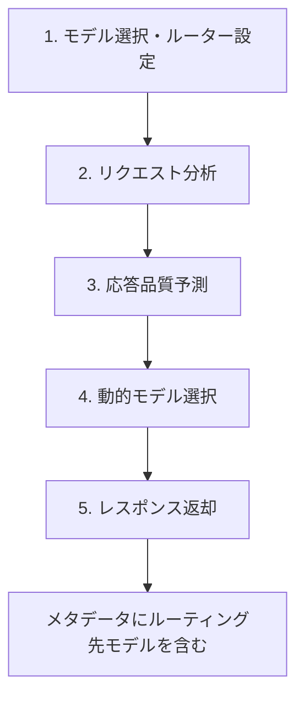
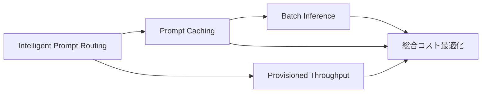

本記事は [Amazon Bedrock Intelligent Prompt Routing](https://aws.amazon.com/bedrock/intelligent-prompt-routing/) および [公式ドキュメント](https://docs.aws.amazon.com/bedrock/latest/userguide/prompt-routing.html) の解説記事です。

## ブログ概要（Summary）

Amazon Bedrock Intelligent Prompt Routingは、2025年4月にGA（一般提供）となったマネージドLLMルーティングサービスである。単一のサーバーレスエンドポイントから、同一モデルファミリー内の異なるモデルにプロンプトを動的にルーティングし、応答品質とコストの両方を最適化する。AWS公式ブログによると、Anthropicファミリーでのルーティングにおいて内部テストで最大60%のコスト削減を達成し、Claude Sonnet 3.5 v2と同等の応答品質を維持したと報告されている。

この記事は [Zenn記事: Portkey AIゲートウェイ実装Deep Dive：条件付きルーティングとコスト最適化戦略](https://zenn.dev/0h_n0/articles/6c55b2409143b2) の深掘りです。

## 情報源

- **種別**: AWSマネージドサービス / 企業テックブログ
- **URL**: [https://aws.amazon.com/bedrock/intelligent-prompt-routing/](https://aws.amazon.com/bedrock/intelligent-prompt-routing/)
- **ドキュメント**: [https://docs.aws.amazon.com/bedrock/latest/userguide/prompt-routing.html](https://docs.aws.amazon.com/bedrock/latest/userguide/prompt-routing.html)
- **組織**: Amazon Web Services
- **GA日**: 2025年4月

## 技術的背景（Technical Background）

LLMルーティングの学術研究（RouteLLM、Hybrid LLM、AutoMix等）は、ルーターの訓練・デプロイ・運用を各組織が自前で行うことを前提としている。これに対し、Amazon Bedrock Intelligent Prompt Routingは、ルーティングロジック自体をAWSがマネージドサービスとして提供するアプローチを取る。

ユーザーはルーティングのための分類器の訓練やインフラの構築が不要であり、AWS CLIまたはAPIで「2つのモデルと品質差閾値」を指定するだけでルーティングが動作する。PortkeyのAIゲートウェイが1,600+モデルを対象としたプロバイダー横断のルーティングを提供するのに対し、Bedrock Intelligent Prompt Routingは同一モデルファミリー内（例: Anthropicファミリー内のClaude Haiku ↔ Claude Sonnet）でのルーティングに特化している。

## 実装アーキテクチャ（Architecture）

### 5ステップのルーティングパイプライン

公式ドキュメントに記載されたルーティングの動作フロー：



1. **モデル選択・ルーター設定**: 同一ファミリーから2モデルを選択し、ルーティング基準を設定
2. **リクエスト分析**: プロンプトの内容とコンテキストを分析
3. **応答品質予測**: 各モデルの応答品質をプロンプトごとに予測
4. **動的モデル選択**: 品質/コストの最適な組み合わせのモデルを選択
5. **レスポンス返却**: 選択されたモデルの応答と、ルーティングメタデータを返却

### 対応モデルファミリー

公式ドキュメントに記載されたサポートモデル（2025年4月GA時点）：

| ファミリー | モデル | モデルID |
|-----------|--------|---------|
| **Amazon Nova** | Nova Lite | `amazon.nova-lite-v1:0` |
| | Nova Pro | `amazon.nova-pro-v1:0` |
| **Anthropic** | Claude 3 Haiku | `anthropic.claude-3-haiku-20240307-v1:0` |
| | Claude 3.5 Haiku | `anthropic.claude-3-5-haiku-20241022-v1:0` |
| | Claude 3.5 Sonnet v1 | `anthropic.claude-3-5-sonnet-20240620-v1:0` |
| | Claude 3.5 Sonnet v2 | `anthropic.claude-3-5-sonnet-20241022-v2:0` |
| **Meta** | Llama 3.1 8B | `meta.llama3-1-8b-instruct-v1:0` |
| | Llama 3.1 70B | `meta.llama3-1-70b-instruct-v1:0` |
| | Llama 3.2 11B | `meta.llama3-2-11b-instruct-v1:0` |
| | Llama 3.2 90B | `meta.llama3-2-90b-instruct-v1:0` |
| | Llama 3.3 70B | `meta.llama3-3-70b-instruct-v1:0` |

**制約**: 同一ファミリー内の2モデルのみ指定可能。ファミリーをまたぐルーティング（例: Claude → Llama）は未対応。

### ルーター設定オプション

公式ドキュメントによると、2種類のルーターが提供されている：

#### デフォルトPrompt Router

AWSが事前設定したルーター。設定不要で即座に利用可能。Anthropic、Meta、Novaファミリーで提供。

#### Configured Prompt Router

ユーザーが独自に設定するルーター。以下のパラメータをカスタマイズ可能：

- **ルーティング対象モデル**: ファミリー内から2モデルを選択
- **フォールバックモデル**: ベースラインとなるモデル（ルーティング基準を満たさない場合に使用）
- **Response Quality Difference（応答品質差閾値）**: 0.0〜1.0の範囲。フォールバックモデルとの品質差がこの閾値を超えた場合にのみ代替モデルにルーティング

### APIとCLI

```bash
# Configured Prompt Routerの作成（AWS CLI）
aws bedrock create-prompt-router \
  --prompt-router-name "anthropic-cost-optimizer" \
  --models '[{
    "modelArn": "arn:aws:bedrock:us-east-1::foundation-model/anthropic.claude-3-5-sonnet-20241022-v2:0"
  }]' \
  --fallback-model '[{
    "modelArn": "arn:aws:bedrock:us-east-1::foundation-model/anthropic.claude-3-5-haiku-20241022-v1:0"
  }]' \
  --routing-criteria '{"responseQualityDifference": 0.5}'
```

このコマンドでは：
- **フォールバックモデル**: Claude 3.5 Haiku（低コスト・ベースライン）
- **代替モデル**: Claude 3.5 Sonnet v2（高性能）
- **閾値**: 0.5（Sonnet v2の品質がHaikuより50%以上良いと予測された場合のみSonnet v2を使用）

利用可能なAPI操作：

| 操作 | 用途 |
|------|------|
| `CreatePromptRouter` | カスタムルーター作成 |
| `GetPromptRouter` | ルーター詳細取得 |
| `ListPromptRouters` | ルーター一覧表示 |
| `DeletePromptRouter` | ルーター削除 |

## Portkeyとの比較分析

Amazon Bedrock Intelligent Prompt RoutingとPortkey AIゲートウェイは、LLMルーティングに対して根本的に異なるアプローチを取っている：

| 比較項目 | Bedrock Intelligent Prompt Routing | Portkey AIゲートウェイ |
|---------|-----------------------------------|---------------------|
| **ルーティング範囲** | 同一ファミリー内の2モデル | 1,600+モデル、プロバイダー横断 |
| **ルーティング判断** | AWS独自の品質予測モデル（マネージド） | ルールベース（`$eq`, `$gt`等のクエリ演算子） |
| **設定の柔軟性** | responseQualityDifference閾値のみ | 条件付き、ロードバランシング、フォールバックのネスト |
| **フォールバック** | フォールバックモデル（品質ベース） | HTTPステータスコードベース |
| **ロードバランシング** | なし | 重み付き分散 |
| **キャッシュ** | Bedrock Prompt Caching（別機能） | シンプル/セマンティックキャッシュ |
| **インフラ管理** | 完全マネージド | SaaS（マネージド） |
| **料金体系** | Bedrockモデル使用料のみ | ログベース（Pro: 100Kログ/$9） |
| **言語最適化** | 英語のみ最適化 | 言語制約なし |

### 使い分けの指針

- **Bedrock Intelligent Prompt Routing**: AWS環境に閉じたワークロードで、同一ファミリー内のコスト最適化が主目的の場合に適している。設定がシンプルで、インフラ管理が不要
- **Portkey**: マルチプロバイダー環境（OpenAI + Anthropic + Google等）で、複雑なルーティング戦略（条件付き→ロードバランシング→フォールバックのネスト）が必要な場合に適している

両者の併用も可能であり、Portkey側でプロバイダー間のルーティング・フォールバックを行い、Bedrock側でファミリー内の品質最適化ルーティングを行う構成が考えられる。

## パフォーマンス最適化（Performance）

### コスト削減実績

AWS公式ブログの報告による：

| ファミリー | テスト条件 | コスト削減率 | 品質維持 |
|-----------|-----------|-------------|---------|
| Anthropic | 内部テスト（数百プロンプト） | 最大60% | Claude Sonnet 3.5 v2同等 |
| Amazon Nova | デフォルトルーター | 約35% | Nova Pro同等 |

AWS公式ブログの報告であるが、具体的なベンチマークデータセットや評価指標は公開されていない。学術論文（RouteLLM、Hybrid LLM）のように第三者検証可能な形での実験結果は提供されていない。

### Bedrockの関連コスト最適化機能

Intelligent Prompt Routingは、Bedrockの他のコスト最適化機能と組み合わせて使用できる：

1. **Prompt Caching**: 繰り返しプロンプト（システムプロンプト等）のキャッシュで最大90%削減
2. **Batch Inference**: 非リアルタイム処理で50%割引
3. **Provisioned Throughput**: 予測可能なワークロードで安定したコスト
4. **Model Distillation**: 大モデルの知識を小モデルに蒸留してコスト削減



## 運用での学び（Production Lessons）

### 制約と考慮事項

公式ドキュメントに記載された制約：

1. **英語最適化のみ**: ルーティングの品質予測モデルは英語プロンプトに最適化されている。日本語プロンプトでの精度は保証されていない
2. **アプリケーション固有データ不可**: ルーティング判断にアプリケーション固有のパフォーマンスデータを反映できない。Portkeyの条件付きルーティングのように`metadata.task_type`でルーティングロジックをカスタマイズすることは不可
3. **同一ファミリー制約**: Claude → Llamaのようなファミリー横断ルーティングは未対応
4. **2モデル制約**: 3つ以上のモデルを同時に指定できない

### Portkey条件付きルーティングとの補完

Bedrockの制約を補うため、Portkeyの条件付きルーティングと組み合わせるパターンが考えられる：

```python
from portkey_ai import Portkey

# Portkey: プロバイダー間ルーティング（第1層）
provider_routing_config = {
    "strategy": {
        "mode": "conditional",
        "conditions": [
            {
                "query": {"metadata.task_type": {"$eq": "coding"}},
                "then": "anthropic-family"
            },
            {
                "query": {"metadata.task_type": {"$eq": "summarization"}},
                "then": "nova-family"
            }
        ],
        "default": "anthropic-family"
    },
    "targets": [
        {
            "name": "anthropic-family",
            "virtual_key": "bedrock-key",
            # Bedrock Intelligent Prompt Router ARNを指定
            # ファミリー内ルーティングはBedrock側で自動処理
            "override_params": {
                "model": "arn:aws:bedrock:us-east-1:123456789:prompt-router/anthropic-router"
            }
        },
        {
            "name": "nova-family",
            "virtual_key": "bedrock-key",
            "override_params": {
                "model": "arn:aws:bedrock:us-east-1:123456789:prompt-router/nova-router"
            }
        }
    ]
}
```

この構成では：
- **第1層（Portkey）**: タスク種別でプロバイダー/モデルファミリーを選択
- **第2層（Bedrock）**: ファミリー内で品質予測に基づく動的ルーティング
- **第3層（Portkey）**: フォールバック・ロードバランシングで可用性確保

## 学術研究との関連（Academic Connection）

Amazon Bedrock Intelligent Prompt Routingは、以下の学術研究のコンセプトをマネージドサービスとして実装したものと解釈できる：

- **RouteLLM** (Ong et al., 2024): RouteLLMのMFルーターと同様に、プロンプトから品質予測を行いルーティング判断する。ただし、RouteLLMがOSSで公開されているのに対し、Bedrockの品質予測モデルはブラックボックス
- **Hybrid LLM** (Ding et al., 2024): Hybrid LLMの「品質閾値ベースのルーティング」と概念的に同一。BedrockのresponseQualityDifference閾値はHybrid LLMの$\tau$パラメータに対応する
- **FrugalGPT** (Chen et al., 2023): FrugalGPTの「コスト効率を最大化するモデル選択」の目標をマネージドサービスとして提供

## まとめと実践への示唆

Amazon Bedrock Intelligent Prompt Routingは、LLMルーティングの研究成果をマネージドサービスとして提供する初の主要クラウドサービスである。「2モデル、同一ファミリー、responseQualityDifference閾値」というシンプルな設定で、AWS公式ブログによると最大60%のコスト削減を実現する。

ただし、英語プロンプトのみへの最適化、同一ファミリー制約、アプリケーション固有データの反映不可という制約があり、Portkeyのような柔軟なルーティング戦略とは異なるポジショニングを持つ。AWS環境に閉じたワークロードでの「手軽なコスト最適化」として位置づけるのが適切であり、複雑なマルチプロバイダー環境ではPortkeyとの併用が推奨される。

## 参考文献

- **AWS公式ページ**: [https://aws.amazon.com/bedrock/intelligent-prompt-routing/](https://aws.amazon.com/bedrock/intelligent-prompt-routing/)
- **公式ドキュメント**: [https://docs.aws.amazon.com/bedrock/latest/userguide/prompt-routing.html](https://docs.aws.amazon.com/bedrock/latest/userguide/prompt-routing.html)
- **AWS Blog (GA発表)**: [https://aws.amazon.com/about-aws/whats-new/2025/04/amazon-bedrock-intelligent-prompt-routing-generally-available/](https://aws.amazon.com/about-aws/whats-new/2025/04/amazon-bedrock-intelligent-prompt-routing-generally-available/)
- **コスト最適化ブログ**: [https://aws.amazon.com/blogs/machine-learning/use-amazon-bedrock-intelligent-prompt-routing-for-cost-and-latency-benefits/](https://aws.amazon.com/blogs/machine-learning/use-amazon-bedrock-intelligent-prompt-routing-for-cost-and-latency-benefits/)
- **Related Zenn article**: [https://zenn.dev/0h_n0/articles/6c55b2409143b2](https://zenn.dev/0h_n0/articles/6c55b2409143b2)
