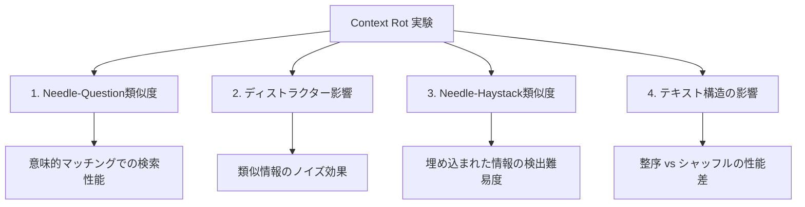

本記事は [Chroma Research "Context Rot: How Increasing Input Tokens Impacts LLM Performance"](https://research.trychroma.com/context-rot) の解説記事です。

## ブログ概要（Summary）

Chroma Researchが2025年7月に公開した本研究は、18のLLMに対して194,480回のAPI呼び出しを行い、入力トークン数の増加がモデル性能に与える影響を体系的に検証したものである。著者ら（Kelly Hong, Anton Troynikov, Jeff Huber）は、タスク難易度を一定に保ちながら入力長のみを変化させるという実験設計により、**すべてのモデルでコンテキスト長の増加に伴い性能が劣化する**ことを定量的に示している。

この記事は [Zenn記事: RAG vs ロングコンテキスト：1Mトークン時代の最適な使い分けと判断フレームワーク](https://zenn.dev/0h_n0/articles/0f09fc0a93ea15) の深掘りです。

## 情報源

- **種別**: 企業テックブログ（研究レポート）
- **URL**: [https://research.trychroma.com/context-rot](https://research.trychroma.com/context-rot)
- **組織**: Chroma Research（ベクトルデータベース企業）
- **発表日**: 2025年7月14日

## 技術的背景（Technical Background）

2026年時点で主要なLLMのコンテキストウィンドウは128K〜1Mトークンに達しているが、「公称コンテキスト長 = 実効的に活用可能な長さ」ではないことが多くの実務者に知られている。Chroma社の研究はこの直感を定量的に裏付けるものであり、RAG vs ロングコンテキストの設計判断において、**ロングコンテキストの限界を正確に把握する**ための基礎データを提供している。

従来のNeedle-in-a-Haystack（NIAH）テストは語彙的マッチングに依存していたが、本研究ではより現実的な条件（意味的マッチング、ディストラクター存在、テキスト構造の影響）を制御変数として導入している。

## 実験設計と手法（Methodology）

### 実験の基本原則

本研究の核心は、**タスク複雑度を一定に保ちつつ入力長のみを変化させる**という実験設計である。これにより、従来のベンチマーク（入力長と複雑度を同時に変化させていた）では分離できなかった「純粋な入力長の影響」を測定している。

### 評価規模

- **評価対象**: 18モデル（Anthropic 5、OpenAI 7、Google 3、Alibaba 3）
- **API呼び出し総数**: 194,480回（うち拒否69回、0.035%）
- **入力長バリエーション**: 8段階/実験
- **ニードル位置**: 11ポジション
- **評価手法**: GPT-4.1ジャッジ（人間との一致率99%以上に校正）

### 4つの実験

## 実験結果の詳細

### 実験1: Needle-Question類似度

Paul GrahamのエッセイとarXiv論文をhaystackとして使用し、needleとquestionの意味的類似度を制御した実験である。

**類似度範囲**:
- PGエッセイ: 0.445-0.775（SD < 0.1）
- arXiv論文: 0.521-0.829（SD < 0.1）

報告されている主要な発見は、**needle-question類似度が低下するほど、入力長増加に伴う性能劣化がより顕著になる**ことである。短い入力長では低類似度ペアでも高い性能を維持するが、コンテキストが長くなると劣化率が類似度スコアと直接的に相関する。

### 実験2: ディストラクター影響分析

3つの実験条件を設定している：
1. **ベースライン**: ニードルのみ
2. **単一ディストラクター**: 4つのうち1つをランダム配置
3. **複数ディストラクター**: 4つすべてをランダム配置

著者らの報告によると、ディストラクターの影響は均一ではない。例えばarXiv haystackとPGエッセイneedleの組み合わせでは、ディストラクター3（赤）が他のディストラクターと比較して性能低下が大きいことが観察されている。

**ハルシネーション分析（モデル別の傾向）**:

著者らの報告では、モデルファミリーによってハルシネーションへの対応が大きく異なる：

- **Claude系モデル**: 「一貫して最も低いハルシネーション率」を示し、不確実な場合は回答を控える（abstain）傾向がある
- **GPT系モデル**: 「最も高いハルシネーション率」を示し、自信を持って不正確な回答を生成する傾向がある

この差異はRAG設計において重要な示唆を持つ。ディストラクターが多い環境（＝現実のRAGチャンク投入）では、モデル選択がハルシネーション率に直接影響する。

### 実験3: Needle-Haystack類似度

5つのエンベディングモデル（text-embedding-3-small/large、jina-embeddings-v3、voyage-3-large、all-MiniLM-L6-v2）で平均コサイン類似度を算出している。

**類似度スコア**:

| Haystack | Needle | 平均類似度 | 変動 |
|----------|--------|----------|------|
| PGエッセイ | PGエッセイ | 0.529 | 0.101 |
| PGエッセイ | arXiv論文 | 0.368 | 0.111 |
| arXiv論文 | arXiv論文 | 0.654 | 0.086 |
| arXiv論文 | PGエッセイ | 0.394 | 0.105 |

著者らの報告で注目すべき発見は、PGエッセイhaystackでは**arXivのneedleがPGのneedleよりも性能が高い**ことである。つまり、**needleがhaystackと意味的に混ざり合わないほうが検出性能が高い**。ただし、arXiv haystackではこの差異は最小限であり、著者らは「needle-haystack類似度の影響は均一ではなく、さらなる調査が必要」と述べている。

### 実験4: テキスト構造の影響（シャッフル実験）

2つの条件を比較している：
1. **オリジナル**: 自然な論理的流れを保持
2. **シャッフル**: 文をランダムに並び替え（トピックは維持、論理的一貫性を除去）

著者らが「反直感的」と表現する発見は、**18モデルすべてで、論理的流れを保持したテキストよりもシャッフルしたテキストのほうが性能が高い**ことである。

この現象の解釈として、整序されたテキストでは強い位置バイアス（recency bias）が発生し、末尾のパッセージに注意が過度に集中すると考えられている。シャッフルによりこのバイアスが緩和され、入力全体への注意が均一化される。

**実用上の示唆**: RAGでチャンクを投入する際、元文書の順序を保持するよりも関連度順に並べ替えるほうが性能向上に寄与する可能性がある。ただし、文脈の連続性が重要なタスク（要約など）ではこの戦略は逆効果になりうる。

### LongMemEval: 会話タスクでの検証

現実的なチャット履歴をコンテキストとして使用するLongMemEvalタスク（平均約113,000トークン）でも、**focused prompts（約300トークン）に対してfull prompts（約113,000トークン）では一貫して性能が低下する**ことが全モデルファミリーで確認されている。

Claude Opus 4はfocused/full条件間で最も顕著な性能差を示し、full条件では不確実性から回答を控える傾向が観察されている。

### Repeated Words: 単純タスクでの劣化

単語の繰り返しという極めて単純なタスク（例：「apple apple apple **apples** apple apple...」をそのまま複製）でも、入力長が増加すると性能が非均一に劣化することが報告されている。テストパラメータは25〜10,000単語、7種類の単語組み合わせ、1,090バリエーション/組み合わせである。

## 検証対象モデル一覧

| ファミリー | モデル数 | モデル名 |
|----------|---------|---------|
| Anthropic | 5 | Claude Opus 4, Sonnet 4, Sonnet 3.7, Sonnet 3.5, Haiku 3.5 |
| OpenAI | 7 | o3, GPT-4.1, GPT-4.1 mini/nano, GPT-4o, GPT-4 Turbo, GPT-3.5 Turbo |
| Google | 3 | Gemini 2.5 Pro/Flash, Gemini 2.0 Flash |
| Alibaba | 3 | Qwen3-235B-A22B, Qwen3-32B, Qwen3-8B |

## 実運用への応用（Practical Applications）

Context Rotの知見はRAGシステム設計に以下の示唆を与える：

1. **コンテキスト長の実効値を見積もる**: 公称値の60-70%を実効容量として設計する
2. **チャンク投入順序の最適化**: 関連度順に並べ替え、元文書の順序に固執しない
3. **ディストラクター管理**: RAGの検索精度を高め、無関係なチャンクの混入を最小化する
4. **モデル選択**: ディストラクターが多い環境ではClaude系が有利（低ハルシネーション率）
5. **確信度の校正**: LLMの自己評価を過信せず、外部検証メカニズムを併用する

## 学術研究との関連（Academic Connection）

- **Lost in the Middle (Liu et al., 2024)**: 中間位置のエビデンス見落とし問題の先駆的研究。Context Rot研究はこれを18モデルに拡張し、位置バイアス以外の劣化要因（ディストラクター、テキスト構造）も定量化している。
- **LaRA (Su et al., 2025)**: RAG vs LC-LLMのベンチマーク研究。Context Rotの知見は、LaRAで観察されたLC-LLMの長コンテキストでの性能劣化の理由を説明するものである。
- **Attention Budget仮説**: LLMのAttentionメカニズムには有限の「予算」があり、トークン数が増えるとペアワイズ関係の捕捉が薄まるという仮説。本研究の結果はこの仮説と整合的である。

## まとめと実践への示唆

Chroma Researchの本研究は、**LLMはコンテキスト長全体にわたって均一な性能を維持しない**ことを、18モデル・194,480回の呼び出しで定量的に示している。主要な発見をまとめると：

1. タスク複雑度を一定にしても、入力長の増加のみで性能が劣化する
2. ディストラクターの影響は非均一であり、複数ディストラクターで劣化が複合的に進行する
3. シャッフルされたテキストのほうが整序されたテキストより性能が高い（18モデルすべてで確認）
4. Claude系はハルシネーション率が一貫して低く、GPT系は高い傾向がある

著者らは「重要なのは、情報がコンテキストに存在するかどうかではなく、**どのように提示されるか**である」と結論付けている。

## 参考文献

- **Blog URL**: [https://research.trychroma.com/context-rot](https://research.trychroma.com/context-rot)
- **Related Zenn article**: [https://zenn.dev/0h_n0/articles/0f09fc0a93ea15](https://zenn.dev/0h_n0/articles/0f09fc0a93ea15)
