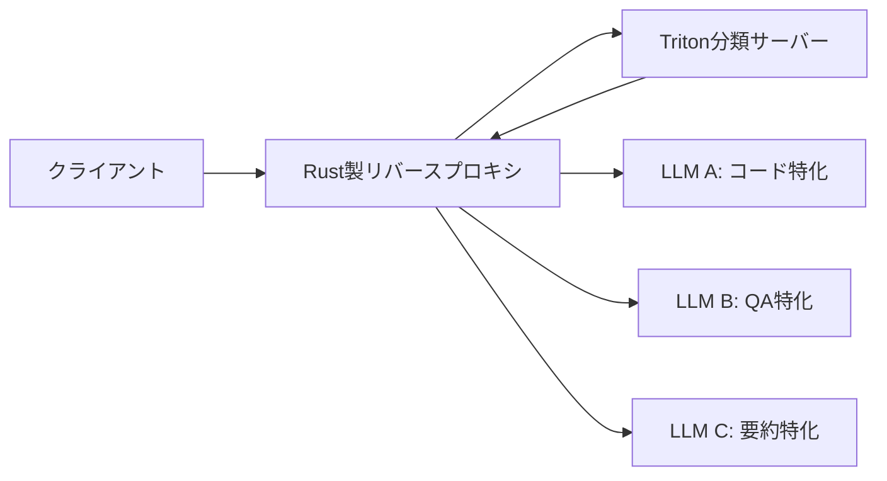

本記事は [Deploying the NVIDIA AI Blueprint for Cost-Efficient LLM Routing](https://developer.nvidia.com/blog/deploying-the-nvidia-ai-blueprint-for-cost-efficient-llm-routing/) の解説記事です。

## ブログ概要（Summary）

NVIDIAは2025年3月、コスト効率の高いLLMルーティングを実現するためのAI Blueprintを公開した。このBlueprintは、Rust製のリバースプロキシとNVIDIA Triton Inference Serverを組み合わせた分類ルーティングアーキテクチャであり、受信したプロンプトをタスク種別や複雑度に基づいて適切なLLMに振り分ける。著者のArun Raman氏（Senior Solution Architect）とSean Lopp氏（Software Engineer）によると、OpenAI API互換インターフェースで動作し、NVIDIA NIMや外部LLMプロバイダーとの統合が可能である。

この記事は [Zenn記事: Portkey AIゲートウェイ実装Deep Dive：条件付きルーティングとコスト最適化戦略](https://zenn.dev/0h_n0/articles/6c55b2409143b2) の深掘りです。

## 情報源

- **種別**: 企業テックブログ
- **URL**: [https://developer.nvidia.com/blog/deploying-the-nvidia-ai-blueprint-for-cost-efficient-llm-routing/](https://developer.nvidia.com/blog/deploying-the-nvidia-ai-blueprint-for-cost-efficient-llm-routing/)
- **組織**: NVIDIA Developer Blog
- **発表日**: 2025年3月26日
- **著者**: Arun Raman（Senior Solution Architect）、Sean Lopp（Software Engineer）
- **コード**: [NVIDIA-AI-Blueprints/llm-router](https://github.com/NVIDIA-AI-Blueprints/llm-router)（GitHub公開）

## 技術的背景（Technical Background）

LLMを本番環境で運用する組織は、「すべてのリクエストに最高性能のモデルを使う」か「低コストモデルで妥協する」かの二択を迫られることが多い。ブログでは、この問題を「one-size-fits-all approach」と呼び、リクエストの特性に応じてモデルを動的に選択することで解決できると述べている。

例えば、テキスト要約のような単純なタスクは小規模な汎用モデルで処理でき、コード生成のような複雑なタスクは大規模モデルに割り当てることで、全体のコストを削減しつつ品質を維持できる。これはPortkey AIゲートウェイの条件付きルーティング（`metadata.task_type`ベース）と同じ設計思想であるが、NVIDIA Blueprintはルーティング判断自体をML分類器で自動化する点が異なる。

## 実装アーキテクチャ（Architecture）

### システム構成

NVIDIA AI Blueprint for LLM Routingは以下の4つのコンポーネントで構成される：



1. **リクエスト受信**: Rust製リバースプロキシがOpenAI API互換のリクエストを受信
2. **分類レイヤー**: NVIDIA Triton Inference Serverで動作する分類モデルがプロンプトを分析
3. **インテリジェントルーティング**: 分類結果に基づいて適切なLLMにリクエストを転送
4. **レスポンスプロキシ**: LLMの応答をクライアントに返却

### Rust製リバースプロキシの設計意図

ブログによると、リバースプロキシはRust言語で実装されており、「minimal latency compared to direct model queries」を実現している。Portkeyのゲートウェイがエッジ処理でms単位のレイテンシを達成しているのと同様に、ルーティング判断自体がボトルネックにならないことが重視されている。

### Triton Inference Serverの役割

NVIDIA Triton Inference Serverは分類モデルのサービングに使用される。Tritonは以下の特徴を持つ：

- 複数のMLフレームワーク（PyTorch、TensorFlow、ONNX等）をサポート
- 動的バッチングによるGPU使用効率の最大化
- モデルアンサンブルとパイプライン処理
- Prometheus/Grafana互換のメトリクス出力

分類モデル自体は比較的軽量（V100 GPU、4GB GPU Memory で動作可能）であり、LLM推論と比較して無視できるレイテンシで処理される。

## ルーティング戦略（Routing Strategies）

ブログでは2つの分類アプローチが紹介されている。

### タスクベース分類（Task-Based Classification）

プロンプトのタスク種別を分類し、各カテゴリに特化したモデルにルーティングする：

| タスクカテゴリ | ルーティング先 | モデル例 |
|--------------|--------------|---------|
| コード生成 | コード特化モデル | Llama Nemotron Super 49B |
| オープンQA | 知識特化モデル | Llama 3 70B |
| リライト | 汎用モデル | Llama 3 8B |

この戦略は、Portkeyの条件付きルーティングにおける`metadata.task_type`ベースの振り分けと概念的に同等である。ただし、Portkeyではルーティング条件を手動で定義するのに対し、NVIDIA Blueprintでは分類モデルが自動的にタスク種別を判定する。

### 複雑度ベース分類（Complexity-Based Classification）

プロンプトの推論の複雑さに基づいてルーティングする：

- **複雑な論理問題** → 推論特化モデル
- **ドメイン固有の知識問題** → 知識集約モデル
- **創造的タスク** → 生成特化モデル

ブログの農夫と川渡りパズルのデモでは、マルチターン会話の各ターンが異なるモデルの専門性にルーティングされる例が示されている：

1. ターン1: 推論モデル（論理的な問題解決）
2. ターン2: ドメイン知識モデル（グラフ理論の応用）
3. ターン3: 制約分析モデル（検証）
4. ターン4: 創造性モデル（ストーリーテリング）
5. ターン5: 要約モデル（知見の凝縮）

各ターンで会話の一貫性を保ちつつ、タスク特性に応じた最適なモデルを選択することで、品質とコストの両立を実現している。

## Portkeyとの比較分析

NVIDIA BlueprintとPortkey AIゲートウェイは、LLMルーティングに対して異なるアプローチを取っている：

| 比較項目 | NVIDIA Blueprint | Portkey AIゲートウェイ |
|---------|-----------------|---------------------|
| **ルーティング判断** | ML分類器（自動） | ルールベース（`$eq`, `$gt`等のクエリ演算子） |
| **インフラ要件** | GPU必須（V100以上） | クラウドサービス（GPU不要） |
| **レイテンシ** | ms単位（Rust + Triton） | ms単位（エッジ処理） |
| **カスタマイズ** | 分類モデルのファインチューニング | JSON設定変更のみ |
| **対応LLM** | NVIDIA NIM + 外部API | 1,600+モデル |
| **フォールバック** | なし（分類器依存） | あり（`on_status_codes`指定） |
| **ロードバランシング** | なし | あり（重み付き分散） |
| **オブザーバビリティ** | Grafanaダッシュボード | Portkeyダッシュボード |
| **オープンソース** | はい（GitHub公開） | ゲートウェイ部分はOSS |

NVIDIA Blueprintは自前のGPUインフラを持つ組織向けであり、分類モデルをカスタマイズすることでドメイン固有のルーティング精度を高められる。一方、Portkeyはマネージドサービスとして即座に利用でき、フォールバック・ロードバランシング・キャッシュといった本番運用機能が統合されている。

## Production Deployment Guide

### AWS実装パターン（コスト最適化重視）

NVIDIA BlueprintのRust製プロキシ + Triton分類器をAWS上にデプロイする場合の構成例。

**トラフィック量別の推奨構成**:

| 規模 | 月間リクエスト | 推奨構成 | 月額コスト | 主要サービス |
|------|--------------|---------|-----------|------------|
| **Small** | ~3,000 (100/日) | Serverless + GPU | $200-400 | Lambda + SageMaker Endpoint (ml.g5.xlarge) |
| **Medium** | ~30,000 (1,000/日) | Hybrid | $800-1,500 | ECS Fargate + SageMaker Endpoint |
| **Large** | 300,000+ (10,000/日) | Container | $3,000-8,000 | EKS + Karpenter + g5.xlarge Spot |

**Small構成の詳細** (月額$200-400):
- **SageMaker Endpoint**: ml.g5.xlarge（分類モデル用）、自動スケーリング ($150/月)
- **Lambda**: リバースプロキシロジック ($20/月)
- **Bedrock**: LLM推論 ($80/月)
- **CloudWatch**: 監視 ($5/月)

**コスト削減テクニック**:
- SageMaker Endpoint: Scale to Zero設定でアイドル時コスト削減
- g5.xlarge Spot Instances: 最大70%削減
- 分類モデルのONNX変換: 推論速度2-3倍向上、GPU要件低減
- Bedrock Batch APIで50%削減（非リアルタイム処理）

**コスト試算の注意事項**:
- 上記は2026年3月時点のAWS ap-northeast-1（東京）リージョン料金に基づく概算値です
- GPU Instanceの料金はインスタンスタイプとリージョンにより大きく変動します
- 最新料金は [AWS料金計算ツール](https://calculator.aws/) で確認してください

### Terraformインフラコード

**Small構成: SageMaker Endpoint + Lambda**

```hcl
module "vpc" {
  source  = "terraform-aws-modules/vpc/aws"
  version = "~> 5.0"

  name = "nvidia-router-vpc"
  cidr = "10.0.0.0/16"
  azs  = ["ap-northeast-1a", "ap-northeast-1c"]
  private_subnets = ["10.0.1.0/24", "10.0.2.0/24"]
  public_subnets  = ["10.0.101.0/24", "10.0.102.0/24"]

  enable_nat_gateway   = true
  single_nat_gateway   = true  # コスト削減: NAT Gateway 1台のみ
  enable_dns_hostnames = true
}

resource "aws_iam_role" "sagemaker_role" {
  name = "nvidia-router-sagemaker-role"

  assume_role_policy = jsonencode({
    Version = "2012-10-17"
    Statement = [{
      Action = "sts:AssumeRole"
      Effect = "Allow"
      Principal = { Service = "sagemaker.amazonaws.com" }
    }]
  })
}

resource "aws_sagemaker_endpoint_configuration" "classifier" {
  name = "nvidia-router-classifier"

  production_variants {
    variant_name           = "primary"
    model_name             = aws_sagemaker_model.classifier.name
    initial_instance_count = 1
    instance_type          = "ml.g5.xlarge"  # V100相当のGPU
  }
}

resource "aws_lambda_function" "router_proxy" {
  filename      = "router_proxy.zip"
  function_name = "nvidia-router-proxy"
  role          = aws_iam_role.lambda_role.arn
  handler       = "index.handler"
  runtime       = "python3.12"
  timeout       = 60
  memory_size   = 512

  environment {
    variables = {
      CLASSIFIER_ENDPOINT = aws_sagemaker_endpoint.classifier.name
      BEDROCK_REGION      = "ap-northeast-1"
    }
  }
}

resource "aws_cloudwatch_metric_alarm" "classifier_latency" {
  alarm_name          = "classifier-latency-high"
  comparison_operator = "GreaterThanThreshold"
  evaluation_periods  = 2
  metric_name         = "ModelLatency"
  namespace           = "AWS/SageMaker"
  period              = 300
  statistic           = "p99"
  threshold           = 100  # 100ms超過でアラート
  alarm_description   = "分類器のレイテンシが異常に高い"
}
```

### セキュリティベストプラクティス

- **IAMロール**: SageMaker/Lambda各サービスに最小権限のロールを割り当て
- **VPC**: SageMaker Endpointをプライベートサブネットに配置
- **暗号化**: EBS/S3全てKMS暗号化、転送中はTLS 1.2以上
- **ネットワーク**: セキュリティグループで443ポートのみ許可

### 運用・監視設定

**Grafanaダッシュボード連携**（NVIDIA Blueprint標準）:
```sql
-- CloudWatch Logs Insights: ルーティング分布分析
fields @timestamp, task_category, model_routed, latency_ms
| stats count(*) as requests by task_category, model_routed
| sort requests desc
```

### コスト最適化チェックリスト

- [ ] 分類モデルのONNX変換で推論速度向上
- [ ] SageMaker Endpoint Auto Scaling設定（最小0台）
- [ ] GPU Spot Instances活用（最大70%削減）
- [ ] Bedrock Batch API使用（50%削減）
- [ ] CloudWatch Logs InsightsでルーティングKPI可視化
- [ ] AWS Budgets月額予算設定

## パフォーマンス最適化（Performance）

ブログによると、NVIDIA Blueprintは以下のパフォーマンス特性を持つ：

- **ルーティングレイテンシ**: Rust製プロキシにより「minimal latency」（具体的な数値は非公開だが、ms単位と推定される）
- **分類モデル要件**: V100 GPU（最低）、4GB GPU Memory
- **デプロイ方式**: Docker Compose（開発環境）、Kubernetes（本番環境）

ブログではGrafanaダッシュボードによるリアルタイムのパフォーマンスモニタリングが推奨されており、ルーティング判断の分布、各モデルの応答レイテンシ、エラー率を可視化できる。

## 運用での学び（Production Lessons）

### マルチターン会話での課題

ブログのデモでは、マルチターン会話の各ターンが異なるモデルにルーティングされる。これは品質最適化の観点では有効だが、実運用では以下の課題が生じる可能性がある：

1. **コンテキスト一貫性**: 異なるモデル間で会話コンテキストが正しく引き継がれるか
2. **レスポンスフォーマット**: モデル間でレスポンスの形式やトーンが変化する可能性
3. **レイテンシ変動**: ターンごとに異なるモデルの応答時間が変動

Portkeyの場合、フォールバックチェーンでプロバイダー間の切り替えが発生する際にも同様の課題がある。ブログでは「maintaining conversational coherence while optimizing each interaction independently」が実現されていると報告しているが、具体的な評価指標は示されていない。

### カスタム分類モデルのファインチューニング

ブログでは、Jupyter Notebookを使ったカスタム分類モデルのファインチューニングテンプレートが提供されている。これにより、組織固有のタスク分類やドメイン固有のルーティングロジックを学習できる。

## 学術研究との関連（Academic Connection）

NVIDIA BlueprintのタスクベースおよびComplexityベースの分類ルーティングは、以下の学術研究と関連がある：

- **RouteLLM** (Ong et al., 2024): 選好データからルーティングを学習するアプローチ。NVIDIA Blueprintは分類器ベースという点で類似するが、RouteLLMは人間の選好データを活用する点が異なる
- **Hybrid LLM** (Ding et al., 2024): クエリ複雑度に基づくルーティング。NVIDIA Blueprintの複雑度ベース分類と概念的に同一だが、Hybrid LLMは品質保証付きのオフライン校正プロセスを提供する
- **FrugalGPT** (Chen et al., 2023): カスケード型のコスト削減手法。NVIDIA Blueprintは並列選択型であり、カスケードではない

## まとめと実践への示唆

NVIDIA AI Blueprint for LLM Routingは、GPU環境を持つ組織がセルフホスト型のLLMルーティングを構築するための実践的なリファレンス実装である。Rust製プロキシの低レイテンシ、Tritonベースの分類モデルサービング、Docker Composeによる容易なデプロイという3つの特徴により、プロトタイプから本番環境への移行を円滑に進められる。

Portkeyのようなマネージドゲートウェイサービスと比較すると、カスタム分類モデルによるドメイン特化のルーティング精度が利点である一方、フォールバック・ロードバランシング・キャッシュといった本番運用機能は自前で構築する必要がある。組織のインフラ環境（GPU有無）やカスタマイズ要件に応じて使い分けることが推奨される。

## 参考文献

- **Blog URL**: [https://developer.nvidia.com/blog/deploying-the-nvidia-ai-blueprint-for-cost-efficient-llm-routing/](https://developer.nvidia.com/blog/deploying-the-nvidia-ai-blueprint-for-cost-efficient-llm-routing/)
- **Code**: [https://github.com/NVIDIA-AI-Blueprints/llm-router](https://github.com/NVIDIA-AI-Blueprints/llm-router)
- **Related Zenn article**: [https://zenn.dev/0h_n0/articles/6c55b2409143b2](https://zenn.dev/0h_n0/articles/6c55b2409143b2)
- **NVIDIA Triton Inference Server**: [https://developer.nvidia.com/triton-inference-server](https://developer.nvidia.com/triton-inference-server)
