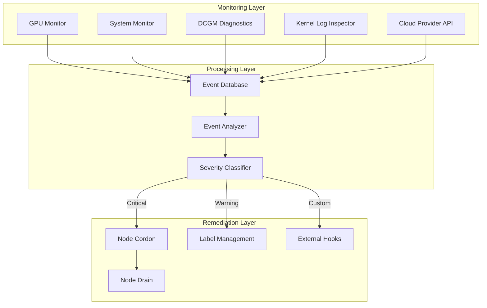

本記事は [NVIDIAテクニカルブログ: Automate Kubernetes AI Cluster Health with NVSentinel](https://developer.nvidia.com/blog/automate-kubernetes-ai-cluster-health-with-nvsentinel) の解説記事です。

## ブログ概要（Summary）

NVSentinelは、NVIDIAが2025年12月に公開したオープンソースのKubernetes監視・自己修復システムです。GPUクラスタにおけるハードウェア障害（サイレントデータ破損、メモリエラー、温度異常等）を自動検知し、問題のあるノードの隔離・ドレイン・修復を自動化します。NVIDIAのDGX Cloudクラスタでの運用実績があり、「障害検知を数時間から数分に短縮した」と報告されています。

この記事は [Zenn記事: Self-Evolving Applicationの設計パターンと自己修復インフラの実装戦略](https://zenn.dev/0h_n0/articles/949913945f34be) の深掘りです。

## 情報源

- **種別**: 企業テックブログ
- **URL**: [https://developer.nvidia.com/blog/automate-kubernetes-ai-cluster-health-with-nvsentinel](https://developer.nvidia.com/blog/automate-kubernetes-ai-cluster-health-with-nvsentinel)
- **組織**: NVIDIA（DGX Cloud チーム）
- **著者**: Lalit Adithya（Senior System Software Engineer）、Mark Chmarny（Principal Cloud Architect）、Davanum Srinivas（Principal Engineer）、Nathan Taber（Product Manager）
- **発表日**: 2025年12月8日

## 技術的背景（Technical Background）

大規模GPUクラスタ（NVIDIA DGX Cloud等）の運用では、以下の課題が深刻です。

- **サイレントデータ破損（Silent Data Corruption, SDC）**: GPUが外見上は正常に動作しているが、計算結果が不正確になる問題。機械学習の学習結果を静かに劣化させ、発見が極めて困難
- **カスケード障害**: 1台のGPU障害が分散学習ジョブ全体を失敗させ、他のGPU時間も無駄にする
- **手動対応の限界**: 数千台規模のGPUクラスタでは、障害検知から隔離までの人的対応が追いつかない
- **アイドルリソースの無駄**: 障害ノードの隣接ノードが健全でも、ジョブ再スケジューリングまでアイドル状態

従来のKubernetes自己修復機構（LivenessProbe、ReadinessProbe）はアプリケーションレベルの健全性チェックであり、GPU固有のハードウェア障害を検知できません。NVSentinelはこのギャップを埋めるために設計されています。

## 実装アーキテクチャ（Architecture）

### 3層アーキテクチャ

NVSentinelは以下の3層で構成されています。



**Monitoring Layer（監視層）**

モジュラー設計のGPU・システムモニターが、以下のデータソースからテレメトリを収集します。

- **NVIDIA DCGM（Data Center GPU Manager）**: GPU温度、メモリエラー（ECC）、電力使用量、NVLink状態
- **カーネルログ**: Xid エラー（NVIDIAドライバのエラーコード）、MCE（Machine Check Exception）
- **クラウドプロバイダAPI**: AWS、GCP、OCIのインスタンスヘルスイベント

各モニターはプラグイン形式で実装されており、カスタムモニターの追加が可能です。

**Processing Layer（処理層）**

収集されたイベントをデータベースに格納し、ルールベースのパターンマッチングで深刻度を分類します。ブログによると、これは「運用ランブックに類似したルールベースのパターン」で実装されています。

分類結果:
- **Critical**: 即座にノード隔離が必要（ECC Uncorrectable Error、Xid 79等）
- **Warning**: 監視強化が必要（ECC Correctable Error増加トレンド等）
- **Info**: ログ記録のみ（温度の一時的上昇等）

**Remediation Layer（修復層）**

分類結果に基づいて自動修復アクションを実行します。

```python
# NVSentinelの修復アクション（概念的な実装）
class RemediationActions:
    """NVSentinelの修復アクションセット"""

    async def cordon_node(self, node_name: str) -> None:
        """ノードをcordon（新規Pod配置を禁止）"""
        # kubectl cordon <node_name> 相当
        pass

    async def drain_node(self, node_name: str) -> None:
        """ノードをdrain（既存Podを退避）"""
        # kubectl drain <node_name> --ignore-daemonsets 相当
        pass

    async def set_node_condition(
        self, node_name: str, condition: str
    ) -> None:
        """NodeConditionを設定してスケジューラに通知"""
        # GPUHealthy=False等を設定
        pass

    async def trigger_external_hook(
        self, node_name: str, hook_url: str
    ) -> None:
        """外部修復ワークフローをトリガー"""
        # Webhook呼び出し（例: 物理ノードの再プロビジョニング）
        pass
```

### 対応GPUと動作モード

**対応GPU**: DCGM互換の全データセンターGPU

| GPU | サポート状況 |
|-----|-------------|
| H100 / H200 | ✅ フルサポート |
| B200 | ✅ フルサポート |
| A100 | ✅ フルサポート |
| V100 | ✅ サポート |
| A30 / A40 | ✅ サポート |

**動作モード（Disaggregated Mode）**:

NVSentinelはプラグイン設計により、段階的な導入が可能です。

1. **Monitor Only**: 監視のみ（修復アクションなし）— 導入初期の検証に推奨
2. **Cordon/Drain**: 自動cordon・drainを有効化 — 中間段階
3. **Full Remediation**: 外部フック含む完全な自動修復 — 成熟段階

この段階的アプローチは、Zenn記事で紹介されている「まず読み取り専用モードで始め、段階的に自動修復の範囲を広げる」パターンと一致しています。

### デプロイ

Helmチャートによるワンコマンドデプロイが可能です。

```bash
helm install nvsentinel oci://ghcr.io/nvidia/nvsentinel --version v0.3.0
```

NVIDIA GPU Operatorとの連携が前提で、DCGMがクラスタにデプロイされている必要があります。

## パフォーマンス最適化（Performance）

### 実測値

NVIDIAのDGX Cloudクラスタでの運用実績として、以下が報告されています。

- **障害検知時間**: 数時間 → 数分に短縮
- **GPU稼働率**: 障害ノードの迅速な隔離により改善（具体的数値は未公開）
- **ジョブ再スケジューリング**: NodeCondition設定によりスケジューラが自動的に健全ノードを選択

ただし、具体的なベンチマーク数値や定量的な改善率は公開されていません。

## 運用での学び（Production Lessons）

### DGX Cloudでの教訓

NVIDIAの運用チームが共有している教訓として以下があります。

1. **サイレント障害の早期検知が重要**: SDCは学習結果を静かに劣化させるため、定期的なDCGM診断の実行が不可欠
2. **カスケード障害の防止**: 分散学習では1台の障害が全ジョブを失敗させるため、迅速な隔離が全体効率に直結
3. **段階的導入**: Monitor Onlyから始めて誤検知率を検証し、その後にcordon/drainを有効化するアプローチが安全

### k8sgptとの比較

k8sgpt（CNCF Sandbox）との主な違いは以下の通りです。

| 項目 | NVSentinel | k8sgpt |
|------|-----------|--------|
| 対象 | GPU固有のハードウェア障害 | 汎用Kubernetesリソース |
| 分析手法 | ルールベース（DCGMパターン） | LLMベース |
| 自動修復 | cordon/drain/外部フック | ロードマップ段階（Q2 2025目標） |
| データソース | DCGM、カーネルログ、クラウドAPI | Kubernetes API |

## 学術研究との関連（Academic Connection）

NVSentinelは、自己修復インフラの研究で提唱されている「テレメトリ→推論→アクション」パイプラインの実装例です。

- **テレメトリ層**: DCGM + カーネルログ（OpenTelemetry互換のデータ収集）
- **推論層**: ルールベースのパターンマッチング（LLMベースのk8sgptとは異なるアプローチ）
- **アクション層**: Kubernetes APIを通じたcordon/drain/ラベリング

Zenn記事のSelf-Healing Infrastructure設計と比較すると、NVSentinelは推論層でLLMではなくルールベースを採用しています。これはGPU障害パターンが比較的限定的で、ルールベースで十分な精度が得られるためです。一方、汎用的なアプリケーション障害ではk8sgptのようなLLMベースのアプローチが有効です。

## Production Deployment Guide

### AWS実装パターン（GPU クラスタ向け）

NVSentinelをAWS EKSのGPUクラスタにデプロイする場合の構成です。

| 規模 | GPUノード数 | 推奨構成 | 月額コスト（NVSentinel分のみ） |
|------|-----------|---------|---------------------------|
| **Small** | 1-10台 | DaemonSet | $50-100 |
| **Medium** | 10-100台 | DaemonSet + 監視強化 | $200-500 |
| **Large** | 100台+ | DaemonSet + 外部フック + PagerDuty連携 | $500-1,500 |

**注意**: GPU インスタンス自体のコスト（g5.xlarge: ~$1,000/月/台）は別途必要です。

**Small構成の詳細**（NVSentinel分のみ$50-100/月）:
- **EKS**: NVSentinel DaemonSet（追加コストなし、既存クラスタに追加）
- **NVIDIA GPU Operator**: DCGM有効化（追加コストなし）
- **CloudWatch**: GPUメトリクス監視（$30/月）
- **SNS**: アラート通知（$5/月）

### Terraformインフラコード

```hcl
module "eks" {
  source  = "terraform-aws-modules/eks/aws"
  version = "~> 20.0"

  cluster_name    = "gpu-cluster"
  cluster_version = "1.31"
  vpc_id          = module.vpc.vpc_id
  subnet_ids      = module.vpc.private_subnets

  cluster_endpoint_public_access = true
  enable_cluster_creator_admin_permissions = true
}

resource "helm_release" "gpu_operator" {
  name       = "gpu-operator"
  repository = "https://helm.ngc.nvidia.com/nvidia"
  chart      = "gpu-operator"
  namespace  = "gpu-operator"
  create_namespace = true

  set {
    name  = "dcgm.enabled"
    value = "true"
  }
  set {
    name  = "dcgmExporter.enabled"
    value = "true"
  }
}

resource "helm_release" "nvsentinel" {
  name       = "nvsentinel"
  chart      = "oci://ghcr.io/nvidia/nvsentinel"
  version    = "v0.3.0"
  namespace  = "nvsentinel"
  create_namespace = true

  depends_on = [helm_release.gpu_operator]
}

resource "aws_cloudwatch_metric_alarm" "gpu_health" {
  alarm_name          = "gpu-health-critical"
  comparison_operator = "GreaterThanThreshold"
  evaluation_periods  = 1
  metric_name         = "gpu_ecc_uncorrectable_errors"
  namespace           = "DCGM"
  period              = 300
  statistic           = "Sum"
  threshold           = 0
  alarm_description   = "GPU ECC Uncorrectable Error検知"
  alarm_actions       = [aws_sns_topic.gpu_alerts.arn]
}

resource "aws_sns_topic" "gpu_alerts" {
  name = "gpu-health-alerts"
}
```

### 運用・監視設定

```sql
-- CloudWatch Logs Insights: GPU障害イベント分析
fields @timestamp, node_name, gpu_index, error_type, severity
| filter severity = "critical"
| stats count(*) as error_count by node_name, error_type, bin(1h)
| sort error_count desc
```

### コスト最適化チェックリスト

- [ ] Monitor Onlyモードで誤検知率を検証してから自動修復を有効化
- [ ] CloudWatch カスタムメトリクスのフィルタリングで不要なデータ送信を削減
- [ ] SNS通知のフィルタリングでCriticalのみ通知
- [ ] GPU Operatorとの共存設定を確認（リソース競合回避）
- [ ] 障害ノードの自動再プロビジョニングフックを設定
- [ ] AWS Budgets: GPUインスタンス＋監視の月額予算設定

## まとめと実践への示唆

NVSentinelは、GPU固有のハードウェア障害に特化した自己修復システムとして、大規模GPUクラスタ運用の実用的な課題を解決しています。ルールベースのアプローチは汎用性では劣るものの、GPU障害パターンの限定性を考えると合理的な設計判断です。

Zenn記事のSelf-Healing Infrastructureと組み合わせる場合、NVSentinelをハードウェア層の自己修復として配置し、k8sgptやLLMベースの推論をアプリケーション層の自己修復として組み合わせる構成が実用的です。

## 参考文献

- **Blog URL**: [https://developer.nvidia.com/blog/automate-kubernetes-ai-cluster-health-with-nvsentinel](https://developer.nvidia.com/blog/automate-kubernetes-ai-cluster-health-with-nvsentinel)
- **GitHub**: [https://github.com/NVIDIA/NVSentinel](https://github.com/NVIDIA/NVSentinel)
- **NVIDIA GPU Operator**: [https://docs.nvidia.com/datacenter/cloud-native/gpu-operator/](https://docs.nvidia.com/datacenter/cloud-native/gpu-operator/)
- **Related Zenn article**: [https://zenn.dev/0h_n0/articles/949913945f34be](https://zenn.dev/0h_n0/articles/949913945f34be)
