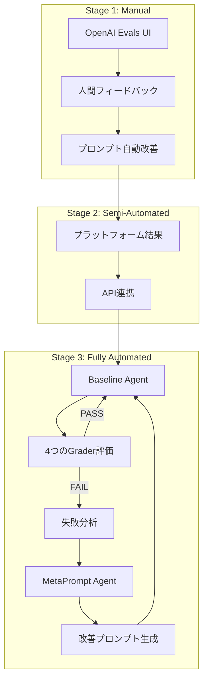

本記事は [OpenAI Cookbook: Self-Evolving Agents](https://developers.openai.com/cookbook/examples/partners/self_evolving_agents/autonomous_agent_retraining) の解説記事です。

## ブログ概要（Summary）

OpenAI公式Cookbookの「Self-Evolving Agents」は、LLMエージェントが自身のプロンプトを自律的に改善し続けるフレームワークを提示しています。モデルの再学習（ファインチューニング）ではなく、**プロンプトの反復的最適化**によって自己進化を実現するアプローチです。人間レビュー、LLM-as-Judge評価、メタプロンプトエージェントによる改善提案を組み合わせた3段階のパイプラインで、製薬規制文書の要約タスクを実例に実装方法を解説しています。

この記事は [Zenn記事: Self-Evolving Applicationの設計パターンと自己修復インフラの実装戦略](https://zenn.dev/0h_n0/articles/949913945f34be) の深掘りです。

## 情報源

- **種別**: 企業テックブログ / 公式Cookbook
- **URL**: [https://developers.openai.com/cookbook/examples/partners/self_evolving_agents/autonomous_agent_retraining](https://developers.openai.com/cookbook/examples/partners/self_evolving_agents/autonomous_agent_retraining)
- **組織**: OpenAI
- **著者**: Shikhar Kwatra, Calvin Maguranis, Valentina Frenkel, Fanny Perraudeau, Giorgio Saladino
- **ソースコード**: [github.com/openai/openai-cookbook](https://github.com/openai/openai-cookbook)

## 技術的背景（Technical Background）

LLMエージェントの品質改善には、従来2つのアプローチがありました。

1. **ファインチューニング**: モデルの重みを更新。高コスト・高品質だがデータ準備が大変
2. **プロンプトエンジニアリング**: 手動でプロンプトを調整。低コストだが属人的で再現性が低い

Self-Evolving Agentsは、この2つの中間に位置する**自律的プロンプト最適化**を提案しています。エージェントの出力品質を複数のグレーダー（評価器）で自動評価し、失敗したグレーダーのフィードバックを基にメタプロンプトエージェントが改善版プロンプトを生成する、という閉ループを形成します。

このアプローチの利点は以下の通りです。

- モデルの再学習が不要（APIコストのみ）
- プロンプトのバージョン管理が可能（ロールバック対応）
- 人間のドメイン知識を段階的に組み込める

## 実装アーキテクチャ（Architecture）

### 自己進化ループの全体像



### 3段階の最適化パイプライン

**Stage 1（手動）**: OpenAI Evals UIでの探索的最適化

1. データセットのアップロード
2. 初期プロンプトの設定
3. 出力の生成と人間フィードバック（評価・改善提案）
4. プラットフォームによる改善プロンプトの自動生成

**Stage 2（半自動）**: プラットフォーム結果をAPIで取得し、プログラマティックな改善へ橋渡し

**Stage 3（完全自動）**: API駆動の自律改善ループ

### バージョン管理システム

プロンプトの進化を追跡するバージョン管理が実装されています。

```python
from dataclasses import dataclass, field
from datetime import datetime
from typing import Optional


@dataclass
class PromptVersionEntry:
    """プロンプトバージョンの1エントリ"""
    version: int
    model: str
    prompt: str
    timestamp: datetime
    eval_id: Optional[str] = None
    metadata: Optional[dict] = field(default_factory=dict)


class VersionedPrompt:
    """プロンプトのバージョン管理ユーティリティ"""

    def __init__(self, initial_prompt: str, model: str = "gpt-5"):
        self._history: list[PromptVersionEntry] = []
        self._current_version = 0
        self.update(initial_prompt, model)

    def update(
        self,
        new_prompt: str,
        model: str = "gpt-5",
        eval_id: Optional[str] = None,
        metadata: Optional[dict] = None,
    ) -> PromptVersionEntry:
        """プロンプトを更新し、バージョン履歴に追加"""
        self._current_version += 1
        entry = PromptVersionEntry(
            version=self._current_version,
            model=model,
            prompt=new_prompt,
            timestamp=datetime.now(),
            eval_id=eval_id,
            metadata=metadata or {},
        )
        self._history.append(entry)
        return entry

    def current(self) -> PromptVersionEntry:
        """現在のプロンプトバージョンを取得"""
        return self._history[-1]

    def revert_to_version(self, version: int) -> PromptVersionEntry:
        """指定バージョンにロールバック"""
        for entry in self._history:
            if entry.version == version:
                return self.update(
                    entry.prompt,
                    entry.model,
                    metadata={"reverted_from": self._current_version},
                )
        raise ValueError(f"Version {version} not found")
```

### 4つのグレーダーによる多面的評価

Cookbookでは、製薬規制文書（FDA提出資料）の要約タスクを実例として、4つの独立したグレーダーで出力品質を評価しています。

| グレーダー | 種類 | 閾値 | 評価内容 |
|-----------|------|------|---------|
| Chemical Name Grader | Python（決定論的） | 0.8 | 原文の化学物質名が要約に保持されているか |
| Word Length Deviation | Python（決定論的） | 0.85 | 目標100語からの偏差（80-120語バンドで最適） |
| Cosine Similarity | テキスト類似度 | 0.85 | 原文との意味的類似度（内容の忠実性） |
| LLM-as-Judge | スコアモデル（GPT-4.1） | 0.85 | ニュアンス・品質の総合評価 |

```python
def chemical_name_score(source: str, summary: str) -> float:
    """原文の化学物質名が要約に保持されているかチェック

    Args:
        source: 原文テキスト
        summary: 要約テキスト

    Returns:
        0.0-1.0のスコア（1.0 = 全化学物質名が保持）
    """
    # 正規表現で化学物質名パターンを抽出
    import re
    chem_pattern = r'\b[A-Z][a-z]*(?:ine|ide|ate|ase|ol|an)\b'
    source_chems = set(re.findall(chem_pattern, source))
    summary_chems = set(re.findall(chem_pattern, summary))

    if not source_chems:
        return 1.0

    preserved = len(source_chems & summary_chems)
    return preserved / len(source_chems)


def word_length_score(summary: str, target: int = 100) -> float:
    """目標語数からの偏差に基づくスコア

    Args:
        summary: 要約テキスト
        target: 目標語数（デフォルト100）

    Returns:
        0.0-1.0のスコア（1.0 = 目標語数ちょうど）
    """
    word_count = len(summary.split())
    deviation = abs(word_count - target) / target
    return max(0.0, 1.0 - deviation)
```

### メタプロンプトエージェントによる自動改善

改善ループの核心は、**失敗したグレーダーのフィードバックのみ**をメタプロンプトエージェントに渡す設計です。

```python
from agents import Agent, Runner


async def optimize_prompt(
    current_prompt: str,
    failed_graders: list[dict],
    versioned_prompt: VersionedPrompt,
    max_retries: int = 3,
) -> VersionedPrompt:
    """失敗グレーダーのフィードバックに基づいてプロンプトを改善

    Args:
        current_prompt: 現在のプロンプト
        failed_graders: 失敗したグレーダーの情報リスト
        versioned_prompt: バージョン管理オブジェクト
        max_retries: 最大リトライ回数

    Returns:
        更新されたVersionedPrompt
    """
    metaprompt_agent = Agent(
        name="MetapromptAgent",
        instructions=(
            "You are a prompt optimizer. "
            "Analyze the grader feedback and generate an improved prompt."
        ),
    )

    # 失敗グレーダーのフィードバックのみを渡す（成功は含めない）
    feedback_text = "\n".join(
        f"- {g['name']}: FAIL (score={g['score']:.2f}, "
        f"reason={g['reason']})"
        for g in failed_graders
    )

    for attempt in range(max_retries):
        response = await Runner.run(
            metaprompt_agent,
            f"Current prompt:\n{current_prompt}\n\n"
            f"Failed graders:\n{feedback_text}\n\n"
            f"Generate an improved prompt.",
        )

        improved_prompt = response.final_output
        versioned_prompt.update(
            improved_prompt,
            metadata={
                "attempt": attempt + 1,
                "failed_graders": [g["name"] for g in failed_graders],
            },
        )

        # 改善版で再評価
        new_scores = await evaluate_prompt(improved_prompt)
        if meets_threshold(new_scores):
            return versioned_prompt

    return versioned_prompt  # max_retries到達
```

### 合格基準

Cookbookでは2つの合格基準が定義されています。

- **Lenient Pass Ratio**: 75%以上のグレーダーがPASS
- **Lenient Average Score**: 平均スコア85%以上

いずれかを満たせば、改善版プロンプトが本番に昇格（Promote）されます。

## パフォーマンス最適化（Performance）

### 最適化のベストプラクティス

Cookbookで推奨されているプラクティスは以下の通りです。

1. **決定論的グレーダーを先に実行**: 化学物質名チェック、語数チェックは高速で実行可能。これらがFAILならLLM-as-Judge（高コスト）を実行する前に改善ループに入れる
2. **失敗グレーダーのフィードバックのみ使用**: 成功グレーダーの情報を含めると、メタプロンプトエージェントが「成功を維持しつつ失敗を改善する」という困難な最適化を強いられる
3. **キャッシュ**: 同一セクション-要約ペアに対するグレーダー再実行を辞書キャッシュで回避
4. **デフォルトフィードバック**: 全グレーダーPASS時も「factual coverage, chemical completeness, conciseness を強化」というデフォルトフィードバックで改善を継続

### ループパラメータ

| パラメータ | 値 | 意味 |
|-----------|-----|------|
| max_optimization_retries | 3 | セクション単位の最大リトライ回数 |
| lenient_pass_ratio | 0.75 | 合格に必要なグレーダーPASS率 |
| lenient_average_threshold | 0.85 | 合格に必要な平均スコア |
| max_polling_attempts | 10 | Eval結果ポーリングの最大回数 |

## 運用での学び（Production Lessons）

### ヘルスケア領域での教訓

Cookbookの実例（FDA提出資料の要約）から得られる教訓は以下の通りです。

1. **ドメイン固有のグレーダーが重要**: 汎用的なLLM-as-Judgeだけでは、化学物質名の保持（ドメイン固有要件）を見逃す。決定論的な専門グレーダーとの組み合わせが不可欠
2. **人間の監督は必要**: Cookbookは「regulatory compliance and factual accuracy requires human oversight」と明記しており、完全自動化を推奨していない
3. **バージョン管理の重要性**: 最適化がリグレッション（改善のつもりが既存品質を劣化）を起こす場合があり、ロールバック機能が必須
4. **アラートメカニズム**: max_retries到達時にエンジニアに通知する仕組みを組み込むこと

## 学術研究との関連（Academic Connection）

### EvoAgentXとの比較

Zenn記事で紹介されているEvoAgentX（arXiv:2507.03616）のTextGrad（テキスト空間での勾配降下）とCookbookのメタプロンプト最適化は、同じ問題（プロンプトの自動改善）に対する異なるアプローチです。

| 項目 | EvoAgentX TextGrad | OpenAI Cookbook |
|------|-------------------|----------------|
| 最適化対象 | エージェントプロンプト + ワークフロー構造 | タスク固有プロンプト |
| 評価方法 | タスク固有メトリクス | 4つの独立グレーダー |
| 探索手法 | テキスト勾配降下 | メタプロンプトエージェント |
| コスト | 2,000-4,000 LLMコール | 数十〜数百コール |
| 適用範囲 | マルチエージェントワークフロー | 単一エージェント |

Cookbookのアプローチはコストが低く導入が容易ですが、ワークフロー構造の最適化はスコープ外です。EvoAgentXはより包括的ですが、コストが高いです。

### Self-Evolving Applicationとの関連

Zenn記事のEvolution Pipelineにおいて、Cookbookの自己進化ループは**各エージェントのプロンプト改善**に直接適用できます。

- **RequirementAgent**: ユーザーフィードバックの解釈精度をグレーダーで評価し、プロンプトを自動改善
- **CodeGenAgent**: 生成コードの品質（テスト通過率、型チェック）をグレーダーとして使用
- **TestAgent**: テストケースの網羅性をグレーダーで評価

## Production Deployment Guide

### AWS実装パターン（コスト最適化重視）

プロンプト自動最適化パイプラインをAWSにデプロイする場合の推奨構成です。

| 規模 | 最適化頻度 | 推奨構成 | 月額コスト |
|------|-----------|---------|-----------|
| **Small** | 週1回 | Lambda + Bedrock + S3 | $50-150 |
| **Medium** | 日次 | Step Functions + Bedrock + DynamoDB | $200-500 |
| **Large** | リアルタイム | ECS + Bedrock + ElastiCache | $500-1,500 |

**Small構成の詳細**（月額$50-150）:
- **Lambda**: プロンプト最適化ループ実行（$20/月）
- **Bedrock**: Claude 3.5 Haiku（グレーダー）+ Sonnet（メタプロンプト）（$80/月）
- **S3**: プロンプトバージョン履歴保存（$5/月）
- **CloudWatch**: 監視（$5/月）

**コスト試算の注意事項**: 上記は2026年3月時点のAWS ap-northeast-1リージョン料金に基づく概算値です。

### Terraformインフラコード

```hcl
resource "aws_lambda_function" "prompt_optimizer" {
  filename      = "lambda.zip"
  function_name = "prompt-optimizer"
  role          = aws_iam_role.optimizer.arn
  handler       = "index.handler"
  runtime       = "python3.12"
  timeout       = 300
  memory_size   = 512

  environment {
    variables = {
      BEDROCK_HAIKU_MODEL  = "anthropic.claude-3-5-haiku-20241022-v1:0"
      BEDROCK_SONNET_MODEL = "anthropic.claude-3-5-sonnet-20241022-v2:0"
      S3_BUCKET            = aws_s3_bucket.prompt_versions.id
      MAX_RETRIES          = "3"
      PASS_THRESHOLD       = "0.85"
    }
  }
}

resource "aws_s3_bucket" "prompt_versions" {
  bucket = "prompt-version-history"
}

resource "aws_s3_bucket_versioning" "prompt_versions" {
  bucket = aws_s3_bucket.prompt_versions.id
  versioning_configuration {
    status = "Enabled"
  }
}

resource "aws_s3_bucket_lifecycle_configuration" "prompt_versions" {
  bucket = aws_s3_bucket.prompt_versions.id
  rule {
    id     = "archive-old-versions"
    status = "Enabled"
    transition {
      days          = 90
      storage_class = "GLACIER"
    }
  }
}

resource "aws_cloudwatch_metric_alarm" "optimization_failure" {
  alarm_name          = "prompt-optimization-max-retries"
  comparison_operator = "GreaterThanThreshold"
  evaluation_periods  = 1
  metric_name         = "MaxRetriesReached"
  namespace           = "PromptOptimizer"
  period              = 3600
  statistic           = "Sum"
  threshold           = 0
  alarm_description   = "プロンプト最適化がmax_retries到達"
}
```

### 運用・監視設定

```sql
-- CloudWatch Logs Insights: 最適化ループの効果分析
fields @timestamp, prompt_version, avg_score, pass_ratio
| stats avg(avg_score) as mean_score,
        max(prompt_version) as latest_version
  by bin(1d)
| sort @timestamp desc
```

### コスト最適化チェックリスト

- [ ] 決定論的グレーダーを先に実行（LLM-as-Judgeの不要呼び出しを削減）
- [ ] グレーダー結果キャッシュ（同一入力の再評価を回避）
- [ ] Bedrock Batch API: バッチ最適化で50%削減
- [ ] Prompt Caching: メタプロンプトエージェントのシステムプロンプト
- [ ] S3 Glacier: 90日以上前のバージョン履歴をアーカイブ
- [ ] Lambda最適化: CloudWatch Insightsでメモリサイズ調整
- [ ] AWS Budgets: 月額予算設定

## まとめと実践への示唆

OpenAI Cookbookの Self-Evolving Agents は、モデル再学習なしにプロンプト最適化で自己進化を実現する実用的なフレームワークです。4つの独立グレーダーによる多面的評価と、失敗フィードバックのみを使うメタプロンプト最適化の組み合わせは、コスト効率と品質のバランスが取れた設計です。

Zenn記事のEvolution Layerにおける各エージェントのプロンプト改善に直接適用可能であり、EvoAgentXのワークフロー構造最適化と相補的に使用することで、多層的な自己進化を実現できます。

## 参考文献

- **Blog URL**: [https://developers.openai.com/cookbook/examples/partners/self_evolving_agents/autonomous_agent_retraining](https://developers.openai.com/cookbook/examples/partners/self_evolving_agents/autonomous_agent_retraining)
- **Source Code**: [https://github.com/openai/openai-cookbook](https://github.com/openai/openai-cookbook)
- **OpenAI Evals**: [https://platform.openai.com/evals](https://platform.openai.com/evals)
- **Related Zenn article**: [https://zenn.dev/0h_n0/articles/949913945f34be](https://zenn.dev/0h_n0/articles/949913945f34be)
