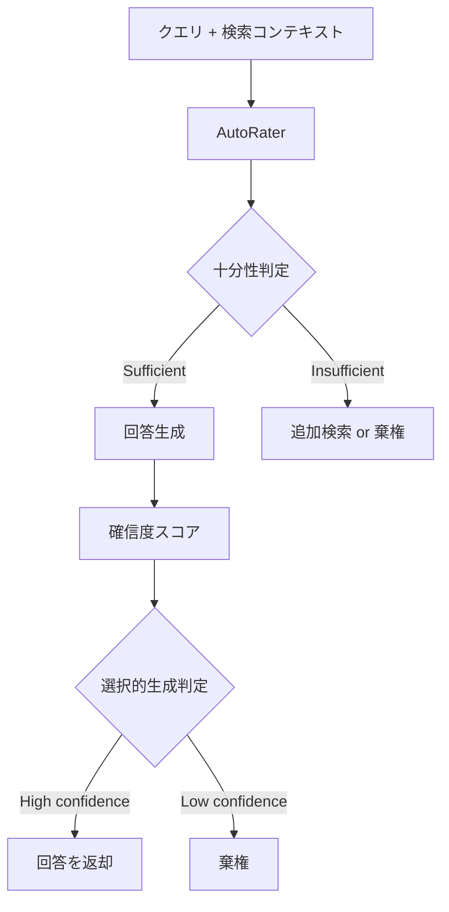

本記事は [Google Research Blog "Deeper insights into retrieval augmented generation: The role of sufficient context"](https://research.google/blog/deeper-insights-into-retrieval-augmented-generation-the-role-of-sufficient-context/) の解説記事です。関連論文は [arXiv:2411.06037 "Sufficient Context: A New Lens on Retrieval Augmented Generation Systems"](https://arxiv.org/abs/2411.06037) としてICLR 2025に採択されている。

## ブログ概要（Summary）

Google Researchの著者ら（Cyrus Rashtchian, Da-Cheng Juan, Hailey Joren, Jianyi Zhang, Chun-Sung Ferng, Ankur Taly）は、RAGシステムにおける「コンテキストの十分性」という新しい概念を提案している。従来の「関連性（relevance）」ではなく「十分性（sufficiency）」でコンテキストを評価することで、RAGの失敗モード（特にハルシネーション）をより正確に診断・予防できることが報告されている。Gemini 1.5 Proを用いたAutoRaterは93%以上の精度で十分性を判定でき、選択的生成フレームワークにより回答精度が最大10%向上することが示されている。

この記事は [Zenn記事: RAG vs ロングコンテキスト：1Mトークン時代の最適な使い分けと判断フレームワーク](https://zenn.dev/0h_n0/articles/0f09fc0a93ea15) の深掘りです。

## 情報源

- **種別**: 企業テックブログ + ICLR 2025採択論文
- **ブログURL**: [https://research.google/blog/deeper-insights-into-retrieval-augmented-generation-the-role-of-sufficient-context/](https://research.google/blog/deeper-insights-into-retrieval-augmented-generation-the-role-of-sufficient-context/)
- **論文**: arXiv:2411.06037（ICLR 2025）
- **組織**: Google Research
- **発表日**: 2025年5月14日

## 技術的背景（Technical Background）

RAGシステムの標準的な評価は、検索されたコンテキストの「関連性」に焦点を当ててきた。しかし、著者らは**関連性と十分性は異なる概念**であることを指摘している。コンテキストがクエリに関連していても、決定的な回答を導くために必要な情報が不足している場合がある。

### 「十分性」の定義

著者らは、コンテキストが「十分」であるとは、**決定的な回答を提供するために必要な全情報が含まれている**状態と定義している。逆に「不十分」なコンテキストは、必要な情報が不足している、不完全である、結論が出ない、または矛盾する情報を含む状態を指す。

**具体例**: HTTP 404エラーの起源について「CERNのRoom 404がどの研究棟にあったか」を問うクエリに対して、404エラー全般に関するコンテキストは「関連」はしているが「十分」ではない。CERNのRoom 404について明示的に言及するコンテキストのみが「十分」である。

## 実装アーキテクチャ（Architecture）

### Sufficient Context AutoRater

著者らはLLMベースの自動評価器（AutoRater）を開発している。



**AutoRater開発プロセス**:
1. 人間の専門家が115の質問・コンテキスト例を分析しゴールドスタンダードラベルを確立
2. LLMベースのAutoRaterが二値分類（sufficient/insufficient）を出力
3. Chain-of-Thoughtプロンプティングと1-shotサンプルで最適化
4. Gemini 1.5 Pro（ファインチューニングなし）が最高精度を達成

**AutoRater精度**: Gemini 1.5 Proは93%以上の精度で十分性を正確に分類すると報告されている。FLAMe（ファインチューニング済みPaLM 24B）、TRUE-NLI、「Contains GT」（正解含有チェック）との比較でGeminiが上回っている。

### 選択的生成フレームワーク

著者らは2つのシグナルを組み合わせた選択的生成（selective generation）フレームワークを提案している：

1. **自己評価確信度**: P(True)（サンプリングベース）またはP(Correct)（確率推定ベース）
2. **十分性シグナル**: AutoRaterの二値ラベル（正解不要）

$$
\text{Decision}(q, c) = \begin{cases}
\text{Answer} & \text{if } \text{Confidence}(q, c) \geq \theta \text{ AND } \text{Sufficient}(c) = \text{True} \\
\text{Abstain} & \text{otherwise}
\end{cases}
$$

ここで、
- $q$: クエリ
- $c$: 検索されたコンテキスト
- $\theta$: 棄権閾値

## 実験結果（Results）

### ハルシネーション分析

著者らの報告で最も重要な発見の一つは、**RAGがハルシネーションを増加させるパラドックス**である。

**Gemmaモデルでの結果**: 不正確な回答率がコンテキストなし時の10.2%から、不十分なコンテキスト提供時に**66.1%**に急増すると報告されている。

著者らの説明によると、このパラドックスのメカニズムは以下の通りである：
1. RAGがコンテキストを追加すると、モデルの確信度が全般的に上昇する
2. コンテキストが不十分でも確信度が上昇するため、本来棄権すべきケースで回答を生成する
3. 結果として、不十分なコンテキストが「過信のトリガー」として機能する

### モデル別の挙動

著者らの報告では、モデルの規模と種類によって挙動が大きく異なる：

- **大規模プロプライエタリモデル**（Gemini, GPT, Claude）: 十分なコンテキストでは高精度だが、不十分なコンテキストでの棄権能力が不足
- **オープンソースモデル**: 十分なコンテキストでもハルシネーション率と棄権率が高い

### データセットの十分性分布

3つのデータセットでの十分なコンテキストの割合が分析されている：

| データセット | 特徴 | 十分性割合 |
|------------|------|----------|
| FreshQA | 人間が選定した裏付け文書 | 最高 |
| HotPotQA | マルチホップQA | 中程度 |
| MuSiQue | マルチホップQA（複合） | 最低 |

人間が選定した裏付け文書を含むデータセットほど十分性が高い傾向がある。

### 選択的生成の改善効果

十分性シグナルを組み合わせることで、確信度のみの手法と比較して**最大10%の精度向上**が報告されている。特に、不十分なコンテキストでの誤回答を効果的に抑制できることが示されている。

## 実装のポイント（Implementation）

### 実用的な推奨事項

著者らは以下の3つの実践的ステップを推奨している：

1. **プリフライトチェック**: 生成前に十分性チェックを追加する
2. **検索の強化**: より多くのコンテキストを検索するか、検索結果をリランキングする
3. **確信度チューニング**: 確信度と十分性シグナルを組み合わせた棄権閾値を調整する

### Google Vertex AI RAG Engineとの連携

著者らの研究成果は、Google Cloud Vertex AI RAG EngineのLLM Re-Rankerとして実用化されている。ユーザーはクエリとの関連性に基づいて検索スニペットをリランキングし、nDCGなどの検索指標とRAG精度を向上させることができる。

### コンテキスト十分性判定の実装パターン

```python
from dataclasses import dataclass
from enum import Enum


class SufficiencyLabel(Enum):
    SUFFICIENT = "sufficient"
    INSUFFICIENT = "insufficient"


@dataclass
class SufficiencyResult:
    label: SufficiencyLabel
    confidence: float
    reasoning: str


def check_context_sufficiency(
    query: str,
    context: str,
    llm_client,
) -> SufficiencyResult:
    """コンテキストの十分性を判定する

    Args:
        query: ユーザークエリ
        context: 検索されたコンテキスト
        llm_client: LLM APIクライアント

    Returns:
        十分性判定結果
    """
    prompt = f"""Given the following context and question, determine if the context
contains ALL necessary information to provide a definitive answer.

Context: {context}

Question: {query}

Analyze step by step:
1. What information is needed to answer the question?
2. Is all required information present in the context?
3. Is there any ambiguity or contradiction?

Output JSON:
{{"label": "sufficient" or "insufficient", "confidence": 0.0-1.0, "reasoning": "..."}}
"""
    response = llm_client.generate(prompt)
    # パース処理（実装では適切なJSONパースを使用）
    return parse_sufficiency_response(response)
```

## Production Deployment Guide

### AWS実装パターン（コスト最適化重視）

十分性チェック付きRAGシステムのAWS構成を示す。

**トラフィック量別の推奨構成**:

| 規模 | 月間リクエスト | 推奨構成 | 月額コスト | 主要サービス |
|------|--------------|---------|-----------|------------|
| **Small** | ~3,000 (100/日) | Serverless | $50-150 | Lambda + Bedrock + DynamoDB |
| **Medium** | ~30,000 (1,000/日) | Hybrid | $300-800 | Lambda + ECS Fargate + ElastiCache |
| **Large** | 300,000+ (10,000/日) | Container | $2,000-5,000 | EKS + Karpenter + EC2 Spot |

**コスト試算の注意事項**: 上記は2026年3月時点のAWS ap-northeast-1（東京）リージョン料金に基づく概算値です。最新料金は [AWS料金計算ツール](https://calculator.aws/) で確認してください。

### Terraformインフラコード

```hcl
module "vpc" {
  source  = "terraform-aws-modules/vpc/aws"
  version = "~> 5.0"

  name = "sufficiency-rag-vpc"
  cidr = "10.0.0.0/16"
  azs  = ["ap-northeast-1a", "ap-northeast-1c"]
  private_subnets = ["10.0.1.0/24", "10.0.2.0/24"]
  enable_nat_gateway   = false
  enable_dns_hostnames = true
}

resource "aws_iam_role" "lambda_role" {
  name = "sufficiency-lambda-role"
  assume_role_policy = jsonencode({
    Version = "2012-10-17"
    Statement = [{
      Action    = "sts:AssumeRole"
      Effect    = "Allow"
      Principal = { Service = "lambda.amazonaws.com" }
    }]
  })
}

resource "aws_lambda_function" "sufficiency_checker" {
  filename      = "checker.zip"
  function_name = "context-sufficiency-checker"
  role          = aws_iam_role.lambda_role.arn
  handler       = "index.handler"
  runtime       = "python3.12"
  timeout       = 60
  memory_size   = 1024

  environment {
    variables = {
      BEDROCK_MODEL_ID     = "anthropic.claude-3-5-haiku-20241022-v1:0"
      ABSTAIN_THRESHOLD    = "0.7"
      DYNAMODB_TABLE       = aws_dynamodb_table.cache.name
    }
  }
}

resource "aws_dynamodb_table" "cache" {
  name         = "sufficiency-cache"
  billing_mode = "PAY_PER_REQUEST"
  hash_key     = "query_context_hash"

  attribute {
    name = "query_context_hash"
    type = "S"
  }

  ttl {
    attribute_name = "expire_at"
    enabled        = true
  }
}
```

### コスト最適化チェックリスト

- [ ] ~100 req/日 → Lambda + Bedrock (Serverless) - $50-150/月
- [ ] ~1000 req/日 → ECS Fargate + Bedrock (Hybrid) - $300-800/月
- [ ] 10000+ req/日 → EKS + Spot Instances (Container) - $2,000-5,000/月
- [ ] 十分性チェック結果のキャッシュ（DynamoDB TTL付き）
- [ ] 棄権率のモニタリング（適切な閾値調整のため）
- [ ] Bedrock Batch API使用（非リアルタイム処理で50%削減）
- [ ] Prompt Caching有効化（30-90%削減）
- [ ] Spot Instances優先（最大90%削減）
- [ ] AWS Budgets月額予算設定
- [ ] CloudWatch アラーム設定
- [ ] Cost Anomaly Detection有効化
- [ ] 日次コストレポート設定
- [ ] 未使用リソース定期削除
- [ ] タグ戦略（環境別・プロジェクト別）
- [ ] Lambda メモリサイズ最適化
- [ ] ECS/EKS アイドル時スケールダウン
- [ ] Reserved Instances検討（1年コミットで72%削減）
- [ ] Savings Plans検討
- [ ] トークン数制限（max_tokens設定）
- [ ] モデル選択ロジック（十分性チェック: Haiku、回答生成: Sonnet）

## パフォーマンス最適化（Performance）

### 十分性チェックのオーバーヘッド

十分性チェックは追加のLLM呼び出しを必要とするが、以下の最適化で実用的なレイテンシに収められる：

1. **軽量モデルの使用**: 十分性判定にはHaikuクラスで十分（回答生成にはSonnetを使用）
2. **キャッシュ活用**: 同一コンテキスト・類似クエリの判定結果をキャッシュ
3. **並列実行**: 十分性チェックと回答生成を並列に実行し、不十分判定時のみ棄権

## 学術研究との関連（Academic Connection）

- **LaRA (Su et al., 2025)**: LaRAで観察されたRAGの性能上限（Oracle RAGとの差）は、十分なコンテキストが提供されていないケースが含まれることで説明可能
- **SELF-ROUTE (Hu et al., 2024)**: SELF-ROUTEの自己判定は十分性チェックの一形態と解釈できる。本研究はこれをより形式的に定義・評価している
- **Context Rot (Chroma Research, 2025)**: コンテキスト長増加による性能劣化は、長コンテキスト内での十分な情報の「希釈」として解釈可能

## まとめと実践への示唆

Google Researchの本研究は、RAGシステム設計に以下の重要な示唆を提供している：

1. **関連性と十分性は異なる**: 関連コンテキストを検索しても、回答に十分とは限らない
2. **RAGはハルシネーションを増加させうる**: 不十分なコンテキストがモデルの過信を誘発するパラドックス
3. **AutoRaterは93%以上の精度で十分性を判定可能**: Gemini 1.5 Proのゼロショットプロンプティングで実現
4. **選択的生成で最大10%の精度向上**: 十分性シグナルと確信度の組み合わせにより、不適切な回答を抑制

著者らの提案する「プリフライトチェック → 検索強化 → 確信度チューニング」の3ステップは、既存のRAGパイプラインに段階的に導入可能な実践的なアプローチである。

## 参考文献

- **Blog URL**: [https://research.google/blog/deeper-insights-into-retrieval-augmented-generation-the-role-of-sufficient-context/](https://research.google/blog/deeper-insights-into-retrieval-augmented-generation-the-role-of-sufficient-context/)
- **arXiv**: [https://arxiv.org/abs/2411.06037](https://arxiv.org/abs/2411.06037)
- **Related Zenn article**: [https://zenn.dev/0h_n0/articles/0f09fc0a93ea15](https://zenn.dev/0h_n0/articles/0f09fc0a93ea15)
