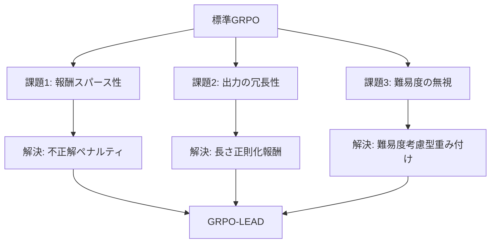

本記事は [GRPO-LEAD: A Difficulty-Aware Reinforcement Learning Approach for Concise Mathematical Reasoning in Language Models](https://aclanthology.org/2025.emnlp-main.287/) の解説記事です。

## 論文概要（Abstract）

GRPO-LEADは、GRPOの3つの実践的課題（報酬スパース性、出力の冗長性、問題難易度の無視）を解決する手法である。著者ら（Jixiao ZhangとChunsheng Zuo）は、(1) 長さ正則化報酬、(2) 不正解への明示的ペナルティ、(3) 難易度考慮型アドバンテージ重み付けの3つのメカニズムを導入し、14Bスケールモデルで最高水準の数学推論性能を達成したと報告している。

この記事は [Zenn記事: GRPOとvLLMで構築するドメイン特化小規模推論モデルの強化学習パイプライン](https://zenn.dev/0h_n0/articles/b96ef4638d36a8) の深掘りです。

## 情報源

- **会議名**: EMNLP 2025（Conference on Empirical Methods in Natural Language Processing）
- **年**: 2025
- **開催地**: Suzhou, China
- **URL**: [https://aclanthology.org/2025.emnlp-main.287/](https://aclanthology.org/2025.emnlp-main.287/)
- **著者**: Jixiao Zhang, Chunsheng Zuo
- **ページ**: 5642-5654

## カンファレンス情報

**EMNLPについて**: EMNLPは自然言語処理分野の最高峰会議の1つであり、ACLやNAACLと並ぶトップカンファレンスである。採択率は通常20-25%程度で、厳しい査読プロセスを経た論文が発表される。GRPO-LEADはEMNLP 2025のメインカンファレンスに採択された。

## 技術的詳細（Technical Details）

### GRPOの3つの課題

GRPO-LEADの著者らは、標準GRPOに以下の3つの課題があると指摘している：



### 1. 長さ正則化報酬（Length-Regularized Reward）

**課題**: 標準GRPOでは正解した応答に一律の報酬を与えるため、冗長な推論を抑制するインセンティブがない。結果として、モデルは不必要に長い推論チェーンを生成しがちになる。

**解決策**: 正解した応答に対して、長さに応じたペナルティを報酬に組み込む。

$$
r_{\text{length}}(o) = r_{\text{accuracy}}(o) - \lambda \cdot \frac{|o|}{L_{\text{ref}}}
$$

ここで、
- $r_{\text{accuracy}}(o)$: 正確性報酬（正解なら正、不正解なら負）
- $\lambda$: 長さペナルティ係数
- $|o|$: 応答のトークン数
- $L_{\text{ref}}$: 参照長（平均応答長など）

これにより、正解かつ簡潔な応答に高い報酬が与えられ、冗長な推論が抑制される。

### 2. 不正解への明示的ペナルティ（Explicit Penalty for Incorrect Answers）

**課題**: 標準GRPOでは、グループ内の相対比較でアドバンテージを決定するため、グループ全体の精度が低い場合、不正解の応答にも正のアドバンテージが割り当てられることがある。

**解決策**: 不正解の応答に対して、グループ内の相対評価とは独立した明示的なペナルティを追加する。

$$
r_{\text{penalty}}(o) = \begin{cases}
r_{\text{length}}(o) & \text{if correct} \\
r_{\text{length}}(o) - \gamma & \text{if incorrect}
\end{cases}
$$

$\gamma$ はペナルティ係数で、不正解への強い抑制を実現する。これにより、モデルは「推測で正解する」よりも「確実に正解する」方向に学習が進む。

### 3. 難易度考慮型アドバンテージ重み付け（Difficulty-Aware Advantage Reweighting）

**課題**: 標準GRPOでは、簡単な問題と難しい問題で同じ重みのアドバンテージが計算される。しかし、難しい問題で正解した応答からの学習信号の方が、モデルの推論能力向上に寄与する。

**解決策**: 問題の難易度に基づいてアドバンテージを重み付けする。

$$
\hat{A}_{\text{LEAD}} = w(d) \cdot \hat{A}_{\text{GRPO}}
$$

ここで $w(d)$ は問題の難易度 $d$ に応じた重み関数。難易度はグループ内の正解率から推定できる：

$$
d = 1 - \frac{\text{グループ内の正解数}}{G}
$$

正解率が低い（= 難しい）問題ほど高い重みを付与することで、難問での推論能力が強化される。

### GRPO-LEADの統合目的関数

3つのメカニズムを統合したGRPO-LEADの目的関数は以下の通り：

$$
\mathcal{J}_{\text{LEAD}}(\theta) = \mathbb{E}\left[ \frac{1}{G} \sum_{i=1}^G w(d) \cdot \frac{1}{|o_i|} \sum_{t=1}^{|o_i|} \min\left( r_{i,t}(\theta) \hat{A}_i^{\text{penalty}},\ \text{clip}(\cdot) \hat{A}_i^{\text{penalty}} \right) \right]
$$

ここで $\hat{A}_i^{\text{penalty}}$ は長さ正則化報酬と不正解ペナルティを組み込んだ修正アドバンテージである。

### アルゴリズムの擬似コード

```python
def grpo_lead_advantage(
    completions: list[str],
    ground_truths: list[str],
    rewards: list[float],
    lambda_length: float = 0.1,
    gamma_penalty: float = 1.0,
    ref_length: int = 200,
) -> list[float]:
    """GRPO-LEADのアドバンテージ計算

    Args:
        completions: モデルの生成応答リスト
        ground_truths: 正解リスト
        rewards: 基本報酬リスト
        lambda_length: 長さペナルティ係数
        gamma_penalty: 不正解ペナルティ係数
        ref_length: 参照トークン長

    Returns:
        GRPO-LEADアドバンテージリスト
    """
    G = len(completions)
    modified_rewards = []

    for i, (comp, truth, r) in enumerate(
        zip(completions, ground_truths, rewards)
    ):
        # 1. 長さ正則化
        length_penalty = lambda_length * len(comp) / ref_length
        modified_r = r - length_penalty

        # 2. 不正解ペナルティ
        is_correct = check_answer(comp, truth)
        if not is_correct:
            modified_r -= gamma_penalty

        modified_rewards.append(modified_r)

    # 3. 難易度計算
    correct_count = sum(
        1 for c, t in zip(completions, ground_truths)
        if check_answer(c, t)
    )
    difficulty = 1 - correct_count / G
    difficulty_weight = 1 + difficulty  # 難問ほど高重み

    # グループ正規化
    mean_r = sum(modified_rewards) / len(modified_rewards)
    std_r = (
        sum((r - mean_r) ** 2 for r in modified_rewards) / len(modified_rewards)
    ) ** 0.5

    advantages = [
        difficulty_weight * (r - mean_r) / (std_r + 1e-8)
        for r in modified_rewards
    ]
    return advantages
```

## 実装のポイント

### TRL GRPOTrainerへの統合

GRPO-LEADの3つのメカニズムは、TRLのGRPOTrainerの報酬関数として実装可能である：

```python
def grpo_lead_reward(
    completions: list[str],
    ground_truth: list[str],
    **kwargs,
) -> list[float]:
    """GRPO-LEAD統合報酬関数"""
    rewards = []
    for comp, truth in zip(completions, ground_truth):
        # 正確性判定
        is_correct = check_answer(comp, truth)

        # 基本報酬
        base_reward = 3.0 if is_correct else -1.0

        # 長さ正則化（正解時のみ適用）
        if is_correct:
            length_penalty = 0.1 * len(comp) / 200
            base_reward -= length_penalty

        # 不正解ペナルティ（追加）
        if not is_correct:
            base_reward -= 1.0

        rewards.append(base_reward)
    return rewards
```

### 難易度重み付けの実装

難易度考慮型重み付けはGRPOTrainerのカスタマイズが必要だが、報酬関数内で近似的に実装可能：

```python
def difficulty_aware_reward(
    completions: list[str],
    ground_truth: list[str],
    **kwargs,
) -> list[float]:
    """難易度を考慮した報酬関数"""
    # グループ内の正解率で難易度を推定
    correct_count = sum(
        1 for c, t in zip(completions, ground_truth)
        if check_answer(c, t)
    )
    difficulty = 1 - correct_count / len(completions)

    # 難易度重み（難しい問題ほど報酬のスケールを大きく）
    weight = 1 + difficulty

    rewards = []
    for comp, truth in zip(completions, ground_truth):
        is_correct = check_answer(comp, truth)
        base = 3.0 if is_correct else -1.0
        rewards.append(weight * base)
    return rewards
```

## Production Deployment Guide

### AWS実装パターン（コスト最適化重視）

| 規模 | 月間リクエスト | 推奨構成 | 月額コスト | 主要サービス |
|------|--------------|---------|-----------|------------|
| **Small** | ~3,000 | Serverless | $50-150 | Lambda + Bedrock + DynamoDB |
| **Medium** | ~30,000 | Hybrid | $300-800 | ECS Fargate + ElastiCache |
| **Large** | 300,000+ | Container | $2,000-5,000 | EKS + Karpenter + EC2 Spot |

**コスト試算の注意事項**: 上記は2026年3月時点のAWS ap-northeast-1料金に基づく概算値です。最新料金は [AWS料金計算ツール](https://calculator.aws/) で確認してください。

### Terraformインフラコード

**Small構成 (Serverless)**

```hcl
module "vpc" {
  source  = "terraform-aws-modules/vpc/aws"
  version = "~> 5.0"
  name    = "grpo-lead-vpc"
  cidr    = "10.0.0.0/16"
  azs     = ["ap-northeast-1a", "ap-northeast-1c"]
  private_subnets = ["10.0.1.0/24", "10.0.2.0/24"]
  enable_nat_gateway   = false
  enable_dns_hostnames = true
}

resource "aws_iam_role" "lambda_bedrock" {
  name = "grpo-lead-lambda-role"
  assume_role_policy = jsonencode({
    Version = "2012-10-17"
    Statement = [{
      Action = "sts:AssumeRole", Effect = "Allow"
      Principal = { Service = "lambda.amazonaws.com" }
    }]
  })
}

resource "aws_lambda_function" "lead_handler" {
  filename      = "lambda.zip"
  function_name = "grpo-lead-handler"
  role          = aws_iam_role.lambda_bedrock.arn
  handler       = "index.handler"
  runtime       = "python3.12"
  timeout       = 60
  memory_size   = 1024
}

resource "aws_dynamodb_table" "cache" {
  name         = "grpo-lead-cache"
  billing_mode = "PAY_PER_REQUEST"
  hash_key     = "prompt_hash"
  attribute { name = "prompt_hash"; type = "S" }
  ttl { attribute_name = "expire_at"; enabled = true }
}
```

**Large構成 (Container): EKS + Karpenter**

```hcl
module "eks" {
  source  = "terraform-aws-modules/eks/aws"
  version = "~> 20.0"
  cluster_name    = "grpo-lead-cluster"
  cluster_version = "1.31"
  vpc_id     = module.vpc.vpc_id
  subnet_ids = module.vpc.private_subnets
  cluster_endpoint_public_access = true
  enable_cluster_creator_admin_permissions = true
}

resource "kubectl_manifest" "karpenter_provisioner" {
  yaml_body = <<-YAML
    apiVersion: karpenter.sh/v1alpha5
    kind: Provisioner
    metadata:
      name: lead-spot-provisioner
    spec:
      requirements:
        - key: karpenter.sh/capacity-type
          operator: In
          values: ["spot"]
        - key: node.kubernetes.io/instance-type
          operator: In
          values: ["g5.xlarge", "g5.2xlarge"]
      limits:
        resources:
          cpu: "32"
          memory: "128Gi"
      ttlSecondsAfterEmpty: 30
  YAML
}
```

### コスト最適化チェックリスト

- [ ] Spot Instances優先（最大90%削減）
- [ ] Reserved Instances: 安定負荷に1年コミット
- [ ] Bedrock Batch API: 50%割引
- [ ] Prompt Caching: 30-90%削減
- [ ] Lambda メモリ最適化
- [ ] EKS アイドル時スケールダウン
- [ ] モデル選択: Haiku / Sonnet使い分け
- [ ] AWS Budgets: 予算アラート
- [ ] Cost Anomaly Detection
- [ ] タグ戦略: 環境別
- [ ] S3ライフサイクル: 自動削除
- [ ] 開発環境: 夜間停止
- [ ] CloudWatch アラーム
- [ ] 日次コストレポート
- [ ] max_tokens制限
- [ ] Savings Plans検討
- [ ] 未使用リソース削除
- [ ] ECRイメージ自動削除
- [ ] VPCエンドポイント
- [ ] CloudFront活用

## 実験結果（Results）

### 標準GRPOとの比較

著者らは14Bスケールモデルでの実験結果を報告している。GRPO-LEADは標準GRPOと比較して以下の改善を達成：

- **正確性の向上**: 不正解ペナルティにより、モデルの精度（precision）が改善
- **応答の簡潔化**: 長さ正則化により、冗長な推論が削減
- **難問での汎化**: 難易度考慮型重み付けにより、学習データに含まれない難問への対応力が向上

### DAPOとの比較

DAPOが大規模モデル（32B）での安定性に焦点を当てているのに対し、GRPO-LEADは中規模モデル（14B）での報酬設計に焦点を当てている。両者は相補的であり、DAPOのClip-HigherとGRPO-LEADの難易度考慮型重み付けを組み合わせることで、さらなる性能向上が期待される。

## 実運用への応用（Practical Applications）

GRPO-LEADの3つのメカニズムは、Zenn記事で紹介されている医療QAのGRPOパイプラインに直接適用可能である：

- **長さ正則化**: 医療QAでは過度に長い推論よりも、要点を押さえた簡潔な回答が求められる
- **不正解ペナルティ**: 医療領域では誤答のコストが高いため、不正解への明示的なペナルティが特に重要
- **難易度考慮**: 症例の複雑さに応じた重み付けにより、難症例への対応力を強化

## まとめ

GRPO-LEADは、標準GRPOの3つの課題（報酬スパース性、冗長性、難易度無視）に対する実践的な解決策を提示した。3つのメカニズムはそれぞれ独立しており、既存のGRPO実装に段階的に追加できる。特に、Zenn記事で紹介されている報酬関数設計（format_reward、accuracy_reward、reasoning_quality_reward）にGRPO-LEADの長さ正則化と難易度重み付けを追加することで、より効果的な学習が期待できる。

## 参考文献

- **Conference URL**: [https://aclanthology.org/2025.emnlp-main.287/](https://aclanthology.org/2025.emnlp-main.287/)
- **PDF**: [https://aclanthology.org/2025.emnlp-main.287.pdf](https://aclanthology.org/2025.emnlp-main.287.pdf)
- **Code**: [https://github.com/aeroplanepaper/GRPO-LEAD](https://github.com/aeroplanepaper/GRPO-LEAD)
- **Related Zenn article**: [https://zenn.dev/0h_n0/articles/b96ef4638d36a8](https://zenn.dev/0h_n0/articles/b96ef4638d36a8)
