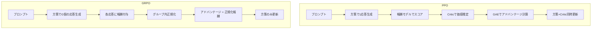

本記事は [DeepSeekMath: Pushing the Limits of Mathematical Reasoning in Open Language Models](https://arxiv.org/abs/2402.03300) の解説記事です。

## 論文概要（Abstract）

DeepSeekMathは、7Bパラメータのオープン言語モデルで数学推論の限界を押し広げた研究である。著者らはCommon Crawlから120Bトークンの数学関連データを収集し、DeepSeek-Coder-Base-v1.5 7Bを継続事前学習することでDeepSeekMath-Base 7Bを構築した。さらに、**Criticモデルを不要にする新しい強化学習アルゴリズムGRPO（Group Relative Policy Optimization）**を提案し、DeepSeekMath-RL 7Bがコンペティションレベルの数学ベンチマークMATHで51.7%、GSM8Kで88.2%を達成したと報告している。

この記事は [Zenn記事: GRPOとvLLMで構築するドメイン特化小規模推論モデルの強化学習パイプライン](https://zenn.dev/0h_n0/articles/b96ef4638d36a8) の深掘りです。

## 情報源

- **arXiv ID**: 2402.03300
- **URL**: [https://arxiv.org/abs/2402.03300](https://arxiv.org/abs/2402.03300)
- **著者**: Zhihong Shao, Peiyi Wang, Qihao Zhu et al. (DeepSeek-AI)
- **発表年**: 2024
- **分野**: cs.CL, cs.AI, cs.LG

## 背景と動機（Background & Motivation）

大規模言語モデルの数学推論能力を向上させるために、強化学習（RL）を適用するアプローチが注目されている。しかし、従来のPPO（Proximal Policy Optimization）ベースのRLHFでは、方策モデルと同サイズのCriticモデル（価値関数）を別途学習する必要があり、GPUメモリ消費が2倍になるという課題があった。

7Bモデルの場合でもCriticモデルを含めると合計14B相当のパラメータをGPU上に保持する必要があり、学習コストが大きい。また、数学推論においてはProcess Reward Model（PRM）やOutcome Reward Model（ORM）といった報酬モデルの学習も必要で、パイプライン全体の複雑さが増していた。

DeepSeekMathの著者らは、これらの課題を解決するためにGRPOを提案した。GRPOはグループ内の相対的な報酬比較によりアドバンテージを推定し、Criticモデルを完全に排除する。

## 主要な貢献（Key Contributions）

- **貢献1**: Common Crawlから120B数学トークンを収集するスケーラブルなデータ収集パイプラインの構築。fastTextベースの反復的な分類器学習により、OpenWebMathの8倍以上の数学コーパスを収集した
- **貢献2**: Criticモデルを不要にする強化学習アルゴリズムGRPOの提案。PPOと同等以上の性能をメモリ半分で実現する
- **貢献3**: 7Bモデルで540B Minervaを上回る数学推論性能（MATH 51.7%）の達成。ルールベース報酬がORM/PRMより有効であることを実験的に示した

## 技術的詳細（Technical Details）

### GRPOアルゴリズムの定式化

GRPOの中核的なアイデアは、各プロンプトに対して生成した複数の応答の報酬を相対比較することで、Criticモデルなしにアドバンテージを推定する点にある。

各質問 $q$ に対して、現在の方策 $\pi_{\theta_{\text{old}}}$ から $G$ 個の応答 $\{o_1, o_2, \ldots, o_G\}$ をサンプリングする。各応答 $o_i$ に対する報酬 $r_i$ を得た後、アドバンテージを以下のように計算する：

$$
\hat{A}_{i,t} = \tilde{r}_i = \frac{r_i - \text{mean}(\{r_1, \ldots, r_G\})}{\text{std}(\{r_1, \ldots, r_G\})}
$$

ここで、
- $r_i$: 応答 $o_i$ に対するスカラー報酬
- $\text{mean}(\cdot)$, $\text{std}(\cdot)$: グループ $G$ 個の報酬の平均と標準偏差
- $\hat{A}_{i,t}$: 応答 $o_i$ 内の全トークン $t$ で共有されるアドバンテージ

このアドバンテージ推定により、同じプロンプトに対する複数応答のうち「平均より良い応答」には正のアドバンテージ、「平均より悪い応答」には負のアドバンテージが割り当てられる。

### GRPO目的関数

GRPOの最適化目的関数は以下の通りである：

$$
\mathcal{J}_{\text{GRPO}}(\theta) = \mathbb{E}_{q \sim P(Q),\ \{o_i\}_{i=1}^G \sim \pi_{\theta_{\text{old}}}(\cdot|q)} \left[ \frac{1}{G} \sum_{i=1}^G \frac{1}{|o_i|} \sum_{t=1}^{|o_i|} \left( \min\left( r_{i,t}(\theta)\, \hat{A}_{i,t},\ \text{clip}(r_{i,t}(\theta), 1-\varepsilon, 1+\varepsilon)\, \hat{A}_{i,t} \right) - \beta\, D_{\text{KL}}\left[\pi_\theta \| \pi_{\text{ref}}\right] \right) \right]
$$

ここで、
- $r_{i,t}(\theta) = \frac{\pi_\theta(o_{i,t} \mid q, o_{i,<t})}{\pi_{\theta_{\text{old}}}(o_{i,t} \mid q, o_{i,<t})}$: 重要度サンプリング比率
- $\varepsilon$: PPOクリッピング閾値（論文では0.2）
- $\beta$: KLペナルティ係数（論文では0.04）
- $\pi_{\text{ref}}$: 参照方策（SFTチェックポイント、凍結）

KLダイバージェンスには不偏推定量が使用されている：

$$
D_{\text{KL}}[\pi_\theta \| \pi_{\text{ref}}] = \frac{\pi_{\text{ref}}(o_{i,t} \mid q, o_{i,<t})}{\pi_\theta(o_{i,t} \mid q, o_{i,<t})} - \log \frac{\pi_{\text{ref}}(o_{i,t} \mid q, o_{i,<t})}{\pi_\theta(o_{i,t} \mid q, o_{i,<t})} - 1
$$

この不偏推定量は、単純な対数比率近似 $\log(\pi_\theta / \pi_{\text{ref}})$ よりも安定した学習を可能にする。

### アルゴリズムの擬似コード

```python
def grpo_training_step(
    policy: nn.Module,
    ref_policy: nn.Module,
    questions: list[str],
    reward_fn: Callable,
    G: int = 8,
    epsilon: float = 0.2,
    beta: float = 0.04,
) -> torch.Tensor:
    """GRPOの1学習ステップ

    Args:
        policy: 現在の方策モデル
        ref_policy: 参照方策モデル（凍結）
        questions: 質問バッチ
        reward_fn: 報酬関数（ルールベースまたはモデル）
        G: グループサイズ（プロンプトあたりの生成数）
        epsilon: PPOクリッピング閾値
        beta: KLペナルティ係数

    Returns:
        GRPO損失値
    """
    all_losses = []
    for q in questions:
        # Step 1: G個の応答をサンプリング
        outputs = [policy.generate(q) for _ in range(G)]

        # Step 2: 各応答に報酬を付与
        rewards = [reward_fn(q, o) for o in outputs]

        # Step 3: グループ正規化アドバンテージ
        mean_r = sum(rewards) / len(rewards)
        std_r = (sum((r - mean_r) ** 2 for r in rewards) / len(rewards)) ** 0.5
        advantages = [(r - mean_r) / (std_r + 1e-8) for r in rewards]

        # Step 4: クリップされた方策勾配損失 + KLペナルティ
        for o, adv in zip(outputs, advantages):
            ratio = policy.log_prob(o, q).exp() / old_policy.log_prob(o, q).exp()
            clipped = torch.clamp(ratio, 1 - epsilon, 1 + epsilon)
            pg_loss = -torch.min(ratio * adv, clipped * adv)
            kl = compute_unbiased_kl(policy, ref_policy, o, q)
            all_losses.append(pg_loss + beta * kl)

    return torch.stack(all_losses).mean()
```

### PPOとの構造的比較



| 項目 | PPO | GRPO |
|------|-----|------|
| 必要モデル数 | 方策 + Critic + 報酬モデル + 参照モデル | 方策 + 報酬関数 + 参照モデル |
| VRAMオーバーヘッド | Criticモデル分（方策と同サイズ） | なし |
| アドバンテージ推定 | GAE（Generalized Advantage Estimation） | グループ内Z-score正規化 |
| 生成コスト | 1応答/プロンプト | G応答/プロンプト（G=8が標準） |

## 実装のポイント（Implementation）

### ハイパーパラメータ設定

論文で報告されているGRPOの主要ハイパーパラメータは以下の通りである（論文Table付近の記述より）：

| パラメータ | 値 | 備考 |
|-----------|-----|------|
| グループサイズ $G$ | 8 | 生成コストとのトレードオフ |
| PPOクリップ $\varepsilon$ | 0.2 | 標準的な値 |
| KL係数 $\beta$ | 0.04 | 参照モデルからの逸脱制御 |
| 学習率 | 1e-6 | 低い学習率で安定化 |
| バッチサイズ | 1024問題 | 大規模バッチ |
| 最大出力長 | 1024トークン | 数学推論に十分 |
| 学習ステップ数 | 約500 | 比較的少ないステップ |

### 報酬関数の選択

著者らは3種類の報酬信号を比較実験している：

1. **ルールベース報酬**: 最終回答の正誤をsympy等で記号的に判定（0/1の二値報酬）
2. **ORM（Outcome Reward Model）**: 最終回答の正誤を学習された報酬モデルで判定
3. **PRM（Process Reward Model）**: 推論の各ステップを評価する報酬モデル

実験結果として、ルールベース報酬が最も有効であり、報酬ハッキングを回避できることが示されている。

### vLLMとの統合が重要な理由

GRPOでは各プロンプトに対して $G=8$ 個の応答を生成する必要があるため、生成ステップがボトルネックとなる。vLLMのPagedAttentionによる高速推論を活用することで、このボトルネックを大幅に緩和できる。TRL 0.29.0以降では `use_vllm=True` オプションでvLLM統合が利用可能である。

## 実験結果（Results）

### メインベンチマーク

著者らが報告した主要ベンチマーク結果を以下に示す（論文のメイン結果表より）：

| モデル | サイズ | MATH (%) | GSM8K (%) |
|--------|--------|----------|-----------|
| Minerva | 540B | 33.6 | 78.5 |
| WizardMath-70B | 70B | 22.7 | - |
| GPT-4 (報告値) | ~1T | 42.5 | 92.0 |
| DeepSeekMath-Base 7B | 7B | 51.7 | 64.2 |
| DeepSeekMath-Instruct 7B | 7B | 46.8 | 82.9 |
| DeepSeekMath-RL 7B | 7B | **51.7** | **88.2** |

7Bモデルが540B Minervaを大幅に上回り、GPT-4にも匹敵する数学推論性能を達成している点が注目に値する。

### GRPOアブレーション（報酬タイプ別）

異なるRL手法と報酬信号の組み合わせによるMATHベンチマーク結果：

| RL手法 | 報酬タイプ | MATH (%) |
|--------|-----------|----------|
| SFTベースライン | — | 46.8 |
| PPO | ORM | 48.5 |
| GRPO | ORM | 50.0 |
| GRPO | PRM | 50.9 |
| GRPO | ルールベース | **51.7** |

ルールベース報酬を用いたGRPOが最高性能を達成しており、学習された報酬モデル（ORM/PRM）よりも有効であることが実験的に示されている。著者らはこの結果について、ルールベース報酬は正誤が明確に判定できるタスクでは報酬ハッキングが起きにくいためと分析している。

### 事前学習データの効果

| データソース | トークン数 | MATH (Base, 4-shot) |
|-------------|-----------|---------------------|
| OpenWebMath | 14.7B | 15.2% |
| arXiv数学論文 | ~22B | 16.4% |
| DeepSeekMathコーパス | 120B | **35.6%** |

120Bトークンの大規模数学コーパスが性能向上に大きく寄与していることが分かる。

## 実運用への応用（Practical Applications）

GRPOは数学推論に限らず、正誤が明確に判定できるドメイン全般に適用可能である。具体的には以下のユースケースが考えられる：

- **医療QA**: MedQAのような選択肢型問題では正解判定がルールベースで可能（Zenn記事で詳述）
- **コード生成**: テストケースの通過/不通過で二値報酬を設計可能
- **数学推論**: 記号的等価性チェックで自動評価可能
- **論理推論**: 形式的な推論タスクでルールベース報酬が適用可能

プロダクション視点では、GRPOはCriticモデルが不要なためPPOの約半分のVRAMで動作し、4×A100 80GB程度の構成で7Bモデルの学習が実用的な時間で完了する。

## Production Deployment Guide

### AWS実装パターン（コスト最適化重視）

**トラフィック量別の推奨構成**:

| 規模 | 月間リクエスト | 推奨構成 | 月額コスト | 主要サービス |
|------|--------------|---------|-----------|------------|
| **Small** | ~3,000 (100/日) | Serverless | $50-150 | Lambda + Bedrock + DynamoDB |
| **Medium** | ~30,000 (1,000/日) | Hybrid | $300-800 | Lambda + ECS Fargate + ElastiCache |
| **Large** | 300,000+ (10,000/日) | Container | $2,000-5,000 | EKS + Karpenter + EC2 Spot |

**Small構成の詳細** (月額$50-150):
- **Lambda**: 1GB RAM, 60秒タイムアウト ($20/月)
- **Bedrock**: Claude 3.5 Haiku, Prompt Caching有効 ($80/月)
- **DynamoDB**: On-Demand ($10/月)
- **CloudWatch**: 基本監視 ($5/月)
- **API Gateway**: REST API ($5/月)

**Medium構成の詳細** (月額$300-800):
- **Lambda**: イベント処理 ($50/月)
- **ECS Fargate**: 0.5 vCPU, 1GB RAM × 2タスク ($120/月)
- **Bedrock**: Claude 3.5 Sonnet, Batch API活用 ($400/月)
- **ElastiCache Redis**: cache.t3.micro ($15/月)

**Large構成の詳細** (月額$2,000-5,000):
- **EKS**: コントロールプレーン ($72/月)
- **EC2 Spot Instances**: g5.xlarge × 2-4台 (平均$800/月)
- **Karpenter**: 自動スケーリング
- **Bedrock Batch**: 50%割引活用 ($2,000/月)

**コスト試算の注意事項**: 上記は2026年3月時点のAWS ap-northeast-1（東京）リージョン料金に基づく概算値です。実際のコストはトラフィックパターンにより変動します。最新料金は [AWS料金計算ツール](https://calculator.aws/) で確認してください。

### Terraformインフラコード

**Small構成 (Serverless): Lambda + Bedrock + DynamoDB**

```hcl
module "vpc" {
  source  = "terraform-aws-modules/vpc/aws"
  version = "~> 5.0"

  name = "grpo-inference-vpc"
  cidr = "10.0.0.0/16"
  azs  = ["ap-northeast-1a", "ap-northeast-1c"]
  private_subnets = ["10.0.1.0/24", "10.0.2.0/24"]

  enable_nat_gateway   = false
  enable_dns_hostnames = true
}

resource "aws_iam_role" "lambda_bedrock" {
  name = "grpo-lambda-bedrock-role"
  assume_role_policy = jsonencode({
    Version = "2012-10-17"
    Statement = [{
      Action    = "sts:AssumeRole"
      Effect    = "Allow"
      Principal = { Service = "lambda.amazonaws.com" }
    }]
  })
}

resource "aws_iam_role_policy" "bedrock_invoke" {
  role = aws_iam_role.lambda_bedrock.id
  policy = jsonencode({
    Version = "2012-10-17"
    Statement = [{
      Effect   = "Allow"
      Action   = ["bedrock:InvokeModel", "bedrock:InvokeModelWithResponseStream"]
      Resource = "arn:aws:bedrock:ap-northeast-1::foundation-model/anthropic.claude-3-5-haiku*"
    }]
  })
}

resource "aws_lambda_function" "grpo_handler" {
  filename      = "lambda.zip"
  function_name = "grpo-inference-handler"
  role          = aws_iam_role.lambda_bedrock.arn
  handler       = "index.handler"
  runtime       = "python3.12"
  timeout       = 60
  memory_size   = 1024
  environment {
    variables = {
      BEDROCK_MODEL_ID    = "anthropic.claude-3-5-haiku-20241022-v1:0"
      DYNAMODB_TABLE      = aws_dynamodb_table.cache.name
      ENABLE_PROMPT_CACHE = "true"
    }
  }
}

resource "aws_dynamodb_table" "cache" {
  name         = "grpo-prompt-cache"
  billing_mode = "PAY_PER_REQUEST"
  hash_key     = "prompt_hash"
  attribute { name = "prompt_hash"; type = "S" }
  ttl { attribute_name = "expire_at"; enabled = true }
}
```

**Large構成 (Container): EKS + Karpenter + Spot Instances**

```hcl
module "eks" {
  source  = "terraform-aws-modules/eks/aws"
  version = "~> 20.0"

  cluster_name    = "grpo-training-cluster"
  cluster_version = "1.31"
  vpc_id          = module.vpc.vpc_id
  subnet_ids      = module.vpc.private_subnets

  cluster_endpoint_public_access = true
  enable_cluster_creator_admin_permissions = true
}

resource "kubectl_manifest" "karpenter_provisioner" {
  yaml_body = <<-YAML
    apiVersion: karpenter.sh/v1alpha5
    kind: Provisioner
    metadata:
      name: grpo-spot-provisioner
    spec:
      requirements:
        - key: karpenter.sh/capacity-type
          operator: In
          values: ["spot"]
        - key: node.kubernetes.io/instance-type
          operator: In
          values: ["g5.xlarge", "g5.2xlarge"]
      limits:
        resources:
          cpu: "32"
          memory: "128Gi"
      ttlSecondsAfterEmpty: 30
  YAML
}

resource "aws_budgets_budget" "grpo_monthly" {
  name         = "grpo-monthly-budget"
  budget_type  = "COST"
  limit_amount = "5000"
  limit_unit   = "USD"
  time_unit    = "MONTHLY"
  notification {
    comparison_operator        = "GREATER_THAN"
    threshold                  = 80
    threshold_type             = "PERCENTAGE"
    notification_type          = "ACTUAL"
    subscriber_email_addresses = ["ops@example.com"]
  }
}
```

### セキュリティベストプラクティス

- **IAMロール**: 最小権限の原則。Bedrock InvokeModelのみ許可
- **ネットワーク**: EKSはプライベートサブネット内に配置。本番では `cluster_endpoint_public_access = false` を推奨
- **シークレット管理**: AWS Secrets Manager使用。環境変数へのハードコード禁止
- **暗号化**: S3/DynamoDB/EBS全てKMS暗号化。転送中はTLS 1.2以上必須
- **監査**: CloudTrail全リージョン有効化

### 運用・監視設定

```python
import boto3

cloudwatch = boto3.client('cloudwatch')

cloudwatch.put_metric_alarm(
    AlarmName='grpo-bedrock-token-spike',
    ComparisonOperator='GreaterThanThreshold',
    EvaluationPeriods=1,
    MetricName='TokenUsage',
    Namespace='AWS/Bedrock',
    Period=3600,
    Statistic='Sum',
    Threshold=500000,
    ActionsEnabled=True,
    AlarmActions=['arn:aws:sns:ap-northeast-1:123456789:cost-alerts'],
    AlarmDescription='Bedrockトークン使用量異常（コスト急増）'
)
```

### コスト最適化チェックリスト

- [ ] ~100 req/日 → Lambda + Bedrock (Serverless) - $50-150/月
- [ ] ~1000 req/日 → ECS Fargate + Bedrock (Hybrid) - $300-800/月
- [ ] 10000+ req/日 → EKS + Spot Instances (Container) - $2,000-5,000/月
- [ ] EC2: Spot Instances優先（最大90%削減、Karpenter自動管理）
- [ ] Reserved Instances: 1年コミットで72%削減
- [ ] Savings Plans: Compute Savings Plans検討
- [ ] Lambda: メモリサイズ最適化（CloudWatch Insights分析）
- [ ] ECS/EKS: アイドルタイムのスケールダウン
- [ ] Bedrock Batch API: 50%割引（非リアルタイム処理）
- [ ] Prompt Caching: 30-90%削減
- [ ] モデル選択: 開発はHaiku ($0.25/MTok)、本番複雑タスクはSonnet ($3/MTok)
- [ ] トークン数制限: max_tokens設定で過剰生成防止
- [ ] AWS Budgets: 月額予算設定
- [ ] CloudWatch アラーム: トークン使用量スパイク検知
- [ ] Cost Anomaly Detection: 自動異常検知
- [ ] 日次コストレポート: SNS/Slackへ自動送信
- [ ] 未使用リソース削除: Lambda Insights, Trusted Advisor活用
- [ ] タグ戦略: 環境別・プロジェクト別でコスト可視化
- [ ] ライフサイクルポリシー: S3古いキャッシュ30日で自動削除
- [ ] RDS/ElastiCache: 開発環境は夜間停止

## 関連研究（Related Work）

- **PPO (Schulman et al., 2017)**: GRPOの基盤となったRL手法。Criticモデルを用いたGAEによるアドバンテージ推定を行うが、メモリコストが大きい
- **REINFORCE (Williams, 1992)**: ベースラインなしの方策勾配法。分散が大きく学習が不安定だが、Criticモデルは不要。GRPOはREINFORCEのグループ正規化版とも解釈できる
- **DeepSeek-R1 (DeepSeek-AI, 2025)**: GRPOを多段階パイプラインに組み込み、推論能力を大幅に向上させた後続研究。AIME 2024でOpenAI o1と同等の性能を達成

## まとめと今後の展望

DeepSeekMathは、GRPOという効率的なRLアルゴリズムを提案し、7Bモデルで540Bモデルに匹敵する数学推論性能を実現した。GRPOの「Criticモデル不要」「ルールベース報酬が有効」という知見は、その後のDeepSeek-R1やDAOPなどの研究にも受け継がれている。

実務的には、正誤が明確に判定できるタスク（数学・コード生成・医療QA等）において、GRPOはPPOの代替として有力な選択肢である。vLLMとの統合により生成ボトルネックを解消すれば、単一ノードでも7Bモデルの効率的なRL学習が実現可能である。

## 参考文献

- **arXiv**: [https://arxiv.org/abs/2402.03300](https://arxiv.org/abs/2402.03300)
- **Related Zenn article**: [https://zenn.dev/0h_n0/articles/b96ef4638d36a8](https://zenn.dev/0h_n0/articles/b96ef4638d36a8)
