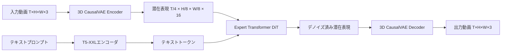

本記事は [arXiv:2408.06072 "CogVideoX: Text-to-Video Diffusion Models with An Expert Transformer"](https://arxiv.org/abs/2408.06072) の解説記事です。この論文はICLR 2025に採択されています。

## 論文概要（Abstract）

CogVideoXは、Zhipu AI（清華大学系）が開発した大規模テキスト-動画拡散モデルである。著者らは、テキストと動画の深い融合を促進する「Expert Transformer」アーキテクチャを提案し、768×1360解像度・10秒・16FPSの連続動画生成を実現している。3D因果VAEにより空間・時間の両次元で動画を圧縮し、Expert Adaptive LayerNormによるモダリティ間の適応的な特徴変調を導入している。モデル重みはCogVideoX-2BとCogVideoX-5Bの2サイズが公開されており、diffusersライブラリに統合済みである。

この記事は [Zenn記事: ローカル動画生成AI 2026年版GPU別完全ガイド─Wan2.2からLTX-2まで](https://zenn.dev/0h_n0/articles/762f0c52ad513a) の深掘りです。

## 情報源

- **会議名**: ICLR（International Conference on Learning Representations）2025
- **年**: 2025
- **URL**: [https://arxiv.org/abs/2408.06072](https://arxiv.org/abs/2408.06072)
- **著者**: Zhuoyi Yang, Jiayan Teng, Wendi Zheng, Ming Ding et al. (Zhipu AI / 清華大学、18名)

## カンファレンス情報

**ICLR（International Conference on Learning Representations）** は、深層学習・表現学習分野の主要国際会議の一つであり、NeurIPSおよびICMLと並ぶトップカンファレンスとして位置づけられている。ICLR 2025の採択率は約30%前後であり、査読はオープンレビュー形式（OpenReview）で行われる。CogVideoXは2024年8月にarXivにプレプリントが公開され、2025年にICLR 2025に採択された。

## 背景と動機（Background & Motivation）

テキストから動画を生成するT2Vモデルの主な課題は、テキストの意味と動画の視覚的内容を深く対応付ける「テキスト-動画アライメント」である。従来のDiffusion TransformerではCross-Attentionを使ってテキスト特徴を動画特徴に注入するが、この手法では以下の問題があった：

1. **モダリティギャップ**: テキスト（1次元の離散トークン列）と動画（3次元の連続信号）の間の表現空間の不一致
2. **浅い融合**: Cross-Attentionは各層で独立に適用されるため、テキストと動画の深い相互作用が不十分
3. **長尺の破綻**: 長い動画（6秒以上）では、テキストとの一致度が徐々に低下する

著者らは、これらの課題を解決するために、テキストと動画のモダリティを適応的に調整する「Expert Adaptive LayerNorm」を核とするExpert Transformerを提案している。

## 技術的詳細（Technical Details）

### Expert Transformer

CogVideoXの中核は、Expert Adaptive LayerNorm（Expert AdaLN）を持つTransformerブロックである。

標準的なAdaLN（Adaptive Layer Normalization）は、タイムステップ $t$ のみに条件付けされる：

$$
\text{AdaLN}(\mathbf{x}, t) = \gamma(t) \odot \text{LN}(\mathbf{x}) + \beta(t)
$$

CogVideoXのExpert AdaLNは、タイムステップに加えて**モダリティタイプ**（テキスト or 動画）にも条件付けされる：

$$
\text{ExpertAdaLN}(\mathbf{x}, t, m) = \gamma(t, m) \odot \text{LN}(\mathbf{x}) + \beta(t, m)
$$

ここで、
- $\mathbf{x}$: 入力トークン
- $t$: 拡散タイムステップ
- $m \in \{\text{text}, \text{video}\}$: モダリティタイプ
- $\gamma(t, m), \beta(t, m)$: モダリティとタイムステップに依存するスケール・シフトパラメータ
- $\odot$: 要素ごとの積

テキストトークンと動画トークンがそれぞれ異なるスケール・シフトパラメータで正規化されるため、各モダリティの特性に適応した特徴変調が行われる。著者らはこの仕組みを「エキスパートが各モダリティを専門的に処理する」と表現しており、これがExpert Transformerの名前の由来である。

```python
import torch
import torch.nn as nn

class ExpertAdaLN(nn.Module):
    """Expert Adaptive Layer Normalization

    テキストと動画のモダリティ別にスケール・シフトを学習する

    Args:
        hidden_size: 特徴次元数
        num_modalities: モダリティ数（テキスト + 動画 = 2）
    """
    def __init__(self, hidden_size: int, num_modalities: int = 2):
        super().__init__()
        self.norm = nn.LayerNorm(hidden_size, elementwise_affine=False)

        # モダリティごとの条件付けMLPを保持
        self.modality_mlps = nn.ModuleList([
            nn.Sequential(
                nn.SiLU(),
                nn.Linear(hidden_size, hidden_size * 2),
            )
            for _ in range(num_modalities)
        ])

    def forward(
        self,
        x: torch.Tensor,
        timestep_emb: torch.Tensor,
        modality_idx: int,
    ) -> torch.Tensor:
        """Expert AdaLNを適用

        Args:
            x: 入力テンソル (B, N, D)
            timestep_emb: タイムステップ埋め込み (B, D)
            modality_idx: 0=テキスト, 1=動画

        Returns:
            正規化されたテンソル (B, N, D)
        """
        # モダリティ別のスケール・シフトを計算
        scale_shift = self.modality_mlps[modality_idx](timestep_emb)
        scale, shift = scale_shift.chunk(2, dim=-1)

        # Layer Normの後にモダリティ適応的な変調
        x = self.norm(x)
        x = x * (1 + scale.unsqueeze(1)) + shift.unsqueeze(1)
        return x
```

### 3D Full Attention

CogVideoXは、テキストトークンと動画トークンを結合した上で3D Full Attentionを計算する。動画トークンは3次元（時間 $T$・高さ $H$・幅 $W$）を持ち、これをフラット化して1次元トークン列とする。テキストトークン $M$ 個と結合後、全 $M + T \times H \times W$ トークン間でFull Attentionが計算される。

$$
\text{Attention}(\mathbf{Q}, \mathbf{K}, \mathbf{V}) = \text{softmax}\left(\frac{\mathbf{Q}\mathbf{K}^T}{\sqrt{d_k}}\right)\mathbf{V}
$$

ここで $\mathbf{Q}, \mathbf{K}, \mathbf{V} \in \mathbb{R}^{(M + T \cdot H \cdot W) \times d_k}$。

3D Full Attentionの利点は、空間と時間の長距離依存関係を同時に捕捉できる点である。一方、計算コストは $O((M + THW)^2)$ であり、解像度やフレーム数の増加に対して二乗的に増大するという制約がある。

### 3D因果VAE

CogVideoXの3D VAEは、空間と時間の両次元を圧縮する。Wanとの主な違いは、CogVideoXのVAEが因果構造だけでなく、ダウンサンプリング率の設計も異なる点である：

| 項目 | CogVideoX VAE | Wan VAE | HunyuanVideo VAE |
|------|-------------|---------|-----------------|
| 時間圧縮比 | 4× | 4× | 4× |
| 空間圧縮比 | 8×8 | 8×8 | 8×8 |
| 潜在チャネル数 | 16 | 16 | 16 |
| 因果構造 | あり | あり | あり |

3モデルとも圧縮比は同一（4×8×8）であり、VAE設計の基本方針は共通している。差異はエンコーダ/デコーダの内部アーキテクチャ（ブロック数、チャネル数）にある。



## 実装のポイント（Implementation）

### diffusersによる簡易実行

CogVideoXの最大の利点は、Hugging Face diffusersライブラリに統合済みである点である。最小3行のコードで動画生成が可能：

```python
from diffusers import CogVideoXPipeline
import torch

# CogVideoX-5B パイプラインのロード
pipe = CogVideoXPipeline.from_pretrained(
    "THUDM/CogVideoX-5b",
    torch_dtype=torch.float16,
)
pipe.to("cuda")

# 動画生成（49フレーム、約4秒@12fps）
video = pipe(
    prompt="A golden retriever running through a field of sunflowers",
    num_frames=49,
    guidance_scale=6.0,
    num_inference_steps=50,
).frames[0]

# 動画をMP4として保存
from diffusers.utils import export_to_video
export_to_video(video, "output.mp4", fps=12)
```

### VRAM要件

| モデル | FP16 VRAM | FP8 VRAM | 最大解像度 | 最大フレーム数 |
|--------|-----------|----------|-----------|-------------|
| CogVideoX-2B | 約12GB | 約8GB | 720×480 | 49 |
| CogVideoX-5B | 約24GB | 約16GB | 1360×768 | 49 |

CogVideoX-2BはRTX 3060（12GB）でも動作可能なため、エントリーレベルのGPUでの動画生成に適している。

### 49フレーム制限

CogVideoXの最大フレーム数は49（約4秒@12fps、約3秒@16fps）に制限されている。これは3D Full Attentionの計算コストが $O((THW)^2)$ で増大するため、フレーム数を増やすとVRAMが急激に増加するためである。より長い動画が必要な場合は、FramePackやWan 2.2（最大81フレーム）を検討する必要がある。

## 実験結果（Results）

著者らはVBench、UCF-101、MSR-VTTの3つのベンチマークで評価を実施している。

**VBenchスコア**（論文Table 2より）:

| モデル | Total Score | Subject Consistency | Motion Quality |
|--------|-------------|--------------------|--------------:|
| CogVideoX-5B | 81.6% | 94.1% | 97.2% |
| CogVideoX-2B | 79.8% | 92.5% | 96.1% |
| Open-Sora 1.2 | 78.4% | 91.8% | 95.3% |

CogVideoX-5BはVBench Total 81.6%を達成し、公開時点（2024年8月）ではオープンソースモデルで最高水準であった。ただし、2025年3月のWan（84.7%）およびHunyuanVideo（82.3%）にはスコアで劣っている。

著者らのアブレーション実験（論文Table 3）では、Expert AdaLNの導入によりVBenchスコアが1.8ポイント向上し、特にText-Video Alignment（テキスト-動画の一致度）で顕著な改善が見られたと報告されている。

## 実運用への応用（Practical Applications）

CogVideoXはZenn記事で紹介されている7モデルの中で、**最も実装が簡単**なモデルである。

**迅速なプロトタイピング**: diffusersの3行コードで動画生成が可能なため、PoC（Proof of Concept）やプロトタイプ作成に最適。他モデルがComfyUIワークフローやカスタムスクリプトを必要とするのに対し、CogVideoXは標準的なPythonコードのみで動作する。

**パイプライン統合**: diffusersの標準インターフェースに準拠しているため、既存のStable Diffusion画像生成パイプラインに動画生成を追加する場合の実装コストが低い。LoRA、ControlNet等の既存拡張との互換性も高い。

**制約事項**: 49フレーム（約4秒）の制限は他モデルより厳しい。また、CogVideoX Licenseは商用利用に制限がある。長尺動画や高解像度が必要な場合はWan 2.2やHunyuanVideoを選択すべきである。

## 関連研究（Related Work）

- **CogVideo (Zhipu AI, 2022, ICLR 2023)**: CogVideoXの前身。CogVideoXは3D因果VAEとExpert Transformerを追加し、品質・効率を大幅に向上
- **Wan (Alibaba, 2025)**: MoE（Mixture-of-Experts）アーキテクチャ。CogVideoXのExpert AdaLNとは異なる「エキスパート」概念であり、Wanはノイズレベルでエキスパートを切り替えるのに対し、CogVideoXはモダリティでエキスパートを分ける
- **HunyuanVideo (Tencent, 2024)**: Dual-stream設計。CogVideoXの3D Full Attentionとは異なり、最初にモダリティを分離してから統合する
- **DiT (Peebles & Xie, 2023)**: Diffusion Transformer。CogVideoXはDiTにExpert AdaLNを追加した拡張と見なせる

## まとめと今後の展望

CogVideoXは、Expert Adaptive LayerNormにより、テキストと動画のモダリティを適応的に処理するアプローチを提案した。ICLR 2025に採択されたこの手法は、モダリティ間の深い融合を実現する新しいパラダイムとして位置づけられる。

実装面では、diffusersへの統合によりPythonエコシステムとの親和性が高く、最も手軽に使い始められる動画生成モデルである。一方、49フレーム制限やVBenchスコアの面では後発モデル（Wan、HunyuanVideo）に譲る部分もある。用途に応じた適切なモデル選択が重要であり、プロトタイピングにはCogVideoX、品質重視にはWan 2.2という使い分けが有効である。

## 参考文献

- **arXiv**: [https://arxiv.org/abs/2408.06072](https://arxiv.org/abs/2408.06072)
- **Code**: [https://github.com/THUDM/CogVideo](https://github.com/THUDM/CogVideo)
- **OpenReview**: [https://openreview.net/forum?id=LQzN6TRFg9](https://openreview.net/forum?id=LQzN6TRFg9)
- **Related Zenn article**: [https://zenn.dev/0h_n0/articles/762f0c52ad513a](https://zenn.dev/0h_n0/articles/762f0c52ad513a)
