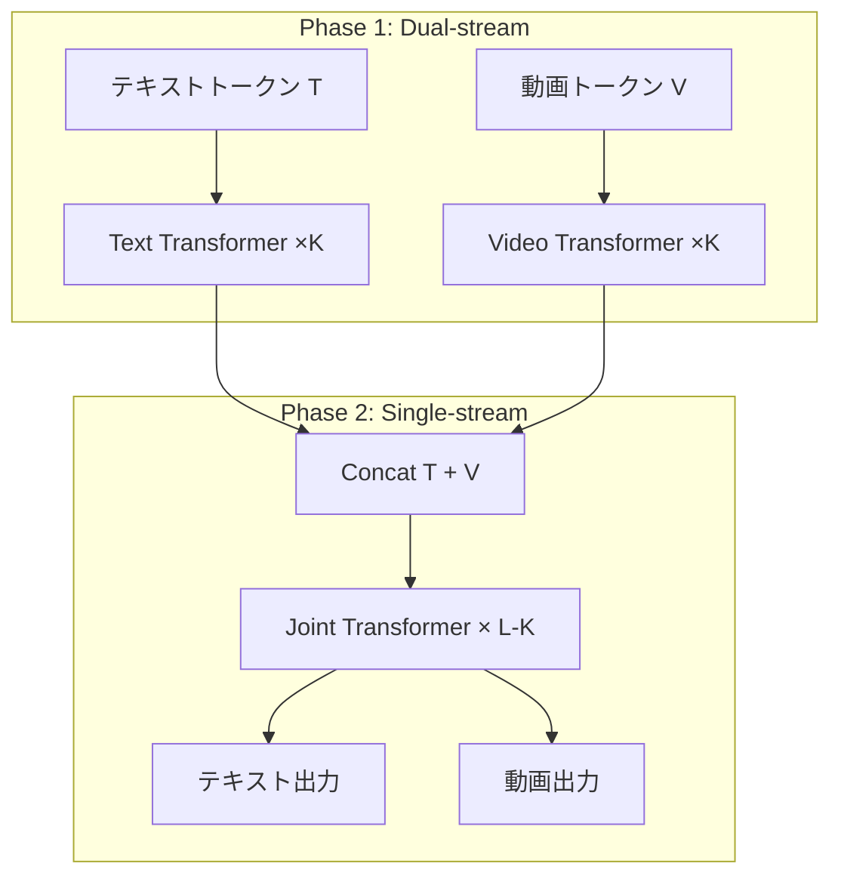

本記事は [arXiv:2412.03603 "HunyuanVideo: A Systematic Framework for Large Video Generation Model"](https://arxiv.org/abs/2412.03603) の解説記事です。

## 論文概要（Abstract）

HunyuanVideoは、Tencentが開発した13Bパラメータのオープンソース動画生成モデルである。著者らは、データキュレーション、アーキテクチャ設計、段階的スケーリング訓練、大規模推論インフラの4つの要素を統合的に設計したフレームワークを提案している。専門家による評価では、Runway Gen-3、Luma 1.6、および中国の主要動画生成モデルを上回る性能を達成したと報告されている。公開時点（2024年12月）で、オープンソースモデルとしては最大のパラメータ数を持つ動画生成モデルであった。

この記事は [Zenn記事: ローカル動画生成AI 2026年版GPU別完全ガイド─Wan2.2からLTX-2まで](https://zenn.dev/0h_n0/articles/762f0c52ad513a) の深掘りです。

## 情報源

- **arXiv ID**: 2412.03603
- **URL**: [https://arxiv.org/abs/2412.03603](https://arxiv.org/abs/2412.03603)
- **著者**: Weijie Kong et al. (Tencent、52名)
- **発表年**: 2024
- **分野**: cs.CV, cs.AI

## 背景と動機（Background & Motivation）

2024年のSora発表以降、高品質な動画生成は主にクローズドソースモデルが牽引していた。OpenAIのSora、GoogleのLumiere、RunwayのGen-3などは高品質な動画を生成できるが、モデルの重みやアーキテクチャが非公開であるため、研究コミュニティによる検証や改良が困難であった。

オープンソース側では、CogVideoX（5B）やOpen-Sora（数Bクラス）が存在したが、商用モデルとの品質ギャップは依然として大きかった。著者らは、この品質ギャップを埋めるために、以下の3つの技術的課題に取り組んでいる：

1. **テキスト理解の深化**: 従来のCLIPやT5エンコーダでは、複雑なプロンプトの細粒度な意味理解が不十分
2. **時間的一貫性の維持**: 長尺動画（5秒以上）での被写体の外見変化や動きの破綻
3. **スケーラブルな訓練**: 13Bパラメータモデルの効率的な訓練インフラの構築

## 主要な貢献（Key Contributions）

- **貢献1**: Dual-stream to Single-streamハイブリッドTransformerアーキテクチャの提案。テキストと動画を最初は独立ストリームで処理し、後半で統合する設計
- **貢献2**: MLLM（Multimodal Large Language Model）ベースのテキストエンコーダの採用。LLaMA系のDecoder-OnlyモデルをT2Vのテキストエンコーダとして使用する初の試み
- **貢献3**: 3D因果VAE（CausalVAE）の開発。時間圧縮比4、空間圧縮比8の効率的な動画圧縮
- **貢献4**: 3D RoPE（Rotary Position Embedding）の拡張。動画の3次元（時間・高さ・幅）に対応した位置エンコーディング

## 技術的詳細（Technical Details）

### Dual-stream to Single-streamハイブリッドTransformer

HunyuanVideoの最も特徴的な設計は、テキストと動画の特徴処理を2段階で行うハイブリッドアーキテクチャである。

**Phase 1 - Dual-stream（独立処理）**:

テキストトークン $\mathbf{T} \in \mathbb{R}^{M \times D}$ と動画トークン $\mathbf{V} \in \mathbb{R}^{N \times D}$ はそれぞれ独立のTransformerブロックで処理される：

$$
\mathbf{T}' = \text{TransformerBlock}_T(\mathbf{T}), \quad \mathbf{V}' = \text{TransformerBlock}_V(\mathbf{V})
$$

この段階では、テキストと動画は互いに情報を交換しない。各モダリティが固有の特徴表現を学習する。

**Phase 2 - Single-stream（統合処理）**:

Dual-stream処理後、テキストと動画のトークンが結合され、単一のTransformerブロックで処理される：

$$
[\mathbf{T}'', \mathbf{V}''] = \text{TransformerBlock}_{TV}([\mathbf{T}'; \mathbf{V}'])
$$

ここで $[\cdot ; \cdot]$ はトークン列の結合を表す。Single-stream段階ではFull Attentionにより、テキストと動画の全トークン間で情報交換が行われる。

著者らによれば、この2段階設計の利点は以下の通りである：
1. Dual-stream段階で各モダリティが十分な特徴を学習してからCross-Modalityの統合が行われるため、弱いモダリティが強いモダリティに支配されない
2. Dual-stream段階のSelf-Attentionは各モダリティ内のトークンのみで計算されるため、計算コストが削減される



### MLLMベースのテキストエンコーダ

従来の動画生成モデルはCLIP（Contrastive Language-Image Pre-training）やT5をテキストエンコーダとして使用していた。HunyuanVideoは、これらに代えてLLaMA系のMLLM（Multimodal Large Language Model）をDecoder-Only構造のままテキストエンコーダとして採用した。

この選択の理由は：
1. **長いプロンプトへの対応**: CLIPの77トークン制限を超える長文プロンプトの処理が可能
2. **細粒度な意味理解**: LLMの持つ言語理解能力により、「赤い帽子をかぶった女性が公園で犬を散歩させている」のような複雑な記述を正確にパースできる
3. **多言語対応**: LLMの多言語能力により、中国語・英語の両方で動作

テキストエンコーダの出力 $\mathbf{T}$ は、Dual-stream段階のText Transformerへの入力として使用される。CLIP系のエンコーダと比較して、特に長文プロンプトや空間的関係の記述（「左に〜、右に〜」）での忠実度が向上したと著者らは報告している。

### 3D因果VAE（CausalVAE）

HunyuanVideoのVAEは、時間軸と空間軸の両方を圧縮する3D構造を持つ。

圧縮比は：
- **時間軸**: 4倍（4フレーム → 1トークン）
- **空間軸**: 8×8倍

入力動画 $\mathbf{X} \in \mathbb{R}^{T \times H \times W \times 3}$ に対して：

$$
\mathbf{Z} = \text{CausalVAE}_{\text{enc}}(\mathbf{X}) \in \mathbb{R}^{\lceil T/4 \rceil \times \frac{H}{8} \times \frac{W}{8} \times C}
$$

「因果（Causal）」は、Wan論文と同様に、エンコード時の時間軸畳み込みが過去方向のみを参照する制約を指す。

### 3D RoPE（Rotary Position Embedding）

HunyuanVideoは位置エンコーディングにRoPE（Rotary Position Embedding）を採用し、これを3次元（時間・高さ・幅）に拡張している。

3D RoPEでは、各トークンの位置 $(t, h, w)$ に対して：

$$
\text{RoPE}_{3D}(t, h, w) = \text{RoPE}_T(t) \otimes \text{RoPE}_H(h) \otimes \text{RoPE}_W(w)
$$

ここで $\otimes$ はクロネッカー積を表す。各軸のRoPEは独立に計算され、テンソル積で結合される。

この設計により、異なる解像度やアスペクト比の動画に対しても、位置エンコーディングの外挿が可能になる。例えば、480pで訓練されたモデルが720pの推論時にも比較的安定した出力を生成できる。

## 実装のポイント（Implementation）

### HunyuanVideo 1.5への進化

2025年11月にリリースされたHunyuanVideo 1.5では、以下の改善が施されている：

1. **パラメータ削減**: 13B → 8.3Bにパラメータを削減しつつ、品質を維持
2. **コンシューマGPU対応**: 14GB VRAMでの推論を可能にするモデルオフロード
3. **推論速度向上**: コンパイラ最適化により、v1比で約40%の高速化

```python
# HunyuanVideo 1.5のdiffusers統合設定例
from diffusers import HunyuanVideoPipeline

pipeline = HunyuanVideoPipeline.from_pretrained(
    "tencent/HunyuanVideo-1.5",
    torch_dtype=torch.float16,
)

# モデルオフロードで14GB VRAMに対応
pipeline.enable_model_cpu_offload()

# VAE tilingでメモリ効率化
pipeline.vae.enable_tiling()

video = pipeline(
    prompt="A cat playing with a red ball in a sunny garden",
    num_frames=81,         # 約5秒（16fps）
    height=480,
    width=854,             # 16:9アスペクト比
    num_inference_steps=30,
    guidance_scale=6.0,
).frames
```

### VRAM使用量の実測目安

| 構成 | 解像度 | フレーム数 | VRAM使用量 | 生成時間（RTX 4090） |
|------|--------|-----------|-----------|---------------------|
| v1.5 FP16 + オフロード | 854×480 | 81 | 14GB | 約5分 |
| v1.5 FP8 | 854×480 | 81 | 12GB | 約4分 |
| v1.5 FP16（オフロードなし） | 854×480 | 81 | 22GB | 約3分 |
| v1.0 FP16 + オフロード | 854×480 | 81 | 18GB | 約8分 |

## 実験結果（Results）

著者らはEvalCrafter、VBenchなどのベンチマークに加え、専門家による主観評価を実施している。

**専門家評価結果**（論文Figure 1の要約）:

著者らによれば、HunyuanVideoは以下のモデルと比較して総合的に優位と評価された：
- Runway Gen-3
- Luma 1.6
- 中国の主要動画生成モデル3種（具体名は論文に記載）

特に「視覚品質」「動きのダイナミクス」「テキスト-動画のアライメント」「撮影技法」の4軸で評価が行われ、HunyuanVideoは動きのダイナミクスとテキストアライメントで特に高い評価を得たと報告されている。

**VBenchスコア**（著者らの報告に基づく）:

| 項目 | HunyuanVideo v1 | CogVideoX-5B | Open-Sora 1.2 |
|------|-----------------|-------------|---------------|
| Subject Consistency | 95.2% | 94.1% | 91.8% |
| Motion Smoothness | 97.8% | 97.2% | 95.3% |
| Aesthetic Quality | 60.5% | 59.3% | 56.7% |

ただし、2025年3月にリリースされたWan（VBench Total 84.7%）と比較すると、HunyuanVideo v1（82.3%）はやや劣っている。HunyuanVideo 1.5では品質改善が報告されているが、v1.5のVBenchスコアは本論文には含まれていない。

## 実運用への応用（Practical Applications）

HunyuanVideoはZenn記事で紹介されている通り、複数人物のシーンでの顔の表情や手の細部保持に強みを持つ。

**適用シナリオ**: 人物が登場するプロモーション動画、製品デモ動画、教育コンテンツの制作に適している。特にHunyuanVideo 1.5は14GB VRAMで動作するため、RTX 4060 Ti（16GB）クラスのGPUでも利用可能。

**コミュニティエコシステム**: GitHubスター数が多く、ComfyUI対応ノード、diffusers統合、LoRA/ControlNet拡張など、周辺ツールが充実している。実装の参考情報が豊富であり、カスタマイズの敷居が低い。

**制約事項**: Tencent独自のライセンス（Tencent Hunyuan Community License）であり、Apache 2.0ではない点に注意。商用利用の条件は個別に確認が必要。また、MLLMベースのテキストエンコーダのため、テキストエンコーダ単体のVRAM使用量が比較的大きい。

## 関連研究（Related Work）

- **Wan (Alibaba, 2025)**: MoEアーキテクチャとFlow Matching。HunyuanVideoとは異なるテキストエンコーダ（uniT5）を使用
- **Sora (OpenAI, 2024)**: HunyuanVideoが品質面で比肩を目指したクローズドソースモデル
- **CogVideoX (Zhipu AI, 2024)**: Expert Transformer採用。HunyuanVideoよりパラメータが小さい（5B）が、diffusers統合で使いやすい
- **SD3 (Stability AI, 2024)**: 画像生成モデルだが、Dual-stream設計はSD3のMMDiTと思想が近い

## まとめと今後の展望

HunyuanVideoは、13Bパラメータという大規模モデルをオープンソースで公開することで、動画生成AIの民主化に貢献した。Dual-stream to Single-streamアーキテクチャとMLLMテキストエンコーダにより、テキスト理解の深さと動画品質の両立を実現している。

v1.5ではパラメータ削減（13B→8.3B）とコンシューマGPU対応が進み、I2V（Image-to-Video）拡張も公開されている。FramePackのベースモデルとしても広く使用されており、エコシステムの基盤としての役割も大きい。

## 参考文献

- **arXiv**: [https://arxiv.org/abs/2412.03603](https://arxiv.org/abs/2412.03603)
- **Code**: [https://github.com/Tencent-Hunyuan/HunyuanVideo](https://github.com/Tencent-Hunyuan/HunyuanVideo)
- **HunyuanVideo 1.5**: [https://github.com/Tencent-Hunyuan/HunyuanVideo-1.5](https://github.com/Tencent-Hunyuan/HunyuanVideo-1.5)
- **Related Zenn article**: [https://zenn.dev/0h_n0/articles/762f0c52ad513a](https://zenn.dev/0h_n0/articles/762f0c52ad513a)
