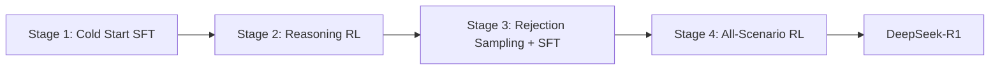

本記事は [DeepSeek-R1: Incentivizing Reasoning Capability in LLMs via Reinforcement Learning](https://arxiv.org/abs/2501.12948) の解説記事です。

## 論文概要（Abstract）

DeepSeek-R1は、強化学習（RL）のみでLLMの推論能力を獲得させることに成功した研究である。著者らはまずDeepSeek-R1-Zeroとして、SFTを一切使わず純粋なRL（GRPO）だけでベースモデルを学習させ、モデルが自発的にChain-of-Thought（CoT）推論を発展させることを示した。その後、Cold Start SFT → Reasoning RL → Rejection Sampling SFT → All-Scenario RLの4段階パイプラインにより、AIME 2024でOpenAI o1-1217と同等の79.8%（pass@1）を達成したと報告している。

この記事は [Zenn記事: GRPOとvLLMで構築するドメイン特化小規模推論モデルの強化学習パイプライン](https://zenn.dev/0h_n0/articles/b96ef4638d36a8) の深掘りです。

## 情報源

- **arXiv ID**: 2501.12948
- **URL**: [https://arxiv.org/abs/2501.12948](https://arxiv.org/abs/2501.12948)
- **著者**: DeepSeek-AI
- **発表年**: 2025
- **分野**: cs.CL, cs.AI, cs.LG

## 背景と動機（Background & Motivation）

OpenAI o1の登場により、LLMの「推論時計算（test-time computation）」を増やすことで複雑な問題を解く能力が注目を集めた。しかし、o1の学習手法は非公開であり、オープンな再現研究が求められていた。

DeepSeek-R1の著者らは2つの問いに取り組んだ。第一に、SFTなしの純粋なRLだけでLLMが推論能力を獲得できるか（DeepSeek-R1-Zero）。第二に、多段階パイプラインにより品質と汎用性を両立できるか（DeepSeek-R1）。さらに、大規模モデルの推論能力を小規模モデルに蒸留できるかも検証している。

## 主要な貢献（Key Contributions）

- **貢献1**: SFTなしの純粋RL（GRPO）だけで推論能力が創発することの実証（DeepSeek-R1-Zero）。自己検証・振り返り等のメタ認知的行動が自然に出現した
- **貢献2**: Cold Start → Reasoning RL → Rejection Sampling SFT → All-Scenario RLの4段階パイプラインの設計。AIME 2024でo1-1217と同等のpass@1 79.8%を達成
- **貢献3**: 大規模モデルから小規模モデルへの蒸留の有効性実証。DeepSeek-R1-Distill-Qwen-32BがAIME 2024で72.6%を達成し、同規模の直接RL学習を大幅に上回った

## 技術的詳細（Technical Details）

### 4段階トレーニングパイプライン



### Stage 1: Cold Start SFT

純粋RLの初期不安定性を解消するため、少量の高品質CoTデータでベースモデルをファインチューニングする。

- **データ**: 数千件のlong CoTサンプル。DeepSeek-R1-Zeroの出力を人間が読みやすい形式に整理したもの
- **フォーマット**: `|special_token|<reasoning_process>|special_token|<summary>` 形式
- **目的**: RL開始前にフォーマットの一貫性と言語統一性を確保

### Stage 2: Reasoning-Oriented RL（GRPO）

推論能力を大幅に向上させるフェーズ。GRPOを使用し、ルールベース報酬で学習する。

**報酬関数の設計**（3種類の報酬を組み合わせ）:

$$
r_{\text{total}} = r_{\text{accuracy}} + r_{\text{format}} + r_{\text{language}}
$$

- **正確性報酬** $r_{\text{accuracy}}$: 数学は最終回答の正誤判定、コードはテストケース通過率
- **フォーマット報酬** $r_{\text{format}}$: `<think>...</think>` タグ内で推論を行い、その外で最終回答を出す形式への準拠度
- **言語一貫性報酬** $r_{\text{language}}$: CoTと回答が同一言語であることを要求

**対象タスク**: 数学、コーディング、科学、論理推論など、答えの正誤が明確に検証できるタスクに限定。

### Stage 3: Rejection Sampling + SFT

Stage 2のRLチェックポイントから大量サンプルを生成し、高品質なものを選別して全タスク対応のSFTを行う。

- **推論データ**: RLチェックポイントからrejection samplingで約600,000件収集
- **非推論データ**: DeepSeek-V3生成の一般タスクデータ約200,000件
- **合計**: 約800,000件で2エポックSFT

### Stage 4: All-Scenario RL + RLHF

最終的なアライメントフェーズ。推論タスクにはルールベース報酬（GRPO）、一般タスクにはreward modelベースのRLHF、有害コンテンツ抑制にはsafety報酬を組み合わせる。

### GRPOの具体的な適用方法

DeepSeek-R1におけるGRPOの目的関数は以下の通りである：

$$
\mathcal{J}_{\text{GRPO}}(\theta) = \mathbb{E}\left[ \frac{1}{G} \sum_{i=1}^G \frac{1}{|o_i|} \sum_{t=1}^{|o_i|} \left( \min\left( r_{i,t}(\theta)\, \hat{A}_i,\ \text{clip}(r_{i,t}(\theta), 1-\varepsilon, 1+\varepsilon)\, \hat{A}_i \right) - \beta\, D_{\text{KL}} \right) \right]
$$

ここで、
- $G$: グループサイズ（各プロンプトに対する生成数）
- $\hat{A}_i = \frac{r_i - \text{mean}(\mathbf{r})}{\text{std}(\mathbf{r})}$: グループ正規化アドバンテージ
- $r_{i,t}(\theta)$: 重要度サンプリング比率
- $\varepsilon$: クリッピング閾値
- $\beta$: KLペナルティ係数

Criticモデルが不要なため、671B MoEモデル（DeepSeek-V3-Base）のような大規模モデルにも現実的に適用可能である。

### DeepSeek-R1-Zero: 純粋RLの知見

SFTなしの純粋GRPO学習で著者らが観察した創発的行動：

1. **思考時間の自然な延長**: 学習が進むにつれ、モデルが自発的により長いCoTを生成。問題の難しさに応じて推論長を動的に調整
2. **自己検証（Self-verification）**: 明示的な指示なしに「Wait, let me reconsider...」のような再検討パターンが出現
3. **振り返り（Reflection）**: 計算結果を自発的にチェックする行動が観察

ただし、R1-Zeroには言語混合（英語推論中に中国語が混入）やフォーマット不安定性の課題があり、これがCold Start SFTを導入した動機となっている。

## 実装のポイント（Implementation）

### SFT→GRPOの2段階パイプライン（実践版）

Zenn記事で紹介されているTRL + vLLMでの実装に対応付けると、DeepSeek-R1のパイプラインは以下のように簡略化できる：

```python
from trl import SFTConfig, SFTTrainer, GRPOConfig, GRPOTrainer

# Stage 1: Cold Start SFT
sft_config = SFTConfig(
    output_dir="./cold_start_sft",
    learning_rate=2e-5,
    num_train_epochs=3,
    per_device_train_batch_size=4,
    max_length=768,
    bf16=True,
)
sft_trainer = SFTTrainer(
    model="Qwen/Qwen2.5-3B-Instruct",
    args=sft_config,
    train_dataset=cold_start_dataset,  # 数千件のCoTデータ
)
sft_trainer.train()
sft_trainer.save_model("./cold_start_model")

# Stage 2: Reasoning RL with GRPO
grpo_config = GRPOConfig(
    output_dir="./reasoning_grpo",
    learning_rate=5e-6,
    num_generations=8,
    temperature=0.7,
    use_vllm=True,
    vllm_mode="colocate",
    vllm_gpu_memory_utilization=0.7,
    max_grad_norm=0.5,
    bf16=True,
)
grpo_trainer = GRPOTrainer(
    model="./cold_start_model",
    args=grpo_config,
    train_dataset=reasoning_dataset,
    reward_funcs=[accuracy_reward, format_reward],
)
grpo_trainer.train()
```

### 報酬設計のポイント

DeepSeek-R1の報酬設計から学べる実践的知見：

1. **ルールベース報酬を優先**: 報酬モデルよりもルールベース報酬の方が報酬ハッキングを回避しやすい
2. **フォーマット報酬は独立に**: 正確性とフォーマットの報酬を分離することで、学習初期のフォーマット崩壊を防止
3. **言語一貫性報酬**: 多言語モデルでは言語混合を防ぐための明示的な報酬が有効

## Production Deployment Guide

### AWS実装パターン（コスト最適化重視）

| 規模 | 月間リクエスト | 推奨構成 | 月額コスト | 主要サービス |
|------|--------------|---------|-----------|------------|
| **Small** | ~3,000 | Serverless | $50-150 | Lambda + Bedrock + DynamoDB |
| **Medium** | ~30,000 | Hybrid | $300-800 | Lambda + ECS Fargate + ElastiCache |
| **Large** | 300,000+ | Container | $2,000-5,000 | EKS + Karpenter + EC2 Spot |

**コスト試算の注意事項**: 上記は2026年3月時点のAWS ap-northeast-1料金に基づく概算値です。最新料金は [AWS料金計算ツール](https://calculator.aws/) で確認してください。

### Terraformインフラコード

**Small構成 (Serverless)**

```hcl
module "vpc" {
  source  = "terraform-aws-modules/vpc/aws"
  version = "~> 5.0"
  name    = "r1-inference-vpc"
  cidr    = "10.0.0.0/16"
  azs     = ["ap-northeast-1a", "ap-northeast-1c"]
  private_subnets = ["10.0.1.0/24", "10.0.2.0/24"]
  enable_nat_gateway   = false
  enable_dns_hostnames = true
}

resource "aws_iam_role" "lambda_bedrock" {
  name = "r1-lambda-bedrock-role"
  assume_role_policy = jsonencode({
    Version = "2012-10-17"
    Statement = [{
      Action = "sts:AssumeRole", Effect = "Allow"
      Principal = { Service = "lambda.amazonaws.com" }
    }]
  })
}

resource "aws_iam_role_policy" "bedrock_invoke" {
  role = aws_iam_role.lambda_bedrock.id
  policy = jsonencode({
    Version = "2012-10-17"
    Statement = [{
      Effect = "Allow"
      Action = ["bedrock:InvokeModel"]
      Resource = "arn:aws:bedrock:ap-northeast-1::foundation-model/anthropic.claude-*"
    }]
  })
}

resource "aws_lambda_function" "r1_handler" {
  filename      = "lambda.zip"
  function_name = "r1-reasoning-handler"
  role          = aws_iam_role.lambda_bedrock.arn
  handler       = "index.handler"
  runtime       = "python3.12"
  timeout       = 120
  memory_size   = 1024
}

resource "aws_dynamodb_table" "reasoning_cache" {
  name         = "r1-reasoning-cache"
  billing_mode = "PAY_PER_REQUEST"
  hash_key     = "prompt_hash"
  attribute { name = "prompt_hash"; type = "S" }
  ttl { attribute_name = "expire_at"; enabled = true }
}
```

**Large構成 (Container): EKS + Karpenter**

```hcl
module "eks" {
  source  = "terraform-aws-modules/eks/aws"
  version = "~> 20.0"
  cluster_name    = "r1-training-cluster"
  cluster_version = "1.31"
  vpc_id     = module.vpc.vpc_id
  subnet_ids = module.vpc.private_subnets
  cluster_endpoint_public_access = true
  enable_cluster_creator_admin_permissions = true
}

resource "kubectl_manifest" "karpenter_provisioner" {
  yaml_body = <<-YAML
    apiVersion: karpenter.sh/v1alpha5
    kind: Provisioner
    metadata:
      name: r1-spot-provisioner
    spec:
      requirements:
        - key: karpenter.sh/capacity-type
          operator: In
          values: ["spot"]
        - key: node.kubernetes.io/instance-type
          operator: In
          values: ["g5.xlarge", "g5.2xlarge", "g5.4xlarge"]
      limits:
        resources:
          cpu: "64"
          memory: "256Gi"
      ttlSecondsAfterEmpty: 30
  YAML
}
```

### 運用・監視設定

```python
import boto3

cloudwatch = boto3.client('cloudwatch')

cloudwatch.put_metric_alarm(
    AlarmName='r1-bedrock-token-spike',
    ComparisonOperator='GreaterThanThreshold',
    EvaluationPeriods=1,
    MetricName='TokenUsage',
    Namespace='AWS/Bedrock',
    Period=3600, Statistic='Sum',
    Threshold=500000,
    ActionsEnabled=True,
    AlarmActions=['arn:aws:sns:ap-northeast-1:123456789:cost-alerts'],
    AlarmDescription='Bedrockトークン使用量異常'
)
```

### コスト最適化チェックリスト

- [ ] Spot Instances優先（最大90%削減）
- [ ] Reserved Instances: 1年コミットで72%削減
- [ ] Bedrock Batch API: 50%割引（非リアルタイム処理）
- [ ] Prompt Caching: 30-90%削減
- [ ] Lambda: メモリ最適化（CloudWatch Insights）
- [ ] EKS: アイドル時スケールダウン（Karpenter ttlSecondsAfterEmpty=30）
- [ ] モデル選択: Haiku（開発） / Sonnet（本番複雑タスク）
- [ ] AWS Budgets: 月額予算80%で警告
- [ ] Cost Anomaly Detection: 自動異常検知
- [ ] タグ戦略: 環境別・プロジェクト別
- [ ] S3ライフサイクル: 30日で古いキャッシュ削除
- [ ] 開発環境: 夜間停止
- [ ] CloudWatch アラーム: トークンスパイク検知
- [ ] 日次コストレポート: SNS/Slack通知
- [ ] max_tokens設定: 過剰生成防止
- [ ] Savings Plans検討: 柔軟性の高いCompute Savings Plans
- [ ] 未使用リソース: Trusted Advisor活用
- [ ] ライフサイクルポリシー: ECRイメージ自動削除
- [ ] VPCエンドポイント: Bedrock/S3へのNAT Gateway不使用
- [ ] CloudFront: 静的コンテンツ配信でオリジン負荷軽減

## 実験結果（Results）

### メインベンチマーク（論文Table 5付近より）

| ベンチマーク | DeepSeek-R1 | OpenAI o1-1217 | 備考 |
|-------------|-------------|----------------|------|
| AIME 2024 (Pass@1) | **79.8%** | 79.2% | 数学コンペ |
| MATH-500 | **97.3%** | 96.4% | 高校数学 |
| Codeforces Rating | **2029** | 1891 | 競技プログラミング |
| GPQA Diamond | 71.5% | **75.7%** | 科学推論 |
| LiveCodeBench | **65.9%** | 63.4% | コーディング |
| SWE-bench Verified | **49.2%** | 48.9% | ソフトウェアエンジニアリング |

数学・コーディングでo1-1217と同等以上の性能を達成している。科学推論（GPQA Diamond）ではo1にやや劣る。

### 蒸留モデルの性能

| モデル | AIME 2024 | MATH-500 |
|--------|-----------|----------|
| DeepSeek-R1-Distill-Qwen-7B | 55.5% | 92.8% |
| DeepSeek-R1-Distill-Qwen-14B | 69.7% | 93.9% |
| DeepSeek-R1-Distill-Qwen-32B | **72.6%** | 94.3% |
| QwQ-32B-Preview（比較） | 50.0% | 90.6% |
| OpenAI o1-mini（比較） | 63.6% | 90.0% |

蒸留モデルは同規模の直接RL学習を大幅に上回り、32Bモデルでo1-miniを凌駕する性能を達成している。著者らは、小規模モデルへの直接RLよりも大規模モデルからの蒸留の方が効率的かつ高性能であると結論づけている。

## 実運用への応用（Practical Applications）

DeepSeek-R1のパイプラインは、ドメイン特化の推論モデル構築に直接応用可能である：

- **Cold Start SFTデータの収集**: 既存の大規模推論モデルの出力をフィルタリングして高品質なCoTデータを収集
- **ルールベース報酬の設計**: 正誤判定が自動化できるタスク（医療QA、コード生成、数学）に特に有効
- **蒸留パイプライン**: 大規模モデルで学習した推論能力を小規模モデルに効率的に転写可能

## 関連研究（Related Work）

- **DeepSeekMath (Shao et al., 2024)**: GRPOを最初に提案した研究。DeepSeek-R1はこのアルゴリズムを大規模モデルと多段階パイプラインに拡張した
- **OpenAI o1 (2024)**: 推論時計算を増やすことで複雑な問題を解くアプローチ。手法は非公開だが、DeepSeek-R1が同等性能をオープンソースで達成
- **DAPO (Yu et al., 2025)**: GRPOの4つの欠陥を修正し、AIME 2024で50点（32Bモデル）を達成した後続研究

## まとめと今後の展望

DeepSeek-R1は、GRPOを核とした多段階パイプラインによりOpenAI o1に匹敵する推論能力を実現した。特に重要な知見として、(1) 純粋RLだけでも推論能力は創発するがCold Start SFTにより品質が大幅に向上すること、(2) ルールベース報酬が報酬モデルより有効であること、(3) 大規模モデルからの蒸留が小規模モデルの直接RLより効果的であること、が挙げられる。

実務的には、Zenn記事で紹介されているTRL + vLLMの組み合わせにCold Start SFTを追加した2段階パイプラインが、ドメイン特化モデル構築の実践的なスタートポイントとなる。

## 参考文献

- **arXiv**: [https://arxiv.org/abs/2501.12948](https://arxiv.org/abs/2501.12948)
- **Code**: [https://github.com/deepseek-ai/DeepSeek-R1](https://github.com/deepseek-ai/DeepSeek-R1)
- **Related Zenn article**: [https://zenn.dev/0h_n0/articles/b96ef4638d36a8](https://zenn.dev/0h_n0/articles/b96ef4638d36a8)
