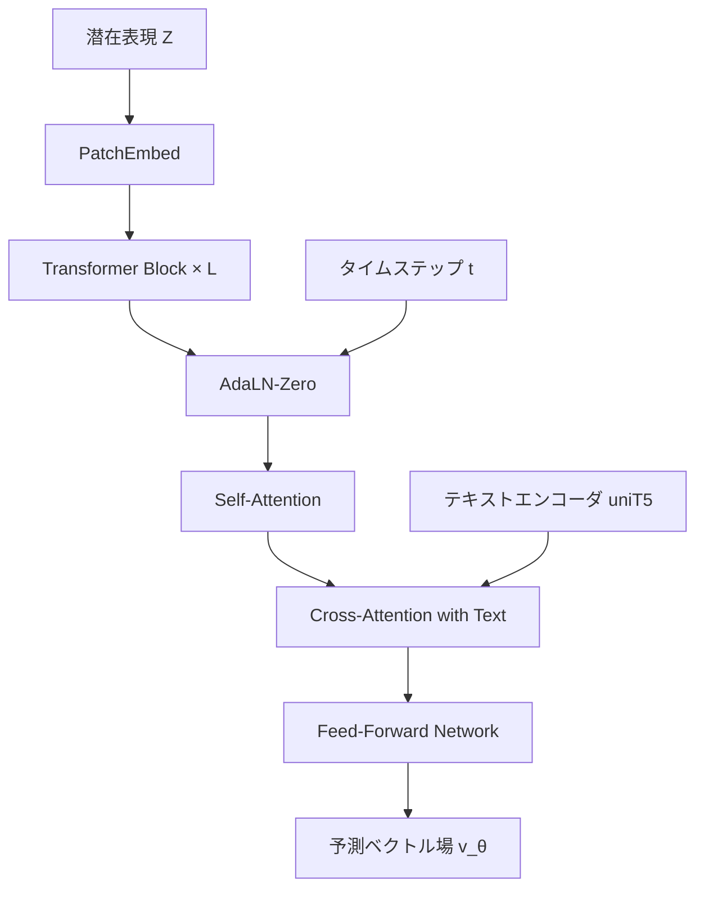

本記事は [arXiv:2503.03049 "Wan: Open and Advanced Large-Scale Video Generative Models"](https://arxiv.org/abs/2503.03049) の解説記事です。

## 論文概要（Abstract）

Wanは、Alibaba（Wan-Video）が開発したオープンソースの大規模動画生成モデル群である。テキストから動画（T2V）および画像から動画（I2V）の両方をサポートし、1.3Bパラメータの軽量版と14Bパラメータの高品質版を公開している。著者らは、15億本の動画と100億枚の画像から構成される大規模データセットで訓練を行い、VBench、EvalCrafter、ChronoMagicBenchなどのベンチマークで商用モデル（Sora、Kling等）を含む既存手法を上回る性能を報告している。

この記事は [Zenn記事: ローカル動画生成AI 2026年版GPU別完全ガイド─Wan2.2からLTX-2まで](https://zenn.dev/0h_n0/articles/762f0c52ad513a) の深掘りです。

## 情報源

- **arXiv ID**: 2503.03049
- **URL**: [https://arxiv.org/abs/2503.03049](https://arxiv.org/abs/2503.03049)
- **著者**: Wan Team (Alibaba Group) et al.
- **発表年**: 2025
- **分野**: cs.CV, cs.AI

## 背景と動機（Background & Motivation）

動画生成AIは2024年以降急速に発展し、Sora（OpenAI）、Kling（Kuaishou）、Runway Gen-3などの商用モデルが高品質な動画を生成できるようになった。しかし、これらのモデルはクローズドソースであり、モデルの重みやアーキテクチャの詳細が公開されていない。この状況はオープンソースコミュニティと商用モデルとの間に品質ギャップを生んでいた。

著者らはこの課題に対して、商用モデルに匹敵またはそれを上回るオープンソースモデルの開発を目指した。特に以下の3つの技術的課題に取り組んでいる：（1）動画の時間的・空間的冗長性を効率的に圧縮するVAE設計、（2）長時間の時間的一貫性を維持するDiffusion Transformer設計、（3）多言語テキストプロンプトへの忠実な対応。

## 主要な貢献（Key Contributions）

- **貢献1**: 5次元因果VAE（Causal 3D VAE）の提案。時間軸4倍、空間軸8×8倍の高圧縮率を達成しつつ、再構成品質を維持
- **貢献2**: Flow Matching（Rectified Flow）ベースのDiffusion Transformerアーキテクチャの開発。従来のDDPMベースの拡散過程よりも訓練効率と生成品質を向上
- **貢献3**: uniT5と呼ばれる多言語テキストエンコーダの導入。中国語と英語の両方で高品質なテキスト-動画アライメントを実現
- **貢献4**: 1.3Bと14Bの2つのモデルサイズを公開し、コンシューマGPUからハイエンドGPUまで幅広い環境に対応

## 技術的詳細（Technical Details）

### 5次元因果VAE（Causal 3D VAE）

Wanの動画圧縮には5次元因果VAE（5D Causal VAE）が採用されている。従来の画像生成モデルのVAEが空間2次元のみを圧縮するのに対し、このVAEは時間軸を含む3次元すべてを圧縮する。

入力動画テンソル $\mathbf{X} \in \mathbb{R}^{T \times H \times W \times 3}$ に対して、潜在表現 $\mathbf{Z}$ への圧縮は以下の比率で行われる：

$$
\mathbf{Z} = \text{Encode}(\mathbf{X}) \in \mathbb{R}^{\frac{T}{4} \times \frac{H}{8} \times \frac{W}{8} \times C}
$$

ここで、
- $T$: 入力フレーム数
- $H, W$: 空間解像度（高さ、幅）
- $C$: 潜在チャネル数（論文では16）
- 圧縮比: 時間4倍 × 空間8×8倍 = 合計256倍

「因果（Causal）」とは、エンコード時に各フレームが過去のフレームのみを参照できるという制約を意味する。これにより、自己回帰的なフレーム生成が可能になり、ストリーミング推論にも対応できる設計となっている。

```python
import torch
import torch.nn as nn

class CausalConv3d(nn.Module):
    """因果3D畳み込み: 時間軸で未来のフレームを参照しない

    Args:
        in_channels: 入力チャネル数
        out_channels: 出力チャネル数
        kernel_size: カーネルサイズ (T, H, W)
    """
    def __init__(
        self,
        in_channels: int,
        out_channels: int,
        kernel_size: tuple[int, int, int] = (3, 3, 3),
    ):
        super().__init__()
        self.temporal_pad = kernel_size[0] - 1  # 因果パディング
        self.conv = nn.Conv3d(
            in_channels, out_channels, kernel_size,
            padding=(0, kernel_size[1] // 2, kernel_size[2] // 2)
        )

    def forward(self, x: torch.Tensor) -> torch.Tensor:
        """因果パディングを適用して3D畳み込みを実行

        Args:
            x: 入力テンソル (B, C, T, H, W)

        Returns:
            出力テンソル (B, C_out, T, H, W)
        """
        # 時間軸の先頭にゼロパディング（未来を参照しない）
        x = nn.functional.pad(x, (0, 0, 0, 0, self.temporal_pad, 0))
        return self.conv(x)
```

### Flow Matching（Rectified Flow）ベースの訓練

Wanの拡散過程にはDDPM（Denoising Diffusion Probabilistic Models）ではなく、Flow Matching（Rectified Flow）が採用されている。Flow Matchingは、データ分布 $q(\mathbf{x}_0)$ からノイズ分布 $\mathcal{N}(\mathbf{0}, \mathbf{I})$ への直線的な輸送経路を学習する。

時刻 $t \in [0, 1]$ における中間状態は以下で定義される：

$$
\mathbf{x}_t = (1 - t) \mathbf{x}_0 + t \boldsymbol{\epsilon}, \quad \boldsymbol{\epsilon} \sim \mathcal{N}(\mathbf{0}, \mathbf{I})
$$

モデルが学習するベクトル場 $\mathbf{v}_\theta(\mathbf{x}_t, t)$ の訓練目的関数は：

$$
\mathcal{L}(\theta) = \mathbb{E}_{t, \mathbf{x}_0, \boldsymbol{\epsilon}} \left[ \left\| \mathbf{v}_\theta(\mathbf{x}_t, t) - (\boldsymbol{\epsilon} - \mathbf{x}_0) \right\|^2 \right]
$$

ここで、
- $\mathbf{x}_0$: 元のデータ（VAEの潜在表現）
- $\boldsymbol{\epsilon}$: 標準正規ノイズ
- $\mathbf{v}_\theta$: ニューラルネットワークが予測するベクトル場
- $t$: 一様分布 $\mathcal{U}(0, 1)$ からサンプリングされるタイムステップ

DDPMとの主な違いは、Flow Matchingが直線的な補間経路を使用するため、推論時のステップ数が少なくて済む点である。著者らの実験では、20ステップ程度で高品質な動画が生成できると報告されている。

### Diffusion Transformer（DiT）アーキテクチャ

WanのバックボーンはDiffusion Transformer（DiT）であり、U-Netではなくpure Transformerを使用する。入力となる潜在表現は以下のようにトークン列に変換される：

$$
\text{tokens} = \text{PatchEmbed}(\mathbf{Z}) \in \mathbb{R}^{N \times D}
$$

ここで $N = \frac{T}{4} \times \frac{H}{8p} \times \frac{W}{8p}$ はトークン数（$p$はパッチサイズ）、$D$はモデル次元である。

各Transformerブロックは以下の構成を持つ：

1. **Self-Attention**: 動画トークン間の空間的・時間的関係を捕捉
2. **Cross-Attention**: テキストエンコーダの出力と動画トークンのアライメント
3. **Feed-Forward Network**: 非線形変換
4. **Adaptive Layer Normalization（AdaLN）**: タイムステップ $t$ に条件付けされた正規化



### Wan 2.2のMoE（Mixture-of-Experts）アーキテクチャ

Wan 2.2（2025年7月公開）では、Mixture-of-Experts（MoE）アーキテクチャが導入された。A14Bモデルでは、拡散過程のノイズレベルに応じて2つのエキスパートが切り替わる：

- **高ノイズエキスパート**: 拡散の初期段階で動作し、全体的なレイアウトと構図を決定
- **低ノイズエキスパート**: 拡散の後期段階で動作し、テクスチャやディテールの精緻化を担当

各エキスパートは約14Bパラメータを持ち、合計では約27Bパラメータとなるが、推論時にはSNR（Signal-to-Noise Ratio）閾値に基づいて片方のエキスパートのみがアクティブになるため、実効的な計算量は14Bパラメータ相当に抑えられる：

$$
\mathbf{v}_\theta(\mathbf{x}_t, t) = \begin{cases}
\mathbf{v}_{\theta_{\text{high}}}(\mathbf{x}_t, t) & \text{if } \text{SNR}(t) < \tau \\
\mathbf{v}_{\theta_{\text{low}}}(\mathbf{x}_t, t) & \text{if } \text{SNR}(t) \geq \tau
\end{cases}
$$

ここで $\tau$ はSNR閾値、$\text{SNR}(t) = \frac{(1-t)^2}{t^2}$ はFlow Matchingにおける時刻 $t$ でのSNRである。

## 実装のポイント（Implementation）

### VRAM使用量とモデル選択

| モデル | パラメータ数 | FP16 VRAM | FP8 VRAM | GGUF Q5 VRAM |
|--------|-------------|-----------|----------|-------------|
| Wan 1.3B | 1.3B | 約4GB | 約2.5GB | 約2GB |
| Wan 14B | 14B | 約28GB | 約14GB | 約10GB |
| Wan A14B (MoE) | 27B (14B active) | 約28GB | 約14GB | 約10GB |

RTX 3090（24GB）でWan 14BをFP16で実行するにはVRAMが不足するため、GGUF量子化（Q5_K_M推奨）またはFP8量子化が必須である。RTX 4090ではFP8対応により、量子化による品質低下を最小限に抑えつつ実行可能となる。

### ComfyUIでの推論設定

```python
# ComfyUI Wan2.2ワークフローの主要パラメータ
# 参考: https://docs.comfy.org/tutorials/video/wan/wan2_2

inference_config = {
    "model": "wan2.2_t2v_14B",
    "vae": "wan_causal_vae",
    "text_encoder": "uniT5_xxl",
    "clip_encoder": "open_clip_vit_h",
    "scheduler": "euler",
    "num_inference_steps": 20,    # Flow Matchingでは20で十分
    "guidance_scale": 5.0,        # CFGスケール
    "resolution": (832, 480),     # 480p
    "num_frames": 81,             # 約5秒（16fps）
    "fps": 16,
}
```

### 量子化時の注意点

GGUF量子化を使用する場合、以下の品質低下が発生する：

1. **テクスチャの平滑化**: 微細なディテール（髪の毛、布の質感）が失われる
2. **色の飽和度低下**: 鮮やかな色がやや薄くなる
3. **エッジのぼやけ**: Q4以下の量子化で顕著に発生

著者らの報告では、FP8量子化はFP16比で知覚品質の低下がほぼない一方、GGUF Q4_K以下では目視で品質差が確認できるとされている。

## 実験結果（Results）

著者らはVBench、EvalCrafter、ChronoMagicBenchの3つのベンチマークで評価を実施している。

**VBenchスコア比較**（論文Table 3より）:

| モデル | Total Score | Subject Consistency | Motion Smoothness | Aesthetic Quality |
|--------|-------------|--------------------|--------------------|-------------------|
| Wan-T2V-14B | 84.7% | 96.8% | 98.5% | 62.1% |
| HunyuanVideo | 82.3% | 95.2% | 97.8% | 60.5% |
| CogVideoX-5B | 81.6% | 94.1% | 97.2% | 59.3% |
| Sora（推定） | 83.5% | - | - | - |

著者らは、Wan-T2V-14BがVBench Total Scoreで84.7%を達成し、オープンソースモデルの中で最高スコアであると主張している。特にSubject Consistency（被写体の一貫性）とMotion Smoothness（動きの滑らかさ）で高いスコアを記録している。

ただし、Aesthetic Quality（美的品質）は62.1%と、他の指標と比較して低い。これは動画生成モデル全般に共通する課題であり、静止画の美的品質と動画としての時間的一貫性のトレードオフを示唆している。

## 実運用への応用（Practical Applications）

Wanモデルは以下の実運用シナリオに適している：

**コンテンツ制作パイプライン**: マーケティング動画やSNSコンテンツの素材生成。1.3Bモデルを使った高速プロトタイピング後、14Bモデルで高品質版を生成するワークフローが有効。

**LoRAファインチューニング**: Apache 2.0ライセンスのため商用利用が可能。特定のブランドスタイルやキャラクターに合わせたLoRA適用が可能であり、AMD ROCmブログでは単一GPU環境でのファインチューニング手法が公開されている。

**スケーリング戦略**: 1.3Bモデルはバッチ処理に適しており、複数リクエストの並列処理が可能。14Bモデルは品質重視の単一リクエスト処理に適している。コスト効率を考慮すると、用途に応じたモデルサイズの使い分けが重要である。

**制約事項**: 最大12秒（14Bモデル）の制限があり、それを超える長尺動画には別途FramePackなどの手法との組み合わせが必要。また、生成速度はRTX 4090でも480p・5秒の動画に約4分を要するため、リアルタイム用途には不向きである。

## 関連研究（Related Work）

- **Sora (OpenAI, 2024)**: 商用クローズドソースモデルの代表。WanはSoraと同等以上の性能をオープンソースで実現することを目指している
- **HunyuanVideo (Tencent, 2024)**: Dual-stream Hybrid Transformerアーキテクチャを採用。Wanとは異なるテキストエンコーダ（MLLM）を使用
- **LTX-Video (Lightricks, 2024)**: リアルタイム推論に特化した高圧縮VAE設計。Wanより圧縮率が高いが、細部の品質ではWanが優位
- **CogVideoX (Zhipu AI, 2024)**: Expert Transformer（エキスパート適応LayerNorm）を採用。WanのMoEとは異なる「エキスパート」概念
- **FramePack (Zhang et al., 2025)**: HunyuanVideoベースの定長コンテキスト圧縮。WanのVAEとは直交する最適化手法で、組み合わせて使用可能

## まとめと今後の展望

Wanは2025-2026年時点でオープンソース動画生成モデルの基準を確立した。5D因果VAE、Flow MatchingベースDiT、MoEアーキテクチャの3つの技術的柱により、商用モデルに匹敵する品質をApache 2.0ライセンスで提供している。

今後の発展として、Wan 2.6（2025年12月リリース）では720p〜1080pでの15秒動画生成やマルチショットストーリーテリングが追加されており、モデルの長尺化・高解像度化が進んでいる。また、NVFP4/NVFP8量子化との組み合わせにより、RTX 5090環境での高速推論も可能になっている。ローカル動画生成AIの選択肢として、用途に応じたモデルサイズ・量子化レベルの選択が実運用上の鍵となる。

## 参考文献

- **arXiv**: [https://arxiv.org/abs/2503.03049](https://arxiv.org/abs/2503.03049)
- **Code**: [https://github.com/Wan-Video/Wan2.1](https://github.com/Wan-Video/Wan2.1)
- **Wan 2.2**: [https://github.com/Wan-Video/Wan2.2](https://github.com/Wan-Video/Wan2.2)
- **Related Zenn article**: [https://zenn.dev/0h_n0/articles/762f0c52ad513a](https://zenn.dev/0h_n0/articles/762f0c52ad513a)
