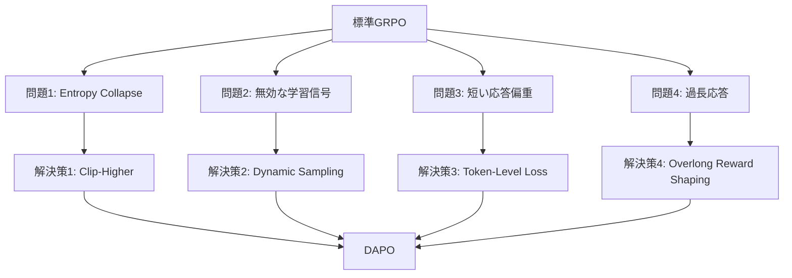

本記事は [DAPO: An Open-Source LLM Reinforcement Learning System at Scale](https://arxiv.org/abs/2503.12061) の解説記事です。

## 論文概要（Abstract）

DAPOは、GRPOベースの大規模LLM強化学習における4つの実践的欠陥を特定し、それぞれに対する修正手法を提案した研究である。著者ら（ByteDance Seed）は、Clip-Higher（非対称クリッピング）、Dynamic Sampling（動的サンプリング）、Token-Level Loss（トークンレベル損失）、Overlong Reward Shaping（過長応答ペナルティ）の4技術を組み合わせることで、Qwen2.5-32BベースモデルでAIME 2024のpass@1スコア50点を達成したと報告している。これはDeepSeek-R1-Zero-32Bの47点を上回り、同規模オープンソースモデルの最高水準である。

この記事は [Zenn記事: GRPOとvLLMで構築するドメイン特化小規模推論モデルの強化学習パイプライン](https://zenn.dev/0h_n0/articles/b96ef4638d36a8) の深掘りです。

## 情報源

- **arXiv ID**: 2503.12061
- **URL**: [https://arxiv.org/abs/2503.12061](https://arxiv.org/abs/2503.12061)
- **著者**: Qiying Yu, Zheng Zhang, Ruofei Zhu et al. (ByteDance Seed)
- **発表年**: 2025
- **分野**: cs.CL, cs.AI, cs.LG

## 背景と動機（Background & Motivation）

DeepSeek-R1の成功によりGRPOベースのRL学習が注目を集めているが、大規模適用（32B以上のモデル、数千ステップの学習）では複数の技術的問題が顕在化する。著者らはGRPOの本番運用で以下の4つの問題に直面したと報告している：

1. **Entropy Collapse**: 学習が進むにつれ出力の多様性が失われ、同じパターンの応答ばかり生成される
2. **Length Exploitation**: モデルが異常に長い応答を生成し、報酬ハッキングの一形態となる
3. **無効な学習信号**: 全正解または全不正解のグループでは勾配がゼロになり、計算が無駄になる
4. **短い応答への偏り**: シーケンスレベルの損失正規化が長い推論チェーンを不利にする

これらの問題は小規模な実験では見えにくいが、大規模学習では深刻な性能劣化を引き起こす。

## 主要な貢献（Key Contributions）

- **貢献1**: GRPOの大規模運用における4つの具体的な失敗パターンの特定と分析
- **貢献2**: 各問題に対する独立した修正手法（Clip-Higher、Dynamic Sampling、Token-Level Loss、Overlong Reward Shaping）の提案
- **貢献3**: 32BモデルでAIME 2024 pass@1スコア50点を達成（DeepSeek-R1-Zero-32Bの47点を上回る）
- **貢献4**: システム全体のコード・モデル・データをオープンソース公開

## 技術的詳細（Technical Details）

### 4つの修正手法の全体像



### 1. Clip-Higher（非対称クリッピング）

**問題**: 標準GRPOのPPOクリッピングは対称的（$\varepsilon_{\text{low}} = \varepsilon_{\text{high}} = 0.2$）である。これにより、低確率トークン（モデルが苦手とするトークン）の確率上昇が制限され、探索空間が狭まる。結果としてentropy collapseが起き、出力の多様性が失われる。

**解決策**: クリッピングを非対称にする。

$$
\mathcal{L}_{\text{clip}} = \min\left( r_t(\theta) \hat{A}_t,\ \text{clip}(r_t(\theta),\ 1 - \varepsilon_{\text{low}},\ 1 + \varepsilon_{\text{high}}) \hat{A}_t \right)
$$

ここで、$\varepsilon_{\text{low}} = 0.2$（標準値を維持）、$\varepsilon_{\text{high}} = 0.28$（上限を拡大）。

**直感的な説明**: 低確率トークンの確率比率 $r_t(\theta)$ が1より大きくなる場合（= モデルがそのトークンを以前より高い確率で生成しようとする場合）、上限クリップ値を大きくすることで、より大きな確率上昇を許容する。これにより探索空間が広がり、entropy collapseが緩和される。

### 2. Dynamic Sampling（動的サンプリング）

**問題**: GRPOでは各プロンプトに対して $G$ 個の応答を生成し、グループ内で報酬を比較する。しかし、全応答が正解（全正解グループ）または全応答が不正解（全不正解グループ）の場合、アドバンテージの分散がゼロになり、勾配もゼロになる。

$$
\text{std}(\{r_1, \ldots, r_G\}) = 0 \implies \hat{A}_i = 0 \quad \forall i
$$

学習初期は簡単な問題で全正解、学習後期は難しい問題で全不正解が頻発し、有効な学習信号が減少する。

**解決策**: サンプリング後に全正解/全不正解のグループをフィルタリングし、有効な勾配が生じるプロンプトのみでバッチを構成する。

```python
def dynamic_sampling(
    prompts: list[str],
    policy: nn.Module,
    reward_fn: Callable,
    G: int = 8,
) -> list[dict]:
    """有効な学習信号を持つバッチのみを返す"""
    valid_batches = []
    for prompt in prompts:
        outputs = [policy.generate(prompt) for _ in range(G)]
        rewards = [reward_fn(prompt, o) for o in outputs]
        # 全正解・全不正解をフィルタ
        if len(set(rewards)) > 1:  # 報酬に差異がある場合のみ
            valid_batches.append({
                "prompt": prompt, "outputs": outputs, "rewards": rewards
            })
    return valid_batches
```

### 3. Token-Level Loss（トークンレベル損失正規化）

**問題**: 標準GRPOの損失はシーケンスレベルで正規化される。各応答の損失をトークン数で割った後、グループ内で平均を取る。この手法では長い応答と短い応答が同じ重みになり、長い推論チェーンを生成するインセンティブが低下する。

**標準GRPO（シーケンスレベル）**:

$$
\mathcal{L}_{\text{seq}} = \frac{1}{G} \sum_{i=1}^G \frac{1}{|o_i|} \sum_{t=1}^{|o_i|} \ell_{i,t}
$$

**DAPO（トークンレベル）**:

$$
\mathcal{L}_{\text{token}} = \frac{1}{\sum_{i=1}^G |o_i|} \sum_{i=1}^G \sum_{t=1}^{|o_i|} \ell_{i,t}
$$

トークンレベルではグループ内の全トークンに対してフラットに平均を取るため、長い応答のトークンがより多くの勾配を受け取る。これにより長い推論チェーンが適切に評価される。

### 4. Overlong Reward Shaping（過長応答ペナルティ）

**問題**: 大規模RL学習では、モデルが最大トークン長を超える応答を生成し始める。切り捨てられた応答の報酬が不完全になり、不安定な学習信号が発生する。

**解決策**: 最大長を超えた応答に段階的なペナルティを与える。

$$
r_{\text{shaped}}(o) = \begin{cases}
r(o) & \text{if } |o| \leq L_{\max} \\
-\alpha \cdot \frac{|o| - L_{\max}}{L_{\max}} & \text{if } |o| > L_{\max}
\end{cases}
$$

ここで $L_{\max}$ は最大出力長、$\alpha$ はペナルティ係数。急激な切り捨てではなく段階的な減衰を採用することで、分布の急変を防ぎ学習を安定させる。

## 実装のポイント（Implementation）

### 既存GRPO実装への統合

DAPOの4技術はそれぞれ独立しており、既存のGRPO実装に段階的に追加できる。

**Clip-Higherの実装**（TRL GRPOTrainerへの適用例）:

```python
def compute_clipped_loss(
    ratio: torch.Tensor,
    advantage: torch.Tensor,
    eps_low: float = 0.2,
    eps_high: float = 0.28,
) -> torch.Tensor:
    """非対称クリッピングによるGRPO損失"""
    clipped_ratio = torch.clamp(ratio, 1 - eps_low, 1 + eps_high)
    loss = -torch.min(ratio * advantage, clipped_ratio * advantage)
    return loss.mean()
```

**Token-Level Lossの実装**:

```python
def token_level_loss(
    per_token_losses: list[torch.Tensor],
) -> torch.Tensor:
    """トークンレベルで平均化された損失"""
    all_tokens = torch.cat(per_token_losses)
    return all_tokens.mean()  # フラットに平均
```

### 推奨ハイパーパラメータ

論文で使用されたハイパーパラメータ：

| パラメータ | 値 | 備考 |
|-----------|-----|------|
| $\varepsilon_{\text{low}}$ | 0.2 | 標準PPOと同じ |
| $\varepsilon_{\text{high}}$ | 0.28 | 上限を拡大 |
| グループサイズ $G$ | 8-16 | 大きいほどDynamic Samplingの効果増 |
| 過長ペナルティ $\alpha$ | タスク依存 | 数学では0.5程度 |

### 実装上の注意

- **$\varepsilon_{\text{high}}$ のチューニング**: データセット依存。数学以外のドメインでは再調整が必要。著者らは0.28をデフォルト値として報告しているが、Zenn記事で紹介されている医療QAなどでは異なる値が適切な可能性がある
- **Dynamic Samplingのコスト**: 全バッチ再サンプリングが最悪ケースで発生する。バッチサイズを大きめに設定し、フィルタリング後も十分なサンプルが残るようにする
- **Token-Level Lossの副作用**: 長い応答を優遇するため、冗長な出力が増える可能性がある。Overlong Reward Shapingと組み合わせることで緩和

## Production Deployment Guide

### AWS実装パターン（コスト最適化重視）

| 規模 | 月間リクエスト | 推奨構成 | 月額コスト | 主要サービス |
|------|--------------|---------|-----------|------------|
| **Small** | ~3,000 | Serverless | $50-150 | Lambda + Bedrock + DynamoDB |
| **Medium** | ~30,000 | Hybrid | $300-800 | Lambda + ECS Fargate + ElastiCache |
| **Large** | 300,000+ | Container | $2,000-5,000 | EKS + Karpenter + EC2 Spot |

**コスト試算の注意事項**: 上記は2026年3月時点のAWS ap-northeast-1料金に基づく概算値です。最新料金は [AWS料金計算ツール](https://calculator.aws/) で確認してください。

### Terraformインフラコード

**Small構成 (Serverless)**

```hcl
module "vpc" {
  source  = "terraform-aws-modules/vpc/aws"
  version = "~> 5.0"
  name    = "dapo-inference-vpc"
  cidr    = "10.0.0.0/16"
  azs     = ["ap-northeast-1a", "ap-northeast-1c"]
  private_subnets = ["10.0.1.0/24", "10.0.2.0/24"]
  enable_nat_gateway   = false
  enable_dns_hostnames = true
}

resource "aws_iam_role" "lambda_bedrock" {
  name = "dapo-lambda-bedrock-role"
  assume_role_policy = jsonencode({
    Version = "2012-10-17"
    Statement = [{
      Action = "sts:AssumeRole", Effect = "Allow"
      Principal = { Service = "lambda.amazonaws.com" }
    }]
  })
}

resource "aws_lambda_function" "dapo_handler" {
  filename      = "lambda.zip"
  function_name = "dapo-inference-handler"
  role          = aws_iam_role.lambda_bedrock.arn
  handler       = "index.handler"
  runtime       = "python3.12"
  timeout       = 60
  memory_size   = 1024
}

resource "aws_dynamodb_table" "cache" {
  name         = "dapo-prompt-cache"
  billing_mode = "PAY_PER_REQUEST"
  hash_key     = "prompt_hash"
  attribute { name = "prompt_hash"; type = "S" }
  ttl { attribute_name = "expire_at"; enabled = true }
}
```

**Large構成 (Container): EKS + Karpenter**

```hcl
module "eks" {
  source  = "terraform-aws-modules/eks/aws"
  version = "~> 20.0"
  cluster_name    = "dapo-training-cluster"
  cluster_version = "1.31"
  vpc_id     = module.vpc.vpc_id
  subnet_ids = module.vpc.private_subnets
  cluster_endpoint_public_access = true
  enable_cluster_creator_admin_permissions = true
}

resource "kubectl_manifest" "karpenter_provisioner" {
  yaml_body = <<-YAML
    apiVersion: karpenter.sh/v1alpha5
    kind: Provisioner
    metadata:
      name: dapo-spot-provisioner
    spec:
      requirements:
        - key: karpenter.sh/capacity-type
          operator: In
          values: ["spot"]
        - key: node.kubernetes.io/instance-type
          operator: In
          values: ["g5.xlarge", "g5.2xlarge"]
      limits:
        resources:
          cpu: "32"
          memory: "128Gi"
      ttlSecondsAfterEmpty: 30
  YAML
}

resource "aws_budgets_budget" "dapo_monthly" {
  name         = "dapo-monthly-budget"
  budget_type  = "COST"
  limit_amount = "5000"
  limit_unit   = "USD"
  time_unit    = "MONTHLY"
  notification {
    comparison_operator = "GREATER_THAN"
    threshold           = 80
    threshold_type      = "PERCENTAGE"
    notification_type   = "ACTUAL"
    subscriber_email_addresses = ["ops@example.com"]
  }
}
```

### 運用・監視設定

```python
import boto3

cloudwatch = boto3.client('cloudwatch')

cloudwatch.put_metric_alarm(
    AlarmName='dapo-bedrock-token-spike',
    ComparisonOperator='GreaterThanThreshold',
    EvaluationPeriods=1,
    MetricName='TokenUsage',
    Namespace='AWS/Bedrock',
    Period=3600, Statistic='Sum',
    Threshold=500000,
    ActionsEnabled=True,
    AlarmActions=['arn:aws:sns:ap-northeast-1:123456789:cost-alerts'],
    AlarmDescription='Bedrockトークン使用量異常'
)
```

### コスト最適化チェックリスト

- [ ] Spot Instances優先（最大90%削減）
- [ ] Reserved Instances: 1年コミットで72%削減
- [ ] Bedrock Batch API: 50%割引
- [ ] Prompt Caching: 30-90%削減
- [ ] Lambda メモリ最適化
- [ ] EKS アイドル時スケールダウン
- [ ] モデル選択: Haiku（開発）/ Sonnet（本番）
- [ ] AWS Budgets: 月額予算80%で警告
- [ ] Cost Anomaly Detection
- [ ] タグ戦略: 環境別・プロジェクト別
- [ ] S3ライフサイクル: 30日で削除
- [ ] 開発環境: 夜間停止
- [ ] CloudWatch アラーム
- [ ] 日次コストレポート
- [ ] max_tokens制限
- [ ] Savings Plans検討
- [ ] 未使用リソース削除
- [ ] ECRイメージ自動削除
- [ ] VPCエンドポイント活用
- [ ] CloudFront: 静的コンテンツ配信

## 実験結果（Results）

### AIME 2024メイン結果（論文の実験セクションより）

| モデル | AIME 2024 (pass@1) |
|--------|-------------------|
| **DAPO-32B** | **50** |
| DeepSeek-R1-Zero-32B | 47 |
| Light-R1-32B | 45 |
| Sky-T1-32B | 43 |
| Qwen2.5-32B-Instruct (SFT) | 16 |

### その他ベンチマーク

| ベンチマーク | DAPO-32B |
|-------------|----------|
| MATH500 | 91.4 |
| AMC | 85.3 |
| OlympiadBench | 63.8 |
| Minerva Math | 59.9 |
| AIME 2025 | 17 |

AIME 2025のスコア（17点）がAIME 2024（50点）と大きく乖離しており、汎化性能については追加検証が必要であると考えられる。

### アブレーション実験

著者らは4技術を1つずつ除いた実験を行い、以下の結果を報告している：

- **Clip-Higherなし**: 学習中にentropyが崩壊し、応答の多様性が失われる。後半の学習が停滞
- **Dynamic Samplingなし**: 計算効率が低下、有効な勾配が減少
- **Token-Level Lossなし**: 長い推論チェーンの生成が抑制される。AIME等の難問での性能低下
- **Overlong Reward Shapingなし**: 学習後半に不安定性が発生。過長応答が増加

## 実運用への応用（Practical Applications）

DAPOの4技術は、Zenn記事で紹介されているGRPOパイプラインの安定化に直接活用できる：

- **医療QAでEntropy Collapseが起きた場合**: Clip-Higherで $\varepsilon_{\text{high}}$ を0.28程度に設定
- **報酬が全く上昇しない場合**: Dynamic Samplingで無効なバッチをフィルタ
- **`<think>` タグ内の推論が短くなりすぎる場合**: Token-Level Lossで長い推論を適切に評価
- **出力が無限に長くなる場合**: Overlong Reward Shapingで段階的ペナルティ

## 関連研究（Related Work）

- **DeepSeekMath (Shao et al., 2024)**: GRPOを最初に提案。DAPOはこのアルゴリズムの本番運用上の欠陥を修正した
- **DeepSeek-R1 (DeepSeek-AI, 2025)**: GRPOを多段階パイプラインに組み込んだ研究。DAPOはR1-Zero相当のsingle-stage RLで同等以上の性能を目指す
- **veRL (ByteDance)**: DAPOの実装基盤。大規模RL学習のためのフレームワーク

## まとめと今後の展望

DAPOは、GRPOの大規模運用で遭遇する4つの実践的な問題（entropy collapse、無効な学習信号、短い応答偏重、過長応答）を特定し、それぞれに対する修正手法を提案した。4技術は独立しており、既存のGRPO実装に段階的に追加できる点が実用的である。

実務的には、GRPOベースのRL学習で性能が停滞した場合に、まずDynamic SamplingとToken-Level Loss（コード変更が最小限）を試し、entropy collapseが観察されたらClip-Higherを追加するアプローチが推奨される。

## 参考文献

- **arXiv**: [https://arxiv.org/abs/2503.12061](https://arxiv.org/abs/2503.12061)
- **Code**: [https://github.com/ByteDance-Seed/DAPO](https://github.com/ByteDance-Seed/DAPO)
- **Related Zenn article**: [https://zenn.dev/0h_n0/articles/b96ef4638d36a8](https://zenn.dev/0h_n0/articles/b96ef4638d36a8)
