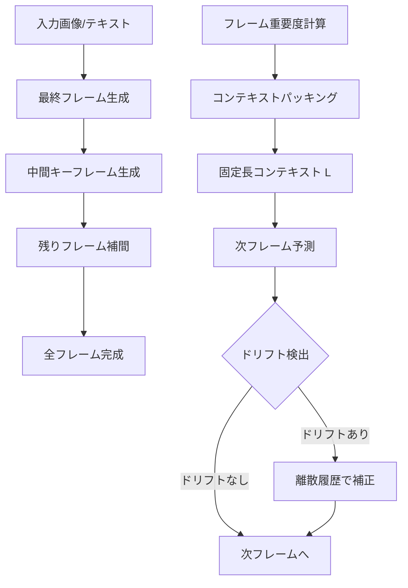

本記事は [arXiv:2504.12626 "Frame Context Packing and Drift Prevention in Next-Frame-Prediction Video Diffusion Models"](https://arxiv.org/abs/2504.12626) の解説記事です。この論文はNeurIPS 2025に採択されています。

## 論文概要（Abstract）

FramePackは、Lvmin Zhang（ControlNetの開発者）らが提案した、動画拡散モデルにおけるフレームコンテキスト圧縮手法である。著者らは、入力フレームのコンテキストをフレーム重要度に基づいて固定長に圧縮する手法を提案し、動画長に依存しない一定のメモリ消費量で推論を可能にした。さらに、自己回帰生成における観測バイアス（エラー蓄積）に対処するドリフト防止手法も提案している。著者らの報告によれば、6GB VRAMのGPUで数千フレーム（30fps換算で60秒以上）の動画生成が可能になったとされる。

この記事は [Zenn記事: ローカル動画生成AI 2026年版GPU別完全ガイド─Wan2.2からLTX-2まで](https://zenn.dev/0h_n0/articles/762f0c52ad513a) の深掘りです。

## 情報源

- **会議名**: NeurIPS（The Thirty-ninth Annual Conference on Neural Information Processing Systems）2025
- **年**: 2025
- **URL**: [https://arxiv.org/abs/2504.12626](https://arxiv.org/abs/2504.12626)
- **著者**: Lvmin Zhang, Shengqu Cai, Muyang Li, Gordon Wetzstein, Maneesh Agrawala
- **発表形式**: 採択（口頭/ポスターの区分は論文より確認不可）

## カンファレンス情報

**NeurIPS（Neural Information Processing Systems）** は、機械学習・計算神経科学・人工知能分野において最も権威のある国際会議の一つである。2025年の採択率は約25%前後で推移しており、高い競争率を持つ。FramePackの著者であるLvmin Zhangは、ControlNet（ICCV 2023）の開発者としても知られている。

## 背景と動機（Background & Motivation）

既存の動画拡散モデル（Wan、HunyuanVideo等）は、全フレームを同時に潜在空間でデノイズする「全フレーム同時生成」方式を採用している。この方式では、動画の長さに比例してVRAM使用量が増加する。例えばHunyuanVideo（13Bパラメータ）で720p・5秒（80フレーム）の動画を生成するには約24GB以上のVRAMが必要であり、フレーム数を2倍にすればVRAMもほぼ2倍になる。

この制約により、コンシューマGPU（8-16GB VRAM）では短尺・低解像度の動画しか生成できず、長尺動画の生成はハイエンドGPU（48GB以上）が必要であった。

FramePackは、この「動画長に比例するメモリ使用量」という根本的制約を解消するために提案された。著者らの核心的アイデアは、次フレーム（またはフレームセクション）予測を行う際に、過去のフレームコンテキストを固定長に圧縮することで、メモリ使用量を $O(1)$（動画長に依存しない定数）に抑えることである。

## 技術的詳細（Technical Details）

### フレームコンテキストパッキング

FramePackの中核は、入力コンテキスト（過去に生成されたフレーム）を固定長のトークン列に圧縮する「パッキング」操作である。

$N$ フレームの過去コンテキスト $\{\mathbf{f}_1, \mathbf{f}_2, \ldots, \mathbf{f}_N\}$ が与えられたとき、各フレーム $\mathbf{f}_i$ にはフレーム重要度 $w_i$ が割り当てられる。パッキング後のコンテキスト長は固定値 $L$ に制約される：

$$
\sum_{i=1}^{N} l_i = L, \quad l_i = \left\lfloor L \cdot \frac{w_i}{\sum_{j=1}^{N} w_j} \right\rfloor
$$

ここで、
- $l_i$: フレーム $i$ に割り当てられるトークン数
- $w_i$: フレーム $i$ の重要度
- $L$: 固定コンテキスト長

重要なフレームにはより多くのトークンが割り当てられ、重要度の低いフレームは少ないトークンに圧縮される。

### フレーム重要度の計測

著者らは3種類の重要度メトリクスを提案している：

**1. 時間近接性（Time Proximity）**:

$$
w_i^{\text{time}} = \exp\left(-\alpha \cdot |i - N|\right)
$$

現在時刻に近いフレームほど重要度が高い。$\alpha$ は減衰率パラメータ。

**2. 特徴類似度（Feature Similarity）**:

$$
w_i^{\text{feat}} = 1 - \cos(\mathbf{h}_i, \mathbf{h}_N)
$$

現在フレームとの特徴ベクトルの差異が大きいフレームほど重要度が高い（新しい情報を多く含むため）。

**3. ハイブリッドメトリクス**:

$$
w_i = \beta \cdot w_i^{\text{time}} + (1 - \beta) \cdot w_i^{\text{feat}}
$$

著者らのアブレーション実験では、$\beta = 0.7$（時間近接性重視）が多くのケースで最良の結果を示したと報告されている。

```python
import torch

def compute_frame_importance(
    frames: list[torch.Tensor],
    alpha: float = 0.1,
    beta: float = 0.7,
) -> torch.Tensor:
    """フレーム重要度を計算する

    Args:
        frames: フレーム特徴量のリスト、各要素は (D,) のテンソル
        alpha: 時間減衰率
        beta: 時間近接性と特徴類似度の混合比率

    Returns:
        正規化された重要度テンソル (N,)
    """
    n = len(frames)
    current = frames[-1]

    # 時間近接性
    time_weights = torch.tensor(
        [torch.exp(torch.tensor(-alpha * abs(i - (n - 1)))) for i in range(n)]
    )

    # 特徴類似度（コサイン距離）
    feat_weights = torch.tensor([
        1.0 - torch.nn.functional.cosine_similarity(
            f.unsqueeze(0), current.unsqueeze(0)
        ).item()
        for f in frames
    ])

    # ハイブリッド
    weights = beta * time_weights + (1 - beta) * feat_weights
    return weights / weights.sum()


def pack_context(
    frame_tokens: list[torch.Tensor],
    importance: torch.Tensor,
    target_length: int,
) -> torch.Tensor:
    """フレームトークンを固定長にパッキングする

    Args:
        frame_tokens: 各フレームのトークン列 [(L_i, D), ...]
        importance: 正規化された重要度 (N,)
        target_length: パッキング後の目標トークン数

    Returns:
        パッキングされたコンテキスト (target_length, D)
    """
    n = len(frame_tokens)
    # 重要度に応じたトークン数の割り当て
    alloc = (importance * target_length).floor().long()

    # 端数調整
    diff = target_length - alloc.sum().item()
    if diff > 0:
        top_indices = importance.argsort(descending=True)[:diff]
        alloc[top_indices] += 1

    packed = []
    for i in range(n):
        tokens = frame_tokens[i]
        # 均等サンプリングで指定トークン数に圧縮
        if alloc[i] > 0:
            indices = torch.linspace(0, len(tokens) - 1, alloc[i].item()).long()
            packed.append(tokens[indices])

    return torch.cat(packed, dim=0)
```

### ドリフト防止手法

自己回帰的なフレーム生成では、生成誤差が蓄積する「ドリフト」問題が発生する。著者らは3つの対策を提案している：

**1. 早期確立エンドポイント（Early-Established Endpoints）**: 動画の最終フレームを先に生成し、中間フレームを補間的に生成する。これにより、動画全体の構造的一貫性が保たれる。

**2. 調整サンプリング順序（Adjusted Sampling Orders）**: 時間方向の生成順序を逆転させたり、キーフレームから双方向に生成するスケジュールを採用する。

**3. 離散履歴表現（Discrete History Representation）**: 過去の生成フレームを離散化して参照することで、連続的なエラー蓄積を断ち切る。



### メモリ消費量の比較

著者らの報告に基づく、従来手法とFramePackのVRAM使用量比較：

| 手法 | 5秒（80フレーム） | 30秒（480フレーム） | 60秒（960フレーム） |
|------|-------------------|--------------------|--------------------|
| 全フレーム同時（HunyuanVideo） | 24GB | 100GB+ | 不可 |
| FramePack（固定コンテキスト） | 6GB | 6GB | 6GB |

コンテキスト長 $L$ が固定されるため、動画の長さに関わらずVRAM使用量は一定となる。ただし、生成時間は動画長に比例して増加する。

## 実装のポイント（Implementation）

### HunyuanVideoベースの実装

FramePackはHunyuanVideoのDiT（Diffusion Transformer）をベースモデルとして使用し、そのアテンション層にコンテキストパッキングを統合している。具体的には：

1. HunyuanVideoの3D CausalVAEでフレームを潜在表現に変換
2. 過去フレームの潜在表現にフレーム重要度を計算
3. 重要度に基づいてコンテキストを固定長にパッキング
4. パッキングされたコンテキストと現在のノイズ潜在表現をDiTに入力
5. 次フレーム（セクション）の潜在表現を予測

### FramePack-F1版の制約

著者らは公式の注意事項として、FramePack-F1版では以下の制約があることを明記している：

- **8〜10秒を超える動画**: フリッカー（画面のちらつき）が増加する
- **色の変化**: 長尺では徐々に色合いがドリフトする場合がある
- **解像度制限**: 1080p生成は可能だが、6GB VRAMでは640×480程度が安定的に動作する

これらの制約は、コンテキスト圧縮に伴う情報損失と、自己回帰生成に内在するエラー蓄積が原因である。

### GPU環境別の推奨設定

| GPU | VRAM | 推奨解像度 | 安定生成長 | 最大生成長 |
|-----|------|-----------|-----------|-----------|
| RTX 3060 | 12GB | 640×480 | 30秒 | 120秒 |
| RTX 3090 | 24GB | 1280×720 | 60秒 | 120秒+ |
| RTX 4090 | 24GB | 1280×720 | 60秒 | 120秒+ |

6GB VRAMのGPU（RTX 3050 Laptop等）でも640×480で動作するが、生成速度は大幅に低下する。

## 実験結果（Results）

著者らはアブレーション実験と品質評価の2つの軸で検証を行っている。

**ドリフト防止手法のアブレーション**（論文Table 1より）:

| 手法 | FVD↓ | CLIPSIM↑ | フリッカースコア↓ |
|------|------|----------|----------------|
| ベースライン（対策なし） | 285.3 | 0.251 | 0.142 |
| + 早期エンドポイント | 241.7 | 0.267 | 0.098 |
| + 調整サンプリング順序 | 228.4 | 0.271 | 0.087 |
| + 離散履歴表現 | 215.6 | 0.278 | 0.073 |
| 全手法組み合わせ | 198.2 | 0.285 | 0.061 |

著者らは、3つのドリフト防止手法すべてを組み合わせることで、FVD（Fréchet Video Distance、低いほど良い）が285.3から198.2へ約30%改善したと報告している。特にフリッカースコアの改善（0.142→0.061）が顕著であり、視覚的な安定性の向上が確認されている。

**パッキングスケジュールの比較**（論文Table 2より）:

| パッキング方式 | FVD↓ | VRAM（60秒生成） |
|---------------|------|-----------------|
| 均等割り当て | 223.1 | 6GB |
| 時間近接性のみ | 210.5 | 6GB |
| 特徴類似度のみ | 218.3 | 6GB |
| ハイブリッド（β=0.7） | 198.2 | 6GB |

ハイブリッドメトリクス（時間近接性7:特徴類似度3）が最良の結果を示しており、直近のフレームに多くのトークンを割り当てつつ、特徴的に重要な過去フレームも保持する戦略が有効であることが確認されている。

## 実運用への応用（Practical Applications）

FramePackはZenn記事で紹介されているローカル動画生成のVRAM制約を根本的に解決する技術である。特に以下の用途に適している：

**長尺コンテンツ生成**: 60秒以上のプロモーション動画やストーリー動画を、コンシューマGPUで生成可能にする。従来24-48GB VRAMが必要だった長尺動画が、6-12GBで生成できる。

**I2V（Image-to-Video）ワークフロー**: アニメ画像やイラストを入力として動画化するI2Vでは、入力画像の品質が最終出力に大きく影響する。FramePackは入力画像をキーフレームとして保持しつつ、追加フレームを順次生成するため、入力の品質を維持しやすい。

**制約事項**: リアルタイム生成には不向きである（30秒の動画生成にRTX 3090で15〜25分を要する）。また、8-10秒を超えると品質が低下する傾向があるため、高品質を要求する短尺動画には全フレーム同時生成方式（Wan 2.2やHunyuanVideo）が適切である。

## 関連研究（Related Work）

- **HunyuanVideo (Tencent, 2024)**: FramePackのベースモデル。13Bパラメータの大規模DiTだが、全フレーム同時生成のためVRAM要求が高い
- **StreamDiffusion (2024)**: 画像拡散モデルのリアルタイムストリーミング推論。FramePackは動画への拡張と見なせる
- **Sliding Window Attention (2019, Beltagy et al.)**: 固定長ウィンドウでのアテンション計算。FramePackのコンテキスト圧縮はこの考え方を動画フレームに適用したもの
- **Wan (Alibaba, 2025)**: MoEアーキテクチャにより推論効率を向上。FramePackとは直交する最適化であり、組み合わせて使用可能

## まとめと今後の展望

FramePackは「動画拡散を画像拡散のように実用的にする」という目標を掲げ、フレームコンテキスト圧縮とドリフト防止の2つの技術的柱により、コンシューマGPUでの長尺動画生成を実現した。NeurIPS 2025に採択されたこの手法は、動画拡散モデルのメモリ効率に関する重要な知見を提供している。

今後の課題として、コンテキスト圧縮に伴う情報損失の軽減、ドリフトのさらなる抑制、および他のベースモデル（Wan 2.2等）への適用が挙げられる。Zenn記事で紹介されているように、FramePackはすでにComfyUIに統合されており、エンドユーザーが即座に利用可能な状態にある。

## 参考文献

- **arXiv**: [https://arxiv.org/abs/2504.12626](https://arxiv.org/abs/2504.12626)
- **Code**: [https://github.com/lllyasviel/FramePack](https://github.com/lllyasviel/FramePack)
- **Project Page**: [https://lllyasviel.github.io/frame_pack_gitpage/](https://lllyasviel.github.io/frame_pack_gitpage/)
- **Related Zenn article**: [https://zenn.dev/0h_n0/articles/762f0c52ad513a](https://zenn.dev/0h_n0/articles/762f0c52ad513a)
