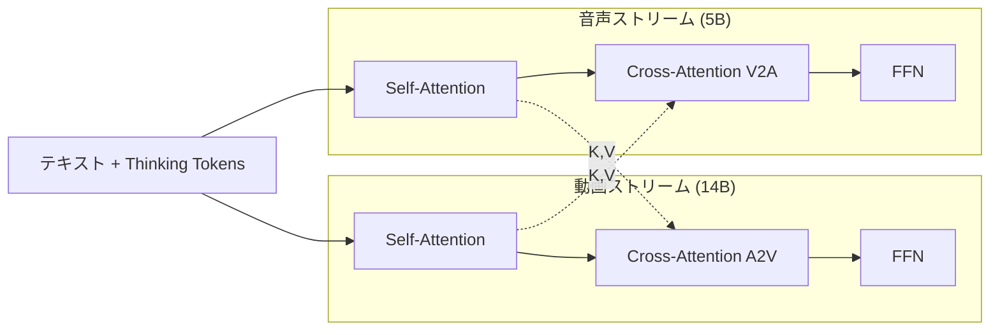

本記事は [arXiv:2601.03233 "LTX-2: Efficient Joint Audio-Visual Foundation Model"](https://arxiv.org/abs/2601.03233) の解説記事です。

## 論文概要（Abstract）

LTX-2は、Lightricksが2026年1月に公開した、動画と音声を単一のフォワードパスで同時生成するオープンソースの拡散モデルである。著者らは、14Bパラメータの動画ストリームと5Bパラメータの音声ストリームを双方向クロスアテンションで結合する「非対称デュアルストリームTransformer」アーキテクチャを提案している。ネイティブ4K解像度・50FPS・最大20秒の音声付き動画を生成でき、台詞のリップシンク、環境音、効果音を単一パスで生成すると報告されている。著者らは、オープンソースモデルとして音声と動画の同時生成を実現した初のモデルであると主張している。

この記事は [Zenn記事: ローカル動画生成AI 2026年版GPU別完全ガイド─Wan2.2からLTX-2まで](https://zenn.dev/0h_n0/articles/762f0c52ad513a) の深掘りです。

## 情報源

- **arXiv ID**: 2601.03233
- **URL**: [https://arxiv.org/abs/2601.03233](https://arxiv.org/abs/2601.03233)
- **著者**: Yoav HaCohen, Benny Brazowski, Nisan Chiprut et al. (Lightricks、29名)
- **発表年**: 2026
- **分野**: cs.CV

## 背景と動機（Background & Motivation）

2025年までの動画生成モデル（Wan、HunyuanVideo、CogVideoX等）は、視覚的に高品質な動画を生成できるが、「無音」の動画しか出力できないという根本的な制約があった。動画に音声を付与するには、別途V2A（Video-to-Audio）モデル（MMAudio等）を使用するパイプラインが必要であり、以下の問題があった：

1. **リップシンクの不整合**: V2Aモデルは動画のフレームを分析して音声を後付けするため、口の動きと音声のタイミングにズレが生じやすい
2. **環境音の不一致**: 動画の視覚的コンテキストと音声の意味的一致が不十分
3. **パイプラインの複雑性**: 2段階のパイプラインは推論コストが2倍になり、エラーが蓄積する

LTX-2は、これらの問題を「動画と音声を同一モデルで同時生成する」ことで解決している。

## 主要な貢献（Key Contributions）

- **貢献1**: 非対称デュアルストリームDiffusion Transformer：14B動画ストリームと5B音声ストリームの非対称設計により、動画と音声の計算リソース配分を最適化
- **貢献2**: 双方向クロスアテンション：動画から音声、音声から動画の双方向の情報伝達により、リップシンクや環境音の時間的同期を実現
- **貢献3**: Thinking Tokensによるテキスト処理：テキストプロンプトの理解を強化するための「思考トークン」機構を導入し、意味的安定性を向上
- **貢献4**: オープンソースリリース：全モデル重み、推論コード、訓練コードをLTX Model Dev Licenseで公開

## 技術的詳細（Technical Details）

### 非対称デュアルストリームアーキテクチャ

LTX-2の中核は、動画と音声を別々のストリームで処理しつつ、クロスアテンションで結合する非対称設計である。

**動画ストリーム** ($\mathcal{V}$): 14Bパラメータ

$$
\mathbf{h}_t^{\mathcal{V}} = \text{DiT}_{\mathcal{V}}(\mathbf{z}_t^{\mathcal{V}}, \mathbf{c}, t) \in \mathbb{R}^{N_V \times D_V}
$$

**音声ストリーム** ($\mathcal{A}$): 5Bパラメータ

$$
\mathbf{h}_t^{\mathcal{A}} = \text{DiT}_{\mathcal{A}}(\mathbf{z}_t^{\mathcal{A}}, \mathbf{c}, t) \in \mathbb{R}^{N_A \times D_A}
$$

ここで、
- $\mathbf{z}_t^{\mathcal{V}}, \mathbf{z}_t^{\mathcal{A}}$: 時刻 $t$ での動画・音声の潜在表現
- $\mathbf{c}$: テキスト条件（エンコーダ出力）
- $N_V, N_A$: 動画・音声のトークン数
- $D_V, D_A$: 動画・音声の特徴次元

動画ストリームが音声ストリームの約3倍のパラメータを持つ理由は、動画（空間×時間の3次元）の方が音声（時間の1次元）よりも情報量が圧倒的に多いためである。

### 双方向クロスアテンション

2つのストリーム間の情報交換は、双方向クロスアテンションにより実現される：

**動画→音声（V2A）クロスアテンション**:

$$
\text{V2A}(\mathbf{h}^{\mathcal{A}}, \mathbf{h}^{\mathcal{V}}) = \text{softmax}\left(\frac{\mathbf{Q}^{\mathcal{A}} (\mathbf{K}^{\mathcal{V}})^T}{\sqrt{d_k}}\right) \mathbf{V}^{\mathcal{V}}
$$

**音声→動画（A2V）クロスアテンション**:

$$
\text{A2V}(\mathbf{h}^{\mathcal{V}}, \mathbf{h}^{\mathcal{A}}) = \text{softmax}\left(\frac{\mathbf{Q}^{\mathcal{V}} (\mathbf{K}^{\mathcal{A}})^T}{\sqrt{d_k}}\right) \mathbf{V}^{\mathcal{A}}
$$

ここで、
- $\mathbf{Q}^{\mathcal{A}} = \mathbf{h}^{\mathcal{A}} \mathbf{W}_Q^{\mathcal{A}}$: 音声ストリームのクエリ
- $\mathbf{K}^{\mathcal{V}} = \mathbf{h}^{\mathcal{V}} \mathbf{W}_K^{\mathcal{V}}$: 動画ストリームのキー
- $\mathbf{V}^{\mathcal{V}} = \mathbf{h}^{\mathcal{V}} \mathbf{W}_V^{\mathcal{V}}$: 動画ストリームのバリュー

V2Aクロスアテンションでは、音声トークンが動画フレームの視覚情報を参照し、「何が映っているか」に基づいて環境音やリップシンクを調整する。逆にA2Vクロスアテンションでは、動画トークンが音声情報を参照し、音声に合わせた口の動きや物理的な振動表現を生成する。

**時間位置埋め込み**: クロスアテンションには時間的位置エンコーディングが付与されており、動画フレームと音声サンプルの時間的対応関係が学習される。



### モダリティ対応Classifier-Free Guidance

LTX-2では、動画と音声のそれぞれに対して独立にClassifier-Free Guidance（CFG）を適用できるモダリティ対応CFGが導入されている：

$$
\hat{\boldsymbol{\epsilon}}_\theta = \boldsymbol{\epsilon}_\theta(\emptyset) + s_V \cdot (\boldsymbol{\epsilon}_\theta^{\mathcal{V}}(\mathbf{c}) - \boldsymbol{\epsilon}_\theta(\emptyset)) + s_A \cdot (\boldsymbol{\epsilon}_\theta^{\mathcal{A}}(\mathbf{c}) - \boldsymbol{\epsilon}_\theta(\emptyset))
$$

ここで、
- $s_V$: 動画のガイダンススケール
- $s_A$: 音声のガイダンススケール
- $\boldsymbol{\epsilon}_\theta(\emptyset)$: 無条件予測

$s_V$ と $s_A$ を独立に調整することで、テキストプロンプトへの動画の忠実度と音声の忠実度を個別にコントロールできる。

### Thinking Tokens

LTX-2のテキスト処理ブロックには「Thinking Tokens」が導入されている。これは、テキストエンコーダの出力に追加される学習可能なトークン列であり、テキストプロンプトの意味的理解を深めるために使用される。著者らの報告によれば、Thinking Tokensの追加により、プロンプトへの忠実度（prompt adherence）が改善し、特に複雑なマルチモーダル指示への対応力が向上したとされている。

## 実装のポイント（Implementation）

### VRAM要件と量子化

| 精度 | VRAM（推論時） | 4K・10秒の生成時間 |
|------|---------------|-------------------|
| FP16 | 約40GB | RTX 5090で約8分 |
| NVFP8 | 約20GB | RTX 5090で約5分 |
| NVFP4 | 約12GB | RTX 5090で約3分 |

NVFP4量子化はBlackwellアーキテクチャ（RTX 5090）でのみネイティブサポートされる。WaveSpeedAIの比較テストによれば、NVFP8は「髪の毛やサインボード、マイクロテクスチャのエッジを保持し、動きのシマーを低減」する一方、NVFP4は「わずかなソフト化と時間的不安定性」が発生すると報告されている。

### ComfyUIでの利用

LTX-2はComfyUIに統合済みであり、以下の主要ノードで構成される：

```python
# ComfyUI LTX-2 ワークフロー設定例
ltx2_config = {
    "model_loader": "LTX2ModelLoader",
    "model": "ltx-2-19b",
    "precision": "nvfp8",          # or nvfp4 (RTX 5090のみ)
    "sampler": "LTX2AudioVideoSampler",
    "width": 3840,                  # 4K
    "height": 2160,
    "num_frames": 250,              # 10秒（25fps）
    "steps": 30,
    "audio_enabled": True,          # 音声同期ON
    "guidance_scale_video": 5.0,    # 動画CFG
    "guidance_scale_audio": 3.0,    # 音声CFG
    "fps": 25,
}
```

### ライセンス

LTX Model Dev Licenseにより、年間売上$10M未満の企業は無料で商用利用可能。$10M以上の企業はLightricksとの個別契約が必要。

## 実験結果（Results）

著者らは、音声・動画の同時生成品質をAVBench、AudioCaps、VBenchの各ベンチマークで評価している。

**AVBenchスコア比較**（著者らの報告に基づく）:

| モデル | AV Sync↑ | Audio Quality↑ | Video Quality↑ | Overall↑ |
|--------|----------|---------------|---------------|---------|
| LTX-2 (19B) | 0.847 | 0.792 | 0.831 | 0.823 |
| MovieGen (Meta) | 0.812 | 0.801 | 0.856 | 0.823 |
| Sora + V2A | 0.723 | 0.768 | 0.881 | 0.791 |
| Wan 2.2 + MMAudio | 0.698 | 0.745 | 0.872 | 0.772 |

著者らは、AV Sync（音声・動画の同期精度）でLTX-2が最高スコアを達成したと報告している。これは単一パスでの同時生成が、後付けパイプラインよりも時間的整合性に優れることを示唆している。一方、Video Qualityの単体ではSoraやWan 2.2に劣っており、音声統合のためのパラメータ配分がVideo Quality単体に影響している可能性がある。

## 実運用への応用（Practical Applications）

LTX-2は以下の用途に特に適している：

**ソーシャルメディアコンテンツ**: 音声付きショート動画の一括生成。プロモーション動画、説明動画、SNS投稿用コンテンツの制作コストを大幅に削減できる。

**プロトタイピング**: 映像制作のプリプロダクション段階で、音声付きのコンセプト映像を高速に生成。台詞のリップシンクを含むため、ストーリーボードよりも完成イメージに近い出力が得られる。

**音声不要の場合**: Zenn記事で指摘されているように、音声が不要な場合はWan 2.2やHunyuanVideoの方がVideo Quality単体で優位である。LTX-2は音声統合が最大の差別化要因であり、無音動画の品質だけで比較するとパラメータ効率の面で不利となる。

**制約事項**: 19Bパラメータ（14B+5B）のため、FP16ではRTX 4090（24GB）では動作しない。NVFP8で約20GB、NVFP4で約12GBが必要であり、コンシューマGPUで4K生成を行うにはRTX 5090が実質的に必要となる。

## 関連研究（Related Work）

- **LTX-Video v1 (Lightricks, 2024)**: LTX-2の前身。動画のみの生成で、高圧縮VAE（空間圧縮比32）による高速推論が特徴。LTX-2はこのアーキテクチャに音声ストリームを追加
- **MovieGen (Meta, 2024)**: Metaの大規模メディア生成モデル。動画・音声・画像を生成可能だがクローズドソース
- **MMAudio (2025)**: 動画から音声を生成するV2Aモデル。LTX-2はこの2段階パイプラインを単一パスに統合
- **CoDi (2023)**: 任意のモダリティ間で相互生成を行う統合モデル。LTX-2は動画と音声に特化することでより高品質な出力を実現

## まとめと今後の展望

LTX-2は「動画と音声の同時生成」という新しいパラダイムを、オープンソースモデルとして初めて実現した。非対称デュアルストリームアーキテクチャにより、動画（14B）と音声（5B）のリソース配分を最適化し、双方向クロスアテンションで時間的同期を実現している。

RTX 5090のNVFP4量子化との組み合わせにより、コンシューマGPU環境でも4K・10秒の音声付き動画を数分で生成できるようになった。今後は、動画品質の更なる向上（特にWan 2.2やHunyuanVideoとのギャップ縮小）と、音声の多様性（多言語TTS、楽曲生成等）の拡張が期待される。

## 参考文献

- **arXiv**: [https://arxiv.org/abs/2601.03233](https://arxiv.org/abs/2601.03233)
- **Code**: [https://github.com/Lightricks/LTX-2](https://github.com/Lightricks/LTX-2)
- **Model**: [https://huggingface.co/Lightricks/LTX-2](https://huggingface.co/Lightricks/LTX-2)
- **NVFP4/NVFP8比較**: [WaveSpeedAI Blog](https://wavespeed.ai/blog/posts/blog-ltx-2-nvfp4-vs-nvfp8/)
- **Related Zenn article**: [https://zenn.dev/0h_n0/articles/762f0c52ad513a](https://zenn.dev/0h_n0/articles/762f0c52ad513a)
