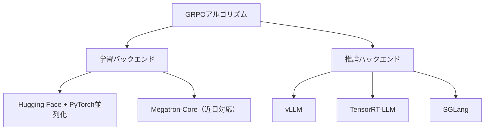

本記事は [Reinforcement Learning with NVIDIA NeMo-RL: Reproducing a DeepScaleR Recipe Using GRPO](https://developer.nvidia.com/blog/reinforcement-learning-with-nvidia-nemo-rl-reproducing-a-deepscaler-recipe-using-grpo/) の解説記事です。

## ブログ概要（Summary）

NVIDIAは2025年7月にオープンソースのRL学習ライブラリ**NeMo-RL**を公開した。このブログ記事では、NeMo-RLを用いてDeepScaleRのGRPOレシピを再現し、Qwen2.5-1.5Bモデルで数学推論ベンチマークAIME 2024においてOpenAI o1を上回るスコアを達成したと報告している。NeMo-RLは単一GPU環境から数千GPU規模まで対応し、vLLMやTensorRT-LLM等の推論バックエンドとシームレスに統合できる設計となっている。

この記事は [Zenn記事: GRPOとvLLMで構築するドメイン特化小規模推論モデルの強化学習パイプライン](https://zenn.dev/0h_n0/articles/b96ef4638d36a8) の深掘りです。

## 情報源

- **種別**: 企業テックブログ
- **URL**: [https://developer.nvidia.com/blog/reinforcement-learning-with-nvidia-nemo-rl-reproducing-a-deepscaler-recipe-using-grpo/](https://developer.nvidia.com/blog/reinforcement-learning-with-nvidia-nemo-rl-reproducing-a-deepscaler-recipe-using-grpo/)
- **組織**: NVIDIA
- **著者**: Alexander Bukharin, Terry Kong, Wenwen Gao, Sylendran Arunagiri
- **発表日**: 2025年7月9日

## 技術的背景（Technical Background）

GRPOを用いたLLMのRL学習では、学習ループ内で大量のテキスト生成を行う必要があり、推論スループットがボトルネックとなる。Zenn記事で紹介されているTRL + vLLMの組み合わせは比較的手軽に導入できるが、大規模なマルチGPU・マルチノード構成への拡張には制約がある。

NVIDIAはこの課題に対し、以下の設計方針でNeMo-RLを構築したと述べている：

1. **バックエンド非依存**: 学習アルゴリズム（GRPO等）はバックエンド実装の詳細に依存しない
2. **隔離環境**: 学習バックエンドと推論バックエンドがそれぞれ独立した環境で動作
3. **標準インターフェース**: 各バックエンドが統一されたインターフェースに準拠

これにより、vLLMからTensorRT-LLMへの切り替えや、PyTorchネイティブ並列化からMegatron-Coreへの移行が容易になる。

## 実装アーキテクチャ（Architecture）

### NeMo-RLのモジュール構成



### DeepScaleRレシピの構成

著者らが再現したDeepScaleRレシピは、**Progressive Context Expansion**（段階的コンテキスト拡大）を特徴とする：

| ステージ | 最大コンテキスト長 | 目的 |
|---------|-----------------|------|
| Stage 1 | 8K | 短い推論パターンの学習 |
| Stage 2 | 16K | 中程度の推論チェーン対応 |
| Stage 3 | 24K | 長い推論チェーン対応 |

この段階的拡大により、モデルは短い推論から始めて徐々に長い推論チェーンを学習できる。これはZenn記事で紹介されているGRPOの`max_completion_length`パラメータを段階的に増やすアプローチに対応する。

### 学習設定

ブログ記事で報告されている具体的な設定値：

| パラメータ | 値 |
|-----------|-----|
| モデル | Qwen/Qwen2.5-1.5B |
| グローバルバッチサイズ | 512 |
| マイクロバッチサイズ | 4 |
| 生成バッチサイズ | 32 |
| 最大シーケンス長 | 512トークン（Stage 1） |
| 精度 | bfloat16 |
| 推論バックエンド | vLLM |

## パフォーマンス最適化（Performance）

### 学習効率

著者らは、400ステップでtraining reward 0.65を達成したと報告している。これはGRPOの収束が比較的高速であることを示している。

### vLLM統合の効果

NeMo-RLはvLLMを推論バックエンドとして統合しており、以下の利点がある：

1. **PagedAttention**: メモリ効率の良いKVキャッシュ管理
2. **Continuous Batching**: 動的バッチングによるスループット向上
3. **Tensor Parallelism**: マルチGPUでの推論並列化

Zenn記事で紹介されているTRLのvLLM統合（`use_vllm=True`）と異なり、NeMo-RLでは推論バックエンドが完全に隔離されたプロセスで動作するため、GPUメモリの競合が発生しにくい。

### 実行コマンド

```bash
# Stage 1: 8Kコンテキスト
uv run examples/run_grpo_math.py \
    --config=examples/configs/recipes/llm/grpo-deepscaler-1.5b-8K.yaml

# Stage 2: 16Kコンテキスト（Stage 1のチェックポイントから継続）
uv run examples/run_grpo_math.py \
    --config=examples/configs/recipes/llm/grpo-deepscaler-1.5b-16K.yaml

# Stage 3: 24Kコンテキスト
uv run examples/run_grpo_math.py \
    --config=examples/configs/recipes/llm/grpo-deepscaler-1.5b-24K.yaml

# チェックポイントをHugging Face形式に変換
uv run examples/converters/convert_dcp_to_hf.py \
    --config=results/grpo-deepscaler-1.5b-8K/step_xx/config.yaml \
    --dcp-ckpt-path=results/grpo-deepscaler-1.5b-8K/step_xx/policy/weights \
    --hf-ckpt-path=results/grpo-deepscaler-1.5b-8K/step_xx/hf
```

## Production Deployment Guide

### AWS実装パターン（コスト最適化重視）

| 規模 | 月間リクエスト | 推奨構成 | 月額コスト | 主要サービス |
|------|--------------|---------|-----------|------------|
| **Small** | ~3,000 | Serverless | $50-150 | Lambda + Bedrock + DynamoDB |
| **Medium** | ~30,000 | Hybrid | $300-800 | ECS Fargate + ElastiCache |
| **Large** | 300,000+ | Container | $2,000-5,000 | EKS + Karpenter + EC2 Spot |

**コスト試算の注意事項**: 上記は2026年3月時点のAWS ap-northeast-1料金に基づく概算値です。最新料金は [AWS料金計算ツール](https://calculator.aws/) で確認してください。

### Terraformインフラコード

**Small構成 (Serverless)**

```hcl
module "vpc" {
  source  = "terraform-aws-modules/vpc/aws"
  version = "~> 5.0"
  name    = "nemo-rl-vpc"
  cidr    = "10.0.0.0/16"
  azs     = ["ap-northeast-1a", "ap-northeast-1c"]
  private_subnets = ["10.0.1.0/24", "10.0.2.0/24"]
  enable_nat_gateway   = false
  enable_dns_hostnames = true
}

resource "aws_iam_role" "lambda_bedrock" {
  name = "nemo-rl-lambda-role"
  assume_role_policy = jsonencode({
    Version = "2012-10-17"
    Statement = [{
      Action = "sts:AssumeRole", Effect = "Allow"
      Principal = { Service = "lambda.amazonaws.com" }
    }]
  })
}

resource "aws_lambda_function" "nemo_handler" {
  filename      = "lambda.zip"
  function_name = "nemo-rl-handler"
  role          = aws_iam_role.lambda_bedrock.arn
  handler       = "index.handler"
  runtime       = "python3.12"
  timeout       = 60
  memory_size   = 1024
}

resource "aws_dynamodb_table" "cache" {
  name         = "nemo-rl-cache"
  billing_mode = "PAY_PER_REQUEST"
  hash_key     = "prompt_hash"
  attribute { name = "prompt_hash"; type = "S" }
  ttl { attribute_name = "expire_at"; enabled = true }
}
```

**Large構成 (Container): EKS + GPU Spot**

```hcl
module "eks" {
  source  = "terraform-aws-modules/eks/aws"
  version = "~> 20.0"
  cluster_name    = "nemo-rl-cluster"
  cluster_version = "1.31"
  vpc_id     = module.vpc.vpc_id
  subnet_ids = module.vpc.private_subnets
  cluster_endpoint_public_access = true
  enable_cluster_creator_admin_permissions = true
}

resource "kubectl_manifest" "karpenter_gpu" {
  yaml_body = <<-YAML
    apiVersion: karpenter.sh/v1alpha5
    kind: Provisioner
    metadata:
      name: nemo-gpu-spot
    spec:
      requirements:
        - key: karpenter.sh/capacity-type
          operator: In
          values: ["spot"]
        - key: node.kubernetes.io/instance-type
          operator: In
          values: ["g5.xlarge", "g5.2xlarge", "p4d.24xlarge"]
      limits:
        resources:
          cpu: "96"
          memory: "384Gi"
          nvidia.com/gpu: "8"
      ttlSecondsAfterEmpty: 60
  YAML
}
```

### 運用・監視設定

```python
import boto3

cloudwatch = boto3.client('cloudwatch')

cloudwatch.put_metric_alarm(
    AlarmName='nemo-rl-gpu-utilization',
    ComparisonOperator='LessThanThreshold',
    EvaluationPeriods=3,
    MetricName='GPUUtilization',
    Namespace='AWS/EKS',
    Period=300, Statistic='Average',
    Threshold=30,
    AlarmDescription='GPU利用率低下（Spot回収やアイドル状態の可能性）'
)
```

### コスト最適化チェックリスト

- [ ] Spot Instances優先（最大90%削減）
- [ ] Reserved Instances: 安定負荷には1年コミット
- [ ] Bedrock Batch API: 50%割引
- [ ] Prompt Caching: 30-90%削減
- [ ] GPU利用率監視: 低利用時のスケールダウン
- [ ] EKS Karpenter: ttlSecondsAfterEmpty設定
- [ ] モデル選択: Haiku（開発）/ Sonnet（本番）
- [ ] AWS Budgets: 月額予算設定
- [ ] Cost Anomaly Detection
- [ ] タグ戦略: 環境別・チーム別
- [ ] S3ライフサイクル: チェックポイント自動削除
- [ ] 開発環境: 夜間停止
- [ ] CloudWatch: GPU/メモリアラーム
- [ ] 日次コストレポート
- [ ] Savings Plans: Compute型検討
- [ ] 未使用EBSボリューム削除
- [ ] ECRイメージ自動クリーンアップ
- [ ] NAT Gatewayの代替: VPCエンドポイント
- [ ] CloudFront: モデル成果物配信
- [ ] Transfer Accelerator: S3大容量転送

## 運用での学び（Production Lessons）

NeMo-RLのアーキテクチャから学べる実運用上のポイント：

1. **バックエンド隔離の重要性**: 学習と推論のバックエンドを分離することで、GPUメモリ競合を回避。TRLのcolocateモードで発生しやすいOOMを根本的に解決
2. **段階的コンテキスト拡大**: 一度に長いコンテキストを扱うのではなく、8K→16K→24Kと段階的に拡大することで学習の安定性が向上
3. **チェックポイント変換**: NeMo-RL独自のチェックポイント形式からHugging Face形式への変換ツールが提供されており、推論時のデプロイが容易
4. **uvによる依存管理**: NeMo-RLはuvを使用しており、Pythonの依存関係管理が高速かつ再現可能

## 学術研究との関連（Academic Connection）

NeMo-RLのGRPO実装は、以下の論文に基づいている：

- **DeepSeekMath (2402.03300)**: GRPOアルゴリズムの原論文。NeMo-RLはこのアルゴリズムを大規模GPU環境向けに実装
- **DeepScaleR**: Progressive Context Expansionの手法。小規模モデル（1.5B）でも段階的なコンテキスト拡大により高い数学推論性能を達成
- **DeepSeek-R1 (2501.12948)**: 多段階パイプラインの参考。NeMo-RLは学習パイプラインの各ステージを独立して実行可能

NeMo-RLは学術研究の成果を産業用の大規模学習基盤に落とし込んだ実装例であり、Zenn記事で紹介されているTRL + vLLMの構成をより大規模に拡張する場合の移行先として位置づけられる。

## まとめと実践への示唆

NeMo-RLは、GRPOベースのRL学習を単一GPUから数千GPU規模まで対応するオープンソースライブラリである。TRL + vLLMの構成と比較して、バックエンド隔離による安定性、段階的コンテキスト拡大による学習効率、マルチノード対応による拡張性が強みである。

Zenn記事で紹介されているTRL + vLLMのパイプラインからの移行を検討する場合、NeMo-RLは有力な選択肢となる。特に4GPU以上の環境でvLLMのメモリ競合が問題になる場合や、8K以上のコンテキスト長が必要な場合に有効である。

## 参考文献

- **Blog URL**: [https://developer.nvidia.com/blog/reinforcement-learning-with-nvidia-nemo-rl-reproducing-a-deepscaler-recipe-using-grpo/](https://developer.nvidia.com/blog/reinforcement-learning-with-nvidia-nemo-rl-reproducing-a-deepscaler-recipe-using-grpo/)
- **Code**: [https://github.com/NVIDIA/NeMo-RL](https://github.com/NVIDIA/NeMo-RL)
- **Related Zenn article**: [https://zenn.dev/0h_n0/articles/b96ef4638d36a8](https://zenn.dev/0h_n0/articles/b96ef4638d36a8)
