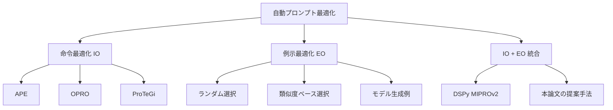

本記事は [Teach Better or Show Smarter? On Instructions and Exemplars in Automatic Prompt Optimization (NeurIPS 2024)](https://proceedings.neurips.cc/paper_files/paper/2024/hash/6b031defd145b02bed031093d8797bb3-Abstract-Conference.html) の解説記事です。

## 論文概要（Abstract）

本論文は、自動プロンプト最適化（APO: Automatic Prompt Optimization）において、命令最適化（IO: Instruction Optimization）と例示最適化（EO: Exemplar Optimization）の2つのアプローチを体系的に比較した研究である。著者らは、研究コミュニティがIOに偏重し、EOの可能性を過小評価していると指摘している。実験の結果、シンプルなEO戦略（ランダム検索を含む）がSOTA（state-of-the-art）のIO手法を上回るケースがあること、および両者の組み合わせが最も高い性能を達成することが報告されている。

この記事は [Zenn記事: DSPy×TextGrad比較で学ぶプロンプト自動最適化パイプラインの実践構築](https://zenn.dev/0h_n0/articles/925acb0262a64d) の深掘りです。

## 情報源

- **会議名**: NeurIPS 2024（Neural Information Processing Systems）
- **年**: 2024
- **URL**: [NeurIPS 2024 Proceedings](https://proceedings.neurips.cc/paper_files/paper/2024/hash/6b031defd145b02bed031093d8797bb3-Abstract-Conference.html)
- **著者**: Xingchen Wan, Ruoxi Sun, Hootan Nakhost, Sercan O. Arik（Google Research）
- **関連**: Google Cloud Vertex AI Prompt Optimizerの基盤研究

## カンファレンス情報

**NeurIPS**（Neural Information Processing Systems）は、機械学習・人工知能分野の最高峰会議の1つである。毎年12月にバンクーバーで開催され、採択率は通常25-30%程度（2024年は約25.8%）である。本論文はGoogle Researchから提出され、メインカンファレンスに採択された。

## 技術的詳細（Technical Details）

### 命令最適化（IO）と例示最適化（EO）の形式化

LLMへのプロンプトは、大きく2つの要素で構成される。

$$
\text{Prompt}(x) = \text{Instruction}(I) \oplus \text{Exemplars}(E) \oplus \text{Input}(x)
$$

ここで、
- $I$: タスクの命令文（「以下のテキストを感情分析してください」等）
- $E = \{(x_1, y_1), (x_2, y_2), \ldots, (x_k, y_k)\}$: few-shot例（入力-出力ペアのセット）
- $x$: 新しい入力
- $\oplus$: 連結演算子

**命令最適化（IO）** は命令文 $I$ を最適化する:

$$
I^* = \arg\max_{I \in \mathcal{I}} \mathbb{E}_{(x,y) \sim \mathcal{V}} \left[ \text{metric}(\text{LLM}(I \oplus E_{\text{fixed}} \oplus x), y) \right]
$$

**例示最適化（EO）** はfew-shot例のセット $E$ を最適化する:

$$
E^* = \arg\max_{E \subseteq \mathcal{D}, |E|=k} \mathbb{E}_{(x,y) \sim \mathcal{V}} \left[ \text{metric}(\text{LLM}(I_{\text{fixed}} \oplus E \oplus x), y) \right]
$$

ここで、
- $\mathcal{I}$: 命令文の探索空間
- $\mathcal{D}$: デモンストレーション候補プール
- $\mathcal{V}$: 検証セット
- $k$: few-shot例の数



### 著者らの主要な発見

著者らは、45以上のタスクで広範な実験を行い、以下の3つの発見を報告している。

**発見1: EOの過小評価**

著者らは「simple exemplar selection strategies—even random search—can exceed state-of-the-art instruction optimization methods when used with seed prompts」と報告している。具体的には、検証セットから生成されたモデル出力ペアを例示として再利用するだけで、命令文のみを精緻に最適化するSOTA手法を上回る性能が得られた。

これは、few-shot例がLLMの出力に与える影響が、命令文よりも大きい場合があることを示唆している。特に、タスクの境界条件（ambiguous cases）を例示に含めることで、命令文では表現しきれない暗黙的な判断基準をLLMに伝達できる。

**発見2: モデル生成例示の有効性**

著者らは、検証セットでプロンプトを評価する過程で生成されるモデル出力を「例示候補」として再利用する手法を提案している。この手法は追加のLM呼び出しなしで高品質な例示を獲得できるため、コスト効率が高い。

$$
E_{\text{generated}} = \{(x_i, \hat{y}_i) \mid x_i \in \mathcal{V}, \; \hat{y}_i = \text{LLM}(I \oplus x_i), \; \text{metric}(\hat{y}_i, y_i) \geq \tau\}
$$

ここで、
- $\hat{y}_i$: モデルの予測出力（検証時に生成済み）
- $\tau$: 品質閾値（この閾値以上の正解予測のみを例示として採用）

**発見3: IO + EOの相乗効果**

命令最適化と例示最適化を組み合わせることで、どちらか単独よりも高い性能が得られると報告されている。著者らは「combining both approaches yields superior results compared to using either method independently」と結論付けている。

### DSPyのOptimizerとの関係

本論文の発見は、DSPyのOptimizer設計と直接的に対応する。

| 本論文の概念 | DSPyの対応 | 具体的なOptimizer |
|------------|-----------|-----------------|
| IO（命令最適化） | 命令文テンプレートの最適化 | MIPROv2（命令文生成） |
| EO（例示最適化） | few-shot例の選択 | BootstrapFewShot |
| IO + EO統合 | 命令文 + few-shot例の同時最適化 | MIPROv2（両方を同時最適化） |

Zenn記事で紹介した**MIPROv2**は、まさにIO + EOの統合アプローチを実現している。MIPROv2のBayesian Optimizationは、命令文の候補生成（IO）とfew-shot例の選択（EO）を同時に探索する。

一方、**BootstrapFewShot**はEOに特化したOptimizerであり、本論文の発見1（EOの有効性）を裏付ける設計である。

## 実装のポイント（Implementation）

本論文の知見を実装に活かす際のポイントを整理する。

1. **まずEOから始める**: 命令文の最適化に時間をかける前に、まず高品質なfew-shot例を選択する。DSPyの`BootstrapFewShot`がこれに対応する

2. **モデル生成例示の活用**: 検証セットで正しく予測されたケースの入出力ペアを例示として再利用する。DSPyのBootstrapFewShotはこのアプローチを自動化している

3. **境界条件の例示を優先**: 明確なケースよりも、判断が難しい境界条件（ambiguous cases）を例示に含めることで、LLMの判断基準を暗黙的に伝達できる

4. **IO + EOの同時最適化**: 個別に最適化するよりも、MIPROv2等の統合Optimizerで両方を同時最適化する方が効率的

```python
import dspy
from dspy.teleprompt import BootstrapFewShot, MIPROv2

# Step 1: まずEOで改善を確認（BootstrapFewShot）
eo_optimizer = BootstrapFewShot(
    metric=classify_metric,
    max_bootstrapped_demos=4,  # モデル生成例示
    max_labeled_demos=4,       # ラベル付き例示
)
eo_compiled = eo_optimizer.compile(classifier, trainset=trainset)
eo_score = evaluate(eo_compiled, valset)
print(f"EO only score: {eo_score}")

# Step 2: IO + EOで追加改善を狙う（MIPROv2）
io_eo_optimizer = MIPROv2(
    metric=classify_metric,
    num_candidates=7,    # 命令文候補数
    num_threads=4,
)
io_eo_compiled = io_eo_optimizer.compile(
    classifier,
    trainset=trainset,
    num_trials=30,       # Bayesian Opt試行数
    max_bootstrapped_demos=3,
    max_labeled_demos=3,
)
io_eo_score = evaluate(io_eo_compiled, valset)
print(f"IO + EO score: {io_eo_score}")
print(f"Improvement from IO: {io_eo_score - eo_score:.3f}")
```

## 実験結果（Results）

著者らは、分類・質問応答・要約・推論を含む45以上のタスクで実験を行っている。

| 手法 | アプローチ | 相対性能 |
|------|-----------|---------|
| OPRO (IO only) | 命令最適化のみ | ベースライン |
| APE (IO only) | 命令最適化のみ | ベースラインと同程度 |
| Random EO | ランダム例示選択 | SOTA IO手法を上回るケースあり |
| Generated EO | モデル生成例示 | SOTA IO手法を一貫して上回る |
| IO + EO (提案手法) | 統合最適化 | 最高性能 |

著者らの論文で特に注目すべきは、**ランダムな例示選択**ですら精緻な命令最適化手法を上回るケースが存在した点である。これは、例示がLLMに提供する情報量が、研究コミュニティの想定よりも大きいことを強く示唆している。

**注意**: 上記の「相対性能」はタスクセット全体の傾向であり、個別タスクでは逆転するケースもある。著者らも「the relative importance of IO vs EO can vary across tasks」と述べている。

## 実運用への応用（Practical Applications）

本論文の知見は、プロンプト最適化の実務ワークフローに直接活用できる。

**1. 最適化の優先順位**: 手動プロンプト調整を行う前に、まずfew-shot例の品質を改善する。命令文の微調整よりもfew-shot例の選択が効果的な場合が多い

**2. コスト効率の高い最適化**: BootstrapFewShot（EO only）は計算コストが低い（数分で完了）。まずBootstrapFewShotで基準性能を確認し、必要に応じてMIPROv2（IO + EO）に移行する段階的アプローチが推奨される

**3. Google Cloud Vertex AI Prompt Optimizer**: 本論文はGoogle Cloud Vertex AI Prompt Optimizerの基盤研究であり、GCPユーザーはこの知見を直接活用できるサービスとして利用可能

**制約事項**: 例示最適化の効果はコンテキストウィンドウのサイズに依存する。few-shot例を多数含めるとコンテキストが圧迫され、入力テキストの処理能力が低下する。例示数とコンテキスト使用量のトレードオフを考慮する必要がある。

## 関連研究（Related Work）

- **DSPy** (Khattab et al., 2023): 本論文のIO + EO統合アプローチを先駆的に実装。MIPROv2が具体的な実装に相当する
- **APE** (Zhou et al., 2023): IO手法の代表例。LLMに命令文を生成・評価させる
- **OPRO** (Yang et al., 2023): LLMをオプティマイザとして活用するIO手法。メタプロンプトで最適化履歴を管理
- **ProTeGi** (Pryzant et al., 2023): テキストフィードバックによる命令最適化。TextGradの先行研究

## まとめと今後の展望

本論文は、自動プロンプト最適化においてEO（例示最適化）が過小評価されていること、IO（命令最適化）とEOの組み合わせが最も効果的であることを体系的に実証した。Google Researchの研究として、Google Cloud Vertex AI Prompt Optimizerの基盤にもなっている。

実務への示唆として、プロンプト最適化はまずfew-shot例の品質改善（BootstrapFewShot）から始め、追加改善が必要な場合にIO + EOの統合最適化（MIPROv2）に移行する段階的アプローチが推奨される。Zenn記事で紹介した「BootstrapFewShot → MIPROv2 → GEPA」の最適化フローは、本論文の知見と整合する設計である。

## 参考文献

- **NeurIPS 2024**: [https://proceedings.neurips.cc/paper_files/paper/2024/hash/6b031defd145b02bed031093d8797bb3-Abstract-Conference.html](https://proceedings.neurips.cc/paper_files/paper/2024/hash/6b031defd145b02bed031093d8797bb3-Abstract-Conference.html)
- **Google Research**: [https://research.google/pubs/teach-better-or-show-smarter-on-instructions-and-exemplars-in-automatic-prompt-optimization/](https://research.google/pubs/teach-better-or-show-smarter-on-instructions-and-exemplars-in-automatic-prompt-optimization/)
- **Related Zenn article**: [https://zenn.dev/0h_n0/articles/925acb0262a64d](https://zenn.dev/0h_n0/articles/925acb0262a64d)

---

> 本記事は NeurIPS 2024採択論文の解説記事です。記載内容は論文の記述に基づいており、筆者が独自に実験を行ったものではありません。
