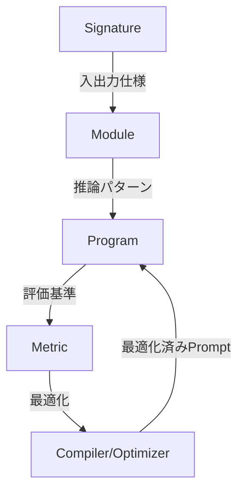

本記事は [DSPy: Compiling Declarative Language Model Calls into Self-Improving Pipelines (arXiv:2310.03714)](https://arxiv.org/abs/2310.03714) の解説記事です。

## 論文概要（Abstract）

DSPyは、言語モデル（LM）パイプラインを「テキスト変換グラフ」として抽象化し、宣言的なプログラミングモデルとエンドツーエンドのコンパイラを提供するフレームワークである。著者らは、従来のプロンプトエンジニアリングが特定のLMやタスクに過度に依存し、再利用性・合成可能性に乏しいと指摘している。DSPyでは、Signature（入出力仕様）とModule（推論パターン）を定義するだけで、コンパイラが自動的に最適なプロンプト戦略を探索する。

この記事は [Zenn記事: DSPy×TextGrad比較で学ぶプロンプト自動最適化パイプラインの実践構築](https://zenn.dev/0h_n0/articles/925acb0262a64d) の深掘りです。

## 情報源

- **arXiv ID**: 2310.03714
- **URL**: [https://arxiv.org/abs/2310.03714](https://arxiv.org/abs/2310.03714)
- **著者**: Omar Khattab, Arnav Singhvi, Paridhi Maheshwari et al.（Stanford NLP Group）
- **発表年**: 2023（ICLR 2024 採択）
- **分野**: cs.CL, cs.AI, cs.LG
- **GitHub**: [https://github.com/stanfordnlp/dspy](https://github.com/stanfordnlp/dspy)

## 背景と動機（Background & Motivation）

LLMを活用したアプリケーション開発では、プロンプトの設計が性能を大きく左右する。しかし、著者らは従来のプロンプトエンジニアリングに以下の構造的問題があると指摘している。

1. **転用困難性**: あるLM（例: GPT-3.5）で最適化したプロンプトが、別のLM（例: Llama 2）ではまったく機能しない
2. **合成不可能性**: 個々のプロンプトテクニック（Chain of Thought, ReAct等）を複数ステップのパイプラインに組み合わせると、各ステップの手動調整が指数的に増加する
3. **脆弱性**: パイプラインの一部を変更すると、他のステップのプロンプトも再調整が必要になる

これらの問題は、プロンプトが「命令型（imperative）」で記述されていることに起因する。DSPyは「宣言型（declarative）」のアプローチを採用し、**何を達成したいか**を定義すれば、**どう達成するか**はコンパイラが自動決定する設計思想を導入した。

## 主要な貢献（Key Contributions）

- **貢献1**: LMパイプラインを宣言的に記述するプログラミングモデル（Signature + Module + Metric）の提案
- **貢献2**: パイプライン全体をエンドツーエンドで最適化するコンパイラ（Teleprompter）の設計
- **貢献3**: BootstrapFewShot・BootstrapFewShotWithRandomSearchの2つのOptimizer実装と、複数ベンチマークでの有効性実証

## 技術的詳細（Technical Details）

### プログラミングモデル: Signature・Module・Metric

DSPyの設計は3つの抽象化層で構成される。



**Signature**は、タスクの入出力を型レベルで宣言する。従来のプロンプトテンプレートとの違いは、LMへの具体的な指示文を含まない点にある。

$$
\text{Signature}: \mathcal{X}_1, \mathcal{X}_2, \ldots, \mathcal{X}_n \rightarrow \mathcal{Y}_1, \mathcal{Y}_2, \ldots, \mathcal{Y}_m
$$

ここで、
- $\mathcal{X}_i$: 入力フィールド（例: `question`, `context`）
- $\mathcal{Y}_j$: 出力フィールド（例: `answer`, `reasoning`）

```python
class MultiHopQA(dspy.Signature):
    """与えられたコンテキストと質問から、段階的に推論して回答する"""
    context = dspy.InputField(desc="検索で取得した関連文書")
    question = dspy.InputField(desc="ユーザーの質問")
    reasoning = dspy.OutputField(desc="段階的な推論過程")
    answer = dspy.OutputField(desc="最終的な回答")
```

**Module**は、Signatureに推論パターンを付与する。`dspy.Predict`は最もシンプルなモジュールで、`dspy.ChainOfThought`は推論過程を自動的に挿入する。著者らは、Moduleが「パラメータ化されたLM呼び出し」であると定義しており、従来のニューラルネットワークにおけるレイヤーに相当する。

**Metric**は、パイプラインの出力品質を数値化する関数である。Optimizerはこのメトリクスを最大化するようにプロンプトを探索する。

### コンパイラ（Teleprompter）の動作原理

DSPyのコンパイラは、以下の3段階で動作する。

**Stage 1: トレース生成**

訓練データの各例に対してパイプラインを実行し、各Moduleの入出力ペア（トレース）を収集する。メトリクス関数でフィルタリングし、成功した実行のトレースのみを保持する。

$$
\mathcal{T} = \{(x_i, y_i) \mid \text{metric}(y_i, \hat{y}_i) \geq \tau, \; i = 1, \ldots, N\}
$$

ここで、
- $\mathcal{T}$: 成功トレースの集合
- $x_i$: $i$番目の入力
- $y_i$: パイプラインの出力
- $\hat{y}_i$: 正解ラベル
- $\tau$: メトリクスの閾値

**Stage 2: デモンストレーション選択**

収集したトレースから、few-shot例として最適なデモンストレーションを選択する。BootstrapFewShotでは、各Moduleに対して独立にデモンストレーションを割り当てる。

**Stage 3: プロンプト構築**

選択されたデモンストレーションをプロンプトテンプレートに埋め込み、最終的なプロンプトを構築する。このプロンプトはJSON形式で永続化でき、異なるLMに移植可能である。

### BootstrapFewShotアルゴリズム

BootstrapFewShotは、DSPyの基本Optimizerである。著者らのアルゴリズムは以下の手順で動作する。

```python
def bootstrap_few_shot(program, trainset, metric, max_demos=4):
    """BootstrapFewShotの簡略化した擬似コード

    Args:
        program: DSPyパイプライン
        trainset: 訓練データ
        metric: 評価関数
        max_demos: 各Moduleに割り当てるデモ数
    Returns:
        最適化済みのパイプライン
    """
    traces = []
    for example in trainset:
        prediction = program(example)
        if metric(prediction, example) >= threshold:
            # 成功したトレースを収集
            for module in program.modules():
                traces.append(module.last_trace())

    # 各Moduleにデモンストレーションを割り当て
    for module in program.modules():
        module_traces = filter_by_module(traces, module)
        module.demos = select_top_k(module_traces, k=max_demos)

    return program
```

**計算コスト**: 訓練データサイズ $N$ に対して $O(N)$ 回のLM呼び出しで完了する。著者らによれば、数十〜数百例のデータセットで数分以内に最適化が完了する。

### BootstrapFewShotWithRandomSearch

基本のBootstrapFewShotを拡張し、異なるデモンストレーションの組み合わせをランダムに探索する。著者らは$R$回のランダム試行を行い、検証セットで最高スコアを達成した組み合わせを選択すると述べている。

$$
\theta^* = \arg\max_{\theta \in \Theta_R} \frac{1}{|\mathcal{V}|} \sum_{(x, y) \in \mathcal{V}} \text{metric}(P_\theta(x), y)
$$

ここで、
- $\Theta_R$: $R$回のランダムサンプリングで得られたパラメータ候補集合
- $\mathcal{V}$: 検証セット
- $P_\theta$: パラメータ$\theta$で構成されたパイプライン

## 実装のポイント（Implementation）

DSPyを実装する際の注意点を、著者らの設計から読み取れるポイントとして整理する。

1. **Signatureのドキュメント文字列**: Signatureクラスのdocstringは、コンパイラが命令文（instruction）として使用する。曖昧な記述は最適化の妨げになるため、タスクの目的を具体的に書くことが重要である

2. **`.with_inputs()`の明示的な呼び出し**: `dspy.Example`で入力フィールドを明示しないと、Optimizerが入力と出力を区別できない

3. **メトリクスの設計**: 二値（0/1）よりも連続値（0.0〜1.0）のメトリクスの方が、Optimizerの探索が効率的になる

4. **temperatureの設定**: 最適化時は`temperature > 0`で多様な出力を探索し、推論時は`temperature = 0`で決定的な出力を得る

```python
# 最適化時: 多様性を確保
lm_for_optimization = dspy.LM("openai/gpt-4o-mini", temperature=0.7)

# 推論時: 再現性を確保（キャッシュヒット率も向上）
lm_for_inference = dspy.LM("openai/gpt-4o-mini", temperature=0.0)
```

## Production Deployment Guide

### AWS実装パターン（コスト最適化重視）

DSPyパイプラインの本番デプロイでは、**最適化フェーズ**（compute-intensive、バッチ処理）と**推論フェーズ**（低レイテンシ、リアルタイム）で異なるアーキテクチャが適している。

**トラフィック量別の推奨構成**:

| 規模 | 月間リクエスト | 推奨構成 | 月額コスト | 主要サービス |
|------|--------------|---------|-----------|------------|
| **Small** | ~3,000 (100/日) | Serverless | $50-150 | Lambda + Bedrock + DynamoDB |
| **Medium** | ~30,000 (1,000/日) | Hybrid | $300-800 | Lambda + ECS Fargate + ElastiCache |
| **Large** | 300,000+ (10,000/日) | Container | $2,000-5,000 | EKS + Karpenter + EC2 Spot |

**Small構成の詳細** (月額$50-150):
- **Lambda**: 1GB RAM, 60秒タイムアウト ($20/月) — DSPyの最適化済みプロンプトは固定のため、コールドスタート後のレイテンシは安定
- **Bedrock**: Claude 3.5 Haiku, Prompt Caching有効 ($80/月) — DSPyのfew-shot例は固定されるため、キャッシュヒット率が高い
- **DynamoDB**: On-Demand ($10/月) — 最適化済みプロンプトのバージョン管理
- **CloudWatch**: 基本監視 ($5/月)

**Medium構成の詳細** (月額$300-800):
- **ECS Fargate**: 0.5 vCPU, 1GB RAM × 2タスク ($120/月) — FastAPI + `dspy.asyncify()`で非同期処理
- **ElastiCache Redis**: cache.t3.micro ($15/月) — DSPyのLMキャッシュを永続化
- **Bedrock**: Claude 3.5 Sonnet ($400/月)

**コスト削減テクニック**:
- DSPyのcompile-time最適化により、推論時の追加LM呼び出しが不要 → TextGradと比較して推論コストが大幅に低い
- Prompt Caching有効化で30-90%削減（DSPyのfew-shot例は固定のためキャッシュ効率が高い）
- Bedrock Batch APIで最適化フェーズのコストを50%削減

**コスト試算の注意事項**:
上記は2026年3月時点のAWS ap-northeast-1（東京）リージョン料金に基づく概算値です。実際のコストはトラフィックパターンやBedrock利用量により変動します。最新料金は [AWS料金計算ツール](https://calculator.aws/) で確認してください。

### Terraformインフラコード

**Small構成 (Serverless): Lambda + Bedrock + DynamoDB**

```hcl
module "vpc" {
  source  = "terraform-aws-modules/vpc/aws"
  version = "~> 5.0"

  name = "dspy-pipeline-vpc"
  cidr = "10.0.0.0/16"
  azs  = ["ap-northeast-1a", "ap-northeast-1c"]
  private_subnets = ["10.0.1.0/24", "10.0.2.0/24"]

  enable_nat_gateway   = false
  enable_dns_hostnames = true
}

resource "aws_iam_role" "lambda_dspy" {
  name = "lambda-dspy-role"

  assume_role_policy = jsonencode({
    Version = "2012-10-17"
    Statement = [{
      Action    = "sts:AssumeRole"
      Effect    = "Allow"
      Principal = { Service = "lambda.amazonaws.com" }
    }]
  })
}

resource "aws_iam_role_policy" "bedrock_invoke" {
  role = aws_iam_role.lambda_dspy.id
  policy = jsonencode({
    Version = "2012-10-17"
    Statement = [{
      Effect   = "Allow"
      Action   = ["bedrock:InvokeModel", "bedrock:InvokeModelWithResponseStream"]
      Resource = "arn:aws:bedrock:ap-northeast-1::foundation-model/anthropic.claude-3-5-haiku*"
    }]
  })
}

resource "aws_lambda_function" "dspy_inference" {
  filename      = "lambda.zip"
  function_name = "dspy-pipeline-inference"
  role          = aws_iam_role.lambda_dspy.arn
  handler       = "index.handler"
  runtime       = "python3.12"
  timeout       = 60
  memory_size   = 1024

  environment {
    variables = {
      BEDROCK_MODEL_ID     = "anthropic.claude-3-5-haiku-20241022-v1:0"
      DYNAMODB_TABLE       = aws_dynamodb_table.dspy_cache.name
      DSPY_PROGRAM_PATH    = "optimized_classifier.json"
      ENABLE_PROMPT_CACHE  = "true"
    }
  }
}

resource "aws_dynamodb_table" "dspy_cache" {
  name         = "dspy-prompt-cache"
  billing_mode = "PAY_PER_REQUEST"
  hash_key     = "prompt_hash"

  attribute {
    name = "prompt_hash"
    type = "S"
  }

  ttl {
    attribute_name = "expire_at"
    enabled        = true
  }
}

resource "aws_cloudwatch_metric_alarm" "lambda_cost" {
  alarm_name          = "dspy-lambda-cost-spike"
  comparison_operator = "GreaterThanThreshold"
  evaluation_periods  = 1
  metric_name         = "Duration"
  namespace           = "AWS/Lambda"
  period              = 3600
  statistic           = "Sum"
  threshold           = 100000
  alarm_description   = "Lambda実行時間異常（コスト急増の可能性）"

  dimensions = {
    FunctionName = aws_lambda_function.dspy_inference.function_name
  }
}
```

**Large構成 (Container): EKS + Karpenter**

```hcl
module "eks" {
  source  = "terraform-aws-modules/eks/aws"
  version = "~> 20.0"

  cluster_name    = "dspy-inference-cluster"
  cluster_version = "1.31"
  vpc_id          = module.vpc.vpc_id
  subnet_ids      = module.vpc.private_subnets

  cluster_endpoint_public_access = true
  enable_cluster_creator_admin_permissions = true
}

resource "kubectl_manifest" "karpenter_provisioner" {
  yaml_body = <<-YAML
    apiVersion: karpenter.sh/v1
    kind: NodePool
    metadata:
      name: dspy-spot-pool
    spec:
      template:
        spec:
          requirements:
            - key: karpenter.sh/capacity-type
              operator: In
              values: ["spot"]
            - key: node.kubernetes.io/instance-type
              operator: In
              values: ["m5.xlarge", "m5.2xlarge"]
          limits:
            cpu: "32"
            memory: "128Gi"
      disruption:
        consolidateAfter: 30s
  YAML
}

resource "aws_budgets_budget" "dspy_monthly" {
  name         = "dspy-monthly-budget"
  budget_type  = "COST"
  limit_amount = "5000"
  limit_unit   = "USD"
  time_unit    = "MONTHLY"

  notification {
    comparison_operator        = "GREATER_THAN"
    threshold                  = 80
    threshold_type             = "PERCENTAGE"
    notification_type          = "ACTUAL"
    subscriber_email_addresses = ["ops@example.com"]
  }
}
```

### セキュリティベストプラクティス

- **IAMロール**: 最小権限原則。Lambda→Bedrockは特定モデルIDのみ許可
- **シークレット管理**: APIキーはSecrets Manager経由、環境変数へのハードコード禁止
- **ネットワーク**: EKSの`cluster_endpoint_public_access = false`を本番では設定
- **暗号化**: DynamoDB・S3はKMS暗号化を有効化
- **監査**: CloudTrail全リージョン有効化

### 運用・監視設定

**CloudWatch Logs Insights クエリ**:

```sql
-- DSPyパイプラインのレイテンシ分析
fields @timestamp, duration_ms, module_name
| stats pct(duration_ms, 95) as p95, pct(duration_ms, 99) as p99 by bin(5m)
| filter module_name = "SupportClassifier"
```

**CloudWatch アラーム（Bedrockトークン監視）**:

```python
import boto3

cloudwatch = boto3.client('cloudwatch')
cloudwatch.put_metric_alarm(
    AlarmName='dspy-bedrock-token-spike',
    ComparisonOperator='GreaterThanThreshold',
    EvaluationPeriods=1,
    MetricName='TokenUsage',
    Namespace='Custom/DSPy',
    Period=3600,
    Statistic='Sum',
    Threshold=500000,
    AlarmActions=['arn:aws:sns:ap-northeast-1:123456789:cost-alerts'],
    AlarmDescription='DSPyパイプラインのトークン使用量異常'
)
```

### コスト最適化チェックリスト

- [ ] ~100 req/日 → Lambda + Bedrock (Serverless) - $50-150/月
- [ ] ~1000 req/日 → ECS Fargate + Bedrock (Hybrid) - $300-800/月
- [ ] 10000+ req/日 → EKS + Spot Instances (Container) - $2,000-5,000/月
- [ ] EC2: Spot Instances優先（Karpenter自動管理）
- [ ] Reserved Instances: 1年コミットで72%削減
- [ ] Lambda: メモリサイズ最適化（CloudWatch Insights分析）
- [ ] ECS/EKS: アイドルタイムのスケールダウン
- [ ] Bedrock Batch API: 最適化フェーズで50%割引
- [ ] Prompt Caching: DSPyのfew-shot固定で高キャッシュ率
- [ ] モデル選択: 開発はHaiku、本番複雑タスクはSonnet
- [ ] max_tokens設定で過剰生成防止
- [ ] AWS Budgets: 月額予算設定（80%で警告）
- [ ] CloudWatch アラーム: トークンスパイク検知
- [ ] Cost Anomaly Detection有効化
- [ ] 日次コストレポート: SNS/Slack送信
- [ ] 未使用リソース削除: Trusted Advisor活用
- [ ] タグ戦略: 環境別でコスト可視化
- [ ] S3ライフサイクル: 古いキャッシュ自動削除（30日）
- [ ] 開発環境は夜間停止
- [ ] Terraform State: S3 + KMS暗号化

## 実験結果（Results）

著者らは、数学推論・マルチホップ質問応答・複雑QA・エージェント制御の4カテゴリのベンチマークで評価を行っている。

| タスク | ベースライン (few-shot) | DSPy (compiled) | 改善率 |
|--------|----------------------|-----------------|--------|
| GSM8K (GPT-3.5) | — | +25%以上 | 大幅改善 |
| GSM8K (Llama2-13b) | — | +65%以上 | 大幅改善 |
| HotPotQA (multi-hop) | 標準RAG | compiled RAG | 有意な改善 |

論文Abstract（arXiv:2310.03714）より、著者らは「compiled DSPy programs achieve generally over 25% and 65% gains compared to standard few-shot prompting with GPT-3.5 and llama2-13b-chat respectively」と報告している。

特筆すべきは、**同じDSPyプログラムを異なるLMでコンパイルし直すだけで、各LMに最適なプロンプトが自動生成される**点である。これにより、LMの乗り換えコストが大幅に低減される。

## 実運用への応用（Practical Applications）

DSPyの設計は、以下の本番シナリオで有効である。

**1. マルチステップRAGパイプライン**: 検索→再ランク→回答生成の各ステップを個別にSignatureとして定義し、パイプライン全体を一括最適化できる。手動でプロンプトを調整する場合、ステップ間の依存関係を考慮する必要があったが、DSPyのコンパイラがこれを自動処理する。

**2. LM移行（モデルスイッチ）**: GPT-4oからClaude 3.5 Sonnetへの移行時、DSPyプログラムを再コンパイルするだけで対応可能。プロンプトの書き換えが不要なため、移行コストが大幅に低減する。

**3. A/Bテスト**: 異なるOptimizer（BootstrapFewShot vs MIPROv2）でコンパイルした結果をMLflowで管理し、トラフィック分割で比較評価できる。

**スケーリング上の考慮事項**: DSPyの最適化フェーズは訓練データサイズに線形比例するLM呼び出しを必要とする。大規模データセット（10,000例以上）では、Bedrock Batch APIの活用や、サブサンプリングによるコスト制御が必要になる。

## 関連研究（Related Work）

- **APE (Automatic Prompt Engineer)**: Zhou et al. (2023) が提案した、LMに命令文を生成・評価させるアプローチ。DSPyはAPEの命令最適化を包含しつつ、few-shot例の選択やパイプライン全体の最適化まで拡張している
- **OPRO (Optimization by PROmpting)**: Yang et al. (2023) が提案した、LMをオプティマイザとして活用する手法。メタプロンプトで最適化履歴を管理する点でDSPyのMIPROv2と類似するが、単一ステップのプロンプト最適化に限定される
- **LMQL**: Beurer-Kellner et al. (2023) が提案した、LMとのインタラクションをプログラミング言語として形式化する試み。DSPyとは異なり、制約ベースのデコーディングに焦点を当てている

## まとめと今後の展望

DSPyは、LMパイプラインを宣言的に記述し、コンパイラによる自動最適化を実現するフレームワークである。著者らの実験では、GPT-3.5で25%以上、Llama2-13bで65%以上の改善が報告されている。

実務への示唆として、DSPyの「compile-time最適化」は推論時の追加コストを発生させないため、本番環境でのコスト予測が容易である。また、最適化結果をJSON形式で永続化できるため、CI/CDパイプラインへの統合が自然に行える。

今後の研究方向として、著者らはMIPROv2（Bayesian Optimization）やGEPA（反省的進化）など、より高度なOptimizerの開発を進めている。これらはDSPy v3.1系で利用可能であり、Zenn記事で紹介したMIPROv2・GEPAの詳細はそちらを参照されたい。

## 参考文献

- **arXiv**: [https://arxiv.org/abs/2310.03714](https://arxiv.org/abs/2310.03714)
- **Code**: [https://github.com/stanfordnlp/dspy](https://github.com/stanfordnlp/dspy)
- **ICLR 2024**: [https://openreview.net/forum?id=sY5N0zY5Od](https://openreview.net/forum?id=sY5N0zY5Od)
- **Related Zenn article**: [https://zenn.dev/0h_n0/articles/925acb0262a64d](https://zenn.dev/0h_n0/articles/925acb0262a64d)

---

> 本記事は [arXiv:2310.03714](https://arxiv.org/abs/2310.03714) の解説記事です。記載内容は論文の記述に基づいており、筆者が独自に実験を行ったものではありません。
