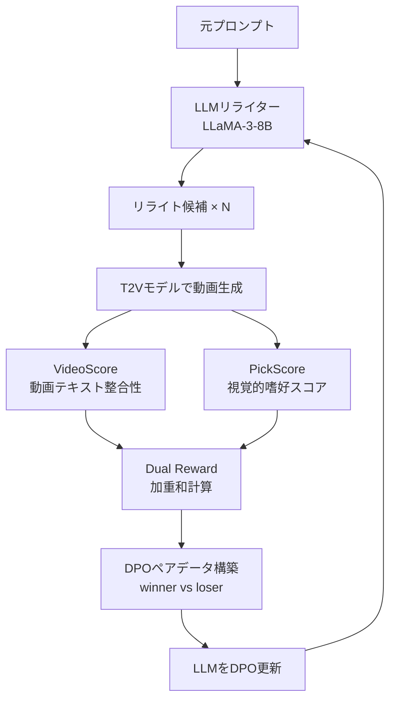

本記事は [Prompt-A-Video: Prompt Your Video Diffusion Model via Preference-Aligned LLM (arXiv:2412.15156)](https://arxiv.org/abs/2412.15156) の解説記事です。

## 論文概要（Abstract）

Prompt-A-Videoは、T2V（Text-to-Video）拡散モデル向けのプロンプト最適化を、選好整合LLMで自動化するフレームワークである。VideoScore（動画品質）とPickScore（人間の視覚的嗜好）を組み合わせたDual Reward機構でLLMをDPOファインチューニングし、モデル非依存のプロンプトリライターを構築する。著者らは、単一のリライターが複数のT2Vモデル（VideoCrafter2、OpenSora、ModelScope）で有効に機能することを実験で示している。

この記事は [Zenn記事: Wan2.2動画生成AIのプロンプトチューニング最新手法─手動設計から自動最適化まで](https://zenn.dev/0h_n0/articles/eb5efe13385e73) の深掘りです。

## 情報源

- **arXiv ID**: 2412.15156
- **URL**: https://arxiv.org/abs/2412.15156
- **著者**: Jiaying Tang, Yunpeng Luo, Xiangyu Chen et al.
- **発表年**: 2024年12月
- **分野**: cs.CV, cs.AI
- **採択**: ICCV 2025

## 背景と動機（Background & Motivation）

T2Vモデルの品質はプロンプトの質に強く依存する。しかし動画生成に適したプロンプトの書き方は、静止画生成以上に複雑である。時間軸上のモーション、カメラワーク、照明変化など多くの要素を自然言語で記述する必要がある。

先行研究のVideoDirectorGPTやLLaVA-based rewriteは、汎用LLMの知識に依存しており、動画生成特有の品質指標を直接最適化していない。これに対しPrompt-A-Videoは、動画品質と人間嗜好を直接的な報酬信号として用い、T2Vモデルに最適化されたプロンプトリライトを学習する。

さらに、特定のT2Vモデルに特化せず、複数のモデルで汎用的に機能するリライターを実現することが、本研究の重要な設計目標である。

## 主要な貢献（Key Contributions）

- **貢献1**: VideoScoreとPickScoreを組み合わせたDual Reward機構の提案。動画品質と人間嗜好の2軸で報酬を設計
- **貢献2**: DPOによるLLMファインチューニングで、T2Vモデル非依存のプロンプトリライターを実現
- **貢献3**: EvalCrafterとVBenchの2つのベンチマークで、既存手法を上回る性能を実証
- **貢献4**: 1万件の（元プロンプト、最適化プロンプト、生成動画）トリプレットデータセットの構築

## 技術的詳細（Technical Details）

### 全体パイプライン



### Dual Reward機構

著者らは2つの報酬信号を加重和で組み合わせている:

$$
R(v, p) = \alpha \cdot R_{\text{video}}(v, p) + (1 - \alpha) \cdot R_{\text{pick}}(v)
$$

ここで、
- $v$: 生成された動画
- $p$: リライト後のプロンプト
- $R_{\text{video}}(v, p)$: VideoScoreによるテキスト-動画整合性スコア
- $R_{\text{pick}}(v)$: PickScoreによる視覚的嗜好スコア
- $\alpha$: 2つの報酬の重み（ハイパーパラメータ）

**VideoScore**は、動画とプロンプトの意味的整合性を5つの次元（visual quality, temporal consistency, dynamic degree, text-video alignment, factual consistency）で評価する学習済みモデルである。

**PickScore**は、人間の視覚的嗜好を学習した画像品質評価モデルであり、動画の各フレームに適用してフレーム平均で動画レベルのスコアを算出する。

### DPOによるリライター訓練

Dual Rewardスコアに基づき、同一元プロンプトに対する複数リライトのペアを構築:

$$
\mathcal{L}_{\text{DPO}} = -\mathbb{E}_{(x, y_w, y_l) \sim \mathcal{D}} \left[ \log \sigma \left( \beta \left( \log \frac{\pi_\theta(y_w \mid x)}{\pi_{\text{ref}}(y_w \mid x)} - \log \frac{\pi_\theta(y_l \mid x)}{\pi_{\text{ref}}(y_l \mid x)} \right) \right) \right]
$$

ここで、
- $\mathcal{D}$: DPOペアデータセット
- $y_w, y_l$: Dual Rewardスコアに基づくwinner/loserリライト
- $\pi_\theta$: 訓練中のリライターLLM
- $\pi_{\text{ref}}$: 参照ポリシー（SFTモデル）
- $\beta$: KL正則化の強さ

### データセット構築プロセス

```python
from dataclasses import dataclass
from typing import List

@dataclass
class RewritePair:
    """DPO訓練用のリライトペアデータ"""
    original_prompt: str
    winner_rewrite: str
    loser_rewrite: str
    winner_reward: float
    loser_reward: float

def build_dpo_dataset(
    prompts: List[str],
    rewriter,           # SFTで初期訓練済みのLLM
    video_generator,    # T2Vモデル
    video_scorer,       # VideoScoreモデル
    pick_scorer,        # PickScoreモデル
    n_candidates: int = 8,
    alpha: float = 0.7,
) -> List[RewritePair]:
    """DPOペアデータセットを構築する

    Args:
        prompts: 元プロンプトのリスト
        rewriter: プロンプトリライターLLM
        video_generator: T2Vモデル
        video_scorer: VideoScore評価モデル
        pick_scorer: PickScore評価モデル
        n_candidates: 各プロンプトに対するリライト候補数
        alpha: VideoScoreの重み

    Returns:
        DPOペアデータのリスト
    """
    pairs = []

    for prompt in prompts:
        # リライト候補を生成
        candidates = [
            rewriter.rewrite(prompt)
            for _ in range(n_candidates)
        ]

        # 各候補の報酬を計算
        scored = []
        for cand in candidates:
            video = video_generator.generate(cand)
            r_video = video_scorer.score(video, cand)
            r_pick = pick_scorer.score(video)
            reward = alpha * r_video + (1 - alpha) * r_pick
            scored.append((cand, reward))

        # 最高/最低スコアのペアを選択
        scored.sort(key=lambda x: x[1], reverse=True)
        winner, w_score = scored[0]
        loser, l_score = scored[-1]

        pairs.append(RewritePair(
            original_prompt=prompt,
            winner_rewrite=winner,
            loser_rewrite=loser,
            winner_reward=w_score,
            loser_reward=l_score,
        ))

    return pairs
```

## 実装のポイント（Implementation）

著者らの報告に基づく実装上の要点:

- **ベースモデル**: LLaMA-3-8BをSFTで初期訓練後、DPOで選好最適化。商用利用時はMeta LLaMAライセンスの確認が必要
- **α値の選択**: $\alpha = 0.7$（VideoScore寄り）が著者らの実験では最良と報告されている。$\alpha$の値が性能に影響するため、タスクに応じた調整が推奨される
- **推論時のコスト**: LLM1回の推論のみ（1秒未満の追加レイテンシ）。T2Vモデル自体への変更は不要
- **リライト候補数**: 訓練時は8候補、推論時は1候補（最終的に1つのリライトのみ出力）
- **対応する動画長**: 主に短尺動画（2-4秒）で評価。10秒以上の長尺動画での時間的一貫性改善は限定的と著者らが指摘

## 実験結果（Results）

### EvalCrafterベンチマーク（論文Table 1より）

| 手法 | Visual Quality | Text Alignment | Motion Quality | 総合 |
|------|---------------|---------------|---------------|------|
| 元プロンプト | 72.1 | 68.5 | 71.3 | 70.6 |
| ChatGPTリライト | 73.8 | 70.2 | 72.0 | 72.0 |
| VideoDirectorGPT | 74.1 | 71.0 | 72.5 | 72.5 |
| **Prompt-A-Video** | **75.9** | **73.4** | **73.8** | **74.4** |

著者らの報告では、EvalCrafter全指標平均でベースライン比+3.8%の改善が得られている。

### VBenchスコア（論文Table 2より）

VBenchでの評価では、semantic consistencyで+4.2pt、motion smoothnessで+1.9ptの改善が報告されている。

### 人間評価

64.3%のケースでPrompt-A-Videoが元プロンプトより好まれたと報告されている。

### モデル間汎化

VideoCrafter2で訓練したリライターをOpenSoraとModelScopeに適用した場合でも、品質改善が確認されている。これはリライターがモデル固有の知識ではなく、動画生成全般に有効なプロンプトパターンを学習していることを示唆する。

## 実運用への応用（Practical Applications）

### Wan2.2との組み合わせ

Zenn記事で紹介されているWan2.2のプロンプトチューニングと組み合わせる場合、以下のアプローチが考えられる:

1. **Step 1**: ユーザーの短いプロンプトをPrompt-A-Videoリライターで拡張
2. **Step 2**: Wan2.2の`prompt_extend`で追加の詳細化（オプション）
3. **Step 3**: Wan2.2で動画生成

### VPOとの比較

| 観点 | Prompt-A-Video | VPO |
|------|---------------|-----|
| ベースLLM | LLaMA-3-8B | Qwen2.5-7B |
| 報酬信号 | VideoScore + PickScore | VBench（16次元） |
| モデル汎化 | 設計目標として明示 | 実験で確認 |
| 安全性最適化 | 間接的（品質指標に含まれる） | 明示的（3原則の1つ） |
| 評価対象モデル | VideoCrafter2, OpenSora, ModelScope | CogVideoX-5B, Wan2.1, HunyuanVideo |

### 制約と注意点

- 評価対象のT2Vモデルが比較的古い（VideoCrafter2, OpenSora）ため、最新モデル（Wan2.2、HunyuanVideo）での直接的な実績は限定的
- PickScoreはフレーム単位で評価するため、時間方向の品質（モーションの自然さ等）の評価が弱い
- 長尺動画（10秒以上）でのパフォーマンスは検証されていない

## 関連研究（Related Work）

- **VPO (arXiv:2503.20491)**: 同じくDPOベースだが、VBenchスコアを直接報酬にする。安全性を明示的に最適化する3原則を提案。2025年3月発表
- **VideoDirectorGPT**: GPT-4を使ったプロンプト拡張。報酬ベースの最適化は行わない
- **DRaFT (Denoising as Reward-weighted Fine-Tuning)**: 画像拡散モデルのRLHF手法。プロンプト側ではなくモデル側を最適化するアプローチ

## まとめと今後の展望

Prompt-A-Videoは、VideoScoreとPickScoreのDual Rewardとdirect preference optimizationを組み合わせることで、T2Vモデル非依存のプロンプトリライターを実現した。モデル間汎化性能が特筆すべき特徴であり、新しいT2Vモデルが登場しても追加のファインチューニングなしで適用可能である。今後は、最新のT2Vモデル（Wan2.2、Sora等）での評価や、長尺動画対応、時間方向の品質を明示的に最適化する報酬設計が重要な研究方向となる。

## 参考文献

- **arXiv**: [https://arxiv.org/abs/2412.15156](https://arxiv.org/abs/2412.15156)
- **Project Page**: [https://prompt-a-video.github.io](https://prompt-a-video.github.io)
- **Code**: [https://github.com/jiyt17/prompt-a-video](https://github.com/jiyt17/prompt-a-video)
- **Related Zenn article**: [https://zenn.dev/0h_n0/articles/eb5efe13385e73](https://zenn.dev/0h_n0/articles/eb5efe13385e73)
