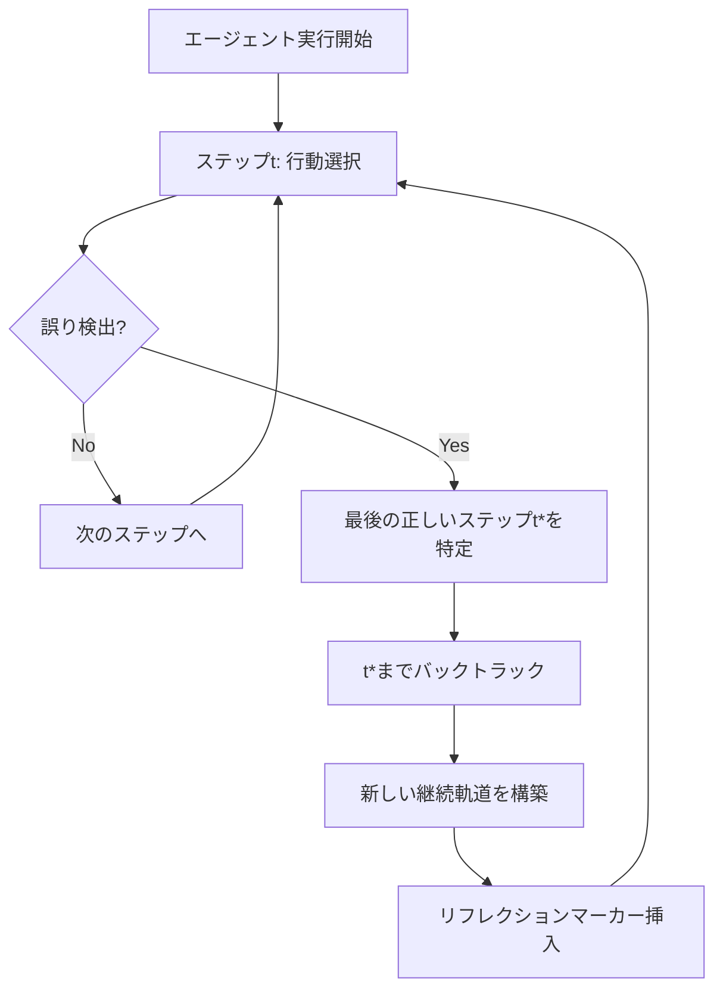

本記事は [arXiv:2501.04682 "Agent-R: Training Language Model Agents to Reflect via In-Context Episodic Memory"](https://arxiv.org/abs/2501.04682) の解説記事です。

## 論文概要（Abstract）

Agent-Rは、LLMベースのエージェントがタスク実行中にリアルタイムで誤りを検出し、エピソード記憶を用いてバックトラックする反省（Reflection）フレームワークである。従来のReflexion（タスク完了後の反省）やLATS（ステップごとの木探索）とは異なり、MCTSで特定した「最後の正しいステップ」まで遡って新しい軌道を構築する。MCTS誘導型の反復学習パイプラインにより、推論時の追加コストなしにリフレクション能力を獲得する。

この記事は [Zenn記事: Bedrock AgentCoreのエピソード記憶×Policy制御でマルチターンエージェントの応答精度を高める](https://zenn.dev/0h_n0/articles/d811758c7ad31e) の深掘りです。

## 情報源

- **arXiv ID**: 2501.04682
- **URL**: [https://arxiv.org/abs/2501.04682](https://arxiv.org/abs/2501.04682)
- **著者**: Shuofei Qiao, Ningyu Zhang, Runnan Fang et al.（浙江大学, Alibaba Tongyi Lab）
- **発表年**: 2025年1月
- **分野**: cs.AI, cs.CL

## 背景と動機（Background & Motivation）

LLMベースのエージェントは、Web操作やロボット制御などの複雑なタスクで成果を上げているが、タスク実行中に発生する誤りへの対応が課題として残されている。著者らは既存のリフレクション手法を2つのパラダイムに分類している。

**タスク後リフレクション**（Reflexion: Shinn et al., 2024）は、タスク失敗後に言語的なフィードバックを生成してリトライする手法だが、誤りが蓄積した後に初めて修正が試みられるため、効率が低い。**ステップレベルリフレクション**（LATS: Liu et al., 2023）は各ステップで木探索を行うが、推論時に高い計算コストがかかる。

Agent-Rはこれらの制約を、**実行中の軌道内リフレクション**（in-trajectory reflection）という第3のパラダイムで解決することを目指している。

## 主要な貢献（Key Contributions）

- **リアルタイムリフレクション機構**: タスク失敗を待たず、実行中にMCTSで特定した「最後の正しいステップ」までバックトラックし、新しい継続軌道を構築する
- **MCTS誘導型反復学習パイプライン**: 現在のモデルの能力に合わせたリフレクティブ訓練データをオンラインで合成し、分布シフト問題を回避する
- **推論コストの低減**: MCTSは訓練時のみ使用し、推論時には追加の探索コストが不要

## 技術的詳細（Technical Details）

### リフレクションのアーキテクチャ

Agent-Rのリフレクションは2段階で動作する。



**Stage 1 — 誤り検出**: 各ステップでエージェントが現在の軌道の妥当性を評価する。タスク失敗まで待つのではなく、実行中に反省を発火できる。

**Stage 2 — バックトラックによる回復**: 反省が発火すると、以下の手順で回復する。

1. **最後の正しいステップ**（目標到達可能な最も遅いステップ）を特定
2. そのステップまでエピソード記憶内で遡る
3. 新しい継続軌道を誤りを回避しつつ構築

### エピソード記憶の構成

エピソード記憶はLLMのコンテキスト内に保持され、以下の要素で構成される。

- **現在の軌道セグメント**: 開始点（または前回のリフレクション点）から現在のステップまでの（観察, 行動）ペアの系列
- **リフレクションマーカー**: エージェントがリフレクションモードに入ったことを示す特殊テキスト
- **バックトラック履歴**: 遡ったと判定された部分の軌道（マーカーで区別）

モデルは誤った経路（マーカー付き）と新しい試行の両方をコンテキスト内で参照でき、情報に基づいた意思決定が可能になる。

### MCTS誘導型訓練データ構築

著者らは訓練データ構築にMonte Carlo Tree Search（MCTS）を用いている。

**アルゴリズム概要**:

1. 現在のモデルでタスクを実行し、軌道 $\tau$ を生成
2. $\tau$ が失敗した場合、MCTSを適用
3. 失敗軌道の各ステップ $t$ について、そこから目標到達可能かをMCTSロールアウトで評価
4. 最後の正しいステップ $t^*$ を特定:

$$
t^* = \max \{ t : V_{\text{MCTS}}(s_t) > 0 \}
$$

ここで $V_{\text{MCTS}}(s_t)$ は状態 $s_t$ からのMCTS推定成功確率である。

5. $s_{t^*}$ からMCTSで成功パスを探索し、回復軌道を構築
6. [元の軌道（$t^*$まで）] + [リフレクションマーカー] + [回復パス] を訓練データとして使用

### 反復学習パイプライン

訓練は以下の反復構造で行われる。

- **ラウンド0**: ベースモデル（LLaMA-3-8BまたはQwen2.5-7B）
- **ラウンドk**: ラウンドk-1のモデルで軌道を生成 → MCTSでリフレクティブ訓練例を合成 → SFTで微調整
- 3ラウンドまで実施

著者らは、オフラインの静的データセット（固定された教師モデルによる合成）と比較して、反復的なオンライン合成が学習中のモデル能力に適応する点で優位であると主張している。

**訓練の設定**:
- 最適化: AdamW、学習率 $2 \times 10^{-5}$（cosine decay）
- バッチサイズ: 16、エポック数: 3（各ラウンド）
- MCTSパラメータ: 探索定数 $C = 1.5$、最大ロールアウト深度 20、ノードあたりロールアウト数 3
- ハードウェア: 8× A100 80GB GPU

## 実装のポイント（Implementation）

Agent-Rの実装で注意すべき点は以下の通りである。

- **コンテキスト長の管理**: エピソード記憶はLLMのコンテキストウィンドウ内に保持されるため、軌道が長い場合にコンテキスト長制限に達する可能性がある。著者らはリフレクション後に誤り部分を圧縮する方法を採用
- **リフレクションマーカーの設計**: マーカーの有無で成功率が5.8ポイント変動する（論文Table 3相当のアブレーション結果より）。マーカーは誤った経路と新しい継続を明確に区別するために不可欠
- **MCTSのコスト**: MCTS誘導型データ構築は計算コストが高い（8× A100 GPU）。推論時にはMCTSを使用しないが、訓練パイプライン全体のコストは考慮が必要
- **環境の可逆性**: Agent-Rはバックトラックを前提としているため、不可逆な行動を持つ環境（本番Webサービスへの操作など）では追加的な安全機構が必要

## 実験結果（Results）

著者らは3つのマルチステップ推論環境で評価を実施している。

### ALFWorld（テキストベース家庭内タスク、134テストタスク）

| 手法 | ベースモデル | 成功率 (%) |
|------|------------|-----------|
| Direct（反省なし） | LLaMA-3-8B | 41.0 |
| Reflexion | LLaMA-3-8B | 53.7 |
| LATS | LLaMA-3-8B | 56.3 |
| ETO | LLaMA-3-8B | 62.7 |
| **Agent-R (Round 3)** | LLaMA-3-8B | **74.9** |
| Direct | Qwen2.5-7B | 44.8 |
| **Agent-R (Round 3)** | Qwen2.5-7B | **78.2** |

（論文Table 1より）

### WebShop（Eコマースナビゲーション、200テストタスク）

| 手法 | ベースモデル | スコア | 成功率 (%) |
|------|------------|--------|-----------|
| Direct | LLaMA-3-8B | 52.3 | 18.5 |
| **Agent-R (Round 3)** | LLaMA-3-8B | **69.4** | **35.5** |
| **Agent-R (Round 3)** | Qwen2.5-7B | **72.1** | **38.5** |

（論文Table 2より）

### ScienceWorld（科学実験シミュレーション、2246テストタスク）

| 手法 | ベースモデル | スコア | 成功率 (%) |
|------|------------|--------|-----------|
| Direct | LLaMA-3-8B | 38.4 | 22.1 |
| **Agent-R (Round 3)** | LLaMA-3-8B | **59.7** | **41.2** |
| **Agent-R (Round 3)** | Qwen2.5-7B | **62.8** | **44.7** |

（論文Table 3より）

### リフレクション効率

著者らの分析では、誤りからの回復に要するステップ数について以下が報告されている。

- **フルリスタート（Reflexion方式）**: 平均18.3ステップ
- **Agent-Rバックトラック**: 平均6.7ステップ

Agent-Rはフルリスタートの約37%のステップ数で回復を達成している。

### アブレーション分析

| 変種 | ALFWorld 成功率 (%) |
|------|-------------------|
| 反省なし（Direct） | 41.0 |
| 最初のエラーで反省 | 58.4 |
| **最後の正しいステップで反省（Agent-R）** | **74.9** |
| ランダムステップで反省 | 49.7 |
| オフラインデータ合成 | 66.4 |
| **反復的オンライン合成（Agent-R）** | **74.9** |

（論文Section 6.3より）

バックトラック位置の選択が性能に大きく影響し、MCTSによる「最後の正しいステップ」の特定がオラクル（79.1%）に近い性能を達成している。

## Production Deployment Guide

### AWS実装パターン（コスト最適化重視）

Agent-Rのリフレクション機構をプロダクション環境に展開する場合、以下の構成が考えられる。

**トラフィック量別の推奨構成**:

| 規模 | 月間リクエスト | 推奨構成 | 月額コスト | 主要サービス |
|------|--------------|---------|-----------|------------|
| **Small** | ~3,000 (100/日) | Serverless | $50-150 | Lambda + Bedrock + DynamoDB |
| **Medium** | ~30,000 (1,000/日) | Hybrid | $300-800 | Lambda + ECS Fargate + ElastiCache |
| **Large** | 300,000+ (10,000/日) | Container | $2,000-5,000 | EKS + Karpenter + EC2 Spot |

**Small構成の詳細** (月額$50-150):
- **Lambda**: 1GB RAM, 60秒タイムアウト ($20/月)
- **Bedrock**: Claude 3.5 Haiku, Prompt Caching有効 ($80/月)
- **DynamoDB**: On-Demand、エピソード記憶保存 ($10/月)
- **CloudWatch**: 基本監視 ($5/月)

**コスト削減テクニック**:
- Spot Instances使用で最大90%削減（EKS + Karpenter）
- Bedrock Batch API使用で50%削減（非リアルタイム処理）
- Prompt Caching有効化で30-90%削減
- エピソード記憶のTTL設定でDynamoDBストレージコスト削減

**コスト試算の注意事項**:
- 上記は2026年3月時点のAWS ap-northeast-1（東京）リージョン料金に基づく概算値です
- 実際のコストはトラフィックパターン、リージョン、バースト使用量により変動します
- 最新料金は [AWS料金計算ツール](https://calculator.aws/) で確認してください

### Terraformインフラコード

**Small構成 (Serverless): Lambda + Bedrock + DynamoDB**

```hcl
module "vpc" {
  source  = "terraform-aws-modules/vpc/aws"
  version = "~> 5.0"

  name = "agent-r-vpc"
  cidr = "10.0.0.0/16"
  azs  = ["ap-northeast-1a", "ap-northeast-1c"]
  private_subnets = ["10.0.1.0/24", "10.0.2.0/24"]

  enable_nat_gateway   = false
  enable_dns_hostnames = true
}

resource "aws_iam_role" "lambda_agent" {
  name = "agent-r-lambda-role"

  assume_role_policy = jsonencode({
    Version = "2012-10-17"
    Statement = [{
      Action    = "sts:AssumeRole"
      Effect    = "Allow"
      Principal = { Service = "lambda.amazonaws.com" }
    }]
  })
}

resource "aws_iam_role_policy" "bedrock_invoke" {
  role = aws_iam_role.lambda_agent.id
  policy = jsonencode({
    Version = "2012-10-17"
    Statement = [{
      Effect   = "Allow"
      Action   = ["bedrock:InvokeModel", "bedrock:InvokeModelWithResponseStream"]
      Resource = "arn:aws:bedrock:ap-northeast-1::foundation-model/anthropic.claude-3-5-haiku*"
    }]
  })
}

resource "aws_lambda_function" "agent_handler" {
  filename      = "lambda.zip"
  function_name = "agent-r-handler"
  role          = aws_iam_role.lambda_agent.arn
  handler       = "index.handler"
  runtime       = "python3.12"
  timeout       = 60
  memory_size   = 1024

  environment {
    variables = {
      BEDROCK_MODEL_ID    = "anthropic.claude-3-5-haiku-20241022-v1:0"
      DYNAMODB_TABLE      = aws_dynamodb_table.episodic_memory.name
      REFLECTION_ENABLED  = "true"
    }
  }
}

resource "aws_dynamodb_table" "episodic_memory" {
  name         = "agent-r-episodic-memory"
  billing_mode = "PAY_PER_REQUEST"
  hash_key     = "session_id"
  range_key    = "step_id"

  attribute {
    name = "session_id"
    type = "S"
  }
  attribute {
    name = "step_id"
    type = "N"
  }

  ttl {
    attribute_name = "expire_at"
    enabled        = true
  }
}

resource "aws_cloudwatch_metric_alarm" "lambda_cost" {
  alarm_name          = "agent-r-cost-spike"
  comparison_operator = "GreaterThanThreshold"
  evaluation_periods  = 1
  metric_name         = "Duration"
  namespace           = "AWS/Lambda"
  period              = 3600
  statistic           = "Sum"
  threshold           = 100000
  alarm_description   = "Lambda実行時間異常（コスト急増の可能性）"

  dimensions = {
    FunctionName = aws_lambda_function.agent_handler.function_name
  }
}
```

**Large構成 (Container): EKS + Karpenter + Spot Instances**

```hcl
module "eks" {
  source  = "terraform-aws-modules/eks/aws"
  version = "~> 20.0"

  cluster_name    = "agent-r-cluster"
  cluster_version = "1.31"
  vpc_id          = module.vpc.vpc_id
  subnet_ids      = module.vpc.private_subnets

  cluster_endpoint_public_access           = true
  enable_cluster_creator_admin_permissions = true
}

resource "kubectl_manifest" "karpenter_provisioner" {
  yaml_body = <<-YAML
    apiVersion: karpenter.sh/v1
    kind: NodePool
    metadata:
      name: spot-pool
    spec:
      template:
        spec:
          requirements:
            - key: karpenter.sh/capacity-type
              operator: In
              values: ["spot"]
            - key: node.kubernetes.io/instance-type
              operator: In
              values: ["g5.xlarge", "g5.2xlarge"]
          limits:
            cpu: "32"
            memory: "128Gi"
      disruption:
        consolidationPolicy: WhenEmpty
        consolidateAfter: 30s
  YAML
}

resource "aws_budgets_budget" "monthly" {
  name         = "agent-r-monthly-budget"
  budget_type  = "COST"
  limit_amount = "5000"
  limit_unit   = "USD"
  time_unit    = "MONTHLY"

  notification {
    comparison_operator        = "GREATER_THAN"
    threshold                  = 80
    threshold_type             = "PERCENTAGE"
    notification_type          = "ACTUAL"
    subscriber_email_addresses = ["ops@example.com"]
  }
}
```

### セキュリティベストプラクティス

- IAMロール: 最小権限の原則（Bedrock InvokeModelのみ許可）
- ネットワーク: VPC内配置、パブリックアクセス最小化
- シークレット: Secrets Manager使用、環境変数へのハードコード禁止
- 暗号化: DynamoDB/S3はKMS暗号化、TLS 1.2以上必須
- 監査: CloudTrail全リージョン有効化

### 運用・監視設定

```sql
-- CloudWatch Logs Insights: リフレクション発生頻度
fields @timestamp, session_id, reflection_triggered, recovery_steps
| stats count(*) as reflections, avg(recovery_steps) as avg_recovery by bin(1h)
| filter reflection_triggered = true

-- レイテンシ分析
fields @timestamp, duration_ms
| stats pct(duration_ms, 95) as p95, pct(duration_ms, 99) as p99 by bin(5m)
```

```python
import boto3

cloudwatch = boto3.client('cloudwatch')

cloudwatch.put_metric_alarm(
    AlarmName='agent-r-reflection-spike',
    ComparisonOperator='GreaterThanThreshold',
    EvaluationPeriods=1,
    MetricName='ReflectionCount',
    Namespace='AgentR/Custom',
    Period=3600,
    Statistic='Sum',
    Threshold=100,
    AlarmDescription='リフレクション頻度異常（モデル劣化の可能性）'
)
```

### コスト最適化チェックリスト

- [ ] ~100 req/日 → Lambda + Bedrock (Serverless) - $50-150/月
- [ ] ~1000 req/日 → ECS Fargate + Bedrock (Hybrid) - $300-800/月
- [ ] 10000+ req/日 → EKS + Spot Instances (Container) - $2,000-5,000/月
- [ ] EC2: Spot Instances優先（最大90%削減）
- [ ] Reserved Instances: 1年コミットで72%削減
- [ ] Bedrock Batch API: 50%割引（非リアルタイム処理）
- [ ] Prompt Caching: 30-90%削減
- [ ] DynamoDBエピソード記憶: TTL設定でストレージ最適化
- [ ] Lambda: メモリサイズ最適化（CloudWatch Insights分析）
- [ ] AWS Budgets: 月額予算設定（80%で警告、100%でアラート）
- [ ] CloudWatch アラーム: リフレクション頻度スパイク検知
- [ ] Cost Anomaly Detection: 自動異常検知
- [ ] 日次コストレポート: SNS/Slackへ自動送信
- [ ] 未使用リソース削除: Lambda Insights活用
- [ ] タグ戦略: 環境別（dev/staging/prod）でコスト可視化
- [ ] S3キャッシュ: ライフサイクルポリシー（30日）
- [ ] 開発環境: 夜間停止（Auto Start/Stop）
- [ ] エピソード記憶: ネームスペース分離でクエリ効率化
- [ ] モデル選択: Haiku（$0.25/MTok）vs Sonnet（$3/MTok）タスク複雑度で切替
- [ ] max_tokens設定: 過剰生成防止

## 実運用への応用（Practical Applications）

Agent-Rのリフレクション機構は、Zenn記事で紹介されているBedrock AgentCoreのエピソード記憶と組み合わせて活用できる可能性がある。

AgentCoreのExtraction→Consolidation→Reflectionパイプラインがバックグラウンドで知見を蓄積するのに対し、Agent-R方式は**実行中のリアルタイム修正**を提供する。両者は補完的な関係にある。

- **短期的な誤り訂正**: Agent-R方式のコンテキスト内バックトラック
- **長期的なパターン学習**: AgentCoreエピソード記憶のReflection

運用上の課題として、Agent-Rは環境の可逆性を前提としているため、本番環境でのAPI呼び出しやデータベース操作など不可逆な行動に対しては、AgentCore PolicyのCedarベースの事前チェックと組み合わせる設計が有効である。

## 関連研究（Related Work）

- **Reflexion** (Shinn et al., 2024): タスク後の言語フィードバックによるリトライ。Agent-Rとは異なり、実行中のリフレクションは行わない
- **LATS** (Liu et al., 2023): LLMを評価関数としたMCTS推論時探索。高精度だが推論コストが高い
- **ETO** (Cheng et al., 2024): オフラインのエキスパート軌道最適化。静的データセットのため分布シフトの問題がある
- **CoALA** (arXiv:2309.02427): エピソード記憶・意味記憶・手続き記憶を含むエージェント認知アーキテクチャの概念的フレームワーク

## まとめと今後の展望

Agent-Rは、MCTSによる「最後の正しいステップ」の特定とエピソード記憶内でのバックトラックを組み合わせることで、従来手法（Reflexion, LATS, ETO）を上回る性能を達成した。著者らの報告では、ALFWorldで74.9%（LLaMA-3-8B）/ 78.2%（Qwen2.5-7B）の成功率を記録し、回復ステップ数もフルリスタートの37%に削減されている。

論文の制約として、評価はテキストベースのシミュレーション環境に限定されている点、MCTSベースの訓練データ構築に高い計算コスト（8× A100 GPU）がかかる点が挙げられる。今後の方向性として、著者らはマルチモーダルエージェントへの拡張、実世界Webエージェントへの適用、プロセス報酬モデルとの統合を提案している。

## 参考文献

- **arXiv**: [https://arxiv.org/abs/2501.04682](https://arxiv.org/abs/2501.04682)
- **Related Zenn article**: [https://zenn.dev/0h_n0/articles/d811758c7ad31e](https://zenn.dev/0h_n0/articles/d811758c7ad31e)
- Shinn, N., Cassano, F., et al. (2024). Reflexion: Language Agents with Verbal Reinforcement Learning. NeurIPS 2023.
- Liu, J., et al. (2023). LATS: Language Agent Tree Search. arXiv:2310.04406.
- Cheng, K., et al. (2024). ETO: Expert Trajectory Optimization for LLM Agent Training.

---

:::message
この記事はAI（Claude Code）により自動生成されました。論文の主張や数値は原著論文に基づいていますが、実際の利用時は原論文もご確認ください。
:::
