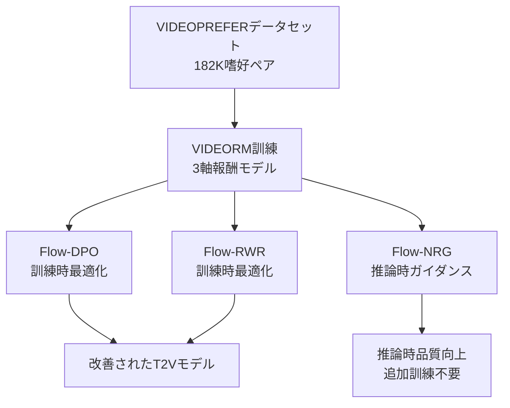

本記事は [Improving Video Generation with Human Feedback (arXiv:2501.13918)](https://arxiv.org/abs/2501.13918) の解説記事です。

## 論文概要（Abstract）

本論文は、人間の嗜好フィードバックを活用して動画生成モデルの品質を改善する統合フレームワークを提案する。16,000プロンプトを12のT2Vモデルで生成し、182,000件のアノテーション付き嗜好データセット「VIDEOPREFER」を構築した。このデータから汎用的な動画報酬モデル「VIDEORM」を訓練し、訓練時（Flow-DPO、Flow-RWR）と推論時（Flow-NRG）の両方でT2Vモデルの品質を改善する3つの手法を提案している。著者らは、Visual Quality、Motion Quality、Text Alignmentの3軸で品質改善を報告している。

この記事は [Zenn記事: Wan2.2動画生成AIのプロンプトチューニング最新手法─手動設計から自動最適化まで](https://zenn.dev/0h_n0/articles/eb5efe13385e73) の深掘りです。

## 情報源

- **arXiv ID**: 2501.13918
- **URL**: https://arxiv.org/abs/2501.13918
- **著者**: Microsoft Research チーム
- **発表年**: 2025年1月
- **分野**: cs.CV, cs.AI

## 背景と動機（Background & Motivation）

RLHF（Reinforcement Learning from Human Feedback）は大規模言語モデル（LLM）のアラインメントで成功を収めたが、動画生成モデルへの適用は以下の理由で困難だった:

- 動画品質の評価は画像以上に多次元的（画質、モーション、テキスト整合性、時間的一貫性）
- 大規模な嗜好データセットの構築コストが高い
- Flow Matchingベースのモデル（Wan2.1等）に対するRLHFの理論的基盤が不十分

本論文は、これらの課題に対し、大規模嗜好データセットの構築から報酬モデルの訓練、そしてT2Vモデルの改善手法まで、End-to-Endのフレームワークを提案する。

## 主要な貢献（Key Contributions）

- **貢献1**: VIDEOPREFER - 16Kプロンプト×12モデルで182K件の嗜好アノテーション付きデータセット
- **貢献2**: VIDEORM - Visual Quality、Motion Quality、Text Alignmentの3軸で動画を評価する汎用報酬モデル
- **貢献3**: Flow-DPO / Flow-RWR - Flow Matchingモデルに対するDPOとReward-Weighted Regressionの訓練手法
- **貢献4**: Flow-NRG - 推論時に報酬勾配でサンプリングを誘導するtraining-freeな手法

## 技術的詳細（Technical Details）

### 全体フレームワーク



### VIDEOPREFERデータセット

著者らが構築した大規模嗜好データセットの詳細:

| 項目 | 値 |
|------|-----|
| プロンプト数 | 16,000 |
| T2Vモデル数 | 12（CogVideoX, OpenSora等） |
| 生成動画数 | 約192,000 |
| アノテーション数 | 182,000 |
| 評価次元 | Visual Quality, Motion Quality, Text Alignment |
| アノテーション形式 | ペア比較（A vs B） |

各嗜好ペアは3つの次元それぞれで独立にアノテーションされ、次元ごとの選好学習が可能になっている。

### VIDEORM（報酬モデル）

VIDEORMは3つの軸で動画品質を評価する:

$$
R(v, p) = [R_{\text{VQ}}(v), R_{\text{MQ}}(v), R_{\text{TA}}(v, p)]
$$

ここで、
- $R_{\text{VQ}}(v)$: Visual Quality スコア（画質、解像度、アーティファクト）
- $R_{\text{MQ}}(v)$: Motion Quality スコア（モーションの自然さ、一貫性）
- $R_{\text{TA}}(v, p)$: Text Alignment スコア（プロンプト$p$との整合性）

報酬モデルの訓練はBradley-Terryモデルに基づく:

$$
\mathcal{L}_{\text{RM}} = -\mathbb{E}_{(v_w, v_l, p)} \left[ \log \sigma(R(v_w, p) - R(v_l, p)) \right]
$$

ここで、
- $v_w$: 人間が好んだ動画（winner）
- $v_l$: 人間が好まなかった動画（loser）

### Flow-DPO（Direct Preference Optimization for Flow Matching）

従来のDPOはDDPM（離散ノイズスケジュール）向けに設計されていたが、Flow-DPOはFlow Matching（連続フロー）に対応するよう拡張されている:

$$
\mathcal{L}_{\text{Flow-DPO}} = -\mathbb{E}_{t, (z_w, z_l)} \left[ \log \sigma \left( \beta \left( \| v_\theta(z_t^w, t, c) - u^w \|^2 - \| v_{\text{ref}}(z_t^w, t, c) - u^w \|^2 \right. \right. \right.
$$

$$
\left. \left. \left. - \| v_\theta(z_t^l, t, c) - u^l \|^2 + \| v_{\text{ref}}(z_t^l, t, c) - u^l \|^2 \right) \right) \right]
$$

ここで、
- $v_\theta$: 訓練中のFlow Matchingモデルの速度場
- $v_{\text{ref}}$: 参照モデル（SFT後）の速度場
- $z_t^w, z_t^l$: winner/loser動画の時刻$t$での潜在表現
- $u^w, u^l$: 対応するground truth速度
- $c$: テキスト条件

### Flow-RWR（Reward-Weighted Regression）

Flow-RWRは、報酬で重み付けされた回帰損失でモデルを更新する:

$$
\mathcal{L}_{\text{Flow-RWR}} = -\mathbb{E}_{t, z_0} \left[ w(R(z_0, c)) \cdot \| v_\theta(z_t, t, c) - (z_1 - z_0) \|^2 \right]
$$

ここで $w(R)$ はVIDEORMスコアに基づく重み関数。高品質な動画ほど大きな重みが付与される。

### Flow-NRG（Negative Reward Guidance）

Flow-NRGは推論時に報酬モデルの勾配をサンプリングプロセスに注入する**training-free**な手法:

$$
\tilde{v}_\theta(z_t, t, c) = v_\theta(z_t, t, c) + \eta \cdot \nabla_{z_t} R(z_t, c)
$$

ここで、
- $\eta$: ガイダンス強度（ハイパーパラメータ）
- $\nabla_{z_t} R$: 報酬モデルの潜在変数に対する勾配

```python
import torch

def flow_nrg_step(
    model,
    reward_model,
    z_t: torch.Tensor,
    t: float,
    condition: torch.Tensor,
    eta: float = 0.1,
) -> torch.Tensor:
    """Flow-NRGの1ステップ推論

    Args:
        model: Flow Matchingモデル
        reward_model: VIDEORM報酬モデル
        z_t: 現在の潜在変数
        t: 現在の時刻 (0-1)
        condition: テキスト条件埋め込み
        eta: ガイダンス強度

    Returns:
        報酬誘導された速度場
    """
    # 通常のFlow Matching速度場
    v_pred = model(z_t, t, condition)

    # 報酬勾配の計算
    z_t.requires_grad_(True)
    reward = reward_model(z_t, condition)
    reward_grad = torch.autograd.grad(
        reward.sum(), z_t, create_graph=False
    )[0]
    z_t.requires_grad_(False)

    # 報酬勾配で速度場を修正
    v_guided = v_pred + eta * reward_grad

    return v_guided
```

## 実装のポイント（Implementation）

著者らの報告に基づく実装上の要点:

- **VIDEORMのアーキテクチャ**: 動画エンコーダ（ViT-L/14ベース）+ テキストエンコーダ + 3つの独立したヘッド（VQ, MQ, TA）
- **Flow-DPOの安定性**: $\beta$の値は0.1-0.5が有効と報告。大きすぎると参照モデルから乖離し、品質が低下
- **Flow-NRGのコスト**: 報酬勾配計算により推論時間が約1.5-2倍に増加。品質改善とのトレードオフ
- **Flow-RWR vs Flow-DPO**: Flow-RWRの方が実装が単純で安定的。Flow-DPOは品質上限が高いが訓練が不安定になりやすい

## 実験結果（Results）

### 3軸品質評価（論文Table 4より）

| 手法 | Visual Quality | Motion Quality | Text Alignment |
|------|---------------|---------------|---------------|
| ベースライン（SFT） | 3.82 | 3.65 | 3.71 |
| +Flow-DPO | **4.15** | 3.89 | **4.02** |
| +Flow-RWR | 4.08 | **3.92** | 3.95 |
| +Flow-NRG（推論時） | 4.01 | 3.78 | 3.88 |
| +Flow-DPO + Flow-NRG | **4.21** | **3.95** | **4.08** |

著者らの報告では、Flow-DPOとFlow-NRGの組み合わせが全軸で最高性能を達成している。

### 人間評価

ペア比較による人間評価では、Flow-DPO+Flow-NRGモデルがベースラインに対して72.8%の勝率を示したと報告されている。

### VBenchスコア

VBenchでの評価でも、Flow-DPOモデルはベースライン比+2.1ptの改善が報告されている。

## 実運用への応用（Practical Applications）

### Wan2.2との関連性

本論文のフレームワークは、Zenn記事で紹介されているWan2.2のプロンプトチューニングと以下の点で関連する:

1. **Flow Matchingへの対応**: Wan2.1/2.2はFlow Matchingベースであり、Flow-DPO/Flow-NRGは直接適用可能な手法
2. **推論時改善（Flow-NRG）**: モデル再訓練なしで品質を改善できるため、既存のWan2.2モデルにそのまま適用可能
3. **報酬モデルの活用**: VIDEORMをVPOやPrompt-A-Videoの報酬信号として使用する可能性

### プロンプト最適化との相補性

| アプローチ | 介入点 | Wan2.2への適用 |
|-----------|--------|-------------|
| VPO/Prompt-A-Video | プロンプト側 | prompt_extendの代替/補完 |
| Flow-DPO | モデル重み | 追加訓練が必要 |
| **Flow-NRG** | **推論プロセス** | **追加訓練なしで適用可能** |

Flow-NRGはプロンプト最適化と直交するアプローチであり、VPO（プロンプト改善）+ Flow-NRG（推論時ガイダンス）の組み合わせが効果的である可能性がある。

### 制約と注意点

- VIDEOPREFERのアノテーションコストは大きい（182K件のペア比較）
- Flow-NRGは推論時間を1.5-2倍に増加させるため、リアルタイム用途では注意が必要
- Flow-DPOの訓練は不安定になりやすく、$\beta$パラメータの慎重なチューニングが必要
- VIDEORMは論文時点で最新モデル（Wan2.2等）での評価が限定的

## 関連研究（Related Work）

- **VPO (arXiv:2503.20491)**: プロンプト側で品質改善。本論文はモデル側/推論側で改善する点が異なる
- **DRaFT (Clark et al., 2024)**: 画像拡散モデルのRLHF。本論文はFlow Matchingに対応した拡張
- **DPOK (Fan et al., 2024)**: DDPMベースのDPO。本論文のFlow-DPOはFlow Matching向けに再定式化
- **ReFL (Xu et al., 2024)**: 報酬フィードバック学習。本論文はDPOとRWRの両方を提案している点でより包括的

## まとめと今後の展望

本論文は、大規模嗜好データセットVIDEOPREFERの構築から、汎用報酬モデルVIDEORM、そして訓練時（Flow-DPO、Flow-RWR）と推論時（Flow-NRG）の改善手法まで、動画生成のアラインメントに関する包括的なフレームワークを提案した。特にFlow-NRGは追加訓練なしで既存モデルの品質を改善できる実用的な手法であり、Wan2.2のようなFlow Matchingベースのモデルへの直接適用が期待される。今後は、報酬モデルのスケーリング、長尺動画への対応、そしてプロンプト最適化（VPO等）との統合が重要な研究方向となる。

## 参考文献

- **arXiv**: [https://arxiv.org/abs/2501.13918](https://arxiv.org/abs/2501.13918)
- **Related Zenn article**: [https://zenn.dev/0h_n0/articles/eb5efe13385e73](https://zenn.dev/0h_n0/articles/eb5efe13385e73)
