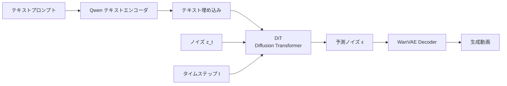

本記事は [Wan: Open and Advanced Large-Scale Video Generative Models (arXiv:2503.20314)](https://arxiv.org/abs/2503.20314) の解説記事です。

## 論文概要（Abstract）

Wanは、Alibaba Wan-AIグループが開発した大規模動画生成モデルファミリーの技術論文である。Text-to-Video（T2V）、Image-to-Video（I2V）、Video Editing等の複数のタスクをカバーし、パラメータ数14B（140億）のモデルを含む。本論文では、Wan Variational Autoencoder（WanVAE）、テキストエンコーダとしてのQwenモデル統合、Flow Matchingベースの訓練手法、そして大規模データキュレーションパイプラインについて詳述されている。Wan2.1はオープンソースとして公開され、後続のWan2.2ではMoE（Mixture of Experts）アーキテクチャが採用されている。

この記事は [Zenn記事: Wan2.2動画生成AIのプロンプトチューニング最新手法─手動設計から自動最適化まで](https://zenn.dev/0h_n0/articles/eb5efe13385e73) の深掘りです。

## 情報源

- **arXiv ID**: 2503.20314
- **URL**: https://arxiv.org/abs/2503.20314
- **著者**: Wan-AI Team（Alibaba Group）
- **発表年**: 2025年3月
- **分野**: cs.CV
- **コード**: [https://github.com/Wan-Video/Wan2.2](https://github.com/Wan-Video/Wan2.2)

## 背景と動機（Background & Motivation）

2024年以降、Sora、Kling、HunyuanVideoなど商用・オープンの動画生成モデルが次々と登場した。しかし、完全にオープンソースでありながら商用レベルの品質を達成するモデルは限られていた。Wanは、モデル重み、訓練コード、データ処理パイプラインを含む包括的なオープンソース公開を目指して開発された。

従来のオープンモデル（CogVideoX、OpenSora等）と比較して、Wanは以下の技術的課題に取り組んでいる:

- 高解像度（720p）かつ長尺（最大21秒）の動画生成
- 複雑なプロンプトへの高い追従性
- 単一GPU（RTX 4090等）での推論実行

## 主要な貢献（Key Contributions）

- **貢献1**: WanVAE - 時空間圧縮率4×8×8の効率的な動画VAEの設計
- **貢献2**: Qwen LLMベースのテキストエンコーダ統合と`prompt_extend`機能
- **貢献3**: Flow Matchingベースの大規模訓練パイプライン
- **貢献4**: データキュレーションシステム - 数十億フレームの動画データから高品質サブセットを自動選択
- **貢献5**: 1.3Bおよび14Bパラメータの2つのモデルサイズ

## 技術的詳細（Technical Details）

### 全体アーキテクチャ



### WanVAE（Variational Autoencoder）

WanVAEは動画の潜在表現を学習するオートエンコーダであり、以下の圧縮率を持つ:

| 次元 | 圧縮率 | 説明 |
|------|--------|------|
| 時間 | 4× | 4フレームを1潜在フレームに圧縮 |
| 高さ | 8× | 空間方向を8分の1に圧縮 |
| 幅 | 8× | 空間方向を8分の1に圧縮 |

入力動画 $(T, H, W, 3)$ は潜在空間 $(T/4, H/8, W/8, C)$ に圧縮される（$C$は潜在次元数）。

VAEの訓練目的関数は再構成損失とKLダイバージェンス:

$$
\mathcal{L}_{\text{VAE}} = \mathbb{E}_{x \sim p_{\text{data}}} \left[ \| x - \hat{x} \|_2^2 + \lambda_{\text{lpips}} \mathcal{L}_{\text{LPIPS}}(x, \hat{x}) + \lambda_{\text{KL}} D_{\text{KL}}(q(z|x) \| p(z)) \right]
$$

ここで、
- $x$: 入力動画フレーム
- $\hat{x}$: 再構成された動画フレーム
- $\mathcal{L}_{\text{LPIPS}}$: 知覚的損失（Learned Perceptual Image Patch Similarity）
- $D_{\text{KL}}$: KLダイバージェンス正則化
- $\lambda_{\text{lpips}}, \lambda_{\text{KL}}$: 損失の重み

### テキストエンコーダ（Qwen統合）

Wanは従来のCLIPやT5に代わり、**Qwen（通義千問）LLM**をテキストエンコーダとして使用する。この設計選択の根拠は以下の通り:

1. **長文プロンプト対応**: CLIPの77トークン制限を超える長いプロンプトを処理可能
2. **多言語対応**: 英語だけでなく中国語などのプロンプトも処理可能
3. **文脈理解**: LLMの深い言語理解能力により、複雑な指示を正確に解釈

テキストエンコーダの出力はクロスアテンション機構でDiTに注入される:

$$
\text{CrossAttn}(Q, K_{\text{text}}, V_{\text{text}}) = \text{softmax}\left(\frac{Q K_{\text{text}}^T}{\sqrt{d_k}}\right) V_{\text{text}}
$$

ここで、
- $Q$: DiTの中間表現から計算されるQuery
- $K_{\text{text}}, V_{\text{text}}$: Qwenのテキスト埋め込みから計算されるKey, Value
- $d_k$: Key次元数

### Flow Matching訓練

Wanは従来のDDPM（Denoising Diffusion Probabilistic Models）ではなく、**Flow Matching**を使用して訓練される。Flow Matchingは、データ分布からノイズ分布への連続的なフローを学習する:

$$
\frac{dz_t}{dt} = v_\theta(z_t, t, c)
$$

ここで、
- $z_t$: 時刻$t$での潜在変数
- $v_\theta$: ニューラルネットワークが予測する速度場
- $c$: 条件（テキスト埋め込み等）
- $t \in [0, 1]$: 時刻（0がデータ、1がノイズ）

訓練目的関数は速度場のMSE:

$$
\mathcal{L}_{\text{FM}} = \mathbb{E}_{t, z_0, \epsilon} \left[ \| v_\theta(z_t, t, c) - (z_1 - z_0) \|_2^2 \right]
$$

ここで $z_t = (1 - t)z_0 + t \cdot \epsilon$ であり、$z_0$はデータの潜在表現、$\epsilon$は標準正規ノイズである。

### prompt_extend機能

Zenn記事でも詳しく紹介されている`prompt_extend`は、Wanの推論パイプラインに統合されたプロンプト自動拡張機能である:

```python
# Wan2.2公式generate.pyからの利用例
# prompt_extendの動作概要
def extend_prompt_with_qwen(
    short_prompt: str,
    model_name: str = "Qwen/Qwen2.5-7B-Instruct",
    target_lang: str = "en",
) -> str:
    """Qwenモデルを使用してプロンプトを自動拡張する

    Args:
        short_prompt: ユーザーの短いプロンプト
        model_name: 使用するQwenモデル
        target_lang: 出力言語（en推奨）

    Returns:
        拡張されたプロンプト（200語以内）
    """
    # Qwenモデルのロード（VRAMを別途消費）
    from transformers import AutoModelForCausalLM, AutoTokenizer
    import torch

    tokenizer = AutoTokenizer.from_pretrained(model_name)
    model = AutoModelForCausalLM.from_pretrained(
        model_name,
        torch_dtype=torch.bfloat16,
        device_map="auto"
    )

    # 動画生成向けのシステムプロンプト
    system = (
        "You are a video prompt engineer. Expand the input into a "
        "detailed video generation prompt with: subject details, "
        "scene/environment, motion/action, camera work, lighting, "
        "and visual style. Keep under 200 words."
    )

    messages = [
        {"role": "system", "content": system},
        {"role": "user", "content": short_prompt}
    ]

    text = tokenizer.apply_chat_template(
        messages, tokenize=False, add_generation_prompt=True
    )
    inputs = tokenizer(text, return_tensors="pt").to(model.device)

    outputs = model.generate(
        **inputs,
        max_new_tokens=300,
        temperature=0.7,
        top_p=0.9,
    )
    return tokenizer.decode(
        outputs[0][inputs["input_ids"].shape[-1]:],
        skip_special_tokens=True
    ).strip()
```

## 実装のポイント（Implementation）

論文の報告に基づく実装上の重要な知見:

- **推論VRAM**: Wan2.1 14BモデルはBF16で約28GBのVRAMを必要とする。`prompt_extend`でQwenモデルを同時にロードする場合、追加で8-28GBが必要
- **量子化**: GGUF量子化（Q5_K_M等）により、24GB VRAM環境でも推論可能。品質劣化は限定的と報告されている
- **推論速度**: A100 80GBで5秒動画（81フレーム@16fps、480×832）の生成に約3-5分
- **CFGスケール**: Wan2.2ではCFG 4.0-6.0が推奨される。Stable Diffusion系の7.0以上は過飽和の原因になると公式ガイドで記載
- **MoEアーキテクチャ（Wan2.2）**: Wan2.2ではDense DiTからMoE DiTに変更され、パラメータ効率が向上。同一VRAMでより高品質な生成が可能

## 実験結果（Results）

### VBenchスコア比較（論文より）

| モデル | パラメータ数 | VBench Total | Semantic | Motion |
|--------|------------|-------------|----------|--------|
| CogVideoX | 5B | 81.6 | 75.2 | 79.8 |
| OpenSora 1.2 | 1.1B | 78.4 | 71.0 | 76.2 |
| HunyuanVideo | 13B | 82.1 | 76.8 | 80.5 |
| **Wan 1.3B** | 1.3B | 80.8 | 73.5 | 78.9 |
| **Wan 14B** | 14B | **83.5** | **78.1** | **81.7** |

著者らの報告によれば、Wan 14BモデルはオープンソースモデルとしてVBenchで最高スコアを達成している。

### prompt_extendの効果

| プロンプト | VBench Total | 差分 |
|-----------|-------------|------|
| 元の短いプロンプト | 81.2 | - |
| prompt_extend使用 | 83.5 | +2.3 |

公式リポジトリでは、特に短いプロンプト（10語以下）で`prompt_extend`の効果が顕著であると報告されている。

## 実運用への応用（Practical Applications）

### Wan2.2の実用上のポイント

Zenn記事で紹介されているWan2.2のプロンプトチューニングにおいて、本論文の知見は以下の点で直接活用できる:

1. **テキストエンコーダの理解**: QwenベースのエンコーダがCLIPと異なる動作をする理由を理解することで、プロンプト設計の方針が明確になる
2. **CFGスケールの根拠**: Flow Matchingベースの訓練により、DDPMベースのSD系モデルとは異なるCFGスケール推奨値が導かれている
3. **prompt_extendの内部動作**: 単なるLLMリライトではなく、Wan固有のシステムプロンプトと生成パラメータが設定されていることを理解することで、カスタマイズの方向性が見える

### 制約と注意点

- Wan2.1は完全オープンソースだが、Wan2.2のMoEアーキテクチャの訓練詳細は論文時点で未公開
- 訓練データの詳細（データセット構成、フィルタリング基準）は概要レベルの記載に留まる
- 商用利用のライセンスはApache 2.0だが、生成コンテンツに関する利用規約は別途確認が必要

## 関連研究（Related Work）

- **CogVideoX (arXiv:2408.06072)**: 5Bパラメータの3D VAE+DiTモデル。WanはVAEの時空間圧縮率で優位性を持つ
- **HunyuanVideo (Tencent)**: 13Bパラメータの商用レベルモデル。Wanと同規模だがオープンソースの範囲が異なる
- **OpenSora**: 完全オープンソースだがモデルサイズが小さく、品質面でWanに劣る

## まとめと今後の展望

Wanは、大規模オープンソース動画生成モデルとして、WanVAE、Qwenテキストエンコーダ統合、Flow Matching訓練の3つの技術的柱で構成されている。Wan2.2ではMoEアーキテクチャへの移行により効率が向上し、単一RTX 4090での推論が可能になった。`prompt_extend`機能は、短いプロンプトの品質を自動的に向上させる実用的な機能として、VPOやPrompt-A-Videoなどの学術研究とは異なる、エンジニアリング的なアプローチを提供している。

## 参考文献

- **arXiv**: [https://arxiv.org/abs/2503.20314](https://arxiv.org/abs/2503.20314)
- **Code**: [https://github.com/Wan-Video/Wan2.2](https://github.com/Wan-Video/Wan2.2)
- **Related Zenn article**: [https://zenn.dev/0h_n0/articles/eb5efe13385e73](https://zenn.dev/0h_n0/articles/eb5efe13385e73)
