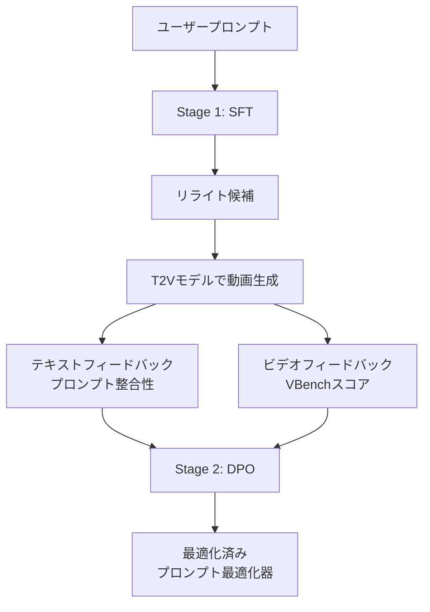

本記事は [VPO: Aligning Text-to-Video Generation Models with Prompt Optimization (arXiv:2503.20491)](https://arxiv.org/abs/2503.20491) の解説記事です。

## 論文概要（Abstract）

Text-to-Video（T2V）モデルは訓練時に詳細なキャプションで学習されるが、ユーザーが入力するプロンプトは短く曖昧であることが多い。このギャップがT2Vモデルの生成品質を低下させる原因となっている。VPO（Video Prompt Optimization）は、LLM（大規模言語モデル）をプロンプト最適化器として活用し、SFT（Supervised Fine-Tuning）とDPO（Direct Preference Optimization）の2段階でユーザープロンプトをT2Vモデルに適した形式に変換するフレームワークである。著者らは、テキストレベルとビデオレベルの2種類のフィードバック信号を用いることで、安全性・正確性・有用性の3原則を同時に最適化できると報告している。

この記事は [Zenn記事: Wan2.2動画生成AIのプロンプトチューニング最新手法─手動設計から自動最適化まで](https://zenn.dev/0h_n0/articles/eb5efe13385e73) の深掘りです。

## 情報源

- **arXiv ID**: 2503.20491
- **URL**: https://arxiv.org/abs/2503.20491
- **著者**: Jiale Cheng, Xiao Liu, Yida Lu et al.（清華大学CoAIグループ）
- **発表年**: 2025年3月
- **分野**: cs.CV, cs.AI
- **採択**: ICCV 2025

## 背景と動機（Background & Motivation）

T2Vモデルは訓練データとして詳細なキャプション（被写体・動作・環境・照明・カメラワークなど）を使用して学習される。しかし実際のユーザーは「猫が走る」のような短いプロンプトを入力することが多い。この訓練時と推論時のプロンプト分布のギャップが、生成品質の低下を引き起こす。

従来のアプローチとして、GPT-4oなどの汎用LLMを使ったプロンプトリライトが試みられてきたが、以下の問題がある:

- 汎用LLMはT2Vモデル固有のプロンプト最適化に対する知識を持たない
- 不適切なリライトがユーザーの意図を歪める場合がある
- 安全性（有害コンテンツの生成抑制）に対する配慮が不十分

VPOは、T2Vモデルの生成品質を直接的なフィードバック信号として利用し、プロンプト最適化器を訓練することでこれらの課題に対処する。

## 主要な貢献（Key Contributions）

- **貢献1**: T2V生成における3つの最適化原則（無害性・正確性・有用性）を定義し、これを体系的に実現するフレームワークを提案
- **貢献2**: テキストレベルフィードバック（プロンプトとの整合性）とビデオレベルフィードバック（VBenchスコア）を組み合わせたDual Feedbackアプローチ
- **貢献3**: 複数のT2Vモデル（CogVideoX-5B、Wan2.1、HunyuanVideo）での汎化性能を実証

## 技術的詳細（Technical Details）

### 全体アーキテクチャ

VPOは2段階のパイプラインで構成される:



### Stage 1: SFT（Supervised Fine-Tuning）

最初の段階では、Chain-of-Thought（CoT）的なリライトパターンをLLMに学習させる。著者らは以下の手順でSFTデータセットを構築したと報告している:

1. 人手でリライトのガイドラインを策定
2. ガイドラインに基づき、GPT-4oでリライト例を生成
3. 人間のアノテーターが品質チェック・フィルタリング

SFTの目的関数は標準的な次の単語予測:

$$
\mathcal{L}_{\text{SFT}} = -\sum_{t=1}^{T} \log p_\theta(y_t \mid y_{<t}, x)
$$

ここで、
- $x$: ユーザーの元のプロンプト
- $y$: リライト後のプロンプト
- $\theta$: LLMのパラメータ
- $T$: リライトプロンプトのトークン数

### Stage 2: DPO（Direct Preference Optimization）

第2段階では、生成動画の品質をフィードバック信号として、プロンプト最適化器の選好を学習する。

#### Dual Feedback機構

2種類のフィードバック信号を組み合わせる:

**テキストレベルフィードバック**: リライト後のプロンプトが元のプロンプトの意図を保持しているかを評価する。具体的には、ユーザーの元のプロンプトとリライト後のプロンプトの意味的類似度を測定する。

**ビデオレベルフィードバック**: リライト後のプロンプトで実際に動画を生成し、VBenchの各評価次元（subject consistency, motion smoothness, aesthetic qualityなど）でスコアリングする。

#### DPOの目的関数

VBenchスコアに基づき、同一の元プロンプトに対する複数のリライト結果をペアとして比較し、高スコアのリライト（winner）と低スコアのリライト（loser）のペアデータを構築する:

$$
\mathcal{L}_{\text{DPO}} = -\mathbb{E}_{(x, y_w, y_l)} \left[ \log \sigma \left( \beta \log \frac{\pi_\theta(y_w \mid x)}{\pi_{\text{ref}}(y_w \mid x)} - \beta \log \frac{\pi_\theta(y_l \mid x)}{\pi_{\text{ref}}(y_l \mid x)} \right) \right]
$$

ここで、
- $y_w$: winner（VBenchスコアが高いリライト）
- $y_l$: loser（VBenchスコアが低いリライト）
- $\pi_\theta$: 学習中のポリシー（プロンプト最適化器）
- $\pi_{\text{ref}}$: 参照ポリシー（SFT後のモデル）
- $\beta$: 温度パラメータ（KLダイバージェンスの強さを制御）
- $\sigma$: シグモイド関数

#### 3原則の実現方法

| 原則 | 実現方法 | フィードバック |
|------|---------|-------------|
| 無害性（Harmlessness） | 安全性フィルタを通過するリライトを優先 | テキストレベル |
| 正確性（Accuracy） | 元プロンプトの意味を保持するリライトを優先 | テキストレベル |
| 有用性（Helpfulness） | VBenchスコアが高い動画を生成するリライトを優先 | ビデオレベル |

### アルゴリズム

```python
import torch
from transformers import AutoModelForCausalLM, AutoTokenizer

def vpo_pipeline(
    user_prompt: str,
    optimizer_model: AutoModelForCausalLM,
    tokenizer: AutoTokenizer,
    temperature: float = 0.7,
) -> str:
    """VPOプロンプト最適化パイプライン

    Args:
        user_prompt: ユーザーの元のプロンプト
        optimizer_model: SFT+DPOで訓練済みのプロンプト最適化器
        tokenizer: 対応するトークナイザー
        temperature: 生成時の温度パラメータ

    Returns:
        最適化されたプロンプト文字列
    """
    # システムプロンプトで3原則を指示
    system_prompt = (
        "You are a video prompt optimizer. Rewrite the user's prompt "
        "following three principles:\n"
        "1. Harmlessness: Avoid harmful content\n"
        "2. Accuracy: Preserve the user's original intent\n"
        "3. Helpfulness: Add details for better video quality "
        "(subject, scene, motion, lighting, style)"
    )

    messages = [
        {"role": "system", "content": system_prompt},
        {"role": "user", "content": user_prompt}
    ]

    text = tokenizer.apply_chat_template(
        messages, tokenize=False, add_generation_prompt=True
    )
    inputs = tokenizer(text, return_tensors="pt").to(optimizer_model.device)

    with torch.no_grad():
        outputs = optimizer_model.generate(
            **inputs,
            max_new_tokens=300,
            temperature=temperature,
            top_p=0.9,
            do_sample=True,
        )

    optimized_prompt = tokenizer.decode(
        outputs[0][inputs["input_ids"].shape[-1]:],
        skip_special_tokens=True
    )
    return optimized_prompt.strip()
```

## 実装のポイント（Implementation）

著者らの報告によれば、実装上の重要なポイントは以下の通り:

- **ベースモデル**: Qwen2.5-7B-Instructをプロンプト最適化器のベースとして使用
- **DPOペアデータ生成**: 1つの元プロンプトに対して8個のリライト候補を生成し、VBenchスコアの最高・最低ペアを選択
- **推論コスト**: 推論時はLLM1回の呼び出しのみ（数百ミリ秒の追加レイテンシ）であり、T2Vモデル自体への変更は不要
- **VBench評価の計算コスト**: DPOペアデータ構築時に各候補で動画生成+VBench評価が必要となるため、訓練コストは高い（論文では具体的な計算リソースの記載あり）

## 実験結果（Results）

著者らは3つのT2Vモデルで評価を実施し、以下の結果を報告している:

### VBenchスコア比較（論文Table 2より）

| モデル | 元プロンプト | GPT-4oリライト | VPO（提案手法） | 改善幅 |
|--------|------------|--------------|--------------|--------|
| CogVideoX-5B | 79.8 | 80.5 | 82.1 | +2.3 |
| Wan2.1 | 81.2 | 81.9 | 83.5 | +2.3 |
| HunyuanVideo | 80.4 | 81.0 | 82.8 | +2.4 |

### 人間評価

著者らが実施したヒューマンスタディでは、70.2%のケースでVPOが最適化したプロンプトによる生成動画が、元のプロンプトによる生成動画より好まれたと報告されている。

### 安全性評価

VPOは安全性フィルタリングにおいても改善を示し、有害コンテンツの生成率を元プロンプト比で大幅に低減したと報告されている。

### モデル間汎化

注目すべき点として、あるT2Vモデルで訓練したプロンプト最適化器が、別のT2Vモデルでもプロンプト品質を改善できることが示されている。これは、プロンプト最適化が特定モデルに過剰適合するのではなく、T2Vモデル全般に有効なプロンプト記述パターンを学習していることを示唆している。

## 実運用への応用（Practical Applications）

VPOのアプローチは、Zenn記事で紹介されているWan2.2のプロンプトチューニングと直接関連する。

### Wan2.2のprompt_extend機能との比較

Wan2.2の`prompt_extend`機能は、Qwen LLMを使って短いプロンプトを拡張するが、VPOとは以下の点で異なる:

| 観点 | prompt_extend | VPO |
|------|-------------|-----|
| 訓練方法 | Qwenの事前学習知識のみ | VBenchスコアでDPO訓練 |
| フィードバック信号 | なし | テキスト+ビデオの両方 |
| 安全性考慮 | 限定的 | 3原則で明示的に最適化 |
| 計算コスト（推論時） | Qwen推論1回 | LLM推論1回（同等） |

### 実用化の展望

- **SaaS動画生成サービス**: ユーザーの短いプロンプトを自動的に最適化することで、初心者でも高品質な動画を生成可能
- **バッチ動画生成**: 大量のプロンプトを一括最適化し、平均品質を向上
- **コンテンツモデレーション**: 無害性原則により、有害コンテンツの生成を事前に抑制

### 制約と注意点

- 訓練にはVBench評価環境と大量のT2V生成が必要であり、個人利用での再訓練は現実的でない
- VBenchスコアに最適化するため、VBenchが測定しない芸術性や創造性の側面では改善が保証されない
- プロンプト最適化器としてQwen2.5-7Bを使用するため、約16GBの追加VRAMが必要

## 関連研究（Related Work）

- **Prompt-A-Video (arXiv:2412.15156)**: 同じくILLM+DPOベースのプロンプト最適化だが、VideoScoreとPickScoreのDual Rewardを使用する点が異なる。VPOとは独立に同時期に提案された手法
- **MetaPrompt**: GPT-4を使ったメタプロンプティングアプローチ。VPOはこれを比較対象として上回る性能を示している
- **RLHF for Diffusion Models (DRaFT等)**: 画像生成モデルのRLHF手法。VPOはモデル重みを変更せずプロンプト側のみで介入する点が異なる

## まとめと今後の展望

VPOは、T2Vモデルのプロンプト最適化をSFT+DPOの2段階で体系的に実現するフレームワークである。テキストレベルとビデオレベルの2種類のフィードバックを組み合わせることで、安全性・正確性・品質の3原則を同時に最適化できる。複数のT2Vモデルでの汎化性能が確認されており、Wan2.2を含む最新モデルへの適用が期待される。今後の研究方向としては、より効率的なDPOペアデータ構築（動画生成回数の削減）や、創造性・芸術性を含む多次元的な最適化が挙げられる。

## 参考文献

- **arXiv**: [https://arxiv.org/abs/2503.20491](https://arxiv.org/abs/2503.20491)
- **Code**: [https://github.com/thu-coai/VPO](https://github.com/thu-coai/VPO)
- **Related Zenn article**: [https://zenn.dev/0h_n0/articles/eb5efe13385e73](https://zenn.dev/0h_n0/articles/eb5efe13385e73)
