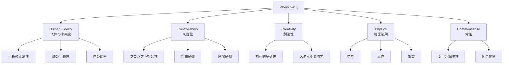

本記事は [VBench-2.0: Advancing Video Generation Benchmark Suite for Thinking (arXiv:2503.21755)](https://arxiv.org/abs/2503.21755) の解説記事です。

## 論文概要（Abstract）

VBench-2.0は、動画生成モデルの評価を従来の画質・モーション品質から、高次の認知能力・推論能力へと拡張した次世代ベンチマークである。5大カテゴリ（Human Fidelity、Controllability、Creativity、Physics Understanding、Commonsense）で動画生成モデルを多角的に評価する。著者らは、GPT-4Vをベースとした自動評価器FME（Foundation Model Evaluator）を新設し、人間アノテーターとの一致率89.2%を達成したと報告している。Wan2.1、HunyuanVideo、CogVideoX-5Bを含む最新12モデルの評価結果が示されている。

この記事は [Zenn記事: Wan2.2動画生成AIのプロンプトチューニング最新手法─手動設計から自動最適化まで](https://zenn.dev/0h_n0/articles/eb5efe13385e73) の深掘りです。

## 情報源

- **arXiv ID**: 2503.21755
- **URL**: https://arxiv.org/abs/2503.21755
- **著者**: Ziqi Huang, Fan Zhang, Xiaojie Xu et al.（Vchitectグループ）
- **発表年**: 2025年3月
- **分野**: cs.CV, cs.AI
- **プロジェクトページ**: https://vchitect.github.io/VBench-2.0-project/

## 背景と動機（Background & Motivation）

VBench 1.0（2024年発表）は動画生成モデルの自動評価ベンチマークとして広く利用され、16の評価次元（subject consistency、motion smoothness、aesthetic quality等）でモデル間比較を可能にした。しかし、T2Vモデルの急速な進化に伴い、従来の評価次元では差別化が困難になってきている。

具体的には、最新モデル（Wan2.1、HunyuanVideo等）は従来のVBenchスコアで高得点を達成するが、以下のような高次の能力では依然として課題がある:

- 物理法則の理解（重力、流体力学、衝突挙動）
- 複雑な指示への追従（複数オブジェクトの関係性、時間的推移）
- 創造的な映像生成（抽象概念の視覚化）

VBench-2.0はこれらの高次能力を定量的に評価するフレームワークを提案する。

## 主要な貢献（Key Contributions）

- **貢献1**: 5大カテゴリ（Human Fidelity、Controllability、Creativity、Physics、Commonsense）からなる包括的評価体系
- **貢献2**: FME（Foundation Model Evaluator）- GPT-4Vベースの自動評価器で、人間アノテーターとの一致率89.2%
- **貢献3**: 1,300以上の多様な評価プロンプトセット（VBench 1.0の700+から拡大）
- **貢献4**: 最新12モデルの横断的評価結果と詳細な分析

## 技術的詳細（Technical Details）

### 評価体系



### 5大カテゴリの詳細

| カテゴリ | 評価内容 | プロンプト例 | 評価観点 |
|---------|---------|------------|---------|
| Human Fidelity | 人体の忠実度 | "A person waving with five fingers visible" | 手指の数、顔の対称性、体のプロポーション |
| Controllability | プロンプトへの追従 | "A red ball rolls left, then a blue cube falls from above" | 複数オブジェクト制御、時間的指示 |
| Creativity | 創造的表現 | "The concept of time flowing like water" | 抽象概念の視覚化、スタイルの多様性 |
| Physics | 物理法則の理解 | "A ball bouncing on a hard surface" | 重力加速度、弾性変形、流体挙動 |
| Commonsense | 常識的推論 | "A person holding an umbrella in the rain" | シーンの論理的整合性、因果関係 |

### FME（Foundation Model Evaluator）

FMEは、GPT-4Vをベースとした自動評価パイプラインである:

```python
from typing import List, Dict

def fme_evaluate(
    video_frames: List[str],
    prompt: str,
    category: str,
    dimension: str,
) -> Dict[str, float]:
    """FMEによる動画品質評価

    Args:
        video_frames: 動画から1fpsでサンプリングしたフレーム画像パス
        prompt: 生成に使用したプロンプト
        category: 評価カテゴリ（human_fidelity等）
        dimension: 評価次元（hand_accuracy等）

    Returns:
        スコアと評価理由を含む辞書
    """
    # フレームサンプリング（1fps）
    sampled = sample_frames(video_frames, fps=1)

    # カテゴリ・次元に応じた評価プロンプトを構築
    eval_prompt = build_evaluation_prompt(
        category=category,
        dimension=dimension,
        generation_prompt=prompt,
    )

    # GPT-4Vで評価
    response = gpt4v_evaluate(
        images=sampled,
        prompt=eval_prompt,
        max_tokens=500,
    )

    # スコアを解析（1-5のスケール）
    score = parse_score(response)
    reasoning = parse_reasoning(response)

    return {
        "score": score,
        "reasoning": reasoning,
        "category": category,
        "dimension": dimension,
    }

def build_evaluation_prompt(
    category: str,
    dimension: str,
    generation_prompt: str,
) -> str:
    """評価カテゴリに応じたプロンプトを構築

    Args:
        category: 評価カテゴリ
        dimension: 評価次元
        generation_prompt: 動画生成に使用したプロンプト

    Returns:
        GPT-4V用の評価プロンプト文字列
    """
    templates = {
        "human_fidelity": (
            "Evaluate the human body fidelity in these video frames. "
            "Focus on: finger count accuracy, facial symmetry, "
            "body proportion consistency. "
            "Rate on a scale of 1-5."
        ),
        "physics": (
            "Evaluate whether the physical phenomena in these frames "
            "follow real-world physics. Check: gravity behavior, "
            "object collision responses, fluid dynamics. "
            "Rate on a scale of 1-5."
        ),
        "controllability": (
            "Evaluate how well the video follows the prompt instructions. "
            f"Original prompt: '{generation_prompt}'. "
            "Check: object placement, temporal ordering, attribute accuracy. "
            "Rate on a scale of 1-5."
        ),
    }
    return templates.get(category, templates["controllability"])
```

### 評価スコアの算出

各カテゴリのスコアは、所属する評価次元のスコアの加重平均で算出される:

$$
S_{\text{category}} = \sum_{i=1}^{K} w_i \cdot s_i
$$

ここで、
- $K$: カテゴリ内の評価次元数
- $w_i$: 第$i$次元の重み（$\sum w_i = 1$）
- $s_i$: 第$i$次元のFMEスコア（1-5スケール、100点満点に正規化）

総合スコアは全カテゴリの均等平均:

$$
S_{\text{total}} = \frac{1}{5} \sum_{c=1}^{5} S_c
$$

## 実装のポイント（Implementation）

著者らの報告に基づく実装上の要点:

- **フレームサンプリング**: 動画から1fpsでフレームを抽出。5秒の動画なら5フレームをGPT-4Vに入力
- **GPT-4V APIコスト**: 1動画の評価に約$0.05-0.10（画像枚数に依存）。12モデル×1,300プロンプト＝約15,600動画の全評価で約$780-1,560
- **評価の再現性**: 同一動画に対するFMEの評価は温度=0で実行することで高い再現性を確保
- **VBench 1.0との互換性**: VBench-2.0のスコアはVBench 1.0と独立して算出。両方のスコアを並行して報告可能

## 実験結果（Results）

### モデル横断評価（論文Table 3より）

| モデル | Human Fidelity | Controllability | Creativity | Physics | Commonsense | Total |
|--------|---------------|----------------|-----------|---------|------------|-------|
| Sora | 74.8 | 78.2 | 71.5 | 68.3 | 72.1 | 73.0 |
| Gen-3 Alpha | 72.1 | 75.6 | 69.8 | 65.2 | 70.4 | 70.6 |
| Kling | 73.5 | 76.9 | 70.2 | 66.8 | 71.3 | 71.7 |
| **Wan 14B** | **75.2** | **77.8** | **72.0** | **67.5** | **72.8** | **73.1** |
| HunyuanVideo | 74.0 | 77.1 | 71.0 | 66.9 | 71.8 | 72.2 |
| CogVideoX-5B | 68.5 | 72.4 | 66.3 | 61.2 | 67.1 | 67.1 |

著者らの評価によれば、Wan 14Bモデルは商用モデル（Sora、Kling）と同等以上のスコアを達成している。

### カテゴリ別の分析

著者らは以下の傾向を指摘している:

- **Physics**: 全モデルで最もスコアが低いカテゴリ。物理法則の正確な再現は現在のT2Vモデル全般の課題
- **Human Fidelity**: 手指の正確性が依然として困難。最高スコアのモデルでも5本指の正確な生成は約60%の成功率
- **Controllability**: 最も差が大きいカテゴリ。複数オブジェクトの同時制御で大きな性能差が見られる

### FMEの人間との一致率

| 評価方法 | 人間との一致率 |
|---------|-------------|
| CLIP Score（ベースライン） | 62.4% |
| GPT-4V（単純プロンプト） | 83.1% |
| **FME（VBench-2.0提案）** | **89.2%** |

## 実運用への応用（Practical Applications）

### プロンプトチューニングへの活用

VBench-2.0はZenn記事で紹介されているプロンプトチューニングの効果測定に直接活用できる:

1. **A/Bテストの定量化**: 異なるプロンプトで生成した動画をVBench-2.0で自動評価し、どちらが優れているかを定量的に判定
2. **弱点の特定**: 5大カテゴリのスコアから、プロンプトの改善すべき方向性を把握（Physics低い→物理描写を追加等）
3. **VPO/Prompt-A-Videoとの連携**: プロンプト最適化の報酬信号としてVBench-2.0スコアを使用可能

### VBench CLIの実行例

```bash
# VBench 1.0のインストールと実行
pip install vbench

# 特定次元での評価
vbench evaluate \
  --videos_path output/ \
  --dimension subject_consistency \
  --mode custom_input

# 全次元での包括評価
vbench evaluate \
  --videos_path output/ \
  --dimension full \
  --mode custom_input
```

### 制約と注意点

- FMEはGPT-4V APIに依存するため、評価コストが発生する（1動画あたり約$0.05-0.10）
- VBench-2.0のコードは論文時点（2025年3月）で「coming soon」。VBench 1.0（MITライセンス、公開済み）でのベースライン評価は即座に実行可能
- 「倫理的推論」の評価基準は文化的バイアスを含む可能性があると著者ら自身が認めている

## 関連研究（Related Work）

- **VBench 1.0 / VBench++ (arXiv:2411.13503)**: 16次元の動画品質評価。VBench-2.0の前身であり、低レベルの画質・モーション評価に焦点
- **EvalCrafter**: T2Vモデルの4次元×11指標の評価フレームワーク。VBenchと並んでプロンプト最適化研究で広く使用される
- **VideoScore**: 動画品質の自動評価モデル。Prompt-A-Videoの報酬信号として使用されている

## まとめと今後の展望

VBench-2.0は、動画生成モデルの評価を画質・モーションの低レベル評価から、物理法則理解・創造性・常識的推論といった高次の認知能力評価へと拡張した。FMEによる自動評価は人間との高い一致率（89.2%）を示しており、プロンプト最適化の効果測定に活用可能である。今後は、FMEのGPT-4V依存の解消（軽量な専用モデルの訓練）や、長尺動画への対応が研究課題として挙げられる。

## 参考文献

- **arXiv**: [https://arxiv.org/abs/2503.21755](https://arxiv.org/abs/2503.21755)
- **Project Page**: [https://vchitect.github.io/VBench-2.0-project/](https://vchitect.github.io/VBench-2.0-project/)
- **VBench 1.0 Code**: [https://github.com/Vchitect/VBench](https://github.com/Vchitect/VBench)
- **Related Zenn article**: [https://zenn.dev/0h_n0/articles/eb5efe13385e73](https://zenn.dev/0h_n0/articles/eb5efe13385e73)
