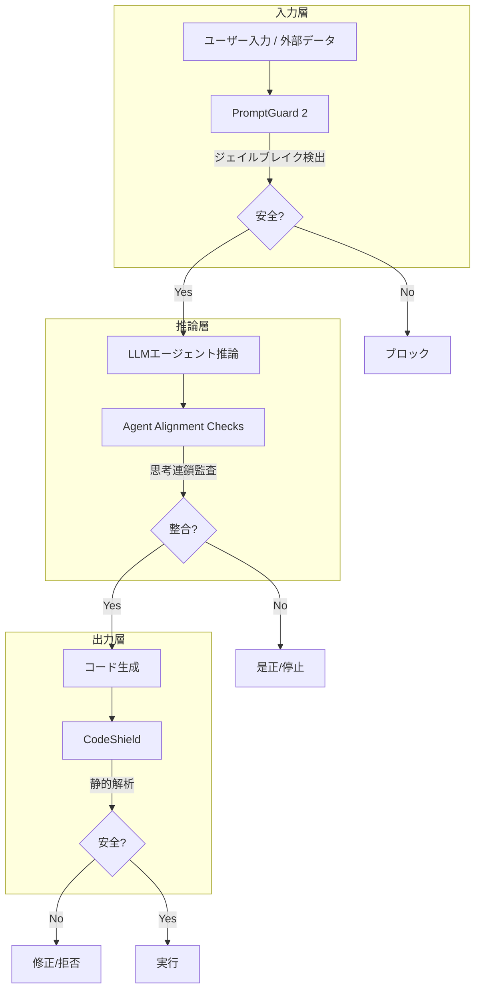
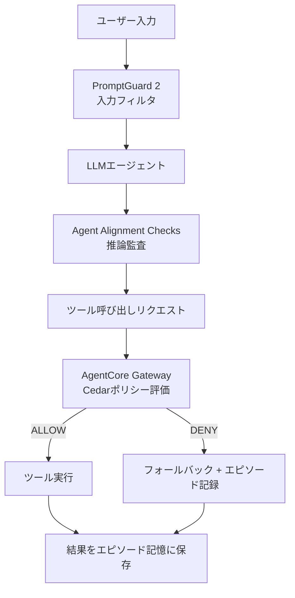

本記事は [arXiv:2505.03574 "LlamaFirewall: An open source guardrail system for building secure AI agents"](https://arxiv.org/abs/2505.03574) の解説記事です。

## 論文概要（Abstract）

LlamaFirewallは、Metaが開発したLLMエージェント向けのオープンソースガードレールフレームワークである。自律的にコード編集やワークフロー操作を行うエージェントが直面するセキュリティリスク（プロンプトインジェクション、エージェントの目標不整合、安全でないコード生成）に対して、PromptGuard 2（汎用ジェイルブレイク検出）、Agent Alignment Checks（思考連鎖の監査）、CodeShield（オンライン静的解析）の3つのコンポーネントで多層防御を提供する。Metaの本番環境で運用されており、オープンソースとして公開されている。

この記事は [Zenn記事: Bedrock AgentCoreのエピソード記憶×Policy制御でマルチターンエージェントの応答精度を高める](https://zenn.dev/0h_n0/articles/d811758c7ad31e) の深掘りです。Zenn記事ではAgentCore Policyによるツール呼び出し制御を解説しているが、本記事ではMetaのLlamaFirewallが提案する「エージェント内部の推論プロセスを監査する」というアプローチを紹介し、AgentCoreのGateway層制御との対比を論じる。

## 情報源

- **arXiv ID**: 2505.03574
- **URL**: [https://arxiv.org/abs/2505.03574](https://arxiv.org/abs/2505.03574)
- **著者**: Sahana Chennabasappa, Cyrus Nikolaidis, Daniel Song et al.（Meta）
- **発表年**: 2025年5月
- **分野**: cs.CR, cs.AI

## 背景と動機（Background & Motivation）

LLMは単純なチャットボットから、コード編集、ワークフロー操作、外部API呼び出しを自律的に行うエージェントへと進化している。著者らは、この進化に伴い、従来のモデルファインチューニングやチャットボット向けガードレールでは対処できない新たなセキュリティリスクが生じていると指摘している。

**LLMエージェント特有のセキュリティリスク**:

1. **プロンプトインジェクション**: 悪意のあるWebページやメール内のプロンプトがエージェントの指示を上書き
2. **目標不整合（Goal Misalignment）**: エージェントの推論過程で元のユーザー意図から逸脱
3. **安全でないコード生成**: コーディングエージェントが脆弱性を含むコードを生成・実行

従来のアプローチ（入出力フィルタリング、モデルレベルの安全学習）はチャットボット向けに設計されており、**エージェントの中間推論ステップ**を監査する機能を持たない。LlamaFirewallはこのギャップを埋めることを目的としている。

## 主要な貢献（Key Contributions）

- **3層防御アーキテクチャ**: 入力層（PromptGuard 2）、推論層（Agent Alignment Checks）、出力層（CodeShield）の多層防御
- **Agent Alignment Checks**: エージェントの思考連鎖（Chain-of-Thought）を監査し、プロンプトインジェクションと目標不整合を検出する手法（著者らは「実験段階」と記載）
- **本番運用の実績**: Metaの本番環境で運用されているシステムのオープンソース化
- **カスタマイズ可能なスキャナー**: 正規表現やLLMプロンプトベースのカスタムスキャナーを追加可能

## 技術的詳細（Technical Details）

### 3層防御アーキテクチャ

LlamaFirewallの3つのコンポーネントは、エージェントの処理フローの異なる段階でセキュリティチェックを行う。



### コンポーネント1: PromptGuard 2

PromptGuard 2は、入力テキストに含まれるジェイルブレイク試行やプロンプトインジェクションを検出する汎用分類器である。

**特徴**:
- 入力テキストをリアルタイムで分類
- 直接的なジェイルブレイク（ユーザーが意図的に安全機能を回避）と間接的なプロンプトインジェクション（外部データに埋め込まれた悪意ある指示）の両方を検出
- 著者らの報告では、従来手法と比較してジェイルブレイク検出で当時の最高性能を達成

**AgentCore Policyとの対比**: AgentCore Policyは「何を許可/拒否するか」を宣言的に定義するのに対し、PromptGuard 2は「入力が悪意あるものか」をMLモデルで分類する。前者はルールベース、後者は学習ベースのアプローチである。

### コンポーネント2: Agent Alignment Checks

Agent Alignment Checksは、エージェントの**思考連鎖（Chain-of-Thought）を監査**し、プロンプトインジェクションの影響や目標不整合を検出するコンポーネントである。

**動作原理**:
1. エージェントのReAct形式の推論ステップ（Thought → Action → Observation）を入力として受け取る
2. 各ステップの推論内容を監査し、以下を検出:
   - 外部データからの指示に従っている兆候（間接プロンプトインジェクション）
   - 元のユーザー指示から逸脱した目標への変更
   - 不自然な推論パターン（突然の方針転換など）
3. 検出された場合、エージェントの実行を停止または是正

**著者らの評価**:
- Agent Alignment Checksは「実験段階」と位置づけられている
- 著者らの報告では、間接プロンプトインジェクションの防止において、従来提案されている手法よりも一般的なシナリオで有効性が確認されている

**AgentCore Policy + エピソード記憶との対比**:

| 観点 | LlamaFirewall (AAC) | AgentCore Policy + エピソード記憶 |
|------|---------------------|------------------------------|
| **制御の位置** | エージェント内部（推論ステップの監査） | エージェント外部（Gateway層のポリシー評価） |
| **制御の方式** | ML/LLMベースの異常検出 | 宣言的ルール（Cedarポリシー） |
| **学習** | なし（静的な監査） | エピソード記憶のReflectionで動的に学習 |
| **カスタマイズ** | プロンプトベースのカスタムスキャナー | Cedarポリシーの追加/変更 |
| **バイパス耐性** | エージェント内部のため理論的にはバイパス可能 | Gateway層のため原理的にバイパス不可能 |

### コンポーネント3: CodeShield

CodeShieldは、コーディングエージェントが生成するコードをリアルタイムで静的解析するエンジンである。

**特徴**:
- オンライン（リアルタイム）で動作する静的解析
- 高速かつ拡張可能な設計
- 安全でないコードパターン（SQLインジェクション、コマンドインジェクション、ハードコードされた認証情報など）を検出
- 検出されたコードの生成をブロックまたは修正を提案

**ユースケース**: Claude CodeやGitHub Copilotのようなコーディングエージェントが生成するコードの安全性検証

### カスタムスキャナー

LlamaFirewallは、正規表現やLLMプロンプトベースの**カスタムスキャナー**を追加できる拡張機能を提供している。これにより、組織固有のセキュリティ要件に対応可能である。

## 実装のポイント（Implementation）

LlamaFirewallを実装する際の注意点:

- **レイテンシへの影響**: PromptGuard 2とCodeShieldはリアルタイム処理のため、エージェントの応答レイテンシに影響する。著者らはCodeShieldが「高速」と記載しているが、具体的なレイテンシ数値は論文中に明記されていない
- **Agent Alignment Checksの信頼性**: 実験段階のコンポーネントであり、偽陽性（正当な推論を誤検出）と偽陰性（悪意ある推論を見逃し）のバランス調整が必要
- **多層防御の原則**: 3つのコンポーネントは独立して動作するため、1つの層が突破されても他の層で検出可能な設計

## 実験結果（Results）

著者らの報告では、以下の評価結果が示されている。

**PromptGuard 2**: ジェイルブレイク検出において、発表時点で最高水準の性能を達成したと報告されている（具体的なベンチマーク数値は論文本文を参照）。

**Agent Alignment Checks**: 間接プロンプトインジェクションの防止において、従来手法よりも一般的なシナリオで有効性が確認されたと報告されている。ただし、著者ら自身が「実験段階」と位置づけている点に注意が必要である。

**CodeShield**: 安全でないコード生成の防止において、高速かつ拡張可能な静的解析を提供。具体的な検出率は論文本文を参照。

**本番運用の実績**: LlamaFirewallはMetaの本番環境で運用されており、実際のエージェントシステムでの有効性が確認されている。

## 実運用への応用（Practical Applications）

### AgentCore Policy + エピソード記憶との相補的活用

Zenn記事で紹介されているAgentCore PolicyのGateway層制御とLlamaFirewallの推論監査は、相補的な関係にある。

**AgentCoreの強み**:
- 宣言的ルール（Cedar）による予測可能な制御
- Gateway層のためエージェントがバイパス不可能
- ポリシー変更がコード変更不要

**LlamaFirewallの強み**:
- 推論プロセスの内部監査（意図の逸脱を検出）
- プロンプトインジェクションのML検出
- コード生成の安全性検証

**統合パターン**:



この統合により、4層の防御が実現される:
1. **入力層**: PromptGuard 2でジェイルブレイクをブロック
2. **推論層**: Agent Alignment Checksで目標不整合を検出
3. **ツール制御層**: AgentCore Policyでツール呼び出しを制御
4. **学習層**: エピソード記憶でDENYパターンを学習し、将来のReflectionに反映

## 関連研究（Related Work）

- **Bedrock AgentCore Policy** (AWS, 2026): Cedar言語によるGateway層のツール呼び出し制御。LlamaFirewallとは異なりエージェント外部で制御
- **GuardAgent** (arXiv:2406.09187): ナレッジグラフベースのガードエージェント。LlamaFirewallの3層防御とは異なるアプローチ
- **NeMo Guardrails** (NVIDIA): 対話フロー制御のためのガードレールフレームワーク。エージェントの推論監査機能はLlamaFirewallが先行
- **PAREA** (arXiv:2410.09523): ポリシー制約付き推論フレームワーク。エージェント自身がポリシーをチェックする設計

## Production Deployment Guide

### AWS実装パターン（コスト最適化重視）

LlamaFirewallをAWS上でセルフホストする場合の構成例。

| 規模 | 月間リクエスト | 推奨構成 | 月額コスト | 主要サービス |
|------|--------------|---------|-----------|------------|
| **Small** | ~3,000 (100/日) | Serverless | $100-300 | Lambda + SageMaker Endpoint (PromptGuard) |
| **Medium** | ~30,000 (1,000/日) | Hybrid | $500-1,500 | ECS Fargate + SageMaker |
| **Large** | 300,000+ (10,000/日) | Container | $3,000-8,000 | EKS + GPU Instances |

**コスト試算の注意事項**:
- PromptGuard 2はMLモデルのためGPU推論インスタンスが必要
- 上記は2026年3月時点のAWS ap-northeast-1リージョン料金に基づく概算値
- 最新料金は [AWS料金計算ツール](https://calculator.aws/) で確認してください

### Terraformインフラコード

```hcl
resource "aws_iam_role" "firewall_role" {
  name = "llamafirewall-role"
  assume_role_policy = jsonencode({
    Version = "2012-10-17"
    Statement = [{
      Action    = "sts:AssumeRole"
      Effect    = "Allow"
      Principal = { Service = "ecs-tasks.amazonaws.com" }
    }]
  })
}

resource "aws_ecs_task_definition" "firewall" {
  family                   = "llamafirewall"
  network_mode             = "awsvpc"
  requires_compatibilities = ["FARGATE"]
  cpu                      = "2048"
  memory                   = "4096"
  execution_role_arn       = aws_iam_role.firewall_role.arn

  container_definitions = jsonencode([{
    name  = "llamafirewall"
    image = "meta-llama/llamafirewall:latest"
    portMappings = [{
      containerPort = 8080
      protocol      = "tcp"
    }]
    environment = [
      { name = "PROMPTGUARD_ENABLED", value = "true" },
      { name = "ALIGNMENT_CHECK_ENABLED", value = "true" },
      { name = "CODESHIELD_ENABLED", value = "true" }
    ]
    logConfiguration = {
      logDriver = "awslogs"
      options = {
        "awslogs-group"  = "/ecs/llamafirewall"
        "awslogs-region" = "ap-northeast-1"
        "awslogs-stream-prefix" = "ecs"
      }
    }
  }])
}

resource "aws_cloudwatch_metric_alarm" "firewall_detection" {
  alarm_name          = "llamafirewall-detection-spike"
  comparison_operator = "GreaterThanThreshold"
  evaluation_periods  = 1
  metric_name         = "ThreatDetectionCount"
  namespace           = "LlamaFirewall/Custom"
  period              = 3600
  statistic           = "Sum"
  threshold           = 10
  alarm_description   = "脅威検出頻度異常（攻撃試行の可能性）"
}
```

### セキュリティベストプラクティス

- PromptGuard 2モデルの定期更新（新しい攻撃パターンへの対応）
- Agent Alignment Checksのカスタムプロンプト調整（偽陽性率の管理）
- CodeShieldルールの組織固有カスタマイズ
- 検出ログのCloudTrail/CloudWatch連携
- AgentCore Policyとの併用（多層防御の確立）

### コスト最適化チェックリスト

- [ ] PromptGuard 2: SageMaker Serverless推論（低トラフィック時のコスト削減）
- [ ] GPU Spot Instances: PromptGuard推論用（最大90%削減）
- [ ] CodeShield: CPUのみで動作（GPU不要）
- [ ] Agent Alignment Checks: Bedrock Haiku使用（低コストモデル）
- [ ] バッチ推論: 非リアルタイム監査はBatch API活用
- [ ] AWS Budgets: 月額予算設定
- [ ] CloudWatch: 検出率・偽陽性率の監視
- [ ] 段階的導入: まずPromptGuard 2のみ → AAC追加 → CodeShield追加
- [ ] ログ保存: S3 + Glacierで長期保存
- [ ] 定期的なモデル更新: 四半期ごとの再評価

## まとめと今後の展望

LlamaFirewallは、LLMエージェントのセキュリティリスクに対して、入力層（PromptGuard 2）、推論層（Agent Alignment Checks）、出力層（CodeShield）の3層防御を提供するオープンソースフレームワークである。Metaの本番環境で運用されている実績を持つ。

Zenn記事で紹介されているAgentCore PolicyのGateway層制御とは、制御の位置（内部vs外部）と方式（MLベースvsルールベース）が異なるが、相補的に活用することで、入力フィルタリング→推論監査→ツール制御→経験学習の4層防御が実現可能である。Agent Alignment Checksは実験段階であり、偽陽性管理や新たな攻撃パターンへの対応が今後の課題である。

## 参考文献

- **arXiv**: [https://arxiv.org/abs/2505.03574](https://arxiv.org/abs/2505.03574)
- **GitHub**: [https://github.com/meta-llama/PurpleLlama](https://github.com/meta-llama/PurpleLlama)
- **Meta AI Blog**: [https://ai.meta.com/research/publications/llamafirewall-an-open-source-guardrail-system-for-building-secure-ai-agents/](https://ai.meta.com/research/publications/llamafirewall-an-open-source-guardrail-system-for-building-secure-ai-agents/)
- **Related Zenn article**: [https://zenn.dev/0h_n0/articles/d811758c7ad31e](https://zenn.dev/0h_n0/articles/d811758c7ad31e)

---

:::message
この記事はAI（Claude Code）により自動生成されました。論文の主張は原著論文に基づいていますが、実際の利用時は原論文もご確認ください。
:::
