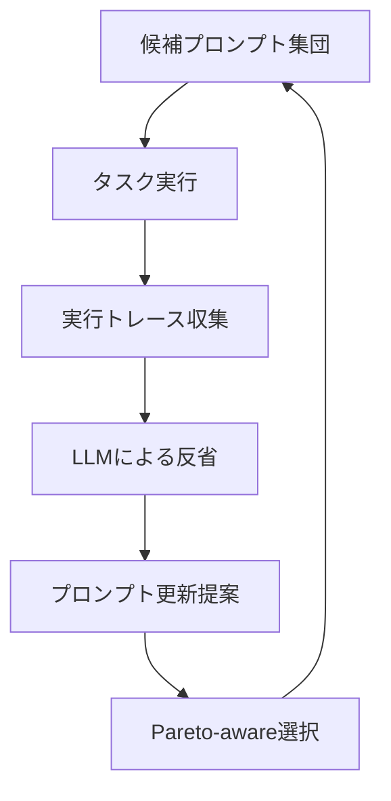

本記事は [GEPA: Reflective Prompt Evolution Can Outperform Reinforcement Learning (arXiv:2507.19457)](https://arxiv.org/abs/2507.19457) の解説記事です。

## 論文概要（Abstract）

GEPAは、LLMに実行トレース（推論過程、ツール呼び出し、出力）を分析させ、自然言語で「反省（reflection）」を行うことでプロンプトを進化的に改善する手法である。著者らは、強化学習ベースのアプローチ（GRPO等）やDSPyのMIPROv2と比較し、GEPAが平均6%（最大20%）の改善を、35倍少ないロールアウトで達成すると報告している。ICLR 2026にOral（採択率上位約1%）として採択された。

この記事は [Zenn記事: DSPy×TextGrad比較で学ぶプロンプト自動最適化パイプラインの実践構築](https://zenn.dev/0h_n0/articles/925acb0262a64d) の深掘りです。

## 情報源

- **arXiv ID**: 2507.19457
- **URL**: [https://arxiv.org/abs/2507.19457](https://arxiv.org/abs/2507.19457)
- **著者**: 17名（UC Berkeley, Cornell等の研究者を含む）
- **発表年**: 2025（ICLR 2026 Oral採択）
- **分野**: cs.AI, cs.LG, cs.CL
- **GitHub**: [https://github.com/gepa-ai/gepa](https://github.com/gepa-ai/gepa)

## 背景と動機（Background & Motivation）

プロンプト最適化の手法は大きく3つのカテゴリに分類される。

1. **ヒューリスティック探索**: BootstrapFewShot、APE等。デモンストレーションや命令文のランダム探索
2. **Bayesian最適化**: MIPROv2。候補命令文とfew-shot例の組み合わせをBayesian Optimizationで探索
3. **強化学習ベース**: GRPO（Group Relative Policy Optimization）。プロンプトをポリシーとして扱い、報酬信号で最適化

著者らは、これらの手法がいずれも「なぜ失敗したか」の診断能力を欠いていると指摘している。BootstrapFewShotやMIPROv2は探索空間をブラインドに探索し、GRPOは報酬信号のみに基づいてポリシーを更新する。著者らの提案するGEPAは、LLMに**実行トレース全体を読ませて失敗原因を特定**させ、その診断結果に基づいて**狙いを定めたプロンプト更新**を行う。

## 主要な貢献（Key Contributions）

- **貢献1**: 実行トレースに基づく反省的プロンプト進化メカニズムの提案。LLMが「何がうまくいき、何が失敗したか」を自然言語で分析する
- **貢献2**: Pareto-aware選択による多様な候補プロンプトの維持。単一の最適解ではなく、Pareto最適フロンティア上の候補群を保持する
- **貢献3**: GRPOに対して平均6%（最大20%）の改善を35倍少ないロールアウトで達成。MIPROv2に対して10%以上の改善（AIME-2025で+12%）

## 技術的詳細（Technical Details）

### 反省的進化メカニズム

GEPAの核心は、以下の3段階のサイクルで動作する。



**Stage 1: トレース収集**

各候補プロンプトでタスクを実行し、推論過程・ツール呼び出し・出力の完全なトレースを記録する。

$$
\mathcal{T}_i = \{(p_i, x_j, \text{trace}_{ij}, y_{ij}, r_{ij}) \mid j = 1, \ldots, M\}
$$

ここで、
- $p_i$: $i$番目の候補プロンプト
- $x_j$: $j$番目のテスト入力
- $\text{trace}_{ij}$: 実行トレース（推論ステップ、中間出力の系列）
- $y_{ij}$: 最終出力
- $r_{ij}$: メトリクス評価値（0〜1）

**Stage 2: 反省（Reflection）**

収集したトレースをLLM（reflection LM）に与え、成功パターンと失敗パターンを自然言語で分析させる。

$$
\text{reflection}_i = \text{LLM}_{\text{reflect}}\left(\mathcal{T}_i^{\text{success}}, \mathcal{T}_i^{\text{failure}}\right)
$$

この反省プロセスでは、LLMに以下を要求する:

1. 失敗トレースの具体的な失敗箇所の特定
2. 成功トレースとの比較分析
3. 改善のための具体的なプロンプト修正案

**Stage 3: Pareto-aware選択**

GEPAは、単一のスコアで候補を順位付けするのではなく、Pareto最適フロンティア上に候補を維持する。これにより、異なるタスクサブセットで強みを持つ多様なプロンプトが保持される。

$$
\text{Pareto}(\mathcal{P}) = \{p_i \in \mathcal{P} \mid \nexists p_j \in \mathcal{P}: f_k(p_j) \geq f_k(p_i) \; \forall k, \; \exists k': f_{k'}(p_j) > f_{k'}(p_i)\}
$$

ここで、
- $\mathcal{P}$: 候補プロンプト集団
- $f_k(p)$: $k$番目の評価指標に対するプロンプト$p$のスコア

著者らは、Pareto最適フロンティアから「相補的な教訓（complementary lessons）」を組み合わせることで、単一の最良候補を反復改善する手法より効率的な探索が可能になると主張している。

### DSPyへの統合

GEPAはDSPy v3.1系のOptimizerとして統合されており、`dspy.GEPA`として利用可能である。

```python
from dspy.teleprompt import GEPA

optimizer = GEPA(
    metric=classify_metric,
    auto="medium",        # light/medium/heavy
    num_threads=4,
    track_stats=True,
)

compiled_program = optimizer.compile(
    program,
    trainset=trainset,
    valset=valset,
)
```

`auto`パラメータは最適化の強度を制御する:
- `"light"`: 少数のトレースで高速に最適化（数分）
- `"medium"`: バランスの取れた設定（10-30分）
- `"heavy"`: 大量のトレースで高精度最適化（1時間以上）

### MIPROv2との比較: 何が違うのか

MIPROv2はBayesian Optimizationで命令文とfew-shot例の組み合わせを探索するのに対し、GEPAは以下の点で異なる。

| 設計軸 | MIPROv2 | GEPA |
|--------|---------|------|
| **探索戦略** | Bayesian Optimization（サロゲートモデル） | 反省的進化（LLMによるトレース分析） |
| **失敗分析** | なし（スコアのみ参照） | あり（実行トレース全体を分析） |
| **候補管理** | 単一の最適候補 | Pareto最適フロンティア |
| **計算効率** | num_trials × num_candidates回のLM呼び出し | 少数のロールアウトで効率的（35倍少ない） |
| **reflection LMの要件** | なし | 高能力LMが必要（GPT-4o以上推奨） |

## 実装のポイント（Implementation）

GEPAを実装・利用する際の注意点を整理する。

1. **reflection LMの能力**: 反省の質はreflection LMの能力に強く依存する。著者らはGPT-4o以上を推奨しており、小型モデル（GPT-4o-mini等）では改善幅が限定的になると述べている

2. **`auto`パラメータの選択**: まず`"light"`で傾向を確認し、改善が見られたら`"medium"`→`"heavy"`と段階的に強度を上げるアプローチが推奨される

3. **valsetの重要性**: GEPAのPareto-aware選択は検証セットでの性能に基づくため、trainsetとvalsetの分布が大きく異なると最適化が不安定になる

4. **トレースの品質**: `ChainOfThought`等の推論過程を出力するModuleと組み合わせると、反省の質が向上する。`dspy.Predict`のみでは推論過程が記録されないため、反省の材料が不足する

```python
# GEPAの効果を最大化する構成例
class DetailedClassifier(dspy.Module):
    def __init__(self):
        super().__init__()
        # ChainOfThoughtで推論過程を記録 → GEPAの反省材料に
        self.classify = dspy.ChainOfThought(SupportClassifier)

    def forward(self, inquiry: str) -> str:
        result = self.classify(inquiry=inquiry)
        return result.category

# GEPA最適化
optimizer = GEPA(
    metric=classify_metric,
    auto="medium",
    num_threads=4,
    track_stats=True,
)

# reflection_lmに高能力モデルを指定
compiled = optimizer.compile(
    DetailedClassifier(),
    trainset=trainset,
    valset=valset,
)
```

## Production Deployment Guide

### AWS実装パターン（コスト最適化重視）

GEPAはDSPyのcompile-time Optimizerであるため、推論時のアーキテクチャはDSPyと同等である。ただし、**最適化フェーズ**ではreflection LMへの追加呼び出しが発生する。

**トラフィック量別の推奨構成**:

| 規模 | 月間リクエスト | 推奨構成 | 月額コスト | 主要サービス |
|------|--------------|---------|-----------|------------|
| **Small** | ~3,000 (100/日) | Serverless | $50-150 | Lambda + Bedrock + DynamoDB |
| **Medium** | ~30,000 (1,000/日) | Hybrid | $300-800 | Lambda + ECS Fargate + ElastiCache |
| **Large** | 300,000+ (10,000/日) | Container | $2,000-5,000 | EKS + Karpenter + EC2 Spot |

**最適化フェーズのコスト** (一回限り):
- `auto="light"`: 約$5-20（数十回のLM呼び出し）
- `auto="medium"`: 約$20-100（数百回のLM呼び出し）
- `auto="heavy"`: 約$100-500（数千回のLM呼び出し）
- reflection LMにGPT-4oを使用する場合、reflection呼び出しのコストが追加

**コスト試算の注意事項**:
上記は2026年3月時点のAWS ap-northeast-1料金に基づく概算値です。GEPAの最適化フェーズはバッチ処理のため、Bedrock Batch API（50%割引）の活用が推奨されます。

### Terraformインフラコード

GEPAはcompile-time Optimizerのため、推論時のインフラはDSPyと同一。ここでは最適化フェーズ用のバッチ環境を追加する。

```hcl
# 最適化フェーズ用: AWS Batch
resource "aws_batch_compute_environment" "gepa_optimizer" {
  compute_environment_name = "gepa-optimizer-env"
  type                     = "MANAGED"

  compute_resources {
    type                = "SPOT"
    bid_percentage      = 60
    max_vcpus           = 16
    min_vcpus           = 0
    desired_vcpus       = 0

    instance_type = ["m5.xlarge", "m5.2xlarge"]

    subnets            = module.vpc.private_subnets
    security_group_ids = [aws_security_group.batch.id]
    instance_role      = aws_iam_instance_profile.batch.arn
  }
}

resource "aws_batch_job_definition" "gepa_compile" {
  name = "gepa-compile-job"
  type = "container"

  container_properties = jsonencode({
    image   = "python:3.12-slim"
    vcpus   = 4
    memory  = 8192
    command = ["python", "optimize.py", "--optimizer", "gepa", "--auto", "medium"]

    environment = [
      { name = "BEDROCK_MODEL_ID", value = "anthropic.claude-3-5-sonnet-20241022-v2:0" },
      { name = "GEPA_REFLECTION_MODEL", value = "anthropic.claude-3-5-sonnet-20241022-v2:0" }
    ]
  })

  timeout {
    attempt_duration_seconds = 7200
  }
}

resource "aws_cloudwatch_metric_alarm" "gepa_batch_cost" {
  alarm_name          = "gepa-batch-cost-spike"
  comparison_operator = "GreaterThanThreshold"
  evaluation_periods  = 1
  metric_name         = "ApproximateNumberOfMessagesVisible"
  namespace           = "AWS/SQS"
  period              = 3600
  statistic           = "Maximum"
  threshold           = 100
  alarm_description   = "GEPA最適化ジョブのキュー滞留（コスト超過の兆候）"
}
```

### コスト最適化チェックリスト

- [ ] GEPA最適化はバッチ実行（AWS Batch + Spot Instances）
- [ ] reflection LMはBedrock Batch APIで50%割引
- [ ] まず`auto="light"`で効果を確認してから強度を上げる
- [ ] 推論時インフラはDSPyと同一（追加コストなし）
- [ ] 最適化結果はJSON永続化 → 再最適化の頻度を最小化
- [ ] trainset/valsetのサイズ管理で最適化コストを制御
- [ ] Lambda推論: メモリ最適化（CloudWatch Insights分析）
- [ ] AWS Budgets: 月額予算設定（80%で警告）
- [ ] CloudWatch アラーム: Bedrockトークンスパイク検知
- [ ] Cost Anomaly Detection有効化

## 実験結果（Results）

著者らは、複数のベンチマークでGEPAの有効性を検証している（arXiv:2507.19457より）。

| 比較対象 | ベンチマーク | GEPA改善幅 | ロールアウト数比 |
|---------|------------|-----------|----------------|
| GRPO | 複数タスク平均 | +6% (平均) | 1/35 |
| GRPO | 最大改善タスク | +20% | — |
| MIPROv2 | AIME-2025 (GPT-4.1 Mini) | +12% | — |
| MIPROv2 | 複数タスク平均 | +10%以上 | — |

著者らは「少数のロールアウト（最小限のタスク実行回数）で大きな改善を達成する」ことを強調しており、これはGEPAの反省メカニズムがブラインド探索よりも**情報効率が高い**ことを示唆している。

DSPy公式チュートリアルでは、AIME 2025の数学問題でGPT-4.1 Miniが46.6%→56.6%（+10ポイント）の改善を達成したことが紹介されている（dspy.ai/tutorials より）。

**制約条件**: GEPAの反省機能はreflection LMの能力に依存する。著者らはGPT-4o以上のモデルを推奨しており、小型モデルでは反省の質が低下し改善幅が限定的になると述べている。

## 実運用への応用（Practical Applications）

GEPAは以下のシナリオで特に有効である。

**1. 高精度が要求される分類・推論タスク**: MIPROv2で頭打ちになった精度を、GEPAの反省メカニズムでさらに改善できる。BootstrapFewShot → MIPROv2 → GEPAの段階的最適化がZenn記事で推奨されている

**2. 限られた訓練データでの最適化**: GEPAは35倍少ないロールアウトで改善を達成するため、訓練データが少ない（50例未満）状況でも効率的に動作する

**3. 失敗分析レポートの自動生成**: GEPAの反省出力は人間が読める自然言語であるため、「なぜプロンプトが失敗しているか」のレポートを自動生成するデバッグツールとしても活用できる

**制約事項**: reflection LMに高能力モデル（GPT-4o以上）を必要とするため、最適化フェーズのLMコストがMIPROv2より高い。ただし、推論時には追加コストが発生しないため、トータルでのROIは高い。

## 関連研究（Related Work）

- **MIPROv2** (Opsahl-Ong et al., 2024): DSPyのBayesian Optimization系Optimizer。GEPAは反省メカニズムにより、MIPROv2が到達できない精度領域に到達すると報告されている
- **GRPO** (Shao et al., 2024): 強化学習ベースのプロンプト最適化。GEPAはGRPOと同等以上の性能を35倍少ないロールアウトで達成
- **PromptBreeder** (Fernando et al., 2023): 進化的アプローチによるプロンプト最適化。GEPAはPromptBreederの進化戦略にPareto-aware選択と反省メカニズムを追加している
- **EvoPrompt** (Guo et al., 2024): 遺伝的アルゴリズムベースのプロンプト最適化。GEPAと同じく進化的アプローチだが、トレース分析による失敗診断機能は持たない

## まとめと今後の展望

GEPAは、LLMの反省能力を活用した新しいプロンプト最適化手法であり、ICLR 2026にOralとして採択された。著者らの実験では、GRPOに対して平均6%（最大20%）の改善を35倍少ないロールアウトで達成し、MIPROv2に対しても10%以上の改善が報告されている。

実務への示唆として、GEPAはDSPy v3.1系に統合されており、既存のDSPyパイプラインに対してOptimizer切り替え（`MIPROv2` → `GEPA`）だけで導入可能である。Zenn記事で紹介した「BootstrapFewShot → MIPROv2 → GEPA」の段階的最適化フローの最終段として位置づけられる。

今後の研究方向として、reflection LMの小型化（反省能力の蒸留）や、Pareto-aware選択のマルチタスクへの拡張が期待される。

## 参考文献

- **arXiv**: [https://arxiv.org/abs/2507.19457](https://arxiv.org/abs/2507.19457)
- **ICLR 2026**: [https://openreview.net/forum?id=RQm2KQTM5r](https://openreview.net/forum?id=RQm2KQTM5r)
- **Code**: [https://github.com/gepa-ai/gepa](https://github.com/gepa-ai/gepa)
- **DSPy GEPA Docs**: [https://dspy.ai/api/optimizers/GEPA/overview/](https://dspy.ai/api/optimizers/GEPA/overview/)
- **Related Zenn article**: [https://zenn.dev/0h_n0/articles/925acb0262a64d](https://zenn.dev/0h_n0/articles/925acb0262a64d)

---

> 本記事は [arXiv:2507.19457](https://arxiv.org/abs/2507.19457) の解説記事です。記載内容は論文の記述に基づいており、筆者が独自に実験を行ったものではありません。
