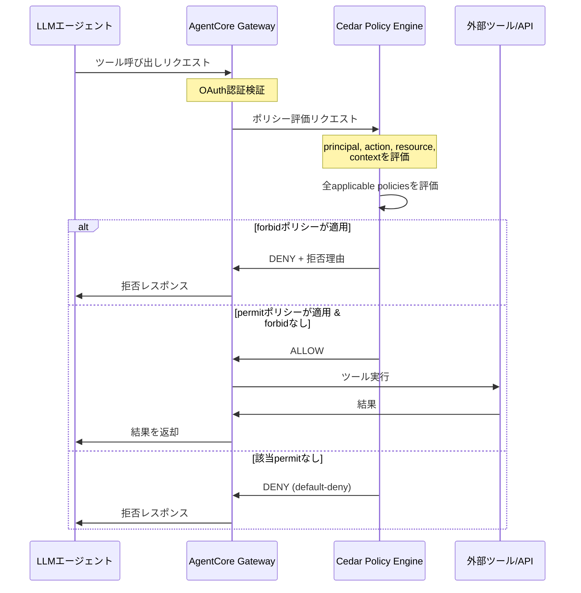

本記事は [AWS Machine Learning Blog: "Apply fine-grained access control with Bedrock AgentCore Gateway interceptors"](https://aws.amazon.com/blogs/machine-learning/apply-fine-grained-access-control-with-bedrock-agentcore-gateway-interceptors/) の解説記事です。

## ブログ概要（Summary）

Amazon Bedrock AgentCore Gatewayは、LLMエージェントのツール呼び出しをインターセプトし、Cedar言語で記述されたポリシーに基づいてアクセス制御を行うサービスである。本ブログ記事では、Gateway層でのポリシー評価アーキテクチャ、Cedarポリシーの記述パターン、自動スキーマ生成、自然言語からのポリシー変換機能を解説している。

この記事は [Zenn記事: Bedrock AgentCoreのエピソード記憶×Policy制御でマルチターンエージェントの応答精度を高める](https://zenn.dev/0h_n0/articles/d811758c7ad31e) の深掘りです。Zenn記事ではPolicy制御の概要を解説しているが、本記事ではGateway interceptorsの内部アーキテクチャと実装パターンを詳細に掘り下げる。

## 情報源

- **種別**: 企業テックブログ（AWS Machine Learning Blog）
- **URL**: [https://aws.amazon.com/blogs/machine-learning/apply-fine-grained-access-control-with-bedrock-agentcore-gateway-interceptors/](https://aws.amazon.com/blogs/machine-learning/apply-fine-grained-access-control-with-bedrock-agentcore-gateway-interceptors/)
- **組織**: Amazon Web Services
- **関連ドキュメント**: [AgentCore Policy公式ドキュメント](https://docs.aws.amazon.com/bedrock-agentcore/latest/devguide/policy.html)

## 技術的背景（Technical Background）

LLMエージェントが自律的にツールを呼び出す場面では、「エージェントが呼び出すべきでないツールを呼び出す」リスクが発生する。このリスクは、プロンプトインジェクション、幻覚による誤ったツール選択、訓練データからの不適切なパターン学習など複数の要因で生じる。

従来のアプローチでは、エージェントコード内に `if role == "admin"` のような条件分岐を実装することが一般的だった。しかしこの方式では以下の問題がある。

1. **バイパス可能性**: プロンプトインジェクションによりエージェントの条件分岐を回避できる
2. **一貫性の欠如**: 複数のエージェントにまたがるポリシーの統一管理が困難
3. **監査困難**: ポリシーがコードに分散し、変更追跡やコンプライアンス監査に対応しにくい

AgentCore Policyは、これらの課題をエージェントコードの**外側**（Gateway層）で解決するアーキテクチャを採用している。

## 実装アーキテクチャ（Architecture）

### Gateway interceptorのフロー

AgentCore Gateway interceptorは、エージェントからのすべてのツール呼び出しリクエストをインターセプトし、Cedar Policy Engineで評価する。



### 主要コンポーネント

**Gateway**:
- MCPサーバーへの接続エンドポイントを提供
- API、Lambda関数をMCP互換ツールに変換
- エージェントがツールとやり取りするための単一アクセスポイント

**Gateway Target**:
- Gatewayが提供するツールの定義
- Lambda関数、OpenAPI仕様、Smithyモデルなどをサポート

**Gateway Authorizer**:
- 各GatewayにはOAuth認可サーバーが必須
- Cognitoを使用した認可サーバーの構築が可能

**Cedar Policy Engine**:
- Cedarポリシーの保存と評価を担当
- 関連するすべてのGatewayに対してポリシーを適用
- **Default-deny**: 明示的permitなしは拒否
- **Forbid-wins**: forbidがpermitに常に優先

### 自動スキーマ生成

AgentCore GatewayはMCPツール定義からCedarスキーマを自動生成する。これにより以下が実現される。

- 各ツールがCedarの`action`にマッピングされる
- ツールの入力パラメータが`context`のフィールドとして定義される
- ポリシー作成時にスキーマとの整合性が自動検証される
- 存在しないツールやパラメータへの条件設定が事前に検出される

```json
{
  "entityTypes": {
    "OAuthUser": {
      "shape": {
        "type": "Record",
        "attributes": {
          "role": { "type": "String" }
        }
      }
    }
  },
  "actions": {
    "OrderAPI__process_refund": {
      "appliesTo": {
        "principalTypes": ["OAuthUser"],
        "resourceTypes": ["Gateway"],
        "context": {
          "type": "Record",
          "attributes": {
            "amount": { "type": "Long" },
            "reason": { "type": "String", "required": false }
          }
        }
      }
    }
  }
}
```

### Cedarポリシーパターン

**パターン1: ロールベースアクセス制御（RBAC）**

```cedar
permit(
  principal is AgentCore::OAuthUser,
  action == AgentCore::Action::"OrderAPI__process_refund",
  resource == AgentCore::Gateway::"arn:aws:bedrock-agentcore:us-west-2:123456789012:gateway/order-mgmt"
) when {
  principal.hasTag("role") &&
  principal.getTag("role") == "support-agent"
};
```

**パターン2: 入力パラメータの制約（ABAC）**

```cedar
permit(
  principal is AgentCore::OAuthUser,
  action == AgentCore::Action::"OrderAPI__process_refund",
  resource == AgentCore::Gateway::"arn:aws:bedrock-agentcore:us-west-2:123456789012:gateway/order-mgmt"
) when {
  principal.hasTag("role") &&
  principal.getTag("role") == "support-agent" &&
  context.input has amount &&
  context.input.amount < 500
};
```

**パターン3: forbidによる必須フィールド強制**

```cedar
forbid(
  principal is AgentCore::OAuthUser,
  action == AgentCore::Action::"OrderAPI__process_refund",
  resource == AgentCore::Gateway::"arn:aws:bedrock-agentcore:us-west-2:123456789012:gateway/order-mgmt"
) unless {
  context.input has reason
};
```

### 自然言語からのポリシー生成

Policy Authoring Serviceは、自然言語による認可要件をCedarポリシーに自動変換する。

**入力例**: 「サポート担当者は返金処理を実行できるが、金額は500ドル未満に限り、必ず理由を記載すること」

**処理フロー**:
1. 意図の解釈: principal（サポート担当者）、action（返金）、condition（500未満 + 理由必須）を抽出
2. 候補ポリシー生成: Cedar構文に変換
3. スキーマ検証: Gatewayのツール定義と照合
4. 自動推論: 過度に許容的（always-allow）または過度に制限的（always-deny）なポリシーを検出

**Cedar Analysis（自動推論）の検出項目**:
- **Overly permissive**: 条件なしですべてのリクエストを許可するポリシー
- **Overly restrictive**: 条件が矛盾し、どのリクエストも許可しないポリシー
- **Unsatisfiable conditions**: 論理的に充足不能な条件（例: `amount < 0 && amount > 100`）

## パフォーマンス最適化（Performance）

Gateway interceptorのレイテンシは、エージェントの応答時間に直接影響するため、以下の最適化が行われている。

- **ポリシー事前フィルタリング**: スコープ条件（action, resource）で適用対象ポリシーを事前に絞り込み
- **Cedarの評価速度**: p99 < 1msの評価速度（Cedar言語の設計によるもの。詳細は[Cedar論文](https://arxiv.org/abs/2403.04651)を参照）
- **Gateway層での実行**: エージェントコードの変更不要。ポリシー更新もCedar記述の変更のみで完結

## 運用での学び（Production Lessons）

### エピソード記憶との統合パターン

Zenn記事で紹介されているエピソード記憶との組み合わせでは、以下の設計パターンが有効である。

1. **学習と制御の分離**: エピソード記憶（何を学んだか）とPolicy（何が許可されるか）を独立したレイヤーで管理
2. **DENY時の学習**: ポリシー拒否された行動もエピソードとして記録し、「このツールは使えない」というReflectionを将来生成
3. **段階的な権限拡大**: Reflectionのconfidenceスコアに基づいて、信頼度の高いパターンのみ自動適用

### よくある設計ミス

| ミス | 問題 | 解決策 |
|------|------|--------|
| エージェントコード内のif文認可 | プロンプトインジェクションでバイパス可能 | Gateway層のCedarポリシーに移行 |
| forbidなしのpermitのみ設計 | 新ツール追加時にデフォルトで許可される | default-denyを活用し、必要なpermitのみ追加 |
| 自然言語ポリシーの無レビューデプロイ | 意図しない全面拒否/許可 | Cedar Analysisで事前検証、人間レビュー必須 |

## 学術研究との関連（Academic Connection）

AgentCore Gateway interceptorsのアーキテクチャは、以下の学術研究と関連している。

- **Cedar言語** (Cutler et al., PLDI 2024): Gatewayのポリシー評価エンジンの基盤。形式的意味論とSMTベース自動推論を提供
- **GuardAgent** (arXiv:2406.09187): ナレッジグラフベースのガードエージェント。Gateway interceptorsは宣言的ポリシーベースのアプローチで対比される
- **PAREA** (arXiv:2410.09523): ポリシー制約付き推論フレームワーク。エージェント自身がポリシーをチェックする設計（Agent内部）に対して、AgentCoreはAgent外部（Gateway層）で制御する点が異なる

## Production Deployment Guide

### AWS実装パターン（コスト最適化重視）

| 規模 | 月間リクエスト | 推奨構成 | 月額コスト | 主要サービス |
|------|--------------|---------|-----------|------------|
| **Small** | ~3,000 (100/日) | Serverless | $50-150 | Lambda + AgentCore Gateway + DynamoDB |
| **Medium** | ~30,000 (1,000/日) | Hybrid | $300-800 | Lambda + ECS Fargate + ElastiCache |
| **Large** | 300,000+ (10,000/日) | Container | $2,000-5,000 | EKS + Karpenter + EC2 Spot |

**コスト試算の注意事項**:
- 上記は2026年3月時点のAWS ap-northeast-1（東京）リージョン料金に基づく概算値
- AgentCore Gateway/Policyの料金は変動する可能性があります
- 最新料金は [AWS料金計算ツール](https://calculator.aws/) で確認してください

### Terraformインフラコード

```hcl
resource "aws_iam_role" "gateway_role" {
  name = "agentcore-gateway-role"
  assume_role_policy = jsonencode({
    Version = "2012-10-17"
    Statement = [{
      Action    = "sts:AssumeRole"
      Effect    = "Allow"
      Principal = { Service = "bedrock-agentcore.amazonaws.com" }
    }]
  })
}

resource "aws_iam_role_policy" "gateway_policy" {
  role = aws_iam_role.gateway_role.id
  policy = jsonencode({
    Version = "2012-10-17"
    Statement = [
      {
        Effect   = "Allow"
        Action   = ["lambda:InvokeFunction"]
        Resource = "arn:aws:lambda:ap-northeast-1:*:function:order-*"
      },
      {
        Effect   = "Allow"
        Action   = ["bedrock-agentcore:EvaluatePolicy"]
        Resource = "*"
      }
    ]
  })
}

resource "aws_cloudwatch_metric_alarm" "policy_denial_rate" {
  alarm_name          = "agentcore-policy-denial-spike"
  comparison_operator = "GreaterThanThreshold"
  evaluation_periods  = 2
  metric_name         = "PolicyDenialCount"
  namespace           = "AgentCore/Policy"
  period              = 300
  statistic           = "Sum"
  threshold           = 50
  alarm_description   = "ポリシー拒否頻度異常（ポリシー設定ミスの可能性）"
}
```

### セキュリティベストプラクティス

- Gateway Authorizer: OAuth必須、Cognito User Pool推奨
- Cedar forbidポリシー: 高リスク操作は必ずforbidで明示的制限
- ポリシー変更プロセス: Cedar Analysis → 人間レビュー → デプロイ
- 監査: CloudTrailで全ポリシー評価結果を記録
- ポリシーバージョニング: 変更履歴の管理とロールバック体制

### コスト最適化チェックリスト

- [ ] AgentCore GatewayのTarget数を最小化（不要ツール削除）
- [ ] ポリシー評価結果のキャッシュ（同一principal+action+resourceの再評価防止）
- [ ] Cedar Analysisによる未使用ポリシーの削除
- [ ] AWS Budgets: 月額予算設定（80%で警告）
- [ ] CloudWatch: ポリシー拒否頻度の監視（設定ミス検出）
- [ ] ログ保存: S3 + Glacierで長期保存（コンプライアンス対応）
- [ ] テンプレートリンク活用: 個別ポリシー数の削減
- [ ] 自然言語ポリシー生成: Cedar学習コストの削減
- [ ] 開発環境: ポリシーをpermit-allに設定（本番と分離）
- [ ] 定期的なポリシーレビュー: 四半期ごとの棚卸し推奨

## まとめと実践への示唆

AgentCore Gateway interceptorsは、LLMエージェントのツール呼び出しをエージェントコードの外側で制御する宣言的アーキテクチャを提供する。default-deny + forbid-winsセマンティクス、自動スキーマ生成、自然言語→Cedar変換により、エージェントの安全性をコード変更なしに実現する。エピソード記憶との統合では、DENY時の学習記録により、エージェントが自律的に「やってはいけないこと」を学習する設計が可能になる。

## 参考文献

- **Blog URL**: [https://aws.amazon.com/blogs/machine-learning/apply-fine-grained-access-control-with-bedrock-agentcore-gateway-interceptors/](https://aws.amazon.com/blogs/machine-learning/apply-fine-grained-access-control-with-bedrock-agentcore-gateway-interceptors/)
- **AgentCore Policy Docs**: [https://docs.aws.amazon.com/bedrock-agentcore/latest/devguide/policy.html](https://docs.aws.amazon.com/bedrock-agentcore/latest/devguide/policy.html)
- **Cedar Paper**: [https://arxiv.org/abs/2403.04651](https://arxiv.org/abs/2403.04651)
- **Related Zenn article**: [https://zenn.dev/0h_n0/articles/d811758c7ad31e](https://zenn.dev/0h_n0/articles/d811758c7ad31e)

---

:::message
この記事はAI（Claude Code）により自動生成されました。AWS公式ドキュメントとブログ記事に基づいていますが、最新情報は公式ドキュメントをご確認ください。
:::
