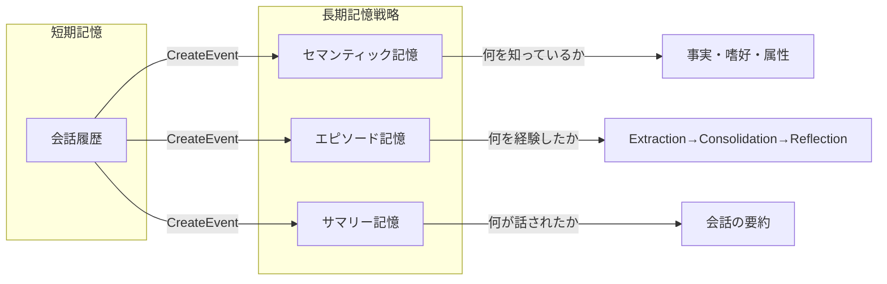

本記事は [AWS Machine Learning Blog: "Building smarter AI agents: AgentCore long-term memory deep dive"](https://aws.amazon.com/blogs/machine-learning/building-smarter-ai-agents-agentcore-long-term-memory-deep-dive/) の解説記事です。

## ブログ概要（Summary）

Amazon Bedrock AgentCore Memoryは、LLMエージェントに長期記憶を提供するマネージドサービスである。本ブログ記事では、3つの記憶戦略（セマンティック記憶、エピソード記憶、サマリー記憶）の設計原則、ネームスペースベースの記憶組織化、Built-in/Built-in Override/Self-Managedの3つの管理モードを解説している。

この記事は [Zenn記事: Bedrock AgentCoreのエピソード記憶×Policy制御でマルチターンエージェントの応答精度を高める](https://zenn.dev/0h_n0/articles/d811758c7ad31e) の深掘りです。Zenn記事ではエピソード記憶の詳細を解説しているが、本記事では3つの記憶戦略全体の比較と使い分けの指針を提供する。

## 情報源

- **種別**: 企業テックブログ（AWS Machine Learning Blog）
- **URL**: [https://aws.amazon.com/blogs/machine-learning/building-smarter-ai-agents-agentcore-long-term-memory-deep-dive/](https://aws.amazon.com/blogs/machine-learning/building-smarter-ai-agents-agentcore-long-term-memory-deep-dive/)
- **組織**: Amazon Web Services
- **関連ドキュメント**: [AgentCore Memory公式ドキュメント](https://docs.aws.amazon.com/bedrock-agentcore/latest/devguide/memory.html)

## 技術的背景（Technical Background）

LLMエージェントの記憶管理は、会話の文脈維持、パーソナライゼーション、経験からの学習において不可欠な機能である。認知科学では人間の記憶をエピソード記憶（個人的な経験）、意味記憶（一般的な知識）、手続き記憶（スキル）に分類しているが、AgentCoreはこの分類に着想を得たアーキテクチャを採用している。

既存のLLMメモリシステム（例: MemoryBank [arXiv:2305.10250]、A-MEM [arXiv:2502.12110]）は研究レベルの実装が多く、本番運用に必要な暗号化、アクセス制御、スケーラビリティの要件を満たすことが困難だった。AgentCore Memoryは、これらの要件をマネージドサービスとして解決している。

## 実装アーキテクチャ（Architecture）

### 3つの記憶戦略

AgentCore Memoryは以下の3つの記憶戦略を提供する。



| 記憶戦略 | 保存対象 | 適用場面 | 処理の特徴 |
|---------|---------|---------|-----------|
| **セマンティック記憶** | 事実、嗜好、属性 | パーソナライゼーション | ユーザー属性の抽出・更新 |
| **エピソード記憶** | 経験、対応パターン | 行動の一貫性向上 | Extraction→Consolidation→Reflection |
| **サマリー記憶** | 会話の要約 | コンテキスト圧縮 | 会話全体の要約生成 |

### セマンティック記憶

セマンティック記憶は、会話から**事実・嗜好・属性**を抽出して保存する。「ユーザーAはPython派」「予算上限は500ドル」といった情報が対象となる。

**処理フロー**:
1. `CreateEvent`に会話メッセージを投入
2. LLMが会話から事実・嗜好・属性を自動抽出
3. 既存の記憶と統合（重複排除、矛盾解消）
4. `RetrieveMemories`でクエリに関連する事実を返却

**ユースケース**:
- カスタマーサポート: 過去の購入履歴、好みの連絡方法
- パーソナルアシスタント: ユーザーの習慣、スケジュール傾向

### エピソード記憶

エピソード記憶は、Zenn記事で詳細に解説されているExtraction→Consolidation→Reflectionの3段階処理を行う。ここでは他の記憶戦略との比較の観点から特徴を整理する。

**セマンティック記憶との違い**:
- セマンティック記憶: 「このユーザーは出荷後キャンセルを希望することが多い」（事実）
- エピソード記憶: 「出荷後キャンセルでは返品フローに誘導し、送料を先に説明するのが有効」（経験則）

**Reflectionの生成条件**:
- 複数のエピソードが蓄積された後にバックグラウンドで生成
- 単一のエピソードからはConsolidation出力のみ（Reflectionは未生成）
- Reflectionは非同期処理のため、エピソード完了直後には利用不可

### サマリー記憶

サマリー記憶は、会話全体を要約して保存する。長い会話のコンテキストを圧縮し、新しいセッションの開始時に要約を提供する。

**ユースケース**:
- 長時間の技術相談: 過去のやり取り全体を要約して引き継ぎ
- 引き継ぎシナリオ: 別のエージェントや人間オペレーターへの引き継ぎ時に要約を提供

### 3つの管理モード

AgentCore Memoryは記憶戦略の管理方法として3つのモードを提供している。

| モード | カスタマイズ性 | ストレージコスト | インフラ管理 |
|--------|-------------|----------------|------------|
| **Built-in** | 低（設定のみ） | 高 | 不要 |
| **Built-in Override** | 中（プロンプト変更可） | 中 | 不要 |
| **Self-Managed** | 高（完全自由） | 低 | 必要 |

**Built-in**: AWSが提供する事前定義アルゴリズムで自動抽出。設定不要で即座に利用可能。

**Built-in Override**: Built-inの抽出パイプラインをカスタマイズ可能。抽出プロンプトの変更、使用するBedrockモデルの選択が可能。モデルはユーザーアカウントで呼び出されるため、コスト管理が容易。

**Self-Managed**: 記憶の抽出・統合アルゴリズムを完全にカスタム実装。外部システムとの統合、独自のスキーマ定義が可能。インフラのセットアップと保守が必要だが、ストレージコストは最も低い。

### ネームスペース設計

AgentCore Memoryのネームスペースは階層構造で記憶を組織化する。

```
/strategy/{memoryStrategyId}/
  └── /actor/{actorId}/
        └── /session/{sessionId}/
```

**設計パターンの比較**:

| パターン | ネームスペース | Reflection範囲 | 適用場面 |
|---------|-------------|---------------|---------|
| **ユーザー別** | `/strategy/episodic/actor/{userId}` | ユーザー単位 | パーソナライズ重視 |
| **チーム別** | `/strategy/episodic/actor/{teamId}` | チーム単位 | マルチテナント |
| **全体共有** | `/strategy/episodic/` | 全ユーザー | ナレッジ共有型 |

**トレードオフ**: ユーザー別ネームスペースではパーソナライズされたReflectionが得られるが、エピソード数が少ないと有意なパターンが抽出されにくい。全体共有では豊富なエピソードからReflectionが生成されるが、特定ユーザーの文脈に合わないパターンが含まれる場合がある。

### AgentCore Memoryの設計原則

AWS公式ブログでは、以下の設計原則が紹介されている（[AgentCore Memory公式ブログ](https://aws.amazon.com/blogs/machine-learning/amazon-bedrock-agentcore-memory-building-context-aware-agents/)より）。

1. **抽象化されたストレージ**: 開発者はストレージの実装詳細を意識する必要がない
2. **暗号化**: 保存されるすべての記憶データは暗号化される
3. **時系列順序**: 記憶は時系列で管理され、最新性に基づく検索が可能
4. **ネームスペースベースのアクセス制御**: 階層的なネームスペースで記憶の分離と共有を制御

## パフォーマンス最適化（Performance）

記憶システムのレイテンシはエージェントの応答時間に直接影響するため、以下の最適化が重要である。

- **記憶検索結果のキャッシュ**: 同一クエリに対する`RetrieveMemories`の結果をTTL付きでキャッシュ（5分程度が推奨）
- **検索結果数の制限**: `max_results`パラメータで返却数を制限（5件程度が推奨）
- **ネームスペースの絞り込み**: 検索対象ネームスペースを必要最小限に指定
- **Reflectionの事前取得**: セッション開始時にReflectionを事前取得し、各ターンでの検索オーバーヘッドを削減

## 運用での学び（Production Lessons）

### TTL設定によるコスト管理

エピソードの無制限蓄積はストレージコストの増加と検索精度の低下を招く。以下のTTL戦略が推奨される。

```python
MEMORY_TTL_CONFIG = {
    "episode_ttl_days": 90,        # エピソード: 90日で期限切れ
    "reflection_ttl_days": 365,    # Reflection: 1年保持（抽象化された知見）
    "semantic_ttl_days": None,     # セマンティック: 無期限（事実情報）
    "summary_ttl_days": 180,       # サマリー: 6ヶ月保持
    "max_episodes_per_actor": 500, # ユーザーあたり上限
}
```

Reflectionはエピソードを抽象化した知見であるため、元のエピソードより長い保持期間を設定する。エピソードが期限切れで削除されても、抽出された知見はReflectionとして残る。

### PII（個人識別情報）の管理

Reflectionは複数のactorのエピソードを横断して生成される場合がある。公式のExtractionプロンプトにはPII除外の指示が含まれているが、運用環境ではBedrock GuardrailsのPII検出機能と組み合わせることが推奨される。

### 記憶戦略の選択ガイド

| 要件 | 推奨戦略 | 理由 |
|------|---------|------|
| ユーザーの好みを記憶 | セマンティック | 事実の抽出と更新に特化 |
| 対応パターンの学習 | エピソード | Reflectionで再利用可能な知見を生成 |
| 長い会話の引き継ぎ | サマリー | コンテキスト圧縮に特化 |
| 上記すべて | 3つを併用 | 1つのMemoryリソースで複数戦略を同時使用可能 |

## 学術研究との関連（Academic Connection）

- **CoALA** (arXiv:2309.02427): エピソード記憶・意味記憶・手続き記憶を含む認知アーキテクチャのフレームワーク。AgentCore Memoryはこの分類に着想を得た実装
- **MemoryBank** (arXiv:2305.10250): LLMエージェント向けの永続的エピソード風記憶。AgentCoreはマネージドサービスとして暗号化・アクセス制御を追加
- **Agent-R** (arXiv:2501.04682): コンテキスト内エピソード記憶によるリアルタイムリフレクション。AgentCoreの非同期Reflectionとは異なり、実行中の即時修正を提供
- **A-MEM** (arXiv:2502.12110): Zettelkasten方式の構造化記憶。AgentCoreのネームスペース設計と類似のアプローチ

## Production Deployment Guide

### AWS実装パターン（コスト最適化重視）

| 規模 | 月間リクエスト | 推奨構成 | 月額コスト | 主要サービス |
|------|--------------|---------|-----------|------------|
| **Small** | ~3,000 (100/日) | Serverless | $50-150 | Lambda + AgentCore Memory + DynamoDB |
| **Medium** | ~30,000 (1,000/日) | Hybrid | $300-800 | Lambda + ECS Fargate + ElastiCache |
| **Large** | 300,000+ (10,000/日) | Container | $2,000-5,000 | EKS + Karpenter + EC2 Spot |

**コスト試算の注意事項**:
- 上記は2026年3月時点のAWS ap-northeast-1（東京）リージョン料金に基づく概算値
- AgentCore Memoryの料金は記憶の保存量とAPIリクエスト数に依存
- 最新料金は [AWS料金計算ツール](https://calculator.aws/) で確認してください

### Terraformインフラコード

```hcl
resource "aws_iam_role" "memory_lambda" {
  name = "agentcore-memory-lambda-role"
  assume_role_policy = jsonencode({
    Version = "2012-10-17"
    Statement = [{
      Action    = "sts:AssumeRole"
      Effect    = "Allow"
      Principal = { Service = "lambda.amazonaws.com" }
    }]
  })
}

resource "aws_iam_role_policy" "memory_access" {
  role = aws_iam_role.memory_lambda.id
  policy = jsonencode({
    Version = "2012-10-17"
    Statement = [{
      Effect   = "Allow"
      Action   = [
        "bedrock-agentcore:CreateEvent",
        "bedrock-agentcore:RetrieveMemories",
        "bedrock-agentcore:CreateMemory",
        "bedrock-agentcore:UpdateMemory"
      ]
      Resource = "*"
    }]
  })
}

resource "aws_lambda_function" "memory_handler" {
  filename      = "lambda.zip"
  function_name = "agentcore-memory-handler"
  role          = aws_iam_role.memory_lambda.arn
  handler       = "index.handler"
  runtime       = "python3.12"
  timeout       = 30
  memory_size   = 512

  environment {
    variables = {
      MEMORY_ID                = "order-support-memory"
      EPISODIC_TTL_DAYS        = "90"
      REFLECTION_TTL_DAYS      = "365"
      MAX_RETRIEVE_RESULTS     = "5"
      CONFIDENCE_THRESHOLD     = "0.7"
    }
  }
}

resource "aws_cloudwatch_metric_alarm" "memory_latency" {
  alarm_name          = "agentcore-memory-latency"
  comparison_operator = "GreaterThanThreshold"
  evaluation_periods  = 2
  metric_name         = "Duration"
  namespace           = "AWS/Lambda"
  period              = 300
  statistic           = "p99"
  threshold           = 5000
  alarm_description   = "記憶検索レイテンシ異常（p99 > 5秒）"

  dimensions = {
    FunctionName = aws_lambda_function.memory_handler.function_name
  }
}
```

### セキュリティベストプラクティス

- 記憶データは自動暗号化（AWS管理キー）
- ネームスペースでユーザー間の記憶分離を確保
- PII検出: Bedrock Guardrailsとの組み合わせ推奨
- アクセスログ: CloudTrailで全メモリ操作を記録

### コスト最適化チェックリスト

- [ ] TTL設定: エピソード90日、Reflection 365日、サマリー180日
- [ ] max_episodes_per_actor: ユーザーあたり上限500件
- [ ] Built-in Override: 自アカウントのBedrockモデル使用でコスト可視化
- [ ] 記憶検索キャッシュ: ElastiCache Redis（TTL 5分）
- [ ] max_results制限: RetrieveMemoriesで5件に制限
- [ ] ネームスペース設計: 不要な記憶の検索範囲を除外
- [ ] AWS Budgets: 月額予算設定
- [ ] CloudWatch: 記憶検索レイテンシ監視
- [ ] 不要記憶の定期削除: ライフサイクルポリシー
- [ ] Self-Managed検討: 大規模環境ではストレージコスト削減

## まとめと実践への示唆

AgentCore Memoryは、セマンティック・エピソード・サマリーの3つの記憶戦略を単一のマネージドサービスとして提供する。Built-in/Built-in Override/Self-Managedの3つの管理モードにより、カスタマイズ性とインフラ管理コストのバランスを選択できる。ネームスペース設計とTTL管理により、記憶の肥大化を防ぎつつ、長期的な知見の蓄積を実現する。

Zenn記事で解説されているエピソード記憶とPolicy制御の組み合わせは、この3つの記憶戦略の中でもエピソード記憶の特性（Reflectionによる再利用可能な知見の生成）を活用した設計パターンである。

## 参考文献

- **Blog URL**: [https://aws.amazon.com/blogs/machine-learning/building-smarter-ai-agents-agentcore-long-term-memory-deep-dive/](https://aws.amazon.com/blogs/machine-learning/building-smarter-ai-agents-agentcore-long-term-memory-deep-dive/)
- **AgentCore Memory Docs**: [https://docs.aws.amazon.com/bedrock-agentcore/latest/devguide/memory.html](https://docs.aws.amazon.com/bedrock-agentcore/latest/devguide/memory.html)
- **Memory Strategies Docs**: [https://docs.aws.amazon.com/bedrock-agentcore/latest/devguide/memory-strategies.html](https://docs.aws.amazon.com/bedrock-agentcore/latest/devguide/memory-strategies.html)
- **Related Zenn article**: [https://zenn.dev/0h_n0/articles/d811758c7ad31e](https://zenn.dev/0h_n0/articles/d811758c7ad31e)

---

:::message
この記事はAI（Claude Code）により自動生成されました。AWS公式ドキュメントとブログ記事に基づいていますが、最新情報は公式ドキュメントをご確認ください。
:::
