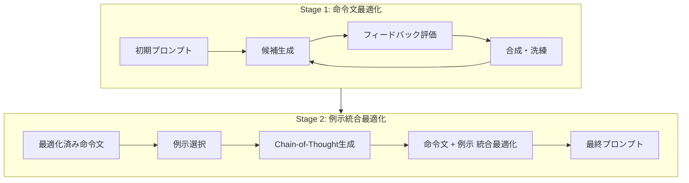

本記事は [PromptWizard: The future of prompt optimization through feedback-driven self-evolving prompts (Microsoft Research Blog)](https://www.microsoft.com/en-us/research/blog/promptwizard-the-future-of-prompt-optimization-through-feedback-driven-self-evolving-prompts/) の解説記事です。

## ブログ概要（Summary）

PromptWizardは、Microsoft Researchが開発したフィードバック駆動の自己進化型プロンプト最適化フレームワークである。LLMが自身でプロンプトと例示を生成・批評・洗練するサイクルを反復し、わずか69回のAPI呼び出しと24kトークンで8つのベースライン手法（Instinct, InstructZero, APE, PromptBreeder, EvoPrompt, DSPy, APO, PromptAgent）を上回る性能を達成したと報告されている。

この記事は [Zenn記事: DSPy×TextGrad比較で学ぶプロンプト自動最適化パイプラインの実践構築](https://zenn.dev/0h_n0/articles/925acb0262a64d) の深掘りです。

## 情報源

- **種別**: 企業テックブログ（Microsoft Research）
- **URL**: [Microsoft Research Blog](https://www.microsoft.com/en-us/research/blog/promptwizard-the-future-of-prompt-optimization-through-feedback-driven-self-evolving-prompts/)
- **組織**: Microsoft Research
- **発表日**: 2024年
- **論文**: [arXiv:2405.18369](https://arxiv.org/abs/2405.18369)

## 技術的背景（Technical Background）

プロンプト最適化の研究は、大きく以下のアプローチに分類される。

1. **LLM-as-optimizer**: LLMに命令文を直接生成・改善させる（APE, OPRO）
2. **進化的手法**: プロンプトの集団を維持し、突然変異・交叉で進化させる（PromptBreeder, EvoPrompt）
3. **コンパイラ型**: 宣言的定義から最適プロンプトをコンパイルする（DSPy）
4. **勾配型**: テキスト勾配でプロンプトを更新する（TextGrad, ProTeGi）

PromptWizardは、これらのアプローチの知見を統合し、「自己進化（self-evolving）」という新しいパラダイムを提案している。従来手法が外部のオプティマイザに依存するのに対し、PromptWizardではLLM自身が生成→批評→洗練のループを回す。

## 実装アーキテクチャ（Architecture）

PromptWizardの最適化は2段階で構成される。

### Stage 1: 命令文の反復洗練

Stage 1では、LLMに複数の命令文候補を生成させ、それぞれを評価し、最も優れた候補をさらに洗練する。

**ステップ1: 候補生成**

LLMに「現在のプロンプトを改善するバリエーションを$n$個生成せよ」と指示する。各候補は異なる観点（簡潔性、詳細性、制約の追加等）からの改善案となる。

**ステップ2: フィードバック評価**

各候補をバリデーションセットで評価し、メトリクスを計算する。同時に、LLMに各候補の「何が良く、何が改善可能か」のフィードバックを生成させる。

**ステップ3: 合成・洗練**

上位候補とフィードバックをLLMに提示し、複数の良い点を統合した新しい候補を生成させる。このサイクルを3-5回反復する。

$$
I_{t+1} = \text{LLM}_{\text{synthesize}}\left(\{I_i^{(t)}, f_i^{(t)}, s_i^{(t)}\}_{i=1}^{n}\right)
$$

ここで、
- $I_i^{(t)}$: $t$回目の反復での$i$番目の候補命令文
- $f_i^{(t)}$: 候補$i$に対するフィードバック（自然言語）
- $s_i^{(t)}$: 候補$i$のメトリクススコア

### Stage 2: 例示の統合最適化

Stage 2では、Stage 1で最適化された命令文に対して、例示（few-shot例）を選択・生成し、命令文と例示を統合的に最適化する。

**例示選択**: バリデーションセットから高品質な入出力ペアを選択
**Chain-of-Thought生成**: 選択された例示に対して、LLMに推論過程（Chain-of-Thought）を生成させる。これにより、例示が単なる入出力ペアではなく、推論ステップを含む「思考例」として機能する
**統合最適化**: 命令文と例示の組み合わせをフィードバックループで洗練

### DSPyのOptimizer群との比較

PromptWizardの2段階アプローチと、DSPyの各Optimizerの対応関係を整理する。

| 設計軸 | PromptWizard | DSPy BootstrapFewShot | DSPy MIPROv2 | DSPy GEPA |
|--------|-------------|----------------------|-------------|-----------|
| **命令文最適化** | Stage 1で反復洗練 | なし | Bayesian Opt | 反省的進化 |
| **例示最適化** | Stage 2でCoT生成 | トレースから選択 | Bayesian Opt | Pareto-aware |
| **統合最適化** | 2段階パイプライン | EOのみ | IO + EO同時 | IO + EO + 反省 |
| **API呼び出し数** | 69回 | $O(N)$回 | 210回+ | 数百回 |
| **自己進化** | あり（LLM自身が批評） | なし | なし | あり（反省） |

著者らは、PromptWizardが69回のAPI呼び出しでDSPyを含む8手法を上回ったと報告している。この効率性は、LLMの自己批評能力を活用することで、ブラインド探索を大幅に削減できることを示唆している。

## パフォーマンス最適化（Performance）

Microsoft Researchブログに記載されている性能指標を整理する。

**精度**:
- 45以上の多様なタスクで8つのベースライン手法を上回る精度を達成
- 比較対象: Instinct, InstructZero, APE, PromptBreeder, EvoPrompt, DSPy, APO, PromptAgent

**効率性**:
- 69回のAPI呼び出しのみ（競合手法は数千回）
- 24kトークンの消費（競合手法は数十万トークン）

**データ効率**:
- わずか5件の訓練例で、25件使用時と比較して5%以内の精度低下に収まる
- 少数データ環境での実用性が高い

**モデル柔軟性**:
- Llama-70Bでのプロンプト生成がGPT-4と同等の性能を達成
- 小型モデルでの最適化にも対応可能

**制約事項**:
- ブログではベンチマーク名やスコアの具体的な数値が限定的に記載されている。詳細な実験結果は[arXiv論文](https://arxiv.org/abs/2405.18369)を参照されたい
- 69回のAPI呼び出しは「最適化フェーズ」のみのカウントであり、推論時の呼び出しは別途発生する

## 運用での学び（Production Lessons）

PromptWizardのアプローチから、本番環境での教訓を抽出する。

**1. 自己進化ループの安定性**: LLMが自身の出力を批評・改善するループは、反復が進むと「改善のための改善」（PromptBreederで報告されている問題）に陥るリスクがある。PromptWizardは反復回数を3-5回に制限することでこのリスクを軽減している。TextGradで報告された過学習問題（NTTドコモ検証事例、Zenn記事参照）と同種の課題である

**2. コスト予測可能性**: PromptWizardの69回という固定的なAPI呼び出し回数は、コスト見積もりを容易にする。DSPyのMIPROv2（`num_trials × num_candidates`回）やGEPA（トレース数に依存）と比較して、コスト管理が簡単

**3. Chain-of-Thought例示の効果**: PromptWizardのStage 2で生成されるChain-of-Thought付き例示は、DSPyのChainOfThought Moduleと同じ原理に基づく。推論過程を明示的に例示に含めることで、LLMの推論品質が向上する

**4. 少数データへの対応**: 5件の訓練例で実用的な性能が得られるという報告は、ドメイン特化のタスクでラベル付きデータが少ない場合に有効。ただし、この効率性は自己進化メカニズムに依存するため、反復品質が低下する小型モデルでは効果が限定的になりうる

## 学術研究との関連（Academic Connection）

PromptWizardは、以下の学術研究の知見を実装に落とし込んでいる。

- **APE** (Zhou et al., 2023): 命令文の自動生成。PromptWizardはAPEの「生成→評価」サイクルにフィードバックループを追加
- **PromptBreeder** (Fernando et al., 2023): 進化的プロンプト最適化。PromptWizardは進化ではなく自己批評による洗練を採用
- **DSPy MIPROv2**: Bayesian Optimizationによる IO + EO統合最適化。PromptWizardはBayesian Optimizationの代わりにLLMの自己進化を使用
- **TextGrad** (Yuksekgonul et al., 2024): テキスト勾配による最適化。PromptWizardはより構造化された2段階パイプラインを採用

PromptWizardの最大の特徴は、**探索の効率性**にある。69回のAPI呼び出しという極めて少ないコストで競合手法を上回る点は、LLMの自己批評能力がブラインド探索（ランダムサーチ、Bayesian Opt等）の代替として有効であることを示唆している。

## まとめと実践への示唆

PromptWizardは、LLMの自己進化能力を活用した効率的なプロンプト最適化フレームワークである。Microsoft Researchの報告によれば、69回のAPI呼び出しでDSPyを含む8手法を上回り、5件の訓練例でも実用的な精度を達成している。

Zenn記事で紹介したDSPyの「BootstrapFewShot → MIPROv2 → GEPA」の最適化フローに対して、PromptWizardは「自己進化による統合最適化」という別のアプローチを提供する。両者は排他的ではなく、PromptWizardで初期プロンプトを効率的に生成し、DSPyのMIPROv2やGEPAでさらに洗練するハイブリッドアプローチも考えられる。

プロンプト最適化の実務では、まず計算コストの低い手法（BootstrapFewShot、PromptWizard）で基準性能を確認し、必要に応じてコストの高い手法（MIPROv2、GEPA）に移行する段階的アプローチが推奨される。

## 参考文献

- **Blog URL**: [https://www.microsoft.com/en-us/research/blog/promptwizard-the-future-of-prompt-optimization-through-feedback-driven-self-evolving-prompts/](https://www.microsoft.com/en-us/research/blog/promptwizard-the-future-of-prompt-optimization-through-feedback-driven-self-evolving-prompts/)
- **arXiv**: [https://arxiv.org/abs/2405.18369](https://arxiv.org/abs/2405.18369)
- **Related Zenn article**: [https://zenn.dev/0h_n0/articles/925acb0262a64d](https://zenn.dev/0h_n0/articles/925acb0262a64d)

---

> 本記事は [Microsoft Research Blog](https://www.microsoft.com/en-us/research/blog/promptwizard-the-future-of-prompt-optimization-through-feedback-driven-self-evolving-prompts/) の解説記事です。記載内容はブログおよび関連論文の記述に基づいており、筆者が独自に実験を行ったものではありません。
