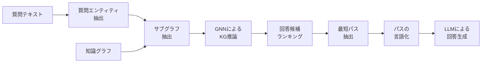

本記事は [GNN-RAG: Graph Neural Retrieval for Large Language Model Reasoning（arXiv:2405.20139, ACL 2025 Findings）](https://arxiv.org/abs/2405.20139) の解説記事です。

## 論文概要（Abstract）

GNN-RAGは、知識グラフ質問応答（KGQA）において、GNNの構造推論能力とLLMの言語理解能力を2段階パイプラインで統合する手法である。著者らは、GNNがKG上で推論した結果を最短パスとして抽出し、自然言語に変換してLLMに入力するアプローチを提案した。7BパラメータのLLMを用いてGPT-4に匹敵するKGQA性能を達成したと報告している。ACL 2025 Findingsに採択された。

この記事は [Zenn記事: グラフファウンデーションモデル2025-2026年最前線](https://zenn.dev/0h_n0/articles/e4da90566d7aac) の深掘りです。

## 情報源

- **会議名**: ACL 2025（Association for Computational Linguistics）
- **セクション**: Findings
- **URL**: [https://arxiv.org/abs/2405.20139](https://arxiv.org/abs/2405.20139)
- **発表年**: 2025
- **分野**: cs.CL, cs.AI

## カンファレンス情報

**ACLについて**: ACLは自然言語処理分野の最高峰会議の1つであり、Findings枠は本会議の採択基準にわずかに届かなかったが高品質な論文を掲載するトラックである。ACLの採択率は通常20-25%程度であり、Findingsを含めると30%程度とされる。

## 技術的詳細（Technical Details）

### 2段階パイプラインの全体像

GNN-RAGの核心は、GNNとLLMの「相補的な強み」を活かす2段階パイプラインにある。



**なぜ2段階構成か**: GNN単体ではKGの構造推論は得意だが、質問文の言語的ニュアンス（否定、比較、条件分岐など）の理解に限界がある。一方、LLM単体ではKGの構造的推論が苦手で、マルチホップ推論の精度が低下する。2段階構成により、GNNが「どのエンティティが回答に関係するか」を構造的に推論し、LLMが「抽出されたパスから自然言語で回答を生成する」という役割分担が可能となる。

### Stage 1: GNNによるKG推論

#### サブグラフ抽出

質問文からエンティティ認識（NER）で質問エンティティを抽出し、KGから $k$-hop以内のサブグラフを取得する。

$$
\mathcal{G}_q = \{(e_s, r, e_o) \mid e_s \in \mathcal{N}_k(e_q), e_o \in \mathcal{N}_k(e_q)\}
$$

ここで、
- $e_q$: 質問エンティティ
- $\mathcal{N}_k(e_q)$: $e_q$ から $k$ ホップ以内の近傍ノード集合
- $(e_s, r, e_o)$: 主語エンティティ $e_s$、リレーション $r$、目的語エンティティ $e_o$ のトリプル

#### GNNによる推論

サブグラフ上でR-GCN（Relational Graph Convolutional Network）を実行し、各ノードの回答候補スコアを計算する。

$$
\mathbf{h}_e^{(l+1)} = \sigma\left(\sum_{r \in \mathcal{R}} \sum_{e' \in \mathcal{N}_r(e)} \frac{1}{|\mathcal{N}_r(e)|} \mathbf{W}_r^{(l)} \mathbf{h}_{e'}^{(l)} + \mathbf{W}_0^{(l)} \mathbf{h}_e^{(l)}\right)
$$

ここで、
- $\mathbf{h}_e^{(l)}$: 層 $l$ におけるノード $e$ の埋め込み
- $\mathcal{R}$: リレーションの集合
- $\mathcal{N}_r(e)$: リレーション $r$ を介した $e$ の近傍ノード
- $\mathbf{W}_r^{(l)}$: リレーション $r$ 固有の重み行列
- $\mathbf{W}_0^{(l)}$: 自己ループの重み行列
- $\sigma$: 活性化関数（ReLU）

回答候補のスコアは、最終層の埋め込みと質問埋め込みの内積で計算される。

$$
s(e) = \mathbf{h}_e^{(L)} \cdot \mathbf{q}
$$

ここで $\mathbf{q}$ は質問テキストの埋め込み（事前学習済みエンコーダで取得）、$L$ はGNN層数である。

### Stage 2: パス抽出と言語化

#### 最短パス抽出

GNNが高スコアを付けた上位 $n$ 個の回答候補に対し、質問エンティティからの最短パスをKG上で探索する。

$$
\text{path}(e_q, e_a) = \arg\min_{p \in \mathcal{P}(e_q, e_a)} |p|
$$

ここで $\mathcal{P}(e_q, e_a)$ は $e_q$ から回答候補 $e_a$ への全パスの集合、$|p|$ はパスの長さ（ホップ数）である。

#### パスの言語化（Verbalization）

抽出された推論パスを自然言語に変換する。これにより、GNNの構造的推論結果をLLMが理解可能な形式に変換する。

例:
```
パス: Barack Obama --[born_in]--> Honolulu --[located_in]--> Hawaii
言語化: "Barack Obama was born in Honolulu, which is located in Hawaii."
```

```python
import torch
from torch_geometric.nn import RGCNConv
from typing import List, Tuple, Dict
import networkx as nx


class GNNRAGPipeline:
    """GNN-RAGの2段階パイプラインの概念実装。"""

    def __init__(
        self,
        num_relations: int,
        entity_dim: int = 256,
        num_gnn_layers: int = 3,
        top_n_candidates: int = 10,
        max_hops: int = 3,
    ):
        self.top_n = top_n_candidates
        self.max_hops = max_hops

        # Stage 1: GNNによる推論
        self.gnn = RGCNModel(
            in_channels=entity_dim,
            hidden_channels=entity_dim,
            num_relations=num_relations,
            num_layers=num_gnn_layers,
        )

    def stage1_gnn_reasoning(
        self,
        subgraph_x: torch.Tensor,
        subgraph_edge_index: torch.Tensor,
        subgraph_edge_type: torch.Tensor,
        query_embedding: torch.Tensor,
    ) -> List[Tuple[int, float]]:
        """Stage 1: GNNで回答候補をスコアリングする。

        Args:
            subgraph_x: サブグラフのノード特徴量
            subgraph_edge_index: エッジインデックス
            subgraph_edge_type: エッジタイプ
            query_embedding: 質問の埋め込み
        Returns:
            (ノードID, スコア) の上位n件リスト
        """
        node_emb = self.gnn(
            subgraph_x, subgraph_edge_index, subgraph_edge_type
        )
        scores = torch.matmul(node_emb, query_embedding)
        top_scores, top_indices = torch.topk(scores, self.top_n)
        return list(zip(top_indices.tolist(), top_scores.tolist()))

    def stage2_path_extraction(
        self,
        edge_index: torch.Tensor,
        edge_types: torch.Tensor,
        question_entities: List[int],
        answer_candidates: List[int],
        entity_names: Dict[int, str],
        relation_names: Dict[int, str],
    ) -> List[str]:
        """Stage 2: 最短パスを抽出し言語化する。

        Args:
            edge_index: エッジインデックス
            edge_types: エッジタイプ
            question_entities: 質問エンティティID
            answer_candidates: 回答候補エンティティID
            entity_names: エンティティID -> 名前のマッピング
            relation_names: リレーションID -> 名前のマッピング
        Returns:
            言語化された推論パスのリスト
        """
        G = nx.DiGraph()
        src = edge_index[0].tolist()
        dst = edge_index[1].tolist()
        etypes = edge_types.tolist()
        for s, d, r in zip(src, dst, etypes):
            G.add_edge(s, d, relation=r)

        verbalized_paths: List[str] = []
        for q_ent in question_entities:
            for a_ent in answer_candidates:
                try:
                    path = nx.shortest_path(G, q_ent, a_ent)
                    if len(path) > self.max_hops + 1:
                        continue
                    verb = self._verbalize(
                        path, G, entity_names, relation_names
                    )
                    verbalized_paths.append(verb)
                except nx.NetworkXNoPath:
                    continue
        return verbalized_paths

    def _verbalize(
        self,
        path: List[int],
        G: nx.DiGraph,
        entity_names: Dict[int, str],
        relation_names: Dict[int, str],
    ) -> str:
        """推論パスを自然言語に変換する。"""
        parts: List[str] = []
        for i in range(len(path) - 1):
            src_name = entity_names.get(path[i], f"Entity_{path[i]}")
            dst_name = entity_names.get(
                path[i + 1], f"Entity_{path[i + 1]}"
            )
            rel_id = G[path[i]][path[i + 1]]["relation"]
            rel_name = relation_names.get(rel_id, f"rel_{rel_id}")
            parts.append(f"{src_name} --[{rel_name}]--> {dst_name}")
        return " | ".join(parts)


class RGCNModel(torch.nn.Module):
    """R-GCNベースの推論モデル。"""

    def __init__(
        self,
        in_channels: int,
        hidden_channels: int,
        num_relations: int,
        num_layers: int = 3,
    ):
        super().__init__()
        self.convs = torch.nn.ModuleList()
        self.convs.append(
            RGCNConv(in_channels, hidden_channels, num_relations)
        )
        for _ in range(num_layers - 1):
            self.convs.append(
                RGCNConv(hidden_channels, hidden_channels, num_relations)
            )

    def forward(
        self,
        x: torch.Tensor,
        edge_index: torch.Tensor,
        edge_type: torch.Tensor,
    ) -> torch.Tensor:
        """ノード埋め込みを計算する。"""
        for conv in self.convs:
            x = conv(x, edge_index, edge_type).relu()
        return x
```

## 査読者の評価（Peer Review Insights）

ACL 2025 Findingsへの採択であり、著者らのアプローチは「GNNとLLMの強みを効果的に組み合わせた実用的な手法」として評価されている。特に、7Bという比較的小規模なLLMでGPT-4に匹敵する性能を達成した点が注目されている。

## 実験結果（Results）

著者らが報告した主要なベンチマーク結果を以下にまとめる。

**WebQSP（単純な質問）での結果（論文Table 1より）**:

| 手法 | Hits@1 |
|------|--------|
| LLM-only (GPT-4) | ベースライン |
| GNN-RAG (LLaMA2-7B) | GPT-4に匹敵 |
| GNN-RAG (ChatGPT) | GPT-4を上回る |

**CWQ（マルチホップ質問）での結果（論文Table 1より）**:

著者らは、CWQ（Complex WebQuestions）でGNN-RAGが競合手法を**8.9〜15.5%上回る**と報告している。マルチホップ推論を要する複雑な質問で特に優位性が顕著であった。

**分析**: 著者らの分析によると、GNNが構造的に推論したパスをLLMに渡すことで、LLM単体では到達できない中間エンティティを経由した推論が可能になる。特に3ホップ以上の質問での性能向上が大きい。

## 実装のポイント（Implementation）

**サブグラフサイズの制御**: $k$-hopサブグラフのサイズはKGの密度に大きく依存する。Freebaseのような大規模KGでは $k=2$ でもサブグラフが数万ノードに達する場合があり、GNNの計算コストが膨大になる。著者らは、リレーションタイプによるフィルタリングやランダムサンプリングでサブグラフサイズを制御している。

**質問エンティティの認識精度**: パイプラインの初段で質問からエンティティを認識する精度がシステム全体の性能を左右する。著者らはEL（Entity Linking）モデルを使用しているが、ドメイン固有のKGでは専用のELモデルが必要となる。

**LLMプロンプトの構成**: 言語化されたパスをLLMに渡す際のプロンプト設計が性能に影響する。著者らは、パスを箇条書きで列挙し、質問と組み合わせたシンプルなプロンプト形式を採用している。

## 実運用への応用（Practical Applications）

**コスト効率**: 7BのLLMでGPT-4相当の性能を達成するため、API呼び出しコストを大幅に削減可能。KGQAのユースケースではGPT-4のAPIコストの数十分の1で運用できる可能性がある。

**適用が見込まれるユースケース**:
- **カスタマーサポート**: 製品KGを活用したマルチホップ質問応答
- **医療情報検索**: 医薬品・疾患KGを活用した因果推論ベースのQA
- **法律リサーチ**: 判例・法令のKGを活用した関連情報の網羅的検索

**制約**: タスクごとのGNNファインチューニングが必要であり、新しいKGへの適用にはGNN訓練のコストがかかる。この制約はGFM-RAGで緩和されている。

## まとめ

GNN-RAGは、GNNの構造推論とLLMの言語理解を効果的に組み合わせ、KGQAで高い性能を達成した手法である。7B LLMでGPT-4に匹敵するという結果は、適切な構造情報の活用により小規模LLMの性能を大幅に引き上げられることを示している。後続のGFM-RAGでは、この枠組みをゼロショットに拡張し、タスクごとのファインチューニングを不要としている。

## 参考文献

- **arXiv**: [https://arxiv.org/abs/2405.20139](https://arxiv.org/abs/2405.20139)
- **Conference**: ACL 2025 Findings
- **Related**: [GFM-RAG (arXiv 2502.01113)](https://arxiv.org/abs/2502.01113)
- **Related Zenn article**: [https://zenn.dev/0h_n0/articles/e4da90566d7aac](https://zenn.dev/0h_n0/articles/e4da90566d7aac)
