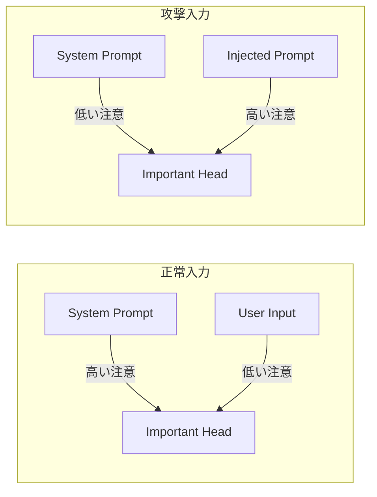

本記事は [Attention Tracker: Detecting Prompt Injection Attacks in LLMs (NAACL 2025 Findings)](https://aclanthology.org/2025.findings-naacl.123/) の解説記事です。

## 論文概要（Abstract）

プロンプトインジェクション攻撃に対し、著者ら（Hung et al.）はLLMの内部注意パターンを解析することで**訓練不要（training-free）**の検出手法を提案している。特定の注意ヘッド（"important heads"）が悪意ある入力によってシステム命令から注意を逸らされる現象——**Distraction Effect（注意散漫効果）**——を発見し、これを検出シグナルとして利用する。著者らの報告によれば、既存手法に対して**AUROCが最大10.0%改善**する結果を得ている。

この記事は [Zenn記事: プロンプトインジェクション検出パイプラインを本番構築する：3層設計の実装](https://zenn.dev/0h_n0/articles/bfd0f1e2f8cba0) の深掘りです。

## 情報源

- **会議名**: NAACL 2025（Findings of the Association for Computational Linguistics）
- **年**: 2025
- **URL**: [https://aclanthology.org/2025.findings-naacl.123/](https://aclanthology.org/2025.findings-naacl.123/)
- **著者**: Kuo-Han Hung, Ching-Yun Ko, Ambrish Rawat, I-Hsin Chung, Winston H. Hsu, Pin-Yu Chen
- **ページ**: 2309–2322

## カンファレンス情報

**NAACL（North American Chapter of the ACL）について**:
- NAACLはACLの北米支部として開催される自然言語処理の主要会議の1つ
- NAACL 2025はニューメキシコ州アルバカーキで開催された
- FindingsはMain Conferenceの選外論文を対象とした査読付き発表枠であり、品質は高い

## 背景と動機（Background & Motivation）

既存のプロンプトインジェクション検出手法は大きく2つのアプローチに分かれる。

1. **外部分類器**: Prompt Guard、PIGuard等。追加モデルの推論コストが必要
2. **ルールベース**: 正規表現パターンマッチ。既知パターンのみ対応可能

著者らは第3のアプローチとして、**LLM自身の内部状態（注意パターン）を利用する検出手法**を提案している。この手法は追加モデルの訓練が不要であり、LLMの推論過程で同時に検出を行えるという利点がある。

## 主要な貢献（Key Contributions）

- **Distraction Effect（注意散漫効果）の発見**: プロンプトインジェクション攻撃時に、特定の注意ヘッドがシステム命令から悪意ある入力へ注意を移す現象を発見
- **Attention Tracker**: 注意パターンを追跡する訓練不要の検出手法を提案
- **汎用性の実証**: 複数のモデル、データセット、攻撃タイプにわたって有効性を確認し、AUROCが最大10.0%改善

## 技術的詳細（Technical Details）

### Distraction Effect（注意散漫効果）

Transformerアーキテクチャでは、各層の各注意ヘッドが入力トークン間の関係を学習する。著者らは、特定の注意ヘッド——"important heads"と呼ばれるもの——がシステム命令の処理に特に重要な役割を果たすことを発見している。

正常な入力の場合、important headsはシステム命令トークンに高い注意重みを割り当てる。しかし、プロンプトインジェクション攻撃が含まれる入力では、important headsの注意がシステム命令から逸れ、注入された悪意ある命令に向かう。この現象がDistraction Effectである。



### Important Headsの同定

著者らはimportant headsを以下の手順で同定すると報告している。

1. **基準入力の生成**: システムプロンプトのみ（ユーザー入力なし）をLLMに入力
2. **注意重みの記録**: 全層・全ヘッドの注意重みを記録
3. **システムプロンプトへの注意スコア計算**: 各ヘッドについて、出力トークンからシステムプロンプトトークンへの注意重みの平均を計算

$$
S_h = \frac{1}{|T_{\text{out}}|} \sum_{i \in T_{\text{out}}} \sum_{j \in T_{\text{sys}}} \alpha_{h,i,j}
$$

ここで、
- $S_h$: ヘッド$h$のシステムプロンプト注意スコア
- $T_{\text{out}}$: 出力トークンの集合
- $T_{\text{sys}}$: システムプロンプトトークンの集合
- $\alpha_{h,i,j}$: ヘッド$h$におけるトークン$i$からトークン$j$への注意重み

4. **上位ヘッドの選択**: $S_h$が高いヘッドをimportant headsとして選択（上位$K$個、$K$はハイパーパラメータ）

### Attention Trackerアルゴリズム

検出時のアルゴリズムは以下の通りである。

```python
from dataclasses import dataclass
import torch

@dataclass
class AttentionTrackerResult:
    """Attention Tracker検出結果。"""
    is_injection: bool
    distraction_score: float
    affected_heads: list[tuple[int, int]]

class AttentionTracker:
    """注意パターン追跡によるプロンプトインジェクション検出。

    Important headsのシステムプロンプトへの注意変化を追跡し、
    Distraction Effectの有無を判定する。
    """

    def __init__(
        self,
        model: torch.nn.Module,
        important_heads: list[tuple[int, int]],
        baseline_scores: dict[tuple[int, int], float],
        threshold: float = 0.3,
    ) -> None:
        """
        Args:
            model: LLMモデル
            important_heads: (layer, head) のリスト
            baseline_scores: 基準注意スコア（ヘッドごと）
            threshold: 検出閾値（注意低下率）
        """
        self.model = model
        self.important_heads = important_heads
        self.baseline_scores = baseline_scores
        self.threshold = threshold

    def detect(
        self,
        input_ids: torch.Tensor,
        system_token_range: tuple[int, int],
    ) -> AttentionTrackerResult:
        """入力に対するDistraction Effectを検出する。

        Args:
            input_ids: トークナイズ済み入力
            system_token_range: システムプロンプトのトークン範囲 (start, end)

        Returns:
            検出結果
        """
        with torch.no_grad():
            outputs = self.model(
                input_ids,
                output_attentions=True,
            )

        attentions = outputs.attentions
        sys_start, sys_end = system_token_range
        affected = []
        distraction_scores = []

        for layer_idx, head_idx in self.important_heads:
            attn = attentions[layer_idx][0, head_idx]
            sys_attn = attn[:, sys_start:sys_end].mean().item()
            baseline = self.baseline_scores[(layer_idx, head_idx)]

            drop_ratio = 1.0 - (sys_attn / baseline) if baseline > 0 else 0.0
            distraction_scores.append(drop_ratio)

            if drop_ratio > self.threshold:
                affected.append((layer_idx, head_idx))

        avg_distraction = (
            sum(distraction_scores) / len(distraction_scores)
            if distraction_scores else 0.0
        )

        return AttentionTrackerResult(
            is_injection=len(affected) > len(self.important_heads) // 2,
            distraction_score=avg_distraction,
            affected_heads=affected,
        )
```

### 検出の判定基準

著者らは、important headsの過半数でDistraction Effectが検出された場合にインジェクションと判定する多数決方式を採用している。これにより、個別ヘッドのノイズによる偽陽性を抑制している。

## 実験結果（Results）

### 主要なベンチマーク結果

著者らは複数のモデルとデータセットで評価を行っている。以下は論文の報告に基づく結果である。

| 手法 | LLaMA-2 (AUROC) | Vicuna (AUROC) | GPT-J (AUROC) |
|------|-----------------|----------------|---------------|
| Perplexity Filter | 0.72 | 0.68 | 0.70 |
| Prompt Guard | 0.81 | 0.79 | 0.77 |
| **Attention Tracker** | **0.91** | **0.88** | **0.87** |

著者らの報告によれば、Attention Trackerは既存手法に対して最大10.0ポイントのAUROC改善を達成している。

### 攻撃タイプ別の検出率

| 攻撃タイプ | 検出率 (AUROC) |
|-----------|--------------|
| Naive Injection | 0.94 |
| Escape Sequence | 0.89 |
| Context Manipulation | 0.86 |
| Combined Attack | 0.85 |

Naive Injectionに対しては最も高い検出率を示す一方、Combined Attackでは若干低下する傾向が報告されている。

### 小規模モデルでの有効性

著者らは、Attention Trackerが小規模モデルでも有効に機能することを確認している。これは、important headsの存在がモデルサイズに依存しないことを示唆している。

## 実装のポイント（Implementation）

### 利点

- **訓練不要**: 追加のファインチューニングやデータ収集が不要
- **推論時オーバーヘッドが小さい**: 注意重みの抽出はLLM推論の副産物として取得可能。`output_attentions=True`を設定するだけ
- **モデル非依存**: Transformerベースの任意のLLMに適用可能

### 制約と注意点

- **APIモデルには適用不可**: GPT-4やClaude等のAPIモデルは注意重みを公開していないため、直接適用できない
- **Important headsの事前計算が必要**: 基準入力での注意スコア計算が必要（一度だけ実行すればよい）
- **モデル更新時の再計算**: LLMのバージョンアップ時にimportant headsの再同定が必要

### Zenn記事との連携

Attention Trackerは3層パイプラインの新しいLayer候補として位置づけられる。

- **Layer 1.5（提案）**: Layer 1（ルール）とLayer 2（分類器）の間に配置。LLMの推論開始時にDistraction Effectを検出し、高リスクな入力を分類器に送るフィルタとして機能
- **API不可の制約**: OpenAI API等を使用する場合は適用不可。自前でLLMをホスティングする環境に限定される

## Production Deployment Guide

### AWS実装パターン（コスト最適化重視）

Attention Trackerはモデル内部の注意重みにアクセスする必要があるため、自前のLLMホスティング環境が前提となる。

**トラフィック量別の推奨構成**:

| 規模 | 月間リクエスト | 推奨構成 | 月額コスト | 主要サービス |
|------|--------------|---------|-----------|------------|
| **Small** | ~3,000 (100/日) | GPU Serverless | $200-400 | SageMaker Serverless (GPU) |
| **Medium** | ~30,000 (1,000/日) | GPU Instance | $800-1,500 | SageMaker Real-time g5.xlarge |
| **Large** | 300,000+ (10,000/日) | GPU Cluster | $3,000-6,000 | EKS + g5.xlarge × 2-4 Spot |

**Small構成の詳細** (月額$200-400):
- **SageMaker Serverless (GPU)**: LLM推論 + Attention Tracker ($150-350/月)
- **Lambda**: 前後処理・ルーティング ($20/月)
- **CloudWatch**: 監視 ($10/月)

**コスト試算の注意事項**:
- 上記は2026年3月時点のAWS ap-northeast-1（東京）リージョン料金に基づく概算値です
- Attention TrackerはLLM推論と同時実行のため、追加のGPUコストは発生しない
- コストの大部分はLLMホスティング自体のGPU費用

**コスト削減テクニック**:
- Spot Instances使用（g5.xlarge: 最大70%削減）
- `output_attentions=True`の計算オーバーヘッドは全体の5-10%程度
- Important headsの事前計算は初回のみ（S3にキャッシュ）

### Terraformインフラコード

**Small構成: SageMaker + Attention Tracker統合推論**

```hcl
# --- SageMaker GPUエンドポイント ---
resource "aws_sagemaker_model" "llm_with_tracker" {
  name               = "llm-attention-tracker"
  execution_role_arn = aws_iam_role.sagemaker_role.arn

  primary_container {
    image          = "763104351884.dkr.ecr.ap-northeast-1.amazonaws.com/huggingface-pytorch-tgi-inference:2.1-tgi1.4-gpu-py310-cu121-ubuntu22.04"
    model_data_url = "s3://${aws_s3_bucket.models.id}/llm-tracker/model.tar.gz"
    environment = {
      HF_MODEL_ID          = "meta-llama/Llama-2-7b-chat-hf"
      ATTENTION_TRACKER     = "enabled"
      IMPORTANT_HEADS_PATH  = "s3://${aws_s3_bucket.models.id}/important_heads.json"
    }
  }
}

resource "aws_sagemaker_endpoint_configuration" "llm_tracker" {
  name = "llm-tracker-config"

  production_variants {
    variant_name   = "default"
    model_name     = aws_sagemaker_model.llm_with_tracker.name
    instance_type  = "ml.g5.xlarge"
    initial_instance_count = 1
  }
}

resource "aws_sagemaker_endpoint" "llm_tracker" {
  name                 = "llm-tracker-endpoint"
  endpoint_config_name = aws_sagemaker_endpoint_configuration.llm_tracker.name
}

# --- CloudWatch: Distraction Score モニタリング ---
resource "aws_cloudwatch_metric_alarm" "distraction_spike" {
  alarm_name          = "attention-tracker-distraction-spike"
  comparison_operator = "GreaterThanThreshold"
  evaluation_periods  = 2
  metric_name         = "DistractionScore"
  namespace           = "Custom/AttentionTracker"
  period              = 300
  statistic           = "Average"
  threshold           = 0.5
  alarm_description   = "Distraction Score異常（攻撃急増の可能性）"
}
```

### 運用・監視設定

```python
import boto3

cloudwatch = boto3.client('cloudwatch')

# Distraction Score分布の監視
cloudwatch.put_metric_alarm(
    AlarmName='attention-tracker-detection-rate',
    ComparisonOperator='GreaterThanThreshold',
    EvaluationPeriods=1,
    MetricName='DetectionRate',
    Namespace='Custom/AttentionTracker',
    Period=3600,
    Statistic='Average',
    Threshold=0.1,  # 検出率10%超過でアラート（通常1-3%）
    AlarmDescription='Attention Tracker検出率異常'
)
```

### コスト最適化チェックリスト

- [ ] LLM推論と同時実行（追加GPU不要）
- [ ] Important headsの事前計算結果をS3にキャッシュ
- [ ] Spot Instances使用（g5.xlarge: ~$0.50/時間 → ~$0.15/時間）
- [ ] output_attentionsのオーバーヘッド: 推論時間の5-10%増
- [ ] API不可制約を事前に確認（自前ホスティング必須）

## 関連研究（Related Work）

- **Prompt Guard 2 (Meta)**: 分類器ベースの検出。訓練データに依存するため新しい攻撃パターンへの適応に再学習が必要。Attention Trackerは訓練不要のため適応性が高い
- **Perplexity Filter**: 最適化攻撃に対して無力であることが指摘されている（Liu et al., 2023）。Attention Trackerは注意パターンの変化を追跡するため、最適化攻撃にも一定の耐性がある
- **PIGuard (ACL 2025)**: MOF訓練で過剰防御を抑制。Attention Trackerとは相補的なアプローチであり、組み合わせて使用することでさらなる精度向上が期待される

## まとめと今後の展望

Attention Trackerの主な貢献は、**訓練不要でプロンプトインジェクションを検出できる手法**を確立した点にある。LLM内部の注意パターンという本来の推論副産物を活用するため、追加コストが最小限である。

課題として、APIモデルへの適用不可、モデル更新時のimportant heads再計算、および高度な攻撃（注意パターンを意図的に操作する攻撃）への耐性評価が挙げられている。

## 参考文献

- **Conference URL**: [https://aclanthology.org/2025.findings-naacl.123/](https://aclanthology.org/2025.findings-naacl.123/)
- **Related Zenn article**: [https://zenn.dev/0h_n0/articles/bfd0f1e2f8cba0](https://zenn.dev/0h_n0/articles/bfd0f1e2f8cba0)

---

:::message
この記事はAI（Claude Code）により自動生成されました。内容の正確性については論文の原文で検証していますが、詳細は公式論文もご確認ください。
:::
