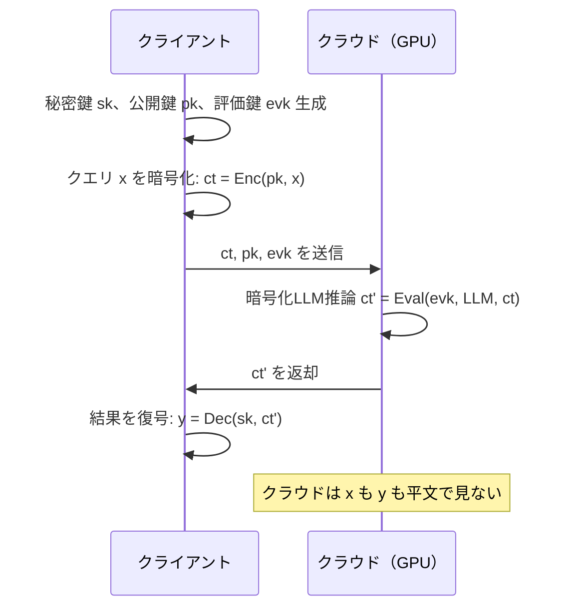

本記事は [EncryptedLLM: Privacy-Preserving Large Language Model Inference via GPU-Accelerated Fully Homomorphic Encryption](https://proceedings.mlr.press/v267/de-castro25a.html)（ICML 2025）の解説記事です。

## 論文概要（Abstract）

大規模言語モデル（LLM）の推論をクラウドに委託する際、ユーザーのクエリがクラウドプロバイダに漏洩するリスクがある。本論文の著者ら（De Castro, Escudero, Agrawal, Polychroniadou, Veloso）は、準同型暗号（FHE）を用いてクエリを暗号化したままクラウド上でLLM推論を実行する手法を提案している。GPU加速によりCPU実装比で200倍以上の高速化を達成し、GPT-2の暗号化フォワードパスを実用的な速度で実行できることを実証している。

この記事は [Zenn記事: 準同型暗号（FHE）2026年最新動向：暗号化したままAI推論を実現する技術](https://zenn.dev/0h_n0/articles/55ffbd99f5d0ed) の深掘りです。

## 情報源

- **会議名**: ICML 2025（42nd International Conference on Machine Learning）
- **掲載**: Proceedings of Machine Learning Research (PMLR), Volume 267, Pages 12677-12688
- **URL**: [https://proceedings.mlr.press/v267/de-castro25a.html](https://proceedings.mlr.press/v267/de-castro25a.html)
- **著者**: Leo De Castro, Daniel Escudero, Adya Agrawal, Antigoni Polychroniadou, Manuela Veloso
- **発表形式**: Poster
- **ライセンス**: CC BY 4.0

## カンファレンス情報

**ICMLについて**: ICML（International Conference on Machine Learning）は機械学習分野の最高峰国際会議の一つであり、NeurIPS・ICLRと並ぶトップ会議である。本論文はICML 2025にポスター論文として採択されており、Privacy分野（Social Aspects → Privacy）に分類されている。

## 背景と動機

LLMの推論コストが増大する中、多くのユーザーやサービスがクラウドプロバイダにLLM推論を委託している。しかし、クラウドに送信されるクエリには個人情報、医療情報、企業機密が含まれる可能性があり、プライバシーリスクが存在する。

従来のプライバシー保護手法には以下の課題がある。

| 手法 | 課題 |
|------|------|
| **差分プライバシー** | 入力データそのものは保護されない（統計的なノイズ付与のみ） |
| **MPC（秘密計算）** | 通信コストが大きく、WAN環境では実用的なレイテンシが困難 |
| **TEE（信頼実行環境）** | サイドチャネル攻撃への脆弱性、ハードウェア依存 |
| **FHE（準同型暗号）** | 計算コストが膨大（CPU上では非実用的） |

著者らはFHEのアプローチを採用しつつ、GPU加速によって計算コストの課題を大幅に緩和する方向性を提示している。FHEは暗号理論的な安全性保証を持ち、クラウド側がデータを一切復号できないという強い保証がある点が、他の手法に対する優位性である。

## 主要な貢献（Key Contributions）

著者らは以下の3点を主要な貢献として報告している。

- **貢献1**: FHEのGPU加速実装の開発。NTT（Number Theoretic Transform）、鍵交換（Key Switching）、Bootstrappingなどの主要FHE演算をCUDAカーネルで並列化し、CPU比200倍以上の高速化を達成
- **貢献2**: GPT-2モデル全体の暗号化フォワードパスのベンチマーク。暗号化された状態でのLLM推論が実行可能であることを実証
- **貢献3**: LLMの活性化関数（GELU、Softmax等）の多項式近似手法の体系的な実験分析。精度を維持しつつFHE上で効率的に計算可能な近似関数を特定

## 技術的詳細（Technical Details）

### FHEによるLLM推論の全体像

EncryptedLLMのプロトコルは以下の流れで動作する。



著者らはCKKSスキームを採用している。CKKSは実数の近似演算を効率的に行えるため、ニューラルネットワークの浮動小数点演算と相性が良い。

### CKKSスキームの数学的基礎

CKKSスキームでは、平文をガウス整数環 $\mathbb{Z}[i]$ のベクトルとしてエンコードし、多項式環 $R_Q = \mathbb{Z}_Q[X]/(X^N+1)$ 上で演算を行う。暗号文は多項式のペア $(c_0, c_1)$ で表現される。

$$
\text{Enc}(\mathbf{m}) = (c_0, c_1) \in R_Q^2
$$

$$
c_0 = -a \cdot s + e + \Delta \cdot \mathbf{m}, \quad c_1 = a
$$

ここで、
- $\mathbf{m}$: 平文メッセージベクトル
- $s$: 秘密鍵（小さい多項式）
- $a$: ランダム多項式
- $e$: ノイズ（LWE問題の安全性を保証）
- $\Delta$: スケーリングファクター（精度を制御）
- $N$: 多項式次数（$2^{15}$ や $2^{16}$ が一般的）

復号は以下の計算で行う。

$$
\text{Dec}(c_0, c_1) = c_0 + c_1 \cdot s \approx \Delta \cdot \mathbf{m}
$$

### GPU加速の実装戦略

FHEの計算ボトルネックはNTT（Number Theoretic Transform）とBootstrappingである。著者らはこれらをGPU上で並列化している。

**NTTの並列化**: NTTは多項式乗算を $O(N \log N)$ で計算するアルゴリズムであり、FFTの有限体版である。多項式次数 $N$ が $2^{16}$ の場合、$N$ 個の独立したバタフライ演算を並列実行できる。

$$
\text{NTT}: \mathbb{Z}_q[X]/(X^N+1) \to \mathbb{Z}_q^N
$$

GPU上では、各バタフライ演算を1つのCUDAスレッドに割り当てることで、大規模な並列化が可能となる。著者らの報告によると、NTT単体でCPU比約200倍の高速化を達成している。

**Bootstrappingの高速化**: CKKSのBootstrappingは以下のステップで構成される。

1. **ModRaise**: 暗号文のモジュラスを引き上げる
2. **CoeffToSlot**: 係数→スロット変換（DFT相当）
3. **EvalMod**: モジュラリダクションの近似評価
4. **SlotToCoeff**: スロット→係数変換（逆DFT相当）

各ステップは大量の多項式演算（NTT、鍵交換）を含むため、GPU並列化の効果が大きい。著者らはBootstrapping全体でもCPU比200倍の高速化を報告している。

### 活性化関数の多項式近似

FHE上では非多項式関数（GELU、Softmax、LayerNorm）を直接計算できないため、多項式近似が必要となる。著者らは以下の手法を体系的に比較分析している。

**GELU近似**: GELUは以下で定義される。

$$
\text{GELU}(x) = x \cdot \Phi(x) = \frac{x}{2}\left(1 + \text{erf}\left(\frac{x}{\sqrt{2}}\right)\right)
$$

著者らは、Chebyshev多項式による近似を用いている。近似次数 $d$ のChebyshev多項式は以下で与えられる。

$$
p_d(x) = \sum_{k=0}^{d} c_k T_k(x)
$$

ここで $T_k(x)$ は第1種Chebyshev多項式、$c_k$ はChebyshev係数である。著者らの実験分析によると、次数 $d=27$ の多項式近似で、HellaSwag・LAMBADA・ARCベンチマークにおいて平文GPT-2との精度劣化が最小限に抑えられると報告されている。

**Softmax近似**: Softmaxはexponential関数を含むため、多項式近似が必要である。入力範囲を制限した上で、低次多項式で近似する。著者らは、LLMのAttention層で実際に出現する入力値の範囲を分析し、その範囲に特化した近似を設計している。

### 実装コード例

以下は、CKKSスキームでのGELU近似をFHE上で評価する概念的な実装である。

```python
from typing import list

def chebyshev_gelu_approx(
    ct_input,      # 暗号化された入力
    crypto_context, # FHE暗号コンテキスト
    degree: int = 27,
    lower_bound: float = -8.0,
    upper_bound: float = 8.0,
) -> "Ciphertext":
    """Chebyshev多項式によるGELU近似をFHE上で評価

    Args:
        ct_input: 暗号化された入力テンソル
        crypto_context: CKKSの暗号コンテキスト
        degree: Chebyshev多項式の近似次数
        lower_bound: 近似区間の下限
        upper_bound: 近似区間の上限

    Returns:
        暗号化されたGELU出力
    """
    # Chebyshev係数（事前計算済み）
    coeffs = compute_chebyshev_coefficients(
        func=gelu,
        degree=degree,
        lower=lower_bound,
        upper=upper_bound
    )

    # 暗号文上でChebyshev多項式を評価
    # OpenFHEのEvalChebyshev相当の処理
    ct_result = crypto_context.EvalChebyshevSeries(
        ct_input, coeffs, lower_bound, upper_bound
    )

    return ct_result
```

## 実験結果（Results）

著者らの実験結果（論文Table 1相当）による主要なベンチマークを以下に示す。

| 指標 | CPU実装 | GPU実装 | 高速化倍率 |
|------|---------|---------|-----------|
| NTT（1回） | ベースライン | GPU加速 | 約200x |
| Bootstrapping（1回） | ベースライン | GPU加速 | 約200x |
| GPT-2 Forward Pass | ベースライン | GPU加速 | 200x以上 |

**精度評価**: 著者らはHellaSwag、LAMBADA、ARCの3つのベンチマークで精度を評価している。多項式近似による精度劣化は最小限であり、平文GPT-2モデルとほぼ同等の性能を維持していると報告されている。

**対象モデル**: 実験はGPT-2（約1.24億パラメータ、GPT-2 small）を対象としている。より大規模なモデル（GPT-2 Medium/Large/XL）への適用は、Bootstrappingの回数増加によりレイテンシが増大するため、今後の課題として残されている。

## 実装のポイント（Implementation）

### CKKSパラメータの選択

暗号化LLM推論では、以下のパラメータ選択が性能に大きく影響する。

- **多項式次数 $N$**: $2^{16}$ が一般的。バッチサイズ（同時処理可能なスロット数）は $N/2$ となる
- **乗算深度（Multiplicative Depth）**: Transformerの1層あたりの乗算深度を見積もり、Bootstrappingの挿入位置を決定する
- **スケーリングファクター $\Delta$**: 近似精度とノイズマージンのトレードオフ。著者らは $\log_2 \Delta = 50$ 程度を使用している

### 注意すべき落とし穴

1. **Bootstrappingの挿入タイミング**: 乗算を重ねるとノイズが蓄積するため、適切なタイミングでBootstrappingを挿入する必要がある。挿入が遅すぎると復号エラー、早すぎると不要な計算コストが発生する
2. **メモリ管理**: CKKSの暗号文は平文の数百〜数千倍のサイズになる。GPT-2の全重みを暗号化すると数十GBのGPUメモリが必要となる
3. **活性化関数の近似区間**: 近似区間外の入力に対しては多項式が発散するため、入力値のクリッピングが必要

## Production Deployment Guide

### AWS実装パターン（コスト最適化重視）

暗号化LLM推論をAWS上でデプロイする場合のトラフィック量別構成を以下に示す。

| 規模 | 月間リクエスト | 推奨構成 | 月額コスト概算 | 主要サービス |
|------|--------------|---------|-------------|------------|
| **Small** | ~3,000 (100/日) | GPU Serverless | $200-500 | Lambda + S3 + SQS |
| **Medium** | ~30,000 (1,000/日) | GPU Instance | $1,500-3,000 | EC2 g5.xlarge + ElastiCache |
| **Large** | 300,000+ (10,000/日) | GPU Cluster | $8,000-15,000 | EKS + g5.xlarge×4 + Karpenter |

**Small構成の詳細**（月額$200-500）:
- **Lambda**: FHE暗号化・復号のクライアント処理（$20/月）
- **SQS**: 推論リクエストキュー（$5/月）
- **EC2 g5.xlarge**: GPU推論用（スポットインスタンス、必要時のみ起動、$150-400/月）
- **S3**: 暗号文・モデル重み保存（$20/月）
- **CloudWatch**: 基本監視（$5/月）

**Medium構成の詳細**（月額$1,500-3,000）:
- **EC2 g5.xlarge**: 常時稼働GPU推論（$800/月、Reserved Instance適用時）
- **ElastiCache Redis**: Bootstrapping鍵キャッシュ（$50/月）
- **ALB**: ロードバランサー（$20/月）
- **S3**: モデル・暗号文保存（$30/月）
- **CloudWatch + X-Ray**: 詳細監視（$50/月）

**Large構成の詳細**（月額$8,000-15,000）:
- **EKS**: コントロールプレーン（$72/月）
- **EC2 g5.xlarge Spot×4**: GPU推論（平均$2,000/月、Spot活用で最大70%削減）
- **Karpenter**: GPU自動スケーリング（追加コストなし）
- **ElastiCache Redis**: 分散キャッシュ（$200/月）
- **S3**: 大容量暗号文保存（$100/月）

**コスト試算の注意事項**:
- 上記は2026年3月時点のAWS ap-northeast-1（東京）リージョン料金に基づく概算値です
- FHE推論はGPUメモリを大量消費するため、g5.xlarge（24GB VRAM）以上が必要です
- 実際のコストはモデルサイズ、シーケンス長、Bootstrapping頻度により変動します
- 最新料金は [AWS料金計算ツール](https://calculator.aws/) で確認してください

### Terraformインフラコード

**Small構成 (GPU Serverless): Lambda + SQS + EC2 Spot**

```hcl
# --- VPC基盤 ---
module "vpc" {
  source  = "terraform-aws-modules/vpc/aws"
  version = "~> 5.0"

  name = "fhe-inference-vpc"
  cidr = "10.0.0.0/16"
  azs  = ["ap-northeast-1a", "ap-northeast-1c"]
  private_subnets = ["10.0.1.0/24", "10.0.2.0/24"]
  public_subnets  = ["10.0.101.0/24", "10.0.102.0/24"]

  enable_nat_gateway = true
  single_nat_gateway = true  # コスト削減
  enable_dns_hostnames = true
}

# --- IAMロール（最小権限） ---
resource "aws_iam_role" "fhe_inference" {
  name = "fhe-inference-role"

  assume_role_policy = jsonencode({
    Version = "2012-10-17"
    Statement = [{
      Action = "sts:AssumeRole"
      Effect = "Allow"
      Principal = { Service = "ec2.amazonaws.com" }
    }]
  })
}

resource "aws_iam_role_policy" "s3_access" {
  role = aws_iam_role.fhe_inference.id
  policy = jsonencode({
    Version = "2012-10-17"
    Statement = [{
      Effect   = "Allow"
      Action   = ["s3:GetObject", "s3:PutObject"]
      Resource = "${aws_s3_bucket.fhe_data.arn}/*"
    }]
  })
}

# --- S3（暗号文・モデル保存） ---
resource "aws_s3_bucket" "fhe_data" {
  bucket = "fhe-inference-data"
}

resource "aws_s3_bucket_server_side_encryption_configuration" "fhe_data" {
  bucket = aws_s3_bucket.fhe_data.id
  rule {
    apply_server_side_encryption_by_default {
      sse_algorithm = "aws:kms"
    }
  }
}

# --- SQS（推論リクエストキュー） ---
resource "aws_sqs_queue" "inference_queue" {
  name                       = "fhe-inference-queue"
  visibility_timeout_seconds = 900  # FHE推論は時間がかかる
  message_retention_seconds  = 86400
  sqs_managed_sse_enabled    = true
}

# --- CloudWatch アラーム ---
resource "aws_cloudwatch_metric_alarm" "gpu_utilization" {
  alarm_name          = "fhe-gpu-utilization-low"
  comparison_operator = "LessThanThreshold"
  evaluation_periods  = 3
  metric_name         = "GPUUtilization"
  namespace           = "AWS/EC2"
  period              = 300
  statistic           = "Average"
  threshold           = 10
  alarm_description   = "GPU利用率が低い場合（Spot停止検討）"
}
```

**Large構成 (Container): EKS + Karpenter + GPU Spot**

```hcl
# --- EKSクラスタ ---
module "eks" {
  source  = "terraform-aws-modules/eks/aws"
  version = "~> 20.0"

  cluster_name    = "fhe-inference-cluster"
  cluster_version = "1.31"

  vpc_id     = module.vpc.vpc_id
  subnet_ids = module.vpc.private_subnets

  cluster_endpoint_public_access = true
  enable_cluster_creator_admin_permissions = true
}

# --- Karpenter (GPU Spot自動スケーリング) ---
resource "kubectl_manifest" "karpenter_nodepool" {
  yaml_body = <<-YAML
    apiVersion: karpenter.sh/v1
    kind: NodePool
    metadata:
      name: gpu-spot-pool
    spec:
      template:
        spec:
          requirements:
            - key: karpenter.sh/capacity-type
              operator: In
              values: ["spot"]
            - key: node.kubernetes.io/instance-type
              operator: In
              values: ["g5.xlarge", "g5.2xlarge"]
            - key: nvidia.com/gpu
              operator: Exists
          nodeClassRef:
            group: karpenter.k8s.aws
            kind: EC2NodeClass
            name: default
      limits:
        cpu: "64"
        memory: "256Gi"
        nvidia.com/gpu: "8"
      disruption:
        consolidationPolicy: WhenEmptyOrUnderutilized
        consolidateAfter: 60s
  YAML
}

# --- Secrets Manager ---
resource "aws_secretsmanager_secret" "fhe_keys" {
  name = "fhe-encryption-keys"
}

# --- AWS Budgets ---
resource "aws_budgets_budget" "fhe_monthly" {
  name         = "fhe-inference-monthly"
  budget_type  = "COST"
  limit_amount = "15000"
  limit_unit   = "USD"
  time_unit    = "MONTHLY"

  notification {
    comparison_operator       = "GREATER_THAN"
    threshold                 = 80
    threshold_type            = "PERCENTAGE"
    notification_type         = "ACTUAL"
    subscriber_email_addresses = ["ops@example.com"]
  }
}
```

### セキュリティベストプラクティス

**FHE推論固有のセキュリティ考慮事項**:

1. **秘密鍵管理**: FHEの秘密鍵はクライアント側でのみ保持。クラウドに送信するのは公開鍵と評価鍵のみ
2. **評価鍵の保護**: 評価鍵（evk）は大きなサイズ（数GB）になるため、S3に暗号化して保存し、推論時にGPUメモリにロード
3. **ネットワーク暗号化**: FHEの暗号文自体は暗号化されているが、TLS 1.3による転送暗号化も必須（メタデータ保護）
4. **IAM最小権限**: GPU推論インスタンスにはS3とSQSへのアクセス権限のみ付与

### 運用・監視設定

**CloudWatch Logs Insights クエリ**:

```sql
-- FHE推論レイテンシ分析: P95, P99
fields @timestamp, inference_time_ms, model_name, batch_size
| stats pct(inference_time_ms, 95) as p95,
        pct(inference_time_ms, 99) as p99
  by bin(5m)

-- Bootstrapping回数とGPUメモリ使用量の相関
fields @timestamp, bootstrapping_count, gpu_memory_used_gb
| stats avg(gpu_memory_used_gb) as avg_mem by bootstrapping_count
```

**CloudWatch アラーム（GPU監視）**:

```python
import boto3

cloudwatch = boto3.client('cloudwatch')

# GPU メモリ使用量アラート
cloudwatch.put_metric_alarm(
    AlarmName='fhe-gpu-memory-high',
    ComparisonOperator='GreaterThanThreshold',
    EvaluationPeriods=2,
    MetricName='GPUMemoryUtilization',
    Namespace='CWAgent',
    Period=300,
    Statistic='Average',
    Threshold=90,  # 90%超過でアラート
    AlarmDescription='FHE推論のGPUメモリ使用量が高すぎる',
    AlarmActions=['arn:aws:sns:ap-northeast-1:123456789:fhe-alerts']
)

# 推論レイテンシアラート
cloudwatch.put_metric_alarm(
    AlarmName='fhe-inference-latency-high',
    ComparisonOperator='GreaterThanThreshold',
    EvaluationPeriods=3,
    MetricName='InferenceLatency',
    Namespace='FHE/Inference',
    Period=300,
    Statistic='p99',
    Threshold=300000,  # P99が5分超過でアラート
    AlarmDescription='FHE推論レイテンシが異常に高い'
)
```

**X-Ray トレーシング設定**:

```python
from aws_xray_sdk.core import xray_recorder, patch_all

patch_all()

@xray_recorder.capture('fhe_inference')
def run_encrypted_inference(ct_query, model_weights, evk):
    """暗号化LLM推論の実行"""
    xray_recorder.put_annotation('model', 'gpt2-encrypted')
    xray_recorder.put_metadata('ciphertext_size_mb', len(ct_query) / 1e6)

    # Bootstrapping回数を記録
    bootstrap_count = estimate_bootstraps(model_weights)
    xray_recorder.put_metadata('bootstrap_count', bootstrap_count)

    result = evaluate_encrypted_model(ct_query, model_weights, evk)
    xray_recorder.put_metadata('result_size_mb', len(result) / 1e6)
    return result
```

### コスト最適化チェックリスト

**アーキテクチャ選択**:
- [ ] ~100 req/日 → Lambda + EC2 Spot GPU（必要時のみ起動） - $200-500/月
- [ ] ~1,000 req/日 → EC2 g5.xlarge Reserved + ElastiCache - $1,500-3,000/月
- [ ] 10,000+ req/日 → EKS + GPU Spot Cluster + Karpenter - $8,000-15,000/月

**GPU最適化**:
- [ ] Spot Instances使用で最大70%削減（g5.xlarge: On-Demand $1.006/h → Spot約$0.30/h）
- [ ] Reserved Instances: 1年コミットで最大40%削減
- [ ] バッチ推論: 複数クエリをバッチ化してGPU稼働率向上
- [ ] 暗号文キャッシュ: 同一評価鍵のキャッシュでロード時間削減
- [ ] GPUメモリ最適化: モデル重みのストリーミングロード

**FHE固有の最適化**:
- [ ] Bootstrapping頻度最小化: 乗算深度の最適設計で回数削減
- [ ] 暗号文パッキング: CKKSのバッチ処理で1暗号文に複数値をエンコード
- [ ] 近似次数の調整: 精度要件に応じて多項式次数を削減し計算コスト低減
- [ ] 評価鍵の前処理: 評価鍵をGPUメモリに常駐させ、ロード時間を排除

**監視・アラート**:
- [ ] AWS Budgets: 月額予算設定（80%で警告）
- [ ] CloudWatch: GPUメモリ・推論レイテンシ監視
- [ ] Cost Anomaly Detection: GPU使用量スパイク検知
- [ ] Spot中断対策: Karpenter/ASGによる自動リカバリ

**リソース管理**:
- [ ] アイドルGPUの自動停止（Karpenterの`consolidateAfter: 60s`）
- [ ] S3ライフサイクル: 古い暗号文の自動削除（7日）
- [ ] タグ戦略: 環境別（dev/prod）でGPUコスト可視化
- [ ] ログ保持期間: CloudWatch Logs 30日でS3へアーカイブ

## 実運用への応用（Practical Applications）

EncryptedLLMの技術は以下のユースケースで応用可能性がある。

1. **医療分野**: 患者のカルテ情報を暗号化したままLLMで要約・分析。HIPAA準拠のクラウドMLサービスとして展開可能
2. **金融分野**: 取引履歴や顧客情報を暗号化したままリスク分析。規制対応コストの削減に寄与する可能性がある
3. **法律分野**: 機密文書の暗号化レビュー。弁護士特権で保護された文書をクラウドLLMで処理

ただし、著者ら自身が指摘しているように、現時点ではGPT-2規模（約1.24億パラメータ）のモデルが対象であり、GPT-4oやClaude 4.5のような数千億パラメータ規模のモデルへの適用は計算コストの観点で実用的ではない。

## 関連研究（Related Work）

- **BumbleBee**（2023）: GC+HEのハイブリッドアプローチによるTransformerの2者間秘密推論。EncryptedLLMがFHE単独アプローチであるのに対し、BumbleBeeは通信を許容する代わりに計算コストを削減している
- **PEGASUS**（2024）: CKKSとTFHEを橋渡しするプロトコルで、非多項式関数を効率的に評価。EncryptedLLMの多項式近似アプローチとは異なる方向性
- **CAT**（2025）: GPU加速FHEフレームワーク。EncryptedLLMのGPU実装と相補的な関係にあり、CAT上でEncryptedLLMを実装することでさらなる高速化が期待される

## まとめと今後の展望

EncryptedLLMは、GPU加速FHEによりLLMの暗号化推論をCPU比200倍以上高速化した研究である。CKKSスキームとGPUの並列性を活用し、GPT-2規模のモデルで暗号化フォワードパスが実行可能であることを実証した。活性化関数の多項式近似により精度劣化を最小限に抑えている点も重要な貢献である。

今後の課題として、著者らはより大規模なモデルへの適用、Bootstrappingコストのさらなる削減、そしてFHE専用ハードウェア（Intel Heraclesなど）との統合を挙げている。暗号化LLM推論の実用化には、ハードウェア・アルゴリズム・ソフトウェアの三位一体での改善が必要である。

## 参考文献

- **Conference URL**: [https://proceedings.mlr.press/v267/de-castro25a.html](https://proceedings.mlr.press/v267/de-castro25a.html)
- **OpenReview**: [https://openreview.net/forum?id=PGNff6H1TV](https://openreview.net/forum?id=PGNff6H1TV)
- **Related Zenn article**: [https://zenn.dev/0h_n0/articles/55ffbd99f5d0ed](https://zenn.dev/0h_n0/articles/55ffbd99f5d0ed)
