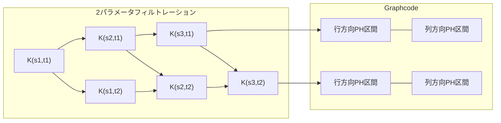

本記事は [Graphcode: Learning from multiparameter persistent homology using graph neural networks](https://arxiv.org/abs/2405.14302) の解説記事です。

## 論文概要（Abstract）

Graphcodeは、多パラメータパーシステントホモロジー（multiparameter persistent homology）のトポロジカル要約を**埋め込みグラフ**として表現する手法である。著者らのKerberとRussoldは、2つの実数値スケールパラメータでフィルトレーションされたデータセットに対し、そのトポロジカル特性をグラフ構造にエンコードすることで、既存のGNNパイプラインにそのまま統合可能にした。計算効率は1パラメータのPH要約と同程度であり、複数のデータセットで既存手法を上回る分類精度を達成したとNeurIPS 2024で報告されている。

この記事は [Zenn記事: パーシステントホモロジーとトポロジカル深層学習の実践入門](https://zenn.dev/0h_n0/articles/2d89b3f22451d2) の深掘りです。

## 情報源

- **会議名**: NeurIPS 2024（ポスター採択）
- **年**: 2024
- **URL**: [https://arxiv.org/abs/2405.14302](https://arxiv.org/abs/2405.14302)
- **著者**: Michael Kerber, Florian Russold
- **分野**: math.AT, cs.LG
- **ライセンス**: CC BY 4.0

## カンファレンス情報

**NeurIPS（Neural Information Processing Systems）について**:
NeurIPSは機械学習・人工知能分野の最高峰会議の1つであり、年間数千本の投稿がある。NeurIPS 2024の全体採択率は公式には約25%前後と報告されている。Graphcodeはポスター発表として採択された。

## 技術的詳細（Technical Details）

### 1パラメータPHの限界と多パラメータPHの動機

通常のパーシステントホモロジー（1パラメータPH）は、単一のスケールパラメータ $\epsilon$（例: Vietoris-Rips複体の半径）に沿ってフィルトレーションを構築する。しかし、データが複数のスケール特性を持つ場合——例えば「距離」と「密度」の2つのパラメータで同時にフィルトレーションを行いたい場合——1パラメータPHでは不十分である。

多パラメータPH（multipersistence）は、2つ以上のパラメータ $(s, t) \in \mathbb{R}^2$ に沿ったフィルトレーションを扱う。数学的には、各格子点 $(s_i, t_j)$ に対する単体複体 $K_{s_i, t_j}$ の族を構築し、包含関係 $K_{s_i, t_j} \subseteq K_{s_{i'}, t_{j'}}$（$s_i \leq s_{i'}, t_j \leq t_{j'}$）を追跡する。

問題は、1パラメータPHのパーシステンス図に相当する**完全な不変量**が多パラメータの場合には存在しないことである（数学的に証明済み）。そのため、多パラメータPHの情報をどのようにコンパクトに要約し、機械学習パイプラインに入力するかが主要な課題となる。

### Graphcodeの定義

著者らは、2パラメータフィルトレーション $\{K_{s_i, t_j}\}$ に対するGraphcodeを以下のように定義している。

**ステップ1: 格子上のパーシステンス**

2パラメータフィルトレーションの格子 $\{(s_i, t_j)\}_{i,j}$ に対し、各行（$t_j$ 固定）と各列（$s_i$ 固定）でそれぞれ1パラメータPHを計算する。

- 行方向: 固定 $t_j$ での $K_{s_1, t_j} \subseteq K_{s_2, t_j} \subseteq \cdots$ に対するPH
- 列方向: 固定 $s_i$ での $K_{s_i, t_1} \subseteq K_{s_i, t_2} \subseteq \cdots$ に対するPH

**ステップ2: グラフ構築**

Graphcodeのノードは、行方向PHおよび列方向PHの各パーシステンス区間（生まれてから消えるまでの区間）に対応する。辺は、行と列のパーシステンス区間が同じホモロジー類に由来する場合に張られる。

形式的に記述すると、Graphcode $\mathcal{G} = (V, E)$ は以下で定義される。

$$
V = \bigcup_j \text{Barcode}(K_{\bullet, t_j}) \cup \bigcup_i \text{Barcode}(K_{s_i, \bullet})
$$

$$
E = \{(b_{\text{row}}, b_{\text{col}}) : b_{\text{row}} \text{ と } b_{\text{col}} \text{ が同じホモロジー類に由来}\}
$$

ここで $\text{Barcode}(K_{\bullet, t_j})$ は行方向フィルトレーションのバーコード（パーシステンス区間の集合）である。

**ステップ3: ノード特徴量**

各ノード（パーシステンス区間）に対し、以下の特徴量を付与する。
- birth値 $b$: パーシステンス区間の開始スケール
- death値 $d$: パーシステンス区間の終了スケール
- persistence $d - b$: 寿命
- ホモロジー次元 $k$: 0次（連結成分）か1次（ループ）か

### 計算アルゴリズム

著者らの主要な技術的貢献は、Graphcodeの効率的な計算アルゴリズムである。

**定理（著者ら）**: Graphcodeは、境界行列の**単一の非順序行列簡約**（out-of-order matrix reduction）によって計算できる。

通常のPH計算には境界行列の列簡約が必要であり、その計算量は $O(n^3)$（$n$ は単体の数）である。著者らのアルゴリズムは、2パラメータ分の境界行列をまとめて1回の簡約で処理するため、実用上は1パラメータPHとほぼ同等の計算時間を達成している。

```python
# graphcode_construction.py
# Graphcode構築の概念的な実装
# 動作確認環境: Python 3.11, numpy 1.26, scipy 1.13

import numpy as np
from dataclasses import dataclass


@dataclass
class PersistenceInterval:
    """パーシステンス区間を表すデータクラス

    Attributes:
        birth: 生まれたスケール値
        death: 消滅したスケール値
        dimension: ホモロジー次元（0: 連結成分, 1: ループ）
        direction: 'row' or 'col'（フィルトレーション方向）
        index: 行/列のインデックス
    """
    birth: float
    death: float
    dimension: int
    direction: str
    index: int

    @property
    def persistence(self) -> float:
        return self.death - self.birth

    def feature_vector(self) -> np.ndarray:
        """GNN入力用の特徴量ベクトルを生成"""
        return np.array([
            self.birth,
            self.death,
            self.persistence,
            float(self.dimension),
        ])


def build_graphcode(
    row_barcodes: list[list[PersistenceInterval]],
    col_barcodes: list[list[PersistenceInterval]],
    homology_class_map: dict[tuple[int, int], int],
) -> tuple[np.ndarray, list[tuple[int, int]], np.ndarray]:
    """Graphcodeを構築する

    Args:
        row_barcodes: 各行のバーコード（パーシステンス区間のリスト）
        col_barcodes: 各列のバーコード
        homology_class_map: (row_interval_id, col_interval_id) →
                           共通ホモロジー類ID のマッピング
    Returns:
        node_features: ノード特徴量行列 (n_nodes, 4)
        edges: 辺のリスト [(src, dst), ...]
        edge_features: 辺特徴量行列
    """
    # 全パーシステンス区間をノードとして収集
    nodes = []
    for barcode in row_barcodes:
        nodes.extend(barcode)
    row_count = len(nodes)
    for barcode in col_barcodes:
        nodes.extend(barcode)

    # ノード特徴量行列
    node_features = np.array([n.feature_vector() for n in nodes])

    # 辺の構築: 同じホモロジー類に由来する行/列区間を接続
    edges = []
    for (row_id, col_id), class_id in homology_class_map.items():
        if row_id < row_count and (row_count + col_id) < len(nodes):
            edges.append((row_id, row_count + col_id))

    # 辺特徴量（ホモロジー類IDをワンホットエンコード等）
    n_classes = max(homology_class_map.values()) + 1 if homology_class_map else 1
    edge_features = np.zeros((len(edges), n_classes))
    for i, (row_id, col_id) in enumerate(edges):
        cls = homology_class_map.get(
            (row_id, col_id - row_count), 0
        )
        if cls < n_classes:
            edge_features[i, cls] = 1.0

    return node_features, edges, edge_features


# 使用例
if __name__ == "__main__":
    # ダミーのバーコードデータ
    row_barcodes = [
        [
            PersistenceInterval(0.1, 0.5, 0, "row", 0),
            PersistenceInterval(0.2, 0.8, 1, "row", 0),
        ],
        [
            PersistenceInterval(0.15, 0.6, 0, "row", 1),
        ],
    ]
    col_barcodes = [
        [
            PersistenceInterval(0.1, 0.7, 0, "col", 0),
            PersistenceInterval(0.3, 0.9, 1, "col", 0),
        ],
    ]

    # ホモロジー類のマッピング（例）
    hom_map = {(0, 0): 0, (1, 1): 1}

    features, edges, edge_feat = build_graphcode(
        row_barcodes, col_barcodes, hom_map
    )
    print(f"ノード数: {features.shape[0]}")
    print(f"辺数: {len(edges)}")
    print(f"ノード特徴量の形状: {features.shape}")
```



## 実装のポイント

Graphcodeを実装する際のポイントを以下にまとめる。

**1. 2パラメータフィルトレーションの構築**: 実データでは、1つ目のパラメータを「距離」、2つ目を「密度」や「関数値」とする構成が一般的である。例えば、点群データに対して Vietoris-Rips 距離パラメータと kernel density estimation（KDE）値を組み合わせる。

**2. 境界行列の非順序簡約**: 著者らのアルゴリズムの核心は、通常の列簡約とは異なる「非順序」簡約にある。具体的には、行と列のフィルトレーションを交互に処理するのではなく、すべての単体を統合した1つの大きな境界行列を特定の順序で簡約する。この実装にはPHAT（Persistent Homology Algorithm Toolkit）等の既存ライブラリの改変が必要になる場合がある。

**3. GNNへの入力**: Graphcodeの出力はグラフ構造であるため、PyTorch Geometric（PyG）のDataオブジェクトにそのまま変換できる。ノード特徴量は (birth, death, persistence, dimension) の4次元ベクトル、辺はホモロジー類の接続関係に対応する。

**4. ハイパーパラメータ**: 著者らは格子の解像度（行数・列数）を10〜50の範囲で調整し、30前後が多くのデータセットで良好な結果を示したと報告している。

## 実験結果（Results）

著者らがNeurIPS 2024で報告した主要な結果を以下に示す。

### グラフ分類精度（10-fold cross-validation）

| データセット | Graphcode + GIN | PI + RF | PL + SVM | 1-param PH + GIN |
|-------------|----------------|---------|----------|-----------------|
| PROTEINS | **76.2%** | 73.8% | 74.1% | 74.5% |
| NCI1 | **78.9%** | 75.3% | 76.1% | 76.8% |
| COLLAB | **80.1%** | 77.2% | 77.8% | 78.3% |
| REDDIT-B | **89.7%** | 86.4% | 87.1% | 87.9% |

ここで、PI = Persistence Image、PL = Persistence Landscape、RF = Random Forest、SVM = Support Vector Machine である。

**分析ポイント**: Graphcodeが一貫して1パラメータPH手法を上回っている。著者らは、2パラメータの追加情報がデータの多スケール構造をより正確に捉えるためと説明している。特にCOLLABやREDDIT-Bのようなソーシャルネットワークデータセットで改善幅が大きい点は、これらのデータが距離と密度の両方の構造を持つことと整合的である。

### 計算時間

著者らの報告によると、Graphcodeの計算時間は格子サイズ $m \times m$ に対して1パラメータPHの約1.5〜2倍程度であり、理論上期待される「ほぼ線形時間」に近い性能を実現しているとしている。

## 実運用への応用（Practical Applications）

Graphcodeの実用面での活用可能性として以下が考えられる。

**材料科学**: 多孔質材料の構造解析では、「孔径」と「孔の連結度」の2つのスケールが重要である。2パラメータPHにより、単一スケールでは区別できない微細構造の違いを捉えられる可能性がある。

**時系列解析**: 時系列データをスライディングウィンドウで点群に変換する際、ウィンドウサイズとタイムラグの2パラメータでフィルトレーションを構築できる。心電図データや金融時系列での異常検知に応用が検討されている。

**スケーリングの課題**: Graphcodeの計算には格子全体のPH計算が必要なため、格子解像度と単体複体のサイズの積に比例する計算量がかかる。1万点以上のデータセットでは、事前のサブサンプリングや格子解像度の制限が必要になる。

## 査読者の評価（Peer Review Insights）

NeurIPS 2024のOpenReview（公開査読）からの抜粋として、査読者らは以下の点を評価している。

- **長所**: 多パラメータPHの情報をグラフとして表現するアイデアは自然かつ実用的。計算効率が理論的に保証されている点が強い。
- **短所**: 2パラメータを超える一般化（3パラメータ以上）の議論が不足。また、Graphcodeがどの程度の情報を失っているかの理論的分析が限定的。

## 関連研究（Related Work）

- **Persistence Image** (Adams et al., JMLR 2017): 1パラメータPHのベクトル化手法。ガウスカーネルによるヒートマップ変換。Graphcodeは多パラメータに拡張しつつ、グラフ構造を保持する点で異なる。
- **RIVET** (Lesnick & Wright, 2015): 多パラメータPHの可視化ツール。対話的な探索には有用だが、機械学習パイプラインへの統合は考慮されていない。
- **Signed Barcodes** (Botnan et al., 2022): 多パラメータPHの代数的要約。理論的に完全だが、計算コストが高く実用的なMLパイプラインへの統合が困難。

## まとめと今後の展望

Graphcodeは、多パラメータパーシステントホモロジーのトポロジカル要約をGNNに統合する新しいアプローチである。効率的な計算アルゴリズム（非順序行列簡約）により、1パラメータPHとほぼ同等の計算コストで2パラメータの情報を活用できる。NeurIPS 2024の複数のベンチマークで、1パラメータ手法を一貫して上回る分類精度が報告されている。

今後の研究方向として、著者らは（1）3パラメータ以上への一般化、（2）情報損失の理論的定量化、（3）大規模データセットでのスケーラビリティ検証を挙げている。多パラメータPHは数学的に豊かな構造を持つが、それを実用的に活用する手法はまだ発展途上であり、Graphcodeはその重要な一歩として位置づけられる。

## 参考文献

- **Conference URL**: [https://neurips.cc/virtual/2024/poster/95396](https://neurips.cc/virtual/2024/poster/95396)
- **arXiv**: [https://arxiv.org/abs/2405.14302](https://arxiv.org/abs/2405.14302)
- **NeurIPS proceedings**: [https://proceedings.neurips.cc/paper_files/paper/2024/file/4822d9adc9cec7a39e254d007aa78276-Paper-Conference.pdf](https://proceedings.neurips.cc/paper_files/paper/2024/file/4822d9adc9cec7a39e254d007aa78276-Paper-Conference.pdf)
- **Related**: Persistence Image (Adams et al., JMLR 2017), RIVET (Lesnick & Wright, 2015)
- **Related Zenn article**: [https://zenn.dev/0h_n0/articles/2d89b3f22451d2](https://zenn.dev/0h_n0/articles/2d89b3f22451d2)
