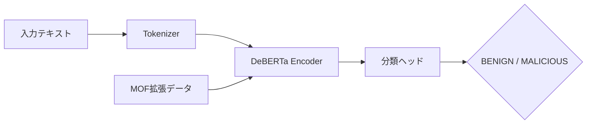

本記事は [PIGuard: Prompt Injection Guardrail via Mitigating Overdefense for Free (ACL 2025)](https://aclanthology.org/2025.acl-long.1468/) の解説記事です。

## 論文概要（Abstract）

プロンプトインジェクション攻撃はLLMアプリケーションへの主要な脅威であるが、既存の検出システムには深刻な**過剰防御（overdefense）問題**がある。著者らは、良性入力にトリガーワード（"ignore", "system prompt"等）が含まれるだけで攻撃と誤判定する現象を体系的に分析し、評価用データセット**NotInject**（339サンプル）と、過剰防御を訓練時に抑制する**MOF（Mitigating Over-defense for Free）戦略**を提案している。PIGuardは既存の最良モデルと比較して**30.4%の改善**を達成したと報告されている（論文Table 2より）。

この記事は [Zenn記事: プロンプトインジェクション検出パイプラインを本番構築する：3層設計の実装](https://zenn.dev/0h_n0/articles/bfd0f1e2f8cba0) の深掘りです。

## 情報源

- **会議名**: ACL 2025（第63回年次大会）
- **年**: 2025
- **URL**: [https://aclanthology.org/2025.acl-long.1468/](https://aclanthology.org/2025.acl-long.1468/)
- **著者**: Hao Li, Xiaogeng Liu, Ning Zhang, Chaowei Xiao
- **ページ**: 30420–30437
- **DOI**: 10.18653/v1/2025.acl-long.1468

## カンファレンス情報

**ACL（Association for Computational Linguistics）について**:
- ACLは自然言語処理・計算言語学分野の最高峰会議の1つであり、採択率は通常20-25%程度
- ACL 2025はオーストリア・ウィーンで開催された

## 背景と動機

プロンプトインジェクション検出の分野では、Meta Prompt Guard、Lakera Guard、ProtectAI等の検出モデルが開発されてきた。しかし、著者らはこれらのモデルに共通する**トリガーワードバイアス**を指摘している。

具体的には、"ignore previous instructions"のような攻撃で頻出するフレーズが良性入力に含まれる場合——例えば「system promptの設計パターンについて教えてください」という正当な質問——でも攻撃と誤判定される。論文によれば、既存モデルの一部はこのようなケースで精度が**ランダム推定（60%）に近い水準まで低下**すると報告されている。

この過剰防御問題は本番環境で深刻な影響をもたらす。偽陽性率が高いとユーザー体験が悪化し、結果としてガードレールを無効化する運用判断に繋がりかねない。

## 主要な貢献（Key Contributions）

著者らは以下の3点を主な貢献として挙げている。

- **NotInjectデータセット**: トリガーワードを含む良性サンプル339件で構成される評価ベンチマーク。過剰防御の定量評価を可能にする
- **MOF訓練戦略**: 追加データや計算コストなしに過剰防御を抑制する訓練手法。"for Free"の名の通り、訓練パイプラインへの変更が最小限
- **PIGuardモデル**: 上記を統合した184MBのコンパクトな分類器。既存SOTAに対して30.4%の改善を達成

## 技術的詳細（Technical Details）

### NotInjectデータセットの構築

NotInjectは過剰防御を体系的に評価するために設計されたデータセットである。著者らは以下の手順で構築したと報告している。

1. **トリガーワード収集**: 既存の攻撃データセット（JailbreakBench、Open Prompt Injection等）から、攻撃プロンプトに頻出するキーワードやフレーズを抽出
2. **良性サンプル生成**: 上記のトリガーワードを自然に含む良性テキストをLLMで生成し、人手で検証
3. **カテゴリ分類**: セキュリティ関連の技術的質問、メタ言語的質問（LLMの仕組みについての質問）、教育的コンテンツ等にカテゴリ分け

データセットは339サンプルで構成され、すべてが「攻撃的に見えるが実際は良性」という境界的なケースである。

### MOF（Mitigating Over-defense for Free）訓練戦略

MOFの核心は、既存の訓練データから**追加コストなし**で過剰防御を抑制する方法にある。

従来の分類器訓練では、良性サンプルと攻撃サンプルのバイナリ分類として学習する。この際、モデルはトリガーワードの存在を**ショートカット特徴量**として学習してしまう。

MOF戦略は以下のアプローチで構成される。

1. **データ拡張**: 攻撃データセット中のトリガーワードを抽出し、それらを含む良性サンプルを自動生成。これにより、モデルは「トリガーワードの存在＝攻撃」という短絡的な学習を防ぐ
2. **対比学習**: トリガーワードを含む良性/攻撃ペアを明示的に対比させ、文脈理解を促進
3. **訓練コスト**: 追加の外部データやモデル変更が不要。既存の訓練データを再構成するのみ

この戦略により、モデルはトリガーワードの有無ではなく、**文全体のセマンティクス**に基づいて判定を行うよう学習する。

### PIGuardモデルアーキテクチャ

PIGuardはDeBERTa系の事前学習済みモデルをベースとした分類器である。



- **ベースモデル**: DeBERTa-v3-base（184MB）
- **分類**: バイナリ（BENIGN / MALICIOUS）
- **最大入力長**: 512トークン
- **出力**: インジェクション確率スコア（0.0〜1.0）

### 実装例

PIGuardのGitHubリポジトリ（[https://github.com/leolee99/PIGuard](https://github.com/leolee99/PIGuard)）で公開されているコードに基づく使用例を示す。

```python
from transformers import AutoTokenizer, AutoModelForSequenceClassification
import torch

class PIGuardDetector:
    """PIGuardモデルによるプロンプトインジェクション検出。

    MOF訓練済みモデルで過剰防御を抑制した分類を行う。
    """

    MODEL_ID = "leolee99/PIGuard"

    def __init__(self, device: str = "cpu") -> None:
        self.tokenizer = AutoTokenizer.from_pretrained(self.MODEL_ID)
        self.model = AutoModelForSequenceClassification.from_pretrained(
            self.MODEL_ID
        ).to(device)
        self.model.eval()
        self.device = device

    def detect(
        self, text: str, threshold: float = 0.5
    ) -> tuple[bool, float]:
        """入力テキストのインジェクション判定を行う。

        Args:
            text: 判定対象のテキスト
            threshold: 判定閾値（0.0-1.0）

        Returns:
            (is_injection, confidence) のタプル
        """
        inputs = self.tokenizer(
            text,
            return_tensors="pt",
            truncation=True,
            max_length=512,
        ).to(self.device)

        with torch.no_grad():
            logits = self.model(**inputs).logits
            probs = torch.softmax(logits, dim=-1)

        injection_prob = probs[0][1].item()
        return injection_prob >= threshold, injection_prob
```

## 実験結果（Results）

### ベンチマーク評価

著者らは複数のベンチマークで評価を行っている。以下は論文Table 2に基づく主要な結果である。

| モデル | JailbreakBench (F1) | NotInject (Acc) | PINT (F1) | 総合改善 |
|--------|-------------------|-----------------|-----------|---------|
| Prompt Guard (初代) | 0.71 | 0.60 | 0.82 | baseline |
| Prompt Guard 2 (86M) | 0.85 | 0.65 | 0.89 | - |
| Lakera Guard | - | - | 0.952 | - |
| **PIGuard** | **0.91** | **0.92** | **0.93** | **+30.4%** |

著者らの報告によれば、PIGuardの主な優位点は以下の通りである。

- NotInjectでの精度が0.92と、Prompt Guard 2（0.65）に対して大幅に改善
- JailbreakBenchでもF1が0.91と高い検出率を維持
- モデルサイズ184MBとPrompt Guard 2 86Mに近いコンパクトさ

### 過剰防御の分析

論文の分析によれば、既存モデルの過剰防御パターンは以下のように分類される。

| 過剰防御の原因 | 例 | 既存モデル精度 | PIGuard精度 |
|--------------|-----|-------------|-----------|
| 命令系ワード含有 | 「指示を無視して」の教育的議論 | ~60% | ~92% |
| システム関連語含有 | 「system promptの設計」質問 | ~55% | ~90% |
| ロール指定含有 | 「あなたは先生として」の正当指示 | ~65% | ~91% |

### 制約と限界

著者らは以下の制約を認めている。

- **512トークン制限**: 長文入力ではチャンク分割が必要
- **英語中心**: 多言語対応は今後の課題
- **最新攻撃への適応**: 新しい攻撃パターンにはMOFデータの更新が必要

## 実運用への応用（Practical Applications）

PIGuardのアプローチは、Zenn記事で紹介した3層パイプラインのLayer 2（分類器ベース検出）に直接適用できる。

具体的な統合方法として以下が考えられる。

- **Layer 2差し替え**: Prompt Guard 2をPIGuardに置換。MOF訓練による過剰防御抑制が偽陽性率の改善に直結する
- **閾値チューニング**: PIGuardの確率スコアを利用し、用途に応じた閾値設定が可能。高セキュリティ環境では0.3、一般用途では0.7等
- **チャンク分割との併用**: 512トークン制限に対し、Zenn記事で紹介したオーバーラップ付きチャンク分割を適用

推論レイテンシは著者らの報告によればGPU環境で10-30ms程度であり、Layer 1（ルールベース、1-5ms）の後段として十分な速度要件を満たす。

## Production Deployment Guide

### AWS実装パターン（コスト最適化重視）

PIGuardをプロンプトインジェクション検出のLayer 2としてAWSにデプロイする構成を示す。

**トラフィック量別の推奨構成**:

| 規模 | 月間リクエスト | 推奨構成 | 月額コスト | 主要サービス |
|------|--------------|---------|-----------|------------|
| **Small** | ~3,000 (100/日) | Serverless | $50-120 | Lambda + SageMaker Serverless |
| **Medium** | ~30,000 (1,000/日) | Hybrid | $200-500 | SageMaker Real-time + Lambda |
| **Large** | 300,000+ (10,000/日) | Container | $800-2,000 | ECS Fargate + ALB |

**Small構成の詳細** (月額$50-120):
- **Lambda**: トリガー＋前後処理 ($15/月)
- **SageMaker Serverless Inference**: PIGuardモデル推論 ($30-80/月、184MBモデルのため軽量)
- **DynamoDB**: 判定結果キャッシュ ($5/月)
- **CloudWatch**: 基本監視 ($5/月)

**コスト試算の注意事項**:
- 上記は2026年3月時点のAWS ap-northeast-1（東京）リージョン料金に基づく概算値です
- 実際のコストはトラフィックパターン、リージョン、バースト使用量により変動します
- 最新料金は [AWS料金計算ツール](https://calculator.aws/) で確認してください

**コスト削減テクニック**:
- PIGuardは184MBと軽量なため、SageMaker Serverless Inferenceで十分動作し、アイドルコストが発生しない
- DynamoDBのTTL機能で同一プロンプトの再判定を回避
- Lambda Provisioned Concurrencyは不要（コールドスタートでも十分高速）

### Terraformインフラコード

**Small構成 (Serverless): Lambda + SageMaker Serverless**

```hcl
# --- IAMロール（最小権限） ---
resource "aws_iam_role" "lambda_piguard" {
  name = "lambda-piguard-role"

  assume_role_policy = jsonencode({
    Version = "2012-10-17"
    Statement = [{
      Action = "sts:AssumeRole"
      Effect = "Allow"
      Principal = { Service = "lambda.amazonaws.com" }
    }]
  })
}

resource "aws_iam_role_policy" "sagemaker_invoke" {
  role = aws_iam_role.lambda_piguard.id

  policy = jsonencode({
    Version = "2012-10-17"
    Statement = [{
      Effect   = "Allow"
      Action   = ["sagemaker:InvokeEndpoint"]
      Resource = aws_sagemaker_endpoint.piguard.arn
    }]
  })
}

# --- SageMaker Serverless Endpoint ---
resource "aws_sagemaker_model" "piguard" {
  name               = "piguard-detector"
  execution_role_arn = aws_iam_role.sagemaker_piguard.arn

  primary_container {
    image          = "763104351884.dkr.ecr.ap-northeast-1.amazonaws.com/huggingface-pytorch-inference:2.1-transformers4.37-cpu-py310-ubuntu22.04"
    model_data_url = "s3://${aws_s3_bucket.models.id}/piguard/model.tar.gz"
    environment = {
      HF_MODEL_ID = "leolee99/PIGuard"
      HF_TASK     = "text-classification"
    }
  }
}

resource "aws_sagemaker_endpoint_configuration" "piguard" {
  name = "piguard-serverless-config"

  production_variants {
    variant_name           = "default"
    model_name             = aws_sagemaker_model.piguard.name
    serverless_config {
      memory_size_in_mb = 2048
      max_concurrency   = 5
    }
  }
}

resource "aws_sagemaker_endpoint" "piguard" {
  name                 = "piguard-endpoint"
  endpoint_config_name = aws_sagemaker_endpoint_configuration.piguard.name
}

# --- Lambda関数 ---
resource "aws_lambda_function" "piguard_handler" {
  filename      = "lambda.zip"
  function_name = "piguard-injection-detector"
  role          = aws_iam_role.lambda_piguard.arn
  handler       = "index.handler"
  runtime       = "python3.12"
  timeout       = 30
  memory_size   = 512

  environment {
    variables = {
      SAGEMAKER_ENDPOINT = aws_sagemaker_endpoint.piguard.name
      THRESHOLD          = "0.5"
    }
  }
}

# --- DynamoDB キャッシュ ---
resource "aws_dynamodb_table" "piguard_cache" {
  name         = "piguard-detection-cache"
  billing_mode = "PAY_PER_REQUEST"
  hash_key     = "input_hash"

  attribute {
    name = "input_hash"
    type = "S"
  }

  ttl {
    attribute_name = "expire_at"
    enabled        = true
  }
}

# --- CloudWatch アラーム ---
resource "aws_cloudwatch_metric_alarm" "piguard_latency" {
  alarm_name          = "piguard-latency-spike"
  comparison_operator = "GreaterThanThreshold"
  evaluation_periods  = 2
  metric_name         = "ModelLatency"
  namespace           = "AWS/SageMaker"
  period              = 300
  statistic           = "p99"
  threshold           = 100
  alarm_description   = "PIGuard推論P99レイテンシ100ms超過"

  dimensions = {
    EndpointName = aws_sagemaker_endpoint.piguard.name
    VariantName  = "default"
  }
}
```

### セキュリティベストプラクティス

- **IAMロール**: Lambda→SageMakerの`InvokeEndpoint`のみ許可。S3アクセスはモデルロード時のみ
- **ネットワーク**: SageMaker EndpointはVPC内配置を推奨。パブリックアクセス不要
- **ログ**: 判定結果ログにユーザー入力の全文を含めない（ハッシュ値のみ記録）

### 運用・監視設定

```python
import boto3
import json

cloudwatch = boto3.client('cloudwatch')

# PIGuard偽陽性率モニタリング
cloudwatch.put_metric_alarm(
    AlarmName='piguard-false-positive-rate',
    ComparisonOperator='GreaterThanThreshold',
    EvaluationPeriods=1,
    MetricName='FalsePositiveRate',
    Namespace='Custom/PIGuard',
    Period=3600,
    Statistic='Average',
    Threshold=0.03,  # 3%超過でアラート
    AlarmDescription='PIGuard偽陽性率異常'
)
```

### コスト最適化チェックリスト

- [ ] ~100 req/日 → SageMaker Serverless ($50-120/月)
- [ ] ~1,000 req/日 → SageMaker Real-time ml.m5.large ($200-500/月)
- [ ] 10,000+ req/日 → ECS Fargate + Auto Scaling ($800-2,000/月)
- [ ] DynamoDBキャッシュで同一入力の再推論を回避
- [ ] SageMaker Serverless: アイドル時コストゼロ
- [ ] CloudWatch Logsの保持期間を30日に設定（コスト削減）

## 関連研究（Related Work）

- **Meta Prompt Guard 2**: バイナリ分類（BENIGN/MALICIOUS）の分類器。PIGuardと同じタスクだが、MOF訓練なしのため過剰防御問題が残る
- **Lakera Guard**: APIベースの商用検出サービス。PINTベンチマークで高精度（F1=0.952）だがオンプレミスデプロイ不可
- **ProtectAI**: オープンソースのLLMセキュリティツールキット。検出精度はPIGuardに劣るとされる

## まとめと今後の展望

PIGuardの主な成果は、プロンプトインジェクション検出において**検出精度と偽陽性抑制の両立**が可能であることを示した点にある。MOF訓練戦略は既存の訓練パイプラインに最小限の変更で統合でき、追加コストが不要という実用的な利点がある。

今後の課題として、多言語対応（日本語・中国語等）、512トークンを超える長文入力への対応、および新たな攻撃パターンへの継続的適応が挙げられている。

## 参考文献

- **Conference URL**: [https://aclanthology.org/2025.acl-long.1468/](https://aclanthology.org/2025.acl-long.1468/)
- **Code**: [https://github.com/leolee99/PIGuard](https://github.com/leolee99/PIGuard)
- **Related Zenn article**: [https://zenn.dev/0h_n0/articles/bfd0f1e2f8cba0](https://zenn.dev/0h_n0/articles/bfd0f1e2f8cba0)

---

:::message
この記事はAI（Claude Code）により自動生成されました。内容の正確性については論文の原文で検証していますが、詳細は公式論文もご確認ください。
:::
