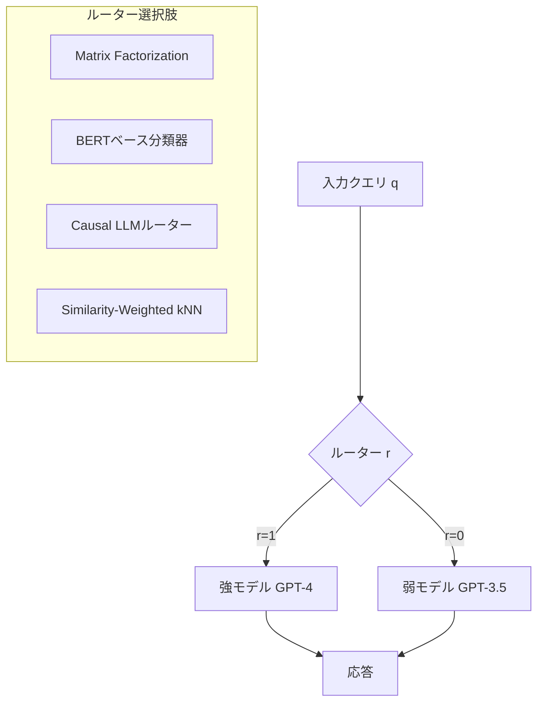

本記事は [RouteLLM: Learning to Route LLMs with Preference Data (arXiv:2406.18665)](https://arxiv.org/abs/2406.18665) の解説記事です。

## 論文概要（Abstract）

RouteLLMは、人間の嗜好データを活用して「強力だが高価なLLM（GPT-4等）」と「安価だが性能が劣るLLM（GPT-3.5等）」の間でクエリを動的にルーティングする学習フレームワークである。著者ら（Ong et al.）は、Chatbot Arenaの大規模ペア比較データからルーティング判定を学習する4種類のアーキテクチャを提案し、MMLUベンチマークにおいてGPT-4呼び出しを最大85%削減しながら品質の99%を維持できることを報告している。

この記事は [Zenn記事: Portkey AIゲートウェイ本番ベンチマーク：日本リージョンでの性能実測と運用設計](https://zenn.dev/0h_n0/articles/0e6ba8818ec5b5) の深掘りです。

## 情報源

- **会議名**: ICLR 2025（International Conference on Learning Representations）
- **年**: 2025
- **URL**: [https://arxiv.org/abs/2406.18665](https://arxiv.org/abs/2406.18665)
- **著者**: Isaac Ong, Amjad Almahairi, Vincent Wu, Wei-Lin Chiang, Tianhao Wu, Joseph E. Gonzalez, M Waleed Kadous, Ion Stoica
- **コード**: [https://github.com/lm-sys/RouteLLM](https://github.com/lm-sys/RouteLLM)（Apache 2.0）

## カンファレンス情報

ICLRは機械学習・深層学習分野の最高峰会議の一つであり、表現学習（Representation Learning）を中心とした幅広い研究を扱う。RouteLLMはICLR 2025にフルペーパーとして採択されている。

## 背景と動機（Background & Motivation）

LLM APIの利用コストは本番運用における最大の課題の一つである。GPT-4のようなフロンティアモデルは高い精度を提供するが、入力1Mトークンあたり$30と高額である。一方、GPT-3.5-turboは1Mトークンあたり$2と安価だが、複雑なタスクでは品質が不足する。

実際の運用では、すべてのクエリが高性能モデルを必要とするわけではない。「今日の天気は？」のような単純なクエリと、「量子コンピュータの誤り訂正について数学的に説明して」のような複雑なクエリでは、必要なモデル性能が大きく異なる。PortkeyのようなAIゲートウェイが提供するモデルルーティング機能の学術的基盤として、RouteLLMはこの「クエリ難易度に応じた動的ルーティング」の問題を定式化している。

## 主要な貢献（Key Contributions）

- **貢献1**: Chatbot Arenaの人間嗜好データをルーティング学習に転用する手法の提案。約33,000件のペア比較データから「このクエリは強モデルが必要か」を判定するルーターを学習
- **貢献2**: 4種類のルーターアーキテクチャ（Matrix Factorization、BERT、Causal LLM、Similarity-Weighted）の設計と包括的比較
- **貢献3**: データ拡張と転移学習の組み合わせにより、GPT-4/GPT-3.5ペアで学習したルーターをClaude-3-Opus/Haiku等の別ペアにも適用可能なことを実証
- **貢献4**: OpenAI互換APIとしてのオープンソース実装（`pip install routellm`でdrop-in replacement可能）

## 技術的詳細（Technical Details）

### 問題の定式化

LLMルーティングの目的は、品質制約のもとでコストを最小化することである。著者らは以下のように定式化している。

クエリ $q$ に対して、ルーター関数 $r(q) \in \{0, 1\}$ を学習する：

$$
r(q) = \begin{cases} 1 & \text{（強モデル $M_s$ に送る）} \\ 0 & \text{（弱モデル $M_w$ に送る）} \end{cases}
$$

最適化目標は以下のとおりである：

$$
\min_{r} \mathbb{E}_q\left[\text{cost}(r(q))\right] \quad \text{s.t.} \quad \mathbb{E}_q\left[\text{quality}(r(q))\right] \geq \tau
$$

ここで、
- $\text{cost}(r(q))$: ルーティング先モデルのAPI呼び出しコスト
- $\text{quality}(r(q))$: ルーティング先モデルの応答品質
- $\tau$: 品質閾値（例：GPT-4品質の95%）

### ルーターアーキテクチャ（4種類）



**1. Matrix Factorization（MF）ルーター**

Chatbot Arenaのペア比較データを、ユーザー-アイテム型の行列分解で学習する。クエリ $q$ をベクトル $\mathbf{e}_q \in \mathbb{R}^d$ に、モデル $m$ をベクトル $\mathbf{e}_m \in \mathbb{R}^d$ にそれぞれ埋め込み、スコアを内積で計算する：

$$
s(q, m) = \mathbf{e}_q^\top \mathbf{e}_m + b_q + b_m
$$

ここで $b_q$, $b_m$ はバイアス項である。Bradley-Terryモデルに基づく損失関数で学習を行う。推論時のオーバーヘッドは数ミリ秒以下と報告されている。

**2. BERTベースルーター**

BERTまたはDeBERTaでクエリをエンコードし、2クラス分類ヘッドで「強モデルが必要か否か」を判定する。嗜好データでfine-tuningを行い、sigmoid出力が閾値を超えた場合に強モデルへルーティングする。

**3. Causal LLMルーター**

小型の自己回帰LLM（例：LLaMA-7B）を難易度分類器として使用する。最終トークンの隠れ状態に分類ヘッドを追加し、LoRA fine-tuningで学習する。表現力は最も高いが、推論レイテンシも最大である。

**4. Similarity-Weighted（SW）ルーター**

kNNベースの非パラメトリック手法である。学習セットのクエリをembedding化してインデックスを構築し、入力クエリに類似した過去クエリの難易度ラベルで重み付き投票を行う。学習不要でインデックス構築のみで動作する。

### 学習データとデータ拡張

著者らは以下のデータソースを活用している：

1. **Chatbot Arena**: 約33,000件の人間によるペア比較データ
2. **GPT-4 Judge**: 曖昧なケースの再ラベリングに使用（データ拡張）
3. **CAMEL Dataset**: 追加学習データ

ペア比較データから難易度ラベルを生成する過程は以下のとおりである：
- 強モデルが明確に勝利 → 「難しい」ラベル（強モデルが必要）
- 弱モデルで十分 → 「簡単」ラベル（弱モデルで対応可能）

### 転移学習

著者らは、GPT-4/GPT-3.5ペアで学習したルーターがClaude-3-Opus/Haikuペアにも追加学習なしで転移できることを実証している。これはルーターが「クエリの難易度」という汎用的な特徴を学習していることを示唆している。

## 実験結果（Results）

### MMLUベンチマーク（5-shot）

論文Table 1およびFigure 2より、以下の結果が報告されている：

| ルーター | GPT-4呼び出し削減率 | 品質維持率（GPT-4比） |
|---------|-------------------|---------------------|
| Matrix Factorization | **85%** | 99% |
| BERTベース | 約80% | 99% |
| Causal LLM | 約82% | 99% |
| Similarity-Weighted | 約75% | 99% |
| ランダム（ベースライン） | 50% | 約97% |

### MT-Benchでの結果

MT-Bench（対話品質評価）では、MMLUと比較して削減率は低下するが、依然として有意なコスト削減を達成している（論文Figure 3より）：

| ルーター | GPT-4呼び出し削減率 | スコア維持率 |
|---------|-------------------|------------|
| Matrix Factorization | 約40% | 96% |
| BERTベース | 約45% | 96% |
| Causal LLM | 約50% | 96% |

### コスト試算

GPT-4（入力$30/MTok）とGPT-3.5（入力$0.5/MTok）の価格差を前提とすると、MFルーターによるMMLUでの85%削減は、API費用を約50%削減することに相当する（論文Section 5の試算より）。

### 転移学習の結果

GPT-4/GPT-3.5で学習したルーターをClaude-3-Opus/Haikuペアに適用した場合、追加学習なしで同等の削減率を達成できたと報告されている。

## 実装のポイント（Implementation）

RouteLLMはOpenAI互換のdrop-in replacementとして設計されている：

```python
from routellm.controller import Controller

# RouteLLMクライアントの初期化
client = Controller(
    routers=["mf"],  # Matrix Factorizationルーターを使用
    strong_model="gpt-4-1106-preview",
    weak_model="gpt-3.5-turbo-0125",
)

# OpenAI互換API（既存コードの最小変更で利用可能）
response = client.chat.completions.create(
    model="router-mf-0.11593",  # ルーター名-閾値
    messages=[
        {"role": "user", "content": "量子エンタングルメントを数学的に説明して"}
    ],
)
```

**閾値の設定が重要**: `0.11593`は閾値パラメータで、この値が大きいほど強モデルへのルーティング率が上がる（品質重視）。小さいほどコスト削減が大きい（コスト重視）。キャリブレーションコマンド（`routellm calibrate`）で最適閾値を自動計算できる。

**推奨構成**:
- 本番用途: MFルーター（推論オーバーヘッド数ms以下、精度・コストのバランス最良）
- 解釈可能性重視: SWルーター（kNNベースで判断根拠が明示可能）
- 最高精度: BERTルーター（MFとの差は小さいが、意味的理解が高い）

## Production Deployment Guide

### AWS実装パターン（コスト最適化重視）

**トラフィック量別の推奨構成**:

| 規模 | 月間リクエスト | 推奨構成 | 月額コスト | 主要サービス |
|------|--------------|---------|-----------|------------|
| **Small** | ~3,000 (100/日) | Serverless | $50-150 | Lambda + Bedrock + DynamoDB |
| **Medium** | ~30,000 (1,000/日) | Hybrid | $300-800 | Lambda + ECS Fargate + ElastiCache |
| **Large** | 300,000+ (10,000/日) | Container | $2,000-5,000 | EKS + Karpenter + EC2 Spot |

**Small構成の詳細** (月額$50-150):
- **Lambda**: 1GB RAM, 60秒タイムアウト ($20/月) — MFルーター推論を含む
- **Bedrock**: Claude 3.5 Haiku（弱モデル）+ Claude Sonnet 4（強モデル）($80/月)
- **DynamoDB**: On-Demand、ルーティング結果のログ保存 ($10/月)
- **S3**: MFルーター重みファイル保存 ($1/月)

**Large構成の詳細** (月額$2,000-5,000):
- **EKS**: コントロールプレーン ($72/月)
- **EC2 Spot Instances**: c5.xlarge × 2-4台、RouteLLMルーター用 (平均$100/月)
- **Bedrock**: Claude Sonnet 4（強モデル）、Batch API活用で50%割引 ($2,000/月)
- **ElastiCache Redis**: ルーティング結果キャッシュ ($15/月)

**コスト試算の注意事項**: 上記は2026年3月時点のAWS ap-northeast-1（東京）リージョン料金に基づく概算値です。実際のコストはトラフィックパターンにより変動します。最新料金は[AWS料金計算ツール](https://calculator.aws/)で確認してください。

### Terraformインフラコード

**Small構成 (Serverless): Lambda + Bedrock**

```hcl
# --- IAMロール（最小権限）---
resource "aws_iam_role" "routellm_lambda" {
  name = "routellm-lambda-role"

  assume_role_policy = jsonencode({
    Version = "2012-10-17"
    Statement = [{
      Action = "sts:AssumeRole"
      Effect = "Allow"
      Principal = { Service = "lambda.amazonaws.com" }
    }]
  })
}

resource "aws_iam_role_policy" "bedrock_invoke" {
  role = aws_iam_role.routellm_lambda.id
  policy = jsonencode({
    Version = "2012-10-17"
    Statement = [{
      Effect   = "Allow"
      Action   = ["bedrock:InvokeModel", "bedrock:InvokeModelWithResponseStream"]
      Resource = "arn:aws:bedrock:ap-northeast-1::foundation-model/anthropic.*"
    }]
  })
}

# --- Lambda関数（RouteLLMルーター内蔵）---
resource "aws_lambda_function" "routellm_handler" {
  filename      = "routellm_lambda.zip"
  function_name = "routellm-router"
  role          = aws_iam_role.routellm_lambda.arn
  handler       = "handler.main"
  runtime       = "python3.12"
  timeout       = 60
  memory_size   = 1024

  environment {
    variables = {
      ROUTER_TYPE       = "mf"
      ROUTER_THRESHOLD  = "0.11593"
      STRONG_MODEL_ID   = "anthropic.claude-sonnet-4-20250514-v1:0"
      WEAK_MODEL_ID     = "anthropic.claude-3-5-haiku-20241022-v1:0"
      DYNAMODB_TABLE    = aws_dynamodb_table.routing_log.name
    }
  }
}

# --- DynamoDB（ルーティングログ）---
resource "aws_dynamodb_table" "routing_log" {
  name         = "routellm-routing-log"
  billing_mode = "PAY_PER_REQUEST"
  hash_key     = "request_id"

  attribute {
    name = "request_id"
    type = "S"
  }

  ttl {
    attribute_name = "expire_at"
    enabled        = true
  }
}
```

### セキュリティベストプラクティス

- **IAMロール**: Bedrockの特定モデルARNのみにInvoke権限を付与（最小権限）
- **シークレット管理**: RouteLLMの閾値・モデルIDは環境変数で管理、APIキーはSecrets Managerを使用
- **ネットワーク**: Lambda VPC内配置、Bedrockへのアクセスはプライベートエンドポイント経由
- **暗号化**: DynamoDB/S3はKMS暗号化有効化

### 運用・監視設定

```python
import boto3

cloudwatch = boto3.client('cloudwatch')

# ルーティング比率の監視アラーム
cloudwatch.put_metric_alarm(
    AlarmName='routellm-strong-model-ratio-spike',
    ComparisonOperator='GreaterThanThreshold',
    EvaluationPeriods=1,
    MetricName='StrongModelRouteRatio',
    Namespace='Custom/RouteLLM',
    Period=3600,
    Statistic='Average',
    Threshold=0.5,  # 強モデル呼び出し率50%超過でアラート
    AlarmDescription='RouteLLM強モデルルーティング率異常（コスト急増）'
)
```

### コスト最適化チェックリスト

- [ ] RouteLLM閾値の最適化（キャリブレーション実施）
- [ ] 弱モデルにHaikuクラスを使用（コスト1/15）
- [ ] Bedrock Batch API活用（非リアルタイム処理で50%割引）
- [ ] Prompt Caching有効化（システムプロンプト固定部分）
- [ ] DynamoDBルーティングログのTTL設定（30日で自動削除）
- [ ] Lambda メモリサイズ最適化（CloudWatch Insights分析）
- [ ] AWS Budgets: 月額予算設定（80%で警告）
- [ ] Cost Anomaly Detection有効化

## Portkey AIゲートウェイとの関連

Zenn記事で解説されているPortkeyのモデルルーティング機能は、RouteLLMが学術的に定式化した「クエリ難易度に応じた動的ルーティング」と同じ問題を解いている。Portkeyでは`strategy.mode: "loadbalance"`や`strategy.mode: "fallback"`として実装されているが、RouteLLMのように嗜好データから自動的にルーティング判定を学習するアプローチは、手動での重み付き設定を超える可能性がある。

特にPortkeyのOSSセルフホスト構成にRouteLLMを組み合わせることで、ゲートウェイレベルのルーティングに加えてクエリレベルの動的最適化が実現できる。著者らの報告によれば、MFルーターの推論オーバーヘッドは数ミリ秒以下であるため、Portkeyのゲートウェイ処理（OSS版で1ms未満）と組み合わせても全体のレイテンシ増加は無視できる水準に収まる。

## 関連研究（Related Work）

- **FrugalGPT** (Chen et al., 2023): LLMカスケードによるコスト削減の先駆的研究。3モデル以上のカスケードに対応するが、正解ラベルが必要でタスク特化型
- **Hybrid LLM** (Ding et al., 2024): Conformal predictionによる品質保証付きルーティング。品質カバレッジを理論的に保証できる点でRouteLLMと補完的
- **AutoMix** (Madaan et al., 2024): 自己検証メカニズムにより段階的にモデルをエスカレーション。推論タスクでRouteLLMより高い品質を達成する場合がある

## まとめと今後の展望

RouteLLMは、LLMルーティングを嗜好データから学習するという新しいパラダイムを提示した。MFルーターによるMMLU 85%削減（品質99%維持）という結果は、本番環境でのLLMコスト最適化に直接適用可能な水準である。

今後の課題として、著者らは以下を挙げている：（1）3モデル以上のルーティングへの拡張、（2）ドメイン固有タスクでの嗜好データ不足への対処、（3）ルーティング判定の説明可能性の向上。PortkeyのようなAIゲートウェイとの統合が進めば、インフラレベルのルーティング（フォールバック・ロードバランシング）とクエリレベルのルーティング（品質/コスト最適化）を組み合わせた多層的なコスト最適化が実現されるだろう。

## 参考文献

- **Conference URL**: [https://arxiv.org/abs/2406.18665](https://arxiv.org/abs/2406.18665)
- **Code**: [https://github.com/lm-sys/RouteLLM](https://github.com/lm-sys/RouteLLM)
- **学習済み重み**: [HuggingFace Hub - routellm/router-mf-v1](https://huggingface.co/routellm)
- **Related Zenn article**: [https://zenn.dev/0h_n0/articles/0e6ba8818ec5b5](https://zenn.dev/0h_n0/articles/0e6ba8818ec5b5)
