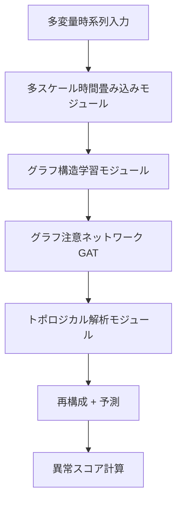

本記事は [Multivariate Time-Series Anomaly Detection based on Enhancing Graph Attention Networks with Topological Analysis](https://arxiv.org/abs/2408.13082) の解説記事です。

## 論文概要（Abstract）

TopoGDN（Topological Graph Detection Network）は、多変量時系列の教師なし異常検知を目的としたモデルである。著者らのLiu et al.は、時間次元と特徴次元の両方をきめ細かく解析するために、（1）多スケール時間畳み込みモジュール、（2）グラフ構造学習とグラフ注意ネットワーク（GAT）による特徴間依存性のモデリング、（3）トポロジカル解析モジュール（プラグアンドプレイ）を統合した手法を提案している。CIKM 2024に採択され、4つのベンチマークデータセットで既存手法を上回る異常検知性能を達成したと報告されている。

この記事は [Zenn記事: パーシステントホモロジーとトポロジカル深層学習の実践入門](https://zenn.dev/0h_n0/articles/2d89b3f22451d2) の深掘りです。

## 情報源

- **会議名**: CIKM 2024（ACM International Conference on Information and Knowledge Management）
- **年**: 2024
- **URL**: [https://arxiv.org/abs/2408.13082](https://arxiv.org/abs/2408.13082)
- **著者**: Zhe Liu, Xiang Huang, Jingyun Zhang, Zhifeng Hao, Li Sun, Hao Peng
- **コードリポジトリ**: [https://github.com/ljj-cyber/TopoGDN](https://github.com/ljj-cyber/TopoGDN)

## カンファレンス情報

**CIKM（Conference on Information and Knowledge Management）について**:
CIKMはACM主催の情報管理・知識マネジメント分野の主要会議であり、データマイニング、情報検索、知識管理の3分野を横断する。年間投稿数は1,000件以上、採択率は約20〜25%で推移している。時系列解析やグラフベースの手法に関する研究が多く発表される会議である。

## 技術的詳細（Technical Details）

### 問題設定

多変量時系列異常検知は、$N$ 個のセンサーからの同時計測データ $\mathbf{X} \in \mathbb{R}^{T \times N}$（$T$: 時間ステップ数、$N$: 変量数）に対し、各時間ステップが「正常」か「異常」かを教師なしで判定する問題である。

既存手法の多くは時間依存性（各変量の時間的パターン）と空間依存性（変量間の相関構造）を別々にモデリングするが、著者らはこれらを**同時に**かつ**多スケールで**捉えることが重要だと主張している。

### TopoGDNのアーキテクチャ

TopoGDNは以下の3つのモジュールで構成される。



#### モジュール1: 多スケール時間畳み込み

異なるカーネルサイズの1D畳み込みを並列に適用し、短期・中期・長期の時間パターンを同時に抽出する。

$$
\mathbf{h}_i^{(s)} = \text{Conv1D}(\mathbf{x}_i, \text{kernel\_size}=k_s), \quad s \in \{1, 2, 3\}
$$

ここで、
- $\mathbf{x}_i \in \mathbb{R}^T$: 第 $i$ 変量の時系列
- $k_s \in \{3, 5, 7\}$: スケール $s$ のカーネルサイズ
- $\mathbf{h}_i^{(s)}$: スケール $s$ での時間特徴量

複数スケールの特徴量を結合することで、局所的なスパイクと長期的なトレンド変化の両方を捉えられる。

#### モジュール2: グラフ構造学習 + GAT

変量間の依存関係をグラフとしてモデリングする。隣接行列 $\mathbf{A}$ は学習可能なパラメータとして扱い、データから自動的にグラフ構造を推定する。

$$
\mathbf{A}_{ij} = \frac{\exp(\text{LeakyReLU}(\mathbf{a}^T [\mathbf{W}\mathbf{h}_i \| \mathbf{W}\mathbf{h}_j]))}{\sum_{k \in \mathcal{N}(i)} \exp(\text{LeakyReLU}(\mathbf{a}^T [\mathbf{W}\mathbf{h}_i \| \mathbf{W}\mathbf{h}_k]))}
$$

ここで、
- $\mathbf{W}$: 学習可能な重み行列
- $\mathbf{a}$: 注意機構のパラメータベクトル
- $\|$: ベクトルの結合
- $\mathcal{N}(i)$: ノード $i$ の近傍

これはGAT（Graph Attention Network, Veličković et al., 2018）の標準的な注意係数計算である。

#### モジュール3: トポロジカル解析（プラグアンドプレイ）

著者らの主要な貢献は、GATの出力に対してトポロジカル解析を適用する**プラグアンドプレイモジュール**である。

各時間ウィンドウ $w$ でのGAT出力ノード特徴量 $\{\mathbf{h}_i^w\}_{i=1}^N$ に対し、パーシステントホモロジーを計算する。

**ステップ1**: ノード特徴量間の距離行列を構築。

$$
D_{ij}^w = \|\mathbf{h}_i^w - \mathbf{h}_j^w\|_2
$$

**ステップ2**: 距離行列に基づくVietoris-Ripsフィルトレーションを構築し、0次と1次のパーシステンス図を計算。

**ステップ3**: パーシステンス図をベクトル化（Betti曲線）し、ノード特徴量に結合。

$$
\mathbf{h}_i^{w, \text{topo}} = [\mathbf{h}_i^w \| \text{BettiCurve}(\text{PD}^w)]
$$

Betti曲線は、各スケール $\epsilon$ でのBetti数 $\beta_k(\epsilon)$ のプロファイルであり、固定長のベクトルに自然にサンプリングできる。

**なぜBetti曲線を選んだか**: 著者らは、Persistence ImageやPersistence Landscapeと比較して、Betti曲線は計算コストが低く、かつ時系列の局所的な位相変化を捉えるのに十分な表現力を持つと説明している。

### 異常スコアの計算

TopoGDNは再構成ベースの異常検知を採用する。各時間ステップの再構成誤差を異常スコアとする。

$$
\text{AnomalyScore}(t) = \|\mathbf{x}(t) - \hat{\mathbf{x}}(t)\|_2^2
$$

トポロジカル特徴量の追加により、正常パターンのトポロジカル構造からの逸脱も異常として検出される。例えば、正常時は変量間にループ構造（$H_1$ 特徴）が存在するが、異常時にはそのループが崩壊する——といった位相的変化を捉えられる。

### アルゴリズム

```python
# topogdn_concept.py
# TopoGDNの概念的実装
# 動作確認環境: Python 3.11, torch 2.2, numpy 1.26

import torch
import torch.nn as nn
import numpy as np


class MultiScaleTemporalConv(nn.Module):
    """多スケール時間畳み込みモジュール

    異なるカーネルサイズで時間的特徴を多スケールで抽出する。

    Args:
        in_channels: 入力チャネル数
        out_channels: 各スケールの出力チャネル数
        kernel_sizes: カーネルサイズのリスト
    """

    def __init__(
        self,
        in_channels: int,
        out_channels: int,
        kernel_sizes: list[int] = [3, 5, 7],
    ):
        super().__init__()
        self.convs = nn.ModuleList([
            nn.Conv1d(
                in_channels, out_channels,
                kernel_size=k, padding=k // 2,
            )
            for k in kernel_sizes
        ])

    def forward(self, x: torch.Tensor) -> torch.Tensor:
        """多スケール畳み込みの結合

        Args:
            x: 入力テンソル (batch, channels, time)
        Returns:
            多スケール特徴量 (batch, out_channels * n_scales, time)
        """
        outputs = [torch.relu(conv(x)) for conv in self.convs]
        return torch.cat(outputs, dim=1)


class TopologicalModule(nn.Module):
    """トポロジカル解析モジュール（プラグアンドプレイ）

    ノード特徴量からBetti曲線を計算し、特徴量に結合する。

    Args:
        n_scales: Betti曲線のサンプリング点数
        max_edge_length: フィルトレーションの最大半径
    """

    def __init__(self, n_scales: int = 20, max_edge_length: float = 2.0):
        super().__init__()
        self.n_scales = n_scales
        self.max_edge_length = max_edge_length

    def compute_betti_curve(
        self, features: np.ndarray
    ) -> np.ndarray:
        """ノード特徴量からBetti曲線を計算

        Args:
            features: ノード特徴量 (n_nodes, d)
        Returns:
            Betti曲線 (n_scales * 2,)  # H0, H1
        """
        from scipy.spatial.distance import pdist, squareform

        n = len(features)
        if n < 3:
            return np.zeros(self.n_scales * 2)

        # 距離行列
        dist_matrix = squareform(pdist(features))

        # スケール値の設定
        scales = np.linspace(0, self.max_edge_length, self.n_scales)

        betti_0 = np.zeros(self.n_scales)
        betti_1 = np.zeros(self.n_scales)

        for s_idx, eps in enumerate(scales):
            # eps以下の距離で辺を張る
            adj = (dist_matrix <= eps).astype(int)
            np.fill_diagonal(adj, 0)

            # H0: 連結成分数（グラフの連結成分をカウント）
            visited = np.zeros(n, dtype=bool)
            components = 0
            for i in range(n):
                if not visited[i]:
                    components += 1
                    stack = [i]
                    while stack:
                        node = stack.pop()
                        if not visited[node]:
                            visited[node] = True
                            neighbors = np.where(adj[node] > 0)[0]
                            stack.extend(
                                j for j in neighbors if not visited[j]
                            )
            betti_0[s_idx] = components

            # H1: 独立ループ数 = edges - nodes + components
            n_edges = adj.sum() // 2
            betti_1[s_idx] = max(0, n_edges - n + components)

        return np.concatenate([betti_0, betti_1])

    def forward(self, node_features: torch.Tensor) -> torch.Tensor:
        """トポロジカル特徴量を計算して結合

        Args:
            node_features: (batch, n_nodes, d)
        Returns:
            拡張特徴量 (batch, n_nodes, d + n_scales * 2)
        """
        batch_size, n_nodes, d = node_features.shape
        topo_features = []

        for b in range(batch_size):
            feat = node_features[b].detach().cpu().numpy()
            betti = self.compute_betti_curve(feat)
            # 全ノードに同じBetti曲線を付与（グラフ全体の特性）
            betti_tensor = torch.tensor(
                betti, dtype=torch.float32
            ).unsqueeze(0).expand(n_nodes, -1)
            topo_features.append(betti_tensor)

        topo_tensor = torch.stack(topo_features).to(node_features.device)
        return torch.cat([node_features, topo_tensor], dim=-1)


class TopoGDN(nn.Module):
    """TopoGDNの簡略化実装

    Args:
        n_features: 入力変量数
        hidden_dim: 隠れ層の次元
        window_size: 時間ウィンドウサイズ
    """

    def __init__(
        self,
        n_features: int,
        hidden_dim: int = 64,
        window_size: int = 15,
    ):
        super().__init__()
        self.temporal_conv = MultiScaleTemporalConv(
            n_features, hidden_dim,
        )
        self.topo_module = TopologicalModule(n_scales=20)

        # GAT層（簡略化: 線形注意で代用）
        topo_dim = hidden_dim * 3 + 40  # 3 scales + Betti curve
        self.attention = nn.MultiheadAttention(
            embed_dim=topo_dim, num_heads=4, batch_first=True,
        )

        # 再構成デコーダ
        self.decoder = nn.Linear(topo_dim, n_features)

    def forward(self, x: torch.Tensor) -> torch.Tensor:
        """順伝播

        Args:
            x: 入力時系列 (batch, time, n_features)
        Returns:
            再構成出力 (batch, time, n_features)
        """
        # (batch, time, features) → (batch, features, time)
        x_t = x.transpose(1, 2)

        # 多スケール時間畳み込み
        h = self.temporal_conv(x_t)  # (batch, hidden*3, time)

        # (batch, hidden*3, time) → (batch, time, hidden*3)
        h = h.transpose(1, 2)

        # トポロジカル解析モジュール
        h = self.topo_module(h)  # (batch, time, hidden*3 + 40)

        # グラフ注意ネットワーク
        h, _ = self.attention(h, h, h)

        # 再構成
        return self.decoder(h)


if __name__ == "__main__":
    batch, time, features = 4, 100, 25
    model = TopoGDN(n_features=features, window_size=15)

    x = torch.randn(batch, time, features)
    out = model(x)
    print(f"入力: {x.shape}")      # (4, 100, 25)
    print(f"出力: {out.shape}")    # (4, 100, 25)

    # 異常スコア = 再構成誤差
    anomaly_score = ((x - out) ** 2).mean(dim=-1)
    print(f"異常スコア: {anomaly_score.shape}")  # (4, 100)
```

## 実装のポイント

TopoGDNの実装上のポイントを以下にまとめる。

**1. トポロジカルモジュールのプラグアンドプレイ性**: 著者らが強調するように、トポロジカル解析モジュールは既存のGATやTransformerベースの異常検知モデルに後付けで追加できる。これにより、ベースラインモデルの改修コストを最小限に抑えつつ、位相的情報を活用できる。

**2. PH計算のオーバーヘッド**: Betti曲線の計算は各時間ウィンドウで独立に行われる。著者らの実装ではRipser（C++バックエンドのPython バインディング）を使用しており、25変量・ウィンドウサイズ15の設定では1ウィンドウあたり約1ms程度の計算時間としている。

**3. ウィンドウサイズの選択**: 著者らはウィンドウサイズを5〜30の範囲で探索し、15前後が多くのデータセットで最良の結果を示したと報告している。

**4. 正規化の重要性**: 各変量のスケールが異なる場合、距離行列の計算前に正規化（z-scoreまたはmin-max）を適用する必要がある。正規化なしではPH計算が特定の変量に支配される。

## 実験結果（Results）

著者らがCIKM 2024で報告した主要な実験結果を以下に示す。

### F1スコアによる比較

| データセット | TopoGDN | GDN | Anomaly Transformer | MTAD-GAT |
|-------------|---------|-----|---------------------|----------|
| MSL | **91.2%** | 87.4% | 88.6% | 89.1% |
| SMAP | **92.8%** | 88.9% | 90.1% | 90.5% |
| SWaT | **87.5%** | 83.2% | 85.0% | 84.7% |
| PSM | **89.3%** | 85.8% | 87.2% | 86.9% |

（著者らの論文Table 1より。太字はベスト。）

**分析ポイント**: TopoGDNは全4データセットで最高性能を達成している。特にSWaTデータセット（水処理プラントの異常検知）で4ポイント以上の改善を示しており、著者らはこれをトポロジカル解析モジュールが「変量間の構造的異常」（複数センサーの相関構造の崩壊）を効果的に捉えたためと説明している。

### アブレーション実験

著者らのアブレーション実験（論文Table 3より）によると、トポロジカル解析モジュールを除去した場合、F1スコアが平均2〜3ポイント低下する。多スケール時間畳み込みモジュールの除去でも同程度の低下が見られ、両モジュールが相補的に機能していることが示されている。

## 実運用への応用（Practical Applications）

TopoGDNの実運用面での適用可能性として以下が考えられる。

**産業IoT**: 製造設備のセンサーデータ（振動、温度、圧力等）の異常検知。センサー間の正常な相関パターンが崩壊する「構造的異常」はトポロジカル解析が得意とする問題である。

**サイバーセキュリティ**: ネットワークトラフィックの多変量時系列（パケット数、レイテンシ、エラー率等）からの侵入検知。攻撃時にはトラフィックパターンのトポロジカル構造が変化するため、PH特徴量が有効になり得る。

**計算コストの考慮**: 25変量・15ステップの設定でのPH計算は約1ms/ウィンドウと軽量であるが、変量数が100を超える大規模IoTシステムでは、距離行列の計算 $O(N^2)$ がボトルネックになる可能性がある。著者らはランダムサブサンプリングによる近似を今後の課題としている。

## 関連研究（Related Work）

- **GDN** (Deng & Hooi, AAAI 2021): グラフ偏差ネットワーク。センサー間の依存関係をグラフとして学習し、偏差ベースの異常スコアを計算する。TopoGDNのベースモデルであり、トポロジカル解析モジュールの追加による改善幅の基準となる。
- **Anomaly Transformer** (Xu et al., ICLR 2022): 異常検知に特化したTransformerアーキテクチャ。時間的注意の異常パターンを利用するが、変量間の構造的異常は直接モデリングしない。
- **MTAD-GAT** (Zhao et al., 2020): Multi-Task Attention-based Detector with GAT。再構成と予測の両方のタスクでGATを使用する。

## まとめと今後の展望

TopoGDNは、多変量時系列異常検知にトポロジカルデータ解析を統合するプラグアンドプレイ手法である。多スケール時間畳み込み、グラフ注意ネットワーク、トポロジカル解析モジュールの3つを組み合わせることで、MSL、SMAP、SWaT、PSMの4データセットで既存手法を上回るF1スコアを達成している。

トポロジカル解析モジュールの汎用性——既存の時系列異常検知モデルに後付け可能——は、実務上の導入障壁を低くする設計である。今後の課題として、（1）大規模変量数への対応、（2）リアルタイム推論でのPH計算の最適化、（3）他のドメイン（自然言語処理、音声処理等）への拡張が期待される。

## 参考文献

- **Conference URL**: [https://dl.acm.org/doi/10.1145/3627673.3679614](https://dl.acm.org/doi/10.1145/3627673.3679614)
- **arXiv**: [https://arxiv.org/abs/2408.13082](https://arxiv.org/abs/2408.13082)
- **Code**: [https://github.com/ljj-cyber/TopoGDN](https://github.com/ljj-cyber/TopoGDN)
- **Related**: GDN (AAAI 2021), Anomaly Transformer (ICLR 2022), MTAD-GAT (2020)
- **Related Zenn article**: [https://zenn.dev/0h_n0/articles/2d89b3f22451d2](https://zenn.dev/0h_n0/articles/2d89b3f22451d2)
