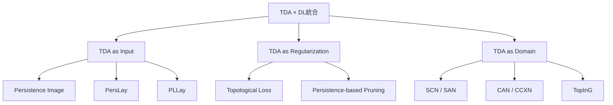

本記事は [Topological Deep Learning: A Review of an Emerging Paradigm](https://arxiv.org/abs/2302.03836) の解説記事です。

## 論文概要（Abstract）

本論文は、トポロジカルデータ解析（TDA）と深層学習の統合を包括的にレビューするサーベイ論文である。著者らのZia et al.は、パーシステントホモロジーの深層学習への統合方法を3つのカテゴリ——（1）TDA特徴量を入力とする手法、（2）TDA制約を損失関数に組み込む手法、（3）トポロジカルドメイン上のニューラルネットワーク——に分類し、40以上の論文を体系的に整理している。Artificial Intelligence Review（2024年、DOI: 10.1007/s10462-024-10710-9）に掲載された。

この記事は [Zenn記事: パーシステントホモロジーとトポロジカル深層学習の実践入門](https://zenn.dev/0h_n0/articles/2d89b3f22451d2) の深掘りです。

## 情報源

- **arXiv ID**: 2302.03836
- **URL**: [https://arxiv.org/abs/2302.03836](https://arxiv.org/abs/2302.03836)
- **著者**: Ali Zia, Abdelwahed Khamis, James Nichols, Zeeshan Hayder, Vivien Rolland, Lars Petersson
- **発表年**: 2023（arXiv初版）、2024（ジャーナル掲載）
- **掲載誌**: Artificial Intelligence Review
- **分野**: cs.LG, cs.AI

## 背景と動機（Background & Motivation）

深層学習は画像・テキスト・グラフといった構造化データで成功を収めているが、データの**位相的構造**（穴、空洞、連結成分の配置）を直接活用する手法は比較的少ない。トポロジカルデータ解析（TDA）は、データの形状から頑健な特徴量を抽出できる数学的フレームワークであるが、その出力（パーシステンス図）は可変長であり、ニューラルネットワークに直接入力しにくいという課題がある。

2017年頃からTDAと深層学習を統合する研究が急速に増加し、2023年時点で体系的なレビューの必要性が高まっていた。著者らは、この分野を3つの統合パラダイムに整理し、各手法の数学的基盤、実装方法、および応用分野を横断的に比較している。

## 主要な貢献（Key Contributions）

- **貢献1（3つのパラダイムの体系化）**: TDA×DLの統合を「TDA as Input」「TDA as Regularization」「TDA as Domain」の3カテゴリに分類。各カテゴリの数学的基盤と代表手法を整理した。
- **貢献2（Deep Topological Analyticsの紹介）**: ニューラルネットワーク自体をTDAで解析する「逆方向」の研究——損失関数のランドスケープ解析、学習ダイナミクスのトポロジカル分析——を体系化した。
- **貢献3（応用分野の横断比較）**: 計算機ビジョン、グラフ学習、時系列解析、医療画像、材料科学など幅広い応用分野での事例を比較した。

## 技術的詳細（Technical Details）

### パラダイム1: TDA as Input（特徴量としてのTDA）

最もシンプルな統合方法は、TDAの出力を深層学習の入力特徴量として使用するものである。

**パーシステンス図のベクトル化**: パーシステンス図 $\text{PD} = \{(b_i, d_i)\}_{i=1}^n$ は可変長の点集合であるため、固定長ベクトルに変換する必要がある。著者らは以下の主要な手法を整理している。

**Persistence Image** (Adams et al., 2017): 各点 $(b_i, d_i)$ をガウスカーネルで平滑化し、格子上に重み付き和を取る。

$$
\rho(x, y) = \sum_{i=1}^n w(b_i, d_i) \cdot \frac{1}{2\pi\sigma^2} \exp\left(-\frac{(x - b_i)^2 + (y - (d_i - b_i))^2}{2\sigma^2}\right)
$$

ここで、
- $(x, y)$: 格子点の座標（birth-persistence座標）
- $w(b, d)$: 重み関数（通常 $w = d - b$、対角線近くの点を抑制）
- $\sigma$: ガウスカーネルの帯域幅

**PersLay** (Carrière et al., NeurIPS 2020): パーシステンス図を微分可能な形で処理するニューラルネットワーク層。各点を $\phi: \mathbb{R}^2 \to \mathbb{R}^q$ で変換し、集約関数で固定長ベクトルを得る。

$$
\text{PersLay}(\text{PD}) = \text{AGG}\left(\{w_i \cdot \phi(b_i, d_i) : i = 1, \ldots, n\}\right)
$$

$\phi$ と $w_i$ はともに学習可能。

### パラダイム2: TDA as Regularization（正則化としてのTDA）

深層学習の損失関数にトポロジカルな制約を追加する手法群。

**Topological Loss** (Hu et al., NeurIPS 2019): 画像セグメンテーションの出力に対し、パーシステントホモロジーを計算し、望ましいトポロジー（例: 連結成分数=1）からの逸脱をペナルティとして課す。

$$
\mathcal{L}_{\text{topo}} = \sum_{(b_i, d_i) \in \text{PD}^{\text{unwanted}}} (d_i - b_i)^2
$$

「不要な」トポロジカル特徴（例: セグメンテーション結果に生じた望まない穴）のpersistenceの二乗和を最小化する。

### パラダイム3: TDA as Domain（トポロジカルドメイン上のNN）

グラフを超えたトポロジカルドメイン（単体複体、胞体複体等）上でニューラルネットワークを定義する手法群。これは最も新しいパラダイムであり、Zenn記事で紹介されているTopoXやTopInGもこのカテゴリに含まれる。

**Hodge Laplacianに基づくメッセージパッシング**: $k$次のHodge Laplacianは以下で定義される。

$$
\mathcal{L}_k = B_{k+1} B_{k+1}^T + B_k^T B_k
$$

ここで $B_k$ は $k$次の境界行列である。Hodge Laplacian $\mathcal{L}_k$ の固有値分解により、$k$-セル上のスペクトルフィルタリングが可能になる。

$$
\mathbf{h}_{\sigma_k}^{(l+1)} = \sigma\left(\sum_{r \in \{k-1, k, k+1\}} \mathbf{A}_r \mathbf{h}^{(l)} \mathbf{W}_r^{(l)}\right)
$$

ここで、
- $\mathbf{A}_r$: ランク $r$ からの隣接/接続情報
- $\mathbf{W}_r^{(l)}$: 学習可能な重み行列
- $\sigma$: 活性化関数

### 分類表：代表的手法の比較

| 手法 | パラダイム | ドメイン | 入力 | 微分可能 | 代表的応用 |
|------|----------|---------|------|---------|-----------|
| Persistence Image | Input | ユークリッド | PD→画像 | No | 形状分類 |
| PersLay | Input | ユークリッド | PD→ベクトル | Yes | グラフ分類 |
| PLLay | Input | ユークリッド | PD→ランドスケープ | Yes | 材料特性予測 |
| Topological Loss | Regularization | 画像 | セグメンテーション | Yes | 医療画像 |
| TopInG | Domain | グラフ | フィルトレーション | Yes | GNN解釈性 |
| SCN | Domain | 単体複体 | $k$-単体特徴量 | Yes | ノード分類 |
| CAN | Domain | 胞体複体 | $k$-セル特徴量 | Yes | 分子特性 |



### Deep Topological Analytics: ニューラルネットワークのTDA解析

著者らがレビューしたもう1つの方向性は、ニューラルネットワーク自体をTDAで解析する研究群である。

**損失ランドスケープのトポロジー解析**: ニューラルネットワークの損失関数 $\mathcal{L}(\theta)$ のレベルセット $\{\theta : \mathcal{L}(\theta) \leq c\}$ に対してPHを計算することで、損失ランドスケープの「谷」の構造を理解する。著者らの整理によると、良い汎化性能を持つモデルは、損失ランドスケープの $H_0$ Betti数（連結成分数）が少ない——つまり「広い谷」が少数存在する——傾向があるとする報告がある。

**学習ダイナミクスの追跡**: 学習過程で中間層の活性化パターンのトポロジーがどのように変化するかを追跡する研究も紹介されている。PHを用いて各エポックの表現空間の構造変化を可視化することで、学習の進行度合いを定量化できる可能性がある。

## 実装のポイント（Implementation）

本論文はサーベイであるため、具体的な実装よりも設計指針を提供する。著者らが推奨する実装上のポイントを以下にまとめる。

**1. パラダイム選択の指針**:
- データに明確な位相構造がある場合（穴、ループ等）→ TDA as Input
- セグメンテーション等でトポロジカルな正確性が求められる場合 → TDA as Regularization
- 高次関係を持つグラフデータ → TDA as Domain

**2. ベクトル化手法の選択**:
- 精度重視: PersLay（微分可能、end-to-end学習可能）
- 計算速度重視: Persistence Image（前処理で一括計算可能）
- 統計的検定が必要: Persistence Landscape（Banach空間上の統計量が利用可能）

**3. ライブラリの選択**:
- PH計算: GUDHI（C++バックエンド、最も高速）、Ripser（メモリ効率が良い）、giotto-tda（scikit-learn互換）
- TDL実装: TopoX（PyTorchベース、統一API）
- 可視化: Persim（パーシステンス図のプロット）

```python
# パラダイム選択のガイドライン実装例
# 動作確認環境: Python 3.11

from enum import Enum
from dataclasses import dataclass


class TDAParadigm(Enum):
    INPUT = "tda_as_input"
    REGULARIZATION = "tda_as_regularization"
    DOMAIN = "tda_as_domain"


@dataclass
class DataCharacteristics:
    """データの特徴を記述するクラス"""
    has_topological_structure: bool    # 穴、ループ等が存在
    requires_topological_accuracy: bool  # セグメンテーション等
    has_higher_order_relations: bool    # 3者以上の関係
    data_type: str                     # "point_cloud", "graph", "image"


def recommend_paradigm(data: DataCharacteristics) -> TDAParadigm:
    """データ特性に基づいてTDAパラダイムを推奨する

    Args:
        data: データの特徴記述
    Returns:
        推奨されるTDAパラダイム
    """
    if data.has_higher_order_relations:
        return TDAParadigm.DOMAIN
    if data.requires_topological_accuracy:
        return TDAParadigm.REGULARIZATION
    if data.has_topological_structure:
        return TDAParadigm.INPUT
    # デフォルト: 最もシンプルなアプローチ
    return TDAParadigm.INPUT


def recommend_vectorization(
    need_differentiable: bool,
    need_speed: bool,
    need_statistics: bool,
) -> str:
    """ベクトル化手法を推奨する"""
    if need_statistics:
        return "Persistence Landscape"
    if need_differentiable:
        return "PersLay"
    if need_speed:
        return "Persistence Image"
    return "Persistence Image"  # デフォルト


if __name__ == "__main__":
    # 例1: 分子グラフ（高次関係あり）
    molecular = DataCharacteristics(
        has_topological_structure=True,
        requires_topological_accuracy=False,
        has_higher_order_relations=True,
        data_type="graph",
    )
    print(f"分子グラフ: {recommend_paradigm(molecular).value}")
    # → tda_as_domain

    # 例2: 医療画像セグメンテーション
    medical = DataCharacteristics(
        has_topological_structure=True,
        requires_topological_accuracy=True,
        has_higher_order_relations=False,
        data_type="image",
    )
    print(f"医療画像: {recommend_paradigm(medical).value}")
    # → tda_as_regularization

    # 例3: 時系列の形状分類
    timeseries = DataCharacteristics(
        has_topological_structure=True,
        requires_topological_accuracy=False,
        has_higher_order_relations=False,
        data_type="point_cloud",
    )
    print(f"時系列: {recommend_paradigm(timeseries).value}")
    # → tda_as_input
```

## 実験結果（Results）

本論文はサーベイであり、独自の実験結果は含まない。著者らが整理した各手法のベンチマーク結果の傾向を以下にまとめる。

**TDA as Inputの傾向**: 著者らの整理によると、点群分類タスクではPersistence Image + CNNの組み合わせが安定した性能を示す。ModelNet40（3D形状分類）でTDA特徴量を追加することで、ベースラインCNNから1〜3%の精度向上が報告されている事例が複数存在する。

**TDA as Regularizationの傾向**: 著者らの整理によると、Topological Lossは特にトポロジカルな正確性が求められるタスク（血管セグメンテーション、道路ネットワーク抽出等）で有効であり、Dice Lossのみの場合と比較してBetti数誤差を50%以上削減した事例が報告されている。

**TDA as Domainの傾向**: 著者らの整理によると、最も新しいパラダイムであり、ベンチマーク結果は限定的だが、単体複体上のSCNがノード分類でGCNと同等以上の精度を達成した事例がある。

## 実運用への応用（Practical Applications）

著者らが特に有望と指摘する応用分野を以下に挙げる。

**医療画像解析**: 血管構造やニューロンの接続構造は本質的にトポロジカルであり、セグメンテーションの「切れ」や「くっつき」をPHで検出・ペナルティ化することで、臨床的に有用な結果が得られる可能性がある。

**材料科学**: 多孔質材料のPH特徴量（孔のサイズ分布、連結度）は材料特性と強く相関する。著者らは、TDA特徴量が従来の物理ベース特徴量を補完し、特性予測精度を向上させた報告を複数紹介している。

**コスト面の考慮**: PH計算はVietoris-Ripsフィルトレーションで $O(2^n)$ の最悪計算量を持つ。著者らは、1,000点以下のデータセットでは実用的だが、それ以上ではAlphaフィルトレーション（$O(n^2)$）やサブサンプリングが必要と指摘している。

## 関連研究（Related Work）

- **"Position: Topological Deep Learning is the New Frontier for Relational Learning"** (Hajij et al., ICML 2024): TDLの将来ビジョンを提示するポジションペーパー。本サーベイが既存手法の整理に主眼を置くのに対し、将来方向のロードマップを提供する。
- **"Topological data analysis and topological deep learning beyond persistent homology"** (Artificial Intelligence Review, 2025): 本サーベイの後継的レビューであり、Persistent Laplacian、Persistent Sheaf等のPHを超える手法をカバーする。
- **TopoX** (Hajij et al., 2024): 本サーベイの「TDA as Domain」パラダイムを実装基盤として具体化したPythonパッケージ群。

## まとめと今後の展望

本サーベイは、TDAと深層学習の統合を3つのパラダイム——Input、Regularization、Domain——に体系化し、40以上の論文を横断的に比較した包括的なレビューである。

著者らが指摘する今後の課題は以下の通り。（1）PH計算の計算コスト削減（GPU並列化、近似アルゴリズム）、（2）多パラメータPHの深層学習への効果的な統合、（3）TDL（TDA as Domain）のスケーラビリティと実応用の拡大。TDAと深層学習の統合は2023年以降急速に発展しており、本サーベイはその全体像を把握するための基盤的な文献として位置づけられる。

## 参考文献

- **arXiv**: [https://arxiv.org/abs/2302.03836](https://arxiv.org/abs/2302.03836)
- **Journal**: Artificial Intelligence Review, DOI: 10.1007/s10462-024-10710-9
- **Related**: PersLay (NeurIPS 2020), Topological Loss (NeurIPS 2019), TopoX (2024)
- **Related Zenn article**: [https://zenn.dev/0h_n0/articles/2d89b3f22451d2](https://zenn.dev/0h_n0/articles/2d89b3f22451d2)
