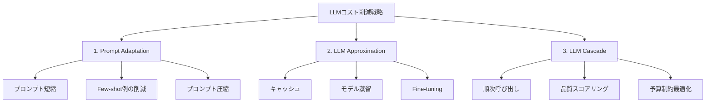
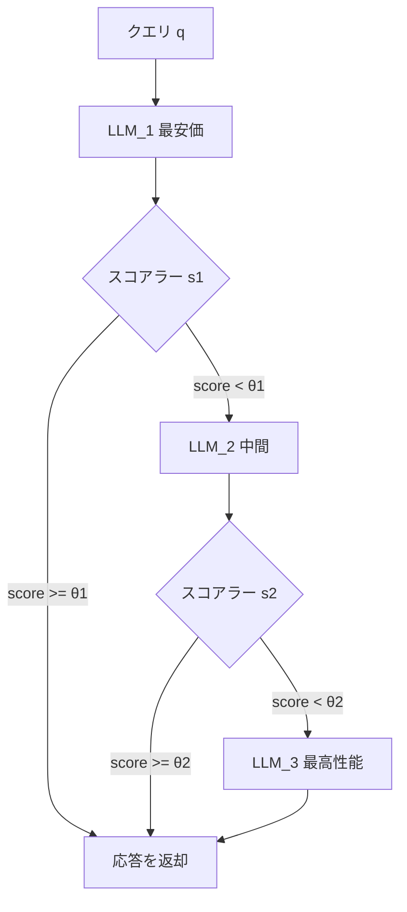

本記事は [FrugalGPT: How to Use Large Language Models While Reducing Cost and Improving Performance (arXiv:2310.03744)](https://arxiv.org/abs/2310.03744) の解説記事です。

## 論文概要（Abstract）

FrugalGPTは、LLM APIの利用コストを大幅に削減しながら精度を維持・向上させるフレームワークである。著者ら（Chen et al., Stanford University）は、LLMコスト削減の3つの戦略（プロンプト適応、モデル近似、LLMカスケード）を体系的に分類し、これらを統合したシステムを提案している。論文の評価では、GPT-4同等の精度を維持しながらコストを最大98%削減できたと報告されている。LLM APIのコスト最適化に関する先駆的研究として、RouteLLMやPortkeyのモデルルーティング機能の理論的基盤となっている。

この記事は [Zenn記事: Portkey AIゲートウェイ本番ベンチマーク：日本リージョンでの性能実測と運用設計](https://zenn.dev/0h_n0/articles/0e6ba8818ec5b5) の深掘りです。

## 情報源

- **arXiv ID**: 2310.03744
- **URL**: [https://arxiv.org/abs/2310.03744](https://arxiv.org/abs/2310.03744)
- **著者**: Lingjiao Chen, Matei Zaharia, James Zou（Stanford University）
- **発表年**: 2023
- **分野**: cs.AI, cs.LG

## 背景と動機（Background & Motivation）

2023年時点で、GPT-4の利用コストは入力1Kトークンあたり$0.03であり、大規模サービスでは月額数万ドルのAPI費用が発生する。一方、同時期のGPT-3.5-turboは$0.002/1Kトークンと15倍安価だが、複雑なタスクでは品質が不足する。

著者らは「すべてのクエリに最高性能モデルを使う必要はない」という観察から、クエリの難易度に応じてモデルを使い分ける戦略を体系化した。この研究は、PortkeyのようなAIゲートウェイが提供する「モデルルーティング」「フォールバック」機能の学術的基盤を提供している。

## 主要な貢献（Key Contributions）

- **貢献1**: LLMコスト削減戦略の3分類（Prompt Adaptation、LLM Approximation、LLM Cascade）の体系的整理
- **貢献2**: LLMカスケードによるコスト-精度トレードオフの定式化と最適化アルゴリズムの提案
- **貢献3**: 複数のLLM APIからの回答を統合するCompletion Selection手法の提案
- **貢献4**: 6つのベンチマーク（HellaSwag、BoolQ、NaturalQuestions、USMLE等）での包括的評価

## 技術的詳細（Technical Details）

### 3つのコスト削減戦略

著者らは、LLM APIコスト削減を以下の3カテゴリに体系化している：



**1. Prompt Adaptation（プロンプト適応）**: 入力プロンプトを短縮・圧縮してトークン数を削減する。Few-shot例の数を減らす、不要な文脈を要約する等の手法が含まれる。

**2. LLM Approximation（モデル近似）**: LLM APIの呼び出し自体を減らす。キャッシュ（同一クエリの再利用）、蒸留（大モデルの知識を小モデルに転写）、Fine-tuning（特定タスク向けに小モデルを調整）が含まれる。

**3. LLM Cascade（カスケード）**: 複数のLLMを安価な順に呼び出し、十分な品質の回答が得られた時点で停止する。FrugalGPTの中核手法である。

### LLMカスケードの定式化

$N$個のLLM API $\{M_1, M_2, \ldots, M_N\}$ がコスト昇順で並んでいるとする（$c_1 \leq c_2 \leq \ldots \leq c_N$）。カスケード戦略はルーター関数 $g$ とスコアラー関数 $s$ で定義される：

$$
g(q) = \min_{i \in \{1, \ldots, N\}} \left\{ i \mid s(q, M_i(q)) \geq \theta_i \right\}
$$

ここで、
- $q$: 入力クエリ
- $M_i(q)$: LLM $M_i$ の応答
- $s(q, M_i(q))$: 品質スコア関数の出力
- $\theta_i$: LLM $M_i$ の品質閾値

最適化目標は予算制約下でのコスト最小化である：

$$
\min_{g} \mathbb{E}_q\left[\sum_{i=1}^{g(q)} c_i\right] \quad \text{s.t.} \quad \mathbb{E}_q\left[\text{quality}(M_{g(q)}(q))\right] \geq \tau
$$

### カスケードの実行フロー



### Completion Selection（補完選択）

カスケードの各段階で得られた複数の回答候補から最良のものを選択する機構である。スコアリング関数は以下の特徴量で学習される：

$$
s(q, a) = f(\mathbf{e}_q, \mathbf{e}_a, \text{id}_{M})
$$

ここで $\mathbf{e}_q$ はクエリの埋め込み、$\mathbf{e}_a$ は回答の埋め込み、$\text{id}_M$ はLLMの識別子である。$f$ は軽量な分類器（ロジスティック回帰等）として実装される。

### 予算制約付き最適化

ユーザーは「1クエリあたりの平均コスト上限 $B$」を設定できる。この制約下で最適なカスケード構成（どのLLMを使うか、閾値をいくつにするか）を求める：

$$
\max_{\theta_1, \ldots, \theta_N} \mathbb{E}_q\left[\text{quality}(M_{g(q)}(q))\right] \quad \text{s.t.} \quad \mathbb{E}_q\left[\text{cost}(g(q))\right] \leq B
$$

この最適化は少量のラベル付きキャリブレーションデータ（数百〜数千件）で実行可能である。

## 実験結果（Results）

### コスト-精度トレードオフ

論文Figure 2およびFigure 3のPareto frontierより、以下の結果が報告されている：

| タスク | FrugalGPTコスト削減率 | 精度（GPT-4比） |
|--------|---------------------|----------------|
| HellaSwag | 約90% | 同等 |
| BoolQ | 約80% | 同等以上 |
| NaturalQuestions | 約75% | 同等 |
| USMLE | 約60% | 同等 |
| OpenbookQA | 約85% | 同等 |
| COPA | 約70% | 同等 |

**最良結果**: HellaSwagタスクにおいて、GPT-4同等の精度を維持しながらコストを約90%削減。一部タスクでは、複数LLMのCompletion Selectionによりコスト削減と精度向上を同時に達成している。

### 使用LLM API

著者らは以下のLLM APIを使用してカスケードを構成している：
- GPT-4（最高コスト）
- GPT-3.5-turbo
- text-davinci-003
- J2-Grande-Instruct（AI21）
- J2-Jumbo-Instruct（AI21）

### 精度向上のメカニズム

著者らは、コスト削減だけでなく精度も向上するケースがある理由を次のように分析している：複数のLLMは異なるクエリで異なる強みを持つため、Completion Selectionにより各クエリに最適なLLMの回答を選択することで、単一モデル使用時を超える精度が得られる場合がある。

## 実装のポイント（Implementation）

FrugalGPTのカスケード戦略を簡略化した実装例を以下に示す：

```python
from dataclasses import dataclass
from typing import Optional


@dataclass
class LLMConfig:
    """LLMの設定"""
    name: str
    cost_per_1k_tokens: float
    quality_threshold: float


class LLMCascade:
    """FrugalGPT風のLLMカスケード実装

    安価なモデルから順に呼び出し、
    品質スコアが閾値を超えた時点で停止する。
    """

    def __init__(self, models: list[LLMConfig]):
        # コスト昇順でソート
        self.models = sorted(models, key=lambda m: m.cost_per_1k_tokens)

    def route(
        self,
        query: str,
        score_fn: callable,
    ) -> tuple[str, str, float]:
        """クエリをカスケードで処理する

        Args:
            query: 入力クエリ
            score_fn: 品質スコアリング関数 (query, response) -> float

        Returns:
            (response, model_name, total_cost) のタプル
        """
        total_cost = 0.0

        for model in self.models:
            response = self._call_llm(model.name, query)
            total_cost += self._estimate_cost(query, response, model)

            score = score_fn(query, response)
            if score >= model.quality_threshold:
                return response, model.name, total_cost

        # 最後のモデルの応答を返す（フォールバック）
        return response, self.models[-1].name, total_cost

    def _call_llm(self, model_name: str, query: str) -> str:
        """LLM APIを呼び出す（実装は省略）"""
        raise NotImplementedError

    def _estimate_cost(
        self, query: str, response: str, model: LLMConfig
    ) -> float:
        """コストを推定する"""
        token_count = (len(query) + len(response)) / 4  # 簡易推定
        return token_count / 1000 * model.cost_per_1k_tokens
```

**スコアリング関数の設計が鍵**: 軽量な分類器（ロジスティック回帰）で十分な精度が得られるが、学習にはタスク固有のラベル付きデータが数百件必要。ラベルなし環境ではRouteLLMの嗜好データベースアプローチが代替となる。

## Production Deployment Guide

### AWS実装パターン（コスト最適化重視）

| 規模 | 月間リクエスト | 推奨構成 | 月額コスト | 主要サービス |
|------|--------------|---------|-----------|------------|
| **Small** | ~3,000 (100/日) | Serverless | $40-120 | Lambda + Bedrock (Haiku→Sonnet cascade) |
| **Medium** | ~30,000 (1,000/日) | Hybrid | $250-700 | Lambda + ECS + Bedrock + DynamoDB |
| **Large** | 300,000+ (10,000/日) | Container | $1,800-4,500 | EKS + Bedrock Batch + ElastiCache |

**Small構成の詳細** (月額$40-120):
- **Lambda**: カスケードロジック実行 ($15/月)
- **Bedrock Haiku**: 弱モデル（カスケード第1段）($20/月)
- **Bedrock Sonnet**: 強モデル（カスケード第2段、約20%のクエリ）($60/月)
- **DynamoDB**: スコアリング結果ログ ($5/月)

**コスト試算の注意事項**: 上記は2026年3月時点のAWS ap-northeast-1料金に基づく概算値です。カスケードの効率（強モデルへのエスカレーション率）によりBedrock費用は大きく変動します。最新料金は[AWS料金計算ツール](https://calculator.aws/)で確認してください。

### Terraformインフラコード

```hcl
# --- Lambda関数（カスケードロジック）---
resource "aws_lambda_function" "cascade_handler" {
  filename      = "cascade_handler.zip"
  function_name = "frugalgpt-cascade"
  role          = aws_iam_role.cascade_lambda.arn
  handler       = "handler.main"
  runtime       = "python3.12"
  timeout       = 90
  memory_size   = 512

  environment {
    variables = {
      WEAK_MODEL_ID   = "anthropic.claude-3-5-haiku-20241022-v1:0"
      STRONG_MODEL_ID = "anthropic.claude-sonnet-4-20250514-v1:0"
      QUALITY_THRESHOLD = "0.7"
      DYNAMODB_TABLE  = aws_dynamodb_table.cascade_log.name
    }
  }
}

resource "aws_iam_role_policy" "bedrock_cascade" {
  role = aws_iam_role.cascade_lambda.id
  policy = jsonencode({
    Version = "2012-10-17"
    Statement = [{
      Effect   = "Allow"
      Action   = ["bedrock:InvokeModel"]
      Resource = [
        "arn:aws:bedrock:ap-northeast-1::foundation-model/anthropic.claude-3-5-haiku*",
        "arn:aws:bedrock:ap-northeast-1::foundation-model/anthropic.claude-sonnet*"
      ]
    }]
  })
}

resource "aws_dynamodb_table" "cascade_log" {
  name         = "frugalgpt-cascade-log"
  billing_mode = "PAY_PER_REQUEST"
  hash_key     = "request_id"

  attribute {
    name = "request_id"
    type = "S"
  }

  ttl {
    attribute_name = "expire_at"
    enabled        = true
  }
}
```

### コスト最適化チェックリスト

- [ ] カスケード順序の最適化（コスト昇順でモデルを配置）
- [ ] 品質閾値のキャリブレーション（ラベル付きデータで最適化）
- [ ] 弱モデルにHaikuクラスを使用（コスト1/15）
- [ ] Bedrock Batch API活用（非リアルタイム処理で50%割引）
- [ ] エスカレーション率の監視（強モデル呼び出し率20%以下が目標）
- [ ] DynamoDBログのTTL設定（30日で自動削除）
- [ ] AWS Budgets設定（月額予算の80%で警告）
- [ ] CloudWatch: エスカレーション率のアラーム設定

## Portkey AIゲートウェイとの関連

Zenn記事で解説されているPortkeyの`strategy.mode: "fallback"`は、FrugalGPTのLLMカスケードと本質的に同じアーキテクチャである。Portkeyではエラーコード（429、500等）に基づくフォールバックとして実装されているが、FrugalGPTのように品質スコアに基づくカスケードを実現するには、アプリケーション層での品質判定ロジックが必要となる。

FrugalGPTの3戦略をPortkeyの機能にマッピングすると：
- **Prompt Adaptation** → Portkeyでは未実装（アプリ側で対応）
- **LLM Approximation** → Portkeyのセマンティックキャッシュが対応
- **LLM Cascade** → Portkeyのフォールバック構成 + 重み付きロードバランシングが近い

FrugalGPTの研究は、「なぜAIゲートウェイのルーティング機能がコスト削減に効果的なのか」を理論的に裏付けるものであり、Portkeyが報告する「API支出25%以上削減」の学術的根拠として参照できる。

## 関連研究（Related Work）

- **RouteLLM** (Ong et al., ICLR 2025): FrugalGPTのカスケードを2モデル間のルーティングに特化させ、嗜好データから学習する手法。FrugalGPTと異なり正解ラベルが不要
- **Hybrid LLM** (Ding et al., 2024): Conformal predictionで品質保証を付与したルーティング。FrugalGPTのスコアリング関数を理論的に保証する方向の発展
- **AutoMix** (Madaan et al., 2024): 自己検証メカニズムによるモデルエスカレーション。FrugalGPTのスコアラーをLLM自身の自信度で代替するアプローチ

## まとめと今後の展望

FrugalGPTは、LLM APIコスト削減の3戦略を体系化し、カスケード戦略でGPT-4同等精度を最大98%低コストで実現できることを示した先駆的研究である。

著者らの定式化は、PortkeyのようなAIゲートウェイが提供するモデルルーティング・フォールバック機能の理論的基盤となっている。課題として、（1）スコアリング関数の学習にタスク固有のラベル付きデータが必要、（2）カスケードによるレイテンシ増加、（3）LLM API価格の変動への対応が挙げられている。後続研究のRouteLLM（ICLR 2025）は嗜好データで（1）を解決し、MFルーターで（2）のレイテンシ問題を最小化している。

## 参考文献

- **arXiv**: [https://arxiv.org/abs/2310.03744](https://arxiv.org/abs/2310.03744)
- **RouteLLM**: [https://arxiv.org/abs/2406.18665](https://arxiv.org/abs/2406.18665)
- **Related Zenn article**: [https://zenn.dev/0h_n0/articles/0e6ba8818ec5b5](https://zenn.dev/0h_n0/articles/0e6ba8818ec5b5)
