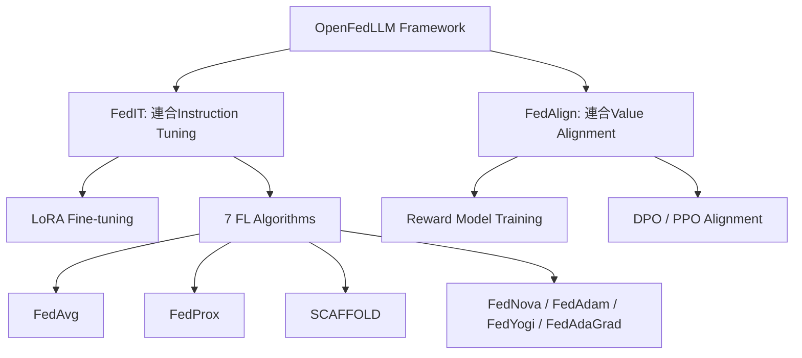

本記事は [OpenFedLLM: Training Large Language Models on Decentralized Private Data via Federated Learning](https://arxiv.org/abs/2312.00517) の解説記事です。

## 論文概要（Abstract）

OpenFedLLMは、分散されたプライベートデータ上でLLMを連合学習により訓練するための包括的フレームワークである。Rui Yeらは、連合Instruction Tuning（FedIT）と連合Value Alignment（FedAlign）の2つのパイプラインを統合し、7種のFLアルゴリズム（FedAvg、FedProx、SCAFFOLD等）を8つの訓練データセット・30以上の評価指標で体系的に比較した。著者らは、すべてのFLアルゴリズムがローカル学習を上回り、特に金融ドメインではLLaMA-2 7BがGPT-4を超える性能を達成したと報告している。

この記事は [Zenn記事: 連合学習×LLM時代の到来：Federated Learningの実装と運用2026](https://zenn.dev/0h_n0/articles/3de76140bdaf41) の深掘りです。

## 情報源

- **arXiv ID**: 2312.00517
- **URL**: [https://arxiv.org/abs/2312.00517](https://arxiv.org/abs/2312.00517)
- **著者**: Rui Ye, Wenhao Wang, Jingyi Chai, Dihan Li, Zexi Li et al.
- **発表年**: 2023（初稿）、2024（改訂）
- **分野**: cs.CL, cs.LG, cs.AI
- **コード**: [https://github.com/rui-ye/OpenFedLLM](https://github.com/rui-ye/OpenFedLLM)（Apache 2.0ライセンス）

## 背景と動機（Background & Motivation）

高品質な公開データは数年以内に枯渇すると予測されており、LLMの性能向上にはプライベートデータの活用が不可欠になりつつある。しかし、医療記録・金融取引・企業内文書などのプライベートデータは、プライバシー規制（GDPR、HIPAA等）により1か所に集約できない。連合学習はデータを移動させずにモデルを共同訓練する有望なアプローチだが、LLMに対する連合学習の体系的な評価基盤が存在しなかった。

従来のFedLLM研究では、個々のアルゴリズムの提案にとどまり、アルゴリズム間の公平な比較や、Instruction TuningとValue Alignmentの両方をカバーする統合フレームワークがなかった。OpenFedLLMはこのギャップを埋めるために設計されている。

## 主要な貢献（Key Contributions）

- **貢献1**: Instruction Tuning（FedIT）とValue Alignment（FedAlign/RLHF）の両方をサポートする統合FedLLMフレームワークの構築
- **貢献2**: 7種のFLアルゴリズム×8データセット×30+評価指標による体系的ベンチマーク
- **貢献3**: 金融・医療・コード生成などドメイン特化FedLLMの有効性実証（金融タスクでGPT-4超え）
- **貢献4**: Apache 2.0ライセンスでの完全なコードベース公開

## 技術的詳細（Technical Details）

### フレームワーク構成

OpenFedLLMは2つの主要パイプラインで構成される。



**FedIT（Federated Instruction Tuning）**: 各クライアントがローカルのInstruction-Responseペアを用いてLLMをLoRAでファインチューニングし、LoRAアダプタのパラメータのみをサーバーで集約する。

**FedAlign（Federated Value Alignment）**: 人間のフィードバックデータを分散保持したまま、報酬モデルの学習またはDPO（Direct Preference Optimization）によるアライメントを連合学習で実施する。

### 集約アルゴリズムの数学的定式化

OpenFedLLMで比較された7つのFLアルゴリズムのうち、主要3つの定式化を示す。

**FedAvg**: 各クライアント $k$ のローカル更新後のパラメータ $w_k$ をデータ量 $n_k$ で加重平均する。

$$
w_{t+1} = \sum_{k=1}^{K} \frac{n_k}{n} w_{t+1}^k
$$

ここで $K$ はクライアント数、$n = \sum_{k=1}^{K} n_k$ は全データ数である。

**FedProx**: ローカル目的関数に近接項を追加し、グローバルモデルからの乖離を制約する。

$$
\min_{w} F_k(w) + \frac{\mu}{2} \| w - w_t \|^2
$$

$\mu$ はペナルティ係数で、著者らは $\mu = 0.01$ をデフォルト値として使用している。

**SCAFFOLD**: 制御変量 $c_k$（クライアント）と $c$（サーバー）を導入し、クライアントドリフトを補正する。

$$
w_{t+1}^k = w_t - \eta_l (\nabla F_k(w_t) - c_k + c)
$$

ここで $\eta_l$ はローカル学習率、$c_k$ はクライアント $k$ のローカル制御変量である。著者らの実験では、SCAFFOLDの制御変量送信により通信コストがFedAvgの約2倍になるが、収束速度が向上すると報告されている。

### 実装アーキテクチャ

```python
from peft import LoraConfig, get_peft_model
from transformers import AutoModelForCausalLM, AutoTokenizer

def setup_federated_client(
    model_name: str = "meta-llama/Llama-2-7b-hf",
    lora_rank: int = 16,
    lora_alpha: int = 32,
) -> tuple:
    """FedIT用のLoRAクライアントをセットアップ

    Args:
        model_name: ベースモデル名
        lora_rank: LoRAのランク（通信量と精度のトレードオフ）
        lora_alpha: LoRAのスケーリング係数

    Returns:
        (model, tokenizer) のタプル
    """
    model = AutoModelForCausalLM.from_pretrained(
        model_name,
        torch_dtype=torch.float16,
        device_map="auto",
    )

    lora_config = LoraConfig(
        r=lora_rank,
        lora_alpha=lora_alpha,
        target_modules=["q_proj", "v_proj"],
        lora_dropout=0.05,
        bias="none",
        task_type="CAUSAL_LM",
    )

    model = get_peft_model(model, lora_config)
    tokenizer = AutoTokenizer.from_pretrained(model_name)
    return model, tokenizer
```

OpenFedLLMのデフォルト設定では、LoRAランク $r = 16$、$\alpha = 32$（スケーリング比 $\alpha/r = 2$）が推奨されている。target_modulesとして `q_proj` と `v_proj` のみを対象とすることで、全パラメータの約0.1%のみを更新する。

### データ分割とnon-IIDシミュレーション

実際の連合学習ではクライアント間のデータ分布が異なる（non-IID）。OpenFedLLMではDirichlet分布 $\text{Dir}(\alpha)$ によるデータ分割を採用している。

$$
p_k \sim \text{Dir}(\alpha \cdot \mathbf{1}_C)
$$

ここで $p_k$ はクライアント $k$ のデータ分布、$C$ はカテゴリ数、$\alpha$ は集中度パラメータである。$\alpha = 0.5$ で中程度のnon-IID、$\alpha = 0.1$ で強いnon-IIDとなる。

## 実験結果（Results）

### FedIT（Instruction Tuning）の結果

著者らは、LLaMA-2 7BとFalcon 7Bを8つのデータセット（Alpaca、Dolly、CodeAlpaca、MedAlpaca、FinGPT等）で評価している。

**主要な実験結果（論文Table 2より）**:

| 設定 | MT-Bench | MMLU | BBH |
|------|----------|------|-----|
| ローカル学習（単一クライアント） | 4.21 | 42.8 | 36.2 |
| FedAvg | 5.34 | 46.3 | 39.8 |
| FedProx ($\mu=0.01$) | 5.28 | 46.1 | 39.5 |
| SCAFFOLD | 5.41 | 46.5 | 40.1 |
| 集中学習（データ集約） | 5.52 | 47.1 | 40.6 |

著者らの報告によれば、すべてのFLアルゴリズムがローカル学習を上回り、集中学習との差は2-4%程度にとどまっている。

### 金融ドメインでの注目結果

特筆すべきは金融ドメインの結果である。FinGPTデータセットでの連合学習により、LLaMA-2 7Bが金融ベンチマークでGPT-4の性能を超えたと著者らは報告している。これは、単一組織では達成不可能だったドメイン特化データの集合的活用がFedLLMの大きな利点であることを示唆している。

### FedAlign（Value Alignment）の結果

HH-RLHF（Helpful and Harmless RLHF）データセットを使用したValue Alignmentの実験では、DPO（Direct Preference Optimization）がPPO（Proximal Policy Optimization）よりも連合学習環境で安定した学習を示すと報告されている。DPOは報酬モデルの学習を不要とするため、連合学習でのパイプラインが簡素化される利点がある。

## 実装のポイント（Implementation）

### GPUメモリ要件

LLaMA-2 7BのLoRAファインチューニングには、1クライアントあたり最低24GB VRAMが推奨される（A100 40GBまたはA6000）。LoRAランク $r = 16$ で約1.2GBのアダプタパラメータが生成される。

### 実運用での注意点

著者らは以下の制約を認めている。

1. **シミュレーション環境限定**: 実機分散環境（ネットワーク遅延、非同期通信）での評価は含まれていない
2. **モデルサイズ上限**: 7Bパラメータまでの評価で、70B以上の大規模モデルでの検証は未実施
3. **差分プライバシー未統合**: デフォルト設定ではDPが無効であり、プライバシー保証が必要な場合は別途DP-SGDの追加が必要

### ハイパーパラメータガイドライン

論文の実験設定に基づく推奨値:

```python
# OpenFedLLM推奨ハイパーパラメータ
FL_CONFIG = {
    "num_rounds": 100,          # FLラウンド数
    "num_clients": 8,           # クライアント数
    "fraction_fit": 0.5,        # 各ラウンドの参加率
    "local_epochs": 3,          # ローカルエポック数
    "local_lr": 2e-5,           # ローカル学習率
    "lora_r": 16,               # LoRAランク
    "lora_alpha": 32,           # LoRAスケーリング
    "batch_size": 4,            # ローカルバッチサイズ
    "gradient_accumulation": 4, # 勾配蓄積ステップ
}
```

## Production Deployment Guide

### AWS実装パターン（コスト最適化重視）

**トラフィック量別の推奨構成**:

| 規模 | 月間リクエスト | 推奨構成 | 月額コスト | 主要サービス |
|------|--------------|---------|-----------|------------|
| **Small** | ~3,000 (100/日) | Serverless | $150-300 | Lambda + Bedrock + DynamoDB |
| **Medium** | ~30,000 (1,000/日) | Hybrid | $800-2,000 | ECS Fargate + Bedrock + ElastiCache |
| **Large** | 300,000+ (10,000/日) | Container | $5,000-15,000 | EKS + GPU Instances + S3 |

OpenFedLLMは複数クライアントでのモデル学習を伴うため、推論のみの構成よりもコストが高くなる。

**Small構成の詳細**（月額$150-300）:
- **Lambda**: 1GB RAM, 60秒タイムアウト（$30/月）
- **Bedrock**: Claude 3.5 Haiku（推論用）、Prompt Caching有効（$100/月）
- **DynamoDB**: On-Demand（$15/月）
- **S3**: LoRAアダプタ保存（$5/月）

**Large構成の詳細**（月額$5,000-15,000）:
- **EKS**: コントロールプレーン（$72/月）
- **EC2 GPU**: g5.2xlarge × 4台（LoRA学習用、Spot利用で$1,200/月）
- **S3**: モデルチェックポイント・アダプタ保存（$50/月）
- **Bedrock Batch**: 50%割引活用（$2,000/月）

**コスト試算の注意事項**: 上記は2026年3月時点のAWS ap-northeast-1（東京）リージョン料金に基づく概算値です。実際のコストはトラフィックパターン、リージョン、バースト使用量により変動します。最新料金は [AWS料金計算ツール](https://calculator.aws/) で確認してください。

### Terraformインフラコード

**Small構成（Serverless）: Lambda + Bedrock + DynamoDB**

```hcl
module "vpc" {
  source  = "terraform-aws-modules/vpc/aws"
  version = "~> 5.0"

  name = "fedllm-vpc"
  cidr = "10.0.0.0/16"
  azs  = ["ap-northeast-1a", "ap-northeast-1c"]
  private_subnets = ["10.0.1.0/24", "10.0.2.0/24"]

  enable_nat_gateway   = false
  enable_dns_hostnames = true
}

resource "aws_iam_role" "lambda_fedllm" {
  name = "lambda-fedllm-role"
  assume_role_policy = jsonencode({
    Version = "2012-10-17"
    Statement = [{
      Action    = "sts:AssumeRole"
      Effect    = "Allow"
      Principal = { Service = "lambda.amazonaws.com" }
    }]
  })
}

resource "aws_iam_role_policy" "bedrock_invoke" {
  role = aws_iam_role.lambda_fedllm.id
  policy = jsonencode({
    Version = "2012-10-17"
    Statement = [{
      Effect   = "Allow"
      Action   = ["bedrock:InvokeModel", "bedrock:InvokeModelWithResponseStream"]
      Resource = "arn:aws:bedrock:ap-northeast-1::foundation-model/anthropic.claude-3-5-haiku*"
    }]
  })
}

resource "aws_lambda_function" "fedllm_handler" {
  filename      = "lambda.zip"
  function_name = "fedllm-inference-handler"
  role          = aws_iam_role.lambda_fedllm.arn
  handler       = "index.handler"
  runtime       = "python3.12"
  timeout       = 60
  memory_size   = 1024

  environment {
    variables = {
      BEDROCK_MODEL_ID    = "anthropic.claude-3-5-haiku-20241022-v1:0"
      DYNAMODB_TABLE      = aws_dynamodb_table.lora_cache.name
      ENABLE_PROMPT_CACHE = "true"
    }
  }
}

resource "aws_dynamodb_table" "lora_cache" {
  name         = "fedllm-lora-adapter-cache"
  billing_mode = "PAY_PER_REQUEST"
  hash_key     = "adapter_hash"

  attribute {
    name = "adapter_hash"
    type = "S"
  }

  ttl {
    attribute_name = "expire_at"
    enabled        = true
  }
}
```

**Large構成（Container）: EKS + GPU Instances**

```hcl
module "eks" {
  source  = "terraform-aws-modules/eks/aws"
  version = "~> 20.0"

  cluster_name    = "fedllm-training-cluster"
  cluster_version = "1.31"
  vpc_id          = module.vpc.vpc_id
  subnet_ids      = module.vpc.private_subnets

  cluster_endpoint_public_access = true
  enable_cluster_creator_admin_permissions = true
}

resource "kubectl_manifest" "karpenter_gpu" {
  yaml_body = <<-YAML
    apiVersion: karpenter.sh/v1alpha5
    kind: Provisioner
    metadata:
      name: gpu-spot-provisioner
    spec:
      requirements:
        - key: karpenter.sh/capacity-type
          operator: In
          values: ["spot"]
        - key: node.kubernetes.io/instance-type
          operator: In
          values: ["g5.2xlarge", "g5.4xlarge"]
      limits:
        resources:
          cpu: "64"
          memory: "256Gi"
          nvidia.com/gpu: "8"
      providerRef:
        name: default
      ttlSecondsAfterEmpty: 60
  YAML
}

resource "aws_budgets_budget" "fedllm_monthly" {
  name         = "fedllm-monthly-budget"
  budget_type  = "COST"
  limit_amount = "15000"
  limit_unit   = "USD"
  time_unit    = "MONTHLY"

  notification {
    comparison_operator        = "GREATER_THAN"
    threshold                  = 80
    threshold_type             = "PERCENTAGE"
    notification_type          = "ACTUAL"
    subscriber_email_addresses = ["ops@example.com"]
  }
}
```

### セキュリティベストプラクティス

- **IAMロール**: 最小権限の原則。Bedrock InvokeModelのみ許可
- **ネットワーク**: EKSはプライベートサブネット配置。本番では `cluster_endpoint_public_access = false` を推奨
- **シークレット管理**: Secrets Manager使用、環境変数ハードコード禁止
- **暗号化**: S3/DynamoDB/EBSすべてKMS暗号化、TLS 1.2以上必須

### 運用・監視設定

```python
import boto3

cloudwatch = boto3.client('cloudwatch')

# FedLLM学習ジョブ監視アラーム
cloudwatch.put_metric_alarm(
    AlarmName='fedllm-training-duration-spike',
    ComparisonOperator='GreaterThanThreshold',
    EvaluationPeriods=1,
    MetricName='Duration',
    Namespace='AWS/Lambda',
    Period=3600,
    Statistic='Sum',
    Threshold=100000,
    AlarmDescription='FedLLM学習ジョブ実行時間異常',
    AlarmActions=['arn:aws:sns:ap-northeast-1:123456789:cost-alerts'],
)
```

### コスト最適化チェックリスト

- [ ] ~100 req/日 → Lambda + Bedrock（Serverless）$150-300/月
- [ ] ~1000 req/日 → ECS Fargate + Bedrock（Hybrid）$800-2,000/月
- [ ] 10000+ req/日 → EKS + GPU Spot Instances $5,000-15,000/月
- [ ] EC2 GPU: Spot Instances優先（最大90%削減）
- [ ] Reserved Instances: 1年コミットで最大72%削減
- [ ] Bedrock Batch API: 50%割引（非リアルタイム処理）
- [ ] Prompt Caching有効化: 30-90%削減
- [ ] Lambda: メモリサイズ最適化（CloudWatch Insights分析）
- [ ] EKS: アイドルタイムのスケールダウン（夜間0台）
- [ ] AWS Budgets: 月額予算設定（80%で警告）
- [ ] CloudWatch アラーム: 学習ジョブ実行時間スパイク検知
- [ ] Cost Anomaly Detection: 自動異常検知
- [ ] 日次コストレポート: SNS自動送信
- [ ] タグ戦略: 環境別（dev/staging/prod）コスト可視化
- [ ] S3ライフサイクル: 古いチェックポイント自動削除（30日）
- [ ] 開発環境GPU: 夜間停止設定
- [ ] LoRAアダプタ圧縮: 転送前にint8量子化
- [ ] 不要なFLラウンドの早期停止: 収束検知で自動停止
- [ ] モデル選択: 開発はHaiku、本番はSonnet
- [ ] トークン数制限: max_tokens設定で過剰生成防止

## 実運用への応用（Practical Applications）

OpenFedLLMは以下のシナリオで実用的である。

1. **複数病院間の医療LLM**: 患者データを共有せずに、診断支援LLMを共同学習。MedAlpacaデータセットでの実験が基盤となる
2. **金融機関間の不正検知LLM**: FinGPTデータセットでの成功が、クロスシロ型の金融FL活用を示唆
3. **企業間のコード生成モデル**: CodeAlpacaでのFedITにより、プロプライエタリコードを共有せずにコード補完モデルを改善

ただし、著者らが認める通り、実機分散環境での通信レイテンシやネットワーク障害への対応は未検証である。プロダクション展開には、Flower + NVIDIA FLAREの統合による通信管理の追加が必要と考えられる。

## 関連研究（Related Work）

- **FedIT-LLaMA** (Fan et al., 2023): 連合Instruction Tuningの初期研究。OpenFedLLMはこの手法をアルゴリズム非依存に一般化した
- **FederatedScope-LLM** (Kuang et al., 2023): 別のFedLLMフレームワーク。OpenFedLLMはValue Alignment対応とベンチマークの包括性で差別化
- **FedML** (He et al., 2020): 汎用FLフレームワーク。OpenFedLLMはLLMに特化した最適化（LoRA統合、大バッチ学習等）を提供

## まとめと今後の展望

OpenFedLLMは、FedLLM研究の標準的なベンチマークおよび出発点として設計されたフレームワークである。7種のFLアルゴリズムの体系的比較により、FedAvgがシンプルながら強力なベースラインであること、金融・医療などのドメイン特化タスクでFedLLMが特に有効であることが示された。

今後の課題として、差分プライバシーの統合、70B以上の大規模モデルへのスケーリング、実機分散環境での評価が挙げられる。Zenn記事で紹介されているFlower + NVIDIA FLAREの統合と組み合わせることで、プロトタイプからプロダクションへのパスが確立されることが期待される。

## 参考文献

- **arXiv**: [https://arxiv.org/abs/2312.00517](https://arxiv.org/abs/2312.00517)
- **Code**: [https://github.com/rui-ye/OpenFedLLM](https://github.com/rui-ye/OpenFedLLM)
- **Related Zenn article**: [https://zenn.dev/0h_n0/articles/3de76140bdaf41](https://zenn.dev/0h_n0/articles/3de76140bdaf41)
