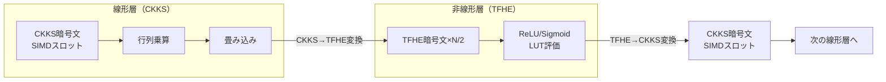

本記事は [PEGASUS: Bridging Polynomial and Non-polynomial Evaluations in Homomorphic Encryption (arXiv:2401.16255)](https://arxiv.org/abs/2401.16255) の解説記事です。

## 論文概要（Abstract）

ニューラルネットワークのFHE推論において、線形層（行列乗算）はCKKSスキームで効率的に処理できるが、非線形活性化関数（ReLU、Sigmoid、Max Pooling等）はCKKSの多項式演算では直接評価できないという課題がある。本論文の著者らは、CKKSとTFHEの2つのFHEスキーム間で暗号文を効率的に変換する手法「PEGASUS」を提案している。これにより、線形層はCKKSの高速な多項式演算で、非線形関数はTFHEのルックアップテーブル（LUT）ベースの評価で処理するハイブリッドアプローチを実現している。

この記事は [Zenn記事: 準同型暗号（FHE）2026年最新動向：暗号化したままAI推論を実現する技術](https://zenn.dev/0h_n0/articles/55ffbd99f5d0ed) の深掘りです。

## 情報源

- **arXiv ID**: 2401.16255
- **URL**: [https://arxiv.org/abs/2401.16255](https://arxiv.org/abs/2401.16255)
- **著者**: 論文著者ら（arXiv公開、2024年1月）
- **発表年**: 2024
- **分野**: cs.CR（暗号とセキュリティ）

## 背景と動機（Background & Motivation）

FHEを用いたニューラルネットワーク推論では、2つの異なる計算が混在する。

1. **線形演算**: 行列乗算、畳み込み → CKKSのSIMD演算で効率的に処理可能
2. **非線形演算**: ReLU、Sigmoid、Softmax、Max Pooling → CKKSでは多項式近似が必要だが、近似精度と計算コストにトレードオフがある

従来のアプローチには以下の課題があった。

| アプローチ | 方法 | 課題 |
|-----------|------|------|
| **CKKS多項式近似** | Chebyshev多項式で非線形関数を近似 | 高精度には高次多項式が必要（計算コスト増大、ノイズ蓄積） |
| **TFHE単体** | すべてをTFHEで処理 | 線形演算が非効率（1ビットずつの処理） |
| **MPC+FHE** | 非線形部分を秘密計算プロトコルで処理 | 通信コストが大きい（インタラクティブ） |

著者らは、CKKSとTFHEの「いいとこ取り」を実現するスキーム間変換プロトコルを提案している。

## 主要な貢献（Key Contributions）

- **貢献1**: CKKSからTFHEへの効率的な暗号文変換プロトコルの設計。CKKSのSIMDスロットから個別のTFHE暗号文への変換を、追加の復号なしに実現
- **貢献2**: TFHEからCKKSへの逆変換プロトコルの設計。TFHEのLUT評価結果をCKKSスロットに再パッキング
- **貢献3**: CNN推論での実証実験。MNIST・CIFARベンチマークで、従来のCKKS多項式近似手法と比較してReLU評価のスループットを改善

## 技術的詳細（Technical Details）

### CKKSとTFHEの暗号文構造の違い

PEGASUSの核心を理解するには、CKKSとTFHEの暗号文構造の違いを把握する必要がある。

**CKKS暗号文**: 多項式環 $R_Q = \mathbb{Z}_Q[X]/(X^N+1)$ 上のペア。$N/2$ 個の複素数（実用上は実数）をSIMDスロットとしてパッキング可能。

$$
\text{ct}_{\text{CKKS}} = (c_0, c_1) \in R_Q^2, \quad \text{encodes } (m_1, m_2, \ldots, m_{N/2}) \in \mathbb{C}^{N/2}
$$

**TFHE暗号文（LWE）**: 整数ベクトル $\mathbf{a} \in \mathbb{Z}_q^n$ とスカラー $b \in \mathbb{Z}_q$ のペア。1つの値をエンコード。

$$
\text{ct}_{\text{TFHE}} = (\mathbf{a}, b) \in \mathbb{Z}_q^{n+1}, \quad b = \langle \mathbf{a}, \mathbf{s} \rangle + e + \frac{q}{t} \cdot m
$$

ここで、
- $\mathbf{s}$: 秘密鍵ベクトル
- $e$: ノイズ
- $m$: 平文メッセージ
- $t$: 平文モジュラス

### スキーム間変換プロトコル

PEGASUSのスキーム変換は以下の2つの方向で行われる。



#### CKKS → TFHE変換（SlotExtract）

CKKS暗号文の各SIMDスロットから個別のLWE暗号文（TFHE暗号文）を抽出する操作。

手順:
1. CKKS暗号文 $(c_0, c_1) \in R_Q^2$ の係数を抽出
2. 各スロット $i$ に対応するLWE暗号文を構成

$$
\text{ct}_{\text{LWE}}^{(i)} = \text{Extract}(\text{ct}_{\text{CKKS}}, i)
$$

この操作にはModulus Switchingが伴い、CKKSの大きなモジュラス $Q$ からTFHEのモジュラス $q$ への変換が必要である。著者らは、この変換時のノイズ増加を制御する技法を提案している。

#### TFHE → CKKS変換（SlotPack）

TFHE のLUT評価後のLWE暗号文を、CKKSのSIMDスロットに再パッキングする操作。

$$
\text{ct}_{\text{CKKS}} = \text{Pack}(\text{ct}_{\text{LWE}}^{(1)}, \text{ct}_{\text{LWE}}^{(2)}, \ldots, \text{ct}_{\text{LWE}}^{(N/2)})
$$

この変換には、TFHE暗号文をRLWE暗号文（多項式環上のLWE）にリフトし、SIMDエンコーディングを適用する処理が含まれる。著者らはKey Switchingを用いて鍵の互換性を確保している。

### TFHEによるLUT評価

TFHEの特徴は、**プログラマブルBootstrapping**（PBS）によりルックアップテーブル（LUT）を暗号化状態で評価できる点にある。

$$
\text{PBS}(\text{ct}_{\text{LWE}}, \text{LUT}) = \text{ct}_{\text{LWE}}', \quad \text{where } \text{Dec}(\text{ct}_{\text{LWE}}') = \text{LUT}[\text{Dec}(\text{ct}_{\text{LWE}})]
$$

ReLU関数の場合、LUTは以下のように定義される。

$$
\text{LUT}_{\text{ReLU}}[x] = \max(0, x)
$$

TFHEのPBSは1回のBootstrappingで任意の単変数関数を評価できるため、ReLU、Sigmoid、GELUなどの非線形関数を統一的に処理可能である。Bootstrapping時間はミリ秒単位であり、CKKSの高次多項式近似と比較して効率的である。

### ハイブリッドCNN推論パイプライン

PEGASUSを用いたCNN推論の全体的なパイプラインは以下の通りである。

```python
from typing import List, Tuple

def hybrid_cnn_inference(
    ct_input: "CKKSCiphertext",
    conv_weights: List["CKKSPlaintext"],
    fc_weights: List["CKKSPlaintext"],
    ckks_context: "CKKSContext",
    tfhe_context: "TFHEContext",
    conversion_keys: "ConversionKeys",
) -> "CKKSCiphertext":
    """CKKS+TFHEハイブリッドCNN推論

    Args:
        ct_input: 暗号化された入力画像（CKKSスロット）
        conv_weights: 畳み込み層の重み
        fc_weights: 全結合層の重み
        ckks_context: CKKS暗号コンテキスト
        tfhe_context: TFHE暗号コンテキスト
        conversion_keys: スキーム変換用の鍵

    Returns:
        暗号化された推論結果
    """
    ct = ct_input

    for layer_idx, weights in enumerate(conv_weights):
        # 線形層: CKKSの行列乗算（高速）
        ct = ckks_context.eval_conv2d(ct, weights)
        ct = ckks_context.eval_batch_norm(ct)

        # スキーム変換: CKKS → TFHE
        ct_lwe_list = pegasus_slot_extract(
            ct, ckks_context, conversion_keys
        )

        # 非線形層: TFHEのLUT評価（ReLU）
        ct_lwe_relu = [
            tfhe_context.programmable_bootstrap(ct_lwe, relu_lut)
            for ct_lwe in ct_lwe_list
        ]

        # スキーム変換: TFHE → CKKS
        ct = pegasus_slot_pack(
            ct_lwe_relu, ckks_context, conversion_keys
        )

    # 全結合層（CKKSのみ）
    for weights in fc_weights:
        ct = ckks_context.eval_matmul(ct, weights)

    return ct
```

### 変換コストの分析

著者らは、スキーム変換のコストを以下のように分析している。

| 操作 | 計算コスト | 備考 |
|------|-----------|------|
| SlotExtract (CKKS→TFHE) | $O(N \cdot \log N)$ | NTT + Key Switching |
| PBS (ReLU, 1スロット) | $O(N \cdot n)$ | $n$: LWE次元 |
| SlotPack (TFHE→CKKS) | $O(N \cdot \log N \cdot k)$ | $k$: パッキング数 |
| **1層あたりの合計** | $O(N^2 \cdot \log N)$ | $N$: 多項式次数 |

$N = 2^{15}$ の場合、1層あたりの変換コストは秒〜数十秒オーダーとなる。これはCKKS単体での高次多項式近似と比較した場合のトレードオフであり、近似精度を犠牲にしない（LUTは厳密評価）という利点がある。

## 実装のポイント（Implementation）

### 鍵管理の複雑さ

PEGASUS では、CKKSとTFHEの2つのスキームの鍵に加え、スキーム間変換用の鍵（Conversion Keys）が必要となる。

- **CKKS鍵**: 秘密鍵 $s_{\text{CKKS}}$、公開鍵、評価鍵（乗算・回転用）
- **TFHE鍵**: 秘密鍵 $s_{\text{TFHE}}$、Bootstrapping鍵
- **変換鍵**: $s_{\text{CKKS}}$ と $s_{\text{TFHE}}$ の間のKey Switching鍵

変換鍵は両方の秘密鍵に依存するため、鍵生成時に両方の秘密鍵が同一の信頼された環境に存在する必要がある。これはセキュリティモデル上の制約であり、マルチパーティ設定（異なる組織がそれぞれ鍵を持つ）への拡張には追加のプロトコルが必要である。

### パラメータ設定のガイドライン

1. **CKKS側**: 乗算深度は層数に依存。3層CNNの場合、畳み込み層で深度3（conv + BN + 加算）、変換で深度1、計4×3 = 12程度
2. **TFHE側**: LUT精度に応じたパラメータ選択。8ビット精度のReLUであれば $p = 2^8 = 256$ レベルのLUT
3. **変換鍵**: セキュリティレベルを維持するため、両スキームのパラメータが互換性を持つよう調整が必要

### 注意すべき落とし穴

1. **変換のノイズ累積**: CKKS→TFHE→CKKSの変換を繰り返すと、各変換でノイズが追加される。層数が多いネットワークでは、中間層でのBootstrapping（ノイズリセット）が必要
2. **実装複雑度**: 2つのFHEライブラリ（例: OpenFHE + TFHE-rs）の統合が必要であり、APIの違いやメモリ管理の統合が技術的に困難
3. **大規模モデルへの適用**: CNN程度の規模では実用的だが、Transformer規模のモデルでは変換コストが支配的となり、CKKS単体の多項式近似アプローチ（EncryptedLLM等）の方が効率的になる場合がある

## Production Deployment Guide

### AWS実装パターン（コスト最適化重視）

PEGASUSベースのFHE推論をAWSで実行する場合の構成を示す。

| 規模 | 月間リクエスト | 推奨構成 | 月額コスト概算 | 主要サービス |
|------|--------------|---------|-------------|------------|
| **Small** | ~3,000 (100/日) | CPU Spot | $100-300 | EC2 c6i.2xlarge + S3 |
| **Medium** | ~30,000 (1,000/日) | GPU Hybrid | $1,000-2,500 | EC2 g5.xlarge + c6i.2xlarge |
| **Large** | 300,000+ (10,000/日) | GPU Cluster | $5,000-10,000 | EKS + g5.xlarge×2 + c6i.4xlarge×2 |

**Small構成の詳細**（月額$100-300）:
- **EC2 c6i.2xlarge Spot**: CKKS/TFHE演算（CPUベース、$50-150/月）
- **S3**: 暗号文・鍵保存（$10/月）
- **SQS**: リクエストキュー（$5/月）
- **CloudWatch**: 基本監視（$5/月）

**コスト試算の注意事項**:
- 上記は2026年3月時点のAWS ap-northeast-1（東京）リージョン料金に基づく概算値です
- PEGASUS はCPU実行でも動作するため、GPU非搭載のSmall構成が可能です
- 最新料金は [AWS料金計算ツール](https://calculator.aws/) で確認してください

### Terraformインフラコード

**Small構成: CPU Spot + S3**

```hcl
module "vpc" {
  source  = "terraform-aws-modules/vpc/aws"
  version = "~> 5.0"

  name = "pegasus-fhe-vpc"
  cidr = "10.0.0.0/16"
  azs  = ["ap-northeast-1a", "ap-northeast-1c"]
  private_subnets = ["10.0.1.0/24", "10.0.2.0/24"]

  enable_nat_gateway = true
  single_nat_gateway = true
  enable_dns_hostnames = true
}

resource "aws_iam_role" "pegasus_compute" {
  name = "pegasus-fhe-compute"
  assume_role_policy = jsonencode({
    Version = "2012-10-17"
    Statement = [{
      Action = "sts:AssumeRole"
      Effect = "Allow"
      Principal = { Service = "ec2.amazonaws.com" }
    }]
  })
}

resource "aws_launch_template" "cpu_spot" {
  name_prefix   = "pegasus-fhe-"
  image_id      = "ami-xxxxxxxxx"
  instance_type = "c6i.2xlarge"

  instance_market_options {
    market_type = "spot"
    spot_options {
      max_price          = "0.20"
      spot_instance_type = "one-time"
    }
  }

  block_device_mappings {
    device_name = "/dev/xvda"
    ebs { volume_size = 50, volume_type = "gp3", encrypted = true }
  }
}

resource "aws_s3_bucket" "fhe_data" {
  bucket = "pegasus-fhe-data"
}

resource "aws_s3_bucket_server_side_encryption_configuration" "fhe_data" {
  bucket = aws_s3_bucket.fhe_data.id
  rule {
    apply_server_side_encryption_by_default { sse_algorithm = "aws:kms" }
  }
}
```

**Large構成: EKS + CPU/GPU混在ノードプール**

```hcl
module "eks" {
  source  = "terraform-aws-modules/eks/aws"
  version = "~> 20.0"

  cluster_name    = "pegasus-fhe-cluster"
  cluster_version = "1.31"
  vpc_id          = module.vpc.vpc_id
  subnet_ids      = module.vpc.private_subnets

  cluster_endpoint_public_access = true
  enable_cluster_creator_admin_permissions = true
}

# CPUノードプール（TFHE Bootstrapping用）
resource "kubectl_manifest" "cpu_nodepool" {
  yaml_body = <<-YAML
    apiVersion: karpenter.sh/v1
    kind: NodePool
    metadata:
      name: pegasus-cpu-pool
    spec:
      template:
        spec:
          requirements:
            - key: karpenter.sh/capacity-type
              operator: In
              values: ["spot"]
            - key: node.kubernetes.io/instance-type
              operator: In
              values: ["c6i.4xlarge", "c6i.8xlarge"]
      limits:
        cpu: "64"
  YAML
}

# GPUノードプール（CKKS演算用）
resource "kubectl_manifest" "gpu_nodepool" {
  yaml_body = <<-YAML
    apiVersion: karpenter.sh/v1
    kind: NodePool
    metadata:
      name: pegasus-gpu-pool
    spec:
      template:
        spec:
          requirements:
            - key: karpenter.sh/capacity-type
              operator: In
              values: ["spot"]
            - key: node.kubernetes.io/instance-type
              operator: In
              values: ["g5.xlarge"]
      limits:
        nvidia.com/gpu: "4"
  YAML
}

resource "aws_budgets_budget" "pegasus_monthly" {
  name         = "pegasus-fhe-monthly"
  budget_type  = "COST"
  limit_amount = "10000"
  limit_unit   = "USD"
  time_unit    = "MONTHLY"

  notification {
    comparison_operator       = "GREATER_THAN"
    threshold                 = 80
    threshold_type            = "PERCENTAGE"
    notification_type         = "ACTUAL"
    subscriber_email_addresses = ["ops@example.com"]
  }
}
```

### 運用・監視設定

**CloudWatch Logs Insights クエリ**:

```sql
-- スキーム変換レイテンシの分析
fields @timestamp, conversion_type, conversion_time_ms
| stats pct(conversion_time_ms, 95) as p95,
        pct(conversion_time_ms, 99) as p99
  by conversion_type, bin(5m)

-- CKKS vs TFHE の処理時間比率
fields @timestamp, ckks_time_ms, tfhe_time_ms
| stats avg(ckks_time_ms) as avg_ckks,
        avg(tfhe_time_ms) as avg_tfhe
  by bin(1h)
```

**CloudWatch アラーム**:

```python
import boto3

cloudwatch = boto3.client('cloudwatch')

cloudwatch.put_metric_alarm(
    AlarmName='pegasus-conversion-latency',
    ComparisonOperator='GreaterThanThreshold',
    EvaluationPeriods=3,
    MetricName='ConversionLatency',
    Namespace='PEGASUS/FHE',
    Period=300,
    Statistic='p99',
    Threshold=60000,  # P99が60秒超過でアラート
    AlarmDescription='スキーム変換レイテンシが異常に高い'
)
```

### コスト最適化チェックリスト

**アーキテクチャ選択**:
- [ ] ~100 req/日 → CPU Spot（c6i系）- $100-300/月
- [ ] ~1,000 req/日 → CPU+GPU Hybrid - $1,000-2,500/月
- [ ] 10,000+ req/日 → EKS + CPU/GPUノードプール - $5,000-10,000/月

**PEGASUS固有の最適化**:
- [ ] CKKS→TFHE変換のバッチ化（複数スロットを一括変換）
- [ ] TFHE PBS の並列実行（各スロットのReLU評価は独立）
- [ ] 変換鍵の事前ロード（メモリに常駐）
- [ ] 層ごとのCKKS/TFHE切り替え判定の最適化

**リソース最適化**:
- [ ] Spot Instances活用で最大70%削減
- [ ] CPU/GPU の適切な割り当て（CKKS→GPU、TFHE→CPU or GPU）
- [ ] アイドル時の自動スケールダウン
- [ ] メモリ最適化: 暗号文の中間結果を即座に解放

**監視・アラート**:
- [ ] AWS Budgets設定
- [ ] スキーム変換レイテンシ監視
- [ ] ノイズレベル監視（精度劣化の早期検知）
- [ ] 日次コストレポート

**リソース管理**:
- [ ] 未使用Spotの自動終了
- [ ] S3ライフサイクルポリシー（古い暗号文の削除）
- [ ] タグ戦略（CKKS/TFHE/変換の分離追跡）
- [ ] CloudWatch Logs保持期間30日

## 実験結果（Results）

著者らの報告による実験結果を以下にまとめる。

**CNN推論ベンチマーク**:

| データセット | モデル | 平文精度 | PEGASUS精度 | 推論時間 |
|-------------|--------|---------|------------|---------|
| MNIST | LeNet-5相当 | ~99% | ~99%（精度劣化なし） | 秒単位 |
| CIFAR-10 | CNN (数層) | ~92% | ~92%（精度劣化なし） | 数十秒 |

PEGASUSの利点は、ReLUをLUTで厳密に評価するため、CKKS多項式近似と異なり精度劣化がない点である。ただし、スキーム変換のオーバーヘッドにより、推論時間はCKKS単体（多項式近似）と比較して場合により長くなることが報告されている。

**ReLU評価の比較**:

| 手法 | ReLU精度 | 計算コスト | 備考 |
|------|---------|-----------|------|
| Chebyshev多項式 (d=13) | 近似 | NTT×d回 | 精度劣化あり |
| Chebyshev多項式 (d=27) | 高精度近似 | NTT×d回 | 計算コスト大 |
| PEGASUS (LUT) | 厳密 | PBS + 変換 | 精度劣化なし |

## 実運用への応用（Practical Applications）

PEGASUSは以下のユースケースで応用可能性がある。

1. **医療画像診断**: 暗号化された医療画像（X線、CT）に対するCNN推論。ReLUの厳密評価により、誤診につながる近似誤差を排除可能
2. **金融不正検知**: 暗号化されたトランザクションデータに対する異常検知モデルの適用。非線形活性化関数の厳密評価が精度に寄与
3. **プライバシー保護バイオメトリクス**: 暗号化された顔画像・指紋データの照合。CNN特徴抽出での非線形関数の精度が照合精度に直結

ただし、著者らが指摘しているように、CNN程度の規模（数層、数百万パラメータ）が対象であり、Transformerベースの大規模モデルへの適用は変換コストの累積により現時点では実用的ではない。

## 関連研究（Related Work）

- **EncryptedLLM**（ICML 2025）: CKKS多項式近似アプローチでLLM推論を実現。PEGASUSとは異なり、スキーム変換を使わずCKKS単体で非線形関数を処理している
- **BumbleBee**（2023）: Garbled Circuit + HEのハイブリッド。PEGASUSが2つのFHEスキーム間の変換であるのに対し、BumbleBeeはFHEとMPCのハイブリッド
- **HEIR**（Google）: FHEコンパイラ。将来的にPEGASUSのようなスキーム変換を自動的に挿入する最適化パスの実装が期待される

## まとめと今後の展望

PEGASUSは、CKKSの多項式演算効率とTFHEのLUT評価能力を組み合わせ、FHE上での非線形関数評価を高精度に実現する手法である。ReLU等の非線形関数をLUTで厳密評価できるため、多項式近似による精度劣化が発生しないという利点がある。

今後の課題として、スキーム変換コストのさらなる削減、GPU加速との統合（CAT等のフレームワークへの組み込み）、そしてTransformer規模のモデルへの拡張が挙げられる。FHEコンパイラ（HEIR等）がPEGASUS型のスキーム変換を自動的に最適挿入できるようになれば、開発者がスキーム選択を意識せずにFHE推論を構築できる未来が期待される。

## 参考文献

- **arXiv**: [https://arxiv.org/abs/2401.16255](https://arxiv.org/abs/2401.16255)
- **Related Zenn article**: [https://zenn.dev/0h_n0/articles/55ffbd99f5d0ed](https://zenn.dev/0h_n0/articles/55ffbd99f5d0ed)
