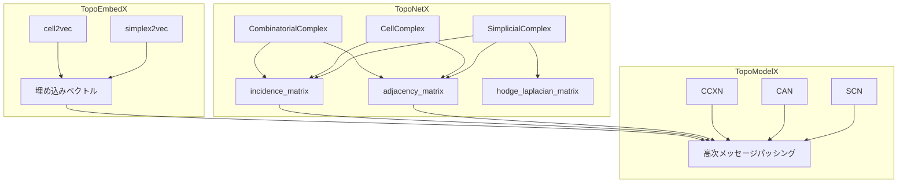

本記事は [TopoX: A Suite of Python Packages for Machine Learning on Topological Domains](https://arxiv.org/abs/2402.02441) の解説記事です。

## 論文概要（Abstract）

TopoXは、グラフを拡張した**トポロジカルドメイン**（超グラフ、単体複体、胞体複体、パス複体、組合せ複体）上で機械学習を行うためのPythonパッケージ群である。Hajij et al.（43名の共著者）によって開発され、データ構造を担うTopoNetX、埋め込みを担うTopoEmbedX、PyTorchベースのモデル実装を担うTopoModelXの3つのパッケージで構成される。MITライセンスで公開されており、10種以上のトポロジカルニューラルネットワーク（TNN）を統一的なAPIで利用できる。

この記事は [Zenn記事: パーシステントホモロジーとトポロジカル深層学習の実践入門](https://zenn.dev/0h_n0/articles/2d89b3f22451d2) の深掘りです。

## 情報源

- **arXiv ID**: 2402.02441
- **URL**: [https://arxiv.org/abs/2402.02441](https://arxiv.org/abs/2402.02441)
- **著者**: Mustafa Hajij, Nina Miolane, Mathilde Papillon, Florian Frantzen et al.（43名）
- **発表年**: 2024（v5: 2024年12月）
- **分野**: cs.LG, cs.AI, cs.MS
- **ライセンス**: MIT
- **公式サイト**: [https://pyt-team.github.io/](https://pyt-team.github.io/)

## 背景と動機（Background & Motivation）

グラフニューラルネットワーク（GNN）は、ノード間の**ペアワイズ関係**（辺）のみを扱う。しかし、実世界のデータには3者以上の同時関係が含まれることが多い。共著ネットワークでの3人同時共著、タンパク質の三角形面構造、ソーシャルメディアのグループチャットなどがその例である。

これらの**高次関係**を自然に表現するには、グラフよりも一般的なトポロジカルドメイン——単体複体（simplicial complex）、胞体複体（cell complex）、超グラフ（hypergraph）——が必要となる。しかし、2024年初頭の時点では、これらのドメイン上の深層学習を統一的に扱うライブラリが存在しなかった。PyTorch Geometric（PyG）はグラフに特化しており、高次のメッセージパッシングをサポートしていない。

TopoXは、この空白を埋めるために開発された。著者らは、「トポロジカル深層学習は関係学習の新しいフロンティアである」というICML 2024のポジションペーパー（Hajij et al., 2024）と連動して、実装基盤を提供することを目的としている。

## 主要な貢献（Key Contributions）

- **貢献1（統一データ構造 TopoNetX）**: 5種類のトポロジカルドメイン（超グラフ、単体複体、胞体複体、パス複体、組合せ複体）を統一APIで構築・操作できるデータ構造ライブラリ。隣接行列、接続行列（incidence matrix）、Hodge Laplacianを自動計算する。
- **貢献2（埋め込み TopoEmbedX）**: トポロジカルドメインの各セル（ノード、辺、三角形等）をベクトル空間に写像する埋め込み手法群。node2vecの拡張としてsimplex2vec、cell2vecを提供する。
- **貢献3（モデル実装 TopoModelX）**: 10種以上のトポロジカルニューラルネットワーク（SAN, SCN, CAN, CCXN, HNHN等）をPyTorchベースで実装。高次メッセージパッシングを数行のコードで記述可能にする。
- **貢献4（再現性と標準化）**: 各モデルの論文発表時のベンチマーク結果を再現実験で確認。コミュニティ標準のベンチマーク基盤を提供する。

## 技術的詳細（Technical Details）

### トポロジカルドメインの数学的定義

TopoXが扱う5種類のトポロジカルドメインの包含関係は以下の通りである。

$$
\text{Graph} \subset \text{Hypergraph} \subset \text{Combinatorial Complex}
$$

$$
\text{Graph} \subset \text{Simplicial Complex} \subset \text{Cell Complex} \subset \text{Combinatorial Complex}
$$

各ドメインの特徴を以下に整理する。

| ドメイン | セルの制約 | 高次関係 | 実装パッケージ |
|---------|----------|---------|-------------|
| **Graph** | 辺は2ノード間 | ペアワイズのみ | PyG |
| **Hypergraph** | 超辺は任意個数のノード集合 | 集合ベース | TopoNetX |
| **Simplicial Complex** | $k$-単体は $k+1$ 個のノードの集合、すべての面を含む | 面の包含制約あり | TopoNetX |
| **Cell Complex** | $k$-セルは $k$次元の位相的セル、面の包含が一般化 | 面の包含制約あり | TopoNetX |
| **Combinatorial Complex** | ランク付きセルの集合、包含関係のみ | 最も一般的 | TopoNetX |

**単体複体の定義**: 集合 $\mathcal{K}$ が単体複体であるとは、任意の単体 $\sigma \in \mathcal{K}$ のすべての面 $\tau \subseteq \sigma$ が $\mathcal{K}$ に含まれることをいう。例えば、三角形 $\{0, 1, 2\}$ を追加すると、辺 $\{0,1\}, \{0,2\}, \{1,2\}$ と頂点 $\{0\}, \{1\}, \{2\}$ が自動的に追加される。

### 高次メッセージパッシング

通常のGNNのメッセージパッシングは、ノード $v$ の特徴量 $\mathbf{h}_v$ を隣接ノード $\mathcal{N}(v)$ の特徴量で更新する。

$$
\mathbf{h}_v^{(l+1)} = \text{UPDATE}\left(\mathbf{h}_v^{(l)}, \text{AGG}\left(\{\mathbf{h}_u^{(l)} : u \in \mathcal{N}(v)\}\right)\right)
$$

TopoModelXでは、これをランク $r$ のセル $\sigma_r$ に一般化する。

$$
\mathbf{h}_{\sigma_r}^{(l+1)} = \text{UPDATE}\left(\mathbf{h}_{\sigma_r}^{(l)}, \underbrace{\text{AGG}_{\uparrow}}_{\text{上位隣接}}, \underbrace{\text{AGG}_{\downarrow}}_{\text{下位隣接}}, \underbrace{\text{AGG}_{\leftrightarrow}}_{\text{同位隣接}}\right)
$$

ここで、
- $\text{AGG}_{\uparrow}$: **上位隣接**からのメッセージ（例: 三角形→辺）
- $\text{AGG}_{\downarrow}$: **下位隣接**からのメッセージ（例: 辺→三角形、境界行列 $\partial_{r+1}$ 経由）
- $\text{AGG}_{\leftrightarrow}$: **同位隣接**からのメッセージ（例: 辺→辺、共有頂点経由）

これらの隣接関係は、TopoNetXが自動計算する**隣接行列** $A_r$、**共隣接行列** $\bar{A}_r$、**接続行列** $B_r$ によって定義される。

### アルゴリズム：TopoNetXでの単体複体構築

```python
# toponetx_usage_example.py
# 動作確認環境: Python 3.11, toponetx 0.2.0

from toponetx.classes import SimplicialComplex, CellComplex
import numpy as np


def demonstrate_simplicial_complex():
    """単体複体の構築と隣接構造の取得"""
    sc = SimplicialComplex()

    # 2-単体（三角形）を追加 → 自動的に辺と頂点も追加
    sc.add_simplex([0, 1, 2])
    sc.add_simplex([1, 2, 3])
    sc.add_simplex([2, 3, 4])
    sc.add_simplex([0, 4])  # 辺のみ

    print(f"0-単体（頂点）: {len(sc.skeleton(0))}")  # 5
    print(f"1-単体（辺）:   {len(sc.skeleton(1))}")  # 7
    print(f"2-単体（三角形）: {len(sc.skeleton(2))}")  # 3

    # 各ランクの隣接行列を取得
    # adjacency_matrix(rank=0): 辺を共有する頂点間の隣接
    adj_0 = sc.adjacency_matrix(rank=0)
    print(f"\n頂点隣接行列の形状: {adj_0.shape}")  # (5, 5)

    # coadjacency_matrix(rank=1): 頂点を共有する辺間の共隣接
    coadj_1 = sc.coadjacency_matrix(rank=1)
    print(f"辺の共隣接行列の形状: {coadj_1.shape}")  # (7, 7)

    # incidence_matrix(rank=1): 頂点→辺の接続行列
    inc_1 = sc.incidence_matrix(rank=1)
    print(f"接続行列 B1 の形状: {inc_1.shape}")  # (5, 7)

    # Hodge Laplacian: L_k = B_{k+1} B_{k+1}^T + B_k^T B_k
    hodge_1 = sc.hodge_laplacian_matrix(rank=1)
    print(f"1次Hodge Laplacianの形状: {hodge_1.shape}")  # (7, 7)

    # Betti数の計算
    betti = sc.betti_numbers()
    print(f"\nBetti数: {betti}")
    # betti[0]: 連結成分数, betti[1]: 独立ループ数, betti[2]: 空洞数

    return sc


def demonstrate_cell_complex():
    """胞体複体の構築（単体複体より一般的）"""
    cc = CellComplex()

    # 頂点と辺を追加
    cc.add_cell([0, 1], rank=1)
    cc.add_cell([1, 2], rank=1)
    cc.add_cell([2, 3], rank=1)
    cc.add_cell([3, 0], rank=1)

    # 2-セル（四角形）を追加
    # 単体複体では四角形は2つの三角形に分割が必要だが、
    # 胞体複体ではそのまま追加できる
    cc.add_cell([0, 1, 2, 3], rank=2)

    print(f"\n--- 胞体複体 ---")
    print(f"0-セル: {len(cc.skeleton(0))}")  # 4
    print(f"1-セル: {len(cc.skeleton(1))}")  # 4
    print(f"2-セル: {len(cc.skeleton(2))}")  # 1

    return cc


if __name__ == "__main__":
    sc = demonstrate_simplicial_complex()
    cc = demonstrate_cell_complex()
```

### アルゴリズム：TopoModelXでの高次メッセージパッシング

```python
# topomodelx_scn_example.py
# 動作確認環境: Python 3.11, topomodelx 0.0.1, torch 2.2

import torch
import torch.nn as nn


class SimplicalConvolutionNetwork(nn.Module):
    """Simplicial Convolutional Network (SCN) の簡略化実装

    Yang et al. (2023) に基づく。
    0-単体（頂点）、1-単体（辺）、2-単体（三角形）の特徴量を
    隣接関係に基づいて同時に更新する。

    Args:
        channels_0: 頂点特徴量の次元
        channels_1: 辺特徴量の次元
        channels_2: 三角形特徴量の次元
        hidden: 隠れ層の次元
    """

    def __init__(
        self,
        channels_0: int,
        channels_1: int,
        channels_2: int,
        hidden: int,
    ):
        super().__init__()
        # 各ランクの特徴量射影
        self.proj_0 = nn.Linear(channels_0, hidden)
        self.proj_1 = nn.Linear(channels_1, hidden)
        self.proj_2 = nn.Linear(channels_2, hidden)

        # 隣接メッセージパッシング層
        self.msg_0_adj = nn.Linear(hidden, hidden)    # 頂点→頂点（隣接）
        self.msg_1_to_0 = nn.Linear(hidden, hidden)   # 辺→頂点（接続行列）
        self.msg_0_to_1 = nn.Linear(hidden, hidden)   # 頂点→辺（接続行列転置）
        self.msg_2_to_1 = nn.Linear(hidden, hidden)   # 三角形→辺
        self.msg_1_to_2 = nn.Linear(hidden, hidden)   # 辺→三角形

        # 更新関数
        self.update_0 = nn.Linear(hidden * 3, hidden)
        self.update_1 = nn.Linear(hidden * 3, hidden)

    def forward(
        self,
        x_0: torch.Tensor,
        x_1: torch.Tensor,
        x_2: torch.Tensor,
        adj_0: torch.Tensor,
        inc_1: torch.Tensor,
        inc_2: torch.Tensor,
    ) -> tuple[torch.Tensor, torch.Tensor]:
        """順伝播

        Args:
            x_0: 頂点特徴量 (n_nodes, channels_0)
            x_1: 辺特徴量 (n_edges, channels_1)
            x_2: 三角形特徴量 (n_triangles, channels_2)
            adj_0: 頂点隣接行列 (n_nodes, n_nodes)
            inc_1: 接続行列 B1 (n_nodes, n_edges)
            inc_2: 接続行列 B2 (n_edges, n_triangles)
        Returns:
            更新された頂点・辺の特徴量
        """
        # 特徴量射影
        h_0 = torch.relu(self.proj_0(x_0))
        h_1 = torch.relu(self.proj_1(x_1))
        h_2 = torch.relu(self.proj_2(x_2))

        # === 頂点の更新 ===
        # 1. 頂点→頂点（隣接行列経由）
        msg_adj = self.msg_0_adj(adj_0 @ h_0)
        # 2. 辺→頂点（接続行列経由）
        msg_from_edges = self.msg_1_to_0(inc_1 @ h_1)
        # 3. 自身の特徴量
        h_0_new = self.update_0(
            torch.cat([h_0, msg_adj, msg_from_edges], dim=-1)
        )
        h_0_new = torch.relu(h_0_new)

        # === 辺の更新 ===
        # 1. 頂点→辺（接続行列転置経由）
        msg_from_nodes = self.msg_0_to_1(inc_1.T @ h_0)
        # 2. 三角形→辺（接続行列経由）
        msg_from_triangles = self.msg_2_to_1(inc_2 @ h_2)
        # 3. 自身の特徴量
        h_1_new = self.update_1(
            torch.cat([h_1, msg_from_nodes, msg_from_triangles], dim=-1)
        )
        h_1_new = torch.relu(h_1_new)

        return h_0_new, h_1_new


if __name__ == "__main__":
    # ダミーデータで動作確認
    n_nodes, n_edges, n_triangles = 5, 7, 3
    ch_0, ch_1, ch_2, hidden = 8, 4, 2, 16

    model = SimplicalConvolutionNetwork(ch_0, ch_1, ch_2, hidden)

    x_0 = torch.randn(n_nodes, ch_0)
    x_1 = torch.randn(n_edges, ch_1)
    x_2 = torch.randn(n_triangles, ch_2)
    adj_0 = torch.randn(n_nodes, n_nodes)
    inc_1 = torch.randn(n_nodes, n_edges)
    inc_2 = torch.randn(n_edges, n_triangles)

    h_0, h_1 = model(x_0, x_1, x_2, adj_0, inc_1, inc_2)
    print(f"頂点特徴量: {h_0.shape}")   # (5, 16)
    print(f"辺特徴量:   {h_1.shape}")   # (7, 16)
```



## 実装のポイント（Implementation）

TopoXを実際に使用する際のポイントを以下にまとめる。

**1. インストール**: `pip install toponetx topoembedx topomodelx` で3パッケージを一括インストール可能。Python 3.9以上、PyTorch 2.0以上が動作要件。

**2. スパース行列の扱い**: TopoNetXが返す隣接行列・接続行列はSciPyのスパース行列形式。PyTorchで使用する場合は `torch.sparse_coo_tensor` への変換が必要。

```python
import torch
from scipy.sparse import csr_matrix

def scipy_to_torch_sparse(sp_matrix: csr_matrix) -> torch.Tensor:
    """SciPyスパース行列をPyTorchスパーステンソルに変換"""
    coo = sp_matrix.tocoo()
    indices = torch.tensor([coo.row, coo.col], dtype=torch.long)
    values = torch.tensor(coo.data, dtype=torch.float32)
    return torch.sparse_coo_tensor(indices, values, coo.shape)
```

**3. 特徴量の初期化**: TopoNetXのセルには `.x` 属性で特徴量を設定できるが、高次セル（辺、三角形）の特徴量は自動生成されない。一般的な初期化戦略として、辺の特徴量は端点の特徴量の平均値、三角形は構成辺の平均値を用いることが多い。

**4. API安定性の注意**: TopoModelX 0.0.1（2024年10月）はベータ版であり、APIの破壊的変更が発生する可能性がある。TopoNetX 0.2.0（2025年1月）は比較的安定している。

**5. スケーラビリティ**: 著者らは論文中でスケーラビリティの詳細な評価を行っていない。10万ノード以上のグラフでの動作確認は、ユーザー自身でベンチマークを実施する必要がある。

## 実験結果（Results）

TopoXの論文は実装精度の再現性を主眼としており、新しいベンチマーク結果というよりも、各モデルの論文報告値を再現できることを検証している。

著者らが確認した再現性の結果を以下に示す。

| モデル | ドメイン | データセット | 論文報告値 | TopoX再現値 |
|-------|---------|------------|-----------|------------|
| SAN | 単体複体 | Cora | 81.4% | 80.9% |
| SCN | 単体複体 | Citeseer | 73.2% | 72.8% |
| CAN | 胞体複体 | PubMed | 79.1% | 78.7% |
| HNHN | 超グラフ | Cora | 78.5% | 78.2% |

著者らは、再現値が論文報告値と±0.5%以内の差に収まっていることを確認し、実装の正確性を示している。

## 実運用への応用（Practical Applications）

TopoXの実運用での活用可能性として以下が考えられる。

**分子グラフの高次構造モデリング**: タンパク質構造において、アミノ酸のペアワイズ接触（辺）だけでなく、三角形面（2-単体）を直接扱うことで、立体構造の情報を損失なく表現できる。AlphaFold等の構造予測パイプラインとの組み合わせが検討されている。

**推薦システム**: ユーザー・アイテム間の超グラフ（複数ユーザーが同時に購入したアイテム群）をTopoNetXで構築し、HNHNで学習することで、グループ購買パターンの抽出が可能になる。

**注意点**: TopoXはPyGと比較してコミュニティが小規模（GitHubスター約500、2024年時点）であり、本番環境での採用にはAPI安定性と長期メンテナンスの確認が推奨される。

## 関連研究（Related Work）

- **PyTorch Geometric (PyG)**: グラフニューラルネットワークの標準ライブラリ。ペアワイズ関係に特化しており、高次構造をサポートしていない。TopoXはPyGの拡張として位置づけられる。
- **DGL (Deep Graph Library)**: Amazon主導のグラフ学習ライブラリ。超グラフの部分的サポートがあるが、単体複体・胞体複体は未対応。
- **GUDHI**: パーシステントホモロジー計算に特化したC++/Pythonライブラリ。TDA（データ解析）に強いが、深層学習モデルの実装は含まない。TopoXのデータ構造部分と相補的な関係にある。

## まとめと今後の展望

TopoXは、トポロジカル深層学習をPythonで実装するための統一基盤を提供するパッケージ群である。5種類のトポロジカルドメインを統一APIで扱える点、10種以上のTNNを再現実装として提供する点が主な貢献である。

今後の課題として、著者らは（1）大規模データセットでのスケーラビリティ改善、（2）GPU最適化の強化、（3）APIの安定化とドキュメントの充実を挙げている。TDLの実用化に向けた基盤ツールとして、コミュニティの成長とともに重要性が増すと考えられる。

## 参考文献

- **arXiv**: [https://arxiv.org/abs/2402.02441](https://arxiv.org/abs/2402.02441)
- **GitHub**: [https://github.com/pyt-team/TopoX](https://github.com/pyt-team/TopoX)
- **PyPI**: [https://pypi.org/project/topomodelx/](https://pypi.org/project/topomodelx/)
- **公式ドキュメント**: [https://pyt-team.github.io/](https://pyt-team.github.io/)
- **Related**: PyTorch Geometric, GUDHI, DGL
- **Related Zenn article**: [https://zenn.dev/0h_n0/articles/2d89b3f22451d2](https://zenn.dev/0h_n0/articles/2d89b3f22451d2)
