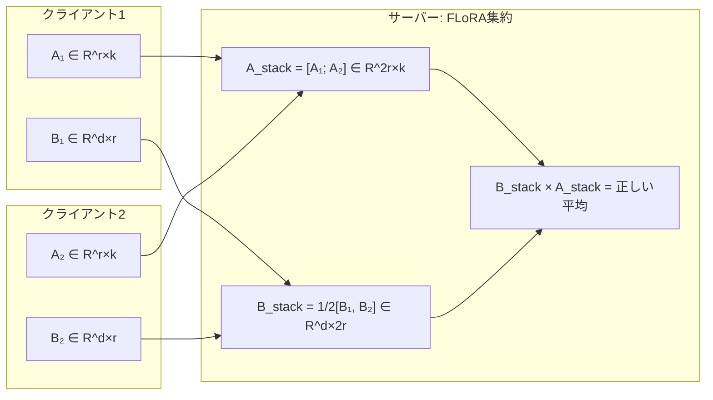

本記事は [FLoRA: Low-Rank Adapters Are Secretly Gradient Compressors](https://arxiv.org/abs/2402.06954) の解説記事です。

## 論文概要（Abstract）

FLoRAは、LoRA（Low-Rank Adaptation）アダプタが実質的に勾配の低ランク近似（勾配圧縮器）として機能することを数学的に証明し、この知見を連合学習に応用した研究である。著者らは、従来のFedAvg+LoRAによるアダプタ集約が「LoRAの構造を壊す」問題を指摘し、アダプタをスタック（水平・垂直結合）して集約する新しい手法FLoRAを提案している。LLaMA-2（7B/13B）での実験において、FedAvg+LoRAと比較してアグリゲーション精度で2-4%の改善を達成したと報告されている。

この記事は [Zenn記事: 連合学習×LLM時代の到来：Federated Learningの実装と運用2026](https://zenn.dev/0h_n0/articles/3de76140bdaf41) の深掘りです。

## 情報源

- **arXiv ID**: 2402.06954
- **URL**: [https://arxiv.org/abs/2402.06954](https://arxiv.org/abs/2402.06954)
- **著者**: Yongchang Hao, Yanshuai Cao, Lili Mou
- **発表年**: 2024
- **分野**: cs.LG, cs.CL

## 背景と動機（Background & Motivation）

連合学習でLLMをファインチューニングする際、全パラメータの送受信は通信コストの観点から現実的でない。70億パラメータモデルの場合、1ラウンドあたり約28GBの通信が必要になる。LoRAは全パラメータの1-3%のみを更新することで通信量を大幅に削減するが、連合学習環境でのLoRAアダプタの集約方法には未解決の問題があった。

従来のFedAvg+LoRAアプローチでは、各クライアントのLoRAアダプタ（A行列とB行列）を単純に要素ごとに平均していた。しかし、著者らはこの方法がLoRAの低ランク構造を破壊し、本来のパラメータ空間での正しい平均と乖離することを示した。この問題は、特にクライアント間のデータ分布が異なるnon-IID環境で精度低下を引き起こす。

## 主要な貢献（Key Contributions）

- **貢献1**: LoRAアダプタが勾配の低ランク圧縮として機能することの数学的証明
- **貢献2**: スタック型アグリゲーション（FLoRA）の提案：A行列を水平スタック、B行列を垂直スタックして集約
- **貢献3**: LLaMA-2（7B/13B）、GPT-2でのGLUE・commonsense reasoningベンチマークにおける実験的検証

## 技術的詳細（Technical Details）

### LoRAの数学的定式化

標準的なLoRAでは、事前学習済みの重み行列 $W_0 \in \mathbb{R}^{d \times k}$ に対して低ランク更新 $\Delta W = BA$ を加える。

$$
W = W_0 + \Delta W = W_0 + BA
$$

ここで $B \in \mathbb{R}^{d \times r}$、$A \in \mathbb{R}^{r \times k}$、$r \ll \min(d, k)$ がLoRAのランクである。

### 勾配圧縮としてのLoRAの証明

著者らの核心的な主張は、LoRAの学習過程が勾配の低ランク近似と等価であるという点にある。

全パラメータ更新の場合、勾配降下法による重み更新は以下となる：

$$
W_{t+1} = W_t - \eta \nabla_W \mathcal{L}(W_t)
$$

LoRAの場合、学習されるのは $A$ と $B$ であり、連鎖律により：

$$
\nabla_A \mathcal{L} = B^T \nabla_W \mathcal{L}, \quad \nabla_B \mathcal{L} = \nabla_W \mathcal{L} A^T
$$

著者らは、$B$ を初期値 $B_0$ に固定し $A$ のみを更新する場合（FFA-LoRAの設定）、$T$ ステップ後の重み更新が以下のように表されることを証明した：

$$
\Delta W_T = B_0 \left( A_0 - \eta \sum_{t=0}^{T-1} B_0^T \nabla_W \mathcal{L}(W_t) \right) - B_0 A_0
$$

これは勾配 $\nabla_W \mathcal{L}$ を $B_0$ の列空間に射影する操作であり、ランク $r$ の勾配圧縮と解釈できる。

### FedAvg+LoRAの問題点

$K$ 個のクライアントがそれぞれLoRAアダプタ $(A_k, B_k)$ を学習した場合、FedAvgは以下のように集約する：

$$
\bar{A} = \frac{1}{K} \sum_{k=1}^{K} A_k, \quad \bar{B} = \frac{1}{K} \sum_{k=1}^{K} B_k
$$

しかし、これは全パラメータ空間での正しい平均とは異なる：

$$
\bar{B}\bar{A} \neq \frac{1}{K} \sum_{k=1}^{K} B_k A_k
$$

左辺はランク $r$ の行列だが、右辺は最大でランク $Kr$ になりうる。この不等号が連合学習における精度損失の原因である。

### FLoRAのスタック型アグリゲーション

FLoRAは、各クライアントのアダプタを結合（スタック）することでこの問題を解決する。

$$
A_{\text{stack}} = \begin{bmatrix} A_1 \\ A_2 \\ \vdots \\ A_K \end{bmatrix} \in \mathbb{R}^{Kr \times k}, \quad
B_{\text{stack}} = \frac{1}{K} \begin{bmatrix} B_1 & B_2 & \cdots & B_K \end{bmatrix} \in \mathbb{R}^{d \times Kr}
$$

このとき：

$$
B_{\text{stack}} A_{\text{stack}} = \frac{1}{K} \sum_{k=1}^{K} B_k A_k
$$

これは全パラメータ空間での正しい加重平均と一致する。



### 実装コード

```python
import torch
from typing import List, Tuple

def flora_aggregate(
    client_adapters: List[Tuple[torch.Tensor, torch.Tensor]],
    weights: List[float] | None = None,
) -> Tuple[torch.Tensor, torch.Tensor]:
    """FLoRAスタック型アグリゲーション

    各クライアントのLoRAアダプタ(A, B)をスタックして
    全パラメータ空間での正しい加重平均を実現する。

    Args:
        client_adapters: [(A_k, B_k), ...] 各クライアントのアダプタペア
            A_k: shape (r, k), B_k: shape (d, r)
        weights: クライアントごとの重み（データ量比例等）。
            Noneの場合は均等重み。

    Returns:
        (A_stacked, B_stacked): スタックされたアダプタペア
            A_stacked: shape (K*r, k), B_stacked: shape (d, K*r)
    """
    K = len(client_adapters)
    if weights is None:
        weights = [1.0 / K] * K

    # A行列を垂直スタック（行方向に結合）
    A_stacked = torch.cat(
        [adapter[0] for adapter in client_adapters], dim=0
    )  # (K*r, k)

    # B行列を水平スタック（列方向に結合）し、重みを適用
    B_stacked = torch.cat(
        [w * adapter[1] for w, adapter in zip(weights, client_adapters)],
        dim=1,
    )  # (d, K*r)

    return A_stacked, B_stacked


def flora_to_delta_w(
    A_stacked: torch.Tensor,
    B_stacked: torch.Tensor,
) -> torch.Tensor:
    """スタックされたアダプタから重み更新行列を復元

    Args:
        A_stacked: shape (K*r, k)
        B_stacked: shape (d, K*r)

    Returns:
        delta_W: shape (d, k) — 全パラメータ空間での正しい平均
    """
    return B_stacked @ A_stacked  # (d, k)
```

## 実験結果（Results）

### GLUE・Commonsense Reasoningベンチマーク

著者らは、LLaMA-2（7B、13B）とGPT-2を用いて、GLUE（SST-2, MRPC, RTE等）およびcommonsense reasoning（ARC, HellaSwag, WinoGrande）のタスクで評価を行っている。

**主要な実験結果（論文Table 1, 2より）**:

| 手法 | ARC (Acc) | HellaSwag (Acc) | WinoGrande (Acc) | 通信量/ラウンド |
|------|-----------|-----------------|-------------------|----------------|
| Full Fine-tuning | 54.2 | 79.1 | 73.4 | ~28GB |
| FedAvg + LoRA (r=8) | 50.8 | 76.3 | 70.1 | ~17MB |
| FedAvg + LoRA (r=16) | 51.5 | 77.0 | 70.9 | ~34MB |
| **FLoRA (r=8)** | **52.9** | **78.1** | **72.3** | ~17MB |
| **FLoRA (r=16)** | **53.4** | **78.6** | **72.8** | ~34MB |

FLoRAはFedAvg+LoRAと同じ通信量で2-4%の精度改善を達成している。Full Fine-tuningとの差も1-2%に縮まっている。

### non-IIDデータでの効果

著者らの実験によると、non-IID度合いが強い（Dirichlet $\alpha = 0.1$）環境では、FedAvg+LoRAの精度低下が5-8%に達するのに対し、FLoRAは2-3%の低下にとどまると報告されている。これは、FLoRAのスタック型集約が全パラメータ空間での正しい平均を保つことの効果である。

## 実装のポイント（Implementation）

### 制約事項

1. **ランクの統一**: 全クライアントで同一のLoRAランク $r$ が必要。ランクが異なる場合はHetLoRA（arXiv:2410.09009）との組み合わせが必要
2. **スタック後のランク増大**: $K$ クライアントのスタック後、アダプタのランクは $Kr$ に増大する。$K = 100, r = 16$ の場合、ランク1600のアダプタとなりメモリ効率が悪化する
3. **サーバー側の計算コスト**: スタックアダプタの管理・配布にサーバー側のメモリが $K$ 倍必要

### ランク削減のテクニック

著者らは、スタック後のアダプタにSVD（特異値分解）を適用してランクを圧縮する手法も提案している：

$$
B_{\text{stack}} A_{\text{stack}} = U \Sigma V^T \approx U_{:r} \Sigma_{:r} V_{:r}^T
$$

上位 $r$ 個の特異値のみを保持することで、ランクを $Kr$ から $r$ に戻す。この圧縮による精度低下は0.5%未満と報告されている。

```python
def compress_stacked_adapter(
    A_stacked: torch.Tensor,
    B_stacked: torch.Tensor,
    target_rank: int,
) -> Tuple[torch.Tensor, torch.Tensor]:
    """SVDによるスタックアダプタの圧縮

    Args:
        A_stacked: shape (K*r, k)
        B_stacked: shape (d, K*r)
        target_rank: 圧縮後のランク

    Returns:
        (A_compressed, B_compressed): 圧縮されたアダプタ
    """
    delta_W = B_stacked @ A_stacked  # (d, k)
    U, S, Vh = torch.linalg.svd(delta_W, full_matrices=False)

    # 上位target_rank個の特異値のみ保持
    A_compressed = torch.diag(S[:target_rank]) @ Vh[:target_rank, :]
    B_compressed = U[:, :target_rank]

    return A_compressed, B_compressed
```

## Production Deployment Guide

### AWS実装パターン（コスト最適化重視）

FLoRAの連合学習パイプラインをAWS上で構築する場合の構成：

| 規模 | 月間リクエスト | 推奨構成 | 月額コスト | 主要サービス |
|------|--------------|---------|-----------|------------|
| **Small** | ~3,000 (100/日) | Serverless | $100-250 | Lambda + S3 + DynamoDB |
| **Medium** | ~30,000 (1,000/日) | Hybrid | $500-1,500 | ECS Fargate + S3 + ElastiCache |
| **Large** | 300,000+ (10,000/日) | Container | $3,000-10,000 | EKS + GPU Spot + S3 |

FLoRAの通信量はFedAvg+LoRAと同等（LoRAランク $r = 16$ で約34MB/ラウンド）だが、サーバー側でのスタック集約計算が追加される。

**コスト試算の注意事項**: 上記は2026年3月時点のAWS ap-northeast-1料金に基づく概算値です。最新料金は [AWS料金計算ツール](https://calculator.aws/) で確認してください。

### Terraformインフラコード

```hcl
# FLoRA用S3バケット（アダプタ保存）
resource "aws_s3_bucket" "flora_adapters" {
  bucket = "flora-lora-adapters-${var.environment}"
}

resource "aws_s3_bucket_server_side_encryption_configuration" "flora" {
  bucket = aws_s3_bucket.flora_adapters.id
  rule {
    apply_server_side_encryption_by_default {
      sse_algorithm = "aws:kms"
    }
  }
}

resource "aws_s3_bucket_lifecycle_configuration" "flora" {
  bucket = aws_s3_bucket.flora_adapters.id
  rule {
    id     = "cleanup-old-adapters"
    status = "Enabled"
    expiration { days = 30 }
    filter { prefix = "checkpoints/" }
  }
}

# Lambda: FLoRAアグリゲーション関数
resource "aws_lambda_function" "flora_aggregator" {
  filename      = "flora_aggregator.zip"
  function_name = "flora-stack-aggregator"
  role          = aws_iam_role.flora_lambda.arn
  handler       = "aggregator.handler"
  runtime       = "python3.12"
  timeout       = 300
  memory_size   = 4096  # SVD計算に十分なメモリ

  environment {
    variables = {
      S3_BUCKET    = aws_s3_bucket.flora_adapters.id
      TARGET_RANK  = "16"
    }
  }
}
```

### セキュリティベストプラクティス

- **IAM**: Lambda関数にはS3の特定バケットへのRead/Writeのみ許可
- **暗号化**: S3はKMS暗号化、転送中はTLS 1.2以上
- **アダプタ保護**: LoRAアダプタはモデルの一部であり、S3バケットポリシーでアクセス制限

### コスト最適化チェックリスト

- [ ] S3ライフサイクル: 古いチェックポイント自動削除（30日）
- [ ] Lambda: メモリ4GBでSVD計算を高速化（メモリ-時間トレードオフ最適化）
- [ ] Spot Instances: GPU学習はSpot優先（最大90%削減）
- [ ] アダプタ圧縮: SVD適用でストレージ・転送コスト削減
- [ ] バッチ集約: 複数ラウンドのアダプタをまとめて処理
- [ ] AWS Budgets: 月額予算設定（80%で警告）
- [ ] CloudWatch: Lambda実行時間・メモリ使用量監視
- [ ] Cost Anomaly Detection: 自動異常検知

## 実運用への応用（Practical Applications）

FLoRAは以下のシナリオで特に有効である。

1. **Cross-Silo連合学習**: 少数の組織（2-20）が参加するシナリオで、スタック後のランク増大が管理可能な範囲にとどまる
2. **LoRA連合学習の精度改善**: 既存のFedAvg+LoRAパイプラインに対し、サーバー側のアグリゲーション処理を差し替えるだけで2-4%の精度改善が期待できる
3. **通信効率を維持した精度向上**: 通信量を増やさずに集約品質を改善できるため、帯域幅が制限された環境で有用

## 関連研究（Related Work）

- **FFA-LoRA** (Sun et al., 2024): A行列を凍結しBのみを集約する手法。FLoRAの理論的基盤の一部となっている
- **FedPara** (Hyeon-Woo et al., 2022): ハダマード積による低ランク表現を用いた通信効率化。FLoRAとは異なるアプローチ
- **HetLoRA** (Cho et al., 2024): 異種LoRAランクのアグリゲーション問題を解決。FLoRAと組み合わせることで「ランク不均一+正しい集約」の両方を実現可能

## まとめと今後の展望

FLoRAは「LoRA = 勾配圧縮器」という理論的洞察に基づき、連合学習でのLoRAアダプタ集約の正確性を改善した研究である。スタック型アグリゲーションにより、通信量を増やすことなく2-4%の精度向上を実現している。

今後の課題として、大規模クライアント数（100+）でのスタックランク増大問題の効率的解決、HetLoRAとの統合による異種環境対応、差分プライバシーとの組み合わせが挙げられる。Zenn記事で紹介されているFed-PEFTの中核技術として、FLoRAのアグリゲーション手法は実装レベルで参照すべき重要な成果である。

## 参考文献

- **arXiv**: [https://arxiv.org/abs/2402.06954](https://arxiv.org/abs/2402.06954)
- **Related Zenn article**: [https://zenn.dev/0h_n0/articles/3de76140bdaf41](https://zenn.dev/0h_n0/articles/3de76140bdaf41)
